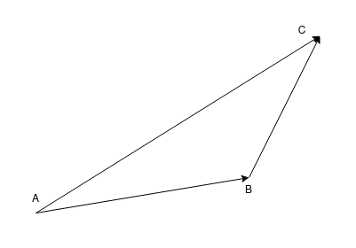

# Algebra Lineare ed Elementi di Geometria

## Introduzione

### Equazioni e Soluzioni

Che cos'è un'equazione? Un'*equazione* è una *domanda*.

$x^2+2x+1=0$

Questo è un modo di formalizzare la domanda "Qual è quel numero, che indichiamo con $x$, tale che se calcolo il numero $x^2 + 2x +1$, esso è $0$?

Una  *soluzione* è una *risposta* (corretta) alla domanda.  

Per esempio nel nostro caso abbiamo che il numero $-1$ è soluzione, perché:

$(-1)^2 + 2(-1) + 1 = 1 -2 + 1 = 0$

Dato che la quantità che otteniamo al membro sinistro dell'uguale è la medesima di quella che otteniamo a destra possiamo affermare che $-1$ è soluzione.

La teoria delle equazioni di secondo grado si dice che non ci sono altre soluzioni e che $x^2 +2x + 1 = (x+1)^2$.

Passiamo, invece, a considerare:

$3x + y -2z = 0$

**Attenzione**: Soluzione banale con $(0,0,0)$

Risolvere questa equazione significa determinare una (o tutte) le terne di numeri $(x,y,z)$ tali che, se sostituiamo tali numeri alle variabili nel membro sinistro, otteniamo zero.

**Osservazione**: nella prima equazione ci veniva chiesto di determinare *un numero* , nella seconda ogni sostituzione è costituita da *tre numeri* ; diciamo quindi che la prima equazione è in  *una variabile* , la seconda in *tre variabili*.

Una prima soluzione è data dalla scelta:  

$x=0, y=0, z=0$ ovvero dalla terna $(0,0,0)$

infatti  

$3 \cdot 0 + 1 \cdot 0 - 2 \cdot 0 = 0$

anche

$x=1,y=1,z=2$ ovvero la terna $(1,1,2)$

è soluzione, perché

$3 \cdot 1 + 1 \cdot 1 - 2 \cdot 2 = 3 + 1 -4 = 0$

Similmente, anche

0, 2, 1

è soluzione, perché

$3 \cdot 0 + 1 \cdot 2 - 2 \cdot 1 = 0 + 2 -2 = 0$

Ora accade che da queste ultime due soluzioni che abbiamo esibito possiamo costruirne altre, sfruttando le proprietà di base delle operazioni tra numeri, in particolare la proprietà associativa, commutativa e distributiva.

Più concretamente, vorrei mostrare che

$x=2,y=2,z=4$ ovvero la terna $(2,2,4)$

è anch'essa soluzione. Infatti

$3 \cdot 2 + 1 \cdot 2 - 2 \cdot 4 = 6 + 2 -8 = 0$

Però possiamo vedere la terna $(2,2,4)$ anche nel modo seguente, partiamo dalla terna $(1,1,2)$ e moltiplichiamo ogni sua entrata per 2, ottenendo appunto $(2,2,4)$ [sappiamo già che $(1,1,2)$ è soluzione].

In maniera più compatta, introduciamo la notazione

$(2,2,4) = 2 \cdot (1,1,2)$

Riprendiamo la quantità che abbiamo calcolato prima

$3 \cdot 2 + 1 \cdot 2 - 2 \cdot 4 = 3 \cdot (2 \cdot 1) + 1 \cdot (2 \cdot 1) -2 \cdot (2 \cdot 2) =$  

$= (3 \cdot 2) \cdot 1 + (1 \cdot 2) \cdot 1 -(2 \cdot 2) \cdot 2$  
per la proprietà associativa  

$= 2 \cdot (3 \cdot 1) + 2(1 \cdot 1) - 2 \cdot (2 \cdot 2)$  
per la proprietà commutativa  

$= 2 \cdot (3 \cdot 1 + 1 \cdot 1 -2 \cdot 2)$  
per la proprietà distributiva  

$= 2 \cdot 0 = 0$

$(3 \cdot 1 + 1 \cdot 1 -2 \cdot 2)$  
questa quantita è zero perché $(1,1,2)$ è soluzione.

Lo stesso ragionamento ci mostra che la terna

$(37,37,74)$ 

è soluzione, perché

$3 \cdot 37 + 1 \cdot 37 -2  \cdot 74 = 37 \cdot (3 \cdot 1 + 1 \cdot 1 - 2 \cdot 2)$

Usando la notazione di prima, possiamo dire che $(37,37,74)$ è soluzione perché 

$(37,37,74) = 37 \cdot (1,1,2)$

Generalizzando, vediamo che per ogni $\alpha \in \mathbb{R}$,  
la terna $(\alpha, \alpha, 2 \alpha) = \alpha \cdot (1,1,2)$ è soluzione.

Analizziamo ora un secondo fenomeno.  
Vorrei mostrare che la terna $(1,3,3)$ è soluzione.

Osserviamo che

$1 = 1 + 0$  
$3 = 1 + 2$  
$3 = 2 + 1$  

In una notazione più compatta scriviamo 

$(1,3,3) = (1,1,2) + (0,2,1)$

Ora calcoliamo

$3 \cdot 1 + 1 \cdot 3 - 2 \cdot 3 = 3 \cdot (1+0) + 1  \cdot (1+2) -2 \cdot (2+1)$  
$= (3 \cdot 1 + 1 \cdot 1 -2 \cdot 2) + (3 \cdot 0 + 1 \cdot 2 -2 \cdot 1)$  
$= 0$  
perché $(1,1,2)$ è soluzione

Considerando quanto abbiamo imparato, troviamo che 

- A. La terna $(0,0,0)$ è soluzione.

- B. Che $(\overline{x}, \overline{y}, \overline{z})$ è un particolare soluzione, allora per ogni $\alpha \in \mathbb{R}$ anche $\alpha \cdot (\overline{x}, \overline{y}, \overline{z})$ è soluzione.

- C. Che $(\overline{x}, \overline{y}, \overline{z})$ e $(\hat{x}, \hat{y}, \hat{z})$ sono due soluzioni, allora anche $(\overline{x}, \overline{y}, \overline{z}) + (\hat{x}, \hat{y}, \hat{z}) = (\overline{x} + \hat{x}, \overline{y} + \hat{y}, \overline{z} + \hat{z})$ è soluzione.

Consideriamo ora il sistema

$$
\begin{cases}
    \begin{align*}
        3x + 1y - 2z &= 0 \\
    - 2x - 2y + 2z &= 0 \\  
        2x + 0y - 1z &= 0
    \end{align*}
\end{cases} 
$$

Le proprietà A, B e C valgono anche in questo caso.

Ora vorrei calcolare le soluzioni di questo sistema. Per farlo usiamo un teorema chiamato "*eliminazione di Gauss*".

**Definizione**: Due sistemi si dicono **equivalenti** se hanno le stesse soluzioni.

Andremo a manipolare il sistema al fine di trovarne uno equivalente (ovvero con le stesse soluzioni) più semplicemente da risolvere, ovvero nella forma :

- un'equazione di cui compaiono tre variabili
- un'equazione di cui compaiono due variabili
- un'equazione di cui compaia una variabile

Partiamo mostrando che

$-2x -2y + 2z = 0$

è equivalente a 

$x + y -z = 0$

Il sistema diviene

$$
\begin{cases}
    \begin{align*}
        1x + 1y - 1z &= 0 \\
        3x - 1y + 2z &= 0 \\  
        2x + 0y - 1z &= 0
    \end{align*}
\end{cases}
$$

Manipolo la seconda equazione per "eliminare la x", sottraendo tre volte la prima equazione

$(3x +y -2z) -3 \cdot (x + y -z) = 0 -3 \cdot 0$  

$\cancel{3x} +y -2z \ \cancel{-3x} -3y +3x = 0$  

$-2y + z = 0$

Facciamo la stessa cosa con la terza equazione

$(2x - z) -2 \cdot (x+y-z) = 0 - 2 \cdot 0$  

$\cancel{2x} -z \ \cancel{-2x} -2y +2z = 0$  

$-2y + z = 0$  

In definitiva il sistema è equivalente a

$$
\begin{cases}
    \begin{align*}
        x + y - z &= 0 \\
        -2y + z &= 0
    \end{align*}
\end{cases}
$$

Questo sistema ci dice che se $z$ assume un valore $\alpha \in \mathbb{R}$  
allora $y$ deve essere $\frac{1}{2} \alpha$ e $x$ deve essere $\frac{1}{2} \alpha$.

Quindi le soluzioni sono della forma

$(\frac{1}{2} \alpha, \frac{1}{2} \alpha, \alpha) = \alpha \cdot (\frac{1}{2}, \frac{1}{2}, 1)$

Se ora, a partite dal sistema iniziale, estraessimo i coefficienti e li ponessimo in una tabella, otterremmo 

$$
\begin{cases}
    \begin{align*}
        3x + 1y - 2z &= 0 \\
    - 2x - 2y + 2z &= 0 \\  
        2x + 0y - 1z &= 0
    \end{align*}
\end{cases} 
$$

$$ 
\begin{bmatrix*}[r]
    3  &  1 & -2 \\
    -2 & -2 &  2 \\
    2  &  0 & -1 
\end{bmatrix*}
$$

Moltiplico per $- \frac{1}{2}$ la seconda equazione

$$ 
\begin{bmatrix*}[r]
    3  &  1 & -2 \\
    1  &  1 & -1 \\
    2  &  0 & -1 
\end{bmatrix*}
$$

Inverto la prima equazione con la seconda

$$ 
\begin{bmatrix*}[r]
    1  &  1 & -1 \\
    3  &  1 & -2 \\
    2  &  0 & -1 
\end{bmatrix*}
$$

Sottraggo dall'attuale seconda equazione la prima equazione moltiplicata per $3$

$$ 
\begin{bmatrix*}[r]
    1  &  1 & -1 \\
    0  & -2 &  1 \\
    2  &  0 & -1 
\end{bmatrix*}
$$

Sottraggo dalla terza equazione la prima moltiplicata per $2$

$$ 
\begin{bmatrix*}[r]
    1  &  1 & -1 \\
    0  & -2 &  1 \\
    0  & -2 &  1 
\end{bmatrix*}
$$

Sottraggo dalla terza equazione la seconda

$$ 
\begin{bmatrix*}[r]
    1  &  1 & -1 \\
    0  & -2 &  1 \\
    0  &  0 &  0 
\end{bmatrix*}
$$

Sono riuscito a risolvere il sistema.  
Ho utilizzato una procedura algoritmica (un algoritmo può essere eseguito da un calcolatore).  

---

### Vettori applicati e vettori liberi

Ci mettiamo nel contesto della geometria euclidea.  
Un vettore ordinato è un segmento orientato, caratterizzato dunque da:

- un punto di applicazione
- direzione 
- verso
- lunghezza (o modulo)

Un vettore applicato è determinato da una coppia ordinata $(A,B)$ di punti, in tal caso il vettore si denota $\overrightarrow{AB}$.

Per ogni punto di applicazione esiste il vettore applicato nullo \overrightarrow{AA}.

Il vettori applicati si possono sommare tra di loro, purché il punto finale del primo coincida con il punto iniziale del secondo, ovvero purché siano della forma $\overrightarrow{AB}$ e $\overrightarrow{AC}$.

Definiamo $\overrightarrow{AB} + \overrightarrow{BC} := \overrightarrow{AC}$

**Attenzione**: $B \not ={C}$, allora non sappiamo come sommare $\overrightarrow{AB}$ e $\overrightarrow{CD}$

**Osservazione**: $\overrightarrow{AB} + \overrightarrow{BB} = \overrightarrow{AB}$ e $\overrightarrow{AA} + \overrightarrow{AB} = \overrightarrow{AB}$

**Proposizione**: la somma di vettori applicati, quando possibile, soddisfa la proprietà associativa.

Nei numeri reali, la proprietà associativa della somma dice che per ogni $a,b,c \in \mathbb{R}$ vale che  

$$(a+b) + c = a + (b+c)$$

per questo motivo possiamo scrivere $a+b+c$ senza ambiguità.

**Dimostrazione**: dobbiamo dimostrare che per ogni vettore applicato $\overrightarrow{AB}, \overrightarrow{BC}, \overrightarrow{CD}$ vale che

$(\overrightarrow{AB} + \overrightarrow{BC}) + \overrightarrow{CD} = \overrightarrow{AB} + (\overrightarrow{BC} + \overrightarrow{CD})$

Ora, vale che

$(\overrightarrow{AB} + \overrightarrow{BC}) + \overrightarrow{CD} = \overrightarrow{AC} + \overrightarrow{CD} = \overrightarrow{AD}$  
$\overrightarrow{AB} + (\overrightarrow{BC} + \overrightarrow{CD}) = \overrightarrow{AB} + \overrightarrow{BD} = \overrightarrow{AD}$

**Definizione**: dato un vettore applicato AB e un numero reale $a \in \mathbb{R}$, otteniamo $a \cdot AB$ in questo modo:

- se $a=0,\ a \cdot \overrightarrow{AB} := \overrightarrow{AA}$
- se $a>0,\ a \cdot \overrightarrow{AB} :=$ vettore applicato in $A$ con *stessa direzione e stesso verso* di $\overrightarrow{AB}$ e modulo $a \cdot$ [modulo di $\overrightarrow{AB}$] (il modulo di AB si può indicare con |AB| e quindi possiamo scrivere "modulo uguale ad a\*|AB|)
- se a<0, a\*AB := vettore applicato in A con stessa direzione e verso opposto di AB e modulo uguale ad |a|\*|AB|, (ovvero in questo caso (-a)\*(|AB|)).

Per ottenere una teoria "più comprensiva" introduciamo un nuovo oggetto, i vettori liberi.

**Definizione**: due vettori applicati $\overrightarrow{AB}$ e $\overrightarrow{CD}$ si dicono **equipollenti** se e solo se $\overrightarrow{AB}$ e $\overrightarrow{CD}$ hanno la medesima direzione, il medesimo verso e il medesimo modulo (cambia il PDA).

Si verifica che quella di equipollenza è una relazione di equivalenza, ovvero essa è riflessiva, simmetrica e transitiva.

Definizione: dato un vettore applicato $\overrightarrow{AB}$, si definisce la sua classe di equipollenza 

$[\overrightarrow{AB}] := \Big\{\text{vettori applicati}\ \overrightarrow{CD}\ \text{tale che}\ \overrightarrow{AB} \equiv \overrightarrow{CD}\Big\}$ 

**Proposizione**: dai risultati della geometria euclidea segue che dato un vettore applicato $\overrightarrow{AB}$ e un punto $C$, allora esiste sempre un vettore applicato $\overrightarrow{CD}$ equipollente ad $\overrightarrow{AB}$;  
da questo segue che data una classe di equipollenza, denotato $\vec{v}$ e dato un punto $C$ nel piano, esiste dunque un vettore applicato che appartiene a $\vec{v}$ e che ha $\overrightarrow{CP}$,e punto iniziale $C$. ???

**Osservazione**: se $\overrightarrow{AB} \equiv \overrightarrow{CD}$ allora $[\overrightarrow{AB}] = [\overrightarrow{AB}]$; si dice che $\overrightarrow{AB}$ e $\overrightarrow{CD}$ sono dei **rappresentativi** della medesima classe di equipollenza.

**Definizione**: una classe di equipollenza $\vec{v}$ di vettori applicati si dice vettore libero.

**Osservazione**: tutti i vettori applicati nulli sono equipollenti e dunque formano una sola classe di equipollenza che denotiamo $\overrightarrow{O}$.

**Definizione**: dati due vettori liberi $\vec{u}$ e $\vec{v}$ definiamo la loro somma $\vec{u} + \vec{v}$ nella maniera seguente:

1. scegliamo un rappresentante $\overrightarrow{AB}$ per $\vec{u}$, ovvero $\vec{u} = [\overrightarrow{AB}]$
2. per la proposizione che abbiamo enunciato prima, possiamo scegliere un vettore applicato un $\vec{v}$ tale che il suo punto iniziale sia &B&, ovvero un vettore $\overrightarrow{BC} \in \vec{v}$, ovvero $\vec{v} = [\overrightarrow{BC}]$
3. definiamo $\vec{u} + \vec{v} := [\overrightarrow{AB} + \overrightarrow{BC}]\ (=[\overrightarrow{AC}])$

Questa costruzione è indipendente dalla scelta del rappresentante di $\vec{u}$.