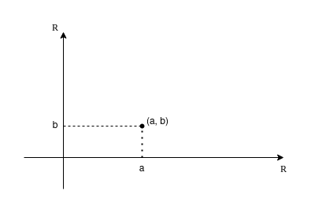
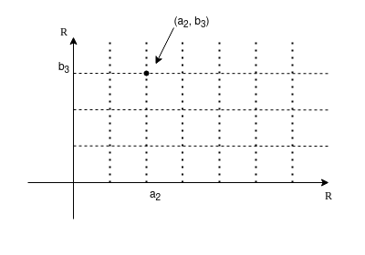
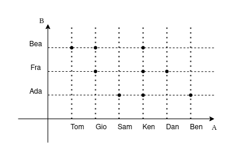
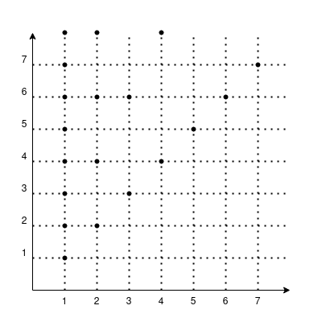
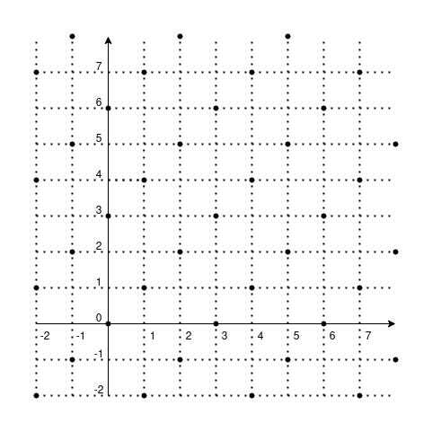

# Analisi Matematica 1

## Logica

### Proposizioni

$p,\ q,\ r,\ \dots$

Una proposizione è una parte del discorso a cui si può assegnare un valore di verità o di falsità $(V, F)$.

#### Esempio

$p:$ Giorgio è più alto di 1,80m. $\rightarrow V$  
$q:$ Roma è la capitale della Francia. $\rightarrow F$  

---

### Connettivi logici

I connettivi logici servono a costruire nuove proposizioni dalle proposizioni di partenza.

- Connettivi UNARI
  - Negazione
- Connettivi BINARI
  - Congiunzione
  - Disgiunzione
  - Implicazione
  - Doppia implicazione

### Negazione - NOT

$\neg p$  
"non p"

| $p$ | $\neg p$ |
| --- | :------: |
| V   |    F     |
| F   |    V     |

### Congiunzione - AND

$p \wedge q$  
"p e q"  

| $p$ | $q$ | $p \wedge q$ |
| --- | --- | :----------: |
| V   | V   |      V       |
| V   | F   |      F       |
| F   | V   |      F       |
| F   | F   |      F       |

### Disgiunzione - OR

$p \vee q$  
"p oppure q"  

| $p$ | $q$ | $p \vee q$ |
| --- | --- | :--------: |
| V   | V   |     V      |
| V   | F   |     V      |
| F   | V   |     V      |
| F   | F   |     F      |

> La disgiunzione non esclusiva $(XOR)$ si indica con $\veebar$ e la sua **tabella di verità** è:
> | $p$ | $q$ |  $p \veebar q$  |
> | --- | --- | :-------------: |
> | V   | V   |        F        |
> | V   | F   |        V        |
> | F   | V   |        V        |
> | F   | F   |        F        |
>
> $vel \rightarrow$ disgiunzione inclusiva  
> $aut \rightarrow$ disgiunzione esclusiva  

### Implicazione (materiale)

$p \Rightarrow q$  
**"p implica q"** oppure **"se p allora q"**

| $p$ | $q$ | $p \Rightarrow q$ |
| --- | --- | :---------------: |
| V   | V   |         V         |
| V   | F   |         F         |
| F   | V   |         V         |
| F   | F   |         V         |

#### Esempio

$p :$ piove.  
$q :$ prendo l'ombrello.  
$p \Rightarrow q :$ se piove allora prendo l'ombrello.

Voglio negarlo, quindi

$\neg(p \Rightarrow q) :$ non è vero che se piove allora prendo l'ombrello.  

*Equivale a dire*: "piove e non prendo l'ombrello."

Quindi

$\neg(p \Rightarrow q) = p \wedge \neg q$

Poiché, se è vero che

$\neg (\neg p) = p$  

allora

$\neg \Big(\neg(p \Rightarrow q)\Big) = \neg (p \wedge \neg q) =$  

per De Morgan (vedi più avanti)

$=\neg p \vee \neg (\neg q) = \neg p \vee q$  

trovando infine che

$\neg (\neg p \vee q) = p \wedge \neg q$

### Doppia implicazione

$p \Leftrightarrow q$  
**"p è equivalente a q"** oppure **"p se e solo se q"**

| $p$ | $q$ | $p \Leftrightarrow q$ |
| --- | --- | :-------------------: |
| V   | V   |           V           |
| V   | F   |           F           |
| F   | V   |           F           |
| F   | F   |           V           |

Inoltre

$p \Leftrightarrow q = (p \Rightarrow q) \wedge (q \Rightarrow p)$

| $p$ | $q$ | $p \Rightarrow q$ | $q \Rightarrow p$ | $(p \Rightarrow q) \wedge (q \Rightarrow p)$ |
| --- | --- | :---------------: | :---------------: | :------------------------------------------: |
| V   | V   |         V         |         V         |                    **V**                     |
| V   | F   |         F         |         V         |                    **F**                     |
| F   | V   |         V         |         F         |                    **F**                     |
| F   | F   |         V         |         V         |                    **V**                     |

#### Esempio

$p : \text{in un triangolo, 2 lati sono uguali.}$  
$q : \text{in un triangolo, 2 angoli sono uguali.}$  
$p \Leftrightarrow q$

---

### Tautologia

Una tautologia è una proposizione (composta) che è sempre vera.

#### tertium non datur  

$p \vee \neg p$  

| $p$ | $\neg p$ | $p \vee \neg p$ |
| --- | :------: | :-------------: |
| V   |    F     |        V        |
| V   |    F     |        V        |
| F   |    V     |        V        |
| F   |    V     |        V        |

#### non contradditio  

$\neg(p \wedge \neg p)$  

| $p$ | $\neg p$ | $p \wedge \neg p$ | $\neg(p \wedge \neg p)$ |
| --- | :------: | :---------------: | :---------------------: |
| V   |    F     |         F         |            V            |
| V   |    F     |         F         |            V            |
| F   |    V     |         F         |            V            |
| F   |    V     |         F         |            V            |

#### modus ponens  

$(p \wedge (p \Rightarrow q)) \Rightarrow p$  

| $p$ | $q$ | $p \Rightarrow q$ | $p \wedge (p \Rightarrow q)$ | $(p \wedge (p \Rightarrow q)) \Rightarrow p$ |
| --- | --- | :---------------: | :--------------------------: | :------------------------------------------: |
| V   | V   |         V         |              V               |                      V                       |
| V   | F   |         F         |              F               |                      V                       |
| F   | V   |         V         |              F               |                      V                       |
| F   | F   |         V         |              F               |                      V                       |

#### modus tollens  

$(\neg q \wedge (p \Rightarrow q)) \Rightarrow \neg p$  

| $p$ | $q$ | $\neg p$ | $\neg q$ | $p \Rightarrow q$ | $\neg q \wedge (p \Rightarrow q)$ | $(\neg q \wedge (p \Rightarrow q)) \Rightarrow \neg p$ |
| --- | --- | :------: | :------: | :---------------: | :-------------------------------: | :----------------------------------------------------: |
| V   | V   |    F     |    F     |         V         |                 F                 |                           V                            |
| V   | F   |    F     |    V     |         F         |                 F                 |                           V                            |
| F   | V   |    V     |    F     |         V         |                 F                 |                           V                            |
| F   | F   |    V     |    V     |         V         |                 V                 |                           V                            |

#### reductio ad absurdum

$\Big((p \wedge \neg q) \Rightarrow (r \wedge \neg r)\Big) \Leftrightarrow (p \Rightarrow q)$  

| $p$ | $q$ | $r$ | $\neg q$ | $\neg r$ | $p \wedge \neg q$ | $r \wedge \neg r$ | $\Big((p \wedge \neg q) \Rightarrow (r \wedge \neg r)\Big)$ | $p \Rightarrow q$ |
| --- | --- | --- | :------: | :------: | :---------------: | :---------------: | :---------------------------------------------------------: | :---------------: |
| V   | V   | V   |    F     |    F     |         F         |         F         |                            **V**                            |       **V**       |
| V   | V   | F   |    F     |    V     |         F         |         F         |                            **V**                            |       **V**       |
| V   | F   | V   |    V     |    F     |         V         |         F         |                            **F**                            |       **F**       |
| V   | F   | F   |    V     |    V     |         V         |         F         |                            **F**                            |       **F**       |
| F   | V   | V   |    F     |    F     |         F         |         F         |                            **V**                            |       **V**       |
| F   | V   | F   |    F     |    V     |         F         |         F         |                            **V**                            |       **V**       |
| F   | F   | V   |    V     |    F     |         F         |         F         |                            **V**                            |       **V**       |
| F   | F   | F   |    V     |    V     |         F         |         F         |                            **V**                            |       **V**       |

### Legge di De Morgan

$\neg (p \wedge q) = \neg p \vee \neg q$  
$\neg (p \vee q) = \neg p \wedge \neg q$  

| $p$ | $q$ | $p \wedge q$ | $\neg (p \wedge q)$ | $\neg p$ | $\neg q$ | $\neg p \vee \neg q$ |
| --- | --- | :----------: | :-----------------: | :------: | :------: | :------------------: |
| V   | V   |      V       |        **F**        |    F     |    F     |        **F**         |
| V   | F   |      F       |        **V**        |    F     |    V     |        **V**         |
| F   | V   |      F       |        **V**        |    V     |    F     |        **V**         |
| F   | F   |      F       |        **V**        |    V     |    V     |        **V**         |

---

### Predicati

"parte del nostro discorso che contende una o più variabili"

- UNARIO (1 variabile): $\mathcal{P}(x)$
- BINARIO (2 variabili): $\mathcal{Q}(x,y)$
- TERZIARIO (3 variabili): $\mathcal{S}(x,y,z)$
- $\dots$

#### Esempi

$\mathcal{P}(x) : \text{lo studente x è più alto di 1,7m.}$  
è un *predicato*

$\mathcal{P}(Pietro) = \text{Pietro è più alto di 1,7m.}$  
è una *proposizione*

$\mathcal{Q}(x,y) : \text{lo studente x è amico dello studente y.}$  
è un *predicato*

$\mathcal{Q}(Pietro,Giorgio) : \text{lo studente Pietro è amico dello studente Giorgio.}$  
è una *proposizione*

$\mathcal{S}(x,y,z) : \text{nell'ospedale x, il medico y, ha sbagliato la diagnosi z.}$

**Osservazione**: un modo per trasformare predicati in proposizioni è utilizzare i **quantificatori**.

---

### Quantificatori

$\forall$  
"per ogni"  
Quantificatore Universale

$\exists$
"esiste"
Quantificatore Esistenziale

#### Esempi

$\forall x, \mathcal{P}(x)$ è una proposizione  
significa "ogni studente è più alto di 1,7m."

$\exists x, \mathcal{P}(x)$ è una proposizione  
significa "esiste uno studente più alto di 1,7m."

$\Big(\forall x, \mathcal{Q}(x,y)\Big) = \mathcal{R}(y)$  
significa "tutti gli studenti sono amici dello studente y."

**Idea**: la variabile $x$ non è più presente.

$\exists y : \Big(\forall x, \mathcal{Q}(x,y)\Big)$  
significa "esiste uno studente amico di tutti gli studenti."

$\forall x, \exists y : \mathcal{Q}(x,y)$  
significa "ogni studente ha almeno un amico."

Voglio tradurre formalmente la frase "in ogni ospedale, esiste almeno un medico che ha sbagliato tutte le diagnosi."

Quindi scrivo

$\forall x, \exists y : \forall z, \mathcal{S}(x,y,z)$

#### Negazione di proposizioni con i quantificatori

**Osservazione**: come posso fare la negazione di una frase con i quantificatori.

**Importante**  
Per negare una proposizione con i quantificatori, occorre sostituire il *quantificatore esistenziale* con il *quantificatore universale* e viceversa, quindi la negazione si distribuisce all'interno, quindi:

- $\neg \Big(\exists x : \mathcal{P}(x)\Big)$ diventa $\forall x, \neg \Big(\mathcal{P}(x)\Big)$  
- $\neg \Big(\forall x, \mathcal{P}(x)\Big)$ diventa $\exists x: \neg \Big(\mathcal{P}(x)\Big)$  

Per esempio, prendiamo  

$\forall x, \mathcal{P}(x)$  
"ogni studente è più alto di 1,7m."

dobbiamo negarla, perciò "non è vero che ..."

**ATTENZIONE!**  
**NON è vero che**  
$\neg \Big(\forall x, \mathcal{P}(x)\Big) \neq \forall x, \neg \mathcal{P}(x)$  
poiché sarebbe
"ogni studente non è più alto di 1,7m."

#### Esempi

$\neg \Big(\forall x, \mathcal{P}(x)\Big) = \exists x : \neg \mathcal{P}(x)$  
"esiste almeno uno studente che non è più alto di 1,7m."  

Similmente

$\neg \Big(\exists y : \mathcal{T}(y)\Big) = \forall y, \neg \mathcal{T}(y)$  

Riprendiamo $\mathcal{Q}(x,y)$ e neghiamolo

$\neg \Big(\exists x : \forall x, \mathcal{Q}(x,y)\Big)$  
"*non è vero che* esiste uno studente che è amico di tutti gli studenti."  

$\neg \Big(\exists x : \mathcal{Q}(x,y)\Big) = \forall y, \neg \Big(\forall x, \mathcal{Q}(x,y)\Big) = \forall y, \exists x :\neg \mathcal{Q}$  
"ogni studente *non è amico* di almeno uno studente."

Similmente

$\neg \Big(\forall x, \exists y : \forall z, \mathcal{S}(x,y,z)\Big)$  
"*non è vero che* in ogni ospedale, esiste almeno un medico che ha sbagliato tutte le diagnosi"  

$= \exists x : \forall y, \exists z : \neg \mathcal{S}(x,y,z)$  
"esiste un ospedale in cui ogni medico ha determinato almeno una diagnosi."

#### Esempio con la definizione di limite

$\lim\limits_{x \to x_o} f(x) = l$  
$x_0, l \in \mathbb{R}$  

$\forall \varepsilon > 0, \exists \delta > 0 : \forall x \in \mathbb{E},$  
$0 < |x-x_0| < \delta \Rightarrow |f(x)-l| < \varepsilon$  

Modificando correttamente i quantificatori, la sua negazione è

$\exists \varepsilon > 0 : \forall \delta > 0, \exists x \in \mathbb{E} :$  
$\neg (0 < |x-x_0| < \delta \Rightarrow |f(x)-l| < \varepsilon)$  

Poiché prima abbiamo visto che

$\neg(p \Rightarrow q) = p \wedge \neg q$

allora la negazione diventa

$\exists \varepsilon > 0 : \forall \delta > 0, \exists x \in \mathbb{E} :$  
$0 < |x-x_0| < \delta \wedge |f(x)-l| \geq \varepsilon$

---

## Insiemistica

**Insieme** (nozione primitiva) : aggregazione, famiglia, groppo (di solito con qualche caratteristica comune) di **elementi**.

**Attenzione**  
Gli insiemi sono caratterizzati dai soli elementi.  
Due insiemi sono uguali se hanno gli stessi elementi.  

L'ordine non conta: $A = \{a,b,c\} = \{c,a,b\}$

Per esempio, l'elemento $a$ appartiene all'insieme $A$ diventa $a \in A$:

- allora $A=B \Leftrightarrow (\forall a,\ a \in A \Rightarrow a \in B) \wedge (\forall b,\ b \in B \Rightarrow b \in A)$  
- se vale solo $\forall a,\ a \in A \Rightarrow a \in B$, deduco $A \subseteq B$ (si dice "A contenuto in B" oppure "A è sottoinsieme di B")
- quindi se $A=B \Leftrightarrow A \subseteq B \wedge B \subseteq A$

Si possono rappresentare con i **diagrammi di Eulero-Venn**.

**Osservazione**: Per rappresentare un insieme:

- elencare gli elementi (**Forma estensiva**)
- fisso un insieme "universo" (**Ambiente**) e poi caratterizzo gli elementi con una proprietà (**Forma intensiva**)

#### Esempio

$A =\{n \in \mathbb{N} : n\ pari \} = \{0,2,4,6 \dots\}$

---

### Operazioni con gli insiemi

#### Insieme complementare (o insieme complemento)

$U$ è l'insieme universo  
$A$ è l'insieme  

$\mathscr{C}_U A = \{x \in U : x \notin U\} = \{x \in U : \neg (x \in U)\}$

> L'insieme complemento si può scrivere anche $\overline{A}$.

#### Intersezione

$A \cap B = \{x \in U : x \in A \wedge x \in B\}$

#### Unione

$A \cup B = \{x \in U : x \in A \vee x \in B\}$  

#### Qualche proprietà

$A \cap B = B \cap A$  
$A \cup B = B \cup A$  

$(A \cap B) \cap C = A \cap (B \cap C)$  
$(A \cup B) \cup C = A \cup (B \cup C)$  

$A \cap (B \cup C) = (A \cap B) \cup (A \cap C)$  
$A \cup (B \cap C) = (A \cup B) \cap (A \cup C)$  

---

### Insieme vuoto

Esiste un insieme (speciale) che è senza elementi, chiamato *insieme vuoto*, indicato con $\emptyset$ (**unico** e $\forall A, \emptyset \subseteq A$).

---

### Insieme delle parti

$\mathcal{P}(A)$ è l'insieme dei sottoinsiemi di A

#### Esempio

Sia

$A = \{a,b,c\}$  

allora

$\mathcal{P}(A) = \{\emptyset, \{a\}, \{b\}, \{c\}, \{a,b\}, \{b,c\}, \{a,c\}, \{a,b,c\}\}$  

Tutti i sottoinsiemi si dicono **propri**, tranne l'insieme $\{a,b,c\}$, detto **improprio**.

#### Il numero di elementi di $\mathcal{P}(A)$ è $2^n$

$|\mathcal{P}(A)| = 2^n$

con

$|A| =$ numero di elementi in $A$

Per esempio, se prendiamo l'insieme $A = \{a,b,c,d,e,f\}$,  
possiamo rappresentare il sottoinsieme $S = \{a,d,e\}$ così:

|   a   |   b   |   c   |   d   |   e   |   f   |
| :---: | :---: | :---: | :---: | :---: | :---: |
|   1   |   0   |   0   |   1   |   1   |   0   |

Dove inserisco $1$ se l'elemento è presente o $0$ se è assente.  

Un altro esempio è  
$\emptyset = \{\}$  corrisponde a $(0,0,0,0,0,0)$

In questo modo, vediamo che tutte le possibilità sono rappresentabili da un numero binario di lunghezza $|A|$, quindi $2^n$ in decimale.  

---

### Coppie ordinate e prodotto cartesiano

Una *coppia ordinata* è un aggregato con due elementi in cui si distingue il primo elemento e il secondo elemento.  

$(a,b) \neq \{a,b\}$  

$\{a,b\} = \{b,a\}$  

$(a,b) = (a',b') \Leftrightarrow a=a', b=b'$

$(a,b) \neq (b,a)$  
a meno che $a=b$

**Definizione**:  
Siano $A,B$ insiemi,  
$A \times B = \{(a,b) : a \in A, b\in B \}$  
è detto insieme *prodotto cartesiano di $A$ e $B$*.

Anche il *piano cartesiano* è un prodotto cartesiano

$\Pi = \{(a,b) : a \in \mathbb{R}, b \in \mathbb{R}\}$

in questo caso $A=B=\mathbb{R}$, quindi

$\mathbb{R} \times \mathbb{R} = \mathbb{R}^2$

Similmente

$A \times B \times C = \{(a,b,c) : a \in A, b \in B, c \in C\}$

$\mathbb{R}^3 = \{(x,y,a) : x,y,z \in \mathbb{R}\}$  
nello spazio a tre dimensioni

$\mathbb{R}^n = \{(x_1,x_2,x_3, \dots, x_n) : x_1,x_2,x_3, \dots, x_n \in \mathbb{R}\}$  
n-upla, tupla ordinata (vettore)

$A = \{a_1,a_2,a_3,a_4,a_5\}$  
$B = \{b_1,b_2,b_3,b_4\}$

$A \times B = \{(a_i,b_j) : i = (1,2,3,4,5),\ j = (1,2,3,4)\}$  

**Osservazione**:  
numeri divisibili per $3 = \{n \in \mathbb{N} : \exists k \in \mathbb{N} : (n = 3k)\} = \{n \in \mathbb{N} : \mathcal{P}(n)\}$  
con $\mathcal{P}(n) = \exists k \in \mathbb{N} : (n = 3k)$  
la variabile $k$, preceduta dal quantificatore esistenziale, è **muta**.

I predicati binari sono quelli giusti per i prodotti cartesiani.

Indicando in $A \times B$ l'insieme delle coppie che soddisfano $\mathcal{P}(x,y) \rightarrow$ *predicato binario*  

#### Esempio

$A = \{$ragazzi in quest'aula$\}$  
$B = \{$ragazze in quest'aula$\}$

$\mathcal{P}(x) :$ $x$ è amico di $y$  
*Relazione* di "amicizia" tra due insiemi

---

## Relazioni

**Definizione**:  
*Relazione* tra $A$ e $B =$ predicato $\mathcal{P}(x)$ a valori in $A \times B$.  
(se $A=B$, parliamo di relazione su $A$)

#### Esempio

$A = \mathbb{N} \setminus \{0\} = \{1,2,3, \dots\}$  

Decidiamo che $n | m$ significa "n divide m", introducendo la relazione "$|$ divide".

Per esempio, 3 divide 12, ma 3 non divide 5, poiché $\nexists k \in \mathbb{Z} : 3k=5$.

#### Grafico della relazione

#### Esempio

$A = \mathbb{Z} = \{\dots,-3,-2,-1,0,1,2,3,\dots\}$  
$m = 3$ (è il modulo in base 3)

$x$ è in relazione con $y$  
se $\exists k \in \mathbb{Z} : x-y=3k$  

cioè 2 numeri sono in relazione se la loro differenza è un multiplo di 3.

Si chiama **congruenza modulo 3**, indicata con $m \equiv_3 n$.

---

### Proprietà delle relazioni

**Definizione**:  
Sia $A$ un insieme, sia $\rho$ una relazione su $A$,  
allora $x \rho y$

- si dice **riflessiva** se $\forall x \in A, x \rho x$
- si dice **simmetrica** se $\forall x,y \in A, x \rho y \Rightarrow y \rho x$
- si dice **transitiva** se $\forall x,y,z \in A, x \rho y \wedge y \rho z \Rightarrow x \rho z$

#### Esempio

La relazione divide è transitiva:

$x|y \wedge y|z \xRightarrow{?} x|z$

$x|y \Leftrightarrow \exists k_1 : y = k_1 \cdot x$  
$y|z \Leftrightarrow \exists k_2 : z = k_2 \cdot y = k_2 \cdot (k_1 \cdot x) =$

$x|z$ quindi è vero perché, se $k_3 = k_1 \cdot k_2$ allora $z = k_3 \cdot x$.  

$\square$  

La relazione congruenza modulo m è transitiva:

$x,y,z \in \mathbb{Z}$

$x \equiv_m y \wedge y \equiv_m z \xRightarrow{?} x \equiv_m z$

$\exists k_1 \in \mathbb{Z} : x-y= k_1 \cdot m$  
$\exists k_2 \in \mathbb{Z} : y-z= k_2 \cdot m$  

$x \equiv_m z$ quindi è vero perché, se $k_3 = k_1 \cdot k_2$,  
allora $x-z = k_1 \cdot m + k_2 \cdot m = (k_1 + k_2)m = k_3 \cdot m$.  

$\square$  

**Definizione**:  
$A$ insieme, $\rho$ relazione

$\rho$ si dice **antisimmetrica** se  

$\forall x,y \in A, x \rho y \wedge y \rho x \Rightarrow x=y$

#### Esempio

La relazione divide è antisimmetrica se e solo se

$\forall x,y \in \mathbb{N} \setminus \{0\}, x | y \wedge y | x \Rightarrow x=y$

Dimostriamolo partendo da

$x|y \Leftrightarrow \exists k_1 : y = k_1 \cdot x$  
$y|x \Leftrightarrow \exists k_2 : x = k_2 \cdot y \Leftrightarrow \exists k_2 : y = \frac{x}{k_2}$

quindi

$k_1 \cdot x = \frac{x}{k_2}$

che equivale a

$k_1 \cdot k_2 \cdot x - x = 0$

quindi

$(k_1 \cdot k_2 - 1) \cdot x = 0$

per la legge dell'annullamento del prodotto

o $k_1 \cdot k_2 - 1 = 0$ o $x = 0$

ma poiché $x \in \mathbb{N} \setminus \{0\}$

allora

$k_1 \cdot k_2 = 1$

poiché $k_1, k_2 \in \mathbb{N}$, allora

$k = k_1 = k_2 = 1$

e se l'unica soluzione è $k = +1$

allora $x=y$.

$\square$

---

### Relazione d'ordine

**Definizione**:  
$A$ insieme, $\rho$ relazione  
se $\rho$ è riflessiva, antisimmetrica e transitiva  
$\rho$ si dice *relazione d'ordine* o *ordinamento*.  
Con $(A, \rho)$ **insieme ordinato**.

Per esempio $\mathbb{R}$ con la relazione $\geq$.

---

### Relazione di equivalenza

**Definizione**:  
$A$ insieme, $\rho$ relazione  
se $\rho$ è riflessiva, simmetrica e transitiva  
$\rho$ si dice *relazione di equivalenza*.

---

### Classe di equivalenza

$A$ insieme, $\rho$ relazione di equivalenza  
chiamo $[a]_\rho = \{b \in A : a \rho b\}$  
cioè tutti gli elementi in relazione con $a$.  

#### Esempio

$[0]_{\equiv_3} = \{\dots, -9, -6, -3, +0, +3, +6, +9, \dots\}$

$[1]_{\equiv_3} = \{\dots, -5, -2, +1, +3, +7, +10, +13, \dots\}$

$[2]_{\equiv_3} = \{\dots, -7, -4, -1, +2, +5, +8, +11, \dots\}$

$[0]_{\equiv_3} = [3]{\equiv_3} = [6]{\equiv_3} = \dots$

$[1]_{\equiv_3} = [4]_{\equiv_3} = [7]_{\equiv_3} = \dots$

$[2]_{\equiv_3} = [5]_{\equiv_3} = [8]_{\equiv_3} = \dots$

L'insieme delle classi di equivalenza di dice  
**insieme quoziente rispetto all'equivalenza**.

Si indica con 

$^{A}/_{\rho}$

per esempio

$^{\mathbb{Z}}/_{\equiv_3} = \{[0]_{\equiv_3}, [1]_{\equiv_3}, [2]_{\equiv_3}\}$

---

## Funzioni
