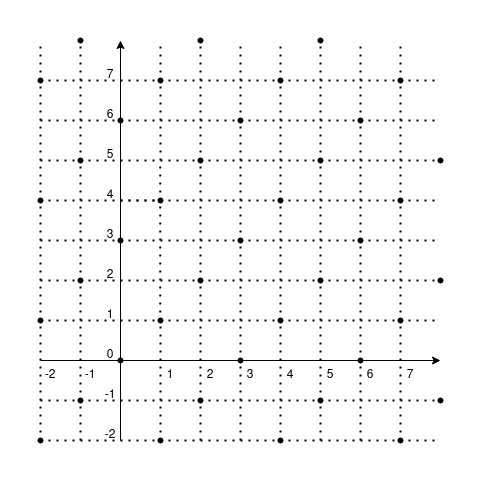

# Analisi Matematica 1

## Logica

### Proposizioni

$p,\ q,\ r,\ \dots$

Una proposizione è una parte del discorso a cui si può assegnare un valore di verità o di falsità $(V, F)$.

#### Esempio

$p:$ Giorgio è più alto di 1,80m. $\rightarrow V$  
$q:$ Roma è la capitale della Francia. $\rightarrow F$  

---

### Connettivi logici

I connettivi logici servono a costruire nuove proposizioni dalle proposizioni di partenza.

- Connettivi UNARI
  - Negazione
- Connettivi BINARI
  - Congiunzione
  - Disgiunzione
  - Implicazione
  - Doppia implicazione

### Negazione - NOT

$\neg p$  
"non p"

| $p$ | $\neg p$ |
| --- | :------: |
| V   |    F     |
| F   |    V     |

### Congiunzione - AND

$p \wedge q$  
"p e q"  

| $p$ | $q$ | $p \wedge q$ |
| --- | --- | :----------: |
| V   | V   |      V       |
| V   | F   |      F       |
| F   | V   |      F       |
| F   | F   |      F       |

### Disgiunzione - OR

$p \vee q$  
"p oppure q"  

| $p$ | $q$ | $p \vee q$ |
| --- | --- | :--------: |
| V   | V   |     V      |
| V   | F   |     V      |
| F   | V   |     V      |
| F   | F   |     F      |

> La disgiunzione non esclusiva $(XOR)$ si indica con $\veebar$ e la sua **tabella di verità** è:
> | $p$ | $q$ |  $p \veebar q$  |
> | --- | --- | :-------------: |
> | V   | V   |        F        |
> | V   | F   |        V        |
> | F   | V   |        V        |
> | F   | F   |        F        |
>
> $vel \rightarrow$ disgiunzione inclusiva  
> $aut \rightarrow$ disgiunzione esclusiva  

### Implicazione (materiale)

$p \Rightarrow q$  
**"p implica q"** oppure **"se p allora q"**

| $p$ | $q$ | $p \Rightarrow q$ |
| --- | --- | :---------------: |
| V   | V   |         V         |
| V   | F   |         F         |
| F   | V   |         V         |
| F   | F   |         V         |

#### Esempio

$p :$ piove.  
$q :$ prendo l'ombrello.  
$p \Rightarrow q :$ se piove allora prendo l'ombrello.

Voglio negarlo, quindi

$\neg(p \Rightarrow q) :$ non è vero che se piove allora prendo l'ombrello.  

*Equivale a dire*: "piove e non prendo l'ombrello."

Quindi

$\neg(p \Rightarrow q) = p \wedge \neg q$

Poiché, se è vero che

$\neg (\neg p) = p$  

allora

$\neg \Big(\neg(p \Rightarrow q)\Big) = \neg (p \wedge \neg q) =$  

per De Morgan (vedi più avanti)

$=\neg p \vee \neg (\neg q) = \neg p \vee q$  

trovando infine che

$\neg (\neg p \vee q) = p \wedge \neg q$

### Doppia implicazione

$p \Leftrightarrow q$  
**"p è equivalente a q"** oppure **"p se e solo se q"**

| $p$ | $q$ | $p \Leftrightarrow q$ |
| --- | --- | :-------------------: |
| V   | V   |           V           |
| V   | F   |           F           |
| F   | V   |           F           |
| F   | F   |           V           |

Inoltre

$p \Leftrightarrow q = (p \Rightarrow q) \wedge (q \Rightarrow p)$

| $p$ | $q$ | $p \Rightarrow q$ | $q \Rightarrow p$ | $(p \Rightarrow q) \wedge (q \Rightarrow p)$ |
| --- | --- | :---------------: | :---------------: | :------------------------------------------: |
| V   | V   |         V         |         V         |                    **V**                     |
| V   | F   |         F         |         V         |                    **F**                     |
| F   | V   |         V         |         F         |                    **F**                     |
| F   | F   |         V         |         V         |                    **V**                     |

#### Esempio

$p : \text{in un triangolo, 2 lati sono uguali.}$  
$q : \text{in un triangolo, 2 angoli sono uguali.}$  
$p \Leftrightarrow q$

---

### Tautologia

Una tautologia è una proposizione (composta) che è sempre vera.

#### tertium non datur  

$p \vee \neg p$  

| $p$ | $\neg p$ | $p \vee \neg p$ |
| --- | :------: | :-------------: |
| V   |    F     |        V        |
| V   |    F     |        V        |
| F   |    V     |        V        |
| F   |    V     |        V        |

#### non contradditio  

$\neg(p \wedge \neg p)$  

| $p$ | $\neg p$ | $p \wedge \neg p$ | $\neg(p \wedge \neg p)$ |
| --- | :------: | :---------------: | :---------------------: |
| V   |    F     |         F         |            V            |
| V   |    F     |         F         |            V            |
| F   |    V     |         F         |            V            |
| F   |    V     |         F         |            V            |

#### modus ponens  

$(p \wedge (p \Rightarrow q)) \Rightarrow p$  

| $p$ | $q$ | $p \Rightarrow q$ | $p \wedge (p \Rightarrow q)$ | $(p \wedge (p \Rightarrow q)) \Rightarrow p$ |
| --- | --- | :---------------: | :--------------------------: | :------------------------------------------: |
| V   | V   |         V         |              V               |                      V                       |
| V   | F   |         F         |              F               |                      V                       |
| F   | V   |         V         |              F               |                      V                       |
| F   | F   |         V         |              F               |                      V                       |

#### modus tollens  

$(\neg q \wedge (p \Rightarrow q)) \Rightarrow \neg p$  

| $p$ | $q$ | $\neg p$ | $\neg q$ | $p \Rightarrow q$ | $\neg q \wedge (p \Rightarrow q)$ | $(\neg q \wedge (p \Rightarrow q)) \Rightarrow \neg p$ |
| --- | --- | :------: | :------: | :---------------: | :-------------------------------: | :----------------------------------------------------: |
| V   | V   |    F     |    F     |         V         |                 F                 |                           V                            |
| V   | F   |    F     |    V     |         F         |                 F                 |                           V                            |
| F   | V   |    V     |    F     |         V         |                 F                 |                           V                            |
| F   | F   |    V     |    V     |         V         |                 V                 |                           V                            |

#### reductio ad absurdum

$\Big((p \wedge \neg q) \Rightarrow (r \wedge \neg r)\Big) \Leftrightarrow (p \Rightarrow q)$  

| $p$ | $q$ | $r$ | $\neg q$ | $\neg r$ | $p \wedge \neg q$ | $r \wedge \neg r$ | $\Big((p \wedge \neg q) \Rightarrow (r \wedge \neg r)\Big)$ | $p \Rightarrow q$ |
| --- | --- | --- | :------: | :------: | :---------------: | :---------------: | :---------------------------------------------------------: | :---------------: |
| V   | V   | V   |    F     |    F     |         F         |         F         |                            **V**                            |       **V**       |
| V   | V   | F   |    F     |    V     |         F         |         F         |                            **V**                            |       **V**       |
| V   | F   | V   |    V     |    F     |         V         |         F         |                            **F**                            |       **F**       |
| V   | F   | F   |    V     |    V     |         V         |         F         |                            **F**                            |       **F**       |
| F   | V   | V   |    F     |    F     |         F         |         F         |                            **V**                            |       **V**       |
| F   | V   | F   |    F     |    V     |         F         |         F         |                            **V**                            |       **V**       |
| F   | F   | V   |    V     |    F     |         F         |         F         |                            **V**                            |       **V**       |
| F   | F   | F   |    V     |    V     |         F         |         F         |                            **V**                            |       **V**       |

### Legge di De Morgan

$\neg (p \wedge q) = \neg p \vee \neg q$  
$\neg (p \vee q) = \neg p \wedge \neg q$  

| $p$ | $q$ | $p \wedge q$ | $\neg (p \wedge q)$ | $\neg p$ | $\neg q$ | $\neg p \vee \neg q$ |
| --- | --- | :----------: | :-----------------: | :------: | :------: | :------------------: |
| V   | V   |      V       |        **F**        |    F     |    F     |        **F**         |
| V   | F   |      F       |        **V**        |    F     |    V     |        **V**         |
| F   | V   |      F       |        **V**        |    V     |    F     |        **V**         |
| F   | F   |      F       |        **V**        |    V     |    V     |        **V**         |

---

### Predicati

"parte del nostro discorso che contende una o più variabili"

- UNARIO (1 variabile): $\mathcal{P}(x)$
- BINARIO (2 variabili): $\mathcal{Q}(x,y)$
- TERZIARIO (3 variabili): $\mathcal{S}(x,y,z)$
- $\dots$

#### Esempi

$\mathcal{P}(x) : \text{lo studente x è più alto di 1,7m.}$  
è un *predicato*

$\mathcal{P}(Pietro) = \text{Pietro è più alto di 1,7m.}$  
è una *proposizione*

$\mathcal{Q}(x,y) : \text{lo studente x è amico dello studente y.}$  
è un *predicato*

$\mathcal{Q}(Pietro,Giorgio) : \text{lo studente Pietro è amico dello studente Giorgio.}$  
è una *proposizione*

$\mathcal{S}(x,y,z) : \text{nell'ospedale x, il medico y, ha sbagliato la diagnosi z.}$

**Osservazione**: un modo per trasformare predicati in proposizioni è utilizzare i **quantificatori**.

---

### Quantificatori

$\forall$  
"per ogni"  
Quantificatore Universale

$\exists$
"esiste"
Quantificatore Esistenziale

#### Esempi

$\forall x, \mathcal{P}(x)$ è una proposizione  
significa "ogni studente è più alto di 1,7m."

$\exists x, \mathcal{P}(x)$ è una proposizione  
significa "esiste uno studente più alto di 1,7m."

$\Big(\forall x, \mathcal{Q}(x,y)\Big) = \mathcal{R}(y)$  
significa "tutti gli studenti sono amici dello studente y."

**Idea**: la variabile $x$ non è più presente.

$\exists y : \Big(\forall x, \mathcal{Q}(x,y)\Big)$  
significa "esiste uno studente amico di tutti gli studenti."

$\forall x, \exists y : \mathcal{Q}(x,y)$  
significa "ogni studente ha almeno un amico."

Voglio tradurre formalmente la frase "in ogni ospedale, esiste almeno un medico che ha sbagliato tutte le diagnosi."

Quindi scrivo

$\forall x, \exists y : \forall z, \mathcal{S}(x,y,z)$

#### Negazione di proposizioni con i quantificatori

**Osservazione**: come posso fare la negazione di una frase con i quantificatori.

**Importante**  
Per negare una proposizione con i quantificatori, occorre sostituire il *quantificatore esistenziale* con il *quantificatore universale* e viceversa, quindi la negazione si distribuisce all'interno, quindi:

- $\neg \Big(\exists x : \mathcal{P}(x)\Big)$ diventa $\forall x, \neg \Big(\mathcal{P}(x)\Big)$  
- $\neg \Big(\forall x, \mathcal{P}(x)\Big)$ diventa $\exists x: \neg \Big(\mathcal{P}(x)\Big)$  

Per esempio, prendiamo  

$\forall x, \mathcal{P}(x)$  
"ogni studente è più alto di 1,7m."

dobbiamo negarla, perciò "non è vero che ..."

**ATTENZIONE!**  
**NON è vero che**  
$\neg \Big(\forall x, \mathcal{P}(x)\Big) \neq \forall x, \neg \mathcal{P}(x)$  
poiché sarebbe
"ogni studente non è più alto di 1,7m."

#### Esempi

$\neg \Big(\forall x, \mathcal{P}(x)\Big) = \exists x : \neg \mathcal{P}(x)$  
"esiste almeno uno studente che non è più alto di 1,7m."  

Similmente

$\neg \Big(\exists y : \mathcal{T}(y)\Big) = \forall y, \neg \mathcal{T}(y)$  

Riprendiamo $\mathcal{Q}(x,y)$ e neghiamolo

$\neg \Big(\exists x : \forall x, \mathcal{Q}(x,y)\Big)$  
"*non è vero che* esiste uno studente che è amico di tutti gli studenti."  

$\neg \Big(\exists x : \mathcal{Q}(x,y)\Big) = \forall y, \neg \Big(\forall x, \mathcal{Q}(x,y)\Big) = \forall y, \exists x :\neg \mathcal{Q}$  
"ogni studente *non è amico* di almeno uno studente."

Similmente

$\neg \Big(\forall x, \exists y : \forall z, \mathcal{S}(x,y,z)\Big)$  
"*non è vero che* in ogni ospedale, esiste almeno un medico che ha sbagliato tutte le diagnosi"  

$= \exists x : \forall y, \exists z : \neg \mathcal{S}(x,y,z)$  
"esiste un ospedale in cui ogni medico ha determinato almeno una diagnosi."

#### Esempio con la definizione di limite

$\lim\limits_{x \to x_o} f(x) = l$  
$x_0, l \in \mathbb{R}$  

$\forall \varepsilon > 0, \exists \delta > 0 : \forall x \in \mathbb{E},$  
$0 < |x-x_0| < \delta \Rightarrow |f(x)-l| < \varepsilon$  

Modificando correttamente i quantificatori, la sua negazione è

$\exists \varepsilon > 0 : \forall \delta > 0, \exists x \in \mathbb{E} :$  
$\neg (0 < |x-x_0| < \delta \Rightarrow |f(x)-l| < \varepsilon)$  

Poiché prima abbiamo visto che

$\neg(p \Rightarrow q) = p \wedge \neg q$

allora la negazione diventa

$\exists \varepsilon > 0 : \forall \delta > 0, \exists x \in \mathbb{E} :$  
$0 < |x-x_0| < \delta \wedge |f(x)-l| \geq \varepsilon$

---

## Insiemistica

### Cos'è un insieme

**Insieme** (nozione primitiva) : aggregazione, famiglia, groppo (di solito con qualche caratteristica comune) di **elementi**.

**Attenzione**  
Gli insiemi sono caratterizzati dai soli elementi.  
Due insiemi sono uguali se hanno gli stessi elementi.  

L'ordine non conta: $A = \{a,b,c\} = \{c,a,b\}$

Per esempio, l'elemento $a$ appartiene all'insieme $A$ diventa $a \in A$:

- allora $A=B \Leftrightarrow (\forall a,\ a \in A \Rightarrow a \in B) \wedge (\forall b,\ b \in B \Rightarrow b \in A)$  
- se vale solo $\forall a,\ a \in A \Rightarrow a \in B$, deduco $A \subseteq B$ (si dice "A contenuto in B" oppure "A è sottoinsieme di B")
- quindi se $A=B \Leftrightarrow A \subseteq B \wedge B \subseteq A$

Si possono rappresentare con i **diagrammi di Eulero-Venn**.

**Osservazione**: Per rappresentare un insieme:

- elencare gli elementi (**Forma estensiva**)
- fisso un insieme "universo" (**Ambiente**) e poi caratterizzo gli elementi con una proprietà (**Forma intensiva**)

#### Esempio

$A =\{n \in \mathbb{N} : n\ pari \} = \{0,2,4,6 \dots\}$

---

### Operazioni con gli insiemi

#### Insieme complementare (o insieme complemento)

$U$ è l'insieme universo  
$A$ è l'insieme  

$\mathscr{C}_U A = \{x \in U : x \notin U\} = \{x \in U : \neg (x \in U)\}$

> L'insieme complemento si può scrivere anche $\overline{A}$.

#### Intersezione

$A \cap B = \{x \in U : x \in A \wedge x \in B\}$

#### Unione

$A \cup B = \{x \in U : x \in A \vee x \in B\}$  

#### Qualche proprietà

$A \cap B = B \cap A$  
$A \cup B = B \cup A$  

$(A \cap B) \cap C = A \cap (B \cap C)$  
$(A \cup B) \cup C = A \cup (B \cup C)$  

$A \cap (B \cup C) = (A \cap B) \cup (A \cap C)$  
$A \cup (B \cap C) = (A \cup B) \cap (A \cup C)$  

---

### Insieme vuoto

Esiste un insieme (speciale) che è senza elementi, chiamato *insieme vuoto*, indicato con $\emptyset$ (**unico** e $\forall A, \emptyset \subseteq A$).

---

### Insieme delle parti

$\mathcal{P}(A)$ è l'insieme dei sottoinsiemi di A

#### Esempio

Sia

$A = \{a,b,c\}$  

allora

$\mathcal{P}(A) = \{\emptyset, \{a\}, \{b\}, \{c\}, \{a,b\}, \{b,c\}, \{a,c\}, \{a,b,c\}\}$  

Tutti i sottoinsiemi si dicono **propri**, tranne l'insieme $\{a,b,c\}$, detto **improprio**.

#### Il numero di elementi di $\mathcal{P}(A)$ è $2^n$

$|\mathcal{P}(A)| = 2^n$

con

$|A| =$ numero di elementi in $A$

Per esempio, se prendiamo l'insieme $A = \{a,b,c,d,e,f\}$,  
possiamo rappresentare il sottoinsieme $S = \{a,d,e\}$ così:

|   a   |   b   |   c   |   d   |   e   |   f   |
| :---: | :---: | :---: | :---: | :---: | :---: |
|   1   |   0   |   0   |   1   |   1   |   0   |

Dove inserisco $1$ se l'elemento è presente o $0$ se è assente.  

Un altro esempio è  
$\emptyset = \{\}$  corrisponde a $(0,0,0,0,0,0)$

In questo modo, vediamo che tutte le possibilità sono rappresentabili da un numero binario di lunghezza $|A|$, quindi $2^n$ in decimale.  

---

### Coppie ordinate e prodotto cartesiano

Una *coppia ordinata* è un aggregato con due elementi in cui si distingue il primo elemento e il secondo elemento.  

$(a,b) \neq \{a,b\}$  

$\{a,b\} = \{b,a\}$  

$(a,b) = (a',b') \Leftrightarrow a=a', b=b'$

$(a,b) \neq (b,a)$  
a meno che $a=b$

**Definizione**:  
Siano $A,B$ insiemi,  
$A \times B = \{(a,b) : a \in A, b\in B \}$  
è detto insieme *prodotto cartesiano di $A$ e $B$*.

Anche il *piano cartesiano* è un prodotto cartesiano

$\Pi = \{(a,b) : a \in \mathbb{R}, b \in \mathbb{R}\}$

in questo caso $A=B=\mathbb{R}$, quindi

$\mathbb{R} \times \mathbb{R} = \mathbb{R}^2$

Similmente

$A \times B \times C = \{(a,b,c) : a \in A, b \in B, c \in C\}$

$\mathbb{R}^3 = \{(x,y,a) : x,y,z \in \mathbb{R}\}$  
nello spazio a tre dimensioni

$\mathbb{R}^n = \{(x_1,x_2,x_3, \dots, x_n) : x_1,x_2,x_3, \dots, x_n \in \mathbb{R}\}$  
n-upla, tupla ordinata (vettore)

$A = \{a_1,a_2,a_3,a_4,a_5\}$  
$B = \{b_1,b_2,b_3,b_4\}$

$A \times B = \{(a_i,b_j) : i = (1,2,3,4,5),\ j = (1,2,3,4)\}$  

**Osservazione**:  
numeri divisibili per $3 = \{n \in \mathbb{N} : \exists k \in \mathbb{N} : (n = 3k)\} = \{n \in \mathbb{N} : \mathcal{P}(n)\}$  
con $\mathcal{P}(n) = \exists k \in \mathbb{N} : (n = 3k)$  
la variabile $k$, preceduta dal quantificatore esistenziale, è **muta**.

I predicati binari sono quelli giusti per i prodotti cartesiani.

Indicando in $A \times B$ l'insieme delle coppie che soddisfano $\mathcal{P}(x,y) \rightarrow$ *predicato binario*  

#### Esempio

$A = \{$ragazzi in quest'aula$\}$  
$B = \{$ragazze in quest'aula$\}$

$\mathcal{P}(x) :$ $x$ è amico di $y$  
*Relazione* di "amicizia" tra due insiemi

---

## Relazioni

### Relazione dra due insiemi

**Definizione**:  
*Relazione* tra $A$ e $B =$ predicato $\mathcal{P}(x)$ a valori in $A \times B$.  
(se $A=B$, parliamo di relazione su $A$)

#### Esempio

$A = \mathbb{N} \setminus \{0\} = \{1,2,3, \dots\}$  

Decidiamo che $n | m$ significa "n divide m", introducendo la relazione "$|$ divide".

Per esempio, 3 divide 12, ma 3 non divide 5, poiché $\nexists k \in \mathbb{Z} : 3k=5$.

#### Grafico della relazione

#### Esempio

$A = \mathbb{Z} = \{\dots,-3,-2,-1,0,1,2,3,\dots\}$  
$m = 3$ (è il modulo in base 3)

$x$ è in relazione con $y$  
se $\exists k \in \mathbb{Z} : x-y=3k$  

cioè 2 numeri sono in relazione se la loro differenza è un multiplo di 3.

Si chiama **congruenza modulo 3**, indicata con $m \equiv_3 n$.

---

### Proprietà delle relazioni

**Definizione**:  
Sia $A$ un insieme, sia $\rho$ una relazione su $A$,  
allora $x \rho y$

- si dice **riflessiva** se $\forall x \in A, x \rho x$
- si dice **simmetrica** se $\forall x,y \in A, x \rho y \Rightarrow y \rho x$
- si dice **transitiva** se $\forall x,y,z \in A, x \rho y \wedge y \rho z \Rightarrow x \rho z$

#### Esempio

La relazione divide è transitiva:

$x|y \wedge y|z \xRightarrow{?} x|z$

$x|y \Leftrightarrow \exists k_1 : y = k_1 \cdot x$  
$y|z \Leftrightarrow \exists k_2 : z = k_2 \cdot y = k_2 \cdot (k_1 \cdot x) =$

$x|z$ quindi è vero perché, se $k_3 = k_1 \cdot k_2$ allora $z = k_3 \cdot x$.  

$\square$  

La relazione congruenza modulo m è transitiva:

$x,y,z \in \mathbb{Z}$

$x \equiv_m y \wedge y \equiv_m z \xRightarrow{?} x \equiv_m z$

$\exists k_1 \in \mathbb{Z} : x-y= k_1 \cdot m$  
$\exists k_2 \in \mathbb{Z} : y-z= k_2 \cdot m$  

$x \equiv_m z$ quindi è vero perché, se $k_3 = k_1 \cdot k_2$,  
allora $x-z = k_1 \cdot m + k_2 \cdot m = (k_1 + k_2)m = k_3 \cdot m$.  

$\square$  

**Definizione**:  
$A$ insieme, $\rho$ relazione

$\rho$ si dice **antisimmetrica** se  

$\forall x,y \in A, x \rho y \wedge y \rho x \Rightarrow x=y$

#### Esempio

La relazione divide è antisimmetrica se e solo se

$\forall x,y \in \mathbb{N} \setminus \{0\}, x | y \wedge y | x \Rightarrow x=y$

Dimostriamolo partendo da

$x|y \Leftrightarrow \exists k_1 : y = k_1 \cdot x$  
$y|x \Leftrightarrow \exists k_2 : x = k_2 \cdot y \Leftrightarrow \exists k_2 : y = \frac{x}{k_2}$

quindi

$k_1 \cdot x = \frac{x}{k_2}$

che equivale a

$k_1 \cdot k_2 \cdot x - x = 0$

quindi

$(k_1 \cdot k_2 - 1) \cdot x = 0$

per la legge dell'annullamento del prodotto

o $k_1 \cdot k_2 - 1 = 0$ o $x = 0$

ma poiché $x \in \mathbb{N} \setminus \{0\}$

allora

$k_1 \cdot k_2 = 1$

poiché $k_1, k_2 \in \mathbb{N}$, allora

$k = k_1 = k_2 = 1$

e se l'unica soluzione è $k = +1$

allora $x=y$.

$\square$

---

### Relazione d'ordine

**Definizione**:  
$A$ insieme, $\rho$ relazione  
se $\rho$ è riflessiva, antisimmetrica e transitiva  
$\rho$ si dice *relazione d'ordine* o *ordinamento*.  
Con $(A, \rho)$ **insieme ordinato**.

Per esempio $\mathbb{R}$ con la relazione $\geq$.

---

### Relazione di equivalenza

**Definizione**:  
$A$ insieme, $\rho$ relazione  
se $\rho$ è riflessiva, simmetrica e transitiva  
$\rho$ si dice *relazione di equivalenza*.

---

### Classe di equivalenza

$A$ insieme, $\rho$ relazione di equivalenza  
chiamo $[a]_\rho = \{b \in A : a \rho b\}$  
cioè tutti gli elementi in relazione con $a$.  

#### Esempio

$[0]_{\equiv_3} = \{ \dots, -9, -6, -3, +0, +3, +6, +9, \dots \}$

$[1]_{\equiv_3} = \{\dots, -5, -2, +1, +3, +7, +10, +13, \dots\}$

$[2]_{\equiv_3} = \{\dots, -7, -4, -1, +2, +5, +8, +11, \dots\}$

Poi si ripetono

$[0]_{\equiv 3} =$  

$= [3]_{\equiv 3} =$  

$= [6]_{\equiv 3} = \dots$

L'insieme delle classi di equivalenza di dice  
**insieme quoziente rispetto all'equivalenza**.

Si indica con

$^{A}/_{\rho}$

per esempio

$^{\mathbb{Z}}/_{\equiv_3} =$

{ $[0]_{\equiv 3},$

$[1]_{\equiv 3},$

$[2]_{\equiv 3}$ }

> Formattato male (verticalmente e senza pendici), perché GitHub non riesce a fare il rendering di due underscore. Prima o poi spero di risolvere.

---

## Funzioni

### Funzione

**Definizione**:  
Siano $A, B$ insiemi  

$f$ una "legge"  
che ad ogni valore di $A$ associa uno e un solo valore di $B$,
cioè se $x \in A$ esiste uno e uno solo $y$ in $B$ tale che $y$ è associato a $x$ (scrivo $f(x) = y$).  

La terna $(A,B,f)$ la chiamo **funzione**.

---

### Dominio e codominio

**Definizione**:  
$A$ si dice **dominio** della funzione.  
$B$ si dice **codominio** della funzione.  
$f$ è una regola che ad ogni $x$ del dominio associa uno e uno solo elemento $y$ del codominio.

#### Esempio

$A =$ {persone in quest'aula}  
$B =$ {comuni italiani}  

$x \mapsto$ comune di residenza

!!! IMMAGINE comuni di residenza

**Osservazione**  
Tutto l'anno studieremo funzioni

$f = A \rightarrow B$ con $A, B \subseteq \mathbb{R}$

che tradizionalmente si dicono "*funzioni reali di variabile reale*".

**Osservazione**  
!!! IMMAGINE non è una funzione

---

### Insieme immagine

**Definizione**  
Sia $f : A \rightarrow B$ una funzione,  
se $x \in A$, il valore $f(x) \in B$  
lo chiamo **valore immaginario di x**.

**Definizione**
L'insieme delle immagini si chiama  
**insieme immagine** o *immagine dell'insieme*,  
indicato da $f(A)$.

> Esempio con $f(n) = 2n$

**Osservazione**  
*Sempre* $f(A) \subseteq B$

**Definizione**  
Sia $f : A \rightarrow B$ una funzione,  
sia $A' \subseteq A$,  
$f(A') = \{ f(x) : x \in A' \}$

!!! IMMAGINE insiemi A e A'

> Esempio con l'immagine della funzione $x^2 + 3$

---

### Funzione suriettiva

**Definizione**  
Se $f(A) = B$  
$f$ si dice **suriettiva** (o surgettiva).

---

### Funzione composta

**Definizione**  
Sono  
$f : A \rightarrow B$  
$g : B \rightarrow C$  

Diciamo **funzione composta**  
$g \circ f : A \rightarrow C$  
"g dopo f",  
quindi $x \rightarrow g\Big(f(x)\Big)$.

> Esempio con $x^2$ e $y + 2$

---

### Funzione inversa

**Definizione**  
Sia $f : A \rightarrow B$,  
supponiamo che esista una funzione  
$g : B \rightarrow A$ tale che:

- $g \circ f =$ identità su A  
- $f \circ g =$ identità su B  

$g$ si dice **funzione inversa** di $f$.

$g = f^{-1}$

!!! IMMAGINE funzione inversa con A e B

> Identità:  
> $A \rightarrow A$  
> $x \mapsto x$

**Teorema**  
Sia $f : A \rightarrow B$,  
$f$ ha inversa se e solo se  
$f$ è *iniettiva* e *suriettiva*, quindi **biettiva**.

---

## I numeri naturali

$\mathbb{N} = \{ 0, 1, 2, 3, \cdots \}$

> Sono quelli che servono per contare (con lo zero).

---

Su $\mathbb{N}$ è definita un'operazione di **somma** o **addizione**,  
è una funzione

$+ : \mathbb{N} \times \mathbb{N} \rightarrow \mathbb{N}$  
$(n, m) \mapsto k = n + m$  

Questa è un'operazione:

- associativa
  - $\forall n,m,k$ vale che $n+(m+k) = (n+m)+k$
- $\exists$ neutro
  - $\exists 0 \in \mathbb{N} : \forall m,\ 0+m = m+0 = m$
- commutativa
  - $\forall n,m$ vale che $n+m = m+n$

---

Su $\mathbb{N}$ è definita anche un'operazione di **prodotto** o **moltiplicazione**,  
è una funzione

$\cdot : \mathbb{N} \times \mathbb{N} \rightarrow \mathbb{N}$  
$(n, m) \mapsto k = n \cdot m$  

Questa è un'operazione:

- associativa
  - $\forall n,m,k$ vale che $n \cdot (m \cdot k) = (n \cdot m) \cdot k$
- $\exists$ neutro
  - $\exists 1 \in \mathbb{N} : \forall n,\ 1 \cdot n = n \cdot 1 = n$
- commutativa
  - $\forall n,m$ vale che $n \cdot m = m \cdot n$

---

Vale una proprietà che lega la somma la prodotto, la **distributiva**,

$\forall m,n,k$ vale che $n \cdot (m + k) = (n \cdot m) + (n \cdot k)$

---

Su $\mathbb{N}$ è definita anche una **relazione d'ordine totale**,  
cioè che $\forall x,y \in A,\ x \rho y \vee y \rho x$

$\geq$ "maggiore o uguale"

che è compatibile con le operazioni:

$\forall n,m,k \in \mathbb{N},$  
$n \geq m \Rightarrow n + k \geq m + k$  

$\forall n,m,k \in \mathbb{N},$  
$n \geq m \Rightarrow n \cdot k \geq m \cdot k$  

---

Abbiamo un insieme con operazioni e relazioni

$(\mathbb{N}, +, \cdot, \geq)$

esso è un insieme con una "**struttura algebrica**".

---

**Osservazione**  
Possiamo determinare degli **assiomi** ("prime proprietà che non vengono dimostrate ma assunte a priori") su $\mathbb{N}$ in modo che tutte le altre proprietà siano deducibili da questi?

### Assiomi di Giuseppe Peano

Esiste un insieme che chiamo $\mathbb{N}$

- Esiste un elemento di questo insieme che chiamo $0$ (zero), cioè $0 \in \mathbb{N}$
- Esiste una funzione $\sigma : \mathbb{N} \rightarrow \mathbb{N}$ che chiamo "successivo" che gode delle seguenti proprietà:
  - $\sigma$ è iniettiva
  - $\sigma(n) \neq 0$ (zero non è il successivo di nessun numero)
  - **principio di induzione**
    - sia $\mathcal{S} \subseteq \mathbb{N}$, supponiamo che
      - $0 \in \mathbb{N}$
      - $\forall n,\ n \in \mathcal{S} \Rightarrow \sigma(n) \in \mathcal{S}$
    - Allora $\mathcal{S} = \mathbb{N}$

**Idea fondamentale**  
$\sigma(0) = 1$  
$\sigma(n) = n + 1$  
se parto da $0$ e sommo $1$, trovo tutti i numeri.

**Osservazione**  
Il principio di induzione posso verificarlo anche per i numeri $n>n_0, n_0 \in \mathbb{N}, n_0 \geq 0$, verificando $P(n_0)$ e poi $\forall n \geq n_0, P(n) \Rightarrow P(n+1)$.  

> Esempio $0+1+2+\dots+n = \frac{n(n+1)}{2}$
>
> Esempio $0+1+4+\dots+n^2 = \frac{n(n+1)(2n+1)}{6}$
>
> Esempio $0+1+4+\dots+n^2 = \frac{n(n+1)(2n+1)}{6}$
>
> Esempio con le rette nel piano

#### Diseguaglianza di Bernulli

Sia $a>-1, a \in \mathbb{R}$

Allora $\forall n \in \mathbb{N}$ vale

$(1+a)^n \geq 1 + na$

#### Diseguaglianza di Bernulli migliorata

Sia $a>0, a \in \mathbb{R}$

Allora $\forall n \in \mathbb{N}, n \geq 1$ vale

$(1+a)^n \geq 1 + na + \frac{n(n-1)}{2}a^2$

### Successioni

**Definizione**  
Sia $A$ un insieme,  
sia $f : \mathbb{N} \rightarrow A$,  
quindi saranno determinati  

$f(0) = a_0$  
$f(1) = a_1$  
$f(2) = a_2$  
$\vdots$  
$f(n) = a_n$  

questa $f$ si chiama (tradizionalmente)  
**successione a valori in $A$**

la rappresento con $(a_n)_n$

### Sommatoria

**Osservazione**  
Ora usiamo l'induzione per introdurre in modo rigoroso il simbolo di **sommatoria**.

$\displaystyle\sum_{i=0}^{n} a_i = a_0 + a_1 + a_2 + \dots + a_n$

Si ha che

$s_0 = a_0$  
$\forall n, s_{n+1} = s_n + a_{n+1}$  

### Produttoria

Analogamente

$\displaystyle\prod_{i=1}^{n} a_i = a_0 + a_1 + a_2 + \dots + a_n$

Si ha che

$p_0 = a_0$  
$\forall n, p_{n+1} = p_n + a_{n+1}$  

## Calcolo combinatorio

Per contare il numero di elementi di insiemi a partire da altri insiemi.

---

1- Se $A$ insieme di $n$ elementi e $B$ insieme di $m$ elementi, scriviamo

$|A| = n,\ |B| = m$

allora

$|A \times B| = n \cdot m$

---

2- $|A| = n,\ |B| = m$,
il numero delle funzioni da a $A$ a $B$

$B^A =$ {numero delle funzioni da a $A$ a $B$}

$|B^A| = |B|^{|A|} = m^n$

sono **disposizioni con ripetizione**

---

3- $|A| = n,\ |B| = m$ con $m \geq n$,

$D =$ {funzioni iniettive da $A$ a $B}

$|D| = m(m-1)(m-2)\dots(m-n+1)$

sono **disposizioni di m oggetti a n a n**

> Ho usato $D$ invece di $C$

---

4- $|A| = |B| = n$, funzioni biettive tra $A$ e $B$

$P =$ {biezioni da $A$ in sé stesso}

$|P| = n(n-1)(n-2)\dots(2)(1)(0!) = n!$

sono **permutazioni di n oggetti**

---

5- Sia $|A| = n$, $0 \leq k \leq n$,  
il numero dei sottoinsiemi di $A$ con $k$ elementi

$C_k^n = \binom{n}{k} = \frac{n!}{k!(n-k)!}$ {numero dei sottoinsiemi di $A$ con $k$ elementi}

sono **combinazioni di n oggetti a k a k**

---

**Osservazione**  
$D = C_k^n \cdot k!$  
sono le combinazioni di n oggetti a k a k ordinate, ognuna genera $k!$ disposizioni.

### Il coefficiente binomiale

$\binom{0}{0}=1$

$\binom{n}{0}=1$

$\binom{n}{n}=1$

$\binom{n}{k} = \binom{n}{n-k}$

> Dimostrabile con gli insiemi o con la formula

Per $1 \leq k \leq n-1$
$\binom{n-1}{k-1} + \binom{n-1}{k} = \binom{n}{k}$

> Dimostrabile con gli insiemi o con la formula

### Triangolo di Tartaglia

$$
\begin{array}{cccccccccccccccc}
    &   &   &   &   &   & 1 &   &   &   &   &   \\
    &   &   &   &   & 1 &   & 1 &   &   &   &   \\
    &   &   &   & 1 &   & 2 &   & 1 &   &   &   \\
    &   &   & 1 &   & 3 &   & 3 &   & 1 &   &   \\
    &   & 1 &   & 4 &   & 6 &   & 4 &   & 1 &   \\
    & 1 &   & 5 &   & 10&   &10&   & 5 &   & 1 \\
\end{array}
$$

$$
\begin{array}{cccccccccccccccc}
    &   &   &   &   &   & \binom{0}{0} &   &   &   &   &   \\
    &   &   &   &   & \binom{1}{0} &   & \binom{1}{1} &   &   &   &   \\
    &   &   &   & \binom{2}{0} &   & \binom{2}{1} &   & \binom{2}{2} &   &   &   \\
    &   &   & \binom{3}{0} &   & \binom{3}{1} &   & \binom{3}{2} &   & \binom{3}{3} &   &   \\
    &   & \binom{4}{0} &   & \binom{4}{1} &   & \binom{4}{2} &   & \binom{4}{3} &   & \binom{4}{4} &   \\
    & \binom{5}{0} &   & \binom{5}{1} &   & \binom{5}{2} &   & \binom{5}{3} &   & \binom{5}{4} &   & \binom{5}{5} \\
\end{array}
$$

### Teorema del binomio di Newton

Siano $a,b \in \mathbb{R}$ (o $\in \mathbb{C}$),  
sia $n \in \mathbb{N},\ n \geq 1$  

allora $(a+b)^n = \displaystyle\sum_{j=o}^n \binom{n}{j} a^{n-j} b^j$

> Dimostrabile con l'induzione

**Osservazione**  
$\displaystyle\sum_{j=o}^n \binom{n}{j} = 2^n$  
che sono tutti i sottoinsiemi possibili

> Dimostrabile con $(1 + 1)^n$

**Osservazione**  
$\displaystyle\sum_{j=o}^n (-1)^j \binom{n}{j} = 0$  
che sono tutti i sottoinsiemi possibili

> Dimostrabile con $(1 - 1)^n$

## I numeri reali

**Osservazione**  
A partire dai numeri naturali $\mathbb{N}$, è possibile costruire i numeri interi

$\mathbb{Z} = \{\dots, -2, -1, 0, 1, 2, \dots\}$

A partire dai numeri interi $\mathbb{Z}$, è possibile costruire i numeri razionali

$\mathbb{Q} = \{\frac{p}{q} con p \in \mathbb{Z}, q \in \mathbb{N}^+\}$

> In $\mathbb{Q}$ ci sono delle classi di equivalenza, per esempio $\frac{1}{2} = \frac{2}{4} = \frac{3}{6} = \frac{4}{8} = \frac{5}{10} = \dots$

> I numeri razionali non vanno bene per misurare la lunghezza dei segmenti (come la diagonale del quadrato con lato unitario).

**Teorema**  
Non esistono $k.m \in \mathbb{N}$ tali che $(\frac{k}{m})^2 = 2$.

**Dimostrazione**  
Supponiamo, per assurdo, che esistano.  
Non è restrittivo supporre che $k$ e $m$ non abbiano fattori in comune,  
allora

$\frac{k^2}{m^2} = 2 \Leftrightarrow k^2 = 2m^2 \Leftrightarrow 2$ divide $k^2$

Se  

$k = p_1^{n_1} \cdot p_2^{n_2} \cdot p_3^{n_3} \cdot \dots p_l^{n_l}$

allora

$k^2 = p_1^{2n_1} \cdot p_2^{2n_2} \cdot p_3^{2n_3} \cdot \dots p_l^{2n_l}$

allora $2$ divide $k$

allora $k = 2n$

allora

$\frac{4n^2}{m^2} = 2 \Leftrightarrow 4n^2 = 2m^2 \Leftrightarrow 2n^2 = m^2 \Leftrightarrow 2$ divide $m^2$

allora $2$ divide $m$

quindi $2$ divide $k$ e $2$ divide $m$

allora hanno un fattore in comune, quindi non sono primi fra loro, che è un **assurdo**.

> Quindi in $\mathbb{Q}$ non si può risolvere l'equazione $x^2 = 2$

### Introduzione assiomatica di $\mathbb{R}$

Esiste un insieme $\mathbb{R}$ tale che

---

$A)$ Su $\mathbb{R}$, è definita un'operazione di **somma** o **addizione**

$+ : \mathbb{R} \times \mathbb{R} \to \mathbb{R}$  
$(x, y) \mapsto x + y$  

$A_1)$ La somma è **associativa**

$\forall x, y, z$ vale che $x + (y + z) = (x + y) + z$

$A_2)$ Esiste l'**elemento neutro**

$\exists 0 \in \mathbb{R} : 0 + x = x + 0 = x$

$A_3)$ Esiste l'**opposto**

$\forall x \in \mathbb{R}, \exists x' \in \mathbb{R} : x + x' = x' + x = 0$

$A_4)$ La somma è **commutativa**

$\forall x, y$ vale che $x + y = y + x$

> $(\mathbb{R}, +)$ è un **gruppo abeliano**.

---

$M)$ Su $\mathbb{R}$, è definita un'operazione di **prodotto** o **moltiplicazione**

$\cdot : \mathbb{R} \times \mathbb{R} \to \mathbb{R}$  
$(x, y) \mapsto x \cdot y$

$M_1)$ La moltiplicazione è **associativa**

$\forall x, y, z$ vale che $x \cdot (y \cdot z) = (x \cdot y) \cdot z$

$M_2)$ Esiste l'**elemento neutro**

$\exists 1 \in \mathbb{R} : 1 \cdot x = x \cdot 1 = x$

$M_3)$ Esiste l'**opposto**

$\forall x \in \mathbb{R}, \exists x' \in \mathbb{R} : x \cdot x' = x' \cdot x = 1$

$M_4)$ La moltiplicazione è **commutativa**

$\forall x, y$ vale che $x \cdot y = y \cdot x$

---

$D)$ Esiste la proprietà **distributiva** che unisce la somma e la moltiplicazione

---

$\forall x, y, z$ vale che $x \cdot (y + z) = (x \cdot y) + (x \cdot z)$

> $(\mathbb{R}, +, \cdot)$ è un **campo**.

---

$O)$ Su $\mathbb{R}$, è definito un **ordinamento totale** che chiamo $\geq$ "maggiore o uguale"

$O_1)$ $\forall x, y, z \in \mathbb{R}$ vale che $x \geq y \Rightarrow x + z \geq y + z$

$O_2)$ $\forall x, y, z \in \mathbb{R}$ vale che $x \geq y \wedge z \geq 0 \Rightarrow x \cdot z \geq y \cdot z$

---

### Assioma di Dedekind

$S)$ Siamo $A$ e $B$ sottoinsiemi di $\mathbb{R}$ con $A \neq \emptyset$ e $B \neq \emptyset$.

Supponiamo che $\forall a \in A, \forall b \in B, a \leq b$

allora

$\exists \xi \in \mathbb{R} : \forall a \in A, \forall b \in B$

$a \leq \xi \leq b$

---

Dagli assiomi posso derivare le *normali* proprietà:

- $\forall x \in \mathbb{R}, x \cdot 0 = 0 \wedge \forall x,y \in \mathbb{R}, x \cdot y = 0 \Rightarrow x = 0 \vee y = 0$  

- $(-a) \cdot (-b) = ab$

- $(-a) \cdot b = - ab$

- $1 > 0$ e $\forall a \in \mathbb{R}, a^2 \geq 0$

#### Le regole dei segni

- $a > 0, b > 0 \Rightarrow ab > 0$  
- $a < 0, b < 0 \Leftrightarrow ab > 0$  
- $a > 0, b < 0 \Leftrightarrow ab < 0$  
- $a < 0, b > 0 \Leftrightarrow ab < 0$  

---

## Intervalli

Siano $a, b \in \mathbb{R}$ con $a < b$,

sono **intervalli limitati**:

$[a, b] = \{x \in \mathbb{R} : a \leq x \leq b\}$  
$]a, b] = \{x \in \mathbb{R} : x < a \leq b\}$  
$[a, b[ = \{x \in \mathbb{R} : a \leq x < b\}$  
$]a, b[ = \{x \in \mathbb{R} : a < x < b\}$  

Sia $a \in \mathbb{R}$,

sono **intervalli illimitati**:

$]-\infty, a] = \{x \in \mathbb{R} : x \leq a\}$  
$]-\infty, a[ = \{x \in \mathbb{R} : a < x\}$  
$[a, +\infty[ = \{x \in \mathbb{R} : a \geq x\}$  
$]a, +\infty[ = \{x \in \mathbb{R} : a > x\}$

> Sono illimitati inferiormente e limitati superiormente.

**Osservazione**  
$\mathbb{R} = ]-\infty, +\infty[$

**Osservazione**  
Può essere comodo pensare che anche $\{a\}$ (cioè un insieme di un solo punto) è un intervallo "degenere".

**Osservazione**  
$-\infty$ e $+\infty$ non sono numeri reali, ma soltanto simboli.

> Scriviamo $\tilde{\mathbb{R}} = \mathbb{R} \cup \{-\infty, +\infty\}$, chiamata "**retta estesa**".

### Insiemi limitati

Sia $a \in \mathbb{R}$,  
$A$ si dice (insieme) limitato superiormente se

$\exists M \in \mathbb{R} : \forall a \in A, a \leq M$

**Definizione**  
$A \subset \mathbb{R}$ si dice limitato se è limitato superiormente ed inferiormente.

**Osservazione**  
$A$ è limitato $\Leftrightarrow \exists R > 0 : A \subset [-R, +R]$

**Osservazione**  
Sul piano definisco un **insieme limitato** se riesco a metterlo in una circonferenza di raggio $R$.

**Osservazione**  
¿ Cosa significa che $A$ non sia superiormente limitato?  
(senza usare la negazione)

$\neg (\exists M \in \mathbb{R} : \forall a \in A, a \leq M)$

$\forall M \in \mathbb{R} : \exists a \in A : a > M$

### Maggioranti, minoranti, massimi e minimi

**Definizione**  
Sia $A \subseteq \mathbb{R}$, sia $M \in \mathbb{R}$,  
se $\forall a \in A, a \leq M$ allora $M$ si dice **maggiorante** di $A$.

**Osservazione**  
Se $A$ ha un maggiorante, allora ne ha infiniti.

**Definizione**  
Sia $A \subseteq \mathbb{R}$, sia $m \in \mathbb{R}$,  
se $\forall a \in A, a \geq m$ allora $m$ si dice **minorante** di $A$.

**Osservazione**  
Se $A$ ha un minorante, allora ne ha infiniti.

**Definizione**  
Sia $A \subseteq \mathbb{R}$, sia $\mu \in \mathbb{R}$,  
se $\mu$ maggiorante di $A$ e $\mu \in A$ allora $\mu$ si dice **massimo** di $A$.  

$$
\left\{
  \begin{array}{l}
    \mu \in A \\
    \forall a \in A, a \leq \mu
  \end{array}
\right.
$$

**Definizione**  
Sia $A \subseteq \mathbb{R}$, sia $\nu \in \mathbb{R}$,  
se $\nu$ minorante di $A$ e $\nu \in A$ allora $\nu$ si dice **minimo** di $A$.

$$
\left\{
  \begin{array}{l}
    \nu \in A \\
    \forall a \in A, a \geq \nu
  \end{array}
\right.
$$

### Estremo superiore ed estremo inferiore

**Definizione**  
Sia $A$ superiormente limitato,  
chiamo **estremo superiore** di $A$ il minimo dei maggioranti di $A$.

**Definizione**  
Sia $A$ inferiormente limitato,  
chiamo **estremo inferiore** di $A$ il massimo dei minoranti di $A$.

**Osservazione**  
Sia $A$ un insieme, supponiamo che $\mu_1$ e $\mu_2$ siano due massimi,  
sia ha $\mu_1 = \mu_2$, cioè il massimo, se esiste, è unico.

infatti

$\mu_1$ è massimo $\Rightarrow \mu_1$ è maggiorante  
$\mu_2$ è massimo $\Rightarrow \mu_2 \in A$  
$\Rightarrow \mu_2 \leq \mu_1$

e viceversa

$\mu_1$ è massimo $\Rightarrow \mu_1 \in A$  
$\mu_2$ è massimo $\Rightarrow \mu_2$ è minorante  
$\Rightarrow \mu_1 \leq \mu_2$

perciò $\mu_1 = \mu_2$, quindi il massimo è unico.

### Teorema dell'esistenza dell'estremo superiore

sia $A \subseteq \mathbb{R}, A \neq \emptyset$ e $A$ superiormente limitato,  
allora $\exists \xi \in \mathbb{R} : \xi$ **estremo superiore** di $A$.

**Dimostrazione**  
$A \subseteq \mathbb{R}$ e $A \neq \emptyset$ (per ipotesi)

sia $A^* =$ $\{\text{maggioranti di } A\}$,  
allora $A^* \neq \emptyset$ (perché $A$ è superiormente limitato)  
e $\forall a \in A, \forall b \in A^*, a \leq b$ (per definizione di maggiorante)  

Alla coppia $A, A^*$ posso applicare $S)$  
quindi $\exists \xi \in \mathbb{R} : \forall a \in A, \forall b \in A^*, a \leq \xi \leq b$  

in particolare $\forall a \in A, a \leq \xi \Rightarrow \xi$ è maggiorante  

quindi $\forall b \in A^*, \xi \leq b$ e $\xi \in A^* \Rightarrow \xi$ è il minimo dei maggioranti

$\square$

---

**Per esercizio**  
Se $A \subseteq \mathbb{R}, A \neq \emptyset$ e $A$ inferiormente limitato,  
allora $\exists \eta \in \mathbb{R} : \eta$ **estremo inferiore** di $A$.

Sia $A_* =$ $\{\text{minoranti di } A\}$,  
allora $A_* \neq \emptyset$ (per più $A$ è inferiormente limitato)  
e $\forall a \in A, \forall b \in A_*, a \geq b$ (per definizione di minorante)

Alla coppia $A, A_*$ posso applicare $S)$  
quindi $\exists \eta \in \mathbb{R} : \forall b \in A_*, \forall a \in A, b \leq \eta \leq a$

in particolare $\forall a \in A, a \geq \eta \Rightarrow \eta$ è minorante

quindi $\forall b \in A_*, \eta \geq b$ e $\eta \in A_* \Rightarrow \eta$ è il massimo dei minoranti.

$\square$ ???

### Teorema le proprietà dell'estremo superiore

Sia $A \subseteq \mathbb{R}, A \neq \emptyset$  
sia $\alpha \in \mathbb{R}$  

$$
\alpha = supA \Leftrightarrow
\left\{
  \begin{array}{l}
    1) & \forall a \in A, a \leq \alpha \\
    2) & \forall \varepsilon > 0, \exists \=a \in A : \=a > \alpha - \varepsilon
  \end{array}
\right.
$$

**Dimostrazione**  
Sia $\alpha = supA$, cioè $\alpha$ è il minimo dei maggioranti,  
ma allora $\alpha$ è un maggiorante, allora vale (1),  
allora $\forall \varepsilon > 0, \alpha - \varepsilon$ non è un maggiorante.

$\square$

**Osservazione**  
Se un insieme ha minimo (o massimo), il minimo è l'estremo inferiore (o il massimo è l'estremo superiore).

### Conseguenze dell'esistenza dell'estremo superiore

---

$1)$ $\mathbb{N}$ **è superiormente limitato**

**Dimostrazione**  
Per assurdo supponiamo che  
$\exists M \in \mathbb{R} : \forall n, n \leq M$

allora $\mathbb{N}$ è non vuoto e $\mathbb{N}$ è superiormente limitato  
$\Rightarrow \exists \xi \in \mathbb{R} : \xi = sup \mathbb{N}$

Applico la seconda proprietà del $sup$ con $\varepsilon = 1$

Allora $\exists \=n \in \mathbb{R} : \=n > \xi - 1$

ma allora $\=n + 1 > \xi = sup \mathbb{N}$

che è impossibile

$\square$

---

$2)$ **Proprietà di Archimede**

Siano $\varepsilon, M \in \mathbb{R}, \varepsilon > 0, M > 0$  
allora $\exists \=n \in \mathbb{R} : \=n \cdot \varepsilon > M$

**Dimostrazione**  
Per assurdo $\forall n \in \mathbb{N}, \varepsilon \leq M$  
allora $E = \{n \cdot \varepsilon : n \in \mathbb{N}\}$ è superiormente limitato (e non vuoto)  

sia $\xi \in \mathbb{R}, \xi = sup E$

Applico la seconda proprietà del $sup$ con $\varepsilon$ delle ipotesi  
$\exists \=n \in \mathbb{N} : \=n \cdot \varepsilon > \xi - \varepsilon$

ma allora $(\=n + 1) \cdot \varepsilon > \xi = sup E$

che è impossibile

$\square$

---

$3)$ $\frac{1}{n}$ **diventa "piccolo quanto si vuole"**

Sia $\varepsilon > 0$ allora $\exists \=n \in \mathbb{N} : 0 < \frac{1}{n} < \varepsilon$

**Dimostrazione**  
Considero la proprietà di Archimede con $\varepsilon$ delle ipotesi e $M = 1$

per Archimede  
$\exists \=n \in \mathbb{N} : \varepsilon \=n > M = 1$  
cioè $\varepsilon \=n > 1$  
ma allora $0 < \frac{1}{n} < \varepsilon$

$\square$

---

$4)$ **"Densità di $\mathbb{Q}$ in $\mathbb{R}$"**

**Teorema**  
$\mathbb{Q}$ è denso in $\mathbb{R}$, cioè

siano $a, b \in \mathbb{R}$ con $a < b$  
allora $\exists q \in \mathbb{Q} : a < q < b$  
con $q = \frac{k}{n}, n \neq 0$

**Dimostrazione**  
Se $a < 0 < b$ allora $q = 0$.

Se $a < b < 0$ allora posso cambiare il segno, quindi $-\frac{k}{n}$ va bene.

Quindi l'unico caso da considerare è $0 \leq a < b$.

Chiamo $\varepsilon = b - a$

$\exists n \in \mathbb{N} : 0 < \frac{1}{n} < b - a$

ora sommo $\frac{1}{n}$ "tante volte"

$\exists k : \frac{k - 1}{n} \leq a \leq \frac{k}{n}$

Sono sicuro che $a < \frac{k}{n} < b$?

Sì, perché $\frac{1}{n} < b - a$

---

$5)$ **Intervalli chiusi, limitati, inscatolati e dimezzati**

**Definizione**  
Sia $(I_n)_n$ una successione di intervalli  

$(I_n)_n = I_0, I_1, \ldots, I_n$

$I_i = [a_i, b_i]$

**Definizione**  
Gli intervalli si dicono inscatolati  
se $\forall n, I_{n+1} \subset I_n$

**Definizione**  
La successione $(I_n)_n$ si dice di intervalli chiusi, limitati, inscatolati e dimezzati se

$\forall n, I_{n+1} \subset I_n$

$a_{n+1} = a_n, b_{n+1} = \frac{a_n + b_n}{2}$ oppure $a_{n+1} = \frac{a_n + b_n}{2}, b_{n+1} = b_n$

**Teorema di Cantor forma debole**  
Sia $(I_n)_n$ una successione di intervalli chiusi, limitati e inscatolati  
allora l'intersezione di tutti gli intervalli è **non** vuota.

$\bigcap\limits_n I_n \neq \emptyset$

**Teorema di Cantor forma forte**  
Sia $(I_n)_n$ una successione di intervalli chiusi, limitati, inscatolati e dimezzati  
allora $\bigcap\limits_n I_n \neq \emptyset$ è un insieme con unico punto

$\exists \xi \in \mathbb{R} : \bigcap\limits_n I_n = \{ \xi \}$

**Osservazione**  
Se gli intervalli non sono chiusi, il teorema non vale.

$I_0 = ]0, 1]$  
$I_1 = [0, \frac{1}{2}]$  
$\vdots$  
$I_n = [0, \frac{1}{n}]$

$\bigcap\limits_n\ ]0, \frac{1}{n}] = \emptyset$

infatti se $x \leq 0$ allora $x \notin\ ]0, \frac{1}{n}], \forall n$

se $x > 0$ allora $\exists \=n : x > \frac{1}{\=n + 1} > 0$  
allora $x \notin\ ]0, \frac{1}{n + 1}]$

**Osservazione**  
Se gli $I_n$ sono chiusi e non inscatolati, di nuovo il teorema non vale.

$\bigcap\limits_n\ ]n, +\infty[\ = \emptyset$

---

**Dimostrazione della forma debole del teorema di Cantor**  
$A = \{a_n : n \in \mathbb{N}\}$ estremi sinistri  
$B = \{b_n : n \in \mathbb{N}\}$ estremi destri  

ho che $\forall n, \forall m, a_n \leq b_m$

infatti se $n \leq m$ allora $[a_n, b_n] \supseteq [a_m, b_m]$  
e quindi $a_n \leq b_m$

e se $m \leq n$ allora $[a_n, b_n] \subseteq [a_m, b_m]$  
e quindi $a_n \leq b_m$

chiamo $\alpha = sup A$ (c'è perché A è superiormente limitato)

ho che $\forall n, a_n \leq b_m \Rightarrow \alpha \leq b_m$

$b_m$ è un maggiorante di $A \Rightarrow b_m \geq$ minimo dei maggioranti $= sup A = \alpha$

ho scoperto che $\forall m$, $B$ è inferiormente limitato ($\alpha$ è minorante)

allora $\beta = inf B$ e ho che $\beta \geq \alpha$ ($\beta$ massimo dei minoranti)

ho che $[\alpha, \beta] \subseteq [a_n, b_n], \forall n$  
allora $[\alpha, \beta] \supseteq \bigcap\limits_n I_n \Rightarrow \bigcap\limits_n I_n \neq \emptyset$

$\square$

**Osservazione**  
"Male che vada" $\alpha = \beta$.

**Per esercizio**  
Provare che $\bigcap\limits_n I_n = [\alpha, \beta]$ !!!

---

**Dimostrazione della forma forte del teorema di Cantor**  
Dalla forma debole ho che  
$\bigcap\limits_n I_n = [\alpha, \beta]$

con $\alpha = sup A$ e $\beta = inf B$

so che $b_n - a_n = \frac{b_{n-1} - a_{n-1}}{2} = \frac{b_{n-2} - a_{n-2}}{4} = \frac{b_{n-3} - a_{n-3}}{8} = \dots = \frac{b_0 - a_0}{2^n}$

per induzione so che $n \leq 2^n$

allora $\frac{b_{0} - a_{0}}{2^n} \leq \frac{b_0 - a_0}{n}$

supponiamo che $\alpha < \beta$ per assurdo;

allora $\forall n, b_n - a_n \geq \beta - \alpha$

ma $\frac{b_n - a_n}{n} \geq b_n - a_n$

ossia $\forall n, \frac{b_n - a_n}{n} \geq \beta - \alpha > 0$

è possibile? No, per Archimede.

Quindi $\alpha = \beta$

$\square$

## Disuguaglianza triangolare

$|x + y| \leq |x| + |y|$

## Funzioni potenza e radice

## Funzione valore assoluto

## Funzioni trigonometriche

## I numeri complessi

Considero $\mathbb{R}^2 = \mathbb{R} \times \mathbb{R}$ (piano cartesiano o vettori)

$\mathbb{R}^2 = \{(a,b) : a \in \mathbb{R}, b \in \mathbb{R}\}$

Operazione di addizione su $\mathbb{R}^2$  
$(a, b) + (c, d) = (a+c,\ b+d)$

Proprietà:

- associativa
- $\exists$ neutro $(0, 0)$
- $\exists$ opposto $-(a, b) = (-a, -b)$
- commutativa

$(\mathbb{R}^2, +)$ è un gruppo abeliano

Operazione di moltiplicazione su $\mathbb{R}^2$  
$(a, b) \cdot (c, d) = (a \cdot c - b \cdot d, a \cdot d + b \cdot c)$

Proprietà:

- associativa
- $\exists$ neutro $(1, 0)$
- $\exists$ reciproco
- commutativa

Esiste anche la proprietà distributiva

$(\mathbb{R}^2, +, \cdot)$ è un campo

lo chiamo campo dei numeri complessi $\mathbb{C}$.

**Osservazione**  
Dentro a $\mathbb{C} = \{(a, b) \in \mathbb{R}\ \text{con}\ +, \cdot\}$

Considero i numeri $(a, 0)$

$(a, 0) + (b, 0) = (a+b, 0)$  
$(a, 0) \cdot (b, 0) = (a \cdot b, 0)$  
$(a, 0) \cdot (c, d) = (a \cdot c, a \cdot d)$

Come i reali, $a$ è scalare.

**Rappresentazione di complessi**  
Chiamo  
$\textbf{1} = (1, 0)$  
$i = (0, 1)$

$\textbf{1} + i = (1, 1)$  
$\textbf{1} \cdot \textbf{1} = (1, 0) = 1$  
$i \cdot i = (-1, 0) = -1$  

$x^2 = -1 \rightarrow x = (0, 1) = i$

$(a, b) = (a, 1) \cdot (1, 0) + (b, 0) \cdot (1, 0) = a(1, 0) + b(0, 1) = a + ib$

$a$ si dice parte reale  
$b$ si dice parte complessa (o immaginaria)  

**Piano di Gauss**  
Il piano di Gauss è un piano cartesiano $\mathbb{R} \times \mathbb{R}$, dove rappresento sulle ascisse le parti reali e sulle ordinate le parti immaginarie.

Per esempio: $z = a + bi$ ha coordinata reale $a$ e immaginaria $b$.

$a = Re(z)$  
$b = Im(z)$  

$z = Re(z) + i \cdot Im(z)$  
$Re(z), Im(z) \in \mathbb{R}$

**Definizione**  
Sia $z = a + ib$, chiamo **complesso coniugato** di $z$,  
il numero complesso $a - ib$.

Chiamo coniugo la funzione

$\overline{\square} : \mathbb{C} \longrightarrow \mathbb{C}$  
$z \longmapsto \=z$

$z_1, z_2 \in \mathbb{C}$  
$\overline{z_1 + z_2} = \overline{z_1} + \overline{z_2}$  
$\overline{z_1 \cdot z_2} = \overline{z_1} \cdot \overline{z_2}$

**Definizione**  
Sia $z = a + ib$, chiamo **modulo** di $z$,  
il numero reale $|z| = \sqrt{a^2 + b^2}$.

(è la distanza dall'origine)

$| \square | : \mathbb{C} \longrightarrow [0, +\infty[$  
$z \longmapsto |z|$

**Osservazione**  
Se $z \in \mathbb{R}$

$|z| = \sqrt{z^2}$

Il modulo di $z$ è uguale al valore assoluto di $z$ come numero reale.

**Proprietà**  
$|z| \geq 0$  
$|z| = 0 \Leftrightarrow z = 0$  
$|z| \geq |Re(z)|,\ |z| \geq |Im(z)|$  
$|\overline{z}| = |z|$  
$|z_1 \cdot z_2| = |z_1| \cdot |z_2|$  
$z \cdot \overline{z} = |z|^2$  
$z^{-1} = \frac{\overline{z}}{|z|^2}$

**Diseguaglianza triangolare**  
$|z_1 + z_2| \leq |z_1| + |z_2|$  

**Forma trigonometrica**  
$|z|$ modulo  
$\alpha$ argomento  

$a = |z| \cos \alpha$  
$b = |z| \sin \alpha$  

$z = a + ib = |z| (\cos \alpha + i \sin \alpha)$

$[\alpha] = \{\alpha + 2k \pi, k \in \mathbb{Z}\}$

$1 \sim [1, 0]$  
$i \sim [1, \frac{\pi}{2}]$  

**Moltiplicazione**  
$z_1 \sim [\rho_1, \alpha_1]$  
$z_1 = \rho_1 (\cos \alpha_1 + i \sin \alpha_1)$

$\mathbb{C} \setminus \{0\} \longrightarrow \ ]0, +\infty[ \times \{[\alpha]_{\equiv_{2\pi}}, \alpha \in \mathbb{R}\}$  
$z \longmapsto (\rho, [\alpha])$

$z_1 \cdot z_2 = \rho_1 \cdot \rho_2 (\cos (\alpha_1 + \alpha_2) + i \sin (\alpha_1 + \alpha_2))$

**Formula di De Moivre**  
Sia $z = a + ib \sim (\rho, [\alpha])$  

quindi $z = \rho (\cos \alpha + i \sin \alpha)$

allora $z^n = \rho^n (\cos (n \alpha) + i \sin (n \alpha))$

**Radici**  
Trovare i numeri $z \in \mathbb{C}$ che soddisfano $z^n = 1$

In $\mathbb{R}$:  
$x^n = 1$

se sono in $[0, +\infty[$ considero la potenza $p_n$ n-esima,  
ha un'unica soluzione in $[0, +\infty[$, che è $x = 1$

se sono sui negativi,  
per $n$ pari, soluzione $x= -1$  
per $n$ dispari, soluzione $x = 1$

quindi su $\mathbb{R}$:

- soluzioni $x = 1$ e $x = -1$ se $n$ pari
- soluzione $x = 1$ se $n$ dispari

In $\mathbb{C}$:  
$z^n = 1$  

$z \sim (\rho, [\alpha])$  
$z^n \sim (\rho^n, [n \alpha])$  
$1 \sim (1, [0])$  

$(\rho^n, [n \alpha]) = (1, [0])$

deve essere $\rho^n = 1$ con $\rho \in \ ]0, +\infty[$,  
ha una sola soluzione $\rho = 1$

deve essere $[n \alpha] = 0$  
$n \alpha = 0 + 2k \pi, k \in \mathbb{Z}$  
$\alpha = \frac{2k \pi}{n}$

per $k = 0$ ottengo $\alpha_1 = 0$  
per $k = 1$ ottengo $\alpha_2 = \frac{2 \pi}{n}$  
per $k = 2$ ottengo $\alpha_3 = \frac{4 \pi}{n}$  
$\vdots$  
per $k = n-1$ ottengo $\alpha_n = \frac{2(n-1) \pi}{n}$  
per $k = n$ ottengo $\alpha_{n+1} = 2 \pi = 0$  
per $k = n+1$ ottengo $\alpha_{n+2} = 2 \pi +\frac{2 \pi}{n} = \frac{2 \pi}{n}$

quindi sono $n$ punti distinti.

Le radici dell'unità sono:

- $z_0 = 1 (\cos 0 + i \sin 0) = 1$  
- $z_1 = 1 (\cos \frac{2 \pi}{n} + i \sin \frac{2 \pi}{n}) = \dots$  
- $\vdots$
- $z_n = 1 (\cos \frac{2(n+1) \pi}{n} + i \sin \frac{2(n+1) \pi}{n}) = \dots$

**Esempio**  
$z^5 = 1$  

$z_1 = 1$  
$z_2 = 1 (\cos (\frac{2 \pi}{5}) + i \sin (\frac{2 \pi}{5}))$  
$z_3 = 1 (\cos (\frac{4 \pi}{5}) + i \sin (\frac{4 \pi}{5}))$  
$z_4 = 1 (\cos (\frac{6 \pi}{5}) + i \sin (\frac{6 \pi}{5}))$  
$z_5 = 1 (\cos (\frac{8 \pi}{5}) + i \sin (\frac{8 \pi}{5}))$

### Teorema fondamentale dell'algebra

$a_1, a_2, \dots, a_n \in \mathbb{C}, a_n \neq 0$

considero l'equazione $a_0 + a_1z_1 + a_2z_2 + \dots + a_nz_n = 0$

questa ha $n$ soluzioni in $\mathbb{C}$

$a_0 + a_1z_1 + a_2z_2 + \dots + a_nz_n = a_n(z - z_1)(z - z_2)\dots(z - z_n)$  
con $z_1, z_2, \dots, z_n \in \mathbb{C}$  

(**algebricamente chiuso**)  
