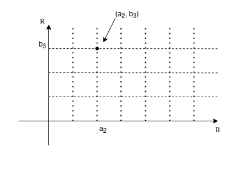
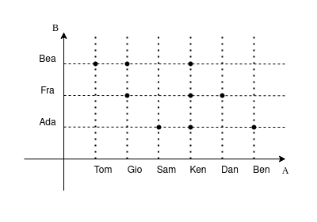

## Logica

### Proposizioni

$p,\ q,\ r,\ \dots$

Una proposizione è una parte del discorso a cui si può assegnare un valore di verità o di falsità $(V, F)$.

**Esempi**  
$p:$ Giorgio è più alto di 1,80m. $\rightarrow V$  
$q:$ Roma è la capitale della Francia. $\rightarrow F$  

---

### Connettivi logici

I connettivi logici servono a costruire nuove proposizioni dalle proposizioni di partenza.

- Connettivi UNARI
  - Negazione
- Connettivi BINARI
  - Congiunzione
  - Disgiunzione
  - Implicazione
  - Doppia implicazione

### Negazione - NOT

$\neg p$  
"non p"

| $p$ | $\neg p$ |
| --- | :------: |
| V   |    F     |
| F   |    V     |

### Congiunzione - AND

$p \wedge q$  
"p e q"  

| $p$ | $q$ | $p \wedge q$ |
| --- | --- | :----------: |
| V   | V   |      V       |
| V   | F   |      F       |
| F   | V   |      F       |
| F   | F   |      F       |

### Disgiunzione - OR

$p \vee q$  
"p oppure q"  

| $p$ | $q$ | $p \vee q$ |
| --- | --- | :--------: |
| V   | V   |     V      |
| V   | F   |     V      |
| F   | V   |     V      |
| F   | F   |     F      |

La disgiunzione non esclusiva $(XOR)$ si indica con $\veebar$ e la sua **tabella di verità** è:

| $p$ | $q$ |  $p \veebar q$  |
| --- | --- | :-------------: |
| V   | V   |        F        |
| V   | F   |        V        |
| F   | V   |        V        |
| F   | F   |        F        |

$vel \rightarrow$ disgiunzione inclusiva  
$aut \rightarrow$ disgiunzione esclusiva  

### Implicazione (materiale)

$p \Rightarrow q$  
**"p implica q"** oppure **"se p allora q"**

| $p$ | $q$ | $p \Rightarrow q$ |
| --- | --- | :---------------: |
| V   | V   |         V         |
| V   | F   |         F         |
| F   | V   |         V         |
| F   | F   |         V         |

**Esempi**  
$p :$ piove.  
$q :$ prendo l'ombrello.  
$p \Rightarrow q :$ se piove allora prendo l'ombrello.

Voglio negarlo, quindi

$\neg(p \Rightarrow q) :$ non è vero che se piove allora prendo l'ombrello.  

*Equivale a dire*: "piove e non prendo l'ombrello."

Quindi

$\neg(p \Rightarrow q) = p \wedge \neg q$

Poiché, se è vero che

$\neg (\neg p) = p$  

allora

$\neg \Big(\neg(p \Rightarrow q)\Big) = \neg (p \wedge \neg q) =$  

per De Morgan (vedi più avanti)

$=\neg p \vee \neg (\neg q) = \neg p \vee q$  

trovando infine che

$\neg (\neg p \vee q) = p \wedge \neg q$

### Doppia implicazione

$p \Leftrightarrow q$  
**"p è equivalente a q"** oppure **"p se e solo se q"**

| $p$ | $q$ | $p \Leftrightarrow q$ |
| --- | --- | :-------------------: |
| V   | V   |           V           |
| V   | F   |           F           |
| F   | V   |           F           |
| F   | F   |           V           |

Inoltre

$p \Leftrightarrow q = (p \Rightarrow q) \wedge (q \Rightarrow p)$

| $p$ | $q$ | $p \Rightarrow q$ | $q \Rightarrow p$ | $(p \Rightarrow q) \wedge (q \Rightarrow p)$ |
| --- | --- | :---------------: | :---------------: | :------------------------------------------: |
| V   | V   |         V         |         V         |                    **V**                     |
| V   | F   |         F         |         V         |                    **F**                     |
| F   | V   |         V         |         F         |                    **F**                     |
| F   | F   |         V         |         V         |                    **V**                     |

**Esempi**  
$p : \text{in un triangolo, 2 lati sono uguali.}$  
$q : \text{in un triangolo, 2 angoli sono uguali.}$  
$p \Leftrightarrow q$

---

### Tautologia

Una tautologia è una proposizione (composta) che è sempre vera.

#### tertium non datur  

\
$p \vee \neg p$  

| $p$ | $\neg p$ | $p \vee \neg p$ |
| --- | :------: | :-------------: |
| V   |    F     |        V        |
| V   |    F     |        V        |
| F   |    V     |        V        |
| F   |    V     |        V        |

#### non contradditio  

\
$\neg(p \wedge \neg p)$  

| $p$ | $\neg p$ | $p \wedge \neg p$ | $\neg(p \wedge \neg p)$ |
| --- | :------: | :---------------: | :---------------------: |
| V   |    F     |         F         |            V            |
| V   |    F     |         F         |            V            |
| F   |    V     |         F         |            V            |
| F   |    V     |         F         |            V            |

#### modus ponens  

\
$(p \wedge (p \Rightarrow q)) \Rightarrow p$  

| $p$ | $q$ | $p \Rightarrow q$ | $p \wedge (p \Rightarrow q)$ | $(p \wedge (p \Rightarrow q)) \Rightarrow p$ |
| --- | --- | :---------------: | :--------------------------: | :------------------------------------------: |
| V   | V   |         V         |              V               |                      V                       |
| V   | F   |         F         |              F               |                      V                       |
| F   | V   |         V         |              F               |                      V                       |
| F   | F   |         V         |              F               |                      V                       |

#### modus tollens  

\
$(\neg q \wedge (p \Rightarrow q)) \Rightarrow \neg p$  

| $p$ | $q$ | $\neg p$ | $\neg q$ | $p \Rightarrow q$ | $\neg q \wedge (p \Rightarrow q)$ | $(\neg q \wedge (p \Rightarrow q)) \Rightarrow \neg p$ |
| --- | --- | :------: | :------: | :---------------: | :-------------------------------: | :----------------------------------------------------: |
| V   | V   |    F     |    F     |         V         |                 F                 |                           V                            |
| V   | F   |    F     |    V     |         F         |                 F                 |                           V                            |
| F   | V   |    V     |    F     |         V         |                 F                 |                           V                            |
| F   | F   |    V     |    V     |         V         |                 V                 |                           V                            |

#### reductio ad absurdum

\
$\Big((p \wedge \neg q) \Rightarrow (r \wedge \neg r)\Big) \Leftrightarrow (p \Rightarrow q)$  

| $p$ | $q$ | $r$ | $\neg q$ | $\neg r$ | $p \wedge \neg q$ | $r \wedge \neg r$ | $\Big((p \wedge \neg q) \Rightarrow (r \wedge \neg r)\Big)$ | $p \Rightarrow q$ |
| --- | --- | --- | :------: | :------: | :---------------: | :---------------: | :---------------------------------------------------------: | :---------------: |
| V   | V   | V   |    F     |    F     |         F         |         F         |                            **V**                            |       **V**       |
| V   | V   | F   |    F     |    V     |         F         |         F         |                            **V**                            |       **V**       |
| V   | F   | V   |    V     |    F     |         V         |         F         |                            **F**                            |       **F**       |
| V   | F   | F   |    V     |    V     |         V         |         F         |                            **F**                            |       **F**       |
| F   | V   | V   |    F     |    F     |         F         |         F         |                            **V**                            |       **V**       |
| F   | V   | F   |    F     |    V     |         F         |         F         |                            **V**                            |       **V**       |
| F   | F   | V   |    V     |    F     |         F         |         F         |                            **V**                            |       **V**       |
| F   | F   | F   |    V     |    V     |         F         |         F         |                            **V**                            |       **V**       |

### Legge di De Morgan

$\neg (p \wedge q) = \neg p \vee \neg q$  
$\neg (p \vee q) = \neg p \wedge \neg q$  

| $p$ | $q$ | $p \wedge q$ | $\neg (p \wedge q)$ | $\neg p$ | $\neg q$ | $\neg p \vee \neg q$ |
| --- | --- | :----------: | :-----------------: | :------: | :------: | :------------------: |
| V   | V   |      V       |        **F**        |    F     |    F     |        **F**         |
| V   | F   |      F       |        **V**        |    F     |    V     |        **V**         |
| F   | V   |      F       |        **V**        |    V     |    F     |        **V**         |
| F   | F   |      F       |        **V**        |    V     |    V     |        **V**         |

---

### Predicati

"parte del nostro discorso che contende una o più variabili"

- UNARIO (1 variabile): $\mathcal{P}(x)$
- BINARIO (2 variabili): $\mathcal{Q}(x,y)$
- TERZIARIO (3 variabili): $\mathcal{S}(x,y,z)$
- $\dots$

**Esempi**  
$\mathcal{P}(x) :$ lo studente x è più alto di 1,7m.  
è un *predicato*

$\mathcal{P}(Pietro) =$ Pietro è più alto di 1,7m.  
è una *proposizione*

$\mathcal{Q}(x,y) :$ lo studente x è amico dello studente y.  
è un *predicato*

$\mathcal{Q}(Pietro,Giorgio) :$ lo studente Pietro è amico dello studente Giorgio.  
è una *proposizione*

$\mathcal{S}(x,y,z) :$ nell'ospedale x, il medico y, ha sbagliato la diagnosi z.

**Osservazione**: un modo per trasformare predicati in proposizioni è utilizzare i **quantificatori**.

---

### Quantificatori

$\forall$  
"per ogni"  
Quantificatore Universale

$\exists$
"esiste"
Quantificatore Esistenziale

**Esempi**  
$\forall x, \mathcal{P}(x)$ è una proposizione  
significa "ogni studente è più alto di 1,7m."

$\exists x, \mathcal{P}(x)$ è una proposizione  
significa "esiste uno studente più alto di 1,7m."

$\Big(\forall x, \mathcal{Q}(x,y)\Big) = \mathcal{R}(y)$  
significa "tutti gli studenti sono amici dello studente y."

**Idea**: la variabile $x$ non è più presente.

$\exists y : \Big(\forall x, \mathcal{Q}(x,y)\Big)$  
significa "esiste uno studente amico di tutti gli studenti."

$\forall x, \exists y : \mathcal{Q}(x,y)$  
significa "ogni studente ha almeno un amico."

Voglio tradurre formalmente la frase "in ogni ospedale, esiste almeno un medico che ha sbagliato tutte le diagnosi."

Quindi scrivo

$\forall x, \exists y : \forall z, \mathcal{S}(x,y,z)$

#### Negazione di proposizioni con i quantificatori

\
**Osservazione**: come posso fare la negazione di una frase con i quantificatori.

**Importante**  
Per negare una proposizione con i quantificatori, occorre sostituire il *quantificatore esistenziale* con il *quantificatore universale* e viceversa, quindi la negazione si distribuisce all'interno, quindi:

- $\neg \Big(\exists x : \mathcal{P}(x)\Big)$ diventa $\forall x, \neg \Big(\mathcal{P}(x)\Big)$  
- $\neg \Big(\forall x, \mathcal{P}(x)\Big)$ diventa $\exists x: \neg \Big(\mathcal{P}(x)\Big)$  

Per esempio, prendiamo  

$\forall x, \mathcal{P}(x)$  
"ogni studente è più alto di 1,7m."

dobbiamo negarla, perciò "non è vero che ..."

**ATTENZIONE!**  
**NON è vero che**  
$\neg \Big(\forall x, \mathcal{P}(x)\Big) \neq \forall x, \neg \mathcal{P}(x)$  
poiché sarebbe
"ogni studente non è più alto di 1,7m."

**Esempi**  
$\neg \Big(\forall x, \mathcal{P}(x)\Big) = \exists x : \neg \mathcal{P}(x)$  
"esiste almeno uno studente che non è più alto di 1,7m."  

Similmente

$\neg \Big(\exists y : \mathcal{T}(y)\Big) = \forall y, \neg \mathcal{T}(y)$  

Riprendiamo $\mathcal{Q}(x,y)$ e neghiamolo

$\neg \Big(\exists x : \forall x, \mathcal{Q}(x,y)\Big)$  
"*non è vero che* esiste uno studente che è amico di tutti gli studenti."  

$\neg \Big(\exists x : \mathcal{Q}(x,y)\Big) = \forall y, \neg \Big(\forall x, \mathcal{Q}(x,y)\Big) = \forall y, \exists x :\neg \mathcal{Q}$  
"ogni studente *non è amico* di almeno uno studente."

Similmente

$\neg \Big(\forall x, \exists y : \forall z, \mathcal{S}(x,y,z)\Big)$  
"*non è vero che* in ogni ospedale, esiste almeno un medico che ha sbagliato tutte le diagnosi"  

$= \exists x : \forall y, \exists z : \neg \mathcal{S}(x,y,z)$  
"esiste un ospedale in cui ogni medico ha determinato almeno una diagnosi."

**Esempi**   con la definizione di limite
$\lim\limits_{x \to x_o} f(x) = \ell$  
$x_0, \ell \in \mathbb{R}$  

$\forall \varepsilon > 0, \exists \delta > 0 : \forall x \in \mathbb{E},$  
$0 < |x-x_0| < \delta \Rightarrow |f(x) - \ell| < \varepsilon$  

Modificando correttamente i quantificatori, la sua negazione è

$\exists \varepsilon > 0 : \forall \delta > 0, \exists x \in \mathbb{E} :$  
$\neg (0 < |x-x_0| < \delta \Rightarrow |f(x) - \ell| < \varepsilon)$  

Poiché prima abbiamo visto che

$\neg(p \Rightarrow q) = p \wedge \neg q$

allora la negazione diventa

$\exists \varepsilon > 0 : \forall \delta > 0, \exists x \in \mathbb{E} :$  
$0 < |x-x_0| < \delta \wedge |f(x) - \ell| \geq \varepsilon$

---

## Insiemistica

### Cos'è un insieme

**Insieme** (nozione primitiva) : aggregazione, famiglia, groppo (di solito con qualche caratteristica comune) di **elementi**.

**Attenzione**  
Gli insiemi sono caratterizzati dai soli elementi.  
Due insiemi sono uguali se hanno gli stessi elementi.  

L'ordine non conta: $A = \{a,b,c\} = \{c,a,b\}$

Per esempio, l'elemento $a$ appartiene all'insieme $A$ diventa $a \in A$:

- allora $A=B \Leftrightarrow (\forall a,\ a \in A \Rightarrow a \in B) \wedge (\forall b,\ b \in B \Rightarrow b \in A)$  
- se vale solo $\forall a,\ a \in A \Rightarrow a \in B$, deduco $A \subseteq B$ (si dice "A contenuto in B" oppure "A è sottoinsieme di B")
- quindi se $A=B \Leftrightarrow A \subseteq B \wedge B \subseteq A$

Si possono rappresentare con i **diagrammi di Eulero-Venn**.

**Osservazione**: Per rappresentare un insieme:

- elencare gli elementi (**Forma estensiva**)
- fisso un insieme "universo" (**Ambiente**) e poi caratterizzo gli elementi con una proprietà (**Forma intensiva**)

**Esempi**  
$A =\{n \in \mathbb{N} : n\ pari \} = \{0,2,4,6 \dots\}$

---

### Operazioni con gli insiemi

#### Insieme complementare (o insieme complemento)

\
$U$ è l'insieme universo  
$A$ è l'insieme  

$\mathscr{C}_U A = \{x \in U : x \notin A\} = \{x \in U : \neg (x \in A)\}$

> L'insieme complemento si può scrivere anche $\overline{A}$.

#### Intersezione

\
$A \cap B = \{x \in U : x \in A \wedge x \in B\}$

#### Unione

\
$A \cup B = \{x \in U : x \in A \vee x \in B\}$  

#### Qualche proprietà

\
$A \cap B = B \cap A$  
$A \cup B = B \cup A$  

$(A \cap B) \cap C = A \cap (B \cap C)$  
$(A \cup B) \cup C = A \cup (B \cup C)$  

$A \cap (B \cup C) = (A \cap B) \cup (A \cap C)$  
$A \cup (B \cap C) = (A \cup B) \cap (A \cup C)$  

---

### Insieme vuoto

Esiste un insieme (speciale) che è senza elementi, chiamato *insieme vuoto*, indicato con $\varnothing$ (**unico** e $\forall A, \varnothing \subseteq A$).

---

### Insieme delle parti

$\mathcal{P}(A)$ è l'insieme dei sottoinsiemi di $A$.

**Esempi**  
Sia

$A = \{a,b,c\}$  

allora

$\mathcal{P}(A) = \{\varnothing, \{a\}, \{b\}, \{c\}, \{a,b\}, \{b,c\}, \{a,c\}, \{a,b,c\}\}$  

Tutti i sottoinsiemi si dicono **propri**, tranne l'insieme $\{a,b,c\}$, detto **improprio**.

#### Il numero di elementi di $\mathcal{P}(A)$ è $2^n$

\
$|\mathcal{P}(A)| = 2^n$

con

$|A| =$ numero di elementi in $A$

Per esempio, se prendiamo l'insieme $A = \{a,b,c,d,e,f\}$,  
possiamo rappresentare il sottoinsieme $S = \{a,d,e\}$ così:

|   a   |   b   |   c   |   d   |   e   |   f   |
| :---: | :---: | :---: | :---: | :---: | :---: |
|   1   |   0   |   0   |   1   |   1   |   0   |

Dove inserisco $1$ se l'elemento è presente o $0$ se è assente.  

Un altro esempio è  
$\varnothing = \{\}$  corrisponde a $(0,0,0,0,0,0)$

In questo modo, vediamo che tutte le possibilità sono rappresentabili da un numero binario di lunghezza $|A|$, quindi $2^n$ in decimale.  

---

### Coppie ordinate e prodotto cartesiano

Una *coppia ordinata* è un aggregato con due elementi in cui si distingue il primo elemento e il secondo elemento.  

$(a,b) \neq \{a,b\}$  

$\{a,b\} = \{b,a\}$  

$(a,b) = (a',b') \Leftrightarrow a=a', b=b'$

$(a,b) \neq (b,a)$  
a meno che $a=b$

**Definizione**:  
Siano $A,B$ insiemi,  
$A \times B = \{(a,b) : a \in A, b\in B \}$  
è detto insieme *prodotto cartesiano di $A$ e $B$*.

Anche il *piano cartesiano* è un prodotto cartesiano

$\Pi = \{(a,b) : a \in \mathbb{R}, b \in \mathbb{R}\}$

in questo caso $A=B=\mathbb{R}$, quindi

$\mathbb{R} \times \mathbb{R} = \mathbb{R}^2$

Similmente

$A \times B \times C = \{(a,b,c) : a \in A, b \in B, c \in C\}$

$\mathbb{R}^3 = \{(x,y,a) : x,y,z \in \mathbb{R}\}$  
nello spazio a tre dimensioni

$\mathbb{R}^n = \{(x_1,x_2,x_3, \dots, x_n) : x_1,x_2,x_3, \dots, x_n \in \mathbb{R}\}$  
n-upla, tupla ordinata (vettore)

$A = \{a_1,a_2,a_3,a_4,a_5\}$  
$B = \{b_1,b_2,b_3,b_4\}$

$A \times B = \{(a_i,b_j) : i = (1,2,3,4,5),\ j = (1,2,3,4)\}$  

**Osservazione**:  
numeri divisibili per $3 = \{n \in \mathbb{N} : \exists k \in \mathbb{N} : (n = 3k)\} = \{n \in \mathbb{N} : \mathcal{P}(n)\}$  
con $\mathcal{P}(n) = \exists k \in \mathbb{N} : (n = 3k)$  
la variabile $k$, preceduta dal quantificatore esistenziale, è **muta**.

I predicati binari sono quelli giusti per i prodotti cartesiani.

Indicando in $A \times B$ l'insieme delle coppie che soddisfano $\mathcal{P}(x,y) \rightarrow$ *predicato binario*  

**Esempi**  
$A = \{$ragazzi in quest'aula$\}$  
$B = \{$ragazze in quest'aula$\}$

$\mathcal{P}(x) :$ $x$ è amico di $y$  
*Relazione* di "amicizia" tra due insiemi

---

## Relazioni

### Relazione tra due insiemi

**Definizione**:  
*Relazione* tra $A$ e $B =$ predicato $\mathcal{P}(x)$ a valori in $A \times B$.  
(se $A=B$, parliamo di relazione su $A$)

**Esempi**  
$A = \mathbb{N} \smallsetminus \{0\} = \{1,2,3, \dots\}$  

Decidiamo che $n | m$ significa "n divide m", introducendo la relazione "$|$ divide".

Per esempio, 3 divide 12, ma 3 non divide 5, poiché $\nexists k \in \mathbb{Z} : 3k=5$.

#### Grafico della relazione

\

**Esempi**  
$A = \mathbb{Z} = \{\dots,-3,-2,-1,0,1,2,3,\dots\}$  
$m = 3$ (è il modulo in base 3)

$x$ è in relazione con $y$  
se $\exists k \in \mathbb{Z} : x-y=3k$  

cioè 2 numeri sono in relazione se la loro differenza è un multiplo di 3.

Si chiama **congruenza modulo 3**, indicata con $m \equiv_3 n$.

---

### Proprietà delle relazioni

**Definizione**:  
Sia $A$ un insieme, sia $\rho$ una relazione su $A$,  
allora $x \rho y$

- si dice **riflessiva** se $\forall x \in A, x \rho x$
- si dice **simmetrica** se $\forall x,y \in A, x \rho y \Rightarrow y \rho x$
- si dice **transitiva** se $\forall x,y,z \in A, x \rho y \wedge y \rho z \Rightarrow x \rho z$

**Esempi**  
La relazione divide è transitiva:

$x|y \wedge y|z \stackrel{?}{\Rightarrow} x|z$

$x|y \Leftrightarrow \exists k_1 : y = k_1 \cdot x$  
$y|z \Leftrightarrow \exists k_2 : z = k_2 \cdot y = k_2 \cdot (k_1 \cdot x) =$

$x|z$ quindi è vero perché, se $k_3 = k_1 \cdot k_2$ allora $z = k_3 \cdot x$.  

$\square$  

La relazione congruenza modulo m è transitiva:

$x,y,z \in \mathbb{Z}$

$x \equiv_m y \wedge y \equiv_m z \stackrel{?}{\Rightarrow}x \equiv_m z$

$\exists k_1 \in \mathbb{Z} : x-y= k_1 \cdot m$  
$\exists k_2 \in \mathbb{Z} : y-z= k_2 \cdot m$  

$x \equiv_m z$ quindi è vero perché, se $k_3 = k_1 \cdot k_2$,  
allora $x-z = k_1 \cdot m + k_2 \cdot m = (k_1 + k_2)m = k_3 \cdot m$.  

$\square$  

**Definizione**:  
$A$ insieme, $\rho$ relazione

$\rho$ si dice **antisimmetrica** se  

$\forall x,y \in A, x \rho y \wedge y \rho x \Rightarrow x=y$

**Esempi**  
La relazione divide è antisimmetrica se e solo se

$\forall x,y \in \mathbb{N} \smallsetminus \{0\}, x | y \wedge y | x \Rightarrow x=y$

Dimostriamolo partendo da

$x|y \Leftrightarrow \exists k_1 : y = k_1 \cdot x$  
$y|x \Leftrightarrow \exists k_2 : x = k_2 \cdot y \Leftrightarrow \exists k_2 : y = \frac{x}{k_2}$

quindi

$k_1 \cdot x = \frac{x}{k_2}$

che equivale a

$k_1 \cdot k_2 \cdot x - x = 0$

quindi

$(k_1 \cdot k_2 - 1) \cdot x = 0$

per la legge dell'annullamento del prodotto

o $k_1 \cdot k_2 - 1 = 0$ o $x = 0$

ma poiché $x \in \mathbb{N} \smallsetminus \{0\}$

allora

$k_1 \cdot k_2 = 1$

poiché $k_1, k_2 \in \mathbb{N}$, allora

$k = k_1 = k_2 = 1$

e se l'unica soluzione è $k = +1$

allora $x=y$.

$\square$

---

### Relazione d'ordine

**Definizione**:  
$A$ insieme, $\rho$ relazione  
se $\rho$ è riflessiva, antisimmetrica e transitiva  
$\rho$ si dice *relazione d'ordine* o *ordinamento*.  
Con $(A, \rho)$ **insieme ordinato**.

Per esempio $\mathbb{R}$ con la relazione $\geq$.

---

### Relazione di equivalenza

**Definizione**:  
$A$ insieme, $\rho$ relazione  
se $\rho$ è riflessiva, simmetrica e transitiva  
$\rho$ si dice *relazione di equivalenza*.

---

### Classe di equivalenza

$A$ insieme, $\rho$ relazione di equivalenza  
chiamo $[a]_\rho = \{b \in A : a \rho b\}$  
cioè tutti gli elementi in relazione con $a$.  

**Esempi**  
$[0]_{\equiv_3} = \{ \dots, -9, -6, -3, +0, +3, +6, +9, \dots \}$

$[1]_{\equiv_3} = \{\dots, -5, -2, +1, +3, +7, +10, +13, \dots\}$

$[2]_{\equiv_3} = \{\dots, -7, -4, -1, +2, +5, +8, +11, \dots\}$

Poi si ripetono

$[0]_{\equiv 3} =$  

$= [3]_{\equiv 3} =$  

$= [6]_{\equiv 3} = \dots$

L'insieme delle classi di equivalenza di dice  
**insieme quoziente rispetto all'equivalenza**.

Si indica con

$^{A}/_{\rho}$

per esempio

$^{\mathbb{Z}}/_{\equiv_3} =$

{ $[0]_{\equiv 3},$

$[1]_{\equiv 3},$

$[2]_{\equiv 3}$ }

---

## Funzioni

### Funzione

**Definizione**:  
Siano $A, B$ insiemi  

$f$ è una "legge"  
che ad ogni valore di $A$ associa uno e un solo valore di $B$,
cioè se $x \in A$ esiste uno e uno solo $y$ in $B$ tale che $y$ è associato a $x$ (scrivo $f(x) = y$).  

La terna $(A,B,f)$ la chiamo **funzione**.

---

### Dominio e codominio

**Definizione**:  
$A$ si dice **dominio** della funzione.  
$B$ si dice **codominio** della funzione.  
$f$ è una regola che ad ogni $x$ del dominio associa uno e uno solo elemento $y$ del codominio.

**Esempi**  
$A =$ {persone in quest'aula}  
$B =$ {comuni italiani}  

$x \mapsto$ comune di residenza

!!! IMMAGINE comuni di residenza

**Osservazione**  
Tutto l'anno studieremo funzioni

$f = A \rightarrow B$ con $A, B \subseteq \mathbb{R}$

che tradizionalmente si dicono "*funzioni reali di variabile reale*".

**Osservazione**  
!!! IMMAGINE non è una funzione

---

### Insieme immagine

**Definizione**  
Sia $f : A \rightarrow B$ una funzione,  
se $x \in A$, il valore $f(x) \in B$  
lo chiamo **valore immaginario di $x$**.

**Definizione**
L'insieme delle immagini si chiama  
**insieme immagine** o *immagine dell'insieme*,  
indicato da $f(A)$.

> Esempio con $f(n) = 2n$

**Osservazione**  
*Sempre* $f(A) \subseteq B$

**Definizione**  
Sia $f : A \rightarrow B$ una funzione,  
sia $A' \subseteq A$,  
$f(A') = \{ f(x) : x \in A' \}$

!!! IMMAGINE insiemi A e A'

> Esempio con l'immagine della funzione $x^2 + 3$

---

### Funzione suriettiva

**Definizione**  
Se $f(A) = B$  
$f$ si dice **suriettiva** (o surgettiva).

---

### Funzione composta

**Definizione**  
Sono  
$f : A \rightarrow B$  
$g : B \rightarrow C$  

Diciamo **funzione composta**  
$g \circ f : A \rightarrow C$  
"g dopo f",  
quindi $x \mapsto g\Big(f(x)\Big)$.

> Esempio con $x^2$ e $y + 2$

---

### Funzione inversa

**Definizione**  
Sia $f : A \rightarrow B$,  
supponiamo che esista una funzione  
$g : B \rightarrow A$ tale che:

- $g \circ f =$ identità su A  
- $f \circ g =$ identità su B  

$g$ si dice **funzione inversa** di $f$.

$g = f^{-1}$

!!! IMMAGINE funzione inversa con A e B

> Identità:  
> $A \rightarrow A$  
> $x \mapsto x$

**Teorema**  
Sia $f : A \rightarrow B$,  
$f$ ha inversa se e solo se  
$f$ è *iniettiva* e *suriettiva*, quindi **biettiva**.

---

## I numeri naturali

$\mathbb{N} = \{ 0, 1, 2, 3, \cdots \}$

> Sono quelli che servono per contare (con lo zero).

---

Su $\mathbb{N}$ è definita un'operazione di **somma** o **addizione**,  
è una funzione

$+ : \mathbb{N} \times \mathbb{N} \rightarrow \mathbb{N}$  
$(n, m) \mapsto k = n + m$  

Questa è un'operazione:

- associativa
  - $\forall n,m,k$ vale che $n+(m+k) = (n+m)+k$
- $\exists$ neutro
  - $\exists 0 \in \mathbb{N} : \forall m,\ 0+m = m+0 = m$
- commutativa
  - $\forall n,m$ vale che $n+m = m+n$

---

Su $\mathbb{N}$ è definita anche un'operazione di **prodotto** o **moltiplicazione**,  
è una funzione

$\cdot : \mathbb{N} \times \mathbb{N} \rightarrow \mathbb{N}$  
$(n, m) \mapsto k = n \cdot m$  

Questa è un'operazione:

- associativa
  - $\forall n,m,k$ vale che $n \cdot (m \cdot k) = (n \cdot m) \cdot k$
- $\exists$ neutro
  - $\exists 1 \in \mathbb{N} : \forall n,\ 1 \cdot n = n \cdot 1 = n$
- commutativa
  - $\forall n,m$ vale che $n \cdot m = m \cdot n$

---

Vale una proprietà che lega la somma al prodotto, la **distributiva**,

$\forall m,n,k$ vale che $n \cdot (m + k) = (n \cdot m) + (n \cdot k)$

---

Su $\mathbb{N}$ è definita anche una **relazione d'ordine totale**,  
cioè che $\forall x,y \in A,\ x \rho y \vee y \rho x$

$\geq$ "maggiore o uguale"

che è compatibile con le operazioni:

$\forall n,m,k \in \mathbb{N},$  
$n \geq m \Rightarrow n + k \geq m + k$  

$\forall n,m,k \in \mathbb{N},$  
$n \geq m \Rightarrow n \cdot k \geq m \cdot k$  

---

Abbiamo un insieme con operazioni e relazioni

$(\mathbb{N}, +, \cdot, \geq)$

esso è un insieme con una "**struttura algebrica**".

---

**Osservazione**  
Possiamo determinare degli **assiomi** ("prime proprietà che non vengono dimostrate ma assunte a priori") su $\mathbb{N}$,  
in modo che tutte le altre proprietà siano deducibili da questi?

### Assiomi di Giuseppe Peano

Esiste un insieme che chiamo $\mathbb{N}$

- Esiste un elemento di questo insieme che chiamo $0$ (zero), cioè $0 \in \mathbb{N}$
- Esiste una funzione $\sigma : \mathbb{N} \rightarrow \mathbb{N}$ che chiamo "successivo" che gode delle seguenti proprietà:
  - $\sigma$ è iniettiva
  - $\sigma(n) \neq 0$ (zero non è il successivo di nessun numero)
  - **principio di induzione**
    - sia $\mathcal{S} \subseteq \mathbb{N}$, supponiamo che
      - $0 \in \mathbb{N}$
      - $\forall n,\ n \in \mathcal{S} \Rightarrow \sigma(n) \in \mathcal{S}$
    - Allora $\mathcal{S} = \mathbb{N}$

**Idea fondamentale**  
$\sigma(0) = 1$  
$\sigma(n) = n + 1$  
se parto da $0$ e sommo $1$, trovo tutti i numeri.

**Osservazione**  
Il principio di induzione posso verificarlo anche per i numeri $n>n_0, n_0 \in \mathbb{N}, n_0 \geq 0$,  
verificando $P(n_0)$ e poi $\forall n \geq n_0, P(n) \Rightarrow P(n+1)$.  

> Esempio $0+1+2+\dots+n = \frac{n(n+1)}{2}$
>
> Esempio $0+1+4+\dots+n^2 = \frac{n(n+1)(2n+1)}{6}$
>
> Esempio $0+1+8+\dots+n^3 = (\frac{n(n+1)(2n+1)}{6})^2$
>
> Esempio con le rette nel piano

#### Diseguaglianza di Bernulli

\
Sia $a>-1, a \in \mathbb{R}$

Allora $\forall n \in \mathbb{N}$ vale

$(1+a)^n \geq 1 + na$

#### Diseguaglianza di Bernulli migliorata

\
Sia $a>0, a \in \mathbb{R}$

Allora $\forall n \in \mathbb{N}, n \geq 1$ vale

$(1+a)^n \geq 1 + na + \frac{n(n-1)}{2}a^2$

### Successioni

**Definizione**  
Sia $A$ un insieme,  
sia $f : \mathbb{N} \rightarrow A$,  
quindi saranno determinati  

$f(0) = a_0$  
$f(1) = a_1$  
$f(2) = a_2$  
$\vdots$  
$f(n) = a_n$  

questa $f$ si chiama (tradizionalmente)  
**successione a valori in $A$**

la rappresento con $(a_n)_n$

### Sommatoria

**Osservazione**  
Ora usiamo l'induzione per introdurre in modo rigoroso il simbolo di **sommatoria**.

$\displaystyle\sum_{i=0}^{n} a_i = a_0 + a_1 + a_2 + \dots + a_n$

Si ha che

$s_0 = a_0$  
$\forall n, s_{n+1} = s_n + a_{n+1}$  

### Produttoria

Analogamente

$\displaystyle\prod_{i=1}^{n} a_i = a_0 + a_1 + a_2 + \dots + a_n$

Si ha che

$p_0 = a_0$  
$\forall n, p_{n+1} = p_n + a_{n+1}$  

## Calcolo combinatorio

Per contare il numero di elementi di insiemi a partire da altri insiemi.

---

1- Se $A$ insieme di $n$ elementi e $B$ insieme di $m$ elementi, scriviamo

$|A| = n,\ |B| = m$

allora

$|A \times B| = n \cdot m$

---

2- $|A| = n,\ |B| = m$,
il numero delle funzioni da a $A$ a $B$

$B^A =$ {numero delle funzioni da a $A$ a $B$}

$|B^A| = |B|^{|A|} = m^n$

sono **disposizioni con ripetizione**

---

3- $|A| = n,\ |B| = m$ con $m \geq n$,

$D =$ {funzioni iniettive da $A$ a $B}

$|D| = m(m-1)(m-2)\dots(m-n+1)$

sono **disposizioni di m oggetti a n a n**

> Ho usato $D$ invece di $C$

---

4- $|A| = |B| = n$, funzioni biettive tra $A$ e $B$

$P =$ {biezioni da $A$ in sé stesso}

$|P| = n(n-1)(n-2)\dots(2)(1)(0!) = n!$

sono **permutazioni di n oggetti**

---

5- Sia $|A| = n$, $0 \leq k \leq n$,  
il numero dei sottoinsiemi di $A$ con $k$ elementi

$C_k^n = \binom{n}{k} = \frac{n!}{k!(n-k)!}$ {numero dei sottoinsiemi di $A$ con $k$ elementi}

sono **combinazioni di n oggetti a k a k**

---

**Osservazione**  
$D = C_k^n \cdot k!$  
sono le combinazioni di n oggetti a k a k ordinate, ognuna genera $k!$ disposizioni.

### Il coefficiente binomiale

$\binom{0}{0}=1$

$\binom{n}{0}=1$

$\binom{n}{n}=1$

$\binom{n}{k} = \binom{n}{n-k}$

> Dimostrabile con gli insiemi o con la formula

Per $1 \leq k \leq n-1$
$\binom{n-1}{k-1} + \binom{n-1}{k} = \binom{n}{k}$

> Dimostrabile con gli insiemi o con la formula

### Triangolo di Tartaglia

$$
\begin{array}{cccccccccccccccc}
    &   &   &   &   &   & 1 &   &   &   &   &   \\
    &   &   &   &   & 1 &   & 1 &   &   &   &   \\
    &   &   &   & 1 &   & 2 &   & 1 &   &   &   \\
    &   &   & 1 &   & 3 &   & 3 &   & 1 &   &   \\
    &   & 1 &   & 4 &   & 6 &   & 4 &   & 1 &   \\
    & 1 &   & 5 &   & 10&   &10&   & 5 &   & 1 \\
\end{array}
$$

$$
\begin{array}{cccccccccccccccc}
    &   &   &   &   &   & \binom{0}{0} &   &   &   &   &   \\
    &   &   &   &   & \binom{1}{0} &   & \binom{1}{1} &   &   &   &   \\
    &   &   &   & \binom{2}{0} &   & \binom{2}{1} &   & \binom{2}{2} &   &   &   \\
    &   &   & \binom{3}{0} &   & \binom{3}{1} &   & \binom{3}{2} &   & \binom{3}{3} &   &   \\
    &   & \binom{4}{0} &   & \binom{4}{1} &   & \binom{4}{2} &   & \binom{4}{3} &   & \binom{4}{4} &   \\
    & \binom{5}{0} &   & \binom{5}{1} &   & \binom{5}{2} &   & \binom{5}{3} &   & \binom{5}{4} &   & \binom{5}{5} \\
\end{array}
$$

### Teorema del binomio di Newton

Siano $a,b \in \mathbb{R}$ (o $\in \mathbb{C}$),  
sia $n \in \mathbb{N},\ n \geq 1$  

allora $(a+b)^n = \displaystyle\sum_{j=o}^n \binom{n}{j} a^{n-j} b^j$

> Dimostrabile con l'induzione

**Osservazione**  
$\displaystyle\sum_{j=o}^n \binom{n}{j} = 2^n$  
che sono tutti i sottoinsiemi possibili

> Dimostrabile con $(1 + 1)^n$

**Osservazione**  
$\displaystyle\sum_{j=o}^n (-1)^j \binom{n}{j} = 0$  
che sono tutti i sottoinsiemi possibili

> Dimostrabile con $(1 - 1)^n$

## I numeri reali

**Osservazione**  
A partire dai numeri naturali $\mathbb{N}$, è possibile costruire i numeri interi

$\mathbb{Z} = \{\dots, -2, -1, 0, 1, 2, \dots\}$

A partire dai numeri interi $\mathbb{Z}$, è possibile costruire i numeri razionali

$\mathbb{Q} = \{\frac{p}{q} con p \in \mathbb{Z}, q \in \mathbb{N}^+\}$

> In $\mathbb{Q}$ ci sono delle classi di equivalenza, per esempio $\frac{1}{2} = \frac{2}{4} = \frac{3}{6} = \frac{4}{8} = \frac{5}{10} = \dots$

> I numeri razionali non vanno bene per misurare la lunghezza dei segmenti (come la diagonale del quadrato con lato unitario).

**Teorema**  
Non esistono $k.m \in \mathbb{N}$ tali che $(\frac{k}{m})^2 = 2$.

**Dimostrazione**  
Supponiamo, per assurdo, che esistano.  
Non è restrittivo supporre che $k$ e $m$ non abbiano fattori in comune,  
allora

$\frac{k^2}{m^2} = 2 \Leftrightarrow k^2 = 2m^2 \Leftrightarrow 2$ divide $k^2$

Se  

$k = p_1^{n_1} \cdot p_2^{n_2} \cdot p_3^{n_3} \cdot \dots p_l^{n_l}$

allora

$k^2 = p_1^{2n_1} \cdot p_2^{2n_2} \cdot p_3^{2n_3} \cdot \dots p_l^{2n_l}$

allora $2$ divide $k$

allora $k = 2n$

allora

$\frac{4n^2}{m^2} = 2 \Leftrightarrow 4n^2 = 2m^2 \Leftrightarrow 2n^2 = m^2 \Leftrightarrow 2$ divide $m^2$

allora $2$ divide $m$

quindi $2$ divide $k$ e $2$ divide $m$

allora hanno un fattore in comune, quindi non sono primi fra loro, che è un **assurdo**.

> Quindi in $\mathbb{Q}$ non si può risolvere l'equazione $x^2 = 2$

### Introduzione assiomatica di R

Esiste un insieme $\mathbb{R}$ tale che

---

$A)$ Su $\mathbb{R}$, è definita un'operazione di **somma** o **addizione**

$+ : \mathbb{R} \times \mathbb{R} \to \mathbb{R}$  
$(x, y) \mapsto x + y$  

$A_1)$ La somma è **associativa**

$\forall x, y, z$ vale che $x + (y + z) = (x + y) + z$

$A_2)$ Esiste l'**elemento neutro**

$\exists 0 \in \mathbb{R} : 0 + x = x + 0 = x$

$A_3)$ Esiste l'**opposto**

$\forall x \in \mathbb{R}, \exists x' \in \mathbb{R} : x + x' = x' + x = 0$

$A_4)$ La somma è **commutativa**

$\forall x, y$ vale che $x + y = y + x$

> $(\mathbb{R}, +)$ è un **gruppo abeliano**.

---

$M)$ Su $\mathbb{R}$, è definita un'operazione di **prodotto** o **moltiplicazione**

$\cdot : \mathbb{R} \times \mathbb{R} \to \mathbb{R}$  
$(x, y) \mapsto x \cdot y$

$M_1)$ La moltiplicazione è **associativa**

$\forall x, y, z$ vale che $x \cdot (y \cdot z) = (x \cdot y) \cdot z$

$M_2)$ Esiste l'**elemento neutro**

$\exists 1 \in \mathbb{R} : 1 \cdot x = x \cdot 1 = x$

$M_3)$ Esiste l'**opposto**

$\forall x \in \mathbb{R}, \exists x' \in \mathbb{R} : x \cdot x' = x' \cdot x = 1$

$M_4)$ La moltiplicazione è **commutativa**

$\forall x, y$ vale che $x \cdot y = y \cdot x$

---

$D)$ Esiste la proprietà **distributiva** che unisce la somma e la moltiplicazione

---

$\forall x, y, z$ vale che $x \cdot (y + z) = (x \cdot y) + (x \cdot z)$

> $(\mathbb{R}, +, \cdot)$ è un **campo**.

---

$O)$ Su $\mathbb{R}$, è definito un **ordinamento totale** che chiamo $\geq$ "maggiore o uguale"

$O_1)$ $\forall x, y, z \in \mathbb{R}$ vale che $x \geq y \Rightarrow x + z \geq y + z$

$O_2)$ $\forall x, y, z \in \mathbb{R}$ vale che $x \geq y \wedge z \geq 0 \Rightarrow x \cdot z \geq y \cdot z$

---

### Assioma di Dedekind

$S)$ Siano $A$ e $B$ sottoinsiemi di $\mathbb{R}$ con $A \neq \varnothing$ e $B \neq \varnothing$.

Supponiamo che $\forall a \in A, \forall b \in B, a \leq b$, allora

$\exists \xi \in \mathbb{R} : \forall a \in A, \forall b \in B$

$a \leq \xi \leq b$

---

Dagli assiomi posso derivare le *normali* proprietà:

- $\forall x \in \mathbb{R}, x \cdot 0 = 0 \wedge \forall x,y \in \mathbb{R}, x \cdot y = 0 \Rightarrow x = 0 \vee y = 0$  

- $(-a) \cdot (-b) = ab$

- $(-a) \cdot b = - ab$

- $1 > 0$ e $\forall a \in \mathbb{R}, a^2 \geq 0$

#### Le regole dei segni

\
- $a > 0, b > 0 \Rightarrow ab > 0$  
- $a < 0, b < 0 \Leftrightarrow ab > 0$  
- $a > 0, b < 0 \Leftrightarrow ab < 0$  
- $a < 0, b > 0 \Leftrightarrow ab < 0$  

## Intervalli

Siano $a, b \in \mathbb{R}$ con $a < b$,

sono **intervalli limitati**:

$[a, b] = \{x \in \mathbb{R} : a \leq x \leq b\}$  
$]a, b] = \{x \in \mathbb{R} : a < x \leq b\}$  
$[a, b[ = \{x \in \mathbb{R} : a \leq x < b\}$  
$]a, b[ = \{x \in \mathbb{R} : a < x < b\}$  

Sia $a \in \mathbb{R}$,

sono **intervalli illimitati**:

$]-\infty, a] = \{x \in \mathbb{R} : x \leq a\}$  
$]-\infty, a[ = \{x \in \mathbb{R} : a < x\}$  
$[a, +\infty[ = \{x \in \mathbb{R} : a \geq x\}$  
$]a, +\infty[ = \{x \in \mathbb{R} : a > x\}$

> Sono illimitati inferiormente e limitati superiormente.

**Osservazione**  
$\mathbb{R} = ]-\infty, +\infty[$

**Osservazione**  
Può essere comodo pensare che anche $\{a\}$ (cioè un insieme di un solo punto) è un intervallo "degenere".

**Osservazione**  
$-\infty$ e $+\infty$ non sono numeri reali, ma soltanto simboli.

> Scriviamo $\tilde{\mathbb{R}} = \mathbb{R} \cup \{-\infty, +\infty\}$, chiamata "**retta estesa**".

### Insiemi limitati

Sia $a \in \mathbb{R}$,  
$A$ si dice (insieme) limitato superiormente se

$\exists M \in \mathbb{R} : \forall a \in A, a \leq M$

**Definizione**  
$A \subset \mathbb{R}$ si dice limitato se è limitato superiormente ed inferiormente.

**Osservazione**  
$A$ è limitato $\Leftrightarrow \exists R > 0 : A \subset [-R, +R]$

**Osservazione**  
Sul piano definisco un **insieme limitato** se riesco a metterlo in una circonferenza di raggio $R$.

**Osservazione**  
¿ Cosa significa che $A$ non sia superiormente limitato?  
(senza usare la negazione)

$\neg (\exists M \in \mathbb{R} : \forall a \in A, a \leq M)$

$\forall M \in \mathbb{R} : \exists a \in A : a > M$

### Maggioranti, minoranti, massimi e minimi

**Definizione**  
Sia $A \subseteq \mathbb{R}$, sia $M \in \mathbb{R}$,  
se $\forall a \in A, a \leq M$ allora $M$ si dice **maggiorante** di $A$.

**Osservazione**  
Se $A$ ha un maggiorante, allora ne ha infiniti.

**Definizione**  
Sia $A \subseteq \mathbb{R}$, sia $m \in \mathbb{R}$,  
se $\forall a \in A, a \geq m$ allora $m$ si dice **minorante** di $A$.

**Osservazione**  
Se $A$ ha un minorante, allora ne ha infiniti.

**Definizione**  
Sia $A \subseteq \mathbb{R}$, sia $\mu \in \mathbb{R}$,  
se $\mu$ maggiorante di $A$ e $\mu \in A$ allora $\mu$ si dice **massimo** di $A$.  

$$
\left\{
  \begin{array}{l}
    \mu \in A \\
    \forall a \in A, a \leq \mu
  \end{array}
\right.
$$

**Definizione**  
Sia $A \subseteq \mathbb{R}$, sia $\nu \in \mathbb{R}$,  
se $\nu$ minorante di $A$ e $\nu \in A$ allora $\nu$ si dice **minimo** di $A$.

$$
\left\{
  \begin{array}{l}
    \nu \in A \\
    \forall a \in A, a \geq \nu
  \end{array}
\right.
$$

### Estremo superiore ed estremo inferiore

**Definizione**  
Sia $A$ superiormente limitato,  
chiamo **estremo superiore** di $A$ il minimo dei maggioranti di $A$.

**Definizione**  
Sia $A$ inferiormente limitato,  
chiamo **estremo inferiore** di $A$ il massimo dei minoranti di $A$.

**Osservazione**  
Sia $A$ un insieme, supponiamo che $\mu_1$ e $\mu_2$ siano due massimi,  
sia ha $\mu_1 = \mu_2$, cioè il massimo, se esiste, è unico.

infatti

$\mu_1$ è massimo $\Rightarrow \mu_1$ è maggiorante  
$\mu_2$ è massimo $\Rightarrow \mu_2 \in A$  
$\Rightarrow \mu_2 \leq \mu_1$

e viceversa

$\mu_1$ è massimo $\Rightarrow \mu_1 \in A$  
$\mu_2$ è massimo $\Rightarrow \mu_2$ è minorante  
$\Rightarrow \mu_1 \leq \mu_2$

perciò $\mu_1 = \mu_2$, quindi il massimo è unico.

### Teorema dell'esistenza dell'estremo superiore

Sia $A \subseteq \mathbb{R}, A \neq \varnothing$ e $A$ superiormente limitato,  
allora $\exists \xi \in \mathbb{R} : \xi$ **estremo superiore** di $A$.

**Dimostrazione**  
$A \subseteq \mathbb{R}$ e $A \neq \varnothing$ (per ipotesi)

sia $A^* =$ $\{\text{maggioranti di } A\}$,  
allora $A^* \neq \varnothing$ (perché $A$ è superiormente limitato)  
e $\forall a \in A, \forall b \in A^*, a \leq b$ (per definizione di maggiorante)  

Alla coppia $A, A^*$ posso applicare $S)$  
quindi $\exists \xi \in \mathbb{R} : \forall a \in A, \forall b \in A^*, a \leq \xi \leq b$  

in particolare $\forall a \in A, a \leq \xi \Rightarrow \xi$ è maggiorante  

quindi $\forall b \in A^*, \xi \leq b$ e $\xi \in A^* \Rightarrow \xi$ è il minimo dei maggioranti

$\square$

---

**Per esercizio**  
Se $A \subseteq \mathbb{R}, A \neq \varnothing$ e $A$ inferiormente limitato,  
allora $\exists \eta \in \mathbb{R} : \eta$ **estremo inferiore** di $A$.

Sia $A_* =$ $\{\text{minoranti di } A\}$,  
allora $A_* \neq \varnothing$ (per più $A$ è inferiormente limitato)  
e $\forall a \in A, \forall b \in A_*, a \geq b$ (per definizione di minorante)

Alla coppia $A, A_*$ posso applicare $S)$  
quindi $\exists \eta \in \mathbb{R} : \forall b \in A_*, \forall a \in A, b \leq \eta \leq a$

in particolare $\forall a \in A, a \geq \eta \Rightarrow \eta$ è minorante

quindi $\forall b \in A_*, \eta \geq b$ e $\eta \in A_* \Rightarrow \eta$ è il massimo dei minoranti.

$\square$ ???

### Teorema le proprietà dell'estremo superiore

Sia $A \subseteq \mathbb{R}, A \neq \varnothing$  
sia $\alpha \in \mathbb{R}$  

$$
\alpha = supA \Leftrightarrow
\left\{
  \begin{array}{l}
    \forall a \in A, a \leq \alpha \\
    \forall \varepsilon > 0, \exists \overline{a} \in A : \overline{a} > \alpha - \varepsilon
  \end{array}
\right.
$$

Le chiamo (1) e (2).

**Dimostrazione**  
Sia $\alpha = supA$, cioè $\alpha$ è il minimo dei maggioranti,  
ma allora $\alpha$ è un maggiorante, allora vale (1),  
allora $\forall \varepsilon > 0, \alpha - \varepsilon$ non è un maggiorante.

$\square$

**Osservazione**  
Se un insieme ha minimo (o massimo), il minimo è l'estremo inferiore (o il massimo è l'estremo superiore).

### Conseguenze dell'esistenza dell'estremo superiore

$1)$ $\mathbb{N}$ **è superiormente limitato**

**Dimostrazione**  
Per assurdo supponiamo che  
$\exists M \in \mathbb{R} : \forall n, n \leq M$

allora $\mathbb{N}$ è non vuoto e $\mathbb{N}$ è superiormente limitato  
$\Rightarrow \exists \xi \in \mathbb{R} : \xi = sup \mathbb{N}$

Applico la seconda proprietà del $sup$ con $\varepsilon = 1$

Allora $\exists \overline{n} \in \mathbb{R} : \overline{n} > \xi - 1$

ma allora $\overline{n} + 1 > \xi = sup \mathbb{N}$

che è impossibile

$\square$

---

$2)$ **Proprietà di Archimede**

Siano $\varepsilon, M \in \mathbb{R}, \varepsilon > 0, M > 0$  
allora $\exists \overline{n} \in \mathbb{R} : \overline{n} \cdot \varepsilon > M$

**Dimostrazione**  
Per assurdo $\forall n \in \mathbb{N}, \varepsilon \leq M$  
allora $E = \{n \cdot \varepsilon : n \in \mathbb{N}\}$ è superiormente limitato (e non vuoto)  

sia $\xi \in \mathbb{R}, \xi = sup E$

Applico la seconda proprietà del $sup$ con $\varepsilon$ delle ipotesi  
$\exists \overline{n} \in \mathbb{N} : \overline{n} \cdot \varepsilon > \xi - \varepsilon$

ma allora $(\overline{n} + 1) \cdot \varepsilon > \xi = sup E$

che è impossibile

$\square$

---

$3)$ $\frac{1}{n}$ **diventa "piccolo quanto si vuole"**

Sia $\varepsilon > 0$ allora $\exists \overline{n} \in \mathbb{N} : 0 < \frac{1}{n} < \varepsilon$

**Dimostrazione**  
Considero la proprietà di Archimede con $\varepsilon$ delle ipotesi e $M = 1$

per Archimede  
$\exists \overline{n} \in \mathbb{N} : \varepsilon \overline{n} > M = 1$  
cioè $\varepsilon \overline{n} > 1$  
ma allora $0 < \frac{1}{n} < \varepsilon$

$\square$

---

$4)$ **"Densità di $\mathbb{Q}$ in $\mathbb{R}$"**

**Teorema**  
$\mathbb{Q}$ è denso in $\mathbb{R}$, cioè

siano $a, b \in \mathbb{R}$ con $a < b$  
allora $\exists q \in \mathbb{Q} : a < q < b$  
con $q = \frac{k}{n}, n \neq 0$

**Dimostrazione**  
Se $a < 0 < b$ allora $q = 0$.

Se $a < b < 0$ allora posso cambiare il segno, quindi $-\frac{k}{n}$ va bene.

Quindi l'unico caso da considerare è $0 \leq a < b$.

Chiamo $\varepsilon = b - a$

$\exists n \in \mathbb{N} : 0 < \frac{1}{n} < b - a$

ora sommo $\frac{1}{n}$ "tante volte"

$\exists k : \frac{k - 1}{n} \leq a \leq \frac{k}{n}$

Sono sicuro che $a < \frac{k}{n} < b$?

Sì, perché $\frac{1}{n} < b - a$

---

$5)$ **Intervalli chiusi, limitati, inscatolati e dimezzati**

**Definizione**  
Sia $(I_n)_n$ una successione di intervalli  

$(I_n)_n = I_0, I_1, \ldots, I_n$

$I_i = [a_i, b_i]$

**Definizione**  
Gli intervalli si dicono inscatolati  
se $\forall n, I_{n+1} \subset I_n$

**Definizione**  
La successione $(I_n)_n$ si dice di intervalli chiusi, limitati, inscatolati e dimezzati se

$\forall n, I_{n+1} \subset I_n$

$a_{n+1} = a_n, b_{n+1} = \frac{a_n + b_n}{2}$ oppure $a_{n+1} = \frac{a_n + b_n}{2}, b_{n+1} = b_n$

**Teorema di Cantor forma debole**  
Sia $(I_n)_n$ una successione di intervalli chiusi, limitati e inscatolati  
allora l'intersezione di tutti gli intervalli è **non** vuota.

$\bigcap\limits_n I_n \neq \varnothing$

**Teorema di Cantor forma forte**  
Sia $(I_n)_n$ una successione di intervalli chiusi, limitati, inscatolati e dimezzati  
allora $\bigcap\limits_n I_n \neq \varnothing$ è un insieme con unico punto

$\exists \xi \in \mathbb{R} : \bigcap\limits_n I_n = \{ \xi \}$

**Osservazione**  
Se gli intervalli non sono chiusi, il teorema non vale.

$I_0 = ]0, 1]$  
$I_1 = [0, \frac{1}{2}]$  
$\vdots$  
$I_n = [0, \frac{1}{n}]$

$\bigcap\limits_n\ ]0, \frac{1}{n}] = \varnothing$

infatti se $x \leq 0$ allora $x \notin\ ]0, \frac{1}{n}], \forall n$

se $x > 0$ allora $\exists \overline{n} : x > \frac{1}{\overline{n} + 1} > 0$  
allora $x \notin\ ]0, \frac{1}{n + 1}]$

**Osservazione**  
Se gli $I_n$ sono chiusi e non inscatolati, di nuovo il teorema non vale.

$\bigcap\limits_n\ ]n, +\infty[\ = \varnothing$

---

**Dimostrazione della forma debole del teorema di Cantor**  
$A = \{a_n : n \in \mathbb{N}\}$ estremi sinistri  
$B = \{b_n : n \in \mathbb{N}\}$ estremi destri  

ho che $\forall n, \forall m, a_n \leq b_m$

infatti se $n \leq m$ allora $[a_n, b_n] \supseteq [a_m, b_m]$  
e quindi $a_n \leq b_m$

e se $m \leq n$ allora $[a_n, b_n] \subseteq [a_m, b_m]$  
e quindi $a_n \leq b_m$

chiamo $\alpha = sup A$ (c'è perché A è superiormente limitato)

ho che $\forall n, a_n \leq b_m \Rightarrow \alpha \leq b_m$

$b_m$ è un maggiorante di $A \Rightarrow b_m \geq$ minimo dei maggioranti $= sup A = \alpha$

ho scoperto che $\forall m$, $B$ è inferiormente limitato ($\alpha$ è minorante)

allora $\beta = inf B$ e ho che $\beta \geq \alpha$ ($\beta$ massimo dei minoranti)

ho che $[\alpha, \beta] \subseteq [a_n, b_n], \forall n$  
allora $[\alpha, \beta] \supseteq \bigcap\limits_n I_n \Rightarrow \bigcap\limits_n I_n \neq \varnothing$

$\square$

**Osservazione**  
"Male che vada" $\alpha = \beta$.

**Per esercizio**  
Provare che $\bigcap\limits_n I_n = [\alpha, \beta]$ !!!

---

**Dimostrazione della forma forte del teorema di Cantor**  
Dalla forma debole ho che  
$\bigcap\limits_n I_n = [\alpha, \beta]$

con $\alpha = sup A$ e $\beta = inf B$

so che $b_n - a_n = \frac{b_{n-1} - a_{n-1}}{2} = \frac{b_{n-2} - a_{n-2}}{4} = \frac{b_{n-3} - a_{n-3}}{8} = \dots = \frac{b_0 - a_0}{2^n}$

per induzione so che $n \leq 2^n$

allora $\frac{b_{0} - a_{0}}{2^n} \leq \frac{b_0 - a_0}{n}$

supponiamo che $\alpha < \beta$ per assurdo;

allora $\forall n, b_n - a_n \geq \beta - \alpha$

ma $\frac{b_n - a_n}{n} \geq b_n - a_n$

ossia $\forall n, \frac{b_n - a_n}{n} \geq \beta - \alpha > 0$

è possibile? No, per Archimede.

Quindi $\alpha = \beta$

$\square$

## Disuguaglianza triangolare

$|x + y| \leq |x| + |y|$

## Funzioni Potenza e Radice

La notazione $f(x) = x^n$ rappresenta una funzione potenza, dove $x$ è la base e $n$ è l'esponente.  
Alcune proprietà importanti:

- $x^m \cdot x^n = x^{m+n}$
- $\frac{x^m}{x^n} = x^{m-n}$
- $(x^m)^n = x^{m \cdot n}$

La funzione radice quadrata è indicata come $f(x) = \sqrt{x}$ o anche $f(x) = x^{1/2}$. La radice $n$-esima di $x$ è rappresentata come $f(x) = \sqrt[n]{x}$.  
Alcune proprietà importanti:

- $x^{\frac{1}{2}} = \sqrt{x}$
- $\sqrt[n]{x} = x^{\frac{1}{n}}$
- $\sqrt[n]{x^m} = x^{\frac{m}{n}}$
- $\sqrt[n]{\sqrt[m]{x}} = x^{\frac{1}{n \cdot m}}$
- $\sqrt[n]{x} \cdot \sqrt[n]{y} = \sqrt[n]{x \cdot y}$
- $\sqrt[n]{x} \div \sqrt[n]{y} = \sqrt[n]{x \div y}$

## Funzione Valore Assoluto

La funzione valore assoluto di un numero reale $x$, indicata come $|x|$, restituisce la distanza di $x$ dall'origine sulla retta reale. Formalmente, è definita come:

$|x| = \begin{cases} x & \text{se } x \geq 0 \\ -x & \text{se } x < 0 \end{cases}$

## Funzioni Trigonometriche

**Seno ($sin$) e Coseno ($cos$):**  
$\sin(\theta) = \frac{opposto}{ipotenusa}, \quad \cos(\theta) = \frac{adiacente}{ipotenusa}$

**Tangente ($tg$), Cotangente ($cot$), Secante ($sec$) e Cosecante ($\csc$):**  
$\tan(\theta) = \frac{\sin(\theta)}{\cos(\theta)}, \quad \cot(\theta) = \frac{1}{\tan(\theta)},$  
$\sec(\theta) = \frac{1}{\cos(\theta)}, \quad \csc(\theta) = \frac{1}{\sin(\theta)}$

## I numeri complessi

Considero $\mathbb{R}^2 = \mathbb{R} \times \mathbb{R}$ (piano cartesiano o vettori)

$\mathbb{R}^2 = \{(a,b) : a \in \mathbb{R}, b \in \mathbb{R}\}$

Operazione di addizione su $\mathbb{R}^2$  
$(a, b) + (c, d) = (a+c,\ b+d)$

Proprietà:

- associativa
- $\exists$ neutro $(0, 0)$
- $\exists$ opposto $-(a, b) = (-a, -b)$
- commutativa

$(\mathbb{R}^2, +)$ è un gruppo abeliano

Operazione di moltiplicazione su $\mathbb{R}^2$  
$(a, b) \cdot (c, d) = (a \cdot c - b \cdot d, a \cdot d + b \cdot c)$

Proprietà:

- associativa
- $\exists$ neutro $(1, 0)$
- $\exists$ reciproco
- commutativa

Esiste anche la proprietà distributiva

$(\mathbb{R}^2, +, \cdot)$ è un campo

lo chiamo campo dei numeri complessi $\mathbb{C}$.

**Osservazione**  
Dentro a $\mathbb{C} = \{(a, b) \in \mathbb{R}\ \text{con}\ +, \cdot\}$

Considero i numeri $(a, 0)$

$(a, 0) + (b, 0) = (a+b, 0)$  
$(a, 0) \cdot (b, 0) = (a \cdot b, 0)$  
$(a, 0) \cdot (c, d) = (a \cdot c, a \cdot d)$

Come i reali, $a$ è scalare.

### Rappresentazione di complessi

Chiamo  
$\textbf{1} = (1, 0)$  
$i = (0, 1)$

$\textbf{1} + i = (1, 1)$  
$\textbf{1} \cdot \textbf{1} = (1, 0) = 1$  
$i \cdot i = (-1, 0) = -1$  

$x^2 = -1 \rightarrow x = (0, 1) = i$

$(a, b) = (a, 1) \cdot (1, 0) + (b, 0) \cdot (1, 0) = a(1, 0) + b(0, 1) = a + ib$

$a$ si dice parte reale  
$b$ si dice parte complessa (o immaginaria)  

### Piano di Gauss

Il piano di Gauss è un piano cartesiano $\mathbb{R} \times \mathbb{R}$, dove rappresento sulle ascisse le parti reali e sulle ordinate le parti immaginarie.

Per esempio: $z = a + bi$ ha coordinata reale $a$ e immaginaria $b$.

$a = Re(z)$  
$b = Im(z)$  

$z = Re(z) + i \cdot Im(z)$  
$Re(z), Im(z) \in \mathbb{R}$

### Complesso coniugato

**Definizione**  
Sia $z = a + ib$, chiamo **complesso coniugato** di $z$,  
il numero complesso $a - ib$.

Chiamo coniugo la funzione

$\overline{\square} : \mathbb{C} \longrightarrow \mathbb{C}$  
$z \longmapsto \overline{z}$

$z_1, z_2 \in \mathbb{C}$  
$\overline{z_1 + z_2} = \overline{z_1} + \overline{z_2}$  
$\overline{z_1 \cdot z_2} = \overline{z_1} \cdot \overline{z_2}$

### Modulo di z

**Definizione**  
Sia $z = a + ib$, chiamo **modulo** di $z$,  
il numero reale $|z| = \sqrt{a^2 + b^2}$.

(è la distanza dall'origine)

$| \square | : \mathbb{C} \longrightarrow [0, +\infty[$  
$z \longmapsto |z|$

**Osservazione**  
Se $z \in \mathbb{R}$

$|z| = \sqrt{z^2}$

Il modulo di $z$ è uguale al valore assoluto di $z$ come numero reale.

### Proprietà

$|z| \geq 0$  
$|z| = 0 \Leftrightarrow z = 0$  
$|z| \geq |Re(z)|,\ |z| \geq |Im(z)|$  
$|\overline{z}| = |z|$  
$|z_1 \cdot z_2| = |z_1| \cdot |z_2|$  
$z \cdot \overline{z} = |z|^2$  
$z^{-1} = \frac{\overline{z}}{|z|^2}$

**Diseguaglianza triangolare**  
$|z_1 + z_2| \leq |z_1| + |z_2|$  

### Forma trigonometrica

$|z|$ modulo  
$\alpha$ argomento  

$a = |z| \cos \alpha$  
$b = |z| \sin \alpha$  

$z = a + ib = |z| (\cos \alpha + i \sin \alpha)$

$[\alpha] = \{\alpha + 2k \pi, k \in \mathbb{Z}\}$

$1 \sim [1, 0]$  
$i \sim [1, \frac{\pi}{2}]$  

### Moltiplicazione

$z_1 \sim [\rho_1, \alpha_1]$  
$z_1 = \rho_1 (\cos \alpha_1 + i \sin \alpha_1)$

$\mathbb{C} \smallsetminus \{0\} \longrightarrow \ ]0, +\infty[ \times \{[\alpha]_{\equiv_{2\pi}}, \alpha \in \mathbb{R}\}$  
$z \longmapsto (\rho, [\alpha])$

$z_1 \cdot z_2 = \rho_1 \cdot \rho_2 (\cos (\alpha_1 + \alpha_2) + i \sin (\alpha_1 + \alpha_2))$

### Formula di De Moivre

Sia $z = a + ib \sim (\rho, [\alpha])$  

quindi $z = \rho (\cos \alpha + i \sin \alpha)$

allora $z^n = \rho^n (\cos (n \alpha) + i \sin (n \alpha))$

### Radici

Trovare i numeri $z \in \mathbb{C}$ che soddisfano $z^n = 1$

In $\mathbb{R}$:  
$x^n = 1$

se sono in $[0, +\infty[$ considero la potenza $p_n$ n-esima,  
ha un'unica soluzione in $[0, +\infty[$, che è $x = 1$

se sono sui negativi,  
per $n$ pari, soluzione $x= -1$  
per $n$ dispari, soluzione $x = 1$

quindi su $\mathbb{R}$:

- soluzioni $x = 1$ e $x = -1$ se $n$ pari
- soluzione $x = 1$ se $n$ dispari

In $\mathbb{C}$:  
$z^n = 1$  

$z \sim (\rho, [\alpha])$  
$z^n \sim (\rho^n, [n \alpha])$  
$1 \sim (1, [0])$  

$(\rho^n, [n \alpha]) = (1, [0])$

deve essere $\rho^n = 1$ con $\rho \in \ ]0, +\infty[$,  
ha una sola soluzione $\rho = 1$

deve essere $[n \alpha] = 0$  
$n \alpha = 0 + 2k \pi, k \in \mathbb{Z}$  
$\alpha = \frac{2k \pi}{n}$

per $k = 0$ ottengo $\alpha_1 = 0$  
per $k = 1$ ottengo $\alpha_2 = \frac{2 \pi}{n}$  
per $k = 2$ ottengo $\alpha_3 = \frac{4 \pi}{n}$  
$\vdots$  
per $k = n-1$ ottengo $\alpha_n = \frac{2(n-1) \pi}{n}$  
per $k = n$ ottengo $\alpha_{n+1} = 2 \pi = 0$  
per $k = n+1$ ottengo $\alpha_{n+2} = 2 \pi +\frac{2 \pi}{n} = \frac{2 \pi}{n}$

quindi sono $n$ punti distinti.

Le radici dell'unità sono:

- $z_0 = 1 (\cos 0 + i \sin 0) = 1$  
- $z_1 = 1 (\cos \frac{2 \pi}{n} + i \sin \frac{2 \pi}{n}) = \dots$  
- $\vdots$
- $z_n = 1 (\cos \frac{2(n+1) \pi}{n} + i \sin \frac{2(n+1) \pi}{n}) = \dots$

**Esempio**  
$z^5 = 1$  

$z_1 = 1$  
$z_2 = 1 (\cos (\frac{2 \pi}{5}) + i \sin (\frac{2 \pi}{5}))$  
$z_3 = 1 (\cos (\frac{4 \pi}{5}) + i \sin (\frac{4 \pi}{5}))$  
$z_4 = 1 (\cos (\frac{6 \pi}{5}) + i \sin (\frac{6 \pi}{5}))$  
$z_5 = 1 (\cos (\frac{8 \pi}{5}) + i \sin (\frac{8 \pi}{5}))$

### Teorema fondamentale dell'algebra

$a_1, a_2, \dots, a_n \in \mathbb{C}, a_n \neq 0$

considero l'equazione $a_0 + a_1z_1 + a_2z_2 + \dots + a_nz_n = 0$

questa ha $n$ soluzioni in $\mathbb{C}$

$a_0 + a_1z_1 + a_2z_2 + \dots + a_nz_n = a_n(z - z_1)(z - z_2)\dots(z - z_n)$  
con $z_1, z_2, \dots, z_n \in \mathbb{C}$  

(**algebricamente chiuso**)  

## Topologia di R

### Distanza, palla, intorno di x0, retta estesa

**Definizione**  
Siano $x, y \in \mathbb{R}$, chiamo **distanza** (euclidea) di $x$ e $y$ li valore $d(x,y) = |x-y|$.

**Proprietà**  
$d(x,y) \geq 0$  
$d(x,y) = 0 \Leftrightarrow x = y$  
$d(x,y) = d(y,x)$  
$d(x,z) \leq d(x,y) + d(y,z)$ **disuguaglianza triangolare**

**Osservazione**  
Distanza in $\mathbb{C}$

$d(z_1, z_2) = |z_1 - z_2|$

valgono le stesse proprietà.

**Definizione**  
Sia $x_0 \in \mathbb{R}$, sia $r > 0$

chiamo **intorno centrato aperto di centro $x_0$ e raggio $r$** l'insieme

$]x_0 - r, x_0 + r[ \ = \{x \in \mathbb{R} : d(x, x_0) < r \}$

è detto **palla di centro $x_0$ e raggio $r$**,

è l'insieme di tutti i punti di $\mathbb{R}$ che hanno distanza da $x_0$ minore di $r$.

**Osservazione**  
Su $\mathbb{C}$, la palla di centro $x_0$ e raggio $r$ è un cerchio.

**Definizione**  
Sia $x_0 \in \mathbb{R}$,  
chiamo **intorno di $x_0$** un qualunque insieme di $\mathbb{R}$ che contiene una palla aperta di centro $x_0$ e raggio $r$.

**Definizione**  
Chiamo $\tilde{\mathbb{R}} = \mathbb{R} \cup \{ -\infty, +\infty \}$, **retta estesa**.

**Definizione**  
Chiamo intorno di $+ \infty$ un qualunque sottoinsieme di $\mathbb{R}$ che contiene una semiretta $]a, +\infty[$.  
Analogamente per $- \infty$.

### Punti interni, esterni e di frontiera

**Definizione**  
Sia $E \subseteq \mathbb{R}$, sia $x_0 \in \mathbb{R}$,  

dico che $x_0$ è **interno** a $E$ se  
$\exists r > 0 : \ ]x_0 - r, x_0 + r[ \ \subseteq E$

(quindi $x_0$ è interno ad è se e solo se $E$ è un intorno di $x_0$)

**Esempio**  
$E = \{1\} \cup [2, 3[$  
**interno** = $\dot{E} = \ ]2, 3[$

**Definizione**  
Sia $E \subseteq \mathbb{R}$, sia $x_0 \in \mathbb{R}$,  

$x_0$ si dice **esterno** a $E$ se è interno al complementare di $E$.

$x_0$ è esterno $\Leftrightarrow$ $\exists r > 0 : \ ]x_0 - r, x_0 + r[ \ \subseteq \mathscr{C} E$

**Esempio**  
$E = \{1\} \cup [2, 3[$  
**esterno** $= \ ]-\infty, 1[ \ \cup \ ]1, 2[ \ \cup \ ]3, +\infty[$

**Definizione**  
Sia $E \subseteq \mathbb{R}$, sia $x_0 \in \mathbb{R}$,  

$x_0$ si dice **di frontiera** per $E$ se $x_0$ non è né interno, né esterno.  

$\neg (\exists r > 0 : \ ]x_0 - r, x_0 + r[ \ \subseteq E) \wedge \neg (\exists r > 0 : \ ]x_0 - r, x_0 + r[ \ \subseteq \mathscr{C} E)$

se e solo se

$\forall r > 0,$  
$]x_0 - r, x_0 + r[ \ \cap E \neq \varnothing$  
$]x_0 - r, x_0 + r[ \ \cap \mathscr{C} E \neq \varnothing$

(cioè in ogni intervallo di $x_0$ ci sono punti di $E$ e di $\mathscr{C} E$)

**Esempio**  
Sia $E = \mathbb{Q} \cup \ ]1, 2[$  
$\dot{E} = \varnothing$  
**frontiera** = $\partial E = [1, 2]$

### Insiemi aperti e insiemi chiusi

**Definizione**  
Sia $A \subseteq \mathbb{R}$,  

$A$ si dice aperto se $\forall x_0 \in A, \exists r > 0 : \ ]x_0 - r, x_0 + r[ \ \subseteq A$

(cioè $A$ è aperto se e solo se tutti i punti sono punti interni)

$A$ è aperto $\Leftrightarrow$ $A = \dot{A}$

**Definizione**  
Sia $C \subseteq \mathbb{R}$,  

$C$ si dice chiuso se $\mathscr{C} C$ è aperto.

**Teorema**  
$\varnothing$ e $\mathbb{R}$ sono insiemi aperti.  
L'unione di insiemi aperti è un insieme aperto.  
L'intersezione di un numero finito insiemi aperti è un insieme aperto.

**Teorema**  
$\varnothing$ e $\mathbb{R}$ sono insiemi chiusi.  
L'intersezione di insiemi chiusi è un insieme chiuso.  
L'unione di un numero finito insiemi chiusi è un insieme chiuso.

**Dimostrazioni**  
$\mathbb{R}$ è aperto?  
Se $x_0 \in \mathbb{R}$, $\forall r > 0, \ ]x_0 - r, x_0 + r[ \ \subseteq \mathbb{R}$, quindi sì.

---

$\varnothing$ è aperto?  
Sì, perché i suoi elementi (non ce ne sono) hanno tutte le proprietà che si vogliono.

---

Siano $\{A_i, i \in I\}$ un insieme di insiemi aperti.  

Considero $x_0 \in \bigcup\limits_{i \in I} A_i$  
allora $\exists \overline{i} : x_0 \in A_i$  
ma $A_i$ è aperto,  
$x_0 \in A_{\overline{i}} \Rightarrow \exists r > 0 : \ ]x_0 - r, x_0 + r[ \ \subseteq A_i$  
ma allora $\ ]x_0 - r, x_0 + r[ \ \subseteq \bigcup\limits_{i \in I} A_i$  
allora $\bigcup\limits_{i \in I} A_i$ è aperto.

---

Siano $A_1, A_2$ dui insiemi aperti.

$x_0 \in A_1 \cap A_2$

allora

$x_0 \in A_1 \Rightarrow \exists r_1 > 0 : \ ]x_0 - r_1, x_0 + r_1[ \ \subseteq A_1$  
$x_0 \in A_2 \Rightarrow \exists r_2 > 0 : \ ]x_0 - r_2, x_0 + r_2[ \ \subseteq A_2$  

scelgo $r = min(r_1, r_2)$

$]x_0 - r, x_0 + r[ \ \subseteq A_1 \cap A_2$

$A_1 \cap A_2$ è aperto.

---

**Osservazione**  
Se considero l'intersezione di infiniti insiemi aperti, non è detto che sia un insieme aperto.

$I_n = \ ] 1 - \frac{1}{n}, 2 + \frac{1}{n}[ \ = [1, 2]$

### Punti di aderenza o di chiusura

**Definizione**  
Sia $E \subseteq \mathbb{R}$, sia $x_0 \in \mathbb{R}$,  

$x_0$ si dice **punto di aderenza** o **punto di chiusura** per $E$ se  
$\forall r > 0, \ ]x_0 - r, x_0 + r[ \ \cap E \neq \varnothing$

(in ogni intorno di $x_0$ ci sono punti di $E$)

I punti di chiusura si dicono la chiusura di $E$, e si indica con $\overline{E}$.

**Esempio**  
$E = \ ]1, 2[$  
$\overline{E} = [1, 2]$  

**Osservazione**  
$E \subseteq \overline{E}$

**Esempio**  
$E = \{\frac{1}{n}, n \in \mathbb{N}^*\}$  
$\overline{E} = E \cup \{0\}$  
$\dot{E} = \varnothing$  
$\partial{E} = E \cup \{0\}$

**Esempio**  
$\mathbb{Q}$  
$\overline{\mathbb{Q}} = \mathbb{Q} \cup \mathbb{R} = \mathbb{R}$  
$\partial{\mathbb{Q}} = \mathbb{R}$  
$\dot{\mathbb{Q}} = \varnothing$

**Teorema**  
Sia $E \subseteq \mathbb{R}$, allora

- $\overline{E}$ è un insieme chiuso
- $\overline{E}$ è il più piccolo chiuso che contiene $E$
- $E$ è chiuso se e solo se $E = \overline{E}$

### Punti di accumulazione

**Definizione**  
Sia $E \subseteq \mathbb{R}$, sia $x_0 \in \mathbb{R}$,

$x_0$ si dice **punto di accumulazione** per $E$ se  
$\forall r > 0,  (]x_0 - r, x_0 + r[ \ \cap E) \smallsetminus \{x_0\} \neq \varnothing$

(cioè $x_0$ è un punto di accumulazione per $E$ se in ogni intorno di $x_0$ ci sono punti di $E$ diversi da $x_0$)

L'insieme dei punti di accumulazione si chiama **derivato** di $E$, si indica con $\mathscr{D}E$.

**Esempio**  
$E = \ ]1, 2[$  
$\mathscr{D}E = [1, 2]$

**Esempio**  
$E = \{\frac{1}{n}, n \in \mathbb{N}^*\}$  
$\mathscr{D}E = \varnothing$

**Esempio**  
$E = \mathbb{N}$  
$\mathscr{D}E = \varnothing$

**Osservazione**  
$E \subseteq \mathbb{R}$, $x_0 \in \mathbb{R}$,  

$x_0$ è punto di accumulazione per $E$ è equivalente a dire che in ogni intorno di $x_0$ ci sono infiniti punti di $E$.

Se in ogni intorno di $x_0$ ci sono infiniti punti di $E$, è vero che in ogni intorno di $x_0$ ci sono punti di $E$ diversi da $x_0$?

Mostriamo il viceversa: se $x_0$ è punto di accumulazione per $E$, allora in ogni suo intorno ci sono infiniti punti di $E$, supponiamo che  $x_0$ abbia un intorno in cui ci sono un numero finito di punti di $E$

$]x_0 - r, x_0 + r[ \ \cap E = \{x_1, x_2, ..., x_k\}$

provo che $x_0$ non è punto di accumulazione per $E$

considero $r_0 = min\{|x_0 - x_j|,\ j=1,2,3, \dots, k,\ x_j \neq x_0\}$

siccome sono in numero finito, $r_0 > 0$ e in  
$(]x_0 - r_0, x_0 + r_0[ \ \cap E) \smallsetminus \{x_0\} = \varnothing$

**Conseguenza**  
Gli insiemi finiti non hanno (mai) punto di accumulazione.

### Teorema 1 di Bolzano-Weierstrass

Sia $E \subseteq \mathbb{R}$, $E$ infinito e limitato  
allora $\exists \xi \in \mathbb{R} : \xi$ è punto di accumulazione per $E$,  
cioè $\mathscr{D}E \neq \varnothing$

**Dimostrazione**  
$E$ è limitato, cioè  

- superiormente limitato $(\Leftarrow \exists M : \forall x \in E, x \leq M)$
- inferiore limitato $(\Leftarrow \exists k : \forall x \in E, x \geq k)$

e non vuoto

$\exists \alpha = inf E$  
$\exists \beta = sup E$

$\alpha, \beta \in \mathbb{R}$

cioè $\exists \alpha, \beta \in \mathbb{R} : E \subseteq [\alpha, \beta]$

chiamo $a_0 = \alpha$ e $b_0 = \beta$  
considero $c_0 = \frac{a_0 + b_0}{2}$ punto medio  
considero $[a_0, c_0]$ e $[c_0, b_0]$  
almeno uno dei due contiene infiniti punti di $E$,  
ne scelgo uno che contiene infiniti punti di $E$,  

lo chiamo $[a_1, b_1]$  
considero $c_1 = \frac{a_1 + b_1}{2}$ punto medio  
o $[a_1, c_1]$ o $[c_1, b_1]$ contiene infiniti punti di $E$  
ne scelgo uno che contiene infiniti punti di $E$,  

lo chiamo $[a_2, b_2]$  
$\dots$

Ripeto il procedimento e costruisco una successione di intorni chiusi, limitati, inscatolati e dimezzati

$(I_n)_n,\ I_n = [a_n, b_n]$

e ciascuno contiene infiniti punti di $E$.

Applico la forma forte del teorema di Cantor

$\exists \xi \in \mathbb{R} : \bigcap\limits_n [a_n, b_n] = \{\xi\}$

per concludere provo che $\xi$ è punto di accumulazione per $E$

Prendo $r > 0$

devo provare che in $]\xi - r, \xi + r[$ ci sono infiniti punti di $E$

basti che ci sia $[a_n, b_n] \subsetneq ]\xi - r, \xi + r[$

$b_n - a_n = \frac{b_0 - a_0}{2^n}$

$\xi \in [a_n, b_n]$

$|\xi - a_n| \leq b_n - a_n = \frac{b_0 - a_0}{2^n}$  
$|\xi - b_n| \leq b_n - a_n = \frac{b_0 - a_0}{2^n}$  

$]\xi - r, \xi + r[\ \supseteq [a_n, b_n]$

la condizione che lo garantisce è che

$\frac{b_0 - a_0}{2^n} < r$

la domanda finale è: c'è $n$ tale che $\frac{b_0 - a_0}{2^n} < r$?

Sì, per Archimede

$\frac{b_0 - a_0}{2^n} \leq \frac{b_0 - a_0}{n} < r$

(per induzione $n \leq 2^n$)

$\square$

## Limiti di funzioni

- chi sono gli intorni di un punto $x_0 \in \mathbb{R}$
- chi sono gli intorni di $+ \infty$ e di $- \infty$
- cosa significa che un punto $x_0 \in \mathbb{R}$ è un punto di accumulazione per un insieme $E$
- (nuovo) cosa significa che $+ \infty$ è un punto di accumulazione per un insieme $E$
- $\Updownarrow$
- l'insieme $E$ è superiormente illimitato (cioè $\forall M > 0, \exists x \in E : x > M$)

**Idea**  
Ho $f : E \to \mathbb{R}$, con $E \subseteq \mathbb{R}$

considero $x_0 \in \tilde{\mathbb{R}}$ con $x_0$ punto di accumulazione per $E$

voglio dare un significato preciso al concetto:

se $x \in E$ si avvicina a $x_0$  
allora $f(x)$ si avvicina a un certo $L \in \tilde{\mathbb{R}}$

**Definizione di limite**  
Sia $f : E \to \mathbb{R}$, con $E \subseteq \mathbb{R}$  
siano $x_0, L \in \tilde{\mathbb{R}}$, sia $x_0$ punto di accumulazione per $E$

diciamo che $\lim\limits_{x \to x_0} f(x) = L$ se  

$\forall V$ intorno di $L$,  
$\exists U$ intorno di $x_0$ :  
$\forall x \in E$,  
$x \in U \smallsetminus \{x_0\}$  
$\Downarrow$  
$f(x) \in V$  

Interpretiamo la definizione nei vari casi:

$1)$  Siano $x_0, L \in \mathbb{R}$  

$\lim\limits_{x \to x_0} f(x) = L$  

$\Updownarrow$  

$\forall \varepsilon > 0,$  
$\exists \delta > 0$  
$\forall x \in E$  
$0 < |x - x_0| < \delta$  
$\Downarrow$  
$|f(x) - L| < \varepsilon$

$2)$ Siano $x_0 \in \mathbb{R}, L = + \infty$  

$\lim\limits_{x \to x_0} f(x) = + \infty$

$\Updownarrow$  

$\forall M > 0$  
$\exists \delta > 0$  
$\forall x \in E$  
$0 < |x - x_0| < \delta$  
$\Downarrow$  
$f(x) > M$

$3)$ Siano $x_0 = + \infty, L \in \mathbb{R}$  

$\lim\limits_{x \to + \infty} f(x) = L$

$\Updownarrow$

$\forall \varepsilon > 0$  
$\exists M > 0$  
$\forall x \in E$  
$x > M$  
$\Downarrow$  
$|f(x) - L| < \varepsilon$

$4)$ Siano $x_0 = + \infty, L = + \infty$

$\lim\limits_{x \to + \infty} f(x) = + \infty$

$\Updownarrow$

$\forall N > 0$  
$\exists M > 0$  
$\forall x \in E$  
$x > M$  
$\Downarrow$  
$f(x) > N$

### Limiti destri e sinistri

**Definizione**  
Sia $f : E \to \mathbb{R}$, con $E \subseteq \mathbb{R}$  
sia $x_0 \in \mathbb{R}$, $x_0$ punto di accumulazione per $E$  
sia $L \in \tilde{\mathbb{R}}$

$\lim\limits_{x \to x_0^+} f(x) = L$ tende da destra

$\forall V\ di\ L, \exists U\ di\ x_0 : \forall x \in E, x \in U \smallsetminus \{x_0\} \cap \ ]x_0, + \infty[ \ \Rightarrow \ f(x) \in V$

$\lim\limits_{x \to x_0^-} f(x) = L$ tende da sinistra

$\forall V\ di\ L, \exists U\ di\ x_0 : \forall x \in E, x \in U \smallsetminus \{x_0\} \cap \ [ - \infty, x_0[ \ \Rightarrow \ f(x) \in V$

**Osservazione**  
È immediato che se $\lim\limits_{x \to x_0} f(x) = L$ allora $\lim\limits_{x \to x_0^+} f(x) = \lim\limits_{x \to x_0^-} f(x) = L$ e viceversa.

### Prime proprietà dei limiti

$1)$ **Unicità**

**Teorema**  
Sia $f : E \to \mathbb{R}$, con $E \subseteq \mathbb{R}$  
sia $x_0 \in \mathbb{R}$, $x_0$ punto di accumulazione per $E$  
siano $L_1, L_2 \in \tilde{\mathbb{R}}$ tali che  

$\lim\limits_{x \to x_0} f(x) = L_1$  
$\lim\limits_{x \to x_0} f(x) = L_2$

allora $L_1 = L_2$.

**Dimostrazione**  
Per assurdo supponiamo che $L_1 \neq L_2$

¿ esiste $V_1$ di $L_1$ e $V_2$ di $L_2$ tali che $V_1 \cap V_2 = \varnothing$? Sì!

$\underbrace{|L_1 - L_2|}_{\text{lo chiamo } 3r} > 0$ perché $L_1 \neq L_2$  

scelgo due intorni come sopra $V_1 \cap V_2 = \varnothing$.

Applico la definizione di limite con $L_1$ e $V_1$

$\lim\limits_{x \to x_0} f(x) = L_1$

scelgo $V_1$

$\exists U_1\ di\ x_0 : \forall x \in E, x \in U_1 \smallsetminus \{x_0\} \Rightarrow \ f(x) \in V_1$

ora con $L_2$ e $V_2$

$\lim\limits_{x \to x_0} f(x) = L_2$

scelgo $V_2$

$\exists U_2\ di\ x_0 : \forall x \in E, x \in U_2 \smallsetminus \{x_0\} \Rightarrow \ f(x) \in V_2$

quindi scelgo $x \in U_1 \cap U_2 \smallsetminus \{x_0\}$ con $x \in E$

allora $f(x) \in V_1 \cap V_2$

siamo giunti a un assurdo, perche $V_1 \cap V_2 = \varnothing$

$\square$

$2)$ **Permanenza del segno**  

Sia $f : E \to \mathbb{R}$, con $E \subseteq \mathbb{R}$,  
sia $x_0, L \in \tilde{\mathbb{R}}$, $x_0$ punto di accumulazione per $E$  

supponiamo che $L > 0$ ($L \in \ ]0, + \infty[$ oppure $L = + \infty$)

Allora $\exists \overline{U}\ di\ x_0 : \forall x \in (\overline{U} \cap E) \smallsetminus \{x_0\} \Rightarrow f(x) > 0$

(a parole: se $f$ ha limite maggiore di zero, allora anche la funzione è maggiore di zero per $x$ in un opportuno intorno di $x_0$)

**Dimostrazione**  
$\lim\limits_{x \to x_0} f(x) = L \Leftrightarrow \forall V \ di\ L, \exists U \ di\ x_0 : \forall x \in E, x \in U \smallsetminus \{x_0\} \Rightarrow \ f(x) \in V$

ora se $L > 0$ (cioè se $L \in \ ]0, + \infty[$ oppure $L = + \infty$)

posso scegliere come $V$ l'insieme $]0, + \infty[$

(per esercizio verificare che è vero)

Applico la definizione di limite e ho concluso.

$\square$

**Osservazione**  
Se $\lim\limits_{x \to x_0} f(x) > 0$ allora $\exists U\ di\ x_0 : \forall x \in U \smallsetminus \{x_0\},\ f(x) > 0$

se $f(x) \leq 0$ ed esiste il limite, allora il limite è $\leq 0$

$3)$ **Teorema del confronto**

Siano $f, g : E \to \mathbb{R}$, con $E \subseteq \mathbb{R}$,  
sia $x_0 \in \tilde{\mathbb{R}}$, $x_0$ punto di accumulazione per $E$

supponiamo che $\lim\limits_{x \to x_0} f(x) = + \infty$

e che $\forall x \in E \smallsetminus \{x_0\}$, $g(x) \geq f(x)$

Allora $\lim\limits_{x \to x_0} g(x) = + \infty$

**Dimostrazione**  
Per esempio $x_0 \in \mathbb{R}$,  
$\lim\limits_{x \to x_0} f(x) = + \infty$

$\forall M > 0, \exists \delta > 0: \forall x \in E, 0 < |x - x_0| < \delta$  
$\Downarrow$  
$f(x) > M$  
$\Downarrow$  
$g(x) \geq f(x) > M$  
$\Downarrow$  
$\lim\limits_{x \to x_0} g(x) = + \infty$

$\square$

$4)$ **Teorema dei due carabinieri**  

Siano $f, g, h : E \to \mathbb{R}$, con $E \subseteq \mathbb{R}$,  
sia $x_0 \in \tilde{\mathbb{R}}$, $x_0$ punto di accumulazione per $E$, $L \in \mathbb{R}$

supponiamo che $\lim\limits_{x \to x_0} f(x) = \lim\limits_{x \to x_0} h(x) = L$

e $\forall x \in E \smallsetminus \{x_0\}, f(x) \leq g(x) \leq h(x)$

Allora $\lim\limits_{x \to x_0} g(x) = L$

**Dimostrazione**  
Se che $L \in \mathbb{R}$,  
sia $x_0 \in \mathbb{R}$,  
$\lim\limits_{x \to x_0} f(x) = L$

Sapendo che

$\forall V \ di\ L, \exists U \ di\ x_0 : \forall x \in E, x \in U \smallsetminus \{x_0\} \Rightarrow \ f(x) \in V$

$\forall \varepsilon > 0, \exists \delta > 0: \forall x \in E, 0 < |x - x_0| < \delta \Rightarrow |f(x) - L| < \varepsilon$  
$\Updownarrow$  
$- \varepsilon < f(x) - L < \varepsilon$  
$\Downarrow$  
$L - \varepsilon < f(x) < L + \varepsilon$

Allora prendo

$\forall \varepsilon > 0, \exists \delta_1 > 0: \forall x \in E, 0 < |x - x_0| < \delta_1 \Rightarrow L - \varepsilon < f(x) < L + \varepsilon$

$\forall \varepsilon > 0, \exists \delta_2 > 0: \forall x \in E, 0 < |x - x_0| < \delta_2 \Rightarrow L - \varepsilon < h(x) < L + \varepsilon$

se scelgo $\delta = min\{\delta_1, \delta_2\}$, allora valgono contemporaneamente

le metto assieme

$L - \varepsilon < f(x) \leq g(x) \leq h(x) < L + \varepsilon$

quindi ho che

$\forall \varepsilon > 0, \exists \delta > 0: \forall x \in E, 0 < |x - x_0| < \delta \Rightarrow L - \varepsilon < g(x) < L + \varepsilon$

cioè $\lim\limits_{x \to x_0} g(x) = L$

$\square$

$5)$ **Teorema (operazioni con i limiti)**  
Siano $f, g : E \to \mathbb{R}$, con $E \subseteq \mathbb{R}$,  
sia $x_0 \in \tilde{\mathbb{R}}$, $x_0$ punto di accumulazione per $E$

supponiamo  
$\lim\limits_{x \to x_0} f(x) = \ell$  
con $l \in \mathbb{R}$  
$\lim\limits_{x \to x_0} g(x) = m$  
con $m \in \mathbb{R}$

Allora  

$\lim\limits_{x \to x_0} f(x) \pm g(x) = \ell \pm m$  
$\lim\limits_{x \to x_0} f(x) \cdot g(x) = \ell \cdot m$

se $m \neq 0$,  
$\lim\limits_{x \to x_0} f(x) \div g(x) = \ell \div m$  

**Dimostrazione**  
$\lim \limits_{x \to x_0} f(x) = \ell$  
$\Updownarrow$  
$\forall \varepsilon > 0, \exists \delta_1 > 0: \forall x \in E, 0 < |x - x_0| < \delta_1$  
$\Downarrow$  
$\ell - \frac{\varepsilon}{2} < f(x) < \ell + \frac{\varepsilon}{2}$  

$\lim \limits_{x \to x_0} g(x) = m$  
$\Updownarrow$  
$\forall \varepsilon > 0, \exists \delta_2 > 0: \forall x \in E, 0 < |x - x_0| < \delta_2$  
$\Downarrow$  
$m - \frac{\varepsilon}{2} < g(x) < m + \frac{\varepsilon}{2}$

se scelgo $\delta = min\{\delta_1, \delta_2\}$, allora valgono contemporaneamente

sommo termine a termine e ottengo

$\ell - \frac{\varepsilon}{2} + m - \frac{\varepsilon}{2} < f(x) + g(x) < \ell + \frac{\varepsilon}{2} + m + \frac{\varepsilon}{2}$

quando $0 < |x - x_0| < \delta$  
$(\ell + m) - \varepsilon < f(x) + g(x) < (\ell + m) + \varepsilon$

ho $\lim \limits_{x \to x_0} f(x) + g(x) = \ell + m$

$\square$

**Idea nel caso del prodotto**  
$|f(x)g(x) - \ell m| \leq |f(x)g(x) - f(x)m + f(x)m - \ell m|$  
$\leq |f(x)g(x) - f(x)m| + |f(x)m - \ell m|$  
$\leq |f(x)||g(x) - m| + |m||f(x) - \ell|$  
con $f(x)$ che vicino a $x_0$ è come una costante, perché è limitata a $\ell \in \mathbb{R}$

$6)$ **Teorema (limiti a $0$ e limiti a $+\infty$)**  
Se $\lim\limits_{x \to x_0} f(x) = + \infty$, allora $\lim\limits_{x \to x_0} \frac{1}{f(x)}{}= 0$

se $\lim\limits_{x \to x_0} f(x) = 0$ e f(x) > 0 per $x \neq x_0$, allora $\lim\limits_{x \to x_0} \frac{1}{f(x)} = + \infty$

**Dimostrazione**  
Sia $x_0 \in \mathbb{R}$,

$\lim\limits_{x \to x_0} f(x) = + \infty$  
$\Updownarrow$  
$\forall M > 0, \exists \delta > 0: \forall x \in E, 0 < |x - x_0| < \delta$  
$\Downarrow$  
$f(x) > M > 0$  
$\Updownarrow$  
$0 < \frac{1}{f(x)} < \frac{1}{M} = \varepsilon$

$\forall \varepsilon > 0$, fisso $M = \frac{1}{\varepsilon}$

ottengo $\frac{1}{f(x)} < \frac{1}{M} = \varepsilon \Rightarrow 0 < \frac{1}{f(x)} < \varepsilon$

conclusione $\lim\limits_{x \to x_0} \frac{1}{f(x)} = 0$

$\square$

$7)$ **Teorema (forme indeterminate)**  
Sia $\lim\limits_{x \to x_0} f(x) = + \infty$ e  
$\exists M > 0: \forall x \in E \smallsetminus \{x_0\}$, $g(x) > -M$  
allora $\lim\limits_{x \to x_0} f(x) + g(x) = + \infty$  
(resta escluso il caso $+ \infty - \infty$) *FORMA INDETERMINATA*  

Sia $\lim\limits_{x \to x_0} f(x) = + \infty$ e  
$\exists \rho > 0: \forall x \in E \smallsetminus \{x_0\}$, $g(x) > \rho$  
allora $\lim\limits_{x \to x_0} f(x) \cdot g(x) = + \infty$  
(resta escluso il caso $+ \infty \cdot 0$) *FORMA INDETERMINATA*

**Dimostrazione**  
$\lim\limits_{x \to x_0} f(x) = + \infty$  
$\Updownarrow$  
$\forall K > 0, \exists \delta > 0: \forall x \in E, 0 < |x - x_0| < \delta$  
$\Downarrow$  
$f(x) > K$  

se scelgo $K = M + M_0$

sappiamo che $\forall x \in E \smallsetminus \{x_0\}$, $g(x) > - M_0$

ho che $\forall M > 0, \exists \delta > 0: \forall x \in E,$  
$0 < |x - x_0| < \delta \Rightarrow f(x) + g(x) > M$

l'altro caso si dimostra analogamente.

$\square$

### Limiti fondamentali

$\lim\limits_{x \to 0} \frac{sin(x)}{x} = 1$  

**Dimostrazione**  
$\forall \alpha \in ]0, \frac{\pi}{2}[$,  

$\frac{sin(\alpha)}{2} \leq \frac{\alpha}{2} \leq \frac{tan(\alpha)}{2}$

$1 \leq \frac{\alpha}{sin(\alpha)} \leq \frac{1}{cos(\alpha)}$

$cos(\alpha) \leq \frac{sin(\alpha)}{\alpha} \leq 1$  
$\forall \alpha \in ]0, \frac{\pi}{2}[$

$\lim\limits_{x \to 0} cos(x) = 1$

per il teorema dei due carabinieri e dato che la funzione è pari allora

$\lim\limits_{x \to 0} \frac{sin(x)}{x} = 1$

$\square$

---

$\lim\limits_{x \to 0} \frac{1 - cos(x)}{x^2} = \frac{1}{2}$

$\lim\limits_{x \to 0} \frac{1 - cos(x)}{x^2} \cdot \frac{1 + cos(x)}{1 + cos(x)} = \lim \limits_{x \to 0} \frac{1 - cos^2(x)}{x^2(1 + cos(x))} = \lim \limits_{x \to 0} \frac{sin^2(x)}{x^2} \cdot \frac{1}{1 + cos(x)} = 1 \cdot \frac{1}{1 + 1} = \frac{1}{2}$

---

$\lim\limits_{x \to 0} \frac{tg(x)}{x} = 1$

$\lim\limits_{x \to 0} \frac{sin(x)}{x} \cdot \frac{1}{cos(x)} = 1 \cdot \frac{1}{1} = 1$

---

$\lim\limits_{x \to 0} \frac{tg(x) - sin(x)}{x^3} = \frac{1}{2}$

$\lim\limits_{x \to 0} \frac{tg(x) - sin(x)}{x^3} = \lim\limits_{x \to 0} \frac{\frac{sin(x)}{cos(x)} - sin(x)}{x^3} = \lim\limits_{x \to 0} \frac{sin(x) \cdot \frac{1 - cos(x)}{cos(x)}}{x^3} = \lim\limits_{x \to 0} \frac{sin(x)}{x} \cdot \frac{1 - cos(x)}{x^2} \cdot \frac{1}{cos(x)} = 1 \cdot \frac{1}{2} \cdot \frac{1}{1} = \frac{1}{2}$

### Dimostrazioni limiti tramite definizione

$\lim\limits_{x \to 0} \sqrt{x} = 0$

infatti $\forall \varepsilon > 0, \exists \delta > 0: \forall x,$  
$0 < x < \delta \stackrel{?}{\Rightarrow} |\sqrt{x}| < \varepsilon$  
$\Updownarrow$  
$0 \leq \sqrt{x} < \varepsilon$  
$\Updownarrow$  
$0 \leq x < \varepsilon^2$  

basta prendere $\delta = \varepsilon^2$

$x_0 > 0$, con $x_0 \in \mathbb{R}$,  
$\lim\limits_{x \to x_0} \sqrt{x} = \sqrt{x_0}$

infatti $\forall \varepsilon > 0, \exists \delta > 0: \forall x,$  
$0 < |x - x_0| < \delta \stackrel{?}{\Rightarrow} |\sqrt{x} - \sqrt{x_0}| < \varepsilon$  

$| \sqrt{x} - \sqrt{x_0} | = | (\sqrt{x} - \sqrt{x_0}) \cdot \frac{\sqrt{x} + \sqrt{x_0}}{\sqrt{x} + \sqrt{x_0}} | = \frac{|x - x_0|}{\sqrt{x} + \sqrt{x_0}} \leq \frac{|x - x_0|}{\sqrt{x}}$

quindi $|x - x_0| \leq \varepsilon \sqrt{x_0}$  
$\delta = \varepsilon \sqrt{x_0}$

### Limite della funzione composta

**Idea**  
Suppongo $f: E \to \mathbb{R}$, $E \subseteq \mathbb{R}$  
$x_0, y_0 \in \mathbb{\tilde{R}}$, con $x_0$ punto di accumulazione per $E$

supponiamo $\lim\limits_{x \to x_0} f(x) = y_0$

supponiamo $g : F \to \mathbb{R}$, $F \subseteq E$  
$L \in \mathbb{\tilde{R}}$, $y_0$ punto di accumulazione per $F$

supponiamo $f(E) \subseteq F$,  
$y$ sia punto di accumulazione per $f(E)$,  

¿ cosa succede di $\lim\limits_{x \to x_0} g(f(x))$?

posso dire che $\lim\limits_{x \to x_0} g(f(x)) = L$?

Dobbiamo aggiungere delle ipotesi, infatti

$\lim\limits_{y \to y_0} g(y) = L$

$\forall W$ di $L$, $\exists V$ di $y: \forall y \in F$  
$y \in V \smallsetminus y_0 \Rightarrow g(y) \in W$

$\lim\limits_{x \to x_0} f(x) = y_0$

$\forall V$ di $y_0$, $\exists U$ di $x: \forall x \in E$  
$x \in U \smallsetminus x_0 \Rightarrow f(x) \in V$

se cerco di concatenare

$\forall W, \exists U$ ma $\forall V \exists U$  
quindi $\forall W, \exists U: \forall x \in E,$  
$x \in U \smallsetminus x_0 \Rightarrow f(x) \in V$

ma soltanto se $f(x) \in V \smallsetminus y_0$ ho $g(f(x)) \in W$

---

#### Teorema

\
Sia $\lim\limits_{x \to x_0} f(x) = y_0$  
$\lim\limits_{y \to y_0} g(y) = L$

Aggiungo due ipotesi supplementari

$a)$ $\forall x \in E, x \neq x_0 \Rightarrow f(x) \neq y_0$  
OPPURE  
$b)$ $y_0 \in F$ e $g(y_0) = L$

Allora $\lim\limits_{x \to x_0} g(f(x)) = y_0$

**Osservazione**  
Negli esercizi le ipotesi aggiuntive valgono (quasi) sempre.

### Limite delle funzioni monotone

**Osservazione**  
Fino ad ora, tutti i nostri teoremi sui limiti avevano l'esistenza di qualche limite nelle ipotesi. Il teorema che vediamo ora ha l'esistenza di un limite nella tesi, senza che ci sia nelle ipotesi.

**Teorema**  
Sia $f: E \to \mathbb{R}$, $E \subseteq \mathbb{R}$  

supponiamo che $x_0 = supE$, con $x_0 \notin E$  
(per esempio: verificare che se $supE \notin E$ allora $supE$ è un punto di accumulazione per $E$)

sia $f$ una funzione monotona,  
allora esiste il limite $\lim\limits_{x \to x_0} f(x)$ e vale

- $sup(f(E))$ se crescente
- $inf(f(E))$ se decrescente

**Dimostrazione (caso finito-finito)**  
Supponiamo $x_0 \in \mathbb{R}$,  
supponiamo che $f$ sia crescente  
supponiamo che $sup(f(E)) = L \in \mathbb{R}$

si tratta di provare che $\lim\limits_{x \to x_0} f(x) = L$

$1)$ $L$ è il $sup(f(E)) \Rightarrow \forall x \in E, f(x) \in L$  
$2)$ $L$ è il $sup(f(E)) \Rightarrow \forall \varepsilon > 0, \exists \overline{x} \in E: f(\overline{x}) > L - \varepsilon$

adesso considero $x \in E, \overline{x} < x$  
$f$ è crescente $\Rightarrow f(\overline{x}) \leq f(x)$

metto tutto assieme

$\forall \varepsilon > 0, \exists \overline{x} \in E: \forall x \in E,$  
$\overline{x} < x < x_0 \Rightarrow L - \varepsilon < f(\overline{x}) \leq f(x) \leq L < L + \varepsilon$

riassunto

$\forall \varepsilon > 0, \exists \overline{x} \in E: \forall x \in E,$  
$\overline{x} < x < x_0 \Rightarrow L - \varepsilon < f(x) < L + \varepsilon$  
$\Updownarrow$  
$|f(x) - L| < \varepsilon$

$\square$

**Corollario**  
Sia $f: ]a, b[ \to \mathbb{R}$,  
e sia $c \in ]a, b[$,

allora  
$\exists \lim\limits_{x \to c^-} f(x)$  
$\exists \lim\limits_{x \to c^+} f(x)$

e si ha $\lim\limits_{x \to c^-} f(x) \leq f(c) \leq \lim\limits_{x \to c^+} f(x)$

## Successioni

**Definizione (successione)**  
$f : \mathbb{N} \to A$ si dice successione a valori in $A$;  
invece di indicarla con  
$f : \mathbb{N} \to A$  
$n \mapsto f(n)$  
la indicheremo (tradizionalmente) con  
$(a_n)_n$ dove $f(n) = a_n$

**Idea**  
$a_0, a_1, a_2, a_3, \dots$

### Sottosuccessioni

**Definizione (sottosuccessione)**  
Data una funzione  
$j : \mathbb{N} \to \mathbb{N}$ strettamente crescente  
$k \mapsto j(k)$  
$\Updownarrow$  
$k \mapsto n_k$

sia $(a_n)_n$ una successione a valori in $A$,  
consideriamo la composizione  
$\mathbb{N} \to \mathbb{N} \to A$  
$k \mapsto n_k \mapsto a_{n_k}$  
la chiamo **sottosuccessione** di $(a_n)_n$,  
cioè $(a_{nk})_k$

**Idea**  
$a_0, a_1, a_2, a_3, a_4, a_5, a_6, \dots$  
prendo $a_1, a_3, a_6, \dots$  
creando la sottosuccessione  
$a_{n_0}, a_{n_1}, a_{n_2}, a_{n_3}, \dots$  
INDICI STRETTAMENTE CRESCENTI

**Osservazione**  
Tiro fuori infiniti termini della successione ma ne considero l'ordine.

### Successione reale

**Definizione**  
Se $A$ è $\mathbb{R}$ (cioè $f: \mathbb{N} \to \mathbb{R}$) si dice che $(a_n)_n$ è una successione a valori in $\mathbb{R}$ (ovvero una successione reale).

## Limiti di successioni

**Problema**  
Voglio introdurre il concetto di limite per una successione.  
L'unico punto di accumulazione per $\mathbb{N}$ è $+\infty$.  
Quindi l'unico punto in cui ha senso calcolare i limite di una successione è $+\infty$.

$\lim\limits_{n \to +\infty} a_n = \lim\limits_n a_n$

Quindi scrivendo $n$ è sottinteso che tenda sempre a $+\infty$.

---

Cosa significa $\lim\limits_n a_n = L$ con $L \in \mathbb{\tilde{R}}$?

$\forall V$ di $L, \exists U$ di $+\infty : \forall n,$  
$n \in U \Rightarrow a_n \in V$

equivale a dire

$\forall V$ di $L, \exists \overline{n}: \forall n, n > \overline{n} \Rightarrow a_n \in V$

Ci sono tre casi:

$1)$ Supponiamo $L \in \mathbb{R}$

$\lim\limits_n a_n = L$  
$\Updownarrow$  
$\forall \varepsilon > 0, \exists \overline{n}: \forall n, n > \overline{n} \Rightarrow |a_n - L| < \varepsilon$

$2)$ Supponiamo $L = +\infty$

$\lim\limits_n a_n = +\infty$  
$\Updownarrow$  
$\forall M > 0, \exists \overline{n}: \forall n, n > \overline{n} \Rightarrow a_n > M$

$3)$ Supponiamo $L = -\infty$

$\lim\limits_n a_n = -\infty$  
$\Updownarrow$  
$\forall M > 0, \exists \overline{n}: \forall n, n > \overline{n} \Rightarrow a_n < -M$

### Successioni convergenti e divergenti

**Definizione**  
Se $\lim\limits_n a_n$ esiste ed è un numero (finito), diciamo che $(a_n)_n$ è **convergente** a $L$.

**Definizione**  
Se $\lim\limits_n a_n$ esiste ed è un numero infinito (ovvero $+\infty$ o $-\infty$), diciamo che $(a_n)_n$ è **divergente** (a $+\infty$ oppure a $-\infty$).

### Proprietà

**Osservazione**  
Per il limite delle successioni, valgono tutte le proprietà dei limiti.

### Due altri risultati

Se $\lim\limits_n a_n = \ell$ allora $\lim\limits_n {a_n}_k = \ell$

Supponiamo $\ell \in \mathbb{R}$ allora  

$\forall \varepsilon > 0, \exists \overline{n}: \forall n, n > \overline{n} \Rightarrow |a_n - \ell| < \varepsilon$  
$\Updownarrow$  
$\ell - \varepsilon < a_n < \ell + \varepsilon$

$\forall \varepsilon > 0, \boxed{\exists \overline{k}}: \forall k, k > \overline{k} \stackrel{?}{\Rightarrow} |a_{n_k} - \ell| < \varepsilon$  
basta prendere $\overline{k} \geq \overline{n}$, perche` $k \to n_k$ è strettamente crescente  
$n_k \geq k > \overline{n}$

**Idea**  
Se una successione converge, allora tutte le sottosuccessioni convergono e viceversa.

**Teorema**  
Se $(a_n)_n$ è una successione monotona, questa ha sempre limite.

**Corollario**  
Se $(a_n)_n$ è una successione monotona e limitata, allora $(a_n)_n$ è convergente.

**Definizione**  
$(a_n)_n$ limitata significa che  
$\exists M > 0: \forall n, |a_n| < M$

**Osservazione**  
Se $(a_n)_n$ è la restrizione a $\mathbb{N}$ di una funzione in $\mathbb{R}$, cioè $a_n = f(m)$, dove $f : [0, +\infty[ \to \mathbb{R}$,  
allora se so calcolare $\lim\limits_{x \to +\infty} f(x)$ e vale $\ell$, allora $\lim\limits_n a_n = \ell$.

**Attenzione**  
$\lim\limits_n a_n$ può esistere quando $\lim\limits_{x \to +\infty} f(x)$ non esiste. Per esempio se $a_n = sin(n \pi)$.

### Limiti notevoli delle successioni

Sia $a > 1$, consideriamo $\lim\limits_n a^n \stackrel{?}{=} +\infty$

Per Bernulli, se $a > 1$, prendo $a = 1 + \rho$ con $\rho > 0$, allora

$a^n = (1 + \rho)^n \geq 1 + \rho \cdot n$

quindi $\lim\limits_n (1 + \rho \cdot n) = \lim\limits_{x \to +\infty} 1 + \rho \cdot x = +\infty$

perciò anche la potenza tende a infinito.

$\square$

---

$\lim\limits_n \frac{a^n}{n}$, con $a > 1$

Uso Bernulli migliorata, cioè  

$(1 + \rho)^n \geq 1 + \rho \cdot n + \rho^2 \frac{n(n-1)}{2}$

Da questa formula, dividendo tutto per $n$, ottengo che

$\frac{(1 + \rho)^n}{n} \geq \underbrace{\frac{1}{n}}_0 + \underbrace{\rho}_{\rho} + \underbrace{\frac{n - 1}{2} \rho^2}_{+\infty}$  
$\Rightarrow \frac{a^n}{n} \to +\infty$

$\square$

---

$\lim\limits_n \sqrt[n]{a} \stackrel{?}{=} 1$, con $a > 1$

Supponiamo $\varepsilon > 0$  
consideriamo $(1 + \varepsilon)^n$ e $\lim\limits_n (1 + \varepsilon)^n = +\infty$  
allora se $a > 1$, avrò che  
$\exists \overline{n}: \forall n, n > \overline{n} \Rightarrow (1 + \varepsilon)^n > a$

$\forall \varepsilon > 0, \exists \overline{n}: \forall n, n > \overline{n} \Rightarrow 1 + \varepsilon > \sqrt[n]{a} > 1$  
$\Downarrow$  
$1 - \varepsilon < \sqrt[n]{a} < 1 + \varepsilon$  
$\Downarrow$  
$|\sqrt[n]{a} - 1| < \varepsilon$

$\square$

---

$\lim\limits_n \sqrt[n]{n} = 1$

So che $\lim\limits_n \frac{a^n}{n} = +\infty$ con $a > 1$

Supponiamo $\varepsilon > 0$  
considero $\frac{(1 + \varepsilon)^n}{n}$ e $\lim\limits_n \frac{(1 + \varepsilon)^n}{n} = +\infty$  
allora se $a > 1, n > 1$, avrò che  
$\exists \overline{n}: \forall n, n > \overline{n} \Rightarrow \frac{(1 + \varepsilon)^n}{n} > a$

$\forall \varepsilon > 0, \exists \overline{n}: \forall n, n > \overline{n} \Rightarrow (1 + \varepsilon)^n > an > n > 1$  
$\Downarrow$  
$1 + \varepsilon > \sqrt[n]{n} > 1 - \varepsilon$  
$\Downarrow$  
$|\sqrt[n]{n} - 1| < \varepsilon$

$\square$

---

$\lim\limits_n (1 + \frac{1}{n})^n = e$

Provo che il limite esiste e vale un reale tra $2$ e $3$.  
Per provarlo basta vedere che $(1 + \frac{1}{n})^n$ è una successione crescente e limitata.

Proviamo che sia limitata (cioè $\forall n, 2 \leq (1 + \frac{1}{n})^n \leq 3$)

$(1 + \frac{1}{n})^n \stackrel{Newton}{=} \displaystyle\sum_{j = 0}^n \binom{n}{j} 1^{n - j} (\frac{1}{n})^j =$  

$= \binom{n}{0} \cdot 1 \cdot (\frac{1}{n})^0 + \binom{n}{1} \cdot 1 \cdot (\frac{1}{n})^1 + \binom{n}{2} \cdot 1 \cdot (\frac{1}{n})^2 + \cdots + \binom{n}{n} \cdot 1 \cdot (\frac{1}{n})^n =$  

$= 1 \cdot 1 \cdot 1 + n \cdot 1 \cdot \frac{1}{n} + \frac{n(n - 1)}{2!} \cdot 1 \cdot \frac{1}{n^2} + \frac{n(n - 1)(n - 2)}{3!} \cdot 1 \cdot \frac{1}{n^3} + \cdots + \frac{n(n - 1)(n - 2)\cdots(n - (n - 1))}{n!} \cdot 1 \cdot \frac{1}{n^n} =$

$= 1 + 1 + \dfrac{1}{2!} \underbrace{\frac{(n - 1)}{n}}_{\leq 1} + \dfrac{1}{3!} \underbrace{\frac{(n - 1)}{n}}_{\leq 1} \underbrace{\frac{(n - 2)}{n}}_{\leq 1} + \cdots + \dfrac{1}{n!} \underbrace{\frac{(n-1)}{n}}_{\leq 1} \underbrace{\frac{(n - 2)}{n}}_{\leq 1} \cdots \underbrace{\frac{1}{n}}_{\leq 1}$

$\leq 1 + 1 + 1 + \dfrac{1}{2!} + \dfrac{1}{3!} + \cdots + \dfrac{1}{n!}$

per induzione so che $n! > 2^{n - 1}$, quindi

$\leq 1 + 1 + \dfrac{1}{2^2} + \dfrac{1}{2^3} + \cdots + \dfrac{1}{2^{n - 1}}$

poiché $1 + a + a^2 + \cdots + a^n = \frac{1 - a^2}{1 - a}$, allora

$1 + \dfrac{1}{2^2} + \dfrac{1}{2^3} + \cdots + \dfrac{1}{2^{n - 1}} = \frac{1 - \frac{1}{4}}{1 - \frac{1}{2}} = \frac{3}{2} \leq 2$

$1 + 1 + \dfrac{1}{2^2} + \dfrac{1}{2^3} + \cdots + \dfrac{1}{2^{n - 1}} = 1 + \frac{1 - \frac{1}{4}}{1 - \frac{1}{2}} = 1 + \frac{3}{2} \leq 3$

conclusione

$2 \leq (1 + \frac{1}{n})^n \leq 3$

Per la crescenza verifico che

$(1 + \frac{1}{n})^n \leq (1 + \frac{1}{n + 1})^{n + 1}$

$(1 + \frac{1}{n})^n = 1 + 1 + \frac{1}{2!}(1 - \frac{1}{n}) + \frac{1}{3!}(1 - \frac{1}{n})(1 - \frac{2}{n}) + \cdots + \frac{1}{n!}(1 - \frac{1}{n})(1 - \frac{2}{n})\cdots(1 - \frac{n - 1}{n})$

$(1 + \frac{1}{n + 1})^{n + 1} = 1 + 1 + \frac{1}{2!}(1 - \frac{1}{n + 1}) + \frac{1}{3!}(1 - \frac{1}{n + 1})(1 - \frac{2}{n + 1}) + \cdots + \frac{1}{n!}(1 - \frac{1}{n + 1})(1 - \frac{2}{n + 1})\cdots(1 - \frac{n - 1}{n + 1}) + \frac{1}{(n + 1)!}(1 - \frac{1}{n + 1})(1 - \frac{2}{n + 1})\cdots(1 - \frac{n}{n + 1})$

Tutti i termini della seconda formula sono maggiori o uguali a quelli della prima formula, uno a uno; l'ultimo membro della seconda è in più, inoltre è maggiore a zero.

In conclusione, l'espressione iniziale per verificare la crescenza è vera.

$\square$

## Altri limiti notevoli dimostrati

$a > 1, k \in \mathbb{R}$

$\lim\limits_{x \to +\infty} \frac{a^x}{x^k} = \lim\limits_{x \to +\infty} \left[ \frac{\left( a^{\frac{1}{k}} \right)^x}{x} \right]^{k} = +\infty$

poiché $\lim\limits_{x \to +\infty} \frac{\left( a^{\frac{1}{k}} \right)^x}{x} = +\infty$

$\square$

---

$a > 1, k \in \mathbb{R}$

$\lim\limits_{x \to -\infty} x^k a^x$

$y = -x$

$\lim\limits_{x \to +\infty} (-y)^k a^{-y} = \lim\limits_{x \to +\infty} \dfrac{\overbrace{(-1)^k}^{limitato} y^k}{a^y} = 0$

$\square$

---

$a > 1$

$\lim\limits_{x \to +\infty} x \log_a x$

$y = \log_a x$  
$x = a^y$

$\lim\limits_{x \to -\infty} a^y \cdot t = 0$  
come dimostrato prima, prendendo $K = 1$

$\square$

---

$\lim\limits_{x \to 0^+} \sqrt{x} \log_a x$

$y = \log_a x$  
$x = a^y$

$\lim\limits_{x \to -\infty} (a^{\frac{1}{2}})^y \cdot y = 0$  

$\square$

---

$\lim\limits_{x \to +\infty} \frac{\log_a x}{x}$

$y = \log_a x$  
$x = a^y$

$\lim\limits_{y \to +\infty} \frac{y}{a^y}$

$z = -y$

$\lim\limits_{z \to +\infty} -z a^z = 0$

$\square$

---

$\lim\limits_n (1 + \frac{1}{n})^n = e$

$\lim\limits_{x \to +\infty} (1 + \frac{1}{x})^x \stackrel{?}{=} e$

$n = [x]$  

$[x] \leq x < [x] + 1$  
$\frac{1}{[x] + 1} < \frac{1}{x} \leq \frac{1}{[x]}$  
$1 + \frac{1}{[x] + 1} < 1 + \frac{1}{x} \leq 1 + \frac{1}{[x]}$  
$\left( 1 + \frac{1}{[x] + 1} \right)^{[x]} < \left( 1 + \frac{1}{x} \right)^{x} < \left( 1 + \frac{1}{[x]} \right)^{[x] + 1}$  
$\left( 1 + \frac{1}{n + 1} \right)^{n} < \left( 1 + \frac{1}{x} \right)^{x} < \left( 1 + \frac{1}{n} \right)^{n + 1}$  

$\dfrac{\left( 1 + \frac{1}{n + 1} \right)^{n}}{1 + \frac{1}{n + 1}} < \left( 1 + \frac{1}{x} \right)^{x} < \left( 1 + \frac{1}{n} \right) \left( 1 + \frac{1}{n} \right)^{n}$

$\dfrac{\overbrace{\left( 1 + \frac{1}{n + 1} \right)^{n}}^e}{\underbrace{1 + \frac{1}{n + 1}}_1} < \left( 1 + \frac{1}{x} \right)^{x} < \underbrace{\left( 1 + \frac{1}{n} \right)}_1 \underbrace{\left( 1 + \frac{1}{n} \right)^{n}}_e$  

$\square$

---

$\lim\limits_{x \to -\infty} \left( 1 + \frac{1}{x} \right)^x$

$y = -x$

$\lim\limits_{y \to +\infty} \left( 1 + \frac{1}{-y} \right)^{-y} = \lim\limits_{y \to +\infty} \frac{1}{\left( 1 + \frac{1}{-y} \right)^{y}} = \lim\limits_{y \to +\infty} \left( \frac{1}{1 + \frac{1}{-y}} \right)^{y} = \lim\limits_{y \to +\infty} \left( \frac{1}{\frac{-y + 1}{-y}} \right)^{y} = \lim\limits_{y \to +\infty} \left( \frac{y}{y - 1} \right)^{y} = \lim\limits_{y \to +\infty} \left( \frac{y + 1 - 1}{y - 1} \right)^{y} = \lim\limits_{y \to +\infty} \left( 1 + \frac{1}{y - 1} \right)^{y} = \lim\limits_{y \to +\infty} \left( 1 + \frac{1}{y - 1} \right)^{y - 1} \left( 1 + \frac{1}{y} \right) = e \cdot 1 = e$

$\square$

---

$\lim\limits_{x \to 0} \frac{\log(1 + x)}{x} = \lim\limits_{x \to 0} \log((1 + x)^{\frac{1}{x}}) = \log e = 1$

$\square$

---

$\lim\limits_{x \to 0} \frac{e^x - 1}{x}$

$y = e^x - 1$  
$x = \log(1 + y)$

$\lim\limits_{y \to 0} \frac{y}{\log(1 + y)} = 1$

$\square$

---

$\lim\limits_{x \to 0} \frac{a^x - 1}{x} = \lim\limits_{x \to 0} \frac{e^{x \log a} - 1}{x} \cdot \frac{\log a}{\log a} = 1 \cdot \log a = \log a$

$\square$

---

$\lim\limits_{x \to 0^+} x^x = \lim\limits_{x \to 0^+} e^{x \log x} = e^0 = 1$

$\square$

## Successioni e topologia di R

### Secondo teorema di Bolzano-Weierstrass

**Tesi**  
Sia $(a_n)_n$ una successione in $\mathbb{R}$, limitata.  
Allora esiste una sottosuccessione convergente.

**Dimostrazione**  
Chiamo $E = \{a_n, n \in \mathbb{N}\}$ (sono le immagini di $(a_n)_n$).  

Ci sono due possibilità:

**$E$ è finito**  
Allora in $E$ c'è un elemento che è immagine di infiniti indici $n$,  
quindi posso scegliere come sottosuccessione una sottosuccessione costante (e quindi convergente).  
(esempio: $a_n = (-1)^n$, sottosuccessione $(a_{2n})_n = 1$)

**$E$ è infinito**  
Ma la successione per ipotesi è limitata, allora $E$ è un insieme limitato ed infinito.  
Allora $E$ ha un punto $\xi$ di accumulazione in $\mathbb{R}$,  
in ogni intorno di $\xi$ ci sono infiniti punti di $E$.  
Costruiamo una sottosuccessione che converge a $\xi$.  

Considero $]\xi - 1, \xi + 1[$  
qui dentro ci sono infiniti $a_n$  
scelgo $a_{n_0} \in ]\xi - 1, \xi + 1[$  

Considero $]\xi - \frac{1}{2}, \xi + \frac{1}{2}[$  
qui dentro ci sono infiniti $a_n$  
scelgo $a_{n_1} \in ]\xi - \frac{1}{2}, \xi + \frac{1}{2}[$

ma anche $n_1 > n_0$  
lo posso fare perché sono infiniti

vado avanti così

ho $a_{n_k} \in ]\xi - \frac{1}{2^k}, \xi + \frac{1}{2^k}[$

allora $0 < |a_{n_k} - \xi| < \underbrace{\frac{1}{2^k}}_0$

allora $\lim\limits_k a_{n_k} = \xi$

$\square$

### Insiemi compatti in R

**Definizione**  
Sia $E \in \mathbb{R}$,  
$E$ si dice **compatto per successioni** (d'ora in poi diremo compatto e basta)  
se da ogni successione a valori in $E$,  
posso estrarre una sottosuccessione convergente a un punto di $E$.

**Osservazione**  
È interessante trovare una caratterizzazione alternativa.

### Teorema (caratterizzazione dei compatti in R)

Sia $E \in \mathbb{R}$, $E$ è compatto se e solo se $E$ è chiuso e limitato.

La dimostrazione inizia dopo il lemma.

#### Lemma (caratterizzazione di chiusi tramite le successioni)

\
Sia $E \in \mathbb{R}$, $E$ è chiuso se e solo se vale la seguente proprietà:

$(*)$ se una successione a valori in $E$ è convergente, allora il limite appartiene all'insieme.

**Dimostrazione**  
"$\Rightarrow$"  
Sia $E$ chiuso  
supponiamo che $(*)$ non sia vera  
quindi c'è una successione in $E$ ($\forall n, a_n \in E$)  
che converge a un punto di $\overline{a} \notin E$ ($\lim\limits_n a_n = \overline{a}\notin E$)  
$E$ è chiuso $\Rightarrow \mathscr{C} E$ è aperto  
allora $\exists \varepsilon > 0: ]\overline{a} - \varepsilon, \overline{a} + \varepsilon[$  
non è possibile perché $a_n \in E, \forall n, ]\overline{a} - \varepsilon, \overline{a} + \varepsilon[ \subseteq \mathscr{C} E$

"$\Leftarrow$"  
Sia valida $(*)$,  
provo che $\mathscr{C} E$ è aperto ($\forall x \in \mathscr{C} E, \exists \varepsilon > 0 : ]x - \varepsilon, x + \varepsilon[ \subseteq \mathscr{C} E$)

per assurdo $\mathscr{C} E$ non è aperto,  
$\exists \overline{x} \in \mathscr{C} E : \forall \varepsilon > 0, ]\overline{x} - \varepsilon, \overline{x} + \varepsilon[ \cap E \neq \varnothing$

quindi  
$\exists \overline{x} \in \mathscr{C} E : \forall n, ]\overline{x} - \frac{1}{n}, \overline{x} + \frac{1}{n}[ \cap E \neq \varnothing$

quindi  
$\forall n, \exists x_n \in E: |x_n - \overline{x}| < \frac{1}{n}$

quindi ho trovato una successione in $E$ che converge a un punto fuori da $E$, *impossibile*.

$\square$

---

**Dimostrazione**  
"$\Rightarrow$"  
Provo che se $E$ è compatto, allora $E$ è chiuso e limitato.

Per assurdo supponiamo che $E$ non sia limitato,

se $E$ non è limitato, per esempio, non è superiormente limitato,  
è possibile trovare dentro a $E$ una successione $(a_n)_n$ tale che $\lim\limits_n a_n = +\infty$,  
ho l'assurdo perché questa successione non ha sottosuccessioni convergenti a un punto di $E$.

Per assurdo supponiamo che $E$ non sia chiuso,

per il lemma, non vale la proprietà (*),  
allora $\exists (a_n)_n$ in $E$ tale che $\lim\limits_n a_n = \overline{a} \notin E$,  
allora tutte le sottosuccessioni vanno ad $\overline{a} \notin E$,  
invece essendo $E$ compatto, $(a_n)_n$ dovrebbe avere almeno una sottosuccessione che converge a un punto di $E$.  
ASSURDO

"$\Leftarrow$"  
$E$ sia chiuso e limitato, proviamo che è compatto.

Prendo $(a_n)_n$ successione in $E$ (limitato),  
per il secondo teorema di Bolzano-Weierstrass,  
$(a_n)_n$ ha una sottosuccessione convergente,  
ma allora $(a_{n_k})_k$ è una successione a valori in $E$ che converge,  
ma $E$ è chiuso $\Rightarrow$ il $\lim\limits_k a_{n_k} = \overline{a} \in E$, per la proprietà $(*)$,  
quindi per ogni $(a_n)_n$ a valori in $E$,  
posso estrarre una $(a_{n_k})_k$ che converge a un punto di $E$ $\Rightarrow$ $E$ è compatto.

$\square$

### Successioni di Cauchy

**Definizione**  
Sia $(a_n)_n$ una successione in $\mathbb{R}$,  
$(a_n)_n$ si dice successione di Cauchy se  
$\forall \varepsilon > 0, \exists \overline{n}: \forall n, m,$  
$n, m > \overline{n} \Rightarrow |a_n - a_m| < \varepsilon$.

**Osservazione**  
"La definizione significa che i punti della successione si stanno avvicinando".

**Tesi**  
Se una successione in $\mathbb{R}$ è convergente, allora è una successione di Chauchy.

**Dimostrazione**  
$(a_n)_n$ convergente, cioè $\lim\limits_n a_n = \overline{a}$ con $\overline{a} \in \mathbb{R}$,  
cioè $\forall \varepsilon > 0, \exists \overline{n}: \forall n, n > \overline{n} \Rightarrow |a_n - \overline{a}| < \frac{\varepsilon}{2}$.

Allora se $n, m > \overline{n}$, allora valgono  
$|a_n - \overline{a}| < \frac{\varepsilon}{2}$  
$|a_m - \overline{a}| < \frac{\varepsilon}{2}$  

quindi $|a_n - a_m| \leq |a_n - \overline{a} + \overline{a} - a_m| \leq |a_n - \overline{a}| + |a_m - \overline{a}| < \varepsilon$

$\forall \varepsilon > 0, \exists \overline{n}: \forall n, m,$  
$n, m > \overline{n} \Rightarrow |a_n - a_m| < \varepsilon$

$\square$

**Osservazione**  
Questo teorema vale in tutti gli spazi in cui sia definita una distanza.

### Teorema (di compattezza di R)

In $\mathbb{R}$, le successioni di Cauchy sono convergenti.

**Dimostrazione**  
In tre passe:

$1)$ Una successione di Cauchy è limitata

$(a_n)_n$ di Cauchy, significa  
$\forall \varepsilon > 0, \exists \overline{n}: \forall n, m,$  
$n, m > \overline{n} \Rightarrow |a_n - a_m| < \varepsilon$

fissiamo per esempio $\varepsilon = 1$.

Allora $\exists \overline{n}: \forall n, m,$  
$n, m > \overline{n} \Rightarrow |a_n - a_m| < 1$

quindi $\forall m > \overline{n}, |a_{\overline{n} + 1} - a_m| < 1$

quindi da $n + 1$ in poi  
$|a_n - a_{\overline{n} + 1}| < 1$

e anche  
$a_n \in ]a_{\overline{n} + 1} - 1, a_{\overline{n} + 1} + 1[$  
(l'intervallo è fissato, è di lunghezza 2)

allora $(a_n)_n$ ha $\overline{n}$ termini che fanno quello che voglio e da $n + 1$ in poi sono dentro a un intervallo fissato, quindi è limitato.

$2)$ Applico il teorema di Bolzano-Weierstrass

$(a_n)_n$ di Cauchy  
$\Downarrow$  
$(a_n)_n$ è limitata  
$\Downarrow$  
$(a_n)_n$ ha una sottosuccessione convergente

$3)$ "se una successione di Cauchy ha una sottosuccessione convergente, allora tutta la successione è convergente"

$(a_n)_n$ di Cauchy  
$\forall \varepsilon > 0, \exists \overline{n}: \forall n, m,$  
$n, m > \overline{n} \Rightarrow \boxed{|a_n - a_m| < \frac{\varepsilon}{2}}$ $(*)$

$(a_{n_k})_k$ è una sottosuccessione convergente a $\overline{a}$  
$\forall \varepsilon > 0, \exists \overline{k}: \forall k,$  
$k > \overline{k} \Rightarrow \boxed{|a_{n_k} - \overline{a}| < \frac{\varepsilon}{2}}$ $(**)$

adesso prendo $n > \overline{n}$ e $k > max\{\overline{n}, \overline{k}\}$  

$|a_n - \overline{a}| \leq |a_n - a_{n_k}| + |a_{n_k} - \overline{a}|$

dato che $n > \overline{n}$, $n_k \geq k > \overline{n}$  
$\Downarrow$  
$|a_n - \overline{a}| < \frac{\varepsilon}{2}$  
$\Uparrow$  
$(*)$

e dato che $k > \overline{k}$  
$\Downarrow$  
$|a_{n_k} - \overline{a}| < \frac{\varepsilon}{2}$  
$\Uparrow$  
$(**)$

Allora $\forall \varepsilon, \exists \overline{n}$ tale che se $n > \overline{n}$ allora $|a_n - \overline{a}| < \varepsilon$  
$\Downarrow$  
$\lim\limits_n a_n = \overline{a}$

$\square$

## Funzioni continue

**Osservazione**  
Sia $E \subseteq \mathbb{R}$, sia $x_0 \in E$, ci sono due possibilità:

$1)$ $x_0$ è punto di accumulazione per $E$  
(in ogni intorno di $x_0$ ci sono infiniti punti di $E$ diversi da $x_0$)

$2)$ $x_0$ non è di accumulazione  
(esiste un intorno di $x_0$ in cui l'unico punto di $E$ è $x_0$)  
$x_0$ è punto isolato di $E$

**Definizione**  
Sia $E \subseteq \mathbb{R}$, sia $x_0 \in E$, sia $f: E \to \mathbb{R}$,  
($f$ è una funzione che ha per dominio $E$)  
$f$ si dice **continua nel punto $x_0$** se

- $x_0$ è isolato

oppure se

- $x_0$ è di accumulazione e $\lim\limits_{x \to x_0} f(x) = f(x_0)$

**Una funzione è continua in $x_0$ se esiste il limite per $x$ che tende a $x_0$ e il limite è il valore della funzione.**

Usando la nozione di limite con $\varepsilon$ e $\delta$ sarebbe  
$f$ continua in $x_0$ se e solo se  
$\forall \varepsilon > 0, \exists \delta > 0: \forall x \in E, \boxed{0 <} |x - x_0| < \delta \Rightarrow |f(x) - f(x_0)| < \varepsilon$  
Posso omettere $0 <$ perché se $x = x_0$ allora $f(x) = f(x_0)$  
e quindi $|f(x) - f(x_0)| = 0 < \varepsilon$

In conclusione $f$ è continua in $x_0$ se:

- $x_0$ è isolato o di accumulazione e $\lim\limits_{x \to x_0} f(x) = f(x_0)$
- $\forall \varepsilon > 0, \exists \delta > 0: \forall x \in E, |x - x_0| < \delta \Rightarrow |f(x) - f(x_0)| < \varepsilon$

**Definizione**  
Se $f : E \to \mathbb{R}$ e $f$ è continua in tutti i punti di $E$ allora $f$ si dice **continua**.

### Prime proprietà delle funzioni continue

1. **Teorema (permanenza del segno)**  
   Sia $f : E \to \mathbb{R}$ sia $x_0$ e $f$ sia continua in $x_0$,  
   se $f(x_0) > 0$ $(< 0)$ allora esiste un intorno di $x_0$ in cui la funzione ha segno $> 0$ $(< 0)$

2. **Teorema (operazioni)**  
   Siano $f, g$ funzioni continue in $x_0$  
   allora $f \pm g, f \cdot g$ e $\frac{f}{g}$ (se $g \neq 0$) sono continue in $x_0$

3. **Teorema (composta di funzioni continue)**  
   Sia $f : E \to \mathbb{R}, x_0 \in E$  
   Sia $g : F \to \mathbb{R}, f(x_0) \in F$, (e $f(E) \subseteq F$)  
   Supponiamo che $f$ sia continua in $x_0$  
   e che $g$ sia continua in $f(x_0)$  
   allora $f \circ g$ è continua in $x_0$.  
   Ossia la composta di una funzione continua è ancora continua.

**Dimostrazione del 3.**  

Continuità di $g$ in $f(x_0)$:  
$\lim\limits_{y \to f(x_0)} g(y) = g(f(x_0))$

$\forall \varepsilon > 0, \exists \delta > 0: \forall y \in F, |y - f(x_0)| < \delta \Rightarrow |g(y) - g(f(x_0))| < \varepsilon$

Continuità di $f$ in $x_0$:  
$\lim\limits_{x\to x_0} f(x) = f(x_0)$

$\forall \delta > 0, \exists \rho > 0: \forall x \in E, |x - x_0| < \rho \Rightarrow |f(x) - f(x_0)| < \delta$

$\boxed{\forall \varepsilon, \exists \delta \text{ e } \forall \delta, \exists \rho}$ metto assieme

$\forall \varepsilon > 0, \exists \rho > 0: \forall x \in E,$  
$|x - x_0| < \rho \Big( \Rightarrow |f(x) - f(x_0)| < \delta \Big) \Rightarrow |g(f(x)) - g(f(x_0))| < \varepsilon$  
$\Updownarrow$  
$\lim\limits_{x \to x_0} g(f(x)) = g(f(x_0))$

$\square$

### Teorema (caratterizzazione della continuità tramite le successioni)

Sia $f : E \to \mathbb{R}$, $E \subseteq \mathbb{R}$,  
sia $\overline{x} \in E$  
$f$ è continua in $\overline{x}$ se e solo se

$(*)$ per ogni successione $(x_n)_n$ a valori in $E$ tale che $\lim\limits_n x_n = \overline{x}$  
si ha $\lim\limits_n f(x_n) = f(\overline{x})$

**Dimostrazione**  
"$\Downarrow$"  
Sia $f$ continua in $\overline{x}$, cioè  
$\forall \varepsilon > 0, \exists \delta > 0: \forall x \in E, |f(x) - f(\overline{x})| < \varepsilon$  
sia $(x_n)_n$ una successione in $E$ tale che $\lim\limits_n x_n = \overline{x}$, cioè  
$\forall \delta > 0, \exists \overline{n}: \forall n,$  
$n > \overline{n} \Rightarrow |x_n - \overline{x}| < \delta$  

$\varepsilon \stackrel{\text{continuità}}{\to} \delta \stackrel{\text{convergenza di} (x_n)_n}{\to} \overline{n}$

quindi  
$\forall \varepsilon > 0, \exists \overline{n}: \forall n,$  
$n > \overline{n} \Big( \Rightarrow |x_n - \overline{x}| < \delta \Big) \Rightarrow |f(x_n) - f(\overline{x})| < \varepsilon$

quindi $\boxed{\lim\limits_n f(x_n) = f(\overline{x})}$

"$\Uparrow$"  
So che $(\neg(p \Rightarrow q) = p \wedge \neg q)$  

Per assurdo suppongo $\neg (f \text{ è continua in } \overline{x})$, cioè  
$\neg (\lim\limits_{x \to \overline{x}} f(x) = f(\overline{x}))$

$\exists \varepsilon_0: \forall \delta, \exists x_{\delta} \in E:$  
$|x_{\delta} - \overline{x}| < \delta \wedge |f(x_{\delta}) - f(\overline{x})| > \varepsilon_0$

prendo $\delta = \frac{1}{n}$ allora $\exists x_n : |x_n - \overline{x}| \geq \frac{1}{n} \wedge |f(x_n) - f(\overline{x})| \geq \varepsilon_0$

$0 \leq |x_n - \overline{x}| \leq \underbrace{\frac{1}{n}}_0$ quindi anche $|x_n - \overline{x}|$ tende a zero

ora $\lim\limits_n x_n = \overline{x}$ e $(f(x_n))_n$ è tale che $|f(x_n) - f(\overline{x})| \geq \varepsilon_0 > 0$

perciò $(f(x_n))_n$ non converge a $f(\overline{x})$  
ASSURDO

$\square$

## Proprietà fondamentali delle funzioni continue

### 1) Teorema degli zeri  

Sia $f : [a, b] \to \mathbb{R}$, $f$ sia continua  
supponiamo che  
$f(a) < 0$ e $f(b) > 0$  
oppure  
$f(a) > 0$ e $f(b) < 0$  
(cioè $f(a) f(b) < 0$)

Allora $\exists \xi \in ]a, b[$ tale che $f(\xi) = 0$

**Dimostrazione**  
Supponiamo $f(a) < 0$, $f(b) = 0$

chiamo $a = a_0$ e $b = b_0$  
considero $c_0 = \frac{a_0 + b_0}{2}$  
considero $f(c_0)$  
ho 3 possibilità:

- $f(c_0) < 0$  
- $f(c_0) = 0$  
- $f(c_0) > 0$

se $f(c_0) = 0$ allora ho finito

se $f(c_0) > 0$ allora guardo la funzione in $[a_0, c_0]$  
$f(a_0) < 0, f(c_0) > 0$  
chiamo $a_1 = a_0$ e $b_1 = c_0$  

se $f(c_0) < 0$ allora guardo la funzione in $[c_0, b_0]$  
$f(c_0) < 0, f(b_0) > 0$  
chiamo $a_1 = c_0$ e $b_1 = b_0$  

considero $c_1 = \frac{a_1 + b_1}{2}$  
considero $f(c_1)$  
ho 3 possibilità:

- $f(c_1) < 0$  
- $f(c_1) = 0$  
- $f(c_1) > 0$

se $f(c_1) = 0$ allora ho finito

se $f(c_1) > 0 \Rightarrow a_2 = a_1, b_2 = c_1$

se $f(c_1) < 0 \Rightarrow a_2 = c_1, b_2 = b_1$

considero $[a_2, b_2]$ e così via

Questa procedura si ferma dopo $k$ passi perché $f(c_k) = 0$, oppure  

costruisco una successione di intervalli chiusi, limitati, inscatolati e dimezzati $([a_n, b_n])_n$  
in cui $f(a_n) < 0, f(b_n) > 0$  

uso Cantor forte  
$\exists \xi \in [a, b]: \bigcap\limits_n [a_n, b_n] = \{ \xi \}$

Per concludere basta provare che $f(\xi) = 0$  
osservo che  
$|\xi - a_n| \leq |b_n - a_n| = \frac{b_0 - a_0}{2^n}$ tende a zero

quindi $\lim\limits_n a_n = \xi$  
analogamente $\lim\limits_n b_n = \xi$

$f$ è continua, allora  
$\lim\limits_n f(a_n) = f(\xi)$  
$\lim\limits_n f(b_n) = f(\xi)$

però $f(a_n) < 0, \forall n \Rightarrow \lim\limits_n f(a_n) \leq 0 \Rightarrow f(\xi) \leq 0$  
e $f(b_n) > 0, \forall n \Rightarrow \lim\limits_n f(b_n) \geq 0 \Rightarrow f(\xi) \geq 0$

$f(\xi) \geq 0 \wedge f(\xi) \leq 0 \Rightarrow f(\xi) = 0$

$\square$

**Osservazione**  
Il teorema è "costruttivo"  
supponiamo che si voglia trovare uno zero di $f(x) = x^3 - 2$ su $[0, 3]$  

$f(0) = -2$  
$f(3) = 25$

$f(\frac{3}{2}) = \frac{11}{8} > 0$

$f(0) = -2$  
$f(\frac{3}{2}) = \frac{11}{8}$

$f(\frac{3}{4}) = -\frac{99}{64} < 0$

$f(\frac{3}{4}) = -\frac{99}{64}$  
$f(\frac{3}{2}) = \frac{11}{8}$

etc.

### Corollario (teorema dei valori intermedi)

Sia $g: [a, b] \to \mathbb{R}$ una funzione continua,  
supponiamo che $g(a) = \alpha$ e $g(b) = \beta$, con (per esempio) $\alpha < \beta$,  
sia $\gamma \in ]\alpha, \beta[$,  
allora $\exists \xi \in ]a, b[$ tale che $g(\xi) = \gamma$

(una funzione continua su un intervallo, se assume due valori, allora assume tutti i valori intermedi)

**Dimostrazione**  
Considero $f(x) = g(x) - \gamma$  
$f: [a, b] \to \mathbb{R}$  
$f$ è continua (somma di funzioni continue)  

$f(a) = g(a) - \gamma = \alpha - \gamma < 0$  
$f(b) = g(b) - \gamma = \beta - \gamma > 0$

per il teorema degli zeri  
$\exists \xi \in ]a, b[: f(\xi) = 0$  
$f(\xi) = g(\xi) - \gamma = 0$  
$\Downarrow$  
$g(\xi) = \gamma$

$\square$

**Osservazione**  
È importante il dominio sia un **intervallo**.

**Conclusione**  
Le funzioni continue mandano intervalli in intervalli.

### 2) Teorema (compattezza)

Sia $K \subset \mathbb{R}$, $K$ compatto  
sia $f: K \to \mathbb{R}$ una funzione continua,  
allora $f(K)$ è compatto.

**Dimostrazione**  
Devo provare che $f(K)$ è compatto,  

prendo $(y_n)_n$ successione in $f(K)$,  
devo provare che esiste $(y_{n_k})_k$ sottosuccessione tale che  
$\lim\limits_k y_{n_k} = \overline{y} \in f(K)$

$(y_n)_n$ è una successione in $f(K)$  
quindi $\forall y_n \in f(K), \exists x_n \in K: f(x_n) = y_n$

quindi $(y_n)_n$ in $f(K)$ è immagine di $(x_n)_n$ in $K$

$K$ è compatto,  
allora $\exists (x_{n_k})_k$ sottosuccessione tale che  
$\lim\limits_k x_{n_k} = \overline{x} \in K$

ma $f$ è continua,  
allora $\lim\limits_k f(x_{n_k}) = f(\overline{x}) \in f(K)$

Chi è $f(x_{n_k})$?

$f(x_{n_k}) = y_{n_k}$  
e quindi  
$\lim\limits_k y_{n_k} = f(\overline{x}) \in f(K)$

$\square$

**Corollario**  
Una funzione continua manda chiusi e limitati in chiusi e limitati.

**Osservazione**  
Un chiuso e limitato ha massimo? Ha minimo? Sì.

#### Corollario (teorema di Weierstrass)

\
Una funzione continua su un insieme chiuso e limitato ha massimo e minimo assoluti.

**Dimostrazione**  
Sia $K$ chiuso e limitato  
allora $K$ compatto  
allora $f(K)$ compatto  
allora $f(K)$ chiuso e limitato  
$f(K)$ limitato, allora  
$\exists inf(f(K))$ e $\exists sup(f(K))$ in $\mathbb{R}$  
ma $f(K)$ è chiuso, allora  
$sup(f(K)) = max(f(K))$ e $inf(f(K)) = min(f(K))$

$\square$

## Massimo e minimo assoluti

**Definizione**  
Sia $f: E \to \mathbb{R}$,  
sia $x_0 \in E$,  
$x_0$ si dice **massimo assoluto** di $f$ se $\forall x \in E, f(x) \leq f(x_0)$  
$x_0$ si dice **minimo assoluto** di $f$ se $\forall x \in E, f(x) \geq f(x_0)$

se $x_0£ è punto di massimo assoluto, il valore $f(x_0)$ si dice (valore) massimo (assoluto) di $f$  
se $x_0£ è punto di minimo assoluto, il valore $f(x_0)$ si dice (valore) minimo (assoluto) di $f$

## Teorema (Weierstrass)

Sia $K \neq \varnothing$ insieme compatto (cioè chiuso e limitato)  
sia $f: K \to \mathbb{R}$ una funzione continua,  
allora $f$ ha massimo e minimo assoluti.

**Dimostrazione**  
Provo che ha massimo (analogamente proverò che ha minimo)  
considero $f(K) \subseteq \mathbb{R}$  

allora ho due possibilità:

- f(K) è superiormente illimitato
- $sup (K) < +\infty$

in entrambi i casi esiste dentro $f(K)$ una successione $(y_n)_n$  
(quindi $y_n = f(x_n),$ esiste $(x_n)_n$)

tale che $\lim\limits_n y_n = \begin{cases} +\infty &\text{se } f(K) \text{ superiormente illimitato} \\ sup(f(K)) &\text{se } f(K) \text{ superiormente limitato} \end{cases}$

considero la successione $(x_n)_n$ in $K$

posso estrarre $(x_{n_k})_k$ sottosuccessione  
tale che $\lim\limits_k x_{n_k} = \overline{x} \in K$

$f$ è continua  
allora $\lim\limits_k f(x_{n_k}) = f(\overline{x})$

ma $f(x_{n_k}) = y_{n_k}$  

$\lim\limits_n y_n = \begin{cases} +\infty \\ sup(f(K)) \end{cases} \Rightarrow \lim\limits_k y_{n_k} = \begin{cases} +\infty \\ sup(f(K)) \end{cases}$

È possibile che $\lim\limits_n y_n = +\infty$?

No, perché $f(\overline{x}) \in \mathbb{R}$,  

quindi $sup(f(K)) = f(\overline{x}) \Rightarrow \overline{x}$ è punto di massimo e $f(\overline{x})$ è il massimo.

$\square$

## Continuità uniforme

**Osservazione**  
$f: E \to \mathbb{R}$m $x_0 \in E$,  
$f$ è continua in $x_0$ significa  
$\boxed{\forall \varepsilon > 0}, \exists \delta > 0: \forall x \in E,$  
$|x - x_0| < \delta \Rightarrow |f(x) - f(x_0)| < \varepsilon$

fisso $\varepsilon$ e trovo $\delta$ tale che $\dots$

se ora cambio il punto $x_0$  
e considero $x_1$ e $f$ è continua in $x_1$  
$\boxed{\forall \varepsilon > 0}, \exists \delta > 0 \dots$

in generale $\forall \varepsilon, \exists \delta$ però se cambio punto  
e tengo fisso $\varepsilon$, $\delta$ potrebbe essere diverso

se fissato $\varepsilon > 0$ c'è un $\delta$ che va bene per tutti i punti  
la funzione è continua in tutti i punti, ma ha una proprietà in più.

**Definizione**  
Sia $f: E \to \mathbb{R}$,  
$f$ si dice **uniformemente continua** se  
$\forall \varepsilon > 0, \exists \delta > 0: \forall x_1, x_2 \in E,$  
$|x_1 - x_2| < \delta \Rightarrow |f(x_1) - f(x_2)| < \varepsilon$

quindi $f$ uniformemente continua  
$\Downarrow$  
$f$ continua (in tutti i punti)

## Teorema (Heine)

Sia $f: [a, b] \to \mathbb{R}$ una funzione continua,  
allora $f$ è uniformemente continua.  
In generale le funzioni continue sugli insiemi compatti sono uniformemente continue.

## Ultime osservazioni sulle funzioni continue

**Teorema**  
Sia $f: I \to J$, $I$ e $J$ intersezioni,  
sia $f$ strettamente monotona e suriettiva,  
allora $f$ è continua.

**Corollario**  
$f: I \to J$ e $f$ è strettamente crescente e suriettiva,  
allora $f$ e $f^{-1}$ sono continue.

**Teorema**  
Sia $f: I \to J$, una funzione continua e iniettiva,  
allora $f$ è strettamente crescente.

## Formulario

### Formule goniometriche

#### Addizione e sottrazione

\
$sin(\alpha + \beta) = sin(\alpha)cos(\beta) + cos(\alpha)sin(\beta)$  
$sin(\alpha - \beta) = sin(\alpha)cos(\beta) - sin(\beta)cos(\alpha)$  
$cos(\alpha + \beta) = cos(\alpha)cos(\beta) - sin(\alpha)sin(\beta)$  
$cos(\alpha - \beta) = cos(\alpha)cos(\beta) + sin(\alpha)sin(\beta)$  

$tan(\alpha + \beta) = \frac{tan(\alpha) + tan(\beta)}{1 - tan(\alpha)tan(\beta)}$  

$tan(\alpha - \beta) = \frac{tan(\alpha) - tan(\beta)}{1 + tan(\alpha)tan(\beta)}$

$cot(\alpha + \beta) = \frac{cot(\alpha)cot(\beta) - 1}{cot(\alpha) + cot(\beta)}$

$cot(\alpha - \beta) = \frac{cot(\alpha)cot(\beta) + 1}{cot(\alpha) - cot(\beta)}$

#### Duplicazione

\
$sin(2\alpha) = 2sin(\alpha)cos(\alpha)$  
$cos(2\alpha) = cos^2(\alpha) - sin^2(\alpha)$

$tan(2\alpha) = \frac{2tan(\alpha)}{1 - tan^2(\alpha)}$  

$cot(2\alpha) = \frac{cot^2(\alpha) - 1}{2cot^2(\alpha)}$

#### Bisezione

\
$sin(\frac{\alpha}{2}) = \pm \sqrt{\frac{1 - \cos(\alpha)}{2}}$  

$cos(\frac{\alpha}{2}) = \pm \sqrt{\frac{1 + \cos(\alpha)}{2}}$  

$tan(\frac{\alpha}{2}) = \pm \sqrt{\frac{1 - \cos(\alpha)}{1 + \cos(\alpha)}}$

$cot(\frac{\alpha}{2}) = \pm \sqrt{\frac{1 + \cos(\alpha)}{1 - \cos(\alpha)}}$

#### Prostaferesi

\
$sin(p) + sin(q) = 2sin(\frac{p + q}{2})cos(\frac{p - q}{2})$  

$cos(p) + cos(q) = 2cos(\frac{p + q}{2})cos(\frac{p - q}{2})$  

$sin(p) - sin(q) = 2sin(\frac{p - q}{2})cos(\frac{p + q}{2})$

$cos(p) - cos(q) = -2sin(\frac{p + q}{2})sin(\frac{p - q}{2})$

#### Werner

\
$sin(\alpha)sin(\beta) = \frac{cos(\alpha - \beta) - cos(\alpha + \beta)}{2}$  

$cos(\alpha)cos(\beta) = \frac{cos(\alpha - \beta) + cos(\alpha + \beta)}{2}$

$sin(\alpha)cos(\beta) = \frac{sin(\alpha - \beta) + sin(\alpha + \beta)}{2}$

### Limiti notevoli

$\lim\limits_{x \to 0} \frac{ln(1 + x)}{x} = 1$

$\lim\limits_{x \to 0} \frac{log_a(1 + x)}{x} = \frac{1}{ln(a)}$

$\lim\limits_{x \to 0} \frac{e^x - 1}{x} = 1$

$\lim\limits_{x \to 0} \frac{a^x - 1}{x} = ln(a)$

$\lim\limits_{x \to \pm \infty} (1 + \frac{1}{x})^x = e$

$\lim\limits_{x \to 0} \frac{(1 + x)^c - 1}{x} = c$

$\lim\limits_{x \to 0} \frac{sin(x)}{x} = 1$

$\lim\limits_{x \to 0} \frac{1- cos(x)}{x^2} = \frac{1}{2}$

$\lim\limits_{x \to 0} \frac{tg(x)}{x} = 1$

$\lim\limits_{x \to 0} \frac{arcsin(x)}{x} = 1$

$\lim\limits_{x \to 0} \frac{arctg(x)}{x} = 1$

$\lim\limits_{x \to \pm \infty} (1 + \frac{a}{x})^x = e^a$

$\lim\limits_{x \to 0} (1 + x)^{\frac{1}{x}} = e$

$\lim\limits_{x \to 0} \frac{e^x - 1}{tg(x)} = 1$
F
$\lim\limits_{x \to 0} \frac{ln(cos(x))}{x^2} = -\frac{1}{2}$

$\lim\limits_{x \to 0} \frac{1 - cos(x)}{x} = 0$

### Derivate notevoli

$(c \cdot f(x))' = c \cdot f'(x)$  
$(f(x) \pm g(x))' = f'(x) \pm g'(x)$  
$(f(x) \cdot g(x))' = f'(x) \cdot g(x) + f(x) \cdot g'(x)$  
$(f(x) \cdot g(x) \cdot h(x))' = f'(x) \cdot g(x) \cdot h(x) + f(x) \cdot g'(x) \cdot h(x) + f(x) \cdot g(x) \cdot h'(x)$  
$(\frac{1}{f(x)})' = - \frac{f'(x)}{f(x)^2}$  
$(\frac{f(x)}{g(x)})' = \frac{f'(x) \cdot g(x) - f(x) \cdot g'(x)}{[g(x)]^2}$  
$(f(x)^n)' = n \cdot f(x)^{n-1} \cdot f'(x)$  
$(f[g(x)])' = g'(x) \cdot f'[g(x)]$  
$(f(x)^{g(x)})' = f(x)^{g(x)} \cdot [g'(x) \cdot ln[f(x)] + g(x) \cdot \frac{f'(x)}{f(x)}]$  
$(f^{-1}(y))' = [\frac{1}{f'(x)}], x = f^{-1}(y)$  

$(c)' = 0$  
$(x)' = 1$  
$(x^n)' = n \cdot x^{n-1}$  
$(\frac{1}{x})' = -\frac{1}{x^2}$  
$(\frac{1}{x^n})' = \frac{-n}{x^{n+1}}$  
$(\sqrt{x})' = \frac{1}{2 \sqrt{x}}$  
$(\sqrt[n]{x})' = \frac{1}{n \cdot \sqrt[n]{x^{n-1}}}$  
$(e^x)' = e^x$  
$(a^x)' = a^x \cdot \ln(a)$  
$(\ln(|x|))' = \frac{1}{x}$  
$(log_{a}(x))' = \frac{1}{x \cdot ln(a)}$

$(sin(x))' = cos(x)$  
$(cos(x))' = -sin(x)$  
$(tg(x))' = sec^2(x) = \frac{1}{cos^2(x)} = 1 + tg^2(x)$  
$(cot(x))' = -csc^2(x) = - \frac{1}{sin^2(x)} = - 1 - cot^2(x)$  
$(arcsin(x))' = \frac{1}{\sqrt{1 - x^2}}$  
$(arccos(x))' = - \frac{1}{\sqrt{1 - x^2}}$  
$(arctg(x))' = \frac{1}{1 + x^2}$  
$(arccotg(x))' = - \frac{1}{1 + x^2}$

$(csc(x))' = cot(x)$  
$(sec(x))' = tg(x)$

### Seno e coseno iperbolico

$\sinh(x) = \frac{e^x - e^{-x}}{2}$  
$\cosh(x) = \frac{e^x + e^{-x}}{2}$

#### Derivate

\
$(\sinh(x))' = \cosh(x)$  
$(\cosh(x))' = \sinh(x)$

#### Integrali

\
$\displaystyle \int \sinh(x) \ dx = \cosh(x) + c$  
$\displaystyle \int \cosh(x) \ dx = \sinh(x) + c$

### Integrali notevoli

$\displaystyle \int f(x)dx = F(x) + c \Leftrightarrow F'(x) = f(x)$  

$\displaystyle \int_a^b f(x)dx = F(b) - F(a)$  

$\displaystyle \int k \cdot f(x)dx = k \cdot \displaystyle \int f(x)dx$

$\displaystyle \int [f(x) \pm g(x)]dx = \displaystyle \int f(x)dx \pm \displaystyle \int g(x)dx$

$\displaystyle \int f'(x)dx = f(x) + c$

$\displaystyle \int n \ dx = nx + c$

$\displaystyle \int \frac{1}{x} \ dx = \ln(|x|) + c$

$\displaystyle \int x^n \ dx = \frac{x^{n+1}}{n+1} + c$

$\displaystyle \int e^x \ dx = e^x + c$

$\displaystyle \int e^{kx} \ dx = \frac{e^{kx}}{k} + c$

$\displaystyle \int a^x \ dx = \frac{a^x}{ln(a)} + c$

$\displaystyle \int sin(x) \ dx = -cos(x) + c$

$\displaystyle \int cos(x) \ dx = sin(x) + c$

$\displaystyle \int (1 + tg^2(x)) \ dx = \displaystyle \int \frac{1}{cos^2(x)} \ dx = tg(x) + c$

$\displaystyle \int (1 + \cot^2(x)) \ dx = \displaystyle \int \frac{1}{sin^2(x)} \ dx = - \cot(x) + c$

$\displaystyle \int \frac{1}{sin(x)} \ dx = ln(|\frac{tg(x)}{2}|) + c$

$\displaystyle \int \frac{1}{cos(x)} \ dx = ln(|\frac{tg(x)}{2} + \frac{\pi}{4}|) + c$

$\displaystyle \int sin^2(x) \ dx = \frac{1}{2} (x - sin(x)cos(x)) + c$

$\displaystyle \int cos^2(x) \ dx = \frac{1}{2} (x + sin(x)cos(x)) + c$

### Cambio base logaritmi

$\log_a(b) = \frac{\log_c(b)}{\log_c(a)}$

### Prodotti notevoli

$(a + b)^2 = a^2 + 2ab + b^2$  
$(a - b)^2 = a^2 - 2ab + b^2$  
$(a + b)^3 = a^3 + 3a^2b + 3ab^2 + b^3$  
$(a - b)^3 = a^3 - 3a^2b + 3ab^2 - b^3$  
$a^2 - b^2 = (a + b)(a - b)$  
$a^3 + b^3 = (a + b)(a^2 - ab + b^2)$  
$a^3 - b^3 = (a - b)(a^2 + ab + b^2)$  
$(a + b + c)^2 = a^2 + b^2 + c^2 + 2ab + 2bc + 2ac$  
$(a - b + c)^2 = a^2 + b^2 + c^2 - 2ab + 2bc - 2ac$  
$(a + b)^n = \displaystyle\sum_{k=0}^{n} \binom{n}{k} a^{n-k} b^k$  
 