# Integrali generalizzati (o impropri)

**Definizione**: Sia $J \subseteq \mathbb{R}$ un intervallo qualunque, una funzione $f: J \rightarrow \mathbb{R}$ si dice **localmente integrabile** su $J$ se $f$ è integrabile su ogni intervallo compatto $K \subseteq J$.

**Osservazione**: Se $f : J \rightarrow \mathbb{R}$ è localmente integrabile e sia $c \in J$ fissato. La funzione integrale  
$$F(x) = \int_c^x f(t) \, dt \qquad x \in J$$  
è continua in $J$.  
Dunque per ogni $d \in J$ si ha che  
$$\lim_{x \rightarrow d} \int_c^x f(t) \, dt = \lim_{x \rightarrow d} F(x) = F(d) = \int_c^d f(t) \, dt$$

## Funzioni integrabili in senso generalizzato

1. Sia $J = [a, b[$, con $b \in \mathbb{R} \cup \{+\infty\}$ e sia $f: J \rightarrow \mathbb{R}$ localmente integrabile.  
    Si dice che $f$ è **integrabile in senso generalizzato** su $J$ se esiste finito  
    $$\lim_{x \rightarrow b^-} \int_a^x f(t) \, dt := \int_a^b f(t) \, dt$$
2. Sia $J = ]a, b]$, con $a \in \mathbb{R} \cup \{-\infty\}$ e sia $f: J \rightarrow \mathbb{R}$ localmente integrabile.  
    Si dice che $f$ è **integrabile in senso generalizzato** su $J$ se esiste finito  
    $$\lim_{x \rightarrow a^+} \int_x^b f(t) \, dt := \int_a^b f(t) \, dt$$
3. Sia $J = ]a, b[$, con $a \in \mathbb{R} \cup \{-\infty\}$ e $b \in \mathbb{R} \cup \{+\infty\}$ e sia $f: J \rightarrow \mathbb{R}$ localmente integrabile.  
    Si dice che $f$ è **integrabile in senso generalizzato** su $J$ se esiste $c \in J$ tale che $f$ è integrabile in senso generalizzato su $]a, c]$ e su $[c, b[$ e si pone  
    $$\int_a^b f(t) \, dt := \int_a^c f(t) \, dt + \int_c^b f(t) \, dt$$

**Esempio**:  
$\displaystyle\int_0^1 \dfrac{1}{\sqrt{1 -x}} \, dx \qquad J = [0, 1[$  

$\displaystyle\int_0^t \dfrac{1}{\sqrt{1 -x}} \, dx = \left. \left( -2 \sqrt{1 - x} \right) \right|_0^t = -2 \left( \sqrt{1 - t} - 1 \right)$

$\displaystyle\lim_{t \rightarrow 1^-} -2 \left( \sqrt{1 - t} - 1 \right) = 2$

**Esempio**:  
$\displaystyle\int_{- \infty}^{0} e^x \, dx \qquad J = ]- \infty, 0]$  

$\displaystyle\lim_{t \rightarrow - \infty} \int_t^0 e^x \, dx = \lim_{t \rightarrow - \infty} \left. e^x \right|_t^0 = \lim_{t \rightarrow - \infty} 1 - e^t = 1$

**Esempio**:  
$\displaystyle\int_{- \infty}^{+ \infty} \dfrac{1}{1 + x^2} \, dx \qquad J = \mathbb{R}$

Scelgo $c = 0$  
$\displaystyle\lim_{t \rightarrow - \infty} \int_t^0 \dfrac{1}{1 + x^2} \, dx = \lim_{t \rightarrow - \infty} \left. \arctan(x) \right|_t^0 = 0 - \dfrac{\pi}{2} = - \dfrac{\pi}{2}$  
$\displaystyle\lim_{t \rightarrow + \infty} \int_0^t \dfrac{1}{1 + x^2} \, dx = \lim_{t \rightarrow + \infty} \left. \arctan(x) \right|_0^t = \dfrac{\pi}{2} - 0 = \dfrac{\pi}{2}$  

$\displaystyle\int_{- \infty}^{+ \infty} \dfrac{1}{1 + x^2} \, dx = \dfrac{\pi}{2} + \dfrac{\pi}{2} = \pi$

## Integrabilità in senso generalizzato delle funzioni campione

**Teorema ($J$ illimitato)**:  

1. Sia $J = [a, + \infty[$, con $a > 0$. Si ha che  
    $\displaystyle\int_a^{+ \infty} \dfrac{1}{x^{\alpha}} \, dx$ esiste finito $\Leftrightarrow \alpha > 1$

2. Sia $J = ]- \infty, b]$, con $b < 0$. Si ha che  
    $\displaystyle\int_{- \infty}^b \dfrac{1}{\left| x \right|^{\alpha}} \, dx$ esiste finito $\Leftrightarrow \alpha > 1$

**Teorema ($J$ limitato)**:  

1. Sia $J = [a, b[$, con $a \leq 0 < b < + \infty$. Si ha che  
    $\displaystyle\int_a^b \dfrac{1}{(b - x)^{\alpha}} \, dx$ esiste finito $\Leftrightarrow \alpha < 1$

2. Sia $J = ]a, b]$, con $a \leq 0 < b < + \infty$. Si ha che  
    $\displaystyle\int_a^b \dfrac{1}{(x - a)^{\alpha}} \, dx$ esiste finito $\Leftrightarrow \alpha < 1$

**Osservazione**:  
$$\varphi(x) = \left( \int_{- \infty}^{+ \infty} e^{- \frac{1}{2} t^2} \, dt \right) \cdot \dfrac{1}{\sqrt{2 \pi}}$$

{ width=300px }

## AUT-AUT per l'integrale generalizzato

Se $f: J = [a, b[ \rightarrow \mathbb{R}$, con $b \in \mathbb{R} \cup \{+ \infty\}$, è localmente integrabile e $f(x) \geq 0$ in $J$, allora esiste finito a $+ \infty$,  
$$\lim_{x \rightarrow b^-} \int_a^x f(t) \, dt = \sup_{x \in J} \int_a^x f(t) \, dt$$

**Dimostrazione**: La dimostrazione segue dall'osservazione  
$\displaystyle F(x) = \int_a^x f(t) \, dt$ è non decrescente

**Osservazione**: Il teorema vale inalterato nel caso $J = ]a, b]$.

**Osservazione**:  
$f (x) = - \cos \left( \dfrac{1}{x} \right) \cdot x^{-2}$  
$\displaystyle\int_0^1 -\cos \left( \dfrac{1}{x} \right) \cdot x^{-2} \, dx$  

$F(x) = \sin \left( \dfrac{1}{x} \right)$  
$F'(x) = f (x)$  

$\displaystyle\lim_{t \rightarrow 0^+} \int_t^1 -\cos \left( \dfrac{1}{x} \right) \cdot x^{-2} \, dx = \lim_{t \rightarrow 0^+} \sin \left( 1 \right) - \sin \left( \dfrac{1}{t} \right)$  
questo limite non esiste.

## Criterio del confronto

Siano $f, g: J = [a, b[ \rightarrow \mathbb{R}$, con $b \in \mathbb{R} \cup \{+ \infty\}$, localmente integrabili e tali che $0 \leq f(x) \leq g(x)$ in $J$. Sia ha che:  

1. se $g$ è integrabile in senso generalizzato su $J$, allora lo è anche $f$ e
    $$\int_a^b f(t) \, dt \leq \int_a^b g(t) \, dt$$

2. se $f$ non è integrabile in senso generalizzato su $J$, allora non lo è nemmeno $g$.

**Dimostrazione**:  

1. $F(x) = \int_a^x f(t) \, dt, \quad G(x) = \int_a^x g(t) \, dt$  
    Poiché $f(x) \leq g(x)$ in $J$, si ha che $F(x) \leq G(x)$  

    $\displaystyle\lim_{x \rightarrow b} \int_a^x f(t) \, dt = \sup_{x \in J} F(x) \leq \sup_{x \in J} G(x) = \lim_{x \rightarrow b} \int_a^x g(t) \, dt < + \infty$ per ipotesi.

    Quindi $f$ è integrabile in senso generalizzato e vale  
    $\displaystyle\int_a^b f(t) \, dt \leq \int_a^b g(t) \, dt$

2. è la contronominale del punto 1. ($p \Rightarrow q \Leftrightarrow \neg q \Rightarrow \neg p$)

**Corollario (criterio del confronto asintotico)**:  
Siano $f, g: J = [a, b[ \rightarrow \mathbb{R}$, con $b \in \mathbb{R} \cup \{+ \infty\}$, localmente integrabili e tali che $f(x) > 0, g(x) > 0$ in $J$ ed esiste  
$\displaystyle\lim_{x \rightarrow b^-} \dfrac{f(x)}{g(x)} = L \quad \in \, ]0, + \infty[$  
allora $f$ e $g$ sono entrambe integrabili in senso generalizzato oppure nessuna delle due lo è.

**Dimostrazione**:  
$\forall \varepsilon > 0, \exists \delta > 0$ tale che $\forall x \in (b - \delta, b)$ si ha che  

$\left| \dfrac{f(x)}{g(x)} - L \right| < \varepsilon$

$- \varepsilon + L < \dfrac{f(x)}{g(x)} < \varepsilon + L \quad$ in $(b - \delta, b)$  
$(- \varepsilon + L) \cdot g(x) < f(x) < f(x) < (\varepsilon + L) \cdot g(x) \quad$ in $(b - \delta, b)$  
La tesi segue dal criterio del confronto.

**Esempio**:
$\displaystyle\int_0^1 \dfrac{1 + \sqrt[3]{x}}{x^2 + \sqrt{x}} \, dx \qquad J = ]0, 1]$  
Applico il teorema del confronto asintotico  

$f(x) = \dfrac{1 + \sqrt[3]{x}}{x^2 + \sqrt{x}} \qquad g(x) = \dfrac{1}{\sqrt{x}} = \dfrac{1}{x^{\frac{1}{2}}} \qquad \alpha = \dfrac{1}{2} < 1$  

$\displaystyle\lim_{x \rightarrow 0^+} \dfrac{1 + \sqrt[3]{x}}{x^2 + \sqrt{x}} \cdot \sqrt{x} = \left( \lim_{x \rightarrow 0^+} \dfrac{f(x)}{g(x)} \right) = \lim_{x \rightarrow 0^+} \dfrac{1 + \sqrt[3]{x}}{x^{\frac{3}{2}} + 1} = 1$

## Funzioni assolutamente e semplicemente integrabili in senso generalizzato

Sia $f: J \rightarrow \mathbb{R}$ localmente integrabile.  

- Si dice che $f$ è **assolutamente integrabile in senso generalizzato** se $\left| f \right|$ è integrabile in senso generalizzato.  

- Si dice che $f$ è **semplicemente integrabile in senso generalizzato** se $f$ è integrabile in senso generalizzato, ma $\left| f \right|$ non lo è.

**Teorema**: Sia $f: J \rightarrow \mathbb{R}$ una funzione assolutamente integrabile in senso generalizzato. Allora $f$ è integrabile in senso generalizzato e vale  
$$\left| \int_J f(x) \, dx \right| \leq \int_J \left| f(x) \right| \, dx$$

**Dimostrazione**: $0 \leq \left| f(x) \right| - f(x) \leq 2 \left| f(x) \right|$  
Poiché $\left| f(x) \right|$ è integrabile, allora per il teorema del confronto, anche $\left| f(x) \right| - f(x)$ è integrabile.  

$f(x) = \left| f(x) \right| - \left[ \left| f(x) \right| - f(x) \right]$ sono entrambe integrabili in senso generalizzato.  

Inoltre $- \left| f(x) \right| \leq f(x) \leq \left| f(x) \right|$  
Si ha che  

$\displaystyle - \int_J \left| f(x) \right| \, dx \leq \int_J f(x) \, dx \leq \int_J \left| f(x) \right| \, dx$  
$\displaystyle\left| \int_J f(x) \, dx \right| \leq \int_J \left| f(x) \right| \, dx$

**Esempio**: $f(x) = \dfrac{\sin x}{x^2}$ è assolutamente integrabile in senso generalizzato su $J = [a, + \infty[$  

$J = [1, + \infty[ \qquad \left| \dfrac{\sin x}{x^2} \right| \leq \dfrac{\left| \sin x \right|}{x^2} \leq \dfrac{1}{x^2}$

**Esempio**: $f(x) = \dfrac{\sin x}{x}$ è semplicemente integrabile in senso generalizzato su $J = [a, + \infty[$

Proviamo che $\left| \dfrac{\sin x}{x} \right|$ non è integrabile.  

$\sin^2 x = \left| \sin x \right|^2 \leq \left| \sin x \right|$

$\left| \dfrac{\sin x}{x} \right| \geq \dfrac{\sin^2 x}{x}$

$\dfrac{\sin^2 x}{x} = \dfrac{1 - \cos 2x}{2x} = \dfrac{1}{2x} - \dfrac{\cos 2x}{2x}$  

la prima parte vale $\dfrac{1}{2} \ln (t)$, la seconda parte si fa per parti.

## Criterio dell'ordine di infinitesimo (J limitato)

Sia $f: J = [a, b[ \rightarrow \mathbb{R}$ localmente integrabile. Si ha

1. se esiste $\alpha > 1$ tale che  
    $\displaystyle\lim_{x \rightarrow + \infty} \left| f(x) \right| \cdot x^{\alpha} = L \quad \in \, [0, + \infty[$  
    allora $f$ è assolutamente integrabile in senso generalizzato su $J$.

2. se esiste $\alpha \leq 1$ tale che  
    $\displaystyle\lim_{x \rightarrow + \infty} \left| f(x) \right| \cdot x^{\alpha} = L \quad \in \, ]0, + \infty[ \cup \{+ \infty\}$  
    allora $f$ non è assolutamente integrabile in senso generalizzato.

## Criterio dell'ordine di infinito (J limitato)

Sia $f: J = [a, b[ \rightarrow \mathbb{R}$, con $b \in \mathbb{R}$ localmente integrabile. Si ha  

1. se esiste $\alpha < 1$ tale che  
    $\displaystyle\lim_{x \rightarrow b^-} \left| f(x) \right| \cdot (b - x)^{\alpha} = L \quad \in \, [0, + \infty[$  
    allora $f$ è assolutamente integrabile in senso generalizzato su $J$.

2. se esiste $\alpha \geq 1$ tale che  
    $\displaystyle\lim_{x \rightarrow b^-} \left| f(x) \right| \cdot (b - x)^{\alpha} = L \quad \in \, ]0, + \infty[ \cup \{+ \infty\}$  
    allora $f$ non è assolutamente integrabile in senso generalizzato.

**Esempio**: $f(x) = e^{-x^2}$  
Scelgo $\alpha = 2$ e si ha che $\displaystyle\lim_{x \rightarrow + \infty} e^{-x^2} \cdot x^2 = 0$  
Per il criterio dell'ordine di infinitesimo, deduco che $e^{-x^2}$ è integrabile in senso generalizzato su $[0, + \infty[$.

**Esempio**: Stabilire se $f(x) = \dfrac{1}{\sqrt{x + x^3}}$ è integrabile in senso generalizzato su $J = ]0, 3]$.  
Usiamo il criterio dell'ordine di infinito con $\alpha = \dfrac{1}{2}$  
$\displaystyle\lim_{x \rightarrow 0^+} \left| f(x) \right| \cdot x^{\alpha} = \lim_{x \rightarrow 0^+} \dfrac{1}{\sqrt{x + x^3}} \cdot \sqrt{x} = 1 \qquad \in \, ]0, + \infty[$  
dunque $f$ è integrabile in senso generalizzato su $]0, 3]$.

# Serie numeriche

## Serie di numeri reali

**Definizione**: Sia $(a_n)_n$ una successione di numeri reali. Si dice **serie di termine generale** $a_n$ la somma formale  

$$\sum_{n = 1}^{+ \infty} a_n = a_1 + a_2 + a_3 + \ldots$$

Per ogni indice $n$ della successione si definisce la **somma parziale (o ridotta) n-esima** associata ad $(a_n)_n$ come  

$$s_n = \sum_{k = 1}^{n} a_k = a_1 + a_2 + \ldots + a_n$$

Si dice che $\displaystyle\sum_{n = 1}^{+ \infty} a_n$ è **convergente** se esiste finito $\displaystyle\lim_{n \rightarrow + \infty} s_n = s$; s si dice **somma della serie** e si scrive $\displaystyle\sum_{n = 1}^{+ \infty} a_n = s$.  

Se $\displaystyle\lim_{n \rightarrow + \infty} s_n = + \infty$ (o $- \infty$), la serie si dice **divergente a $+ \infty$ (o $- \infty$)**.

Se il limite non esiste, la serie si dice **indeterminata**.

**Esempio**: $\displaystyle\sum_{n = 1}^{+ \infty} \dfrac{1}{2^n}$  

$\displaystyle s_n = \sum_{k = 1}^{n} \dfrac{1}{2^k} = \dfrac{1}{2} + \dfrac{1}{4} + \ldots + \dfrac{1}{2^n} = 1 \quad$ converge a 1.

{ width=200px }

**Esempio**: $1 + 2 + 3 + 4 + \ldots \quad$ diverge a $+ \infty$  
$s_n = 1 + 2 + 3 + \ldots + n = \dfrac{n(n + 1)}{2}$  

**Esempio**: $1 - 1 + 1 - 1 + \ldots + (-1)^{n + 1} + \ldots \quad$ è indeterminata.

## Serie geometrica

Consideriamo la serie  

$$a + ak + ak^2 + \ldots + ak^n + \ldots = \sum_{n = 0}^{+ \infty} ak^n$$

con $a, k \in \mathbb{R}$, $a \neq 0$ ($k$ si dice **ragione** della serie).

Sia ha che

$$s_n = a + ak + ak^2 + \ldots + ak^{n - 1} = \left\{ \begin{array}{ll} n \cdot a & \text{se } k = 1 \\ a \cdot \dfrac{1 - k^n}{1 - k} & \text{se } k \neq 1 \end{array} \right.$$

- La serie è convergente se $\left| k \right| < 1$ con somma $\dfrac{a}{1 - k}$.
- La serie è divergente se $k \geq 1$.
- La serie è indeterminata se $k \leq -1$.

## Serie armonica

Consideriamo la serie  

$$1 + \dfrac{1}{2} + \dfrac{1}{3} + \dfrac{1}{4} + \ldots + \dfrac{1}{n} + \ldots = \sum_{n = 1}^{+ \infty} \dfrac{1}{n}$$

$\dfrac{1}{1 + x}$

$$s_n = 1 + \dfrac{1}{2} + \ldots + \dfrac{1}{n} \geq \displaystyle\int_0^n \dfrac{1}{1 + x} \, dx = \ln (n + 1) - \ln 1 = \ln (n + 1) \quad \stackrel{n \rightarrow + \infty}{\longrightarrow} \quad + \infty$$

La serie $\displaystyle\sum_{n = 1}^{+ \infty} \dfrac{1}{n}$ diverge a $+ \infty$.

## La serie di Mengoli (o serie telescopica)

Consideriamo la serie  

$$\dfrac{1}{1 \cdot 2} + \dfrac{1}{2 \cdot 3} + \dfrac{1}{3 \cdot 4} + \ldots + \dfrac{1}{n \cdot (n + 1)} + \ldots = \sum_{n = 1}^{+ \infty} \dfrac{1}{n \cdot (n + 1)}$$

$$s_n = \dfrac{1}{1 \cdot 2} + \dfrac{1}{2 \cdot 3} + \ldots + \dfrac{1}{n \cdot (n + 1)} = \left( 1 - \dfrac{1}{2} \right) + \left( \dfrac{1}{2} - \dfrac{1}{3} \right) + \ldots + \left( \dfrac{1}{n} - \dfrac{1}{n + 1} \right) = 1 - \dfrac{1}{n + 1} \quad \stackrel{n \rightarrow + \infty}{\longrightarrow} \quad 1$$

La serie di Mengoli è convergente.

## Condizione necessaria per la convergenza

Se $\displaystyle\sum_{n = 1}^{+ \infty} a_n$ è convergente, allora $\displaystyle\lim_{n \rightarrow + \infty} a_n = 0$.

**Dimostrazione**: $a_n = s_n - s_{n - 1}$, sia $s_n$ e sia $s_{n - 1}$ convergono a $s$, allora $a_n$ converge a 0.  
La condizione è necessaria, ma non sufficiente (si pensi alla serie armonica).

**Osservazione**: $(a_n)_n$

$$\sum_{n = 1}^{N + k} a_n = \sum_{n = 1}^{N} a_n + \sum_{n = N + 1}^{N + k} a_n$$

Se la prima parte converge o diverge, la seconda parte diverge o converge. Hanno lo stesso comportamento.

## Criterio di convergenza di Cauchy

(Condizione necessaria e sufficiente per la convergenza)

Data $\displaystyle\sum_{n = 1}^{+ \infty} a_n$, si ha che  

$\displaystyle\sum_{n = 1}^{+ \infty} a_n$ converge $\Leftrightarrow$ $(s_n)_n$ converge

ovvero  
$\forall \varepsilon > 0, \exists \overline{n} : \forall n \geq \overline{n}, \forall p \quad \left| s_{n} - s_{n + p} \right| < \varepsilon$  

ovvero  
$\forall \varepsilon > 0, \exists \overline{n} : \forall n \geq \overline{n}, \forall p \quad \left| a_{n + p} + a_{n + p - 1} + \ldots + a_{n + 1} \right| < \varepsilon$

# Relazione tra serie ed integrale generalizzato

Data una serie $\displaystyle\sum_{n = 1}^{+ \infty} a_n$, definiamo la **funzione a scalino** $a: [0, + \infty[ \rightarrow \mathbb{R}$ come  
$$a(x) = a_n \qquad n - 1 \leq x < n$$

La funzione $a(x)$ è localmente integrabile su $[0, + \infty[$ e  

$$\int_0^n a(x) \, dx = a_1 + a_2 + \ldots + a_n = s_n$$

**Teorema**:  

1. $\displaystyle\sum_{n = 1}^{+ \infty} a_n$ converge con somma $s$ $\Leftrightarrow$ $\displaystyle\lim_{x \rightarrow + \infty} \int_0^x a(t) \, dt = \int_0^{+ \infty} a(t) \, dt = s$

2. $\displaystyle\sum_{n = 1}^{+ \infty} a_n$ diverge a $+ \infty$ $\Leftrightarrow$ $\displaystyle\lim_{x \rightarrow + \infty} \int_0^x a(t) \, dt = + \infty$

**Dimostrazione 1**:  
"$\Leftarrow$" $\displaystyle\lim_{n \rightarrow + \infty} \int_0^n a(t) \, dt = \lim_{n \rightarrow + \infty} s_n = s$

"$\Rightarrow$" $\displaystyle\sum_{n = 1}^{+ \infty} a_n$ converge a $s$; $n \leq x < n + 1$,  
$\displaystyle\int_0^x a(t) \, dt = \int_0^{n} a(t) \, dt + \int_n^x a(t) \, dt = s_n + \underbrace{a_{n + 1}}_{\text{in quanto la serie è convergente}} \cdot \underbrace{(x - n)}_{\text{limitato}} \rightarrow s$

**Dimostrazione 2**:  
"$\Leftarrow$" come fatto prima  
"$\Rightarrow$" $\displaystyle\sum_{n = 1}^{+ \infty} a_n$ diverge a $+ \infty$; $n \leq x < n + 1$,  
$\displaystyle s_n = \int_0^n a(t) \, dt \leq \int_0^x a(t) \, dt = \int_0^{n} a(t) \, dt + \int_n^x a_{n + 1} \, dt = s_n + a_{n + 1} \cdot (x - n) \leq s_n + a_{n + 1} \leq s_n +1$  
poiché $(x - n) \leq 1$

In maniera analoga  
$\displaystyle s_{n + 1} \leq \int_0^x a(t) \, dt \leq s_n \qquad a_{n + 1} \leq 0$  

In conclusione, si ha che  
$min \{ s_n, s_{n + 1} \} \leq \int_0^x a(t) \, dt \leq max \{ s_n, s_{n + 1} \}$

e poiché $min \{ s_n, s_{n + 1} \} \rightarrow + \infty$, allora  
$\displaystyle\lim_{x \rightarrow + \infty} \int_0^x a(t) \, dt = + \infty$

## Serie a termini positivi

Aut-aut per la serie a termini positivi:  

Se $\displaystyle\sum_{n = 1}^{+ \infty} a_n$ è tale che $a_n \geq 0 \quad \forall n$, allora o la serie converge o diverge a $+ \infty$.

**Dimostrazione**: $s_n \displaystyle\int_{n = 1}^{+ \infty}$ è una successione monotona crescente.

## Criterio del confronto

Sia $\displaystyle\sum_{n = 1}^{+ \infty} a_n$ e $\displaystyle\sum_{n = 1}^{+ \infty} b_n$ tali che $\forall n$ si abbia $0 \leq a_n \leq b_n$.

Sia ha che  

1. se $\displaystyle\sum_{n = 1}^{+ \infty} b_n$ converge, allora anche $\displaystyle\sum_{n = 1}^{+ \infty} a_n$ converge.

2. se $\displaystyle\sum_{n = 1}^{+ \infty} a_n$ diverge, allora anche $\displaystyle\sum_{n = 1}^{+ \infty} b_n$ diverge.

**Esempio**: $\displaystyle\sum_{n = 1}^{+ \infty} \dfrac{2^n + 3^n}{3^n + 4^n}$

$\dfrac{2^n + 3^n}{3^n + 4^n} \leq a \left( \dfrac{?}{?} \right)^n$

$\dfrac{2^n + 3^n}{3^n + 4^n} \leq \dfrac{2 \cdot 3^n}{4^n} \leq 2 \left( \dfrac{3}{4} \right)^n$  
il termine generale di una serie geometrica di ragione $\dfrac{3}{4} < 1$ e dunque convergente. Dunque anche la serie data è convergente per il criterio del confronto.

**Esempio**: $\displaystyle\sum_{n = 1}^{+ \infty} \dfrac{1}{\sqrt{n}}$

la serie quindi diverge in quanto  
$\dfrac{1}{\sqrt{n}} \geq \dfrac{1}{n}$ (termine generale della serie armonica)

## Serie armonica generalizzata  

Consideriamo la serie $\displaystyle\sum_{n = 1}^{+ \infty} \dfrac{1}{n^p}$ con $p > 0$.

- se $0 < p \leq 1$, allora la serie diverge
- se $p > 1$, allora la serie converge con somma $s \leq \dfrac{p}{p - 1}$

**Dimostrazione (idea)**: $\displaystyle\sum_{n = 1}^{+ \infty} \leftrightarrow a(\cdot) \ [0, + \infty[ \rightarrow \mathbb{R}$  
$\displaystyle \leftrightarrow f(x) = \left\{ \begin{array}{ll} 1 & \text{se } 0 \leq x < 1 \\ \dfrac{1}{x^p} & \text{se } x \geq 1 \end{array} \right.$  
$a(x) \leq f(x)$

## Criterio dell'ordine di infinitesimo

Sia $\displaystyle\sum_{n = 1}^{+ \infty} a_n$ tale che $a_n \geq 0 \quad \forall n$. Si ha che  

1. se esiste $p > 1$ tale che $\displaystyle\lim_{n \rightarrow + \infty} a_n \cdot n^p = L \quad \in \, [0, + \infty[$, allora la serie converge.

2. se esiste $p \leq 1$ tale che $\displaystyle\lim_{n \rightarrow + \infty} a_n \cdot n^p = L \quad \in \, ]0, + \infty[ \cup \{+ \infty\}$, allora la serie diverge.

**Esempio**: $\displaystyle\sum_{n = 1}^{+ \infty} a_n$ con $a_n = \dfrac{n^2 - \sin(n)}{n^6 - 2n \sin(n)}$, perciò $\displaystyle\lim_{n \rightarrow + \infty} a_n = 0$

$\dfrac{n^2 - \sin(n)}{n^6 - 2n \sin(n)} \leq \dfrac{n^2 + 1}{n^6 - 2n} = \dfrac{n^2 \left( 1 + \dfrac{\sin(n)}{n^2} \right)}{n^6 \left( 1 - \dfrac{2 \sin(n)}{n^5} \right)} \Rightarrow \dfrac{1}{n^4}$

Osservando che $\displaystyle\lim_{n \rightarrow + \infty} \dfrac{n^2 - \sin(n)}{n^6 - 2n \sin(n)} \cdot n^4 = 1$, e applicando il criterio dell'ordine di infinitesimo $p = 4$, si ha che la serie converge.

**Esempio**: $\displaystyle\sum_{n = 1}^{+ \infty} a_n$ con $a_n = \sin \left( \dfrac{n + 1}{n^2 + 1} \right)$, perciò $\displaystyle\lim_{n \rightarrow + \infty} a_n = 0$

$\displaystyle\lim_{n \rightarrow + \infty} \sin \left( \dfrac{n + 1}{n^2 + 1} \right) \cdot n = \lim_{n \rightarrow + \infty} \dfrac{n + 1}{n^2 + 1} \sim \dfrac{1}{n}$

Osservando che $\displaystyle\lim_{n \rightarrow + \infty} \sin \left( \dfrac{n + 1}{n^2 + 1} \right) \cdot n = 1$, e applicando il criterio dell'ordine di infinitesimo $p = 1$, si ha che la serie diverge.

## Criterio del rapporto

Se $a_n > 0 \quad \forall n$ ed esiste $k \in \, ]0, 1[$ tale che $\dfrac{a_{n + 1}}{a_n} \leq k \quad \forall n$, allora $\displaystyle\sum_{n = 1}^{+ \infty} a_n$ converge.  

**Dimostrazione**: $a_2 \leq k \cdot a_1 \qquad a_3 \leq k \cdot a_2 \leq k^2 \cdot a_1 \qquad \ldots \qquad a_n \leq k^{n - 1} \cdot a_1$  
Dal teorema del confronto e osservando che $k^n \cdot \dfrac{a_1}{k}$ è il termine generale di una serie geometrica di ragione $k < 1$, perciò convergente. Segue la tesi.

**Esempio**: $a_n = \dfrac{n!}{n^n}$  

$\dfrac{a_{n + 1}}{a_n} = \dfrac{(n + 1)!}{(n + 1)^{n + 1}} \cdot \dfrac{n^n}{n!} = \dfrac{n + 1}{(n + 1)^{n + 1}} \cdot \dfrac{n!}{n!} \cdot n^n = \dfrac{n^n}{(n + 1)^n} = \left( \dfrac{n}{n + 1} \right)^n = \left( 1 + \dfrac{1}{n} \right)^{-n} = \left[ \left( 1 + \dfrac{1}{n} \right)^n \right]^{-1} \rightarrow \dfrac{1}{e} < 1$

$\forall \varepsilon > 0, \exists \overline{n} : \forall n \geq \overline{n}, \left| \dfrac{a_{n + 1}}{a_n} - \dfrac{1}{e} \right| < \varepsilon$

$\dfrac{a_{n + 1}}{a_n} \leq \dfrac{1}{e} + \varepsilon \qquad \forall n \geq \overline{n}$

$\varepsilon = 1 - \dfrac{1}{e}$

## Criterio del rapporto con il limite

Sia $\displaystyle\sum_{n = 1}^{+ \infty} a_n$ tale che $a_n > 0 \quad \forall n$ ed esiste $\displaystyle\lim_{n \rightarrow + \infty} \dfrac{a_{n + 1}}{a_n} = L$.

1. Se $L < 1$, allora la serie converge.
2. Se $L > 1$, allora la serie diverge.

**Osservazione**: se $L = 1$, non si può dedurre nulla.

## Criterio della radice

Sia $\displaystyle\sum_{n = 1}^{+ \infty} a_n$ tale che $a_n \geq 0 \quad \forall n$ ed esiste $k \in \, ]0, 1[$ tale che $\sqrt[n]{a_n} \leq k \quad \forall n$, allora la serie $\displaystyle\sum_{n = 1}^{+ \infty} a_n$ converge.

## Criterio della radice con il limite

Sia $\displaystyle\sum_{n = 1}^{+ \infty} a_n$ tale che $a_n \geq 0 \quad \forall n$ ed esiste $\displaystyle\lim_{n \rightarrow + \infty} \sqrt[n]{a_n} = L$.

1. Se $L < 1$, la serie converge.
2. Se $L > 1$, la serie diverge.

**Osservazione**: se $L = 1$, non si può dedurre nulla.

- $a_n = \dfrac{1}{n} \quad \left( \dfrac{1}{n} \right)^{\frac{1}{n}} = e^{\ln \left[ \left( \frac{1}{n} \right)^{\frac{1}{n}} \right]} = e^{\frac{1}{n} \ln \frac{1}{n}} \rightarrow 1$ serie divergente
- $a_n = \dfrac{1}{n^2} \quad$ si fa in maniera analoga. Serie convergente.

**Esempio**: $a_n = \left( \dfrac{n}{n + 1} \right)^{n^2}$  

$\sqrt[n]{a_n} = \sqrt[n]{\left( \dfrac{n}{n + 1} \right)^{n^2}} = \left( \dfrac{n}{n + 1} \right)^n = \left( 1 + \dfrac{1}{n} \right)^{-n} \rightarrow \dfrac{1}{e} < 1$

## Serie assolutamente convergenti semplicemente convergenti

Una serie $\displaystyle\sum_{n = 1}^{+ \infty} a_n$ si dice **assolutamente convergente** se $\displaystyle\sum_{n = 1}^{+ \infty} \left| a_n \right|$ converge.

Una serie $\displaystyle\sum_{n = 1}^{+ \infty} a_n$ si dice **semplicemente convergente** se converge, ma non è assolutamente convergente.

**Esempio**: $\displaystyle\sum_{n = 1}^{+ \infty} (-1)^n \dfrac{1}{n^2}$ è assolutamente convergente.

**Esempio**: $\displaystyle\sum_{n = 1}^{+ \infty} (-1)^n \dfrac{1}{n}$ è semplicemente convergente.

**Teorema**: Se una serie è assolutamente convergente, allora è anche convergente.

**Dimostrazione**: Poiché $\displaystyle\sum_{n = 1}^{+ \infty} \left| a_n \right|$ converge, per il criterio di Cauchy, si ha che  
$\forall \varepsilon > 0, \exists \overline{n} : \forall n \geq \overline{n}, \forall p \quad  \left| \left| a_{n + p} \right| + \left| a_{n + p - 1} \right| + \ldots + \left| a_n \right| \right| < \varepsilon$

Poiché $\left| a_{n + p} + a_{n + p - 1} + \ldots + a_n \right| \leq \left| \left| a_{n + p} \right| + \left| a_{n + p - 1} \right| + \ldots + \left| a_n \right| \right| < \varepsilon$  

Si ha che $\displaystyle\sum_{n = 1}^{+ \infty} a_n$ soddisfa il criterio di Cauchy e quindi converge.

## Criterio di Leibniz

Supponiamo che  

1. $a_n \geq 0 \quad \forall n$
2. $a_{n + 1} \leq a_n \quad \forall n$
3. $\displaystyle\lim_{n \rightarrow + \infty} a_n = 0$

Allora la serie $\displaystyle\sum_{n = 1}^{+ \infty} (-1)^n a_n$ converge.  
Inoltre $\forall n \qquad \left| s - s_n \right| \leq a_{n + 1}$

**Dimostrazione**: $\displaystyle\sum_{n = 1}^{+ \infty} (-1)^n a_n$  

$s_{2k + 1} = s_{2k} - a_{2k + 1} = s_{2k - 1} + a_{2k} - a_{2k + 1} \geq s_{2k - 1} \ldots \geq s_1$

$s_{2k + 2} = s_{2k + 1} + a_{2k + 2} = s_{2k} - a_{2k + 1} + a_{2k + 2} \leq s_{2k} \leq \ldots \leq s_2$

$s_1 \leq \ldots \leq s_{2k + 1} = s_{2k} - a_{2k + 1} \leq s_{2k} \leq \ldots \leq s_2$

{ width=400px }

Dunque $\{s_{2n + 1}\}$ formano una successione decrescente, mentre $\{s_{2n + 1}\}$ formano una successione crescente. Entrambe sono successioni limitate. Dunque entrambe le successioni ammettono limite finito.

$\displaystyle\lim_{n \rightarrow + \infty} s_{2n + 2} = s$  
$\displaystyle\lim_{n \rightarrow + \infty} s_{2n + 1} = s'$

$s'' = s_{2n + 2} = s_{2n + 1} + (-1)^{2n + 2} a_{2n + 2} = s_{2n + 1} + a_{2n + 2}$

$s_{2n + 1}$ tende a $s'$ e $a_{2n + 2}$ tende a 0, dunque insieme tendono a $s'$.

Dunque $s'' = s'$ e quindi

$s_n \stackrel{n \rightarrow + \infty}{\longrightarrow} s = s'' = s'$

e quindi la successione converge.

Verificare che $\left| s - s_n \right| \leq a_{n + 1}$

## Esercizi sulla convergenza delle serie numeriche

**Esercizio**: Studiare al variare del parametro $\alpha \in \mathbb{R}$ la convergenza della serie $\displaystyle\sum_{n = 1}^{+ \infty} \dfrac{\alpha^n}{n^2}$

$\alpha = 1 \qquad \displaystyle\sum_{n = 1}^{+ \infty} \dfrac{1}{n^2}$ converge  

$\alpha = -1 \qquad \displaystyle\sum_{n = 1}^{+ \infty} \dfrac{(-1)^n}{n^2}$ converge per Leibniz e poiché è assolutamente convergente  

$\alpha = 0 \qquad \displaystyle\sum_{n = 1}^{+ \infty} \dfrac{0}{n^2}$ converge  

$\left| \alpha \right| < 1 \qquad \displaystyle\sum_{n = 1}^{+ \infty} \dfrac{\left| \alpha \right|^n}{n^2}$ se considero $\displaystyle\lim_{n \rightarrow + \infty} \dfrac{\left| \alpha \right|^{n}}{n^2} \cdot n^2 = 0$ dunque la serie è assolutamente convergente, perciò è convergente  

$\left| \alpha \right| > 1$

- $\alpha > 1 \qquad \displaystyle\lim_{n \rightarrow + \infty} \dfrac{\alpha^n}{n^2} \cdot n^2 = + \infty$ dunque la serie non converge
- $\alpha < -1 \qquad$ per gli $n$ pari $a_n \stackrel{n \rightarrow + \infty}{\longrightarrow} + \infty$ e per gli $n$ dispari $a_n \stackrel{n \rightarrow + \infty}{\longrightarrow} - \infty$ dunque la serie non converge

**Esercizio**: Studiare il comportamento della serie $\displaystyle\sum_{n = 1}^{+ \infty} \left( n^{\frac{1}{n}} - 1 \right)^n$

Proviamo ad utilizzare il criterio della radice  

$\displaystyle\lim_{n \rightarrow + \infty} \sqrt{a_n} = \lim_{n \rightarrow + \infty} \sqrt[n]{\left( n^{\frac{1}{n}} - 1 \right)^n} = \lim_{n \rightarrow + \infty} n^{\frac{1}{n}} - 1 = 1^+ - 1 = 0^+$

$n^{\frac{1}{n}} - 1 = e^{\ln n^{\frac{1}{n}}} = e^{\frac{\ln n}{n}} = 1^+$

Dunque c'è la convergenza.

**Esercizio**: $\displaystyle\sum_{n = 1}^{+ \infty} \left( e^{\frac{1}{n^3}} - 1 \right)$

$\dfrac{1}{n^3} = t \stackrel{n \rightarrow + \infty}{\longrightarrow} 0$

$\dfrac{e^t - 1}{t} \stackrel{t \rightarrow 0}{\longrightarrow} 1$

$\displaystyle\lim_{n \rightarrow + \infty} \dfrac{e^{\frac{1}{n^3}} - 1}{\frac{1}{n^3}} = 1$

Dunque $\displaystyle\lim_{n \rightarrow + \infty} \left( e^{\frac{1}{n^3}} - 1 \right) \cdot n^3 = 1$ e quindi per il criterio dell'ordine di infinitesimo con $p = 3 si deduce che la serie converge.

**Esercizio**: Studiare il comportamento della serie $\displaystyle\sum_{n = 1}^{+ \infty} \ln \left( 1 + \dfrac{1}{n} \right)$

Utilizziamo il limite notevole $\displaystyle\lim_{t \rightarrow 0} \dfrac{\ln (1 + t)}{t} = 1$

e dunque si ha che $\displaystyle\lim_{n \rightarrow + \infty} \dfrac{\ln \left( 1 + \frac{1}{n} \right)}{\frac{1}{n}} = 1$

e dunque per il criterio dell'ordine di infinitesimo con $p = 1$ si deduce che la serie converge.

**Esercizio**: $\displaystyle\sum_{n = 1}^{+ \infty} (-1)^n \cdot \dfrac{n + 1}{n^2 + 2}$

Osserviamo che la serie non è assolutamente convergente, in quanto $\dfrac{n + 1}{n^2 + 2} \sim \dfrac{1}{n}$, ovvero  

$\displaystyle\lim_{n \rightarrow + \infty} \dfrac{n + 1}{n^2 + 2} \cdot n = 1$, criterio dell'ordine di infinitesimo con $p = 1$.

Proviamo ad utilizzare il criterio di Leibniz.

$\displaystyle\lim_{n \rightarrow + \infty} (-1)^n \cdot a_n$ con $a_n = \dfrac{n + 1}{n^2 + 2}$

- $a_n > 0 \quad \forall n$
- $a_n \rightarrow 0$, per $n \rightarrow + \infty$
- $a_{n + 1} \stackrel{?}{\leq} a_n \quad \forall n$

Per provare l'ultima, introduciamo a funzione ausiliaria  

$\varPhi(t) = \dfrac{t + 1}{t^2 + 2}$ e calcoliamo la derivata $\varPhi'(t) = \dfrac{- t^2 - 2t + 2}{(t^2 + 2)^2} < 0 \quad \forall t \geq 1$

dunque $\varPhi(t)$ è decrescente ed in particolare $a_{n + 1} = \varPhi(n + 1) \leq \varPhi(n) = a_n \quad \forall n$

**Esercizio**: Discutere la convergenza e la convergenza assoluta della serie $\displaystyle\sum_{n = 1}^{+ \infty} (-1)^n \dfrac{\log n}{e^n}$

Osservo che la serie è assolutamente convergente in quanto  $\displaystyle\sum_{n = 1}^{+ \infty} (-1)^n \dfrac{\log n}{e^n} \cdot n^2 = 0$ e dunque per il criterio dell'ordine di infinitesimo con $p = 2$ si ha la convergenza.

**Esercizio per lo studente**: Stabilire la convergenza e la convergenza assoluta della serie $\displaystyle\sum_{n = 1}^{+ \infty} \dfrac{\cos(n \pi)}{n + 1} \cdot \alpha^n$ al variare di $\alpha \in \mathbb{R}$.

# Successioni e serie di funzioni

## Successioni di funzioni

**Esempio**: $f_n : \mathbb{R} \rightarrow \mathbb{R}, f_n(x) = \dfrac{1}{1 + (x - n)^2} \quad n \in \mathbb{N}, x \in \mathbb{R}$

## Convergenza puntuale

Sia $(f_n)_n$ una successione di funzioni $f_n : E \rightarrow \mathbb{R}$,  
si dice che $(f_n)_n$ converge puntualmente su $E$ ad una funzione $f : E \rightarrow \mathbb{R}$ se per ogni $x \in E$ esiste $\displaystyle\lim_{n \rightarrow + \infty} f_n(x) = f(x)$, ovvero se  
$\forall x \in E, \forall \varepsilon > 0, \exists \overline{n} = \overline{n}(\varepsilon, x) : \forall n \geq \overline{n}, \quad \left| f_n(x) - f(x) \right| \leq \varepsilon$

**Esempio**: $f_n(x) = \dfrac{nx}{1 + n \left| x \right|}$

$f_n(x) = \begin{cases} \dfrac{nx}{1 + nx} & \text{se } x > 0 \\ 0 & \text{se } x = 0 \\ \dfrac{nx}{1 - nx} & \text{se } x < 0 \end{cases}$

se $x > 0 \qquad \dfrac{nx}{1 + nx} \stackrel{n \rightarrow + \infty}{\longrightarrow} 1 \quad$ poiché $\dfrac{\rlap{/}{n} x}{\rlap{/}{n} \left( \frac{1}{n} + x \right)} \stackrel{n \rightarrow + \infty}{\longrightarrow} 1$

se $x = 0 \qquad f_n(0) = 0$

se $x < 0 \qquad \dfrac{nx}{1 - nx} \stackrel{n \rightarrow + \infty}{\longrightarrow} -1$

Dunque si ha la convergenza puntuale verso

$f(x) = \begin{cases} 1 & \text{se } x > 0 \\ 0 & \text{se } x = 0 \\ -1 & \text{se } x < 0 \end{cases}$

{ width=400px }

**Esempio**: $f_n : [0, 1] \rightarrow \mathbb{R}, f_n(x) = \begin{cases} n^2 x & \text{se } 0 \leq x \leq \frac{1}{n} \\ \frac{1}{n} & \text{se } \frac{1}{n} < x \leq 1 \end{cases}$

{ width=400px }

$\displaystyle\lim_{n \rightarrow + \infty} f_n(x) = \begin{cases} 0 & \text{se } x = 0 \\ \frac{1}{x} & \text{se } x > 0 \end{cases}$

Infatti fissato $x$, $0 < x \leq 1$ si ha che $\exists \overline{n} : \forall n \geq \overline{n}, \quad x > \dfrac{1}{n}$ e dunque $f_n(x) = \dfrac{1}{x}$ (in quanto $\frac{1}{n} < x \leq 1$).

## Convergenza uniforme

**Definizione**: sia $(f_n)_n$ una successione di funzioni $f_n : E \rightarrow \mathbb{R}$,  
si dice che $(f_n)_n$ **converge uniformemente** su $E$ ad $f : E \rightarrow \mathbb{R}$ se  
$\forall \varepsilon > 0, \exists \overline{n} = \overline{n}(\varepsilon) : \forall x \in E, \forall n \geq \overline{n}, \quad \left| f_n(x) - f(x) \right| \leq \varepsilon$

**Osservazione**: la convergenza uniforme implica la convergenza puntuale.

### Caratterizzazione della convergenza uniforme

$(f_n)_n$ converge uniformemente ad $f$ su $E$ $\Leftrightarrow$ $\displaystyle\lim_{n \rightarrow + \infty} \sup_{x \in E} \left| f_n(x) - f(x) \right| = 0$

**Dimostrazione**: $\left| f_n(x) - f(x) \right| \leq \varepsilon \quad \forall x \in E \Leftrightarrow \sup_{x \in E} \left| f_n(x) - f(x) \right| \leq \varepsilon$

**Esempio**: $f_n(x) = x^n \quad E = ]0, 1[$

Convergenza puntuale delle $f_n$  
$f_n(x) \stackrel{n \rightarrow + \infty}{\longrightarrow} 0$  
quindi c'è convergenza puntuale a $f(x) \equiv 0$

Convergenza uniforme delle $f_n$:  
Valuto $\displaystyle\sup_{x \in ]0, 1[} \left| f_n(x) - f(x) \right| = \sup_{x \in ]0, 1[} \left| x^n - 0 \right| = \sup_{x \in ]0, 1[} x^n = 1$

{ width=300px }

non c'è convergenza uniforme.

**Esempio**: $f_n(x) = \dfrac{1}{n} \cdot x^n \quad E = [0, 1]$

Convergenza puntuale a $f(x) \equiv 0$:  

$\displaystyle \sup_{x \in [0, 1]} \left| f_n(x) - f(x) \right| = \sup_{x \in [0, 1]} \dfrac{1}{n} \cdot x^n = \dfrac{1}{n} \stackrel{n \rightarrow + \infty}{\longrightarrow} 0$

c'è anche convergenza uniforme a $f(x) \equiv 0$

### Interpretazione geometrica della convergenza uniforme

{ width=400px }

## Esercizi sulla convergenza puntuale e uniforme

**Esercizio**: Studiare la convergenza puntuale e la convergenza uniforme della successione $f_n(x) = \dfrac{n x^3}{1 + n x^2}$  

Convergenza puntuale:

$\dfrac{n x^2 (x)}{n x^2 (\frac{1}{n x^2 + 1})} \stackrel{n \rightarrow + \infty}{\longrightarrow} x$

Il limite puntuale è $f(x) = x$

Convergenza uniforme:

$\displaystyle\sup_{x \in \mathbb{R}} \left| f_n(x) - f(x) \right| = \sup_{x \in \mathbb{R}} \left| \dfrac{n x^3}{1 + n x^2} - x \right| = \sup_{x \in \mathbb{R}} \dfrac{\left| x \right|}{1 + n x^2}$

$g_n(x) =  \dfrac{\left| x \right|}{1 + n x^2}$ è pari, quindi la studio per $x \geq 0$, ovvero

$g_n(0) = 0 \quad \displaystyle\lim_{x \rightarrow + \infty} g_n(x) = 0, \quad g(x) \geq 0$

{ width=400px }

$g'_n(x) = \dfrac{1 - n x^2}{(1 + n x^2)^2} \qquad g'_n(\dfrac{1}{\sqrt{n}}) = 0 \qquad (1 - n x^2) = 0$

Si vede che $\dfrac{1}{\sqrt{n}}$ è un punto di massimo  

$\displaystyle\sup_{x \in \mathbb{R}} \left| g_n(x) \right| = g_n(\dfrac{1}{\sqrt{n}}) = \dfrac{1}{2 \sqrt{n}} \stackrel{n \rightarrow + \infty}{\longrightarrow} 0$

Dunque c'è convergenza uniforme.

## Teorema (convergenza uniforme e continuità)

Sia $f_n : [a, b] \rightarrow \mathbb{R}$ una successione di funzioni continue e sia $f : [a, b] \rightarrow \mathbb{R}$. Se $f_n$ converge uniformemente ad $f$ allora $f$ è continua in $[a, b]$.

**Dimostrazione**: $\forall \varepsilon > 0, \exists \overline{n} : \forall n \geq \overline{n}, \quad \forall x \in [a, b], \quad \left| f_n(x) - f(x) \right| \leq \varepsilon$  
e sia $x_0 \in [a, b], m \in \mathbb{N}$  
$\forall \varepsilon > 0, \exists \delta_m > 0 : \forall x \in (x_0 - \delta_m, x_0 + \delta_m), \quad \left| f_m(x) - f_m(x_0) \right| < \varepsilon$

Dunque preso $m > \overline{n}$ e $x \in (x_0 - \delta_m, x_0 + \delta_m)$ allora  
$\left| f(x) - f(x_0) \right| \leq \left| f(x) - f_m(x) \right| + \left| f_m(x) - f_m(x_0) \right| + \left| f_m(x_0) - f(x_0) \right| \leq 3 \varepsilon$

## Teorema (scambio del limite con la derivata)

Sia $f_n : ]a, b[ \rightarrow \mathbb{R}$ una successione di funzioni derivabili. Se  

$i)$ la successione delle derivate prime $\{f'_n\}$ converge uniformemente in $]a, b[$ a $g$

$ii)$ la successione delle funzioni $\{f_n\}$ converge almeno in un punto $t_0 \in ]a, b[$

allora anche la successione delle funzioni $\{f_n\}$ converge uniformemente in $]a, b[$. Sia $f$ il suo limite, risulta $f$ derivabile e $f' = g$.

$\displaystyle\lim_{n \rightarrow + \infty} f'_n(t) = \left( \lim_{n \rightarrow + \infty} f_n(t) \right)' \qquad t \in ]a, b[$

**Controesempio**: $f_n : (0, + \infty) \rightarrow \mathbb{R} \quad f_n(x) = \dfrac{\sin(nx)}{x}$

$f_n converge puntualmente a $f(x) \equiv 0$

$\displaystyle\sup_{x \in (0, + \infty)} \left| \dfrac{\sin(nx)}{x} \right| = \dfrac{1}{n} \stackrel{n \rightarrow + \infty}{\longrightarrow} 0 \quad$ dunque c'è convergenza uniforme.

Le $f'_n(x) = \dfrac{n \cos(nx)}{x} = \cos(nx)$

Non c'è convergenza delle $f'_n$. Dunque la convergenza uniforme delle $f_n$ non garantisce la convergenza delle derivate.

## Teorema (scambio del limite con l'integrale)

Se $f_n : [a, b] \rightarrow \mathbb{R}$ è una successione di funzioni limitate ed integrabili sull'intervallo $[a, b]$ e converge uniformemente ad $f$, allora $f$ è integrabile in $[a, b]$ e vale  

$\displaystyle\lim_{n \rightarrow + \infty} \int_{a}^{b} f_n(t) \, dt = \int_{a}^{b} f(t) \, dt$

**Esempio**: $f_n : [0, 1] \rightarrow \mathbb{R} \quad f_n(x) = \begin{cases} 0 & \text{se } x = 0 \\ n - n^2 x & \text{se } 0 < x < \frac{1}{n} \\ 0 & \text{se } x \geq \frac{1}{n} \end{cases}$

{ width=300px }

Le $f_n$ convergono puntualmente ad $f(x) \equiv 0$  
$\displaystyle\sup_{x \in [0, 1]} \left| f_n(x) - f(x) \right| = \sup_{x \in [0, \frac{1}{n}]} \left| n - n^2 x \right| = n$

Non è zero, dunque non c'è convergenza uniforme.

$\displaystyle\int_{0}^{1} f_n(x) \, dx = \int_{0}^{\frac{1}{n}} (n - n^2 x) \, dx = \dfrac{1}{2}$

$\displaystyle\int_{0}^{1} f(x) \, dx = 0$

**Esempio**: Sia $\{a_n\}_n$ una successione di numeri reali e si consideri la successione  

$f_n(x) = a_n \cdot \chi_{[n, n + 1]}(x) \quad x \in \mathbb{R}$

Studiare la convergenza puntuale e la convergenza uniforme in $\mathbb{R}^+$.

{ width=300px }

Le $f_n$ convergono puntualmente ad $f(x) \equiv 0$

$\displaystyle\sup_{x \in \mathbb{R}^+} \left| f_n(x) - f(x) \right| = \sup_{x \in \mathbb{R}^+} \left| a_n \cdot \chi_{[n, n + 1]}(x) \right| = \left| a_n \right|$

c'è convergenza uniforme se $\displaystyle\lim_{n \rightarrow + \infty} a_n = 0$

**Esempio**: Studiare la convergenza puntuale ed uniforme in $\mathbb{R}$ della successione $f_n(x) = \arctan(nx)$

Convergenza puntuale:

$x > 0 \qquad \displaystyle\lim_{n \rightarrow + \infty} \arctan(nx) = \dfrac{\pi}{2}$

$x = 0 \qquad \displaystyle\lim_{n \rightarrow + \infty} \arctan(0) = 0$

$x < 0 \qquad \displaystyle\lim_{n \rightarrow + \infty} \arctan(nx) = - \dfrac{\pi}{2}$

$f(x) = \begin{cases} \dfrac{\pi}{2} & \text{se } x > 0 \\ 0 & \text{se } x = 0 \\ - \dfrac{\pi}{2} & \text{se } x < 0 \end{cases}$

Convergenza uniforme:  
Non c'è in $\mathbb{R}$ in quanto le $f_n$ sono funzioni continue e $f$ è discontinua.

Studiamo la convergenza in $(0, + \infty)$:  
il limite puntuale è $f(x) = \dfrac{\pi}{2}$  
$\displaystyle\sup_{x \in (0, + \infty)} \left| \arctan(nx) - \dfrac{\pi}{2} \right| = \sup_{x \in (0, + \infty)} \dfrac{\pi}{2} - \arctan(nx) = \dfrac{\pi}{2}$  
non c'è convergenza uniforme nemmeno in $(0, + \infty)$

Lo studente studi la convergenza in $[1, + \infty)$.

**Esempio**: Discutere la convergenza puntuale ed uniforme  
$a)$ $f_n(x) = x + \dfrac{x}{n} \sin(nx)$ in $[-2, 2]$  
$b)$ $f_n(x) = x + \dfrac{x}{n} \sin(nx)$ in $\mathbb{R}$

$a)$ $f_n$ converge puntualmente a $f(x) = x$  
$\displaystyle\sup_{x \in [-2, 2]} \left| f_n(x) - f(x) \right| = \sup_{x \in [-2, 2]} \left| \dfrac{x}{n} \sin(nx) \right| \leq \dfrac{2}{n} \stackrel{n \rightarrow + \infty}{\longrightarrow} 0$  

$\left| \dfrac{x}{n} \sin(nx) \right| \leq \dfrac{\left| x \right|}{n} \leq \dfrac{2}{n}$

$b)$ $f(x) \equiv x$

$\displaystyle\sup_{x \in \mathbb{R}} \left| f_n(x) - f(x) \right| = \sup_{x \in \mathbb{R}} \left| \dfrac{x}{n} \sin(nx) \right|$  
Considero $x_n = \dfrac{\pi}{2} \cdot \dfrac{1}{n} + 2 n \pi$ e valuto $\dfrac{x_n}{n} \sin(nx_n) = \dfrac{1}{n} \cdot \left( \dfrac{\pi}{2} \cdot \dfrac{1}{n} + 2 n \pi \right) \sin \left( n \left(\dfrac{\pi}{2} \cdot \dfrac{1}{n} + 2 n \pi \right) \right) =$  
$\left( \dfrac{\pi}{2} \cdot \dfrac{1}{n^2} + 2 \pi \right) \sin \left( \dfrac{\pi}{2} + 2 n^2 \pi \right) = \left( \dfrac{\pi}{2} \cdot \dfrac{1}{n^2} + 2 \pi \right) \cdot 1 \geq 2 \pi \quad \forall n$

Dunque non c'è convergenza.

## Serie di funzioni

Sia $(f_n)_n$ una successione di funzioni $f_n : E \rightarrow \mathbb{R}$,  
per ogni $n \in E$ definisco una somma parziale $s_n(x) = f_1(x) + \ldots + f_n(x)$

**Definizione**: la somma formale $\displaystyle\sum_{n = 1}^{+ \infty} f_n(x)$ si dice **serie di funzioni**.  
**Definizione**: se $s_n(x)$ converge uniformemente (puntualmente) ad $s(x)$ su $E$ si dice che $\displaystyle\sum_{n = 1}^{+ \infty} f_n(x)$ converge uniformemente (puntualmente) su $E$ con somma $s$.

## Condizione necessaria per la convergenza uniforme

Sia $\displaystyle\sum_{n = 1}^{+ \infty} f_n(x)$ una serie che converge uniformemente con somma $s(x)$, allora $(f_n)_n$ converge uniformemente a $0$.

**Dimostrazione**: $f_n(x) = s_n(x) - s_{n - 1}(x) \stackrel{n \rightarrow + \infty}{\longrightarrow} s(x) - s(x) = 0$

## Criterio di Cauchy per la convergenza uniforme

Si ha che $\displaystyle\sum_{n = 1}^{+ \infty} f_n(x)$ converge uniformemente in $E$ con somma $s(x)$ se e solo se  
$\forall \varepsilon > 0, \exists \overline{n} : \forall n \geq \overline{n}, \forall p > 0, \forall x \in E, \quad \left| f_n(x) + f_{n + 1}(x) + \ldots + f_{n + p}(x) \right| \leq \varepsilon$

## M-test di Weierstrass

Se esiste una successione $(M_n)_n \quad M_n \in \mathbb{R}$ tale che $\left| f_n(x) \right| \leq M_n \quad \forall n \in \mathbb{N}, \forall x \in E$ e se $\displaystyle\sum_{n = 1}^{+ \infty} M_n$ converge, allora si ha che $\displaystyle\sum_{n = 1}^{+ \infty} f_n(x)$ converge uniformemente in $E$.

**Dimostrazione**: $\left| f_n(x) + f_{n + 1}(x) + \ldots + f_{n + p}(x) \right| \leq$  
$\leq \left| f_n(x) \right| + \left| f_{n + 1}(x) \right| + \ldots + \left| f_{n + p}(x) \right| \leq$  
$\leq \left| M_n + M_{n + 1} + \ldots + M_{n + p} \right| \quad \forall x \in E$

Poiché la serie $\displaystyle\sum_{n = 1}^{+ \infty} M_n$ converge, allora verifica il criterio di Cauchy e di conseguenza $\forall \varepsilon > 0, \exists \overline{n} : \forall n \geq \overline{n}, \forall p > 0, \forall x \in E, \quad \left| M_n + M_{n + 1} + \ldots + M_{n + p} \right| \leq \varepsilon$

**Osservazione**: dall'M-test di Weierstrass si deduce anche che $\sum \left| f_n(x) \right|$ converge uniformemente.

## Criterio di Leibniz per la convergenza uniforme

Supponiamo che $\forall x \in E, \forall n \in \mathbb{N}$  

- $f_n(x) \geq 0$
- $f_{n + 1}(x) \leq f_n(x)$
- $f_n(x)$ converge uniformemente a $0$

Allora la serie $\displaystyle\sum_{n = 1}^{+ \infty} (-1)^n f_n(x)$ converge uniformemente.  
Inoltre si ha che $\left| s(x) - s_n(x) \right| \leq f_{n + 1}(x) \quad \forall x \in E, \forall n$

**Esempio**: $\displaystyle\sum_{n = 1}^{+ \infty} \dfrac{\sin(nx)}{1 + n^3}$ su $E = \mathbb{R}$

$f_n(x) = \dfrac{\sin(nx)}{1 + n^3}$

Studiare la convergenza uniforme della serie.

Osservo che $\left| \dfrac{\sin(nx)}{1 + n^3} \right| \leq \dfrac{\left| \sin(nx) \right|}{1 + n^3} \leq \dfrac{1}{n^3} = M_n$  

applicando l'M-test si deduce che la serie converge uniformemente.

**Esempio**: $\displaystyle\sum_{n = 1}^{+ \infty} (-1)^n \sqrt{\dfrac{n + x}{n^2 x}}$ su $E = [1, 2]$

- $f_n(x) = \sqrt{\dfrac{n + x}{n^2 x}} \quad > 0$  
- $f_{n + 1}(x) \leq f_n(x)$  

    $\sqrt{\dfrac{n + x}{n^2 x}} = \sqrt{\dfrac{1}{n x} + \dfrac{1}{n^2}}$ che è decrescente rispetto a $n$.

- $f_n(x)$ convergono uniformemente a $0$

$f_n$ convergono puntualmente a $0$

$\displaystyle\sup_{x \in [1, 2]} \sqrt{\dfrac{1}{n x} + \dfrac{1}{n^2}} = \sqrt{\dfrac{1}{n} + \dfrac{1}{n^2}} \stackrel{n \rightarrow + \infty}{\longrightarrow} 0$

Per il criterio di Leibniz la serie converge uniformemente.

## Teoremi di passaggio al limite

### Teorema (derivata di una serie)

Sia data una successione di funzioni $f_n : (a, b) \rightarrow \mathbb{R}$ derivabili, se:  

$i)$ la serie delle derivate prime $\displaystyle\sum_{n = 1}^{+ \infty} f'_n(t)$ converge uniformemente in $(a, b)$ con somma $G(t)$

$ii)$ la serie delle funzioni converge almeno in un punto $t_0 \in (a, b)$

allora anche la serie $\displaystyle\sum_{n = 1}^{+ \infty} f_n(t)$ converge uniformemente in $(a, b)$, detta $F(t)$ la sua somma, risulta $F$ derivabile e $F' = G$, cioè  

$\displaystyle \left( \sum_{n = 1}^{+ \infty} f_n(t) \right)' = \sum_{n = 1}^{+ \infty} f'_n(t)$

### Teorema (integrale di una serie)

Sia data una successione di funzioni limitate ed integrabili in $[a, b]$. Se la serie $\displaystyle\sum_{n = 1}^{+ \infty} f_n(t)$ converge uniformemente in $[a, b]$ con somma $F(t)$ allora $F(t)$ è integrabile in $[a, b]$ e vale

$\displaystyle\int_{a}^{b} \sum_{n = 1}^{+ \infty} f_n(t) \, dt = \sum_{n = 1}^{+ \infty} \int_{a}^{b} f_n(t) \, dt$

### Teorema (di continuità di continue)

Sia $f_n : I \rightarrow \mathbb{R}$ una successione di funzioni continue. Se la serie $\displaystyle\sum_{n = 1}^{+ \infty} f_n(t)$ converge uniformemente in $I$ a $f : I \rightarrow \mathbb{R}$ allora $f$ è continua in $I$.

## Sviluppabilità in serie di potenze

### Serie di potenze in R

Sia $(a_n)_n$ una successione in $\mathbb{R}$ e sia $x_0 \in \mathbb{R}$ fissato. Posto per ogni $n \in \mathbb{N}, f_n(x) = a_n (x - x_0)^n$, con $x \in \mathbb{R}$, la serie di funzioni $\displaystyle\sum_{n = 1}^{+ \infty} f_n(x) = \displaystyle\sum_{n = 1}^{+ \infty} a_n (x - x_0)^n$ si dice **serie di potenze** a coefficienti reali con punto iniziale (centrata in $x_0$).

**Esempio**: $x_0 = 0 \quad \displaystyle\sum_{n = 1}^{+ \infty} \dfrac{x^n}{n!} \quad a_n = \dfrac{1}{n!}$

$\displaystyle\lim_{n \rightarrow + \infty} \dfrac{b_{n + 1}}{b_n} = L \quad L < 1 \qquad b_n = \dfrac{\left| x \right|^n}{n!}$  

$\displaystyle\lim_{n \rightarrow + \infty} \left| \dfrac{x^{n + 1}}{(n + 1)!} \cdot \dfrac{n!}{x^n} \right| = \lim_{n \rightarrow + \infty} \dfrac{\left| x \right|}{n + 1} = 0$ c'è convergenza per ogni $x \in \mathbb{R}$.

**Esempio**: $\displaystyle\sum_{n = 0}^{+ \infty} x^n \quad a_n = 1, \ x_0 = 0$  
è una serie geometrica che converge per $\left| x \right| < 1$ e non converge per $\left| x \right| \geq 1$.

**Esempio**: $\displaystyle\sum_{n = 0}^{+ \infty} n! x^n$ convergenza in $x_0 = 0$

$\dfrac{ \left| (n + 1)! x^{n + 1} \right|}{n! x^n} = (n + 1) \left| x \right| \stackrel{n \rightarrow + \infty}{\longrightarrow} + \infty$ non converge.

## Lemma di Abel

Se $\displaystyle\sum_{n = 1}^{+ \infty} a_n (x - x_0)^n$ converge in $\overline{x}$, con $\overline{x} \neq 0$, allora essa converge (assolutamente) per ogni $x \in \mathbb{R}$ tale che $\left| x - x_0 \right| < \left| \overline{x} - x_0 \right|$.

{ width=500px }

**Dimostrazione**: considero $x \in \mathbb{R}$ tale che $\left| x - x_0 \right| < \left| \overline{x} - x_0 \right|\boxed{\leq}$,  
prendo $\left| a_n (x - x_0)^n \right| = \left| a_n (\overline{x} - x_0)^n \right| \cdot \left( \dfrac{\left| x - x_0 \right|}{\left| \overline{x} - x_0 \right|} \right)^n$  

osservo che poiché $\displaystyle\sum_{n = 1}^{+ \infty} a_n (\overline{x} - x_0)^n$ converge, si ha che $a_n (\overline{x} - x_0)^n \stackrel{n \rightarrow + \infty}{\longrightarrow} 0$ e dunque $\exists M > 0 : \left| a_n (\overline{x} - x_0)^n \right| \leq M \quad \forall n$

$0 < q(x) = \dfrac{\left| x - x_0 \right|}{\left| \overline{x} - x_0 \right|} < 1$

$\boxed{\leq} M \cdot q(x)^n$

$\displaystyle\sum_{n = 1}^{+ \infty} M \cdot q(x)^n$ converge.

Allora per il criterio del rapporto si ha che la serie $\displaystyle\sum_{n = 1}^{+ \infty} a_n (x - x_0)^n$ converge.

**Osservazione**: c'è convergenza uniforme su $[x_0 - r, x_0 + r]$ per ogni $0 < r < \left| \overline{x} - x_0 \right|$ (si usa l'M-test di Weierstrass).

## Insieme di convergenza

Poniamo $I = \{ x \in \mathbb{R} : \displaystyle\sum_{n = 1}^{+ \infty} a_n (x - x_0)^n \text{ converge} \}$

**Osservazione**: $I \neq \emptyset$ in quanto $x_0 \in I$.

## Raggio di convergenza

Poniamo $R = \sup \{ \left| x - x_0 \right| : x \in I \}$ dove $I$ è l'insieme di convergenza di $\displaystyle\sum_{n = 1}^{+ \infty} a_n (x - x_0)^n$. Si ha che $0 \leq R \leq + \infty$.

## Teorema (proprietà caratteristiche del raggio di convergenza)

Il raggio di convergenza $R$ verifica le seguenti proprietà:

$i)$ se $x \in \mathbb{R}$ è tale che $\left| x - x_0 \right| < R$ allora la serie di potenze $\displaystyle\sum_{n = 1}^{+ \infty} a_n (x - x_0)^n$ converge assolutamente

$ii)$ se $x \in \mathbb{R}$ è tale che $\left| x - x_0 \right| > R$ allora la serie di potenze $\displaystyle\sum_{n = 1}^{+ \infty} a_n (x - x_0)^n$ non converge.

Viceversa, se $R' \in [0, + \infty) \cup \{ + \infty \}$ verifica le proprietà $i)$ e $ii)$ allora $R'$ è il raggio di convergenza $R$.

**Dimostrazione**: $i)$ $\forall \varepsilon > 0, \exists \overline{x} \in I : R < \left| \overline{x} - x_0 \right| + \varepsilon$, se scelgo $\varepsilon = R - \left| x - x_0 \right| > 0$ allora $R < \left| \overline{x} - x_0 \right| + R - \left| x - x_0 \right| \Rightarrow \left| x - x_0 \right| < \left| \overline{x} - x_0 \right|$ e dunque per il lemma di Abel la serie converge (assolutamente) in $x$.  

## Teorema (struttura dell'insieme di convergenza)

L'insieme di convergenza $I$ è un insieme connesso in $\mathbb{R}$ (intervalli), ed è o il singoletto $\{ x_0 \}$ oppure un intervallo centrato in $x_0$.

**Dimostrazione**:  

- $R = + \infty \quad I = \mathbb{R}$
- $0 < R < + \infty$ allora $]x_0 - R, x_0 + R[ \subseteq I \subseteq [x_0 - R, x_0 + R]$
- $R = 0 \quad I = \{ x_0 \}$

**Esempio**: $\displaystyle\sum_{n = 1}^{+ \infty} x^n \quad a_n = 1, \ x_0 = 0$  
Serie geometrica di ragione $x$  
$I = \{ x : \left| x \right| < 1 \} = (-1, 1) = (0 - R, 0 + R) \quad R = 1$

**Esempio**: $\displaystyle\sum_{n = 1}^{+ \infty} \dfrac{1}{n + 1} x^n$  

$\left| \dfrac{x^{n + 1}}{n + 2} \right| \left| \dfrac{n + 1}{x^n} \right| = \dfrac{n + 1}{n + 2} \left| x \right| \stackrel{n \rightarrow + \infty}{\longrightarrow} \left| x \right| < 1$

- Se $\left| x \right| < 1$ allora la serie converge
- Se $\left| x \right| > 1$ allora la serie non converge poiché il termine generale non va a zero
- Se $x = 1 \quad \displaystyle\sum_{n = 1}^{+ \infty} \dfrac{1}{n + 1}$ non converge
- Se $x = -1 \quad \displaystyle\sum_{n = 1}^{+ \infty} (-1)^n \dfrac{1}{n + 1}$ converge per il criterio di Leibniz

$I = [-1, 1) \quad R = 1$

**Esempio**: $\displaystyle\sum_{n = 1}^{+ \infty} \dfrac{1}{(n + 1)^2} x^n$  

- se $\left| x \right| < 1$ allora la serie converge (criterio del rapporto)
- se $\left| x \right| > 1$ allora la serie non converge, poiché il termine non è infinitesimo
- se $x = 1 \quad \displaystyle\sum_{n = 1}^{+ \infty} \dfrac{1}{(n + 1)^2}$ converge
- se $x = -1 \quad \displaystyle\sum_{n = 1}^{+ \infty} (-1)^n \dfrac{1}{(n + 1)^2}$ converge (criterio di Leibniz)

$I = [-1, 1] \quad R = 1$

## Proprietà delle funzioni somma

Sia $\displaystyle\sum_{n = 1}^{+ \infty} a_n (x - x_0)^n$ una serie di potenze con raggio di convergenza $R > 0$ (anche $R = + \infty$).  

Poniamo $I_R = \begin{cases} ]x_0 - R, x_0 + R[ & \text{se } 0 < R < + \infty \\ \mathbb{R} & \text{se } R = + \infty \end{cases}$

e per ogni $x \in I_R$ definiamo $f(x) = \displaystyle\sum_{n = 0}^{+ \infty} a_n (x - x_0)^n$.

## Teorema (di integrazione termine a termine)

La funzione $f$ è continua in $I_R$ e vale  

$\displaystyle\int_{x_0}^{x} f(t) \, dt = \int_{x_0}^{x} \sum_{n = 1}^{+ \infty} a_n (t - x_0)^n \, dt = \sum_{n = 1}^{+ \infty} \int_{x_0}^{x} a_n (t - x_0)^n \, dt = \sum_{n = 1}^{+ \infty} a_n \dfrac{(x - x_0)^{n + 1}}{n + 1} \quad x \in I_R$

## Teorema (derivazione termine a termine)

La funzione $f$ è derivabile in $I_R$ e vale $\dfrac{d}{dx} f(x) = \dfrac{d}{dx} \displaystyle\sum_{n = 0}^{+ \infty} a_n (x - x_0)^{n} =$  
$= \displaystyle\sum_{n = 0}^{+ \infty} \dfrac{d}{dx} \left( a_n (x - x_0)^{n} \right) = \sum_{n = 1}^{+ \infty} a_n n (x - x_0)^{n - 1}$

Inoltre la serie $\displaystyle\sum_{n = 1}^{+ \infty} a_n n (x - x_0)^{n - 1}$ ha raggio di convergenza $R$.

## Teorema (derivabilità di serie di potenze)

$\displaystyle\sum_{n = 0}^{+ \infty} a_n (x - x_0)^n = a_0 + a_1 (x - x_0) + a_2 (x - x_0)^2 + \ldots$  

Allora la funzione $f$ (funzione somma) è derivabile in $I_R$ e vale  

$\dfrac{d}{dx} f(x) = \displaystyle\sum_{n = 1}^{+ \infty} n \cdot a_n \cdot (x - x_0)^{n - 1}$

### Corollario (derivabilità infinita di serie di potenze)

La funzione $f$ è derivabile infinite volte in $I_R$ e per ogni $k \in \mathbb{N}$ si ha che  

$\dfrac{d^k}{dx} f(x) = \displaystyle\sum_{n = k}^{+ \infty} n \cdot (n - 1) \cdot \ldots \cdot (n - k + 1) \cdot (x - x_0)^{n - k} \cdot a_n$

la serie ha raggio di convergenza $R$.

## Esercizi

**Esercizio**: Determinare il raggio di convergenza e la somma della seguente serie di potenze

$\displaystyle\sum_{n = 0}^{+ \infty} \dfrac{(n + 1)}{2^n} x^n$

Consideriamo $x \neq 0$ e studiamo la convergenza con il metodo del rapporto con il limite

$\displaystyle\lim_{n \rightarrow + \infty} \dfrac{a_{n + 1}}{a_n} = \lim_{n \rightarrow + \infty} \dfrac{(n + 2) \left| x \right|^{n + 1}}{2^{n + 1}} \cdot \dfrac{2^n}{n + 1 \left| x \right|^n} = \lim_{n \rightarrow + \infty} \dfrac{n + 2}{n + 1} \cdot \dfrac{\left| x \right|}{2} = \dfrac{\left| x \right|}{2}$

Per il criterio so che  

- se $\dfrac{\left| x \right|}{2} < 1$ allora la serie converge
- se $\dfrac{\left| x \right|}{2} > 1$ allora la serie non converge

Dunque c'è convergenza $(-2, 2) \quad R = 2$

- se $x = 2 \quad \displaystyle\sum_{n = 0}^{+ \infty} \dfrac{(n + 1)}{2^n} \cdot 2^n$ non converge
- se $x = -2 \quad \displaystyle\sum_{n = 0}^{+ \infty} \dfrac{(n + 1)}{2^n} \cdot (-2)^n = \sum_{n = 0}^{+ \infty} (-1)^n (n + 1)$ non converge

Dunque $I = (-2, 2)$

$\displaystyle\sum_{n = 0}^{+ \infty} \dfrac{(n + 1)}{2^n} x^n = \sum_{n = 1}^{+ \infty} \dfrac{n}{2^{n - 1}} x^{n - 1} = \sum_{n = 1}^{+ \infty} \dfrac{d}{dx} \left( \dfrac{x^n}{2^{n - 1}} \right) =$

per il teorema di derivazione

$= \dfrac{d}{dx} \left( \displaystyle\sum_{n = 1}^{+ \infty} 2 \cdot \left( \dfrac{x}{2} \right)^n \right)$

studio la convergenza della serie $2 \displaystyle\sum_{n = 1}^{+ \infty} \left( \dfrac{x}{2} \right)^n$

$2 \displaystyle\sum_{n = 1}^{+ \infty} \left( \dfrac{x}{2} \right)^n = 2 \cdot \left( \dfrac{1}{1 - \frac{x}{2}} - 1 \right) = \dfrac{2x}{2 - x}$

quindi

$\dfrac{d}{dx} \left( \dfrac{2x}{2 - x} \right) = \dfrac{4}{(2 - x)^2} \quad x \in (-2, 2)$

**Esercizio**: $\displaystyle\sum_{n = 0}^{+ \infty} \dfrac{\left| x \right|^{n + 2}}{n + 2} \cdot \dfrac{n + 1}{\left| x \right|^{n + 1}} = \left| x \right|$

- Se $\left| x \right| < 1$ converge
- Se $\left| x \right| > 1$ non converge
- Se $x = 1$ non converge (serie armonica)
- Se $x = -1$ converge (criterio di Leibniz)

$I = [-1, 1[ \quad R = 1$

Somma  

$\displaystyle\sum_{n = 0}^{+ \infty} \dfrac{x^{n + 1}}{n + 1} = \sum_{n = 0}^{+ \infty} \left( \int_{0}^{x} t^n \, dt \right) = \int_{0}^{x} \left( \sum_{n = 0}^{+ \infty} t^n \right) \, dt = \int_{0}^{x} \dfrac{1}{1 - t} \, dt = - \ln(1 - x) \quad x \in (-1, 1)$

## Sviluppabilità in serie di Taylor

Consideriamo $\displaystyle\sum_{n = 0}^{+ \infty} a_n (x - x_0)^n$ con raggio di convergenza $R > 0$ (o $R = + \infty$) e sia $f(x) = \displaystyle\sum_{n = 0}^{+ \infty} a_n (x - x_0)^n$ in $I_R$ dove  

$I_R = \begin{cases} (-R + x_0, R + x_0) & \text{se } R > 0 \\ \mathbb{R} & \text{se } R = + \infty \end{cases}$

La funzione $f$ è di classe $C^{\infty}$ in $I_R$ e per ogni $k \in \mathbb{N}$ si ha che  

$f^{(k)}(x) = \displaystyle\sum_{n = k}^n n \cdot (n - 1) \cdot \ldots \cdot (n - k + 1) \cdot a_n \cdot (x - x_0)^{n - k} \quad x \in I_R$

Vale $f^{(k)}(x_0) = k! \cdot a_k$ e quindi $a_k = \dfrac{f^{(k)}(x_0)}{k!}$

Dunque $f(x) = \displaystyle\sum_{n = 0}^{+ \infty} a_n (x - x_0)^n = \sum_{n = 0}^{+ \infty} \dfrac{f^{(n)}(x_0)}{n!} (x - x_0)^n \quad$ in $I_R$

## Serie di Taylor

**Definizione**: Se $f$ è di classe $C^{\infty}$ su $(x_0 - h, x_0 + h)$ con $h > 0$

la serie $\displaystyle\sum_{n = 0}^{+ \infty} \dfrac{f^{(n)}(x_0)}{n!} (x - x_0)^n$ si dice **serie di Taylor** di $f$ avente punto iniziale $x_0$.

**Definizione**: Una funzione $f$ (di classe $C^{\infty}$) si dice **sviluppabile in serie di Taylor** avente punto iniziale $x_0$, se esiste $h > 0$ tale che  

$f(x) = \displaystyle\sum_{n = 0}^{+ \infty} \dfrac{f^{(n)}(x_0)}{n!} \quad$ in $(x_0 - h, x_0 + h)$

**Esempio**: (non tutte le funzioni $C^{\infty}$ sono sviluppabili in serie di Taylor)

$f(x) = \begin{cases} e^{- \frac{1}{x^2}} & \text{se } x \neq 0 \\ 0 & \text{se } x = 0 \end{cases}$

$f$ è di classe $C^{\infty}$ con

$f^{(n)}(x) = \begin{cases} R_n(x) \cdot e^{- \frac{1}{x^2}} & \text{se } x \neq 0 \\ 0 & \text{se } x = 0 \end{cases}$

dove $R_n(x)$ è una funzione razionale fratta.

{ width=400px }

La $f$ non è sviluppabile in serie di Taylor con punto iniziale $x_0 = 0$, in quanto $f^{(n)}(0) = 0 \quad \forall n \in \mathbb{N}$ e $f(x) > 0 \quad \forall x \neq 0$.

### Teorema (di convergenza della serie di Taylor)

Sia $f : ]x_0 - h, x_0 + h[ \rightarrow \mathbb{R}$ una funzione di classe $C^{\infty}$ e supponiamo che esista $M > 0$ tale che $\forall n \geq 0$  

$\left| f^{(n)}(x) \right| \leq M \cdot \dfrac{n!}{h^n} \quad \forall x \in ]x_0 - h, x_0 + h[$

allora $f(x) = \displaystyle\sum_{n = 0}^{+ \infty} \dfrac{f^{(n)}(x_0)}{n!} (x - x_0)^n$

Inoltre la convergenza è uniforme in $[x_0 - r, x_0 + r]$ per ogni $0 < r < h$.

**Dimostrazione**: Per la formula di Taylor-Lagrange si ha che $\forall n$  

$\left| f(x) - s_{n + 1}(x) \right| = \left| f(x) - p_{n,x_0(x)} \right|= \left| \dfrac{f^{(n + 1)}(\xi_n)}{(n + 1)!} (x - x_0)^{n + 1} \right|$  
$\leq M \cdot \dfrac{(n + 1)!}{h^{n + 1}} \cdot \dfrac{\left| x - x_0 \right|^{n + 1}}{(n + 1)!} = M \cdot \left( \dfrac{\left| x - x_0 \right|}{h} \right)^{n + 1} \stackrel{n \rightarrow + \infty}{\longrightarrow} 0 \quad \xi_n$ è un punto compreso tra $x$ e $x_0$.

$\displaystyle\sup_{x \in [x_0 - r, x_0 + r]} \left| f(x) - s_{n + 1}(x) \right| \leq M \cdot \left( \dfrac{r}{h} \right)^{n + 1} \stackrel{n \rightarrow + \infty}{\longrightarrow} 0$

**Osservazione**: Poiché $\displaystyle\lim_{n \rightarrow + \infty} \dfrac{n!}{h^n} = + \infty$, la condizione del teorema precedente è verificata se $\exists k > 0 : \left| f^{(n)}(x) \right| \leq k \quad \forall n, \forall x \in ]x_0 - h, x_0 + h[$.

### Funzioni analitiche reali

**Definizione**: Si dice che $f : ]a, b[ \rightarrow \mathbb{R}$ è **analitica**, se per ogni $x_0 \in ]a, b[$ $f$ è sviluppabile in serie di Taylor con punto iniziale $x_0$.

**Osservazione**: $C^{\infty} (]a, b[) \supsetneq H(]a, b[)$ funzioni analitiche in $]a, b[$.

### Sviluppo in serie di Taylor-Maclaurin di alcune funzioni

**Esempio**: $f(x) = e^x \quad x_0 = 0 \quad ]- h, h[ \quad h > 0$  
$f^{(n)}(x) = e^x \quad f^{(n)}(0) = e^0 = 1$  
$\left| f^{(n)}(x) \right| = \left| e^x \right| \leq K \quad, \forall n \quad K = e^h$  

$e^x = \displaystyle\sum_{n = 0}^{+ \infty} \dfrac{1}{n!} (x - x_0)^n \quad$ in $\mathbb{R}$

**Esempio**: $f(x) = \sin(x) \quad x_0 = 0$  
$f^{(4k)}(x) = \sin(x)$  
$f^{(4k + 1)}(x) = \cos(x)$  
$f^{(4k + 2)}(x) = - \sin(x)$  
$f^{(4k + 3)}(x) = - \cos(x)$  

$f^{(2n + 1)}(0) = (-1)^n \quad f^{(2n)}(0) = 0$

$\left| f^{(n)}(x) \right| \leq 1 \quad \forall n \quad \forall x \in \mathbb{R}$

$\sin(x) = \displaystyle\sum_{n = 0}^{+ \infty} \dfrac{(-1)^n}{(2n + 1)!} x^{2n + 1} \quad x \in \mathbb{R}$

**Esempio**: $\cos(x) = \displaystyle\sum_{n = 0}^{+ \infty} \dfrac{(-1)^n}{(2n)!} x^{2n} \quad x \in \mathbb{R}$

**Esempio**: $\sinh(x) = \displaystyle\sum_{n = 0}^{+ \infty} \dfrac{x^{2n + 1}}{(2n + 1)!} \quad x \in \mathbb{R}$

**Esempio**: $\cosh(x) = \displaystyle\sum_{n = 0}^{+ \infty} \dfrac{x^{2n}}{(2n)!} \quad x \in \mathbb{R}$

**Esempio**: $f(x) = \begin{cases} \dfrac{\sin(x)}{x} & \text{se } x \neq 0 \\ 1 & \text{se } x = 0 \end{cases}$

Sviluppare la serie di Taylor-Maclaurin di $f$ con punto iniziale $x_0 = 0$

se $x \neq 0$, considero $\sin(x) = \displaystyle\sum_{n = 0}^{+ \infty} (-1)^n \dfrac{x^{2n + 1}}{(2n + 1)!}$

$\dfrac{\sin(x)}{x} = \displaystyle\sum_{n = 0}^{+ \infty} (-1)^n \dfrac{x^{2n}}{(2n + 1)!} \quad$ se $x \neq 0$

La serie in $x = 0$  

$\displaystyle\sum_{n = 0}^{+ \infty} (-1)^n \dfrac{0^{2n}}{(2n + 1)!} = (-1)^0 \dfrac{0^0}{1!} = 1$

La serie di Taylor-Maclaurin di $f$ è

$f(x) = \displaystyle\sum_{n = 0}^{+ \infty} (-1)^n \dfrac{x^{2n}}{(2n + 1)!} \quad x \in \mathbb{R}$

**Esempio**: $f(x) = \arctan(x) \quad \left| x \right| < 1$

$f(x) = \displaystyle\int_0^x \dfrac{1}{1 + t^2} \, dt$

# Struttura di $\mathbb{R}^n$

$\mathbb{R}^n = \underbrace{\mathbb{R} \times \mathbb{R} \times \ldots \times \mathbb{R}}_{\text{n volte}}$

## Struttura metrica di $\mathbb{R}^n$

Introduciamo in $\mathbb{R}^n$ la distanza euclidea  

$d(x, y) = \sqrt{(x_1 - y_1)^2 + (x_2 - y_2)^2 + \ldots + (x_n - y_n)^2} \quad x, y \in \mathbb{R}^n$  
$x = (x_1, x_2, \ldots, x_n) \quad y = (y_1, y_2, \ldots, y_n)$

## Proprietà della distanza

Si ha che $d : \mathbb{R}^n \times \mathbb{R}^n \rightarrow \mathbb{R}$ verifica, per ogni $x, y, z \in \mathbb{R}^n$:

$i)$ $d(x, y) = 0 \Leftrightarrow x = y$  
$ii)$ $d(x, y) = d(y, x)$  
$iii)$ $d(x, y) \leq d(x, z) + d(z, y)$

**Definizione**: La coppia $(\mathbb{R}^n, d)$ si dice **spazio metrico euclideo**.

## Spazio metrico

**Definizione**: Sia $S$ un insieme. Un'applicazione $d : S \times S \rightarrow \mathbb{R}$ che verifica $i)$, $ii)$ e $iii)$, si dice **distanza (o metrica)** in $S$.

**Definizione**: La coppia $(S, d)$ si dice **spazio metrico**.

**Esempio**: $p \geq 1 \quad d_p(x, y) = \left( \displaystyle\sum_{i = 1}^{n} \left| x_i - y_i \right|^p \right)^{\frac{1}{p}} \quad$ è una distanza su $\mathbb{R}^n$

$p = \infty \quad d_{\infty}(x, y) = \displaystyle\max_{i = 1, \ldots, n} \left| x_i - y_i \right| \quad$ è una distanza su $\mathbb{R}^n$

## Sfera aperta e sfera chiusa

$x_0 \in \mathbb{R}^n \quad r > 0$  
Si dice  

- **sfera aperta** di centro $x_0$ e raggio $r$ l'insieme $B(x_0, r) = \{ x \in \mathbb{R}^n : d(x, x_0) < r \}$
- **sfera chiusa** di centro $x_0$ e raggio $r$ l'insieme $B[x_0, r] = \{ x \in \mathbb{R}^n : d(x, x_0) \leq r \}$

## Intorno di un punto

Sia $x_0 \in \mathbb{R}^n$. Un insieme $U \subseteq \mathbb{R}^n$ si dice **intorno di $x_0$** se esiste $r > 0$ tale che $B(x_0, r) \subseteq U$.

## Punto di accumulazione

Sia $E \subseteq \mathbb{R}^n$ e sia $x_0 \in \mathbb{R}^n$. Si dice che $x_0$ è un **punto di accumulazione** per $E$ se per ogni intorno di $x_0$ c'è almeno un punto di $E$ diverso da $x_0$.

## Punta isolato

Sia $E \subseteq \mathbb{R}^n$ e sia $x_0 \in E$. Si dice che $x_0$ è un **punto isolato** se $x_0$ non è un punto di accumulazione per $E$.

## Chiusura di un insieme e insieme chiuso

Considero $E \subseteq \mathbb{R}^n$. Si dice **chiusura di $E$** l'insieme $\overline{E} = E \cup \{ x \in \mathbb{R}^n : x \text{ è un punto di accumulazione per } E \}$.  
L'insieme $E$ si dice **chiuso** se $\overline{E} = E$.

## Punto interno

Sia $E \subseteq \mathbb{R}^n$ e sia $x_0 \in E$. Si dice che $x_0$ è un **punto interno** a $E$ se $E$ è un intorno di $x_0$.

## Interno di un insieme e insieme aperto

Sia $E \subseteq \mathbb{R}^n$. Si dice **interno di $E$** l'insieme $\overset{\circ}{E} = \{ x \in \mathbb{R}^n : x \text{ è un punto interno ad } E \}$.  
L'insieme $E$ si dice **aperto** se $E = \overset{\circ}{E}$.

## Punto di frontiera

Sia $E \subseteq \mathbb{R}^n$ e sia $x_0 \in \mathbb{R}^n$. Si dice che $x_0$ è un **punto di frontiera** per $E$ se per ogni intorno di $x_0$ ci sono sia punti di $E$ sia punti del complementare.

## Frontiera di un insieme

Si dice frontiera di $E$ l'insieme $\partial E = \{ x \in \mathbb{R}^n : x \text{ è un punto di frontiera per } E \}$.

**Esempio**: $E = \{ x \in \mathbb{R}^2 : 4 \leq x^2 + y^2 \leq 9 \}$

{ width=500px }

## Insieme limitato

Sia $E \subseteq \mathbb{R}^n$. Si dice che $E$ è un **insieme limitato** se $\exists x_0 \in \mathbb{R}^n$ e $\exists R > 0$ tali che $B(x_0, R) \supseteq E$.

# Funzioni da $\mathbb{R}^n$ a $\mathbb{R}^m$

$f : E \subseteq \mathbb{R}^n \rightarrow \mathbb{R}^m$  
$(x_1, \dots, x_n) \mapsto (f_1(x_1, \dots, x_n), \dots, f_m(x_1, \dots, x_n))$  

$f_i$ sono le **componenti** di $f$  
$f_i : E \subseteq \mathbb{R}^n \rightarrow \mathbb{R}$  
Grafico di $f \subseteq \mathbb{R}^n \times \mathbb{R}^m$

## Campi scalari $N \geq 2, M = 1$

{ width=500px }

**Esempio**: $f(x, y, z) = \dfrac{Q_0}{4 \pi \varepsilon_0} \cdot \dfrac{1}{\sqrt{x^2 + y^2 + z^2}} \quad N = 3$  

potenziale elettrico nel vuoto generato da una carica puntiforme $Q_0$ posta nell'origine.

## Insiemi di livello di un campo scalare

Sia $f : E \subseteq \mathbb{R}^n \rightarrow \mathbb{R}$. Sia $K \in \mathbb{R}$, si dice **insieme di livello** $K$ della funzione $f$, l'insieme $L_K(f) = \{ x \in E : f(x) = K \}$.

### Caso $N = 2$

!!! grafico smezzato

**Esempio**: Determinare il dominio della funzione  
$f(x, y) = \sqrt{x} + \sqrt{y} - \log(4x - x^2 - y)$

Dominio $\subseteq \mathbb{R}^2$  
$\begin{cases} x \geq 0 \\ y \geq 0 \\ 4x - x^2 - y > 0 \end{cases}$

{ width=200px }

**Esempio**: Determinare le curve di livello della funzione di due variabili $f(x, y) = x^2 y^2 - 4xy \quad K \in \mathbb{R} \quad f(x, y) = K \quad t = xy \quad t^2 - 4t = K \quad t = 2 \pm \sqrt{4 + K}$  

- $K < -4 \quad$ non ci sono insiemi di livello
- $K = -4 \quad t = 2 \quad xy = 2 \quad y = \dfrac{2}{x}$
- $K > -4 \quad$ l'insieme di livello $xy = 2 + \sqrt{4 + K} \quad y = \dfrac{1}{x} \left( 2 + \sqrt{4 + K} \right)$

## Curve parametriche $N = 1, M \geq 2$

{ width=500px }

$f(t) = (x, y) \in \mathbb{R}^2 \quad f(E)$ sostegno della curva

**Esempio**: $f : [0, 2 \pi] \subseteq \mathbb{R} \rightarrow \mathbb{R}^2$  
$t \rightarrow (\cos(t), \sin(t)) = (f_1(t), f_2(t))$

## Superfici parametriche

$N = 2, M = 3$  
$f : E \subseteq \mathbb{R}^2 \rightarrow \mathbb{R}^3$  
$(u, v) \mapsto (x(u, v), y(u, v), z(u, v))$

**Esempio**: $f : [0, 2 \pi] \times [-1, 2] \rightarrow (\cos(u), \sin(u), v)$

{ width=300px }

**Esempio**:

{ width=500px }

## Campi vettoriali $N = M \geq 2$

$f : E \subseteq \mathbb{R}^n \rightarrow \mathbb{R}^n$  
$N = M = 2$  

{ width=400px }

Si disegna il vettore corrispondente a $f(x, y)$ avente come punto di applicazion $(x, y)$.

**Esempio**: $f : \mathbb{R}^2 \rightarrow \mathbb{R}^2$  
$(x, y) \mapsto (y, -x)$  
$(1, 0) \mapsto (0, -1)$  
$(0, 1) \mapsto (1, 0)$  
$(1, 1) \mapsto (1, -1)$

{ width=200px }

## Limiti di funzioni da $\mathbb{R}^n$ a $\mathbb{R}^m$

Sia $f : E \subseteq \mathbb{R}^n \rightarrow \mathbb{R}^m$ e sia $x_0 \in \mathbb{R}^n$ di accumulazione per $E$. Si dice che $\displaystyle\lim_{x \rightarrow x_0} f(x) = \ell \in \mathbb{R}^m$ se $\forall \varepsilon > 0, \exists \delta > 0 : \forall x, \quad 0 < d(x, x_0) < \delta \Rightarrow d(f(x), \ell) < \varepsilon$.

Sia $f : E \subseteq \mathbb{R}^n \rightarrow \mathbb{R}$ e sia $x_0 \in \mathbb{R}^n$ di accumulazione per $E$. Si dice che $\displaystyle\lim_{x \rightarrow x_0} f(x) = + \infty \ (- \infty)$ se $\forall K > 0, \exists \delta > 0 : \forall x, \quad 0 < d(x, x_0) < \delta \Rightarrow f(x) > K \quad (f(x) < -K)$.

## Teorema

Si ha che $\displaystyle\lim_{x \rightarrow x_0} f(x) = \ell$ se e solo se  
$\displaystyle\lim_{x \rightarrow x_0} f_i(x) = \ell_i \quad \forall i = 1, \ldots, m$  
dove $\ell = (\ell_1, \ldots, \ell_m), \quad f = (f_1, \ldots, f_m)$

## Funzioni continue

Sia $f : E \subseteq \mathbb{R}^n \rightarrow \mathbb{R}^m$ e sia $x_0 \in E$. Si dice che $f$ è continua in $x_0$ se $\forall \varepsilon > 0, \exists \delta > 0 : \forall x \in E, \quad 0 \leq d(x, x_0) < \delta \Rightarrow d(f(x), f(x_0)) < \varepsilon$.

## Teorema

Si ha che $f$ è continua in $x_0$ se e solo se ogni componente $f_i$, con $i = 1, \ldots, m$ è continua in $x_0$.

**Esempio**: $\displaystyle\lim_{(x, y) \rightarrow (0, 0)} \dfrac{x + y + 2}{1 + \sqrt{x^2 + y^2}} = 2$

$\left| f(x, y) - 2 \right| = \left| \dfrac{x + y + 2}{1 + \sqrt{x^2 + y^2}} - 2 \right| =$  
$\left| \dfrac{x + y - 2 \sqrt{x^2 + y^2}}{1 + \sqrt{x^2 + y^2}} \right| \leq \left| x \right| + \left| y \right| + 2 \sqrt{x^2 + y^2} \leq 4 \sqrt{x^2 + y^2} < \varepsilon$

poiché $\left| x \right| \leq \sqrt{x^2} \leq \sqrt{x^2 + y^2}$ e $\left| y \right| \leq \sqrt{x^2 + y^2}$

Se prendo $\delta = \dfrac{\varepsilon}{4}$ ho dimostrato $d((x, y), (0, 0)) = \sqrt{x^2 + y^2} \quad x_0 = (0, 0)$

# Limiti e funzioni continue

**Osservazione**: Una condizione per la non esistenza del limite è la seguente.  
Il fatto che $\exists \displaystyle\lim_{(x, y) \rightarrow (x_0, y_0)} f(x, y) = L$ vuol dire che ogni tipo avvicinamento a $d((x, y), (x_0, y_0))$ risulta nella convergenza di $f(x, y)$ allo stesso valore $L$.

{ width=200px }

Dunque se esistono due avvicinamenti a $(x_0, y_0)$ con correlati valori limite diversi, allora il limite non esiste.

**Esempio**: Studiare il limite $\displaystyle\lim_{(x, y) \rightarrow (0, 0)} \dfrac{x^2 y^2}{x^4 + y^4}$

Con $y = mx$, considero $\displaystyle\lim_{x \rightarrow 0} \dfrac{x^2 (mx)^2}{x^4 + (mx)^4} = \lim_{x \rightarrow 0} \dfrac{m^2 x^4}{x^4 (1 + m^4)} = \dfrac{m^2}{1 + m^4}$

Il limite non esiste, poiché dipende da $m$.

**Esempio**: Studiare il limite $\displaystyle\lim_{(x, y) \rightarrow (0, 0)} \dfrac{x^2 y}{x^4 + y^2}$  
Vediamo cosa succede lungo le rette $y = mx$  

$\displaystyle\lim_{x \rightarrow 0} \dfrac{x^2 mx}{x^4 + m^2 x^2} = \lim_{x \rightarrow 0} \dfrac{m x^3}{x^2 (x^2 + m^2)} = \lim_{x \rightarrow 0} \dfrac{m x}{x^2 + m^2} = 0$

Scegliamo un altro avvicinamento, ad esempio $y = x^2$

$\displaystyle\lim_{x \rightarrow 0} \dfrac{x^2 x^2}{x^4 + x^4} = \lim_{x \rightarrow 0} \dfrac{x^4}{2 x^4} = \dfrac{1}{2}$

Seguendo avvicinamenti diversi si ottengono due valori diversi, quindi il limite non esiste.

**Esempio**: Si verifichi che la funzione  

$f(x, y) = \begin{cases} \dfrac{x^4 - y^4}{x^2 + y^2} & \text{se } (x, y) \neq (0, 0) \\ 0 & \text{se } (x, y) = (0, 0) \end{cases}$

è continua in $0$.

Per verificarlo, prendo  

$\left| f(x, y) - f(0, 0) \right| = \left| \dfrac{(x^2 + y^2)(x^2 - y^2)}{x^2 + y^2} \right| = \left| x^2 - y^2 \right| \leq \left| x^2 + y^2 \right| \stackrel{d(x, y) \rightarrow (0, 0)}{\longrightarrow} 0$

**Esempio**: Consideriamo la funzione

$f(x, y) = \begin{cases} \dfrac{x^4}{x^2 + y^2} & \text{se } (x, y) \neq (0, 0) \\ 0 & \text{se } (x, y) = (0, 0) \end{cases}$

Verificare che $f$ è continua in $(0, 0)$.

Stimo $\left| f(x, y) - f(0, 0) \right|$  
$\left| \dfrac{x^4}{x^2 + y^2} \right| = \dfrac{x^2 \cdot x^2}{x^2 + y^2} \leq x^2 \stackrel{\sqrt{x^2 + y^2} \rightarrow 0}{\longrightarrow} 0 \quad$ poiché $\dfrac{x^2}{x^2 + y^2} \leq 1$ dato che $x^2 \leq x^2 + y^2$

**Esempio**: Data la funzione  

$f(x, y) = \begin{cases} \dfrac{xy}{\sqrt{x^2 + y^2}} & \text{se } (x, y) \neq (0, 0) \\ 0 & \text{se } (x, y) = (0, 0) \end{cases}$

verificare che $f$ è continua in $(0, 0)$.

$\left| f(x, y) - f(0, 0) \right| = \left| \dfrac{x y}{\sqrt{x^2 + y^2}} \right| \boxed{\leq}$

poiché $xy \leq \dfrac{1}{2} (x^2 + y^2)$, dato che $0 \leq (x - y)^2 = x^2 - 2xy + y^2 \Rightarrow 2xy \leq x^2 + y^2$

$\boxed{\leq} \left| \dfrac{1}{2} \dfrac{x^2 + y^2}{\sqrt{x^2 + y^2}} \right| = \dfrac{1}{2} \sqrt{x^2 + y^2} < \dfrac{1}{2} \delta \stackrel{\text{impongo}}{<} \varepsilon$

Se scelgo nella definizione di continuità $\delta = \varepsilon$, allora $f$ è continua in $(0, 0)$.

**Esempio**: Data la funzione

$f(x, y) = \begin{cases} \dfrac{y^2}{x} & \text{se } x \neq 0 \\ 0 & \text{se } x = 0 \end{cases}$

- Studiare se la funzione è continua in $(0, 0)$, come funzione definita in $\mathbb{R}^2$

    Con $x = y^2$, prendo $\displaystyle\lim_{y \rightarrow 0} \dfrac{y^2}{y^2} = 1 \neq 0 \quad \Rightarrow$ la funzione non è continua in $(0, 0)$

- Stabilire se la funzione è continua in $(0, 0)$, come funzione definita in $D = \{ (x, y) \in \mathbb{R}^2 : \left| x \right| \leq x \leq 1 \}$

    { width=200px }

    $f(x, y) = \dfrac{y^2}{x} \geq 0$

# Proprietà delle funzioni continue

## Insieme connesso

Un insieme $C \subseteq \mathbb{R}^N$ si dice **connesso** (per archi) se $\forall \underline{x}, \underline{y} \in C$ esiste una curva $\gamma : [0, 1] \rightarrow C$ continua tale che $\gamma(0) = \underline{x}$ e $\gamma(1) = \underline{y}$.

{ width=500px }

## Teorema (connessione dell'immagine di una funzione continua su un insieme connesso)

Se $f : C \subseteq \mathbb{R}^N \rightarrow \mathbb{R}$ è continua e $C$ è connesso, allora $f(C)$ è connesso.

**Dimostrazione**: Siano $y_1, y_2 \in f(C)$ e siano $\underline{x_1}, \underline{x_2} \in C$ tali che $f(\underline{x_1}) = y_1$ e $f(\underline{x_2}) = y_2$.

{ width=450px }

Definendo $\tilde{\gamma} = f - \gamma$, è continua e  
$\tilde{\gamma}(0) = f(\gamma(0)) = f(\underline{x_1}) = y_1$  
$\tilde{\gamma}(1) = f(\gamma(1)) = f(\underline{x_2}) = y_2$  
e dunque ho concluso.

## Teorema di esistenza degli zeri (per campi scalari)

Sia $f: C \subseteq \mathbb{R}^N \to \mathbb{R}$ continua e sia $C$ un insieme connesso. Supponiamo che $\exists \underline{x_1}, \underline{x_2} \in C$ tali che $f(\underline{x_1}) \cdot f(\underline{x_2}) < 0$. Allora $\exists \xi \in C$ tale che $f(\underline{\xi}) = 0$.

### Corollario

Se $f: C \subseteq \mathbb{R}^N \to \mathbb{R}$ è continua e $C$ è connesso e $f$ non si annulla in $C$, allora $f(\underline{x}) > 0 \quad \forall \underline{x} \in C$ oppure $f(\underline{x}) < 0 \quad \forall \underline{x} \in C$.

**Esempio**: Studiare il segno di  
$f(x, y) = x^3 + x y^2 - x = x (x^2 + y^2 - 1)$

- la prima parte è positiva per $x > 0$
- la seconda parte è positiva per $x^2 + y^2 > 1$

{ width=200px }

## Insieme compatto

Un insieme $K \subseteq \mathbb{R}^N$ si dice compatto se per ogni successione $(x_n)_n$ in $K$ esiste una sottosuccessione $(x_{n_k})_k$ convergente a $\underline{x} \in K$.

## Caratterizzazione degli insiemi compatti in $\mathbb{R}^n$ (Teorema di Heine-Borel)

Un insieme $K \subseteq \mathbb{R}^N$ è compatto se e solo se $K$ è chiuso e limitato.

## Teorema di compattezza

Se $f: K \subseteq \mathbb{R}^N \to \mathbb{R}^M$ è continua e $K$ è compatto, allora $f(K)$ è compatto.

## Teorema di Weierstrass

Se $f: K \subseteq \mathbb{R}^N \to \mathbb{R}$ è continua e $K$ è compatto, allora esistono $\displaystyle\min_{\underline{x} \in K} f(\underline{x})$ e $\displaystyle\max_{\underline{x} \in K} f(\underline{x})$.

# Struttura lineare di $\mathbb{R}^N$

$\mathbb{R}^N$ è uno spazio vettoriale su $\mathbb{R}$ rispetto alle operazioni di somma e prodotto con numeri reali.

## Prodotto scalare in $\mathbb{R}^N$

**Definizione**: Dati $\underline{x}, \underline{y} \in \mathbb{R}^N$, si definisce il **prodotto scalare**  

$\langle \underline{x}, \underline{y} \rangle = x_1 y_1 + \ldots + x_N y_N$

dove $x = (x_1, \ldots, x_N)$ e $y = (y_1, \ldots, y_N)$.

## Proprietà del prodotto scalare

$i)$ $\langle \lambda \underline{x} + \mu \underline{y}, \underline{z} \rangle = \lambda \langle \underline{x}, \underline{z} \rangle + \mu \langle \underline{y}, \underline{z} \rangle \quad \forall \lambda, \mu \in \mathbb{R} \quad \forall \underline{x}, \underline{y}, \underline{z} \in \mathbb{R}^N$  
$ii)$ $\langle \underline{x}, \underline{y} \rangle = \langle \underline{y}, \underline{x} \rangle$  
$iii)$ $\langle \underline{x}, \underline{x} \rangle \geq 0$ e $\langle \underline{x}, \underline{x} \rangle = 0 \Leftrightarrow \underline{x} = \underline{0}$

## Spazio dotato di prodotto scalare

Sia $V$ uno spazio vettoriale su $\mathbb{R}$. Un'applicazione $\langle \cdot, \cdot \rangle : V \times V \rightarrow \mathbb{R}$ che verifica $i), ii), iii)$ si dice prodotto scalare.

La coppia $(V, \langle \cdot, \cdot \rangle)$ si dice spazio dotato di prodotto scalare.

## Disuguaglianza di Cauchy-Schwarz

Per $\underline{x}, \underline{y} \in \mathbb{R}^N$, si ha che  
$\left| \langle \underline{x}, \underline{y} \rangle \right| \leq \sqrt{\langle \underline{x}, \underline{x} \rangle} \sqrt{\langle \underline{y}, \underline{y} \rangle}$  
Inoltre, vale l'uguaglianza se e solo se $\underline{x}$ e $\underline{y}$ sono linearmente dipendenti.

## Norma euclidea in $\mathbb{R}^N$

Definiamo per ogni $\underline{x} = (x_1, \ldots, x_N) \in \mathbb{R}^N$ la norma euclidea  
$\left\| \underline{x} \right\| = \sqrt{\langle \underline{x}, \underline{x} \rangle} = \sqrt{x_1^2 + \ldots + x_N^2}$

### Legame tra norma e distanza euclidea

$\left\| \underline{x} \right\| = d(\underline{x}, \underline{0})$ e $d(\underline{x}, \underline{y}) = \left\| \underline{x} - \underline{y} \right\|$

### Proprietà della norma

$i)$ $\left\| \underline{x} \right\| = 0 \Leftrightarrow \underline{x} = \underline{0}$  
$ii)$ $\left\| \lambda \underline{x} \right\| = \left| \lambda \right| \left\| \underline{x} \right\| \quad \forall \lambda \in \mathbb{R}$  
$iii)$ $\left\| \underline{x} + \underline{y} \right\| \leq \left\| \underline{x} \right\| + \left\| \underline{y} \right\|$

## Applicazioni lineari da $\mathbb{R}^N$ a $\mathbb{R}^M$

$\mathcal{L}(\mathbb{R}^N, \mathbb{R}^M) = \{ L : \mathbb{R}^N \rightarrow \mathbb{R}^M, L \text{ lineare} \}$ e $\mathcal{M} (M, N) = \{ A \text{ matrice } M \times N \}$  
Fissata una base $\{ \underline{e}_1, \ldots, \underline{e}_N \}$ in $\mathbb{R}^N$ e una base $\{ \underline{e}_1', \ldots, \underline{e}_M' \}$ in $\mathbb{R}^M$, allora esiste una corrispondenza biunivoca tra $\mathcal{L}(\mathbb{R}^N, \mathbb{R}^M)$ e $\mathcal{M} (M, N)$.

## Teorema di Riesz (finite dimensionale)

Per ogni $L \in \mathcal{L}(\mathbb{R}^N, \mathbb{R}^M)$ esiste uno e un solo $\underline{a} \in \mathbb{R}^M$ tale che $L(\underline{x}) = \langle \underline{a}, \underline{x} \rangle \quad \forall \underline{x} \in \mathbb{R}^N$.

**Dimostrazione**: Fissiamo una base di $\mathbb{R}^N$ $\{ \underline{e}_1, \ldots, \underline{e}_N \}$, $\underline{x} = (x_1, \ldots, x_N)$  
$L(\underline{x}) = L(x_1 \underline{e}_1 + \ldots + x_N \underline{e}_N) = x_1 L(\underline{e}_1) + \ldots + x_N L(\underline{e}_N) = x_1 a_1 + \ldots + x_N a_N = \langle \underline{a}, \underline{x} \rangle$  
dove $\underline{a} = (a_1, \ldots, a_N)$.  
Supponiamo che esista $\underline{b} \in \mathbb{R}^M$ tale che $L(\underline{x}) = \langle \underline{b}, \underline{x} \rangle \quad \forall \underline{x} \in \mathbb{R}^N$.  
Poiché $L(\underline{x}) = \langle \underline{x}, \underline{a} \rangle$ allora $\langle \underline{x}, \underline{a} \rangle = \langle \underline{x}, \underline{b} \rangle \quad \forall \underline{x} \in \mathbb{R}^N$ e dunque $\langle \underline{x}, \underline{a} - \underline{b} \rangle = 0 \quad \forall \underline{x} \in \mathbb{R}^N$ e quindi scelgo $\underline{x} = \underline{a} - \underline{b}$ e trovo che $\langle \underline{a} - \underline{b}, \underline{a} - \underline{b} \rangle = 0$ allora $\underline{a} - \underline{b} = 0$ e quindi $\underline{a} = \underline{b}$.

# Calcolo differenziale in $\mathbb{R}^N$

$N = 1, M = 1 \quad f : E \subseteq \mathbb{R} \rightarrow \mathbb{R}$  
$x_0 \in E, f$ è derivabile in $x_0$  

$f(x) = f(x_0) + f'(x_0) (x - x_0) + R(x)$ dove  
$\displaystyle\lim_{x \rightarrow x_0} \dfrac{R(x)}{(x - x_0)} = 0 \quad R(x) = o(\left| x - x_0 \right|)$

**Definizione**: Considero due funzioni $f(x), g(x)$ tali che  
$\displaystyle\lim_{x \rightarrow x_0} f(x) = \lim_{x \rightarrow x_0} g(x) = 0$ e  
$\displaystyle\lim_{x \rightarrow x_0} \dfrac{f(x)}{g(x)} = 0$  
si dice che $f$ è un **o-piccolo** di $g$ e si scrive $f(x) = o(g(x))$.

## Obiettivo

$f: E \subseteq \mathbb{R}^N \rightarrow \mathbb{R}^M$

$f(\underline{x}) = f(\underline{x_0}) + A \cdot (\underline{x} - \underline{x_0}) + E(\underline{x})$  

$\displaystyle\lim_{\underline{x} \rightarrow \underline{x_0}} \dfrac{\left\| E(\underline{x}) \right\|}{\left\| \underline{x} - \underline{x_0} \right\|} = 0$

Consideriamo intanto il caso $M = 1$, cioè dei campi scalari.  
$f: A \subseteq \mathbb{R}^N \rightarrow \mathbb{R}$, $A$ aperto e $\underline{x_0} \in A$.

## Derivata direzionale

Sia $\underline{v} \in \mathbb{R}^N$ un versore $\left\| v \right\| = 1$.  
Si dice che $f$ è derivabile in $\underline{x_0}$ lungo la direzione orientata $\underline{v}$ se esiste finito il limite

$\lim\limits_{t \rightarrow 0} \frac{f(\underline{x_0} + t \underline{v}) - f(\underline{x_0})}{t} = \frac{\partial f}{\partial v}(\underline{x_0})$

dove $\frac{\partial f}{\partial v}(x_0)$ si dice derivata direzionale di $f$ in $\underline{x_0}$ lungo $\underline{v}$.

**Esempio**: $f(x, y) = x + y^2 \quad \underline{x_0} = (1, 2) \quad \underline{v} = \left( \dfrac{\sqrt{2}}{2}, \dfrac{\sqrt{2}}{2} \right)$

$\dfrac{\partial f}{\partial v}(1, 2)$

$\underline{x_0} + t \underline{v} = \left( 1 + \dfrac{\sqrt{2}}{2} t, 2 + \dfrac{\sqrt{2}}{2} t \right)$

$\dfrac{f \left( 1 + \dfrac{\sqrt{2}}{2} t, 2 + \dfrac{\sqrt{2}}{2} t \right) - f(1, 2)}{t} = \dfrac{\left( 1 + \dfrac{\sqrt{2}}{2} t \right) + \left( 2 + \dfrac{\sqrt{2}}{2} t \right)^2 - 1 -4}{t} \stackrel{t \rightarrow 0}{\longrightarrow} \dfrac{\sqrt{2}}{2} + 2\sqrt{2}$

$\dfrac{\partial f}{\partial v}(\underline{x_0}) = \dfrac{\sqrt{2}}{2} + 2\sqrt{2}$

### Derivata parziale

Sia $\{\underline{e}_1, \ldots, \underline{e}_N\}$ la base canonica di $\mathbb{R}^N$ e sia $\underline{v} = \underline{e}_i \quad i = 1, \ldots, N$.  
Si pone, qualora esista  

$\dfrac{\partial f}{\partial \underline{e}_i}(\underline{x^0}) = \displaystyle\lim_{t \rightarrow 0} \dfrac{f(x^0_1, \ldots, x^0_{i-1}, x^0_i + t, x^0_{i+1}, \ldots, x^0_N) - f(x^0_1, \ldots, x^0_i, \ldots, x^0_N)}{t}$

$x_i = x^0_i + t$

$= \displaystyle\lim_{x_i \rightarrow x^0_i} \dfrac{f(x^0_1, \ldots, x^0_{i-1}, x_i, x^0_{i+1}, \ldots, x^0_N) - f(x^0_1, \ldots, x^0_i, \ldots, x^0_N)}{x_i - x^0_i} = \dfrac{\partial f}{\partial x_i}(\underline{x^0}) = f_{x_i}(x^0)$

**Esempio**: $f(x, y, z) = x^2 + zx + zy + z^5 \qquad \dfrac{\partial f}{\partial x}= 2x + z \quad \dfrac{\partial f}{\partial y} = z \quad \dfrac{\partial f}{\partial z} = x + y + 5z^4$

## Differenziale

Considero $f: A \subseteq \mathbb{R}^N \rightarrow \mathbb{R}$, $A$ aperto e $\underline{x_0} \in A$. Diciamo che $f$ è **differenziabile** in $\underline{x_0} \in A$ se esiste una applicazione lineare $L_{\underline{x_0}} : \mathbb{R}^N \rightarrow \mathbb{R}$ tale che

$\displaystyle\lim_{\underline{x} \rightarrow \underline{x_0}} \dfrac{f(\underline{x}) - f(\underline{x_0}) - L_{\underline{x_0}} (\underline{x} - \underline{x_0})}{\left\| \underline{x} - \underline{x_0} \right\|} = 0$

o equivalentemente $f(\underline{x}) = f(\underline{x_0}) + L_{\underline{x_0}} (\underline{x} - \underline{x_0}) + o(\left\| \underline{x} - \underline{x_0} \right\|)$

L'operatore $L_{\underline{x_0}}$ è il **differenziale** di $f$ in $\underline{x_0}$ e $L_{\underline{x_0}} = df(\underline{x_0})$.

### Caso $N = 1$

$f(x) = f(x_0) + f'(x_0) (x - x_0) + R(x)$ dove $R(x) = o(\left| x - x_0 \right|)$

$\displaystyle\lim_{x \rightarrow x_0} \dfrac{f(x) - f(x_0) - f'(x_0) (x - x_0)}{x - x_0} = \lim_{x \rightarrow x_0} \dfrac{R(x)}{x - x_0} = 0$

$df(x_0) : \mathbb{R} \rightarrow \mathbb{R}$  
$x \mapsto f'(x_0) \cdot x$  
$(x - x_0) \mapsto f'(x_0) \cdot (x - x_0)$

## Proprietà delle funzioni differenziabili

Sia $f: A \subseteq \mathbb{R}^N \rightarrow \mathbb{R}$, $A$ aperto e $\underline{x_0} \in A$.

### Teorema

Se $f$ è differenziabile in $\underline{x_0}$ allora $f$ è continua in $\underline{x_0}$.

**Dimostrazione**: $f(\underline{x}) = f(\underline{x_0}) + df(\underline{x_0}) (\underline{x} - \underline{x_0}) + o(\left\| \underline{x} - \underline{x_0} \right\|)$  
per $\underline{x} \rightarrow \underline{x_0}$ si ha che $f(\underline{x}) \rightarrow f(\underline{x_0})$.

### Teorema

Se $f$ è differenziabile in $\underline{x_0}$ allora per ogni $\underline{v} \in \mathbb{R}^N$, $\left\| \underline{v} \right\| = 1$, esiste $\dfrac{\partial f}{\partial \underline{v}}(\underline{x_0}) = df(\underline{x_0}) (\underline{v})$.

**Dimostrazione**: $\dfrac{f(\underline{x_0} + t \underline{v}) - f(\underline{x_0})}{t} = \dfrac{df(\underline{x_0}) (t \underline{v}) + o(\left| t \right|)}{t}$  

questo poiché $df(x_0)$ è lineare e $\left\| v \right\| = 1$, $\left\| t v \right\| = \left| t \right| \left\| v \right\| = \left| t \right|$

$= df(\underline{x_0}) (\underline{v}) + \dfrac{o(\left| t \right|)}{t} \stackrel{t \rightarrow 0}{\longrightarrow} df(\underline{x_0})$

**Esempio**: Consideriamo $f(x, y) = \begin{cases} \dfrac{x y}{x^2 + y^2} & \text{se } (x, y) \neq (0, 0) \\ 0 & \text{se } (x, y) = (0, 0) \end{cases}$

La $f$ ammette tutte le derivate parziali nell'origine ma $f$ non è differenziabile nell'origine.  
La $f$ non è continua in $(0, 0)$ e dunque non è nemmeno differenziabile in $(0, 0)$.  

$\dfrac{\partial f}{\partial x} (0, 0) = \displaystyle\lim_{x \rightarrow 0} \dfrac{f(x, 0) - f(0, 0)}{x} = 0 \quad \dfrac{\partial f}{\partial y} (0, 0) = \displaystyle\lim_{y \rightarrow 0} \dfrac{f(0, y) - f(0, 0)}{y} = 0$

$\dfrac{\partial f}{\partial y} (0, 0) = \displaystyle\lim_{y \rightarrow 0} \dfrac{f(0, y) - f(0, 0)}{y} = 0$

**Osservazione**: Se $f$ è differenziabile in $\underline{x_0} \in \mathbb{R}^N$ allora  

$\dfrac{\partial f}{\partial \underline{v}} (\underline{x_0}) = df(\underline{x_0}) (\underline{v}) \quad \underline{v} \in \mathbb{R}^N$ versore

**Osservazione**: $L = df(\underline{x_0})$  
Se $A$ è il vettore $A = (a_1, \ldots, a_N)$ rappresentativo di $L$ allora  

$A \cdot \underline{v} = \langle A, \underline{v} \rangle = a_1 v_1 + \ldots + a_N v_N = L(\underline{v}) = \dfrac{\partial f}{\partial \underline{v}} (\underline{x_0})$  
dove $\underline{v} = (v_1, \ldots, v_N)$

### Corollario

Se $f$ è differenziabile in $\underline{x_0} \in \mathbb{R}^N$ allora esiste  

$\dfrac{\partial f}{\partial \underline{e}_i} = \dfrac{\partial f}{\partial x_i} = L(\underline{e}_i) = a_i$

e quindi $L$ è rappresentato da  

$\nabla f(\underline{x_0}) = \left( \dfrac{\partial f}{\partial x_1} (\underline{x_0}), \ldots, \dfrac{\partial f}{\partial x_N} (\underline{x_0}) \right)$

il gradiente di $f$ in $\underline{x_0}$.

**Osservazione**: $\dfrac{\partial f}{\partial \underline{v}} (\underline{x_0}) = \langle \nabla f(\underline{x_0}), \underline{v} \rangle$

**Osservazione**: Se $f$ è differenziabile in $\underline{x_0} \in \mathbb{R}^N$ e $L = df(\underline{x_0})$ si ha che

$L(\underline{h}) = \dfrac{\partial f}{\partial \underline{x}_1} (\underline{x_0}) \cdot h_1 + \ldots + \dfrac{\partial f}{\partial \underline{x}_N} (\underline{x_0}) \cdot h_N = \langle \nabla f(\underline{x_0}), \underline{h} \rangle$

$\underline{h} = (h_1, \ldots, h_N)$  
e dunque

1. $\dfrac{\partial f}{\partial \underline{v}} (\underline{x_0}) = \langle \nabla f(\underline{x_0}), \underline{v} \rangle$ **formula del gradiente**
2. La formula si Taylor al primo ordine $f(\underline{x}) = f(\underline{x_0}) + \langle \nabla f(\underline{x_0}), \underline{x} - \underline{x_0} \rangle + J(\left\| \underline{x} - \underline{x_0} \right\|)$
3. Se $N = 2$ l'equazione del piano tangente è $z = f(\underline{x_0}), \underline{y_0} + \dfrac{\partial f}{\partial x } (\underline{x_0}) (x - x_0) + \dfrac{\partial f}{\partial y} (\underline{x_0}) (y - y_0)$

**Osservazione**: Se considero $g(x) = f(x, y_0)$ la retta tangente al grafico di $g$ in $x_0$ è  
$g(x_0) + g'(x_0) (x - x_0) = f(x_0, y_0) + \dfrac{\partial f}{\partial x} (\underline{x_0}) (x - x_0)$

**Osservazione**: Se $f$ non è differenziabile in $\underline{x_0}$ allora non è detto che valga la formula del gradiente, cioè che valga $\dfrac{\partial f}{\partial \underline{v}} (\underline{x_0}) = \langle \nabla f(\underline{x_0}), \underline{v} \rangle$

**Esempio**: Consideriamo la funzione $f(x, y) = \begin{cases} \dfrac{x^2 y}{x^2 + y^2} & \text{se } (x, y) \neq (0, 0) \\ 0 & \text{se } (x, y) = (0, 0) \end{cases}$

Vale la formula del gradiente in $(0, 0)$?

- $f$ è continua in $(0, 0)$:  
    $\left| f(x, y) - f(0, 0) \right| = \left| \dfrac{x^2 y}{x^2 + y^2} \right| \leq \left| \dfrac{(x^2 + y^2) y}{x^2 + y^2} \right| = \left| y \right| \stackrel{\sqrt{x^2 + y^2} \rightarrow 0}{\longrightarrow} 0$

- La $f$ ammette derivate parziali in $(0, 0)$:  
    $\dfrac{\partial f}{\partial x} (0, 0) = \displaystyle\lim_{h \rightarrow 0} \dfrac{f(h, 0) - f(0, 0)}{h} = \lim_{h \rightarrow 0} \dfrac{0 - 0}{h} = 0$  
    $\dfrac{\partial f}{\partial y} (0, 0) = \displaystyle\lim_{k \rightarrow 0} \dfrac{f(0, k) - f(0, 0)}{k} = \lim_{k \rightarrow 0} \dfrac{0 - 0}{k} = 0$  

    $\nabla f(0, 0) = \left( \dfrac{\partial f}{\partial x} (0, 0), \dfrac{\partial f}{\partial y} (0, 0) \right) = (0, 0)$

- $f$ non è differenziabile in $(0, 0)$:  
    Se lo fosse, allora $df(\underline{0}) (h, k) = \langle \nabla f(\underline{0}), (h, k) \rangle$  

    e inoltre $\displaystyle\lim_{(h, k) \rightarrow (0, 0)} \dfrac{f(h, k) - f(0, 0) - \langle \nabla f(\underline{0}), (h, k) \rangle}{\left\| (h, k) - (0, 0) \right\|} = \lim_{(h, k) \rightarrow \underline{0}} \dfrac{f(h, k)}{\sqrt{h^2 + k^2}} =$  
    $\lim_{(h, k) \rightarrow \underline{0}} \dfrac{h^2 k}{(h^2 + k^2) \sqrt{h^2 + k^2}} = \lim_{(h, k) \rightarrow \underline{0}} \dfrac{h^2 k}{(h^2 + k^2)^{3/2}}$  

    Studiamo il limite lungo la retta $k = h$  

    $\displaystyle\lim_{h \rightarrow 0} \dfrac{h^3}{(2h^2)^{3/2}} = \lim_{h \rightarrow 0} \left( \dfrac{h}{\sqrt{2h^2}} \right)^3 = \begin{cases} \dfrac{1}{\sqrt{2} \cdot 2} & \text{se } h \rightarrow 0^+ \\ -\dfrac{1}{\sqrt{2} \cdot 2} & \text{se } h \rightarrow 0^- \end{cases}$

    dunque il limite non esiste e quindi $f$ non è differenziabile in $(0, 0)$.

- Non vale la formula del gradiente in $(0, 0)$:
    Considero $v = (v_1, v_2)$, $\left\| v \right\| = 1 = \sqrt{v_1^2 + v_2^2} = 1$

    $\dfrac{\partial f}{\partial \underline{v}} (0, 0) = \displaystyle\lim_{t \rightarrow 0} \dfrac{f((0, 0) + t (v_1, v_2)) - f(0, 0)}{t} = \lim_{t \rightarrow 0} \dfrac{f(t v_1, t v_2)}{t} = \lim_{t \rightarrow 0} \dfrac{t^2 v_1^2 t v_2}{t^2 v_1^2 + t^2 v_2^2} \dfrac{1}{t} = v_1^2 v_2$

    Se $\underline{v} = (v_1, v_2) = \left( \dfrac{1}{\sqrt{2}}, \dfrac{1}{\sqrt{2}} \right)$ allora si ha che  

    $\dfrac{\partial f}{\partial \underline{v}} (0, 0) = \dfrac{1}{2} \dfrac{1}{\sqrt{2}} \neq \langle \nabla f(0, 0), \underline{v} \rangle = 0 \Rightarrow$ la formula del gradiente non vale

## Proprietà del gradiente

Se $f$ è differenziabile in $\underline{x_0} \in \mathbb{R}^N$ e $\nabla f(\underline{x_0}) \neq \underline{0}$ allora  

- $\dfrac{\partial f}{\partial \underline{v}} (\underline{x_0})$ è massima se $\underline{v} = \dfrac{\nabla f(\underline{x_0})}{\left\| \nabla f(\underline{x_0}) \right\|}$  
- $\dfrac{\partial f}{\partial \underline{v}} (\underline{x_0})$ è minima se $\underline{v} = -\dfrac{\nabla f(\underline{x_0})}{\left\| \nabla f(\underline{x_0}) \right\|}$

**Dimostrazione**: Considero $\underline{v} \in \mathbb{R}^N$, $\left\| \underline{v} \right\| = 1$ allora per la disuguaglianza di Cauchy-Schwarz si ha che  

$\dfrac{\partial f}{\partial \underline{v}} (\underline{x_0}) = \langle \nabla f(\underline{x_0}), \underline{v} \rangle \leq \left\| \nabla f(\underline{x_0}) \right\| \cdot \left\| \underline{v} \right\| = \left\| \nabla f(\underline{x_0}) \right\| \cdot \dfrac{\left\| \nabla f(\underline{x_0}) \right\|}{\left\| \nabla f(\underline{x_0}) \right\|} = \left\| \nabla f(\underline{x_0}) \right\|$  
$\geq -\left\| \nabla f(\underline{x_0}) \right\| \cdot \left\| \underline{v} \right\| = \langle \nabla f(\underline{x_0}), -\dfrac{\nabla f(\underline{x_0})}{\left\| \nabla f(\underline{x_0}) \right\|} \rangle$

## Condizione sufficiente per la differenziabilità

### Teorema (del differenziale totale)

Se $f: A \subseteq \mathbb{R}^N \rightarrow \mathbb{R}, A$ aperto, ha derivate parziali in $A$ continue in $\underline{x_0} \in A$, allora $f$ è differenziabile in $\underline{x_0}$.

**Esempio**: Consideriamo  

$f(x, y) =\begin{cases} \dfrac{x^2 y}{x^2 + y^2} & \text{se } (x, y) \neq (0, 0) \\ 0 & \text{se } (x, y) = (0, 0) \end{cases}$

Non è differenziabile in $\underline{0}$.

$\dfrac{\partial f}{\partial x} (0, 0) = 0 \quad$ se $(x, y) = \underline{0}$  

$\dfrac{\partial f}{\partial y} (x, y) = \dfrac{2 x y^3}{(x^2 + y^2)^2} \quad$ se $(x, y) \neq \underline{0}$

Si può dimostrare che $\dfrac{\partial f}{\partial x}$ non è continua in $(0, 0)$.

$\dfrac{\partial f}{\partial x} (x, mx) = \dfrac{2 m x^3}{(1 + m^2)^2}$

dunque il limite $\dfrac{\partial f}{\partial x} (x, y)$ non esiste per $(x, y) \rightarrow (0, 0)$.

**Osservazione**: La condizione del teorema del differenziale totale è solo sufficiente (non necessaria) per la differenziabilità.

## Funzioni di classe $C^1$

**Definizione**: Una funzione $f: A \subseteq \mathbb{R}^N \rightarrow \mathbb{R}$ si dice di classe $C^1$ se ammette derivate parziali continue in $A$ e si scrive $f \in C^1(A)$.

### Corollario

Se $f \in C^1(A)$ allora $f$ è differenziabile in ogni punto di $A$.

## Regole di differenziazione

Siano $f, g : A \subseteq \mathbb{R}^N \rightarrow \mathbb{R}$, $A$ aperto, differenziabili in $\underline{x_0} \in A$. Si ha che  

$i)$ $f + g$ è differenziabile in $\underline{x_0}$ e $\nabla (f + g) (\underline{x_0}) = \nabla f(\underline{x_0}) + \nabla g(\underline{x_0})$  
$ii)$ $f \cdot g$ è differenziabile in $\underline{x_0}$ e $\nabla (f \cdot g) (\underline{x_0}) = g(\underline{x_0}) \nabla f(\underline{x_0}) + f(\underline{x_0}) \nabla g(\underline{x_0})$  
$iii)$ Se $g(\underline{x_0}) \neq 0$ allora $\dfrac{f}{g}$ è differenziabile in $\underline{x_0}$ e $\nabla \left( \dfrac{f}{g} \right) (\underline{x_0}) = \dfrac{g(\underline{x_0}) \nabla f(\underline{x_0}) - f(\underline{x_0}) \nabla g(\underline{x_0})}{g^2(\underline{x_0})}$

**Esempio**: $z = f(x_0, y_0) = \langle \nabla f(x_0, y_0), (x - x_0, y - y_0) \rangle =$  
$= f(x_0, y_0) + \dfrac{\partial f}{\partial x} (x_0, y_0) (x - x_0) + \dfrac{\partial f}{\partial y} (x_0, y_0) (y - y_0)$

$f : \mathbb{R}^2 \rightarrow \mathbb{R}$  
$(x, y) \mapsto 2 x^3 y - y^2 + 3 x y$

Scrivere l'equazione del piano tangente al grafico di $f$ in $(1, 1)$.

## Differenziabilità: caso generale

Consideriamo $f: A \subseteq \mathbb{R}^N \rightarrow \mathbb{R}^M$, $A$ aperto e $\underline{x_0} \in A$. Si dice che $f$ è differenziabile in $\underline{x_0}$ se esiste un operatore lineare $L \in \mathcal{L}(\mathbb{R}^N, \mathbb{R}^M)$ tale che  

$f(\underline{x}) = f(\underline{x_0}) + L(\underline{x} - \underline{x_0}) + o(\left\| \underline{x} - \underline{x_0} \right\|) \in \mathbb{R}^M$

$L$ si dice differenziale (o derivata di Fréchet) di $f$ in $\underline{x_0}$ .

**Osservazione**: $f(\underline{x}) = \begin{cases} f_1(x_1, \ldots, x_N) \\ \vdots \\ f_M(x_1, \ldots, x_N) \end{cases} \quad \underline{x} = (x_1, \ldots, x_N)$

Fissata una base in $\mathbb{R}^N$ e fissata una base in $\mathbb{R}^M$. per ogni $L \in \mathcal{L}(\mathbb{R}^N, \mathbb{R}^M)$ esiste una e una sola matrice $A, M \times N$ tale che $L(\underline{h}) = A \cdot \underline{h}$.

### Teorema

Si ha che $f$ è differenziabile in $\underline{x_0}$ se e solo se per ogni $i = 1, \ldots, M$, la componente $f_i : A \subseteq \mathbb{R}^N \rightarrow \mathbb{R}$ è differenziabile in $\underline{x_0}$.

### Corollario

Se $f$ è differenziabile in $\underline{x_0}$, il differenziale $L = df(\underline{x_0})$ è rappresentato dalla matrice jacobiana  

$Jf (\underline{x_0}) = \begin{pmatrix} \dfrac{\partial f_1}{\partial x_1} (\underline{x_0}) & \ldots & \dfrac{\partial f_1}{\partial x_N} (\underline{x_0}) \\ \vdots & \ddots & \vdots \\ \dfrac{\partial f_M}{\partial x_1} (\underline{x_0}) & \ldots & \dfrac{\partial f_M}{\partial x_N} (\underline{x_0}) \end{pmatrix}$

## Differenziabilità delle funzioni composte

{ width=500px }

Se $f : A \subseteq \mathbb{R}^N \rightarrow \mathbb{R}^M$, $A$ aperto, è differenziabile in $\underline{x_0} \in A$ e $g : B \subseteq \mathbb{R}^P \rightarrow \mathbb{R}^N$, $B$ aperto, è differenziabile in $\underline{u_0}$ allora la funzione composta $h = f \circ g : B \subseteq \mathbb{R}^P \rightarrow \mathbb{R}^M$ è differenziabile in $\underline{u_0}$ e $(dh)(\underline{u_0}) = df(\underline{x_0}) \circ dg(\underline{u_0})$ e $\underbrace{Jh(\underline{u_0})}_{M \times P} = \underbrace{Jf(\underline{x_0})}_{M \times N} \cdot \underbrace{Jg(\underline{u_0})}_{N \times P}$

$$
\begin{pmatrix}
\dfrac{\partial f_1}{\partial x_1} (\underline{x_0}) & \ldots & \dfrac{\partial f_1}{\partial x_N} (\underline{x_0}) \\
\vdots & \ddots & \vdots \\
\dfrac{\partial f_M}{\partial x_1} (\underline{x_0}) & \ldots & \dfrac{\partial f_M}{\partial x_N} (\underline{x_0})
\end{pmatrix} \cdot
\begin{pmatrix}
\dfrac{\partial g_1}{\partial u_1} (\underline{u_0}) & \ldots & \dfrac{\partial g_1}{\partial u_P} (\underline{u_0}) \\
\vdots & \ddots & \vdots \\
\dfrac{\partial g_N}{\partial u_1} (\underline{u_0}) & \ldots & \dfrac{\partial g_N}{\partial u_P} (\underline{u_0})
\end{pmatrix} =
\begin{pmatrix}
\dfrac{\partial h_1}{\partial u_1} (\underline{u_0}) & \ldots & \dfrac{\partial h_1}{\partial u_P} (\underline{u_0}) \\
\vdots & \ddots & \vdots \\
\dfrac{\partial h_M}{\partial u_1} (\underline{u_0}) & \ldots & \dfrac{\partial h_M}{\partial u_P} (\underline{u_0})
\end{pmatrix}
$$

**Esempio**: $M = 1$  
$f : \mathbb{R}^N \rightarrow \mathbb{R}$, $g : \mathbb{R}^P \rightarrow \mathbb{R}^N$  
$h = f \circ g : \mathbb{R}^P \rightarrow \mathbb{R}$

$Jh = \left( \dfrac{\partial h}{\partial u_1}, \ldots, \dfrac{\partial h}{\partial u_P} \right) = Jf \cdot Jg = \left( \dfrac{\partial f}{\partial x_1}, \ldots, \dfrac{\partial f}{\partial x_N} \right) \cdot \begin{pmatrix} \dfrac{\partial g_1}{\partial x_1} & \ldots & \dfrac{\partial g_1}{\partial x_P} \\ \vdots & \ddots & \vdots \\ \dfrac{\partial g_N}{\partial x_1} & \ldots & \dfrac{\partial g_N}{\partial x_P} \end{pmatrix}$

## Equazione del trasporto

Si cerca $u \in C^1(\mathbb{R} \times \mathbb{R})$ tale che

$\begin{cases} u_t (x, t) + c u_x (x, t) = 0 \\ u(x, 0) = f(x) \end{cases}$

$u (x, t) = f(x - c t)$  
$u_t (x, t) = \dfrac{\partial u (x, t)}{\partial t} = f'(x - c t) \cdot (-c)$  
$u_x (x, t) = \dfrac{\partial u (x, t)}{\partial x} = f'(x - c t)$  
$u (x, 0) = f(x)$

## Teorema del valor medio

Sia $f: A \subseteq \mathbb{R} \to \mathbb{R}$, $A$ aperto, $f$ differenziabile in $A$. Allora, per ogni $\underline{x}, \underline{y} \in A$ tali che $g(t) = \underline{x} + t(\underline{y} - \underline{x}) \in A$ per ogni $t \in [0, 1]$, esiste $G \in (0, 1)$ tale che  

$f(\underline{y}) - f(\underline{x}) = \langle \nabla f(\underline{x} + G(\underline{y} - \underline{x})), \underline{y} - \underline{x} \rangle$

**Dimostrazione**: Definiamo $h(t) = f(g (t))$, $h : [0, 1] \to \mathbb{R}$. Per quanto visto si ha che $h$ è derivabile essendo $f$ e $g$ funzioni differenziabili, e vale  

$h : [0, 1] \stackrel{g}{\to} A \subseteq \mathbb{R}^N \stackrel{f}{\to} \mathbb{R}$

$g'(t) = \underline{y} - \underline{x}$  
$h'(t) = \langle \nabla f(g(t)), g'(t) \rangle$

$t \rightarrow g(t) = \underline{x} + t(\underline{y} - \underline{x}) = (x_1 + t(y_1 - x_1), \ldots, x_N + t(y_N - x_N))$

$\underline{x} = (x_1, \ldots, x_N)$, $\underline{y} = (y_1, \ldots, y_N)$  
$g'(t) = (y_1 - x_1, \ldots, y_N - x_N) = \underline{y} - \underline{x}$

Dal teorema del valor medio (e di Lagrange) per $h$ si ha che esiste $G \in (0, 1)$ tale che  

$h(1) - h(0) = h'(G) (1 - 0) = h'(G)$  
$h(1) = f(g(1)) = f(\underline{y})$  
$h(0) = f(g(0)) = f(\underline{x})$  
$h'(G) = \langle \nabla f(g(G)), \underline{y} - \underline{x} \rangle = \langle \nabla f(\underline{x} + G(\underline{y} - \underline{x})), \underline{y} - \underline{x} \rangle$

### Corollario

Se $f : A \subseteq \mathbb{R}^N \to \mathbb{R}$ è differenziabile in $A$ aperto e connesso, e $\nabla f(\underline{x}) = 0$ per ogni $\underline{x} \in A$, allora $f$ è costante in $A$.

## Derivate direzionali e derivate parziali di ordine superiore

Sia $f : A \subseteq \mathbb{R}^N \to \mathbb{R}$, $A$ aperto. Sia $\underline{u} \in \mathbb{R}^N$ un versore ed esista $\dfrac{\partial f}{\partial \underline{u}}(\underline{x})$ per ogni $\underline{x} \in A$. Resta così definita una funzione $g = \dfrac{\partial f}{\partial \underline{u}}$ in $A$. Sia $\underline{x} \in A$ e sia $v \in \mathbb{R}^N$ un versore. Se esiste $\dfrac{\partial}{\partial v} \left( \dfrac{\partial f}{\partial \underline{u}} \right)(\underline{x_0})$, questa si dice **derivata seconda** di $f$ in $\underline{x_0}$ nelle direzioni orientate $\underline{u}$ e $\underline{v}$ e si indica con $\dfrac{\partial^2 f}{\partial \underline{u} \partial \underline{v}}(\underline{x_0})$.

Sia $f : A \subseteq \mathbb{R}^N \to \mathbb{R}$, $A$ aperto ed esiste $\dfrac{\partial f}{\partial x_i}(\underline{x})$ per ogni $\underline{x} \in A$. Sia $\underline{x_0} \in A$. Se esiste $\dfrac{\partial}{\partial x_j} \left( \dfrac{\partial f}{\partial x_i} \right)(\underline{x_0})$, questa si dice **derivata parziale seconda** di $f$ in $\underline{x_0}$ rispetto $x_i$ e $x_j$ e si indica con $\dfrac{\partial^2 f}{\partial x_j \partial x_i}(\underline{x_0})$ oppure con $f_{x_i x_j}(\underline{x_0})$.

**Esempio**: $f(x) = x^3 y + \sin(3x^2 y^4)$  

$f_x = 3x^2 y + \cos(3x^2 y^4) \cdot 6xy^4$  
$f_{xx} = 6xy - \sin(3x^2 y^4) \cdot 6xy^4 \cdot 6xy^4 + \cos(3x^2 y^4) \cdot 6y^4$

$f_{xy} = 3x^2 - \sin(3x^2 y^4) \cdot 4y^3 \cdot 3x^2 \cdot 6xy^4 + \cos(3x^2 y^4) \cdot 24xy^3$

$f_y = x^3 + \cos(3x^2 y^4) \cdot 3x^2 \cdot 4y^3$

$f_{yx} = 3x^2 - \sin(3x^2 y^4) \cdot 6xy^4 \cdot 3x^2 \cdot 4y^3 + \cos(3x^2 y^4) \cdot 6x \cdot 4y^3$

### Equazione della corda vibrante

{ width=300px }

Le oscillazioni di una corda vibrante elastica che all'istante iniziale $t = 0$ si trova nella configurazione $y = f(x)$ sono descritte da  

$$
(E_0) \begin{cases}
u_{tt}(x,t) - c^2 u_{xx}(x,t) = 0 & \text{ equazione alle derivate parziali} \\
u(x,0) = f(x) & \text{ condizione iniziale} \\
u_t(x,0) = 0 & \text{ condizione iniziale}
\end{cases}
$$

dove $y = u(x,t)$ è lo spostamento del punto di ascissa $x$ al tempo $t$.  
Se $f \in C^2$ la soluzione di $(E_0)$ è data da:  
$u(x,t) = \frac{1}{2} \left( f(x + ct) + f(x - ct) \right)$

### Funzioni di classe $C^k$, $k \in \mathbb{N}$, $k \geq 1$

Sia $f : A \subseteq \mathbb{R}^N \to \mathbb{R}$, $A$ aperto. Si dice che $f$ è di classe $C^k$ in $A$, con $k \in \mathbb{N}$, $k \geq 1$, se è dotata di tutte le derivate parziali fino all'ordine $k$ e queste sono continue in $A$. Si scrive $f \in C^k(A)$.

### Teorema di Schwarz

Se $f \in C^k(A)$, allora le derivate miste h-esime con $2 \leq h \leq k$ non dipendono dall'ordine seguito nell'eseguire la derivazione.

**Esempio**: Consideriamo  

$$
f(x, y) = \begin{cases}
xy \dfrac{x^2 - y^2}{x^2 + y^2} & \text{ se } (x, y) \neq (0, 0) \\
0 & \text{ se } (x, y) = (0, 0)
\end{cases}
$$

Si può dimostrare che $f_{xy}(0, 0) = -1$ e $f_{yx}(0, 0) = 1$ $\Rightarrow$ $f \notin C^2$

$\dfrac{\partial f}{\partial x} = y \dfrac{x^2 - y^2}{x^2 + y^2} - \dfrac{4x^4 y^3}{(x^2 + y^2)^2}$ se $(x, y) \neq (0, 0)$

$\dfrac{\partial f}{\partial x}(0, 0) = 0$

Chiamo $g(x, y) = \dfrac{\partial f}{\partial x} (x, y)$  

$\dfrac{\partial g (0, 0)}{\partial y} = \displaystyle \lim_{t \to 0} \dfrac{g((0, 0) +  t (0, 1)) - g(0, 0)}{t} = \lim_{t \to 0} \dfrac{g((0, t))}{t} = \lim_{t \to 0} \dfrac{1}{t} [-\dfrac{t^3}{t^2}] = -1$

$\left[ \dfrac{\partial g (x, y)}{\partial y} \right]_{(x, y) = (0, 0)}$

## Forme lineari e forme quadratiche

Un'applicazione lineare $L : \mathbb{R}^N \rightarrow \mathbb{R}$ con

$$
L(\underline{h}) = \sum_{i=1}^{N} a_i h_i = \langle \underline{a}, \underline{h} \rangle \qquad \underline{a} = (a_1, \ldots, a_N)
$$

è detta **forma lineare**.

Un'applicazione $Q : \mathbb{R}^N \rightarrow \mathbb{R}$ con
$$
Q(\underline{h}) = \sum_{i=1}^{N} \sum_{j=1}^{N} a_{ij} h_j h_i = \langle A\underline{h}, \underline{h} \rangle
$$

dove $A = \{a_{ij}\}$ è

$$
\begin{pmatrix}
a_{11} & \cdots & a_{1N} \\
\vdots & \ddots & \vdots \\
a_{N1} & \cdots & a_{NN}
\end{pmatrix}
$$
una matrice $N \times N$, è detta **forma quadratica**.

**Esempio**: $N = 2$

Forma lineare: $L(h_1, h_2) = \langle (a_1, a_2), (h_1, h_2) \rangle = a_1 h_1 + a_2 h_2$

Forma quadratica: $Q(h_1, h_2) = a_{11} h_1^2 + (a_{12} + a_{21}) h_1 h_2 + a_{22} h_2^2 = \langle Ah, h \rangle$

### Proprietà

Se $A \in M(N \times N)$, si ha che $\forall \underline{h}, \underline{k} \in \mathbb{R}^N$:

1. $\langle A\underline{h}, \underline{k} \rangle = \langle A^T\underline{k}, \underline{h} \rangle$
2. $Q(\underline{h}) = \langle A\underline{h}, \underline{h} \rangle = \langle A^T\underline{h}, \underline{h} \rangle = \langle \underline{h}, A\underline{h} \rangle$

Dove $Q(\underline{h}) = \langle \frac{1}{2}(A + A^T)\underline{h}, \underline{h} \rangle$

dove $A_0 = \frac{1}{2} (A + A^T)$ è la parte simmetrica di $A$.

### Lemma

Si ha che:

1. Se $\underline{a} \in \mathbb{R}^N$ allora $\nabla (\langle \underline{a}, \underline{h} \rangle) = \underline{a} \quad \forall \underline{h} \in \mathbb{R}^N$
2. Se $A \in M(N \times N)$ allora $\nabla (\langle A\underline{h}, \underline{h} \rangle) = 2A \underline{h} \quad \forall \underline{h} \in \mathbb{R}^N$

## Funzioni due volte differenziabili e differenziale secondo (campi scalari)

Sia $f : A \subseteq \mathbb{R}^N \to \mathbb{R}$, $A$ aperto, differenziabile in ogni punto di $A$ e sia $\underline{x_0} \in A$. Poniamo $g = \nabla f : A ( \subseteq \mathbb{R}^N ) \to \mathbb{R}^N$. Se $g$ è differenziabile in $\underline{x_0}$, si dice che $f$ è **due volte differenziabile** in $\underline{x_0}$ e la matrice Jacobiana di $g$ in $\underline{x_0}$ si dice **la matrice Hessiana** di $f$ in $\underline{x_0}$ e si indica con $H_f(\underline{x_0})$:

$$
H_f(\underline{x_0}) = \begin{pmatrix}
\dfrac{\partial g_1}{\partial x_1} (\underline{x_0}) & \cdots & \dfrac{\partial g_1}{\partial x_N} (\underline{x_0}) \\
\vdots & \ddots & \vdots \\
\dfrac{\partial g_N}{\partial x_1} (\underline{x_0}) & \cdots & \dfrac{\partial g_N}{\partial x_N} (\underline{x_0})
\end{pmatrix} =
\begin{pmatrix}
\dfrac{\partial^2 f}{\partial x_1^2} (\underline{x_0}) & \cdots & \dfrac{\partial^2 f}{\partial x_1 \partial x_N} (\underline{x_0}) \\
\vdots & \ddots & \vdots \\
\dfrac{\partial^2 f}{\partial x_N \partial x_1} (\underline{x_0}) & \cdots & \dfrac{\partial^2 f}{\partial x_N^2} (\underline{x_0})
\end{pmatrix}
$$

Inoltre la forma quadratica

$\displaystyle Q (\underline{h}) = \langle H_f(\underline{x_0}) \underline{h}, \underline{h} \rangle = \sum_{i=1}^{N} \sum_{j=1}^{N} \dfrac{\partial^2 f}{\partial x_i \partial x_j} (\underline{x_0}) h_i h_j$

si dice **differenziale secondo** di $f$ in $\underline{x_0}$ e si indica con $( d^2 f)(\underline{x_0})$.

## Teorema di Young

Se $f : A \subseteq \mathbb{R}^N \to \mathbb{R}$, $A$ aperto, è due volte differenziabile in $\underline{x_0} \in A$, allora $H_f(\underline{x_0})$ è una matrice simmetrica, cioè

$$
\dfrac{\partial^2 f}{\partial x_i \partial x_j} (\underline{x_0}) = \dfrac{\partial^2 f}{\partial x_j \partial x_i} (\underline{x_0}) \quad \forall i, j = 1, \ldots, N
$$

## Teorema

Se $f$ è di classe $C^2$ in $A$, allora $f$ è due volte differenziabile in ogni punto di $A$.

## Teorema (formula di Taylor al secondo ordine)

Se $f$ è due volte differenziabile in $\underline{x_0}$, allora

$$
f(\underline{x}) = f(\underline{x_0}) + \langle \nabla f(\underline{x_0}), \underline{x} - \underline{x_0} \rangle + \dfrac{1}{2} \langle H_f(\underline{x_0}) (\underline{x} - \underline{x_0}), \underline{x} - \underline{x_0} \rangle + o(\| \underline{x} - \underline{x_0} \|^2)
$$

## Estremi assoluti

Sia $f : E \subseteq \mathbb{R}^N \to \mathbb{R}$. Si pone  
$\displaystyle \sup_E f = \sup f(E) \in \mathbb{R} \cup \{ +\infty \}$  
$\displaystyle \inf_E f = \inf f(E) \in \mathbb{R} \cup \{ -\infty \}$  
che esistono sempre. Inoltre (se esistono):  
$\displaystyle \max_E f = \max f(E)$  
$\displaystyle \min_E f = \min f(E)$

## Condizioni sufficienti per l'esistenza di $\displaystyle \max_E f$ e $\displaystyle \min_E f$

### Teorema di Weierstrass

Se $f : E \subseteq \mathbb{R}^N \to \mathbb{R}$ è continua e $E$ è compatto, allora esistono $\displaystyle \max_E f$ e $\displaystyle \min_E f$.

### Coercività

**Definizione**: Si dice che $f : \mathbb{R}^N \to \mathbb{R}$ è **coerciva** (anticoerciva) se $\displaystyle \lim_{\| \underline{x} \| \to +\infty} f(\underline{x}) = +\infty$ ($-\infty$).

### Teorema

Se $f : \mathbb{R}^N \to \mathbb{R}$ è continua e coerciva (anticoerciva), allora esiste $\displaystyle \min_{E} f$ ($\displaystyle \max_{E} f$).

**Esempio**: Stabilire se $f : \mathbb{R}^2 \to \mathbb{R}$, $f(x, y) = x^4 + y^4 - 3xy$ ammette minimo.

$f$ è continua in $\mathbb{R}^2$, allora verifico che $f$ è coerciva:  
$f(x, y) = \rho^4 \cos^4 \theta + \rho^4 \sin^4 \theta - 3 \rho^2 \cos \theta \sin \theta =$  
$= \rho^4 (cos^4 \theta + \sin^4 \theta) - 3 \rho^2 \cos \theta \sin \theta \boxed{\geq}$
$t = \cos^2 \theta$  
$\cos^4 \theta + \sin^4 \theta = t^2 + (1 - t)^2 = 2t^2 - 2t + 1 \geq c > 0$  
$\boxed{\geq} c \rho^4 - 3 \rho^2 \cos \theta \sin \theta \geq c \rho^4 - 3 \rho^2 \stackrel{\rho \to +\infty}{\longrightarrow} +\infty \quad \cos \theta \sin \theta \leq 1$  
Dunque esiste il minimo.

**Esempio**: Funzione nè corciva nè anticoerciva

$f(x, y) = x - 12xy + 8y^3$  
$f(x, 1) = x - 12x + 8 \stackrel{x \to +\infty}{\longrightarrow} -\infty$  
$f(x, -1) = 13x - 8 \stackrel{x \to +\infty}{\longrightarrow} +\infty$

## Punti di estremo relativo ed assoluto

Siano $f : E \subseteq \mathbb{R}^N \to \mathbb{R}$ e $\underline{x_0} \in E$. Si dice $\underline{x_0}$ è un **punto di massimo (minimo) relativo** per $f$ se esiste un intorno $U$ di $\underline{x_0}$ tale che $\displaystyle f(\underline{x}) < f(\underline{x_0}) \quad \forall \underline{x} \in U, \underline{x} \neq \underline{x_0}$ ($\displaystyle f(\underline{x}) > f(\underline{x_0}) \quad \forall \underline{x} \in U, \underline{x} \neq \underline{x_0}$).  
Si dice che $\underline{x_0}$ è un **punto di massimo (minimo) assoluto** per $f$ se esiste $M = \displaystyle \max_E f$ = f($\underline{x_0}$) (se esiste $m = \displaystyle \min_E f$ = f($\underline{x_0}$)).

### Test del gradiente (Teorema di Fermat - condizione necessaria per l'esistenza di estremo relativo)

Sia $f : E \subseteq \mathbb{R}^N \to \mathbb{R}$ differenziabile in $\underline{x_0} \in \text{int} E$ e $\underline{x_0}$ è un punto di estremo relativo, allora $\nabla f(\underline{x_0}) = \underline{0}$.

**Dimostrazione**: $g(t) = f(\underline{x_0} + t \underline{e}_1)$  
$t = 0$ è un punto di estremo relativo per $g$.  
Per il teorema di Fermat si ha che $g'(0) = 0$  
$g'(0) = \langle \nabla f(\underline{x_0}), \underline{e}_1 \rangle = \dfrac{\partial f}{\partial x_1} (\underline{x_0}) = 0$  
Ripetendo il ragionamento per ciascuna direzione, $\underline{e}_i$ segue la tesi.

### Punto critico

**Definizione**: Sia $f : E \subseteq \mathbb{R}^N \to \mathbb{R}$ differenziabile in $\underline{x_0} \in \text{int} E$. Si dice che $\underline{x_0}$ è **punto critico** di $f$ se $\nabla f(\underline{x_0}) = \underline{0}$.

**Osservazione**: $f(x, y) = y^2 - 3x^2 y + 2x^4$  
$\nabla f(0, 0) = \underline{0}$  
lungo le rette $y = mx$  
$f(x, mx)$ è l'origine di un punto di minimo locale.  
$f(x) = 2m^2 - 18 mx + 24 x^2$  
$f'(0) = 0 \quad f(0) = 2m^2 > 0$  
Però, $(0, 0)$ non è un punto di minimo locale per $f$.

{ width=200px }

### Punto di sella

**Definizione**: Sia $f : E \subseteq \mathbb{R}^N \to \mathbb{R}$ e $\underline{x_0} \in \text{int} E$ punto critico per $f$. Si dice che $\underline{x_0}$ è un **punto di sella** se in ogni intorno di $\underline{x_0}$ esistono punti in cui $f$ è maggiore di $f(\underline{x_0})$ e punti in cui $f$ è minore di $f(\underline{x_0})$.

**Esempio**: $f(x, y) = x^2 - y^2$  
$\nabla f(0, 0) = \underline{0}$  
$\dfrac{\partial f}{\partial x} = 2x \quad \dfrac{\partial f}{\partial y} = -2y$  
$f(0, 0) = 0$  
$f(t, 0) = t^2 > 0 = f(\underline{0})$  
$f(0, t) = -t^2 < 0 = f(\underline{0})$  

### Studio della natura dei punti critici

$f(\underline{x_0} + \underline{h}) - f(\underline{x_0}) = \langle \nabla f(\underline{x_0}), \underline{h} \rangle + \dfrac{1}{2} \langle H_f(\underline{x_0}) \underline{h}, \underline{h} \rangle + o(\| \underline{x} - \underline{x_0} \|^2)$

$\underline{x_0}$ punto critico $\Rightarrow \nabla f(\underline{x_0}) = \underline{0}$

$f(\underline{x}) - f(\underline{x_0}) = \langle \nabla f(\underline{x_0}), \underline{x} - \underline{x_0} \rangle + \dfrac{1}{2} \langle H_f(\underline{x_0}) (\underline{x} - \underline{x_0}), \underline{x} - \underline{x_0} \rangle + o(\| \underline{x} - \underline{x_0} \|^2)$

### Segno di una funzione quadratica e di una matrice

Si dice che una forma quadratica $Q : \mathbb{R}^N \to \mathbb{R}$ è:  

- **definita positiva** se $Q(\underline{h}) > 0 \quad \forall \underline{h} \neq \underline{0}$
- **definita negativa** se $Q(\underline{h}) < 0 \quad \forall \underline{h} \neq \underline{0}$
- **indefinita** se esistono $\underline{u}, \underline{v} \in \mathbb{R}^N$ tali che $Q(\underline{u}) < 0 < Q(\underline{v})$

Si dice che una matrice $A \in M(N, N)$ è definita positiva, o definita negativa, o indefinita, se lo è la forma quadratica $Q(\underline{h}) = \langle A\underline{h}, \underline{h} \rangle$.

**Proprietà**: Sia $Q : \mathbb{R}^N \to \mathbb{R}$ una forma quadratica. Si ha  

- $Q$ è definita positiva se e solo se $\exists m > 0$ tale che $Q(\underline{h}) \geq m \| \underline{h} \|^2 \quad \forall \underline{h} \in \mathbb{R}^N$  
- $Q$ è definita negativa se e solo se $\exists M < 0$ tale che $Q(\underline{h}) \leq M \| \underline{h} \|^2 \quad \forall \underline{h} \in \mathbb{R}^N$

### Criterio di Sylvester

Sia $Q : \mathbb{R}^N \to \mathbb{R}$ una forma quadratica con $Q(\underline{h}) = \langle A\underline{h}, \underline{h} \rangle$, $\underline{h} \in \mathbb{R}^N$ e  

$$
A = \begin{pmatrix}
a_{11} & \cdots & a_{1N} \\
\vdots & \ddots & \vdots \\
a_{N1} & \cdots & a_{NN}
\end{pmatrix}
\in M(N, N) \quad \text{ simmetrica}
$$

Si ha che  

- $Q$ è definita positiva se e solo se  
    $A_1 = a_{11} > 0, \quad A_2 = \det \begin{pmatrix} a_{11} & a_{12} \\ a_{21} & a_{22} \end{pmatrix} > 0, \quad \ldots, \quad A_N = \det A > 0$

- $Q$ è definita negativa se e solo se  
    $A_1 = a_{11} < 0, \quad A_2 = \det \begin{pmatrix} a_{11} & a_{12} \\ a_{21} & a_{22} \end{pmatrix} > 0, \quad \ldots, \quad (-1)^N det A_N > 0$

### Caso $N = 2$

$Q$ è definita positiva $\Leftrightarrow a_{11} > 0, \quad \det A > 0$  
$Q$ è definita negativa $\Leftrightarrow a_{11} < 0, \quad \det A > 0$  
$Q$ è indefinita $\Leftrightarrow \det A < 0$

### Test della matrice Hessiana

Sia $f : E \subseteq \mathbb{R}^N \to \mathbb{R}$ due volte differenziabile in $\underline{x_0} \in \text{int} E$ e $\nabla f(\underline{x_0}) = \underline{0}$. Si ha che  

- se $H_f(\underline{x_0})$ è definita positiva, allora $\underline{x_0}$ è un punto di minimo relativo  
- se $H_f(\underline{x_0})$ è definita negativa, allora $\underline{x_0}$ è un punto di massimo relativo
- se $H_f(\underline{x_0})$ è indefinita, allora $\underline{x_0}$ è un punto di sella

**Esempio**: Si cerchino i punti di massimo e minimo locale (relativo) per $f(x, y) = x^2 - 2x + y^4 + y^2$  
Imponiamo $\nabla f(x, y) = \underline{0}$  

$\dfrac{\partial f}{\partial x} = 2x - 2 = 2(x - 1)$  
$\dfrac{\partial f}{\partial y} = 4y^3 + 2y = 2y(2y^2 + 1)$  

$(1, 0)$ è punto critico per $f$ in quanto  
$\nabla f(1, 0) = \underline{0}$

$$
H_f(x, y) = \begin{pmatrix}
2 & 0 \\
0 & 12y^2 + 2
\end{pmatrix}
$$

$$
H_f(1, 0) = \begin{pmatrix}
2 & 0 \\
0 & 2
\end{pmatrix}
$$

$a_{11} = 2 > 0$  
$\det H_f(1, 0) = 2 \cdot 2 > 0$  
Dunque $(1, 0)$ è punto di minimo locale.

**Esempio**: $f(x, y) = e^{(2x^2 + y^3 + xy)}$  
Si determino i punti critici  
$\nabla f(x, y) = ( f(x, y) \cdot (4x + y), f(x, y) \cdot (3y^2 + x) )$  

$$
\nabla f(x, y) = \underline{0} \Rightarrow \begin{cases}
4x + y = 0 \\
3y^2 + x = 0
\end{cases}
\Leftrightarrow
(0, 0) \vee \left(- \dfrac{1}{48}, \dfrac{1}{12}\right)
$$

- Studiamo la natura dei punti critici

$$
H_f(x, y) = \begin{pmatrix}
f(x, y) [(4x + y)^2 + 4] & f(x, y) [(4x + y)(3y^2 + x) + 1] \\
f(x, y) [(4x + y)(3y^2 + x) + 1] & f(x, y) [(3y^2 + x)^2 + 6y]
\end{pmatrix}
$$

$$
H_f(0, 0) = \begin{pmatrix}
4 & 1 \\
1 & 0
\end{pmatrix}
$$

$\det H_f(0, 0) = -1 < 0 \Rightarrow (0, 0)$ è un punto di sella

$H_f\left(- \dfrac{1}{48}, \dfrac{1}{12}\right) = f\left(- \dfrac{1}{48}, \dfrac{1}{12}\right) \begin{pmatrix} 1 & 1 \\ 1 & \frac{1}{2} \end{pmatrix}$

$a_{11} = 4 > 0$

$\det H_f\left(- \dfrac{1}{48}, \dfrac{1}{12}\right) = \left( f\left(- \dfrac{1}{48}, \dfrac{1}{12}\right) \right)^2 \left( 4 \cdot \dfrac{1}{2} - 1 \right) > 0$

Dunque $\left(- \dfrac{1}{48}, \dfrac{1}{12}\right)$ è un punto di minimo relativo.

# Curve in $\mathbb{R}^N (N = 2, 3)$

## Curve in forma parametrica

Sia $\gamma : I \subseteq \mathbb{R} \to \mathbb{R}^N$, $I$ intervallo. La coppia $(\gamma, \gamma(I))$ si dice **curva parametrica** in $\mathbb{R}^N$, di cui $\gamma$ è la rappresentazione parametrica e $\gamma(I) = \Gamma$ è il sostegno della curva.

Indicheremo  
$N = 2 \quad \gamma(t) = (x(t), y(t))$  
$N = 3 \quad \gamma(t) = (x(t), y(t), z(t))$

**Esempi con N = 2**:  
$x(t) = 2t + 1 \quad y(t) = t - 1 \quad t \in \mathbb{R}$  
$2y - x + 3 = 0$  

$x(t) = \cos t \quad y(t) = \sin t \quad I = [0, 2\pi]$

{ width=100px }

$x(t) = \cos t \quad y(t) = \sin t \quad I = [0, 3\pi]$

$x(t) = t^2 \quad y(t) = t^3 \quad t \in [-1, 1]$

{ width=120px }

**Esempi con N = 3**:  
$x(t) = \cos t \quad y(t) = \sin t \quad z(t) = t$  

{ width=130px }

$x(t) = t \cos t \quad y(t) = t \sin t \quad z(t) = t$  

{ width=130px }

## Curve chiuse e curve semplici

**Definizione**: Una curva in forma parametrica $\gamma : [a, b] \to \mathbb{R}^N$ si dice **chiusa** se $\gamma(a) = \gamma(b)$.  

**Definizione**: Una curva in forma parametrica $\gamma : I \subseteq \mathbb{R} \to \mathbb{R}^N$ si dice **semplice** se per ogni $t_1, t_2$ con $t_1 \neq t_2$ e $t_1 \in \text{int} I$ oppure $t_2 \in \text{int} I$ si ha che $\gamma(t_1) \neq \gamma(t_2)$.

**Osservazione**:  
$\gamma(0) = (1, 0) \quad \gamma(3\pi) = (-1, 0) \quad$ non è chiusa  
$\gamma(\dfrac{\pi}{2}) = \gamma \left(2\pi + \dfrac{\pi}{2} \right)$ non è semplice

## Vettore tangente e versore tangente

Una curva in forma parametrica $\gamma : I \subseteq \mathbb{R} \to \mathbb{R}^N$ si dice regolare se $\gamma$ è di classe $C^1$ e $\gamma'(t) \neq \underline{0}$ per ogni $t \in \text{int} I$. Il vettore $\gamma'(t)$ si dice **vettore tangente** e il versore $\tau(t) = \dfrac{\gamma'(t)}{\| \gamma'(t) \|}$ si dice **versore tangente**.

## Curve regolari in forma cartesiana in $\mathbb{R}^2$

**Definizione**: Sia $f : I \subseteq \mathbb{R} \to \mathbb{R}$, $I$ intervallo, di classe $C^1$. La curva in forma parametrica $\gamma(t) = (t, f(t)), t \in I$ è una curva regolare semplice che si dice in **forma cartesiana**. $x(t) = t \quad y(t) = f(t)$

## Curve regolari in forma polare in $\mathbb{R}^2$

Sia $\rho : I \subseteq \mathbb{R} \to \mathbb{R}$, $I$ intervallo, di classe $C^1$ tale che $\rho(\sigma) \geq 0$ e $(\rho(\sigma))^2 + (\rho'(\sigma))^2 > 0$ in $\text{int} I$. La curva in forma parametrica $\gamma(\sigma) = (\rho(\sigma) \cos \sigma, \rho(\sigma) \sin \sigma)$, $\sigma \in I$, è una curva regolare semplice che si dice in **forma polare**.

$\| \gamma'(\sigma) \| = \sqrt{(\rho(\sigma))^2 + (\rho'(\sigma))^2} > 0 \Rightarrow \gamma'(\sigma) \neq \underline{0} \Rightarrow \gamma$ è regolare

$x(\sigma) = \rho(\sigma) \cos \sigma \quad y(\sigma) = \rho(\sigma) \sin \sigma$  
$x'(\sigma) = \rho'(\sigma) \cos \sigma + \rho(\sigma) (-\sin \sigma)$  
$y'(\sigma) = \rho'(\sigma) \sin \sigma + \rho(\sigma) \cos \sigma$

**Esempio**: $\rho(\sigma) = 1 + \cos \sigma \quad \sigma \in [-\pi, \pi] \quad$ "cardioide"

{ width=100px }

## Curve in forma implicita in $\mathbb{R}^2$

Possiamo definire una curva nel piano per mezzo di equazioni, cioè come linee di livello $0$, $L_0 (\varphi)$ di una funzione $\varphi$.

**Esempio**: $\varphi(x, y) = x^2 + y^2 - 1$  
$L_0 (\varphi) = \{ (x, y) \in \mathbb{R}^2 : x^2 + y^2 - 1 = 0 \}$

{ width=100px }

$\varphi(x, y) = x^2 - y^2$  

{ width=100px }

$\varphi(x, y) = x^3 - y^2$

{ width=100px }

## Punti regolari e punti singolari

Sia $\varphi : A \subseteq \mathbb{R}^2 \to \mathbb{R}$ di classe $C^1$, $A$ aperto, e sia $\underline{x_0} \in L_0(\varphi) = \{ \underline{x} \in A : \varphi(\underline{x}) = 0 \}$. Si dice che $\underline{x_0}$ è un **punto regolare** per $L_0(\varphi)$ se $\nabla \varphi(\underline{x_0}) \neq \underline{0}$, altrimenti se $\nabla \varphi(\underline{x_0}) = \underline{0}$ si dice che $\underline{x_0}$ è un **punto singolare** per $L_0(\varphi)$.

## Teorema della funzione implicita (o teorema del Dini)

Se $\varphi : A \subseteq \mathbb{R}^2 \to \mathbb{R}$, $A$ aperto, è di classe $C^1$ e $\underline{x_0} = (x_0, y_0) \in A$ è tale che $\varphi(\underline{x_0}) = 0$ e $\nabla \varphi(\underline{x_0}) \neq \underline{0}$, allora esistono $U$ intorno di $x_0$ e $V$ intorno di $y_0$ e una funzione $g : U \to V$ oppure $h : V \to U$ di classe $C^1$ tale che  

$$
L_0(\varphi) \cap (U \times V) = \begin{cases}
G(g) & \text{se } \varphi_y(x_0, y_0) \neq 0 \\
H(h) & \text{se } \varphi_x(x_0, y_0) \neq 0
\end{cases}
$$

{ width=500px }

Inoltre si ha che  

$g'(x) = - \dfrac{\varphi_x(x, g(x))}{\varphi_y(x, g(x))}$ in $U$ se $\varphi_y(x_0, y_0) \neq 0$

$h'(y) = - \dfrac{\varphi_y(h(y), y)}{\varphi_x(h(y), y)}$ in $V$ se $\varphi_x(x_0, y_0) \neq 0$

In particolare la retta tangente a $L_0(\varphi)$ in $\underline{x_0}$ ha equazione  
$y = g(x) + g'(x)(x - x_0) \Leftrightarrow y - y_0 = - \dfrac{\varphi_x(\underline{x_0})}{\varphi_y(\underline{x_0})} (x - x_0) \quad$ se $\varphi_y(\underline{x_0}) \neq 0$

ovvero $\varphi_x(\underline{x_0}) (x - x_0) + \varphi_y(\underline{x_0}) (y - y_0) = 0$  
$\Leftrightarrow \langle \nabla \varphi(\underline{x_0}), \underline{x} - \underline{x_0} \rangle = 0$  

questo si può trovare in maniera analoga nel caso in cui $\varphi_x(\underline{x_0}) \neq 0$.

**Esempio**: $\varphi(x, y) = x^2 + y^2 - 1$

{ width=400px }

**Esempio**: $\varphi_x(x, y) = x^2 - y^2$

$\nabla \varphi(x, y) = (2x, -2y)$  
$\nabla \varphi(0, 0) = (0, 0) \quad (0, 0) \in L_0(\varphi)$

$(0, 0)$ è un punto singolare. Vicino a $(0, 0)$ non posso rappresentare $L_0(\varphi)$ né come grafico di "una $g$" né come grafico di "una $h$".

## Curva regolare in forma implicita in $\mathbb{R}^2$

**Definizione**: Sia $\varphi : A \subseteq \mathbb{R}^2 \to \mathbb{R}$ di classe $C^1$, $A$ aperto, tale che $\Gamma = L_0 (\varphi) = \{ (x, y) \in \mathbb{R}^2 : \varphi(x, y) = 0 \} \neq \emptyset$ e $\nabla \varphi(x_0, y_0) \neq \underline{0}$ per ogni $(x_0, y_0) \in \Gamma$ (cioè tutti i punti di $\Gamma$ sono regolari). La coppia $(\varphi, L_0(\varphi))$ si dice **curva regolare in forma implicita**, dove $\varphi(x, y) = 0$ è l'equazione e $\Gamma$ è il sostegno.

### Conseguenze del teorema della funzione implicita

Se $(\varphi, L_0(\varphi))$ è una curva regolare in forma implicita, allora si ha che  

$1)$ Per ogni $\underline{x_0} \in L_0(\varphi)$ esiste la retta tangente e ha equazione $\langle \nabla \varphi(\underline{x_0}), \underline{x} - \underline{x_0} \rangle = 0$

$2)$ Per ogni $\underline{x_0} \in L_0(\varphi)$ se $\varphi_y(\underline{x_0}) \neq 0$ allora  
$g'(\underline{x_0}) = - \dfrac{\varphi_x(\underline{x_0})}{\varphi_y(\underline{x_0})} \Leftrightarrow \varphi_y(\underline{x_0}) g'(\underline{x_0}) + \varphi_x(\underline{x_0}) \cdot 1 = 0 \Leftrightarrow \langle \nabla \varphi(\underline{x_0}), (1, g'(\underline{x_0})) \rangle = 0$

{ width=300px }

Quindi il $\nabla \varphi(\underline{x_0})$ è ortogonale alla linea di livello di $\varphi$ in $\underline{x_0}$.

**Esempio**: Consideriamo $\varphi(x, y) = x^3 + y^3 - xy$ e sia $L_k (\varphi) = \{ (x, y) \in \mathbb{R}^2 : \varphi(x, y) = k \}$ con $k \in \mathbb{R}$. Stabilire per quali $k$, $L_k (\varphi)$ è una curva regolare in forma implicita. Trovare la retta tangente a $L_1 (\varphi)$ in $(1, 1)$.

$\varphi : \mathbb{R}^2 \to \mathbb{R}$  
$\varphi$ è una funzione continua  
$\varphi(\mathbb{R}^2)$ è connesso di $\mathbb{R}$ e quindi è un intervallo ed osservando che  
$\displaystyle \lim_{x \to +\infty} \varphi(x, 0) = \lim_{x \to +\infty} x^3 = +\infty$  
$\displaystyle \lim_{x \to -\infty} \varphi(x, 0) = \lim_{x \to -\infty} x^3 = -\infty$  
deduco che $\varphi(\mathbb{R}^2) = \mathbb{R}$ e dunque $L_k (\varphi) \neq \emptyset$ per ogni $k \in \mathbb{R}$.

$\nabla \varphi(x, y) = \underline{0} \Leftrightarrow \begin{cases} 3x^2 - y = 0 \\ 3y^2 - x = 0 \end{cases} \Leftrightarrow (0, 0) \vee \left( \dfrac{1}{3}, \dfrac{1}{3} \right)$  
$k_1 = \varphi\left(0, 0\right) = 0$  
$k_2 = \varphi\left(\dfrac{1}{3}, \dfrac{1}{3}\right) = -\dfrac{1}{27}$  
Dunque $L_0 (\varphi)$ e $L_{-\dfrac{1}{27}} (\varphi)$ non sono curve regolari in forma implicita.

$L_1 (\varphi), (1, 1)$  
$\varphi (1, 1) = 1 + 1 - 1 = 1 \Rightarrow (1, 1) \in L_1 (\varphi)$  
$\langle \varphi (1, 1), (x, y) - (1, 1) \rangle = 0$  
$\langle (2, 2), (x, y) - (1, 1) \rangle = 0$  
$2(x - 1) + 2(y - 1) = 0 \Leftrightarrow x + y = 2$  
che è la retta tangente a $L_1 (\varphi)$ in $(1, 1)$.

**Esempio**: Si consideri la funzione $f(x, y) = x^4 + y^2 + 2x^2y + 1$,  
si determino gli insiemi di livello $L_k (f) = \{ (x, y) \in \mathbb{R}^2 : f(x, y) = k \}$ che non sono curve regolari in forma implicita.

$\nabla f(x, y) = \underline{0} \Leftrightarrow \begin{cases} 4x^3 + 4xy = 0 \\ 2y + 2x^2 = 0 \end{cases} \Leftrightarrow y = -x^2 \quad (x, -x^2)$  
$f(x, -x^2) = x^4 + (-x^2)^2 + 2x^2 \cdot (-x^2) + 1 = 1$  
$(x, -x^2) \in L_1 (f)$ non è una curva regolare in forma implicita.

# Superfici in $\mathbb{R}^3$

## Superficie regolare semplice in forma parametrica

Sia $A \subseteq \mathbb{R}^2$ un aperto connesso e  
$G : K = \overline{A} \subseteq \mathbb{R}^2 \to \mathbb{R}^3$  
$(u, v) \mapsto \Big( x(u, v), y(u, v), z(u, v) \Big)$  
tale che  
$1)$ $G$ è di classe $C^1$ in $\text{int} K$ e $G_u, G_v$ siano estendibili con continuità fino al bordo di $K$.  
$2)$ per ogni $(u, v) \in \text{int} K$, $G_u(u, v) = \Big( x_u(u, v), y_u(u, v), z_u(u, v) \Big)$ e $G_v(u, v) = \Big( x_v(u, v), y_v(u, v), z_v(u, v) \Big)$ siano linearmente indipendenti $\Leftrightarrow G_u(u, v) \times G_v(u, v) \neq \underline{0}$.  
$3)$ Per ogni $\underline{u}^1, \underline{u}^2 \in K$ con $\underline{u}^1 \neq \underline{u}^2$ e $\underline{u}^1 \in \text{int} K$ oppure $\underline{u}^2 \in \text{int} K$ si abbia $G (\underline{u}^1) \neq G (\underline{u}^2)$.  
La coppia $(G, G(K))$ si dice **superficie regolare semplice in forma parametrica**, di cui $G$ è la rappresentazione parametrica e $\Sigma = G(K)$ è il sostegno.

**Recap**: $\underline{a} = (a_1, a_2, a_3) \quad \underline{b} = (b_1, b_2, b_3)$  

$$
\begin{aligned}
\underline{a} \times \underline{b} &= \det \begin{pmatrix}
\underline{e}_1 & \underline{e}_2 & \underline{e}_3 \\
a_1 & a_2 & a_3 \\
b_1 & b_2 & b_3
\end{pmatrix} = \\
&= \underline{e}_1 (a_2 b_3 - a_3 b_2) - \underline{e}_2 (a_1 b_3 - a_3 b_1) + \underline{e}_3 (a_1 b_2 - a_2 b_1) = \\
&= (a_2 b_3 - a_3 b_2, a_3 b_1 - a_1 b_3, a_1 b_2 - a_2 b_1)
\end{aligned}
$$

**Esempio**: $\begin{cases} x(u, v) = R \sin u \cos v \\ y(u, v) = R \sin u \sin v \\ z(u, v) = R \cos u \end{cases}$  
$(u, v) \in K = [0, \pi] \times [0, 2\pi]$  
parametrizzazione della sfera di raggio $R$ centrata nell'origine.

## Linee coordinate, versore normale e piano tangente

Siano $G : K \subseteq \mathbb{R}^2 \to \mathbb{R}^3$ una superficie regolare semplice in forma parametrica. Fissato $\underline{u_0} = (u_0, v_0) \in K$, le curve regolari semplici in forma parametrica  
$G(\cdot, v_0) : \ ] u_0 - \delta, u_0 + \delta [ \to \mathbb{R}^3$  
$G(u_0, \cdot) : \ ] v_0 - \delta, v_0 + \delta [ \to \mathbb{R}^3$  
si dicono linee coordinate su $\Sigma$ per $\underline{x_0} = G(\underline{u_0})$.  
I vettori tangenti alle linee coordinate in $\underline{x_0}$ sono $G_u(\underline{u_0})$ e $G_v(\underline{u_0})$.  
Il piano generato da $G_u(\underline{u_0})$ e $G_v(\underline{u_0})$ si dice **piano tangente** a $\Sigma$ e si rappresenta:  

- in forma parametrica: $\underline{x} = \underline{x_0} + s G_u(\underline{u_0}) + t G_v(\underline{u_0}) \quad (s, t) \in \mathbb{R}^2$  
- in forma implicita: $\langle G_u(\underline{u_0}) \times G_v(\underline{u_0}), \underline{x} - \underline{x_0} \rangle = 0$  

Il versore $\alpha(\underline{u_0}) = \dfrac{G_u(\underline{u_0}) \times G_v(\underline{u_0})}{\| G_u(\underline{u_0}) \times G_v(\underline{u_0}) \|}$ si dice **versore normale** a $\Sigma$ in $\underline{x_0}$.

{ width=500px }

## Superfici regolari in forma cartesiana

Sia $f : K \subseteq \mathbb{R}^2 \to \mathbb{R}$, $K = \overline{A}$, $A$ aperto connesso e $\nabla f$ estendibile con continuità a tutto $K$.  
La funzione  
$G : K \to \mathbb{R}^3$  
$(u, v) \mapsto \Big( u, v, f(u, v) \Big)$  
definisce una superficie regolare semplice che si dice in **forma cartesiana**.  
Si ha che  

$$
G_u \times G_v = \det \begin{pmatrix}
\underline{e}_1 & \underline{e}_2 & \underline{e}_3 \\
1 & 0 & f_u \\
0 & 1 & f_v
\end{pmatrix} = (-f_u, -f_v, 1) \neq \underline{0}
$$

$G_u = (1, 0, f_u) \quad G_v = (0, 1, f_v)$

## Superficie regolare in forma implicita

Sia $\varphi : A \subseteq \mathbb{R}^2 \to \mathbb{R}^3$, $A$ aperto, una funzione di classe $C^1$ tale che $\Sigma = L_0 (\varphi) = \{ (x, y, z) \in \mathbb{R}^3 : \varphi(x, y, z) = 0 \} \neq \emptyset$ e $\nabla \varphi (x, y, z) \neq 0$ per ogni $(x, y, z) \in \Sigma$. La coppia $(\varphi, \Sigma)$ si dice **superficie regolare in forma implicita** di cui $\varphi (x, y, z) = 0$ è l'equazione e $\Sigma$ è il sostegno.  
Per ogni $\underline{x_0} \in \Sigma$ il piano tangente a $\Sigma$ in $\underline{x_0}$ è definito dall'equazione $\langle \nabla \varphi (\underline{x_0}), \underline{x} - \underline{x_0} \rangle = 0$ e il vettore $\nabla \varphi (\underline{x_0})$ è ortogonale a $\Sigma$ in $\underline{x_0}$.

**Esempio**: Sia $\varphi(x, y, z) = x^2 + y^2 - z^2$  
Per quali $k \in \mathbb{R}$ la superficie di livello  
$L_k (\varphi) = \{ (x, y, z) \in \mathbb{R}^3 : \varphi(x, y, z) = k \}$  
è una superficie regolare in forma implicita.  
Determinare il piano tangente a $L_0 (\varphi)$ in $(1, 0, 1)$.

$\varphi : \mathbb{R}^3 \to \mathbb{R}$ continua, $\mathbb{R}^3$ connesso $\Rightarrow \varphi (\mathbb{R}^3)$ è un insieme connesso di $\mathbb{R}$, quindi un intervallo.  
$\displaystyle \lim_{x \to +\infty} \varphi(x, 0, 0) = \lim_{x \to +\infty} x^2 = +\infty$  
$\displaystyle \lim_{z \to +\infty} \varphi(0, 0, z) = \lim_{z \to +\infty} -z^2 = -\infty$  
$\varphi (\mathbb{R}^3) = \mathbb{R}$.

$\nabla \varphi (x, y, z) = \underline{0} \Leftrightarrow \begin{cases} 2x = 0 \\ 2y = 0 \\ -2z = 0 \end{cases} \Leftrightarrow (x, y, z) = (0, 0, 0)$  
$\varphi(0, 0, 0) = 0 \Rightarrow L_0 (\varphi)$ non è una superficie regolare in forma implicita.

Piano tangente a $L_0 (\varphi)$ in $(1, 0, 1)$:  
$\langle \nabla \varphi (\underline{x_0}), \underline{x} - \underline{x_0} \rangle = 0 \quad \underline{x_0} = (1, 0, 1)$  
$\nabla \varphi (x, y, z) = (2x, 2y, -2z)$  
$\langle (2, 0, -2), (x - 1, y - 0, z - 1) \rangle = 0$  
$2(x - 1) + 0(y - 0) - 2(z - 1) = 0$

# Estremi vincolati

## Vincolo per una funzione

Sia $f : E \subseteq \mathbb{R}^N \to \mathbb{R}$ una funzione.  
Un insieme $V \subseteq E$ tale che  
$\emptyset \subsetneqq V \subsetneqq E$ si dice **vincolo** per $f$ in $E$.

## Punto di estremo vincolato

Siano $f : E \subseteq \mathbb{R}^N \to \mathbb{R}$ una funzione e $V$ un vincolo per $f$ in $E$. Un punto $\underline{x_0} \in V$ si dice **punto di estremo vincolato** per $f$ in $V$ se $\underline{x_0}$ è un punto di estremo di ${}^f |_{V}$.

I seguenti risultati forniscono delle condizioni neccessarie per l'esistenza di punti di estremo vincolato.

## Teorema ($N = 2, V = \Gamma$ curva in forma parametrica)

Sia $f : A \subseteq \mathbb{R}^2 \to \mathbb{R}$, $A$ aperto, $f \in C^1$ e $\gamma : I \subseteq \mathbb{R} \to A$ una curva regolare semplice e $\underline{x_0} = \gamma(t_0) \in \Gamma$ è un punto regolare ed è un punto di estremo vincolato di $f$ in $\Gamma$ e $t_0 \in \text{int} I$, allora  
$\langle \nabla f (\underline{x_0}), \gamma'(t_0) \rangle = 0$

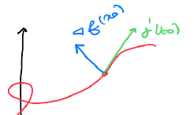{ width=120px }

**Dimostrazione**: Introduco la funzione  
$\psi = f \circ \gamma : \mathbb{R} \to \mathbb{R}$  
Poiché $\underline{x_0} = \gamma(t_0)$ è un punto di estremo vincolato, allora $t_0$ è un punto di estremo (libero) per $\psi$. Dunque per il teorema di Fermat si ha che $\psi'(t_0) = 0$.  
$\psi'(t_0) = \langle \nabla f (\gamma(t_0)), \gamma'(t_0) \rangle = \langle \nabla f (\underline{x_0}), \gamma'(t_0) \rangle$  
$\Rightarrow \langle \nabla f (\underline{x_0}), \gamma'(t_0) \rangle = 0$

## Teorema ($N = 3, V = \Sigma$ superficie regolare in forma implicita $cl(B) = B$)

**Nota**: $cl(B)$ è la chiusura di $B$.

Sia $f : A \subseteq \mathbb{R}^3 \to \mathbb{R}$, $A$ aperto, di classe $C^1$ e $G : K = cl(B) \subseteq \mathbb{R}^2 \to \mathbb{R}^3$, $B$ aperto, $G$ superficie regolare semplice. Se $\underline{x_0} = \Big( x(u_0, v_0), y(u_0, v_0), z(u_0, v_0) \Big) \in \Sigma$ è un punto di estremo vincolato per $f$ in $\Sigma$ e $\underline{u_0} = (u_0, v_0) \in B$, allora  

$$
\begin{cases}
\langle \nabla f (\underline{x_0}), G_u (\underline{u_0}) \rangle = 0 \\
\langle \nabla f (\underline{x_0}), G_v (\underline{u_0}) \rangle = 0
\end{cases}
$$

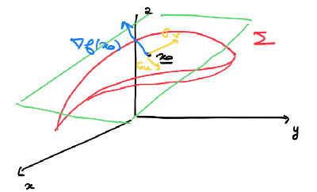{ width=150px }

**Dimostrazione**: Consideriamo la funzione $\psi = f \circ G : K \subseteq \mathbb{R}^2 \to \mathbb{R}$. La funzione $\psi$ ha un punto di estremo in $\underline{u_0} = (u_0, v_0)$, $\underline{x_0} \in B$ ed è di classe $C^1$. Per il test del gradiente si ha che $\nabla \psi (\underline{u_0}) = \underline{0}$.  
$0 = \psi_u (\underline{u_0}) = \langle \nabla f (\psi(\underline{u_0})), G_u (\underline{u_0}) \rangle = \langle \nabla f (\underline{x_0}), G_u (\underline{u_0}) \rangle$  
$0 = \psi_v (\underline{u_0}) = \langle \nabla f (\psi(\underline{u_0})), G_v (\underline{u_0}) \rangle = \langle \nabla f (\underline{x_0}), G_v (\underline{u_0}) \rangle$  

$\boxed{\underbrace{\nabla \psi (\underline{u_0})}_{1 \times 2} = \underbrace{J_f (\underline{x_0})}_{1 \times 3} \cdot \underbrace{J_G (\underline{u_0})}_{3 \times 2}} \quad \square$

## Teorema dei moltiplicatori di Lagrange ($N = 2, \Gamma$ curva regolare in forma implicita)

Sia $f : A \subseteq \mathbb{R}^2 \to \mathbb{R}$, $A$ aperto, di classe $C^1$ e $\varphi : A \subseteq \mathbb{R}^2 \to \mathbb{R}$ di classe $C^1$, e sia $\Gamma = \{ (x, y) \in \mathbb{R}^2 : \varphi(x, y) = 0 \} = L_0 (\varphi)$. Se $(x_0, y_0) = \underline{x_0} \in \Gamma$ è punto di estremo vincolato di $f$ in $\Gamma$ e $\nabla \varphi (\underline{x_0}) \neq \underline{0}$, allora esiste $\lambda \in \mathbb{R}$ tale che $\nabla f (\underline{x_0}) = \lambda \nabla \varphi (\underline{x_0})$.  

{ width=160px }

**Dimostrazione**: Poiché $\nabla \varphi (\underline{x_0}) \neq \underline{0}$ per il teorema del Dini esiste un intorno $\omega$ di $\underline{x_0}$ tale che $\Gamma \cap \omega = \gamma(I)$, dove $\gamma : I \subseteq \mathbb{R} \to A$ è una curva in forma cartesiana con $\gamma(t_0) = \underline{x_0}, t_0 \in \text{int} I$. Dunque dal teorema precedente (minimi vincolati su curve parametriche) si ha che $\langle \nabla f (\underline{x_0}), \gamma'(t_0) \rangle = 0$. Inoltre, per una conseguqnza del teorema del Dini si ha che $\nabla \varphi (\underline{x_0}) \neq \underline{0}, \gamma'(t_0) \neq 0$ e $\langle \nabla \varphi (\underline{x_0}), \gamma'(t_0) \rangle = 0$.  
Da questi due risultati si ha che esiste $\lambda \in \mathbb{R}$ tale che $\nabla f (\underline{x_0}) = \lambda \nabla \varphi (\underline{x_0})$.

**Ossevazione**: Se $\Gamma$ è una curva regolare in forma implicita, allora $\nabla \varphi (\underline{x_0}) \neq \underline{0} \forall \underline{x_0} \in \Gamma$ e quindi l'ipotesi del teorema è soddifatta.

**Osservazione**: Se $\Gamma$ non è una curva regolare in forma implicita allora i punti di estremo vincolato vanno cercati  

$$
\underbrace{
    \begin{cases}
    \nabla f (x, y) = \lambda \nabla \varphi (x, y) \\
    \varphi(x, y) = 0
    \end{cases}
}_{\text{se } (x, y) \text{ è punto regolare}} \vee
\underbrace{
    \begin{cases}
    \nabla \varphi (x, y) = 0 \\
    \varphi(x, y) = 0
    \end{cases}
}_{\text{se } (x, y) \text{ è punto singolare}}
$$

**Esercizio**: Determinare gli estremi di $f(x, y) = x + y$ sulla curva $\Gamma$ di equazione $x^4 + y^4 - 4xy = 1$.

$f$ è una funzione continua  
$\Gamma = \{ (x, y) \in \mathbb{R}^2 : x^4 + y^4 - 4xy - 1 = 0 \}$  
$\Gamma$ è un compatto di $\mathbb{R}^2$  
$\Gamma$ è chiuso $\quad \varphi(x, y) = x^4 + y^4 - 4xy - 1$  
$\Gamma = \varphi^{-1} (\{ 0 \})$, $\varphi$ è continua, $\{ 0 \}$ è un chiuso e dunque $\Gamma$ è un chiuso.  
$\Gamma$ è limitato se $\exists R > 0 : B(0, R) \supset \Gamma$

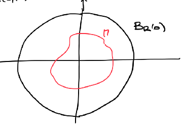{ width=100px }

Essendo $\varphi$ coerciva se $\exists (x_n, y_n) \in L_0 (\varphi)$ tale che $\rho_n = \sqrt{x_n^2 + y_n^2} \to +\infty$ allora $\varphi(x_n, y_n) \to +\infty$ ma si ha che $\varphi(x_n, y_n) = 0, (x_n, y_n) \in L_0 (\varphi)$, assurdo $\Rightarrow \Gamma$ è limitato.

Dunque per il teorema di Weierstrass posso affermare che esistono massimo e minimo assoluti di $f$ su $\Gamma$.

**Punti singolari**:

$$
\begin{aligned}
    &\begin{cases}
        \nabla \varphi (x, y) = \underline{0} \\
        \varphi(x, y) = 0
    \end{cases} \Leftrightarrow
    \begin{cases}
        x^3 = y \\
        y^3 = x \\
        x^4 + y^4 - 4xy - 1 = 0
    \end{cases} \Leftrightarrow \\ \Leftrightarrow &
    \begin{cases}
        x^9 - x = 0 \\
        y = x^3 \\
        x^4 + x^4 - 4x^4 - 1 = 0
    \end{cases} \Leftrightarrow
    \begin{cases}
        x(x^8 - 1) = 0 \\
        y = x^3 \\
        x^4 + x^4 - 4x^4 - 1 = 0
    \end{cases} \Leftrightarrow \\ \Leftrightarrow &
    \begin{cases}
        x = 0 \\
        y = 0 \\
        0 \neq -1
    \end{cases} \vee
    \begin{cases}
        x = 1 \\
        y = 1 \\
        -2 \neq -1
    \end{cases} \vee
    \begin{cases}
        x = -1 \\
        y = -1 \\
        -2 \neq 1
    \end{cases} \Rightarrow \\ \Rightarrow &
    \text{non ci sono punti singolari}
\end{aligned}
$$

Dunque $\Gamma$ è una curva regolare in forma implicita.

Metodo dei moltiplicatori di Lagrange:

$$
\begin{aligned}
    &\begin{cases}
        \nabla f (x, y) = \lambda \nabla \varphi (x, y) \\
        \varphi(x, y) = 0
    \end{cases} \Leftrightarrow
    \begin{cases}
        1 = \lambda (4x^3 - 4y) \\
        1 = \lambda (4y^3 - 4x) \\
        x^4 + y^4 - 4xy - 1 = 0
    \end{cases} \Leftrightarrow \\ \Leftrightarrow &
    \begin{cases}
        \dfrac{1}{\lambda} = 4x^3 - 4y \\
        \dfrac{1}{\lambda} = 4y^3 - 4x \\
        x^4 + y^4 - 4xy - 1 = 0
    \end{cases} \Leftrightarrow
    \begin{cases}
        x^3 - y = y^3 - x \\
        x^4 + y^4 - 4xy - 1 = 0
    \end{cases} \Leftrightarrow \\ \Leftrightarrow &
    \begin{cases}
        (x - y)(x^2 + xy + y^2 + 1) = 0 \\
        x^4 + y^4 - 4xy - 1 = 0
    \end{cases} \Leftrightarrow \\ \Leftrightarrow &
    \begin{cases}
        x = y \\
        x^4 + y^4 - 4xy - 1 = 0
    \end{cases} \quad \boxed{1} \vee
    \begin{cases}
        x^2 + xy + y^2 + 1 = 0 \\
        x^4 + y^4 - 4xy - 1 = 0
    \end{cases} \quad \boxed{2}
\end{aligned}
$$

$\boxed{1}$:  
$x = y \Rightarrow 2x^4 - 4x^2 - 1 = 0$  
$t = x^2 \Rightarrow 2t^2 - 4t - 1 = 0$  
$t_{1,2} = \dfrac{2 \pm \sqrt{6}}{2}$  
$t = \dfrac{2 + \sqrt{6}}{2} \Rightarrow x_{1,2} = \pm \sqrt{\dfrac{2 + \sqrt{6}}{2}}$

$P1 = \left( \sqrt{\dfrac{2 + \sqrt{6}}{2}}, \sqrt{\dfrac{2 + \sqrt{6}}{2}} \right) \quad P2 = \left( -\sqrt{\dfrac{2 + \sqrt{6}}{2}}, -\sqrt{\dfrac{2 + \sqrt{6}}{2}} \right)$

$\boxed{2}$:

$-1 = x^2 + xy + y^2 \geq x^2 + y^2 - \dfrac{1}{2} (x^2 + y^2) = \dfrac{1}{2} (x^2 + y^2) \geq 0 \Rightarrow$ assurdo

$f(P1) = 2 \sqrt{\dfrac{2 + \sqrt{6}}{2}} = \displaystyle\max_{\Gamma} f$  
$f(P2) = -2 \sqrt{\dfrac{2 + \sqrt{6}}{2}} = \displaystyle\min_{\Gamma} f$

**Esercizio**: Determinare gli estremi di $f(x, y) = x$ in $E = \{ (x, y) \in \mathbb{R}^2 : x^3 = y^2 \}$.  

$\displaystyle\min_{E} f = 0 \quad \displaystyle\max_{E} f = +\infty$

Applicando il metodo dei moltiplicatori di Lagrange  

$$
\begin{aligned}
    &\begin{cases}
        \nabla f (x, y) = \lambda \nabla \varphi (x, y) \\
        \varphi(x, y) = 0
    \end{cases} \Leftrightarrow
    \begin{cases}
        1 = 3 \lambda x^2 \\
        0 = -2 \lambda y \\
        x^3 = y^2
    \end{cases} \Leftrightarrow \\ \Leftrightarrow &
    \begin{cases}
        \lambda = 0 \\
        1 \neq 0
    \end{cases} \vee
    \begin{cases}
        y = 0 \\
        x = 0 \\
        1 \neq 0
    \end{cases} \Rightarrow \\ \Rightarrow &
    \text{non esistono soluzioni}
\end{aligned}
$$

Il punto di minimo si trova tra le soluzioni di $\begin{cases} \nabla f (x, y) = 0 \\ \varphi(x, y) = 0 \end{cases}$

## $N = 3, \Sigma$ superficie regolare in forma implicita

## Teorema dei moltiplicatori di Lagrange

Siano $f : A \subseteq \mathbb{R}^3 \to \mathbb{R}$, $A$ aperto e $f \in C^1$ e siano $\varphi : A \subseteq \mathbb{R}^3 \to \mathbb{R}$ di classe $C^1$ e $\Sigma = \{ (x, y, z) \in \mathbb{R}^3 : \varphi(x, y, z) = 0 \} = L_0 (\varphi)$. Se $\underline{x_0} = (x_0, y_0, z_0) \in \Sigma$ è un punto di estremo vincolato di $f$ in $\Sigma$ e se $\nabla \varphi (\underline{x_0}) \neq \underline{0}$, allora esiste $\lambda \in \mathbb{R}$ tale che $\nabla f (\underline{x_0}) = \lambda \nabla \varphi (\underline{x_0})$.

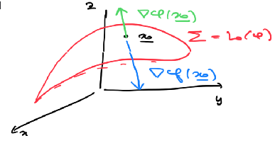{ width=160px }

**Esercizio**: Data $f : \mathbb{R}^3 \to \mathbb{R}$, $f(x, y, z) = x + y + z$ e $\Sigma = \{ (x, y, z) \in \mathbb{R}^3 : x^2 - xy + y^2 - z^2 = 1 \}$. Trovare $\max$ e $\min$ di $f$ su $\Sigma$ (se esistono).

$f$ è continua  
$\Sigma$ è chiuso in quanto $\varphi(x, y, z) = x^2 - xy + y^2 - z^2 - 1 \quad \Sigma = \varphi^{-1} (\{ 0 \})$ è un chiuso  
$\Sigma$ è limitato in quanto $\Sigma \{ (x, y, z) \in \mathbb{R}^3 : \left( x - \dfrac{y}{2} \right)^2 + \dfrac{3}{4} y^2 - z^2 = 1 \}$ è un ellissoide.  
Dunque si ha che se $(x, y, z) \in \Sigma$ allora  
$\dfrac{3}{4} y^2 \leq 1 \Leftrightarrow -\dfrac{2}{\sqrt{3}} \leq y \leq \dfrac{2}{\sqrt{3}}$  
$z^2 \leq 1 \Leftrightarrow -1 \leq z \leq 1$  
$\left( x - \dfrac{y}{2} \right)^2 \leq 1 \Leftrightarrow -1 \leq x - \dfrac{y}{2} \leq 1$  
Quindi si ha che $-1 -\dfrac{2}{\sqrt{3}} \dfrac{1}{2} \leq -1 + \dfrac{y}{2} \leq x \leq 1 + \dfrac{y}{2} \leq 1 + \dfrac{2}{\sqrt{3}} \dfrac{1}{2} \Rightarrow$ $\Sigma$ è limitato.  
Dunque per il teorema di Weierstrass deduco che $\exists \max$ e $\min$ di $f$ su $\Sigma$.  

Vediamo se ci sono punti singolari su $\Sigma$:  
$\begin{cases} \nabla \varphi (x, y, z) = \underline{0} \\ \varphi(x, y, z) = 0 \end{cases} \Leftrightarrow \begin{cases} 2x = y \\ 2y = x \\ z = 0 \\ \varphi(x, y, z) = 0 \end{cases}$  
Dalle prime tre equazioni troverei $(x, y, z) = (0, 0, 0)$ ma $(0, 0, 0) \notin \Sigma$ dunque $\Sigma$ è una superficie regolare in forma implicita.  

Usiamo il metodo dei moltiplicatori di Lagrange:  
$\begin{cases} \nabla f (x, y, z) = \lambda \nabla \varphi (x, y, z) \\ \varphi(x, y, z) = 0 \end{cases} \Leftrightarrow \begin{cases} 1 =\lambda (2x - y) \\ 1 = \lambda (2y - x) \\ 1 = 2\lambda z \\ x^2 - xy + y^2 - z^2 = 1 \end{cases}$  
Risolvendo il sistema si trova che  
$\begin{cases} x = \dfrac{2}{\sqrt{5}} \\ y = \dfrac{2}{\sqrt{5}} \\ z = -\dfrac{1}{\sqrt{5}} \end{cases} \quad \begin{cases} x = -\dfrac{2}{\sqrt{6}} \\ y = -\dfrac{2}{\sqrt{5}} \\ z = \dfrac{1}{\sqrt{5}} \end{cases}$  
$f(\dfrac{2}{\sqrt{5}}, \dfrac{2}{\sqrt{5}}, -\dfrac{1}{\sqrt{5}}) = -\sqrt{5} = \displaystyle\max_{\Sigma} f$  
$f(-\dfrac{2}{\sqrt{6}}, -\dfrac{2}{\sqrt{5}}, \dfrac{1}{\sqrt{5}}) = \sqrt{5} = \displaystyle\min_{\Sigma} f$  

**Esercizio**: Trovare massimi e minimi di  
$f : \mathbb{R}^2 \to \mathbb{R} \quad f(x, y) = y^3 + 4x^2y - 4y$  
su $E = \{ (x, y) \in \mathbb{R}^2 : \dfrac{1}{2} \leq x^2 + y^2 \leq 1 \}$.  

$f$ ammette massimo e minimo su $E$ per il teorema di Weierstrass.  
Si cercano massimo e minimo su  

- $\mathring{E} = \{ (x, y) \in \mathbb{R}^2 : \dfrac{1}{2} < x^2 + y^2 < 1 \}$  
- $\partial B(0, \frac{1}{2})$  
- $\partial B(0, 1)$

Massimo e minimo liberi:  
$\nabla f (x, y) = (8xy, 3y^2 + 4x^2 - 4) = \underline{0} \Leftrightarrow \underbrace{\left( 0, \pm \dfrac{2}{\sqrt{3}} \right)}_{\notin \mathring{E}} \quad \underbrace{\left( \pm 1, 0 \right)}_{\notin \mathring{E}}$  

Consideriamo la frontiera $x^2 + y^2 = \dfrac{1}{2}$ (è una curva regolare in forma implicita):  
$\varphi_1 (x, y) = x^2 + y^2 - \dfrac{1}{2}$  
$\begin{cases} \nabla f (x, y) = \lambda \varphi_1 (x, y) \\ \varphi_1 (x, y) = 0 \end{cases} \Leftrightarrow \dots \Rightarrow \left( 0, \pm \dfrac{1}{\sqrt(2)} \right)$

Consideriamo la frontiera $x^2 + y^2 = 1$ (è una curva regolare in forma implicita):  
$\varphi_2 (x, y) = x^2 + y^2 - 1$  
$\begin{cases} \nabla f (x, y) = \lambda \varphi_2 (x, y) \\ \varphi_2 (x, y) = 0 \end{cases} \Leftrightarrow \dots \Rightarrow \left( 0, \pm 1 \right)$ e $\left( \pm 1, 0 \right)$  

Nel complesso i punti da considerare sono:  
$\left( 0, \pm \dfrac{1}{\sqrt{2}} \right) \quad \left( 0, \pm 1 \right) \quad \left( \pm 1, 0 \right)$  

Si ha che  
$f(\pm 1, 0) = 0 \quad f(0, \pm 1) = \mp 3 \quad f(0, \pm \dfrac{1}{\sqrt{2}}) \leq \pm 3$  

Dunque si ha che $\displaystyle\max_{E} f = f(0, 1) = -3 \quad \displaystyle\min_{E} f = f(0, -1) = 3$

# Equazioni differenziali

## Modello: dinamica delle popolazioni

Sia $P(t)$ il numero di individui di una popolazione al tempo $t$.

## Modello di Malthus o Geometrico

Se la popolazione è isolata e le risorse sono illimitate, lo sviluppo della popolazione dipende solo dal tasso di natalità $\nu$ e dal tasso di mortalità $\mu$.  
$P(t + h) - P(t) = \nu P(t) h - \mu P(t) h = ( \nu - \mu ) P(t) h$  
$\dfrac{P(t + h) - P(t)}{h} = (\nu - \mu) P(t)$  
Se faccio tendere $h \to 0$  
$P'(t) = (\nu - \mu) P(t)$  
$P(t) = e^{(\nu - \mu) t}$  
Quindi se $\nu > \mu$ la popolazione cresce esponenzialmente, se $\nu < \mu$ la popolazione decresce esponenzialmente e se $\nu = \mu$ la popolazione rimane costante.

## Modello di Verhulst o Logistico

Si suppone che le risorse siano limitate  
$P(t + h) - P(t) = (\nu - \mu) P(t) h - \varepsilon P(t) P(t) h = [(\nu - \mu) - \varepsilon P(t)] P(t) h$  
$\dfrac{P(t + h) - P(t)}{h} = [(\nu - \mu) - \varepsilon P(t)] P(t)$  
$P'(t) = [(\nu - \mu) - \varepsilon P(t)] P(t)$  

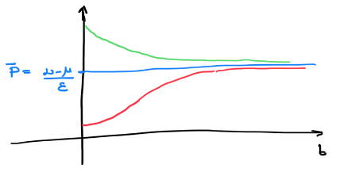{ width=180px }

## Equazioni differenziali

Sono equazioni funzionali in cui qualche derivata della funzione compare nell'equazione.

### Equazioni differenziali ordinarie (EDO o ODE)

La funzione incognita dipende da una sola variabile.

### Equazioni differenziali alle derivate parziali (EDP o PDE)

La funzione incognita dipende da più variabili.

### Ordine di un'equazione differenziale

È l'ordine massimo di derivazioni con cui la funzione incognita compare.  
$y'(x) = 3y(x) \quad \text{ordine } 1$ in $FN$ (forma normale)  
$y'' \cdot y -3y^2 = 0 \quad \text{ordine } 2$ non in $FN$

### EDO in forma normale

Sono le equazioni differenziali in cui le derivate di ordine massimo compaiono esplicitate nell'equazione.  

### EDO scalari dal primo ordine in forma normale

Sia $f : E \subseteq \mathbb{R}^2 \to \mathbb{R}$. Un'equazione differenziale ordinaria scalare del primo ordine in forma normale è del tipo $y'(x) = f(x, y(x))$, dove $y$ è la funzione incognita.  

Una funzione $y : I \subseteq \mathbb{R} \to \mathbb{R}$, $I$ intervallo, si sdice soluzione di $y'(x) = f(x, y(x))$ se  

1. $y$ è derivabile in $I$  
2. $(x, y(x)) \in E \quad \forall x \in I$  
3. $y'(x) = f(x, y(x)) \quad \forall x \in I$

## Problema di Cauchy  

Siano $f : E \subseteq \mathbb{R}^2 \to \mathbb{R}$ e $(x_0, y_0) \in E$. Il problema  
$(*) \begin{cases} y'(x) = f(x, y(x)) \\ y(x_0) = y_0 \end{cases}$  
si dice **problema di Cauchy**.  
Si dice che $y : I \subseteq \mathbb{R} \to \mathbb{R}$, $I$ intervallo, è soluzione del problema di Cauchy $(*)$ se  

1. $y$ è soluzione di $y' = f(x, y)$  
2. $x_0 \in I$  
3. $y(x_0) = y_0$  

## Teorema di esistenza locale (di Peano)

Se $f : A \subseteq \mathbb{R}^2 \to \mathbb{R}$, $A$ aperto, è continua in $A$ e $(x_0, y_0) \in A$, allora $\exists h > 0$ e una funzione di classe $C^1$ $y(\cdot) : I = \ ] x_0 - h, x_0 + h [ \ \to \mathbb{R}$ soluzione del problema di Cauchy $(*)$.  

**Osservazione**: $\begin{cases} y' = 2 \sqrt{ \left| y \right| } \\ y(0) = 0 \end{cases}$ ha almeno due soluzioni:  
$y(x) = 0 \quad y(x) = \begin{cases} x^2 & x > 0 \\ -x^2 & x \leq 0 \end{cases}$  

Per $x > 0 \quad y'(x) = 2  x = 2 \left| x \right| = 2 \sqrt{x^2} = 2 \sqrt{ \left| y \right| }$  
$y(x) = x^2$  
Per $x \leq 0 \quad y'(x) = -2  x = 2 \left| x \right| = 2 \sqrt{x^2} = 2 \sqrt{ \left| y \right| }$

Questo PC (problema di Cauchy) ammette infinite soluzioni  
$y_{\alpha, \beta} (x) = \begin{cases} - (x - \alpha)^2 & x \leq \alpha < 0 \\ 0 & \alpha < x < \beta \\ (x - \beta)^2 & x \geq \beta \end{cases}$  

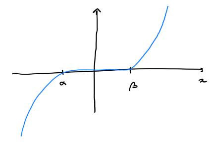{ width=120px }

**Osservazione**: In questo esempio $\dfrac{\partial f}{\partial y}$ non esiste per $y = 0$.

## Teorema di esistenza e unicità locale (di Cauchy-Lipschitz)

Se $f : A \subseteq \mathbb{R}^2 \to \mathbb{R}$, $A$ aperto, è continua in $A$, $\dfrac{\partial f}{\partial y}$ è continua in $A$ e $(x_0, y_0) \in A$, allora esistono $h > 0$ e una funzione di classe $C^1$ $y : I = \ ] x_0 - h, x_0 + h [ \ \to \mathbb{R}$ soluzione del problema di Cauchy  
$\begin{cases} y'(x) = f(x, y(x)) \\ y(x_0) = y_0 \end{cases}$

## Lemma di Volterra

Se $f : A \subseteq \mathbb{R}^2 \to \mathbb{R}$ continua. Si ha che  

1. $y : [x_0 - h, x_0 + h] \to \mathbb{R}$ è soluzione di classe $C^1$ del PC  
   se e solo se
2. $y : [x_0 - h, x_0 + h] \to \mathbb{R}$ è soluzione continua  
   $y(x) = y_0 + \displaystyle\int_{x_0}^x f(t, y(t)) dt$  

## Dipendenza continua della soluzione dal dato iniziale

Sia $f: A \subseteq \mathbb{R}^2 \rightarrow \mathbb{R}$, $A$ aperto, continua in $A$ e $\frac{\partial f}{\partial y}$ continua in $A$. Se $(x_0, y_0) \in A$ e $y: [x_0 - h, x_0 + h] \rightarrow \mathbb{R}$ è soluzione del PC  
$\begin{cases} y' = f(x, y) \\ y(x_0) = y_0 \end{cases}$

allora $\forall \varepsilon > 0$ esiste $\delta > 0$ tale che, per ogni $z_0 \in \mathbb{R}$ t.c. $\lvert y_0 - z_0 \rvert < \delta$, la soluzione $z$ del (PC)  
$\begin{cases} z' = f(x, z) \\ z(x_0) = z_0 \end{cases}$

è definita su $]x_0 - h, x_0 + h[$ e si ha che  
$\lvert y(x) - z(x) \rvert < \varepsilon$ in $]x_0 - h, x_0 + h[$

## Esistenza locale - esistenza globale

$$
1. \begin{cases}
    y' = y \\
    y(0) = 1
\end{cases} \qquad
\begin{aligned}
    & f(x, y) = y \\
    & y : I = \mathbb{R} \to \mathbb{R} \\
\end{aligned} \\
$$

$$
2. \begin{cases}
    y' = y^2 \\
    y(0) = 1
\end{cases} \qquad
\begin{aligned}
    & f(x, y) = y^2 \\
    & y(x) = \dfrac{1}{1 - x} \\
    & I = \ ] -\infty, 1 [
\end{aligned}
$$

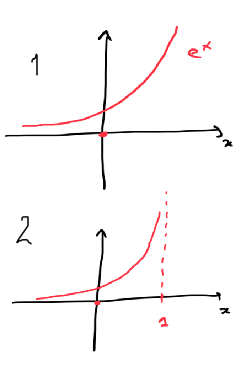{ width=100px }

## Teorema di esistenza globale

Sia $f: A \subseteq \mathbb{R}^2 \rightarrow \mathbb{R}$

$A = \ ]a, b[ \ \times \mathbb{R}, \quad f \text{ continua}$
$(a \in \mathbb{R} \cup \{-\infty\}, b \in \mathbb{R} \cup \{+\infty\})$

e $(x_0, y_0) \in A$ e per ogni compatto $H \subseteq \ ]a, b[$ esistono $\alpha, \beta \in \mathbb{R}^+ = \{ x \in \mathbb{R} \mid x \geq 0 \}$ tali che

$\lvert f(x, y) \rvert \leq \alpha \cdot \lvert y \rvert + \beta \quad \text{in } H \times \mathbb{R}$

allora il (PC)

$\begin{cases} y' = f(x, y) \\ y(x_0) = y_0 \end{cases}$

ha una soluzione definita su $\ ]a, b[$.

**Esempio**: $f(x, y) = x^2 (1 +y \sin(y))$  
$f : \underbrace{\mathbb{R} \times \mathbb{R}}_{=A} \to \mathbb{R} \quad \ ]a, b[ \ = \mathbb{R}$  
Sia $H$ un compatto di $\mathbb{R}$  

$\left| f(x, y) \right| \leq \left| x^2 \right| \left( 1 + \left| y \right| \left| \sin(y) \right| \right) \leq \displaystyle\max_{x \in H} \left| x^2 \right| \left( 1 + \left| y \right| \right) \quad$ in $H \times \mathbb{R}$  

$\alpha = \beta = \displaystyle\max_{x \in H} \left| x^2 \right|$

## Lemma di prolungabilità

Sia $f : A \subseteq \mathbb{R}^2 \to \mathbb{R}$, $A$ aperto, $f$ è continua e sia $y : \ ]c, d[ \ \to \mathbb{R}$ una soluzione di $y' = f(x, y)$. Se esiste un compatto $K \subseteq \ A$ tale che $G(y(\cdot)) \subseteq K$ allora esiste un $\delta > 0$ tale che la soluzione $y$ è definita in $]c - \delta, d + \delta[$ (cioè è prolungabile).

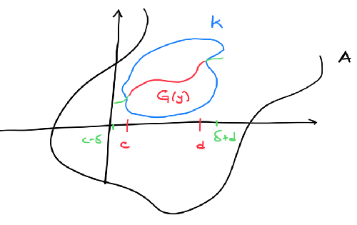{ width=180px }

**Osservazione**: Supponiamo di essere sotto la ipotesi del teorema di C-L (Cauchy-Lipschitz), quindi ho esistenza e unicità locale. Se $y_1(t)$ e $y_2(t)$ sono due soluzioni distinte di $y' = f(t, y(t))$ allora il loro grafici non si possono intersecare.

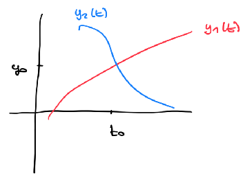{ width=100px }

Allora posso considerare il (PC)  
$\begin{cases} y' = f(t, y(t)) \\ y(t_0) = y_0 \end{cases} \Rightarrow y_1(t) = y_2(t) \quad \rightarrow$ teorema di $\exists$ e ! locale

**Esempio**: $\begin{cases} y' = 2 \sqrt{ \left| y \right| } \\ y(0) = 0 \end{cases}$  
$y_1(x) = 0 \quad y_2(x) = \begin{cases} -x^2 & x \leq 0 \\ x^2 & x > 0 \end{cases}$

## Studio qualitativo di una EDO

**Esempio**: $y'(x) = x \cdot y(x)$  

$f(x, y) = x \cdot y \qquad f : \mathbb{R} \times \mathbb{R} \to \mathbb{R}$  
La $f$ soddisfa le ipotesi di C-L, ovvero $f$ e $\dfrac{\partial f}{\partial y}$ sono continue $\Rightarrow$ esiste e ! locale.  
Sono soddisfatte le ipotesi del teorema di esistenza globale.  
Fissato un compatto $H$ di $\mathbb{R}$,  
$\left| f(x, y) \right| = \left| x \cdot y \right| \leq \displaystyle\max_{x \in H} \left| y \right|$ in $H \times \mathbb{R} \qquad \alpha = \displaystyle\max_{x \in H} \left| x \right| \quad \beta = 0$  
Dunque le soluzioni esistono su tutto $\mathbb{R}$. Osservo che $y(x) = 0$ è una soluzione.  
$f(x, y) = x \cdot y \quad y' = x \cdot y$  
Osserviamo che la $f(x, y)$ è positiva nel primo e nel terzo quadrante e dunque $y'(x) > 0$ $\Rightarrow$ $y$ è crescente nel primo e nel terzo quadrante.  
In maniera analoga posso dedurre che la $y$ è decrescente nel secondo e nel quarto quadrante.  
$y \in C^1 \quad y'(x) = x \cdot y(x) \Rightarrow y'(x)$ è di classe $C^1$ $\Rightarrow$ $y \in C^2$  
$y'' = (y')' = (x \cdot y(x))' = y(x) + x \cdot y'(x) = y(x) + x (x \cdot y(x)) = y(x) \underbrace{(1 + x^2)}_{> 0}$  
$y''$ e $y$ hanno lo stesso segno e dunque dove $y$ è positiva è convessa e dove è negativa è concava.  
Le soluzioni sono funzioni pari. Considero il problema di Cauchy  
$\begin{cases} y'(x) = x \cdot y(x) \\ y(0) = y_0 \end{cases}$  
$z(x) = y(-x) \quad$ (tesi: $y(x) = z(x)$)  
Facciamo vedere ch e$z$ è soluzione del problema di Cauchy  
$z'(x) = -y'(-x) = -(-x) \cdot y(-x) = x \cdot z(x)$  
$z(0) = y(-0) = y_0$  
$\Rightarrow z$ è soluzione del (PC)  
Allora per l'unicità del problema di Cauchy si ha che  
$z(x) = y(x) \Rightarrow y(-x) = y(x) \Rightarrow y$ è pari  

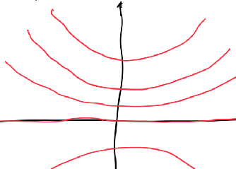{ width=100px }

## EDO e variabili separate

Siano $g : \ ]a, b[ \ \to \mathbb{R}$ continua e $h : \ ]c, d[ \ \to \mathbb{R}$ di classe $C^1$. Consideriamo il problema di Cauchy  
$\begin{cases} y' = g(x) \cdot h(y) \\ y(x_0) = y_0 \end{cases}$  
Con queste ipotesi, $f(x, y) = g(x) \cdot h(y)$ verifica le ipotesi di $\exists$ e ! locale $\Rightarrow$ $y : I \to \mathbb{R}$ soluzione del problema di Cauchy.  
Metodo di risoluzione:  

Caso $h(y_0) = 0$:  
allora la soluzione del (PC) è la funzione del PC $y(x) \equiv y_0$ (e si dice **equilibrio**).

Caso $h(y) \neq 0$:  
Sia $y$ la soluzione del (PC) $y : I \to \mathbb{R}$ e affermo che $h(y(x)) \neq 0 \quad \forall x \in I$. Se esistesse $x_1 \in I$ tale che $h(y(x_1)) = 0$.  
Chiamo $y_1(x) = y(x_1)$. Considero il problema di Cauchy  
$(PC)_1 \quad \begin{cases} y' = g(x) \cdot hzy) \\ z(x_1) = y_1 \end{cases}$  
Dunque avrei due soluzioni distinte di $(PC)_1$ ovvero $z_1(x) = y(x)$ e $z_2(x) = y_1$ $\Rightarrow$ assurdo.  
Dunque ha senso considerare  
$\begin{cases} \dfrac{y' (x)}{h(y(x))} = g(x) \\ y(x_0) = y_0 \end{cases}$  
$\displaystyle\int_{x_0}^x \dfrac{y'(t)}{h(y(t))} dt = - \int_{x_0}^x g(t) dt$  
Operando un cambio di variabili $s = y(t)$ si ha  
$\displaystyle\int_{y_0}^{y(x)} \dfrac{1}{h(s)} ds = - \int_{x_0}^x g(t) dt$  
Indicado con $G$ una primitiva di $g$ in $]a, b[$ e con $K$ una primitiva di $\dfrac{1}{h}$ sull'intervalllo $y(I)$ si ha  
$K(y(x)) - K(y_0) = G(x) - G(x_0)$  
Poiché $K' (0) = \dfrac{1}{h(s)} \neq 0$ si conclude che $K$ è iniettiva e  
$y(x) = K^{-1} (G(x) - G(x_0) + K(y_0))$  

**Esempio**: $y' = xy \quad g(x) = x \quad h(y) = y$  
$h(0) = 0 \quad y(x) \equiv 0$ è una soluzione.  
$\displaystyle\int_{x_0}^x \dfrac{y'(t)}{y(t)} dt = \int_{x_0}^x t \ dt$  
con il cambio di variabili $s = y(t)$ si ha  
$\displaystyle\int_{y_0}^{y} \dfrac{1}{s} ds = \int_{x_0}^x t \ dt$  
$\ln \left| s \right| \Big|_{y_0}^y = \dfrac{x^2}{2} - \dfrac{x_0^2}{2}$  
Si divide in due casi:  

- $y(x) > 0 \qquad y(x) = \left( y_0 \cdot e^{- \frac{x_0^2}{2}} \right) \cdot e^{\frac{x^2}{2}}$  
- $y(x) < 0 \qquad y(x) = \left( y_0 \cdot e^{- \frac{x_0^2}{2}} \right) \cdot e^{- \frac{x^2}{2}}$  

**Esempio**: $\begin{cases} y' = y^2 \\ y(0) = 1 \end{cases}$  
dopo il cambio di variabili $s = y(t)$ si ha  
$\displaystyle\int_{1}^{y(x)} \dfrac{1}{s^2} ds = \int_{0}^{x} 1 \ dt$  
$- s^{-1} \Big|_{1}^{y(x)} = x$  
$- \dfrac{1}{y(x)} + 1 = x \Rightarrow y(x) = \dfrac{1}{1 - x}$  

## Teorema dell'asintoto

Sia $u : I = [a, +\infty[$, con $a \in \mathbb{R} \cup \{-\infty\}$, di classe $C^1$ e tale che esistono i limiti  

1. $\displaystyle\lim_{t \to +\infty} u(t) = \ell$  
2. $\displaystyle\lim_{t \to +\infty} u'(t) = m$  

Se $\ell < +\infty$ allora $m = 0$.

**Dimostrazione**: Consideriamo  

$$
\begin{aligned}
    & u(t + 1) - & u(t) & \longrightarrow 0 \\
    \scriptsize{t \to + \infty} & \large{\downarrow} & \scriptsize{t \to + \infty} \large{\downarrow} & \\
    & \ell & \ell &
\end{aligned}  
$$

Per il teorema del valor medio $\exists \xi_t \in \ ]t, t + 1[$ tale che  

$$
\begin{aligned}
    & (t + 1) - u(t) = & u'(\xi_t) \cdot 1 \\
    \scriptsize{t \to + \infty} & \downarrow & \downarrow \scriptsize{t \to + \infty} \\
    & 0 & m
\end{aligned}
\qquad \Rightarrow m = 0
$$

**Esempio**: Consideriamo il problema di Cauchy  
$\begin{cases} y'(x) = x^2 \cos(y) \\ y(0) = 0 \end{cases}$  
Dimostrare che  

1. $\exists !$ soluzione del (PC) $y : \mathbb{R} \to \mathbb{R}$  
2. Calcolare il limite $\displaystyle\lim_{x \to +\infty} y(x)$  
3. La soluzione è dispari

**Dimostrazione 1**: $y' = f(x, y) \quad f(x, y) = x^2 \cos(y) \quad f : \mathbb{R} \times \mathbb{R} \to \mathbb{R}$  
Per il teorema di C-L continua e $\dfrac{\partial f}{\partial y} = -x^2 \sin(y)$ $\Rightarrow$ $\exists$ e ! locale.  
Poiché $\forall $H$ compatto di $\mathbb{R}$  
$\left| f(x, y) \right| = \left| x^2 \cos(y) \right| \leq \left| x \right|^2 \leq \displaystyle\max_{x \in H} \left| x \right|^2$  
allora per il teorema di esistenza globale con $\alpha = 0$ e $\beta = \displaystyle\max_{x \in H} \left| x \right|^2$ segue l'esistenza globale della soluzione $y$ su tutto $\mathbb{R}$.  

**Dimostrazione 2**: $f(x, y) = x^2 \cos(y) \quad y_1(x) \equiv - \dfrac{\pi}{2} \quad y_2(x) \equiv \dfrac{\pi}{2}$  
sono due equilibri per $y' = f(x, y)$.  
Poiché siamo sotto ipotesi di $\exists$ e !, significa che la soluzione $y$ di (PC) è tale che $\left| y(x) \right| < \dfrac{\pi}{2} \Rightarrow \cos(y(x)) > 0 \Rightarrow y'(x) = x^2 \cos(y(x)) \geq 0$  
Abbiamo che $y(x)$ è una funzione crescente, dunque esiste $\displaystyle\lim_{x \to +\infty} y(x) = \ell \leq \dfrac{\pi}{2}$  
Poiché $y'(x) = x^2 \cos(y(x)) \stackrel{x \to +\infty}{\longrightarrow} m$  
allora per il teorema dell'asintoto ho che $m = 0$.  
Dunque si deve avere che $\displaystyle\lim_{x \to +\infty} y(x) = \dfrac{\pi}{2}$.

**Dimostrazione 3**: Introduco una funzione ausiliaria $z(x) = -y(-x)$. Facciamo vedere che $z$ risolve il (PC)  
$z'(x) = + y'(-x) = (-x)^2 \cos(y(-x)) = x^2 \cos(-y(-x)) = x^2 \cos(z(x))$  
$z(0) = -y(-0) = y(0) = 0$  
Dunque per l'unicità della soluzione si ha che $z(x) = y(x)$, cioè $-y(-x) = y(x) \Rightarrow y$ è dispari.

**Esempio**: Studio qualitativo dell'equazione logistica  
$\begin{cases} y' (x) = a \cdot y(x) \cdot (1 - y(x)) & a > 0 \\ y(0) = y_0 & 0 < y_0 < 1 \end{cases}$  
$f(y) = a \cdot y \cdot (1 - y)$  
Osservo che $y_1(x) \equiv 0$ e $y_2(x) \equiv 1$ sono due equilibri.  
Poiché siamo sotto ipotesi di $\exists$ e ! locale, cioè $f$ è continua e $\dfrac{\partial f}{\partial y}$ è continua, allora la soluzione $y$ del (PC) è talce che $0 < y(x) < 1$  

La soluzione $y$ è definita su tutto $\mathbb{R}$. Infatti se non lo fosse  
$y : I = [a, b] \to \mathbb{R} \quad a, b \in \mathbb{R}$  
allora essendo $0 \leq y(x) \leq 1$ avrei che  
$\gamma(y) \subseteq I \times [0, 1]$ compatto di $\mathbb{R}^2$  
allora per il teorema di "figa da un compatto"  
$\exists \delta > 0$ tale che $y$ è estendibile all'intervallo $]a - \delta, b + \delta[$ $\Rightarrow$ assurdo, poiché si suppone che $I$ sia l'intervallo massimale.  

$y'(x) = a y(x) (1 - y(x)) > 0 \Rightarrow y$ è crescente.  
Dunque $\exists \displaystyle\lim_{x \to +\infty} y(x) = L_1$ e $\exists \displaystyle\lim_{x \to -\infty} y(x) = L_2$  
$0 < L_2 < L_1 < 1$  
$\displaystyle\lim_{x \to +\infty} y'(x) = \lim_{x \to +\infty} a y(x) (1 - y(x)) = a L_1 (1 - L_1) < \infty$  
Per il teorema dell'asintoto si ha che $a L_1 (1 - L_1) = 0 \Rightarrow L_1 = 1$.  
In maniera analoga si dimostra che $L_2 = 0$.

# EDO lineari del primo ordine

## Principio di linearizzazione

Sia $f : A \subseteq \mathbb{R}^2 \to \mathbb{R}$, $A$ aperto, $f \in C^1$.  
Vogliamo approssimare la soluzione del (PC)  
$\begin{cases} y' = f(x, y) \\ y(x_0) = y_0 \end{cases}$  
con la soluzione $z$ del problema linearizzato  
$\begin{cases} z' = \overline{f}(x, z) \\ z(x_0) = y_0 \end{cases}$  
$\overline{f}(x, y) = f(x_0, y_0) + f_x(x_0, y_0) (x - x_0) + f_y(x_0, y_0) (y - y_0)$  
$\overline{f}(x, y) = \alpha y + \beta x + \gamma$  
dove $\alpha = f_y(x_0, y_0)$, $\beta = f_x(x_0, y_0)$ e $\gamma = f(x_0, y_0) - \beta x_0 - \alpha y_0$  
$\begin{cases} z' = \alpha z + \beta x + \gamma \\ z(x_0) = y_0 \end{cases}$  
Osserviamo che $y(x_0) = y_0 = z(x_0)$ e $(*) \ \ y'(x_0) = f(x_0, y_0) = z'(x_0, y_0)$  
$y''(x_0) = f_x(x_0, y_0) + f_y(x_0, y_0) y'(x_0) = \beta + \alpha y'(x_0) = z''(x_0) = \alpha z'(x_0) + \beta$  
Considero i polinomi di Taylor di secondo grado in $x_0$ di $y$ e $z$.  
Da $(*)$ si ha che i due polinomi conicidono  
$y(x) = p_{2, x_0} (x) + \varepsilon(x) (x - x_0)^2 \quad$ dove $\varepsilon(x) \to 0$ per $x \to x_0$  
$z(x) = p_{2, x_0} (x) + \mu(x) (x - x_0)^2 \quad$ dove $\mu(x) \to 0$ per $x \to x_0$  
$\left| y(x) - z(x) \right| = \left| \varepsilon(x) - \mu(x) \right| (x - x_0)^2 = o( \left| x - x_0 \right|^2)$

**Esempio**: $\begin{cases} y' = e^y = f(x, y) \\ y(0) = 0 \end{cases}$  
$y(x) = - \ln(1 - x)$  
$f(x, y) = e^y \quad f(0, 0) = e^0 = 1$  
$\partial_x f (x, y) = 0 \quad \partial_y f(x, y) = e^y \quad \partial_y f(0, 0) = 1$  
$\overline{f}(x, y) = 1 + 0 \cdot (x - 0) + 1 \cdot (y - 0) = 1 + y$  
$\begin{cases} z' = \overline{f}(x, z) = 1 + z \\ z(0) = 0 \end{cases}$  
$z(x) = e^x - 1$

# EDO lineari del primo ordine scalari

Siano $a, b : I \subseteq \mathbb{R} \to \mathbb{R}$, $I$ intervallo aperto, continue.  
L'EDO $(C) \quad y'(x) = a(x) y(x) + b(x)$ si dice **EDO lineare del primo ordine scalare COMPLETA**.  
L'EDO $(O) \quad y'(x) = a(x) y(x)$ si dice **EDO lineare del primo ordine scalare OMOGENEA**.  

**Esempio**: $y'(x) = \cos(x) y(x) + x^3 \quad y'(x) = \cos(x) y(x)$  
$(C) \quad a(x) = \cos(x) \quad b(x) = x^3$  
$(O) \quad a(x) = \cos(x)$  

## Teorema 1

Per ogni $x_0 \in I$ e $y_0 \in \mathbb{R}$, il (PC)  
$\begin{cases} y'(x) = a(x) y(x) + b(x) \\ y(x_0) = y_0 \end{cases}$  
ammette una ed una sola soluzione definita su $I$.  

**Dimostrazione**: $\exists$ e ! $\quad f(x, y) = a(x) y + b(x)$, $f$ è continua e $\dfrac{\partial f}{\partial y} = a(x)$  
Per (sotto)linearità si ha l'esistenza su tutto $I$.  
Definiamo $L : C^1(I) \to C^0(I)$  
$y(x) \mapsto y'(x) - a(x) y(x)$  
$L$ è un operatore lineare, ovvero  
$L(\alpha y_1(x) + \beta y_2(x)) = \alpha L(y_1(x)) + \beta L(y_2(x))$  
Si ha che  
$(C) \quad y'(x) = a(x) y(x) + b(x) \Leftrightarrow L(y) = b \Leftrightarrow y \in L^{-1}(\{b\}) \Leftrightarrow y \in ker \, L$

## Teorema 2

L'insieme $S_b$ delle soluzioni della completa è costituito da tutto e sole le funzioni del tipo $y(x) = \overline(y) + z(x)$, dove $\overline{y}(\cdot)$ è una soluzione particolare della completa e $z(\cdot)$ è una generica soluzione dell'omogenea $(O)$, cioè $S_b = \overline{y} + ker \, L$.  

## Teorema 3

L'insieme $S_0 = ker \, L$ è uno spazio vettoriale di dimensione $1$ e risulta $S_0 = ker \, L = \{ c \cdot e^{A(\cdot)} : c \in \mathbb{R} \}$, dove $A(\cdot)$ è una primitiva (qualsiasi) di $a(\cdot)$ in $I$.  

**Dimostrazione**: Se $z(x) = c e?{A(x)}$ allora  
$z'(x) = c A'(x) e^{A(x)} = c a(x) e^{A(x)} = a(x) z(x)$  
Se $z$ è una soluzione allora  
$0 = z'(x) - a(x) z(x) = 0$, moltiplico pe r$e^{-A(x)}$  
$0 = z'(x) e^{-A(x)} - a(x) e^{-A(x)} z(x) = \dfrac{d}{dx} \left( z(x) e^{-A(x)} \right)$  
Dunque $z(x) e^{-A(x)} = c \Rightarrow z(x) = c e^{A(x)}$, con $c \in \mathbb{R}$.

## Teorema 4

Una soluzione particolare di $(C)$ è $\quad \overline{y}(x) = \displaystyle\int_{x_0}^x e^{A(x) - A(t)} b(t) dt$ in $I$ con $x_0 \in I$ fissato.  

**Dimostrazione**: Cerco soluzioni del tipo $\overline{y}(x) = c(x) e^{A(x)}$, con $x \in I$ (metodo di variazione della costante).  
$\overline{y}'(x) = c'(x) e^{A(x)} + c(x) a(x) e^{A(x)}$  
Impongo che sia uguale a $a(x) \overline{y}(x) + b(x) = a(x) c(x) e^{A(x)} + b(x)$  
Semplificando si ha che $c'(x) e^{A(x)} = b(x) \Rightarrow c'(x) = b(x) e^{-A(x)}$  
$c(x) = \displaystyle\int_{x_0}^x b(t) e^{-A(t)} dt$  
$\overline{y}(x) = c(x) e^{A(x)} = \left[ \displaystyle\int_{x_0}^x b(t) e^{-A(t)} dt \right] e^{A(x)} = \displaystyle\int_{x_0}^x b(t) e^{A(x) - A(t)} dt$  

### Corollario

La generica soluzione di $(C)$ è  
$y(x) = c e^{A(x)} + \displaystyle\int_{x_0}^x e^{A(x) - A(t)} b(t) dt$, con $x_0 \in I$ fissato e $c \in \mathbb{R}$.  
Se consideriamo  
$\begin{cases} y'(x) = a(x) y(x) + b(x) \\ y(x_0) = y_0 \end{cases}$  
la costante $c = y_0 e^{-A(x_0)}$.

# Esercizi EDO lineari

**Esercizio**: Trovare la soluzione del seguente problema di Cauchy  
$\begin{cases} y'(x) = -2x y(x) + x^3 \\ y(0) = 1 \end{cases}$  
$a(x) = -2x \quad b(x) = x^3 \qquad I = \mathbb{R}$  
Una primitiva $A(x)$ di $a(x)$ è $A(x) = -x^2$  
Dunque la soluzione della completa ha forma  
$y(x) = c e^{-x^2} + \displaystyle\int_{0}^x e^{-x^2 + t^2} t^3 dt \quad y(0) = 1$  
$y(0) = c \cdot e^0 = 1 \Rightarrow c = 1$  
$y(x) = e^{-x^2} + \displaystyle\int_{0}^x e^{-x^2 + t^2} t^3 dt = e^{-x^2} \left[ 1 + \displaystyle\int_{0}^x e^{t^2} t^3 dt \right] \boxed{=}$  
Per costituzione $u = t^2 \Rightarrow du = 2t \, dt \Rightarrow u \, du = t^2 \, du = 2 t^3 \, dt$  
$\boxed{=} e^{-x^2} \left[ 1 + \dfrac{1}{2} \displaystyle\int_{0}^{x^2} e^u du \right] = e^{-x^2} \left[ 1 + \dfrac{1}{2} \left[ e^u \left(u - 1 \right) \right]_{0}^{x^2} \right] = e^{-x^2} \left[ \dfrac{3}{2} + e^{x^2} \left( x^2 - 1 \right) \right]$  

**Esercizio**: $y'(x) = - \dfrac{y(x)}{x} + 4x \quad a(x) = - \dfrac{1}{x} \quad b(x) = 4x \quad I = \{ x \in \mathbb{R} : x > 0 \}$  
$A(x) = - \ln(x) \quad y(x) = c e^{- \ln(x)} + e^{- \ln(x)} \displaystyle\int_{1}^{x} e^{\ln(t)} 4t dt =$  
$= c \dfrac{1}{x} + \dfrac{1}{x} \displaystyle\int_{1}^{x} 4t^2 dt = \dfrac{c}{x} + \dfrac{4}{3} x^2 - \dfrac{4}{3} \dfrac{1}{x} = \dfrac{4}{3} x^2 + \dfrac{k}{x} \quad k \in \mathbb{R}$

# Metodi di datazione

$$
\begin{aligned}
    C_0 & \text{concentrazione di carbonio al tempo} t_0 \\
    C_1 & \text{concentrazione di carbonio al tempo} t_1 = t_0 + 5730 \text{ anni} \\
    C_2 & \text{concentrazione di carbonio al tempo} t_2 = t_0 + 2(5740) \text{ anni} \\
\end{aligned}
$$

$5730$ anni $=$ tempo di dimezzamento della concentrazione di ${}^{14}C$

$C_{\textcolor{red}{2}} = \dfrac{1}{2} C_1 = \dfrac{1}{2} \dfrac{1}{2} C_0 = \left( \dfrac{1}{2} \right)^{\textcolor{red}{2}} C_0$  
$C_{\textcolor{red}{k}} = \left( \dfrac{1}{2} \right)^{\textcolor{red}{k}} C_0$  
$C_{k + 1} - C_k = \dfrac{1}{2} C_k - C_k = - \dfrac{1}{2} C_k$  
$\dfrac{C_{k + 1} - C_k}{t_{k + 1} - t_k} = - \dfrac{1}{2 (5730)} C_k$  
$t_{k + 1} - t_k = 5730$ anni  
Passo al modello continuo  
$C'(t) = - \dfrac{1}{\tau} C(t) \quad (*)$  
Voglio calcolare $\tau$  
La soluzione di $(*)$ è $C(t) = C_0 \exp \left( - \dfrac{1}{\tau} (t - t_0) \right)$  
$C_{t_0} = C_0$  
$\dfrac{C_0}{2} = \dfrac{C (t_0)}{2} = C (t_0 + 5730) =$
$= C_0 \exp \left( - \dfrac{1}{\tau} (t_0 + 5730 - t_0) \right) = C_0 \exp \left( - \dfrac{5730}{\tau} \right)$  
$\Rightarrow \dfrac{1}{2} = \exp \left( - \dfrac{5730}{\tau} \right) \Rightarrow \tau = \dfrac{5730}{\ln(2)}$  

**Esempio**: È stato scoperto un fossile vegetale contenente il $75\%$ della quantità di carbonio ${}^{14}C$ contenuto attualmente nei vegetali. Vogliamo stimare l'età del fossile.  
$C(2024) = 0.75 C(0)$, concetrazione di carbonio nei vegetali  
Voglio trovare il tempo $t_0$ per datare il fossile  
$C(2024) = C(t_0) \exp \left( - \dfrac{2024 - t_0}{\tau} \right) = C(0) \exp \left( - \dfrac{2024 - t_0}{\tau} \right)$  
Impongo che valga  
$C_0 \exp \left( - \dfrac{2024 - t_0}{\tau} \right) = 0.75 C_0$  
$\dfrac{2024 - t_0}{\tau} = \ln(0.75) \Rightarrow t_0 = 2024 + \dfrac{5730}{\ln 2} \ln(0.75)$  
$t_0 = 2024 - 2455 = -431 \Rightarrow$ il fossile ha $431$ anni

# EDO non lineari di Bernoulli

$y'(x) = a(x) y(x) + b(x) y(x)^{\gamma} \quad (B)$  
dove $a(\cdot), b(\cdot) : I \to \mathbb{R}$, continue, $\gamma \in \mathbb{R} \setminus \{0, 1\}$  
Cerchiamo soluzioni $y(\cdot)$ tali che $y(\cdot) > 0$  
Moltiplico $(B)$ per $y(x)^{-\gamma}$  
$y'(x) y(x)^{-\gamma} = a(x) y(x) y(x)^{-\gamma} + b(x) \quad (*)$  
Pongo $z(x) = (1 - \gamma) y'(x) y(x)^{-\gamma}$  
se moltiplico $(*)$ per $(1 - \gamma)$ si ha che  
$(1 - \gamma) y'(x) y(x)^{-\gamma} = (1 - \gamma) a(x) y(x)^{1 - \gamma} + (1 - \gamma) b(x)$, e quindi  
$z'(x) = (1 - \gamma) a(x) z(x) + (1 - \gamma) b(x)$

**Esempio**: Consideriamo il problema di Cauchy  
$\begin{cases} y'(x) = y - xy^4 \quad (B) \\ y(0) = 1 \end{cases} \quad a(x) = 1 \quad b(x) = -x \quad \gamma = 4$  
$y'(x) = f(x, y) \quad f(x, y) = y - xy^4$  
$f$ è continua, $\dfrac{\partial f}{\partial y}$ è continua $\Rightarrow$ $\exists$ e ! locali  
Osservo che la funzione $\overline{y}(x) \equiv 0$ è una soluzione di $(B)$  
Poiché simao sotto ipotesi di $\exists$ e ! locali, si ha che i grafici di $y$ e $\overline{y}$ *non* si possono intersecare e di conseguenza $y(x) > 0$  
$z(x) = y^{1 - 4}(x) = y^{-3}(x) \qquad \boxed{y(x) = \dfrac{1}{\sqrt[3]{z(x)}}}$  
$\begin{cases} z'(x) = 1 (1 - 4) z(x) - x (1 - 4) = -3 z(x) - 3 x \\ z(0) = y^{-3}(0) = 1^{-3} = 1 \end{cases}$  
La soluzione è  
$z(x) = e^{-3x} \left[ 1 + e^{3x} \left(x - \dfrac{1}{3} \right) + \dfrac{1}{3} \right]$  
$y(x) = \dfrac{e^x}{\sqrt[3]{1 + e^{3x} \left(x - \dfrac{1}{3} \right) + \dfrac{1}{3}}}$  
Cerco l'intervallo più ampio in cui  
$1 + e^{3x} \left(x - \dfrac{1}{3} \right) + \dfrac{1}{3}$ è $\neq 0$ e l'intervallo deve contenere $0$.  
Introduco la funzione $\phi(x) = e^{3x} \left(x - \dfrac{1}{3} \right) + \dfrac{4}{3}$  
$\phi(0) = e^0 \left( 0 - \dfrac{1}{3} \right) + \dfrac{4}{3} = 1 > 0$  
$\phi$ è definita su tutto $\mathbb{R}$ e si dimostra che $0$ è un punto di minimo per $\phi$. Dunque $\phi(x) \geq \phi(0) = 1$ e quindi $I = \mathbb{R}$.

# Sistemi di EDO del primo ordine di dimensione $N$

Considero il sistema  
$\begin{cases} Y' = F(x, Y) \\ Y(x_0) = Y_0 \end{cases}$  
con $F : E \subseteq \mathbb{R} \times \mathbb{R}^N \to \mathbb{R}^N$, $(x_0, Y_0) \in E$, $Y_0 = (y_1^0, \ldots, y_N^0) \in \mathbb{R}^N$  
$Y(x) = (y_1(x), \ldots, y_N(x))$  
$F(x, Y) = (f_1(x, y_1, \ldots, y_N), \ldots, f_N(x, y_1, \ldots, y_N))$  
$\begin{cases} Y' = F(x, Y) \\ Y(x_0) = Y_0 \end{cases} \Leftrightarrow \begin{cases} y_1' (x) = f_1(x, y_1, \ldots, y_N) \\ \vdots \\ y_N' (x) = f_N(x, y_1, \ldots, y_N) \\ y_1(x_0) = y_1^0, \ldots, y_N(x_0) = y_N^0 \end{cases}$  
Una soluzione di $Y' = F(x, Y)$ è una funzione $Y : I \subseteq \mathbb{R} \to \mathbb{R}^N$, $I$ intervallo, tale che  

1. $Y$ è derivabile in $I$  
2. $(x, Y(x)) \in E \quad \forall x \in I$  
3. $Y'(x) = F(x, Y(x)) \quad \forall x \in I$  

Una soluzione del PC  
$\begin{cases} Y' = F(x, Y) \\ Y(x_0) = Y_0 \end{cases}$  
con $(x_0, Y_0) \in E$ è una funzione $Y : I \to \mathbb{R}^N$ tale che  

1. $Y(\cdot)$ è una soluzione di $Y' = F(x, Y)$ in $I$
2. $x_0 \in I$  
3. $Y(x_0) = Y_0$

## Teorema (di esistenza e unicità locali)

Se $F : A \subseteq \mathbb{R} \times \mathbb{R}^N \to \mathbb{R}^N$, $A$ aperto, è continua e $(x_0, Y_0) \in A$, allora $\exists h > 0$ e una funzione $Y(\cdot) : \ ]x_0 - h, x_0 + h[ \ \to \mathbb{R}^N$ di classe $C^1$ soluzione del (PC)  
$\begin{cases} Y'(x) = F(x, Y(x)) \\ Y(x_0) = Y_0 \end{cases}$  
Se inoltre, per ogni $i, j = 1, \ldots, N$,  
$\dfrac{\partial f_i}{\partial y_j} : A \to \mathbb{R}$ è continua, allora tale soluzione è unica.

## Teorema (di esistenza globale)

Se $F : A \subseteq I \times \mathbb{R}^N \to \mathbb{R}^N$ è continua, con $I$ intervallo aperto, e $(x_0, Y_0) \in A$, e se per ogni compatto $H \subseteq I$ esistono $\alpha, \beta \in \mathbb{R}$ tali che  
$\left\| F(x, Y) \right\| \leq \alpha \left\| Y \right\| + \beta \quad \forall x \in H$  
allora esiste una soluzione del (PC) definita su tutto $I$.

# Modello epidemilogico: modello SIR

*Propagazione di una malattia infettiva.*  
Si suddivida la popolazione in $3$ classi (disgiunte):  

- $S \quad$ *Suscettibili*: sani che si possono contagiare  
- $I \quad$ *Infetti*: malati che possono trasmettere la malattia  
- $R \quad$ *Rimossi*: individui che non possono più trasmettere la malattia, né ammalarsi, o perché imuinizzati permanentemente o perché deceduti

Dinamica: $\boxed{S} \rightarrow \boxed{I} \rightarrow \boxed{R}$

$S(t) = $ numero di suscettibili al tempo $t$
$I(t) = $ numero di infetti al tempo $t$
$R(t) = $ numero di rimossi al tempo $t$

Indichiamo con $N$ il numero totale di individui nella popolazione e lo pensiamo costante nel tempo. Dunque $N = S(t) + I(t) + R(t)$  

Sappiamo che  

1. Si possono infettare solo i suscettibili  
2. Supponiamo che $c$ sia il numero di contatti di ciascun individuo per unità di tempo, quindi in un tempo $h$ il numero di contatti è $c \cdot h$  
3. Tran tutti i tipi di persone che un suscettibile può incontrare, $\dfrac{I(t)}{N}$ è l a frazione degli infetti
4. Possiamo supporre che non ogni contatto con un infetto causi una nuova infezione, ma solo una frazione $\rho$ causi l'infezione

nuovi infetti $= S(t) - S(t + h) = \left( \dfrac{I(t)}{N} \cdot c \cdot h \cdot \rho \right) \cdot S(t)$  
Dividendo per $h$ si ha  
$\dfrac{S(t) - S(t + h)}{h} = \left( \dfrac{I(t)}{N} \cdot c \cdot \rho \right) \cdot S(t) \quad$ definisco $\beta = \dfrac{c \cdot \rho}{N}$ e ottengo  
$\dfrac{S(t) - S(t + h)}{h} = - \beta \cdot I(t) \cdot S(t)$  
Facendo tendere $h \to 0$ si ha  
$S'(t) = - \beta \cdot I(t) \cdot S(t)$  
Inoltre:

1. Solo gli infetti possono diventare rimossi
2. Supponiamo che $\gamma$ sia la probabilità di diventare rimosso nell'unità di tempo

$R(t + h) - R(t) = \left( \gamma \cdot h \right) \cdot I(t)$  
$R'(t) = \gamma \cdot I(t)$  
Dunque  
$\begin{cases} \begin{aligned}  S'(t) &= - \beta \cdot I(t) \cdot S(t) \quad &(1) \\ R'(t) &= \gamma \cdot I(t) \quad &(2) \end{aligned} \end{cases}$  
Poiché $I(t) = N - S(t) - R(t)$  
$I'(t) = - S'(t) - R'(t) = \beta \cdot I(t) \cdot S(t) - \gamma \cdot I(t) \quad (3)$  
Posso considerare solo $(1)$ e $(3)$  
$\begin{cases} S'(t) = - \beta \cdot I(t) \cdot S(t) \\ I'(t) = \beta \cdot I(t) \cdot S(t) - \gamma \cdot I(t) \end{cases}$  
Posso corredare il sistema con delle condizioni iniziali  
$I(0) = I_0 \quad$ numero degli infetti al tempo $0$, $I_0 > 0$  
$S(0) = S_0 \quad$ numero dei suscettibili al tempo $0$  
Dunque (PC) per un sistema di EDO di dimensione $2$.  
$\begin{cases} S'(t) = - \beta \cdot I(t) \cdot S(t) \\ I'(t) = \beta \cdot I(t) \cdot S(t) - \gamma \cdot I(t) \\ I(0) = I_0 > 0 \\ S(0) = S_0 > 0 \end{cases}$  

**Degressione**: $Y(x) = (S(x), I(x)) \quad t = x$  
$F(x, Y) = (- \beta I S, \beta I S - \gamma I) \quad Y = (S, I)$  
$x_0 = 0 \quad Y_0 = (S_0, I_0)$  
$\begin{cases} Y' = F(x, Y) \\ Y(0) = Y_0 \end{cases}$

Sommando le due equazioni del sistema precedente si ha che  
$S'(t) + I'(t) = - \beta I(t) S(t) + \beta I(t) S(t) - \gamma I(t) = - \gamma I(t)$  
$0 = S'(t) + I'(t) + \gamma I(t) = S'(t) + I'(t) - \dfrac{\gamma}{\beta} \dfrac{S'(t)}{S(t)} =$  
$= \dfrac{d}{dt} \left( S(t) + I(t) - \dfrac{\gamma}{\beta} \ln(S(t)) \right)$  
Dunque $S(t) + I(t) - \dfrac{\gamma}{\beta} \ln(S(t)) = c \quad \forall t$  
$I(t) = - S(t) + - \dfrac{\gamma}{\beta} \ln(S(t)) + c$  

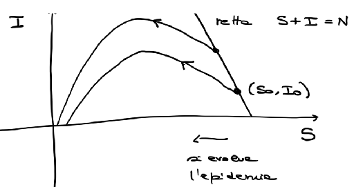{ width=200px }

Suppongo che $R_0 = 0 \Rightarrow N = S(0) + I(0) + R(0) = S_0 + I_0$  
Dovendo valere $0 < S(t) + I(t) \leq N$ si dimostra che  

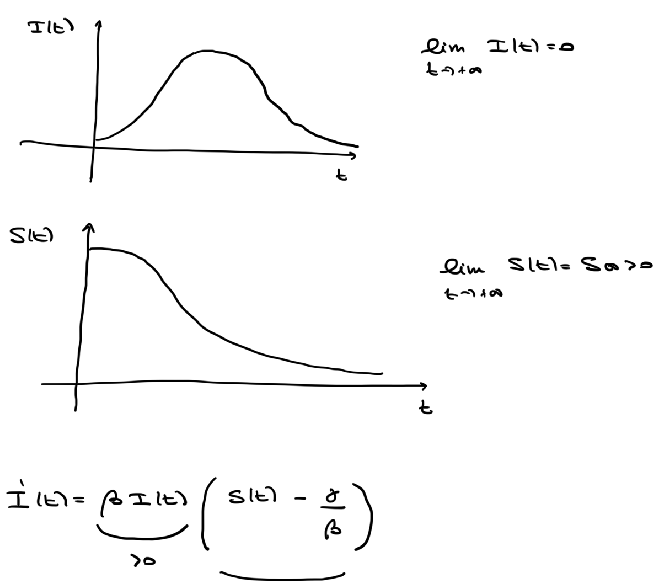{ width=320px }

Studio il segno di $S(t) - \dfrac{\gamma}{\beta}$  

- Se $S(t) > \dfrac{\gamma}{\beta}$ allora $I'(t) > 0$ e $I(t)$ è crescente
- Se $S(t) < \dfrac{\gamma}{\beta}$ allora $I'(t) < 0$ e $I(t)$ è decrescente

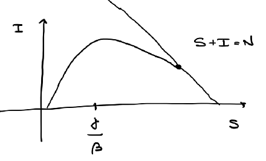{ width=200px }

- Se $S(0) \leq \dfrac{\gamma}{\beta}$ allora, poiché $S$ è decrescente, si ha che $S(t) \leq \dfrac{\gamma}{\beta} \quad \forall t$ e dunque $I'(t) < 0$ e quindi l'infezione non si propaga
- Se $S(0) \geq \dfrac{\gamma}{\beta}$ allora si propaga l'epidemia

# Matrice esponenziale

Sia dato il sistema omogeneo lineare a coefficienti costanti  
$X' = A X \quad (*)$  
dove $A$ è una matrice quadrata reale di dimensione $n \times n$.  
Se $n = 1$ allora il sistema si riduce a $x' (t) = a x(t)$, con $a \in \mathbb{R}$,  
le cui soluzioni sono $x(t) = c e^{a t}$.  

**Obiettivo**: vogliamo generalizzare l'esponenziale al caso di matrici $n \times n$.  

Introduciamo una norma, $A$ matrice reale $n \times n$  
$\left\| A \right\| = \sqrt{\displaystyle\sum_{i, j = 1}^{n} a_{ij}^2} \qquad \mathbb{R}^{n \times n} \cong \mathbb{R}^{n^2}$  
$(\mathbb{R}^{n \times n}, \left\| \cdot \right\|)$ è uno spazio vettoriale normato

## Lemma

Sia $A \in \mathbb{R}^{n \times n}$, la serie seguente è **convergente**  
$\displaystyle\sum_{k = 0}^{+ \infty} \dfrac{1}{k!} A^k = I + A + \dfrac{1}{2} A^2 + \dfrac{1}{6} A^3 + \ldots$

## Definizione di matrice esponenziale

Sia $A \in \mathbb{R}^{n \times n}$. Si chiama **matrice esponenziale** di $A$ la matrice  
$e^{A} = \displaystyle\sum_{k = 0}^{+ \infty} \dfrac{1}{k!} A^k$  

## Teorema

La soluzione generale del sistema $(*)$ è data da  
$X(t) = e^{t A} c \qquad (n \times 1) = (n \times n) \cdot (n \times 1)$  
dove $c \in \mathbb{R}^n$ è un generico vettore costante.

# EDO del secondo ordine scalari

Sia $f : E \subseteq \mathbb{R}^3 \to \mathbb{R}$. L'EDO  
$y''(x) = f(x, y(x), y'(x))$  
si dice **EDO del secondo ordine scalare**.

Una funzione $y(\cdot) : I \subseteq \mathbb{R} \to \mathbb{R}$, $I$ intervallo, si dice soluzione di $y'' = f(x, y, y')$ se  

1. $y(\cdot)$ è due volte derivabile in $I$  
2. $(x, y(x), y'(x)) \in E \quad \forall x \in I$  
3. $y''(x) = f(x, y(x), y'(x)) \quad \forall x \in I$

Siano $f : E \subseteq \mathbb{R}^3 \to \mathbb{R}$, e $(x_0, y_0, v_0) \in E$, il problema  
$(PC) \quad \begin{cases} y'' = f(x, y, y') \\ y(0) = y_0 \\ y'(0) = v_0 \end{cases}$  
si dice **problema di Cauchy**.

Una funzione $y(\cdot) : I \subseteq \mathbb{R} \to \mathbb{R}$, $I$ intervallo, si dice soluzione del $(PC)$ se  

1. $y(\cdot)$ è una soluzione di $y'' = f(x, y, y')$  
2. $x_0 \in I$
3. $y(x_0) = y_0$ e $y'(x_0) = v_0$

## Esempio: l'equazione del pendolo

$l$ lunghezza del pendolo, $\vartheta$ angolo rispetto alla verticale, $g$ accelerazione di gravità, $m$ massa del pendolo  

$\vartheta(t_0) = \vartheta_0 \quad \vartheta'(t_0) = v_0$  

$\begin{cases} \vartheta'' = - \dfrac{g}{l} \sin(\vartheta(t)) \\ \vartheta(t_0) = \vartheta_0 \\ \vartheta'(t_0) = v_0 \end{cases}$

## Teorema di esistenza e unicità locali (Peano-CL)

Se $f : A \subseteq \mathbb{R}^3 \to \mathbb{R}$, $A$ aperto, è continua e $(x_0, y_0, v_0) \in A$, allora $\exists h > 0$ e una funzione $y(\cdot) : \ ]x_0 - h, x_0 + h[ \ \to \mathbb{R}$ di classe $C^2$ soluzione del $(PC)$  
$\begin{cases} y'' = f(x, y, y') \\ y(x_0) = y_0 \\ y'(x_0) = v_0 \end{cases}$  
Se inoltre $\dfrac{\partial f}{\partial y}$ e $\dfrac{\partial f}{\partial v}$ sono continue, allora tale soluzione è unica.

## Teorema di esistenza globale

Se $f : I \times \mathbb{R}^2 \to \mathbb{R}$ è continua, con $I$ intervallo aperto, e $x_0 \in I$, $(y_0, v_0) \in \mathbb{R}^2$, e per ogni compatto $H \subseteq I$ esistono $\alpha, \beta, \gamma \in \mathbb{R}$ tali che  
$\left| f(x, y, v) \right| \leq \alpha \left| y \right| + \beta \left| v \right| + \gamma \quad$ in $H \times \mathbb{R}^2$  
allora il $(PC)$ ha una soluzione $y(\cdot)$ definita su tutto $I$.

## Equazione di Newton (autonoma e conservativa)

Sia $f : J \subseteq \mathbb{R} \to \mathbb{R}$, $J$ è un intervallo aperto, di classe $C^1$. L'EDO $y'' = f(y)$ si dice **equazione di Newton**.  
**autonoma**: $f£ *non* dipende da $x$  
**conservativa**: $f$ *non* dipende da $y'$  

**Osservazione**: $f \in C^1$ è continua, $\dfrac{\partial f}{\partial y}$ è continua, $\dfrac{\partial f}{\partial v} = 0$ $\Rightarrow$ $\exists$ e ! locali

### Metodo risolutivo basato sulla conservazione dell'energia

$y'' (t) = f(y) \Rightarrow y''(t) \cdot y'(t) = f(y) \cdot y'(t)$  
$\left( \left[ y'(t) \right]^2 \right)' = 2 y'(t) y''(t)$  
$\dfrac{1}{2} \left( \left[ y'(t) \right]^2 \right)' = \Big( F(y(t)) \Big)' \quad (**)$  
dove $F$ è una primitiva di $f$.  
Integriamo $(**)$ tra $t_0$ e $t$  
$\displaystyle\int_{t_0}^{t} \dfrac{1}{2} \left( \left[ y'(s) \right]^2 \right)' ds = \displaystyle\int_{t_0}^{t} \Big( F(y(s)) \Big)' ds$  
$\dfrac{1}{2} \left( y'(t) \right)^2 - \dfrac{1}{2} \left( y'(t_0) \right)^2 = F(y(t)) - F(y(t_0))$  
$\dfrac{1}{2} \left( y'(t) \right)^2 - F(y(t)) = \dfrac{1}{2} v_0^2 - F(y_0) \quad \forall t$  
$y'(t_0) = v_0 \quad y(t_0) = y_0$  
$\left[ y'(t) \right]^2 = 2 F(y(t)) - 2 F(y_0) + v_0^2$  
Si possono distinguere 3 casi:  

1. $y'(x_0) = v_0 > 0 \quad$ Poiché $y'$ è continua, $y'(x)$ rimane positivo in un intorno di $x_0$. Dunque $y'(x) = \sqrt{2 F(y(x)) - 2 F(y_0) + v_0^2}$ in un intorno di $x_0$.
2. $y'(x_0) = v_0 < 0 \quad \ldots \quad y'(x) = - \sqrt{2 F(y(x)) - 2 F(y_0) + v_0^2}$
3. Se $v_0 = 0$, distinguiamo 3 sottocasi:
   1. Se $F(y_0) > 0$, allora $y''(x_0) = f(y(x_0)) = f(y_0) > 0$, dunque per continuità si ha che $y''(x)$ rimane positivo in un intorno di $x_0$. Dunque $y'(x)$ è crescente in un intorno di $x_0$. Inoltre $y'(x_0) = v_0 = 0$, dunque $y'$ è positiva a destra di $x_0$ e negativa a sinistra di $x_0$. $y'(x) = sgn(x - x_0) \sqrt{2 F(y(x)) - 2 F(y_0) + v_0^2}$
   2. Se $f(y_0) < 0 \quad \ldots \quad y'(x) = - sgn(x - x_0) \sqrt{2 F(y(x)) - 2 F(y_0) + v_0^2}$
   3. Se $f(y_0) = 0 \quad y(x) \equiv y_0$

**Esempio**: $\begin{cases} y'' (x) = 3 y^2 (x) \\ y(0) = \sqrt[3]{\frac{1}{2}} \\ y'(0) = 1 \end{cases}$  
$y''(x) \cdot y'(x) = 3 y^2 (x) \cdot y'(x)$  
$\dfrac{1}{2} \left( y'(x) \right)^2 - \dfrac{1}{2} = y^3 (x) - \dfrac{1}{2} \Rightarrow \left( y'(x) \right)^2 = 2 y^3 (x)$  
$y'(0) = 1 \Rightarrow y'(x) = \sqrt{2 y^3 (x)}$

## EDO lineari del secondo ordine scalari

Siano $a, b \in \mathbb{R}$, e $c(\cdot) : I \subseteq \mathbb{R} \to \mathbb{R}$, $I$ intervallo aperto. L'EDO  
$y'' + a y' + b y = c(x) \quad (c)$
si dice **EDO lineare del secondo ordine scalare con coefficienti costanti completa**.  
L'EDO  
$y'' + a y' + b y = 0 \quad (o)$  
si dice **EDO lineare del secondo ordine scalare con coefficienti costanti omogenea**.

**Applicazione: vibrazioni meccaniche**  
$m x'' = - c x' - k x + f(t) \quad k$ costante elastica della molla, $c > 0$ coefficiente di attrito

## Teorema 1 (esisenza e unicità globali)

Per ogni $x_0 \in I$, $y_0, v_0 \in \mathbb{R}$, il problema di Cauchy  
$\begin{cases} y'' + a y' + b y = c(x) \\ y(x_0) = y_0 \\ y'(x_0) = v_0 \end{cases}$  
ammette una ed una sola soluzione definita su tutto $I$.

**Dimostrazione**: $y'' = c(x) - a y' - b y$  
$f(x, y, v) = c(x) - a v - b y \quad f$ è continua, $\dfrac{\partial f}{\partial y} = - b$, $\dfrac{\partial f}{\partial v} = - a$ sono continue  
$\Rightarrow$ $\exists$ e ! locali  
Considero quindi un insieme compatto $H \subset I$  
$\left| f(x, y, v) \right| \leq \underbrace{\left| a \right|}_{\alpha} \left| v \right| + \underbrace{\left| b \right|}_{\beta} \left| y \right| + \underbrace{\displaystyle\max_{x \in H} \left| c(x) \right|}_{\gamma} \Rightarrow$ esistenza globale

**Definizione**: Definiamo l'applicazione  
$L : C^2(I) \to C^0(I)$  
$y(\cdot) \mapsto y'' + a y' + b y$  
$L$ è un applicazione lineare.  
Definiamo:  
$S_c = L^{-1} \left( \{ c \} \right) = \{ y (\cdot) \in C^2 : y'' + a y' + b y = c (\cdot) \}$  
$S_0 = L^{-1} \left( \{ 0 \} \right) = \{ y (\cdot) \in C^2 : y'' + a y' + b y = 0 \}$

## Teorema 2

$S_c$ è costituito da tutte e sole le funzioni $y(\cdot)$ del tipo  
$y(\cdot) = z(\cdot) + \overline{y}(\cdot)$  
con $z(\cdot)$ una generica soluzione di $(o)$ e $\overline{y}(\cdot)$ una soluzione particolare di $(c)$.  
$S_c = S_0 + \overline{y}$

## Teorema 3 (descrizione di $S_0$)  

$S_0$ è uno spazio vettoriale di dimensione 2.  

**Dimostrazione**: Consideriamo $z_1, z_2 \in S_0$ definite come segue  
$\begin{cases} z_1''(\cdot) + a z_1'(\cdot) + b z_1(\cdot) = 0 \\ z_1(x_0) = 1 \\ z_1'(x_0) = 0 \end{cases} \quad \begin{cases} z_2''(\cdot) + a z_2'(\cdot) + b z_2(\cdot) = 0 \\ z_2(x_0) = 0 \\ z_2'(x_0) = 1 \end{cases}$  
$z_1, z_2$ sono funzioni linearmente indipendenti.  
*Tesi*: Se $c_1, c_2 \in \mathbb{R}$, e sono tali che  
$c_1 z_1 (x) + c_2 z_2 (x) = 0 \quad \forall x \in \mathbb{R} \quad (*)$  
$\Rightarrow$ $c_1 = c_2 = 0$  
Osservo che scegliendo $x = 0$  
$c_1 z_1 (0) + c_2 z_2 (0) = 0 \Rightarrow c_1 z_1 (0) = 0 \Rightarrow c_1 = 0$  
Derivo $(*)$ e trovo  
$c_1 z_1' (x) + c_2 z_2' (x) = 0 \quad \forall x \in \mathbb{R}$  
$c_2 z_2' (x) = 0 \quad$ in $x = 0 \quad c_2 \cdot 1 = 0 \Rightarrow c_2 = 0$  

Considero $z(\cdot) \in S_0$ e voglio trovare $\alpha, \beta \in \mathbb{R}$ tali che $z(\cdot) = \alpha z_1 (\cdot) + \beta z_2 (\cdot)$.  
La generica $z(\cdot)$ soddisfa il seguente (PC)  
$\begin{cases} z''(\cdot) + a z'(\cdot) + b z(\cdot) = 0 \\ z(0) = z_0 \\ z'(0) = v_0 \end{cases}$  
Scegliendo $\alpha = z_0$ e $\beta = v_0$, segue la tesi.

## Costruiamo una base per $S_0$

Consideriamo delle funzioni di tipo $z (\cdot) = e^{\lambda x} \quad \lambda \in \mathbb{C}$  
Imponiamo che $z (\cdot)$ sia soluzione dell'omogenea  
$0 = z'' + a z' + b z = \lambda^2 e^{\lambda x} + a \lambda e^{\lambda x} + b e^{\lambda x} = ( \lambda^2 + a \lambda + b ) e^{\lambda x} \quad \forall x \in \mathbb{R}$  
$\Leftrightarrow \boxed{\lambda^2 + a \lambda + b = 0} \quad (k)$ che è **l'equazione caratteristica dell'omogenea**.  

**Osservazione**: Se $\lambda \in \mathbb{C} \quad \lambda = \alpha + i \beta \quad e^{\lambda x} = e^{\alpha x} \left( \cos(\beta x) + i \sin(\beta x) \right)$

## Teorema 4 (base di $S_0$)

Si ha che  

1. se $\Delta = a^2 - 4 b > 0$, dette $\lambda_1, \lambda_2 \in \mathbb{R}$ con $\lambda_1 \neq \lambda_2$ le radici di $(k)$, allora $\{ e^{\lambda_1 x}, e^{\lambda_2 x} \}$ è una base di $S_0$.
2. se $\Delta = a^2 - 4 b < 0$, dette $\lambda_1 = \alpha + i \beta, \lambda_2 = \alpha - i \beta$, con $\alpha, \beta \in \mathbb{R}$, $\beta \neq 0$, le radici di $(k)$, allora $\{ e^{\alpha x} \cos(\beta x), e^{\alpha x} \sin(\beta x) \}$ è una base di $S_0$.
3. se $\Delta = a^2 - 4 b = 0$, detta $\lambda_0 = - \dfrac{a}{2} \in \mathbb{R}$ la radice (doppia) di $(k)$, allora $\{ e^{\lambda_0 x}, x e^{\lambda_0 x} \}$ è una base di $S_0$.

**Esempio**: $y'' - 10 y = 0 \quad a = 0, b = -10$  
Dunque l'equazione caratteristica è $\lambda^2 - 10 = 0 \quad \lambda_1 = \sqrt{10}, \lambda_2 = - \sqrt{10}$  
La base è formata da $e^{\lambda_1 x}, e^{\lambda_2 x} \quad y(x) = c_1 e^{\sqrt{10} x} + c_2 e^{- \sqrt{10} x}$  
Impongo che $y(0) = 0 \Rightarrow c_1 + c_2 = 0$  
Derivando $y'(x) = c_1 \sqrt{10} e^{\sqrt{10} x} - c_2 \sqrt{10} e^{- \sqrt{10} x}$  
Impongo che $y'(0) = 1 \Rightarrow c_1 \sqrt{10} - c_2 \sqrt{10} = 1$  
$\begin{cases} c_1 + c_2 = 0 \\ c_1 \sqrt{10} - c_2 \sqrt{10} = 1 \end{cases} \Rightarrow c_1 = \dfrac{1}{2 \sqrt{10}}, \ c_2 = - \dfrac{1}{2 \sqrt{10}}$

**Esempio**: Si consideri la soluzione di  
$\begin{cases} y'' + 2 y' + 2 y = 0 \\ y(0) = 1 \\ y'(0) = 1 \end{cases}$  
Equazione caratteristica: $\lambda_{1, 2} = \dfrac{-2 \pm \sqrt{4 - 8}}{2} = \begin{cases} -1 + i \\ -1 - i \end{cases}$  
$\alpha = -1, \beta = 1$  
La base è data da $\{ e^{-x} \cos(x), e^{-x} \sin(x) \}$  
$y(x) = c_1 e^{-x} \cos(x) + c_2 e^{-x} \sin(x)$  
Imponendo le condizioni iniziali si trova che $c_1 = 1, c_2 = 1$.

**Esempio**: Si trovi la soluzione del (PC)  
$\begin{cases} y'' + \dfrac{2}{3} y' + \dfrac{1}{9} y = 0 \\ y(0) = 0 \\ y'(0) = 1 \end{cases}$  
$\lambda^2 + \dfrac{2}{3} \lambda + \dfrac{1}{9} = 0 \quad \left( \lambda + \dfrac{1}{3} \right)^2 = 0 \Rightarrow \lambda_0 = - \dfrac{1}{3}$  
$\{ x e^{- \frac{1}{3} x}, e^{- \frac{1}{3} x} \}$ base di $S_0$  
$y(x) = c_1 e^{- \frac{1}{3} x} + c_2 x e^{- \frac{1}{3} x}$  
Imponendo le condizioni iniziali si trova che $c_1 = 0, c_2 = 1$.

**Osservazione**: Se ho, con $a, b \in \mathbb{R}$,  
$y'' + a y' + b y = 0 \quad (o)$  
$y'' + a y' + b y = c(x) \quad (c)$  
$y$ soluzione generale della completa  
$\boxed{y = z + \overline{y}}$  
dove $z$ è una soluzione omogenea e $\overline{y}$ è una particolare soluzione completa.  

# Metodo di somiglianza  

Consideriamo $y'' + a y' + b y = c(x) \quad (c)$  
dove $c(x)$ ha la forma  
$c(x) = P(x) e^{\alpha x} \sin (\beta x)$ oppure $c(x) = P(x) e^{\alpha x} \cos (\beta x)$  
dove $P(x)$ è un polinomio di grado $n$.  
Si consideri il numero complesso $\xi = \alpha + i \beta$  
Si presentano 3 casi:

1. $\xi$ *non* è soluzione dell'equazione caratteristica $\lambda^2 + a \lambda + b = 0$. Allora si cercano soluzioni di $(c)$ del tipo $y(x) = e^{\alpha x} \left( Q_1(x) \cos(\beta x) + Q_2(x) \sin(\beta x) \right)$ dove $Q_1$ e $Q_2$ sono polinomi di grado $n$ da determinare sostituendo $y$ in $(c)$.
2. $\xi$ è soluzione dell'equazione caratteristica $\lambda^2 + a \lambda + b = 0$ di molteplicità $1$. Allora si cercano soluzioni di $(c)$ del tipo $y(x) = e^{\alpha x} x \left( Q_1(x) \cos(\beta x) + Q_2(x) \sin(\beta x) \right)$ dove $Q_1$ e $Q_2$ sono polinomi di grado $n$ da determinare sostituendo $y$ in $(c)$.
3. $\xi$ è soluzione dell'equazione caratteristica $\lambda^2 + a \lambda + b = 0$ di molteplicità $2$. Allora si cercano soluzioni di $(c)$ del tipo $y(x) = x^2 Q(x) e^{\alpha x}$ con $Q(x)$ polinomio di grado $n$ da determinare sostituendo $y$ in $(c)$.

**Esempio**: Si determini la soluzione del (PC)  
$\begin{cases} y'' + 4 y = 4 \cos(2 x) \\ y(0) = 0 \\ y'(0) = 0 \end{cases}$  
$c(x) = 4 \cos(2 x) \quad P(x) = 4$ polinomio di grado $0$  
$\alpha = 0, \beta = 2$  
Considero il numero $\xi = \alpha + i \beta = 2 i$  
Studio l'equazione caratteristica $\lambda^2 + 4 = 0 \Rightarrow \lambda_{1, 2} = \pm 2 i \Rightarrow$ caso 2  
Dunque cerco soluzioni nella forma $\overline{y}(x) = x \left( \tilde{a} \cos(2 x) + \tilde{b} \sin(2 x) \right)$  
dove $\tilde{a}, \tilde{b}$ sono numeri reali, ovvero polinomi di grado $0$.  
Imponiamo che $\overline{y}$ sia soluzione di $(c)$  
$\overline{y}'' + a \overline{y}' + b \overline{y} = 4 \cos(2 x)$  
Risolvendo si trova $\tilde{a} = 0, \tilde{b} = 1$  
Dunque $\overline{y}(x) = x \sin(2 x)$  
cerchiamo la soluzione generale dell'omogenea $(o)$  
$\lambda^2 + 4 = 0 \Rightarrow \lambda_{1, 2} = \pm 2 i$  
Dunque le soluzioni di $(o)$ hanno la forma  
$z(x) = c_1 \cos(2 x) + c_2 \sin(2 x) \qquad \beta = 2, \alpha = 0$  
Dunque possimao stabilire che una soluzione $y$ generale di $(c)$  
$y(x) = z(x) + \overline{y}(x) = c_1 \cos(2 x) + c_2 \sin(2 x) + x \sin(2 x)$  
Imponendo le condizioni iniziali $y(0) = 0, y'(0) = 0$ si trova che $c_1 = 0, c_2 = 0$.

**Esempio**: Si determini la soluzione del (PC)  
$\begin{cases} y'' - 10 y = -10 x^2 \\ y(0) = \frac{1}{5} \\ y'(0) = 0 \end{cases}$  
$c(x) = -10 x^2 \quad P(x) = -10 x^2$ polinomio di grado $2$  
$\alpha = 0, \beta = 0 \quad c(x) = P(x) e^{\alpha x} \cos(\beta x) \quad \xi = 0$  
Considero l'equazione caratteristica $\lambda^2 - 10 = 0 \Rightarrow \lambda_{1, 2} = \pm \sqrt{10}$  
Dunque $\xi$ non è soluzione dell'equazione caratteristica (simao nel caso 1).  
$\overline{y}(x) = e^{0 x} \left( Q_1(x) \cos(0 x) + Q_2(x) \sin(0 x) \right)$  
dove $Q_1, Q_2$ sono polinomi di grado $2$  
$\overline{y}(x) = Q_1(x) = \tilde{a} x^2 + \tilde{b} x + \tilde{c}$  
Imponendo che $\overline{y}$ sia soluzione di $(c)$ si trova che $\tilde{a} = 1, \tilde{b} = 0, \tilde{c} = \frac{1}{5}$  
$\overline{y}(x) = x^2 + \frac{1}{5}$  
Si verifica che $\overline{y}$ è soluzione del (PC).

# Teorema (Metodo del nucleo risolvente)  

Sia $\{ z_1 (\cdot), z_2 (\cdot) \}$ una base di $S_0$, allora una soluzione particolare $\overline{y}$ di $(c)$ è del tipo  
$\overline{y} (x) = \displaystyle\int_{x_0}^{x} K(x, t) c(t) dt \quad x_0 \in I$  
con $x_0 \in I$ fissato e per ogni $x, t \in \mathbb{R}$  

$$
K(x, t) = \dfrac{
    \det \begin{pmatrix}
        z_1 (0) & z_2 (0) \\
        z_1 (x - t) & z_2 (x - t)
    \end{pmatrix}
}{
    \det \begin{pmatrix}
        z_1 (0) & z_2 (0) \\
        z_1' (0) & z_2' (0)
    \end{pmatrix}
}
$$

dove $K$ è detta **funzione di Green** o **nucleo risolvente**.

**Osservazione**: $F(x) = \displaystyle\int_{x_0}^{x} G(x, t) dt \quad F'(x)$  
Introduciamo una funzione ausiliaria  
$\phi (y, z) = \displaystyle\int_{x_0}^{y} G(z, t) dt$  
$x \stackrel{\psi}{\longrightarrow} (x, x) \stackrel{\phi}{\longrightarrow}$  
$x \longrightarrow \displaystyle\int_{x_0}^{x} G(x, t) dt$  
$F(x) = \left( \phi \circ \psi \right) (x)$  
$\nabla \phi (y, z) = \left( \partial_y \phi (y, z), \partial_z \phi (y, z) \right) = \left( G(z, y), \displaystyle\int_{x_0}^{y} \dfrac{\partial G}{\partial z} (z, t) dt \right)$  
$J (\psi) = \begin{pmatrix} 1 \\ 1 \end{pmatrix} \quad F'(x) = \nabla \phi (x, x) \cdot J \psi = G(x, x) + \displaystyle\int_{x_0}^{x} \dfrac{\partial G}{\partial x} (x, t) dt$  

**Dimostrazione**: (metodo del nucleo risolvente)  
Consideriamo $z_1, z_2$ tali che  
$\begin{cases} z_1'' + a z_1' + b z_1 = 0 \\ z_1(0) = 1 \\ z_1'(0) = 0 \end{cases} \quad \begin{cases} z_2'' + a z_2' + b z_2 = 0 \\ z_2(0) = 0 \\ z_2'(0) = 1 \end{cases}$  
$K (x, t) = \dfrac{z_1 '' (0) z_2 (x - t) - z_2 (0) z_1 (x - t)}{z_1 (0) z_2' (0) - z_2 (0) z_1' (0)} = z_2 (x - t)$  
$\overline{y} (x) = \displaystyle\int_{x_0}^{x} z_2 (x - t) c(t) dt$  
$\overline{y}' (x) = z_2 (x - x) c(x) + \displaystyle\int_{x_0}^{x} z_2' (x - t) c(t) dt = \displaystyle\int_{x_0}^{x} z_2' (x - t) c(t) dt$  
$\overline{y}'' (x) = z_2' (x - x) c(x) + \displaystyle\int_{x_0}^{x} z_2'' (x - t) c(t) dt = c(x) + \displaystyle\int_{x_0}^{x} z_2'' (x - t) c(t) dt$  
$\overline{y}'' + a \overline{y}' + b \overline{y} = c(x) + \displaystyle\int_{x_0}^{x} z_2'' (x - t) c(t) dt + a \displaystyle\int_{x_0}^{x} z_2' (x - t) c(t) dt + b \displaystyle\int_{x_0}^{x} z_2 (x - t) c(t) dt = c(x) + \displaystyle\int_{x_0}^{x} \left( z_2'' (x - t) + a z_2' (x - t) + b z_2 (x - t) \right) c(t) dt$  
$z_2'' (x - t) + a z_2' (x - t) + b z_2 (x - t) = 0$ in quanto $z_2$ è soluzione dell'omogenea.

**Esempio**: Si trovi la soluzione del (PC)  
$\begin{cases} y'' + y = \dfrac{1}{\sin(x)} \\ y \left( \dfrac{\pi}{2} \right) = 0 \\ y' \left( \dfrac{\pi}{2} \right) = 0 \end{cases}$  
Considerare $z_1, z_2$ soluzioni di  
$\begin{cases} z_1'' + z_1 = 0 \\ z_1 (0) = 1 \\ z_1' (0) = 0 \end{cases} \quad \begin{cases} z_2'' + z_2 = 0 \\ z_2 (0) = 0 \\ z_2' (0) = 1 \end{cases}$  
$z_1 (x) = \cos(x) \quad z_2 (x) = \sin(x)$  
$K (x, t) = \sin(x - t)$  
$\overline{y} (x) = \displaystyle\int_{\frac{\pi}{2}}^{x} \sin(x - t) \dfrac{1}{\sin(t)} dt$