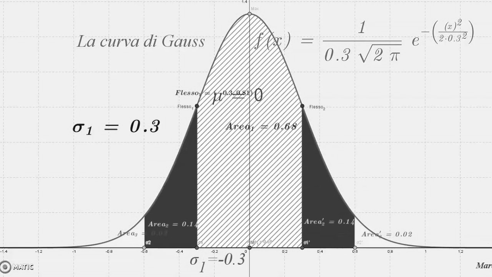
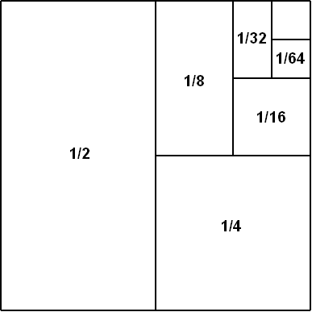
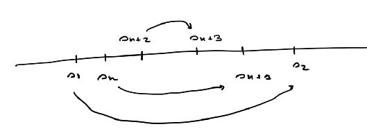
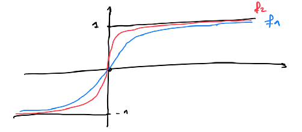
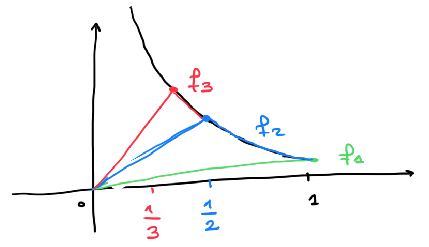
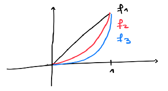
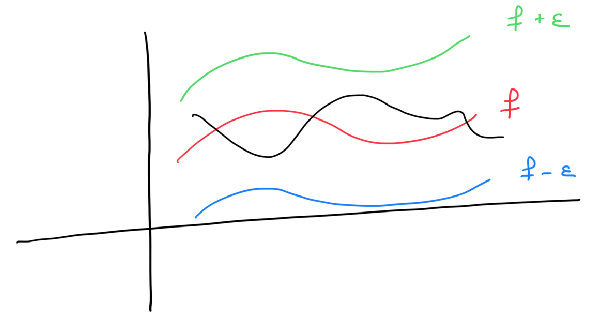
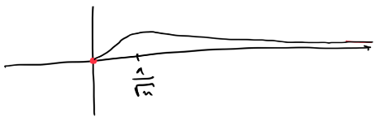
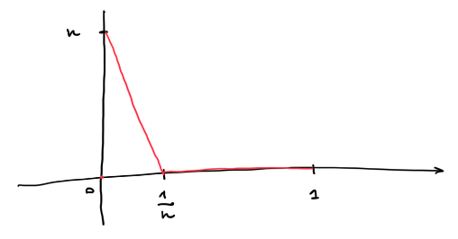
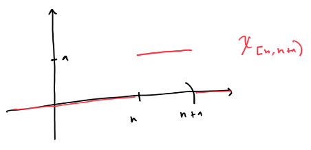

# Integrali generalizzati (o impropri)

**Definizione**: Sia $J \subseteq \mathbb{R}$ un intervallo qualunque, una funzione $f: J \rightarrow \mathbb{R}$ si dice **localmente integrabile** su $J$ se $f$ è integrabile su ogni intervallo compatto $K \subseteq J$.

**Osservazione**: Se $f : J \rightarrow \mathbb{R}$ è localmente integrabile e sia $c \in J$ fissato. La funzione integrale  
$$F(x) = \int_c^x f(t) \, dt \qquad x \in J$$  
è continua in $J$.  
Dunque per ogni $d \in J$ si ha che  
$$\lim_{x \rightarrow d} \int_c^x f(t) \, dt = \lim_{x \rightarrow d} F(x) = F(d) = \int_c^d f(t) \, dt$$

## Funzioni integrabili in senso generalizzato

1. Sia $J = [a, b[$, con $b \in \mathbb{R} \cup \{+\infty\}$ e sia $f: J \rightarrow \mathbb{R}$ localmente integrabile.  
    Si dice che $f$ è **integrabile in senso generalizzato** su $J$ se esiste finito  
    $$\lim_{x \rightarrow b^-} \int_a^x f(t) \, dt := \int_a^b f(t) \, dt$$
2. Sia $J = ]a, b]$, con $a \in \mathbb{R} \cup \{-\infty\}$ e sia $f: J \rightarrow \mathbb{R}$ localmente integrabile.  
    Si dice che $f$ è **integrabile in senso generalizzato** su $J$ se esiste finito  
    $$\lim_{x \rightarrow a^+} \int_x^b f(t) \, dt := \int_a^b f(t) \, dt$$
3. Sia $J = ]a, b[$, con $a \in \mathbb{R} \cup \{-\infty\}$ e $b \in \mathbb{R} \cup \{+\infty\}$ e sia $f: J \rightarrow \mathbb{R}$ localmente integrabile.  
    Si dice che $f$ è **integrabile in senso generalizzato** su $J$ se esiste $c \in J$ tale che $f$ è integrabile in senso generalizzato su $]a, c]$ e su $[c, b[$ e si pone  
    $$\int_a^b f(t) \, dt := \int_a^c f(t) \, dt + \int_c^b f(t) \, dt$$

**Esempio**:  
$\displaystyle\int_0^1 \dfrac{1}{\sqrt{1 -x}} \, dx \qquad J = [0, 1[$  

$\displaystyle\int_0^t \dfrac{1}{\sqrt{1 -x}} \, dx = \left. \left( -2 \sqrt{1 - x} \right) \right|_0^t = -2 \left( \sqrt{1 - t} - 1 \right)$

$\displaystyle\lim_{t \rightarrow 1^-} -2 \left( \sqrt{1 - t} - 1 \right) = 2$

**Esempio**:  
$\displaystyle\int_{- \infty}^{0} e^x \, dx \qquad J = ]- \infty, 0]$  

$\displaystyle\lim_{t \rightarrow - \infty} \int_t^0 e^x \, dx = \lim_{t \rightarrow - \infty} \left. e^x \right|_t^0 = \lim_{t \rightarrow - \infty} 1 - e^t = 1$

**Esempio**:  
$\displaystyle\int_{- \infty}^{+ \infty} \dfrac{1}{1 + x^2} \, dx \qquad J = \mathbb{R}$

Scelgo $c = 0$  
$\displaystyle\lim_{t \rightarrow - \infty} \int_t^0 \dfrac{1}{1 + x^2} \, dx = \lim_{t \rightarrow - \infty} \left. \arctan(x) \right|_t^0 = 0 - \dfrac{\pi}{2} = - \dfrac{\pi}{2}$  
$\displaystyle\lim_{t \rightarrow + \infty} \int_0^t \dfrac{1}{1 + x^2} \, dx = \lim_{t \rightarrow + \infty} \left. \arctan(x) \right|_0^t = \dfrac{\pi}{2} - 0 = \dfrac{\pi}{2}$  

$\displaystyle\int_{- \infty}^{+ \infty} \dfrac{1}{1 + x^2} \, dx = \dfrac{\pi}{2} + \dfrac{\pi}{2} = \pi$

## Integrabilità in senso generalizzato delle funzioni campione

**Teorema ($J$ illimitato)**:  

1. Sia $J = [a, + \infty[$, con $a > 0$. Si ha che  
    $\displaystyle\int_a^{+ \infty} \dfrac{1}{x^{\alpha}} \, dx$ esiste finito $\Leftrightarrow \alpha > 1$

2. Sia $J = ]- \infty, b]$, con $b < 0$. Si ha che  
    $\displaystyle\int_{- \infty}^b \dfrac{1}{\left| x \right|^{\alpha}} \, dx$ esiste finito $\Leftrightarrow \alpha > 1$

**Teorema ($J$ limitato)**:  

1. Sia $J = [a, b[$, con $a \leq 0 < b < + \infty$. Si ha che  
    $\displaystyle\int_a^b \dfrac{1}{(b - x)^{\alpha}} \, dx$ esiste finito $\Leftrightarrow \alpha < 1$

2. Sia $J = ]a, b]$, con $a \leq 0 < b < + \infty$. Si ha che  
    $\displaystyle\int_a^b \dfrac{1}{(x - a)^{\alpha}} \, dx$ esiste finito $\Leftrightarrow \alpha < 1$

**Osservazione**:  
$$\phi(x) = \left( \int_{- \infty}^{+ \infty} e^{- \frac{1}{2} t^2} \, dt \right) \cdot \dfrac{1}{\sqrt{2 \pi}}$$

{ width=300px }

## AUT-AUT per l'integrale generalizzato

Se $f: J = [a, b[ \rightarrow \mathbb{R}$, con $b \in \mathbb{R} \cup \{+ \infty\}$, è localmente integrabile e $f(x) \geq 0$ in $J$, allora esiste finito a $+ \infty$,  
$$\lim_{x \rightarrow b^-} \int_a^x f(t) \, dt = \sup_{x \in J} \int_a^x f(t) \, dt$$

**Dimostrazione**: La dimostrazione segue dall'osservazione  
$\displaystyle F(x) = \int_a^x f(t) \, dt$ è non decrescente

**Osservazione**: Il teorema vale inalterato nel caso $J = ]a, b]$.

**Osservazione**:  
$f (x) = - \cos \left( \dfrac{1}{x} \right) \cdot x^{-2}$  
$\displaystyle\int_0^1 -\cos \left( \dfrac{1}{x} \right) \cdot x^{-2} \, dx$  

$F(x) = \sin \left( \dfrac{1}{x} \right)$  
$F'(x) = f (x)$  

$\displaystyle\lim_{t \rightarrow 0^+} \int_t^1 -\cos \left( \dfrac{1}{x} \right) \cdot x^{-2} \, dx = \lim_{t \rightarrow 0^+} \sin \left( 1 \right) - \sin \left( \dfrac{1}{t} \right)$  
questo limite non esiste.

## Criterio del confronto

Siano $f, g: J = [a, b[ \rightarrow \mathbb{R}$, con $b \in \mathbb{R} \cup \{+ \infty\}$, localmente integrabili e tali che $0 \leq f(x) \leq g(x)$ in $J$. Sia ha che:  

1. se $g$ è integrabile in senso generalizzato su $J$, allora lo è anche $f$ e
    $$\int_a^b f(t) \, dt \leq \int_a^b g(t) \, dt$$

2. se $f$ non è integrabile in senso generalizzato su $J$, allora non lo è nemmeno $g$.

**Dimostrazione**:  

1. $F(x) = \int_a^x f(t) \, dt, \quad G(x) = \int_a^x g(t) \, dt$  
    Poiché $f(x) \leq g(x)$ in $J$, si ha che $F(x) \leq G(x)$  

    $\displaystyle\lim_{x \rightarrow b} \int_a^x f(t) \, dt = \sup_{x \in J} F(x) \leq \sup_{x \in J} G(x) = \lim_{x \rightarrow b} \int_a^x g(t) \, dt < + \infty$ per ipotesi.

    Quindi $f$ è integrabile in senso generalizzato e vale  
    $\displaystyle\int_a^b f(t) \, dt \leq \int_a^b g(t) \, dt$

2. è la contronominale del punto 1. ($p \Rightarrow q \Leftrightarrow \neg q \Rightarrow \neg p$)

**Corollario (criterio del confronto asintotico)**:  
Siano $f, g: J = [a, b[ \rightarrow \mathbb{R}$, con $b \in \mathbb{R} \cup \{+ \infty\}$, localmente integrabili e tali che $f(x) > 0, g(x) > 0$ in $J$ ed esiste  
$\displaystyle\lim_{x \rightarrow b^-} \dfrac{f(x)}{g(x)} = L \quad \in \, ]0, + \infty[$  
allora $f$ e $g$ sono entrambe integrabili in senso generalizzato oppure nessuna delle due lo è.

**Dimostrazione**:  
$\forall \varepsilon > 0, \exists \delta > 0$ tale che $\forall x \in (b - \delta, b)$ si ha che  

$\left| \dfrac{f(x)}{g(x)} - L \right| < \varepsilon$

$- \varepsilon + L < \dfrac{f(x)}{g(x)} < \varepsilon + L \quad$ in $(b - \delta, b)$  
$(- \varepsilon + L) \cdot g(x) < f(x) < f(x) < (\varepsilon + L) \cdot g(x) \quad$ in $(b - \delta, b)$  
La tesi segue dal criterio del confronto.

**Esempio**:
$\displaystyle\int_0^1 \dfrac{1 + \sqrt[3]{x}}{x^2 + \sqrt{x}} \, dx \qquad J = ]0, 1]$  
Applico il teorema del confronto asintotico  

$f(x) = \dfrac{1 + \sqrt[3]{x}}{x^2 + \sqrt{x}} \qquad g(x) = \dfrac{1}{\sqrt{x}} = \dfrac{1}{x^{\frac{1}{2}}} \qquad \alpha = \dfrac{1}{2} < 1$  

$\displaystyle\lim_{x \rightarrow 0^+} \dfrac{1 + \sqrt[3]{x}}{x^2 + \sqrt{x}} \cdot \sqrt{x} = \left( \lim_{x \rightarrow 0^+} \dfrac{f(x)}{g(x)} \right) = \lim_{x \rightarrow 0^+} \dfrac{1 + \sqrt[3]{x}}{x^{\frac{3}{2}} + 1} = 1$

## Funzioni assolutamente e semplicemente integrabili in senso generalizzato

Sia $f: J \rightarrow \mathbb{R}$ localmente integrabile.  

- Si dice che $f$ è **assolutamente integrabile in senso generalizzato** se $\left| f \right|$ è integrabile in senso generalizzato.  

- Si dice che $f$ è **semplicemente integrabile in senso generalizzato** se $f$ è integrabile in senso generalizzato, ma $\left| f \right|$ non lo è.

**Teorema**: Sia $f: J \rightarrow \mathbb{R}$ una funzione assolutamente integrabile in senso generalizzato. Allora $f$ è integrabile in senso generalizzato e vale  
$$\left| \int_J f(x) \, dx \right| \leq \int_J \left| f(x) \right| \, dx$$

**Dimostrazione**: $0 \leq \left| f(x) \right| - f(x) \leq 2 \left| f(x) \right|$  
Poiché $\left| f(x) \right|$ è integrabile, allora per il teorema del confronto, anche $\left| f(x) \right| - f(x)$ è integrabile.  

$f(x) = \left| f(x) \right| - \left[ \left| f(x) \right| - f(x) \right]$ sono entrambe integrabili in senso generalizzato.  

Inoltre $- \left| f(x) \right| \leq f(x) \leq \left| f(x) \right|$  
Si ha che  

$\displaystyle - \int_J \left| f(x) \right| \, dx \leq \int_J f(x) \, dx \leq \int_J \left| f(x) \right| \, dx$  
$\displaystyle\left| \int_J f(x) \, dx \right| \leq \int_J \left| f(x) \right| \, dx$

**Esempio**: $f(x) = \dfrac{\sin x}{x^2}$ è assolutamente integrabile in senso generalizzato su $J = [a, + \infty[$  

$J = [1, + \infty[ \qquad \left| \dfrac{\sin x}{x^2} \right| \leq \dfrac{\left| \sin x \right|}{x^2} \leq \dfrac{1}{x^2}$

**Esempio**: $f(x) = \dfrac{\sin x}{x}$ è semplicemente integrabile in senso generalizzato su $J = [a, + \infty[$

Proviamo che $\left| \dfrac{\sin x}{x} \right|$ non è integrabile.  

$\sin^2 x = \left| \sin x \right|^2 \leq \left| \sin x \right|$

$\left| \dfrac{\sin x}{x} \right| \geq \dfrac{\sin^2 x}{x}$

$\dfrac{\sin^2 x}{x} = \dfrac{1 - \cos 2x}{2x} = \dfrac{1}{2x} - \dfrac{\cos 2x}{2x}$  

la prima parte vale $\dfrac{1}{2} \ln (t)$, la seconda parte si fa per parti.

## Criterio dell'ordine di infinitesimo (J limitato)

Sia $f: J = [a, b[ \rightarrow \mathbb{R}$ localmente integrabile. Si ha

1. se esiste $\alpha > 1$ tale che  
    $\displaystyle\lim_{x \rightarrow + \infty} \left| f(x) \right| \cdot x^{\alpha} = L \quad \in \, [0, + \infty[$  
    allora $f$ è assolutamente integrabile in senso generalizzato su $J$.

2. se esiste $\alpha \leq 1$ tale che  
    $\displaystyle\lim_{x \rightarrow + \infty} \left| f(x) \right| \cdot x^{\alpha} = L \quad \in \, ]0, + \infty[ \cup \{+ \infty\}$  
    allora $f$ non è assolutamente integrabile in senso generalizzato.

## Criterio dell'ordine di infinito (J limitato)

Sia $f: J = [a, b[ \rightarrow \mathbb{R}$, con $b \in \mathbb{R}$ localmente integrabile. Si ha  

1. se esiste $\alpha < 1$ tale che  
    $\displaystyle\lim_{x \rightarrow b^-} \left| f(x) \right| \cdot (b - x)^{\alpha} = L \quad \in \, [0, + \infty[$  
    allora $f$ è assolutamente integrabile in senso generalizzato su $J$.

2. se esiste $\alpha \geq 1$ tale che  
    $\displaystyle\lim_{x \rightarrow b^-} \left| f(x) \right| \cdot (b - x)^{\alpha} = L \quad \in \, ]0, + \infty[ \cup \{+ \infty\}$  
    allora $f$ non è assolutamente integrabile in senso generalizzato.

**Esempio**: $f(x) = e^{-x^2}$  
Scelgo $\alpha = 2$ e si ha che $\displaystyle\lim_{x \rightarrow + \infty} e^{-x^2} \cdot x^2 = 0$  
Per il criterio dell'ordine di infinitesimo, deduco che $e^{-x^2}$ è integrabile in senso generalizzato su $[0, + \infty[$.

**Esempio**: Stabilire se $f(x) = \dfrac{1}{\sqrt{x + x^3}}$ è integrabile in senso generalizzato su $J = ]0, 3]$.  
Usiamo il criterio dell'ordine di infinito con $\alpha = \dfrac{1}{2}$  
$\displaystyle\lim_{x \rightarrow 0^+} \left| f(x) \right| \cdot x^{\alpha} = \lim_{x \rightarrow 0^+} \dfrac{1}{\sqrt{x + x^3}} \cdot \sqrt{x} = 1 \qquad \in \, ]0, + \infty[$  
dunque $f$ è integrabile in senso generalizzato su $]0, 3]$.

# Serie numeriche

## Serie di numeri reali

**Definizione**: Sia $(a_n)_n$ una successione di numeri reali. Si dice **serie di termine generale** $a_n$ la somma formale  

$$\sum_{n = 1}^{+ \infty} a_n = a_1 + a_2 + a_3 + \ldots$$

Per ogni indice $n$ della successione si definisce la **somma parziale (o ridotta) n-esima** associata ad $(a_n)_n$ come  

$$s_n = \sum_{k = 1}^{n} a_k = a_1 + a_2 + \ldots + a_n$$

Si dice che $\displaystyle\sum_{n = 1}^{+ \infty} a_n$ è **convergente** se esiste finito $\displaystyle\lim_{n \rightarrow + \infty} s_n = s$; s si dice **somma della serie** e si scrive $\displaystyle\sum_{n = 1}^{+ \infty} a_n = s$.  

Se $\displaystyle\lim_{n \rightarrow + \infty} s_n = + \infty$ (o $- \infty$), la serie si dice **divergente a $+ \infty$ (o $- \infty$)**.

Se il limite non esiste, la serie si dice **indeterminata**.

**Esempio**: $\displaystyle\sum_{n = 1}^{+ \infty} \dfrac{1}{2^n}$  

$\displaystyle s_n = \sum_{k = 1}^{n} \dfrac{1}{2^k} = \dfrac{1}{2} + \dfrac{1}{4} + \ldots + \dfrac{1}{2^n} = 1 \quad$ converge a 1.

{ width=200px }

**Esempio**: $1 + 2 + 3 + 4 + \ldots \quad$ diverge a $+ \infty$  
$s_n = 1 + 2 + 3 + \ldots + n = \dfrac{n(n + 1)}{2}$  

**Esempio**: $1 - 1 + 1 - 1 + \ldots + (-1)^{n + 1} + \ldots \quad$ è indeterminata.

### Serie geometrica

Consideriamo la serie  

$$a + ak + ak^2 + \ldots + ak^n + \ldots = \sum_{n = 0}^{+ \infty} ak^n$$

con $a, k \in \mathbb{R}$, $a \neq 0$ ($k$ si dice **ragione** della serie).

Sia ha che

$$s_n = a + ak + ak^2 + \ldots + ak^{n - 1} = \left\{ \begin{array}{ll} n \cdot a & \text{se } k = 1 \\ a \cdot \dfrac{1 - k^n}{1 - k} & \text{se } k \neq 1 \end{array} \right.$$

- La serie è convergente se $\left| k \right| < 1$ con somma $\dfrac{a}{1 - k}$.
- La serie è divergente se $k \geq 1$.
- La serie è indeterminata se $k \leq -1$.

### Serie armonica

Consideriamo la serie  

$$1 + \dfrac{1}{2} + \dfrac{1}{3} + \dfrac{1}{4} + \ldots + \dfrac{1}{n} + \ldots = \sum_{n = 1}^{+ \infty} \dfrac{1}{n}$$

$\dfrac{1}{1 + x}$

$$s_n = 1 + \dfrac{1}{2} + \ldots + \dfrac{1}{n} \geq \displaystyle\int_0^n \dfrac{1}{1 + x} \, dx = \ln (n + 1) - \ln 1 = \ln (n + 1) \quad \stackrel{n \rightarrow + \infty}{\longrightarrow} \quad + \infty$$

La serie $\displaystyle\sum_{n = 1}^{+ \infty} \dfrac{1}{n}$ diverge a $+ \infty$.

### La serie di Mengoli (o serie telescopica)

Consideriamo la serie  

$$\dfrac{1}{1 \cdot 2} + \dfrac{1}{2 \cdot 3} + \dfrac{1}{3 \cdot 4} + \ldots + \dfrac{1}{n \cdot (n + 1)} + \ldots = \sum_{n = 1}^{+ \infty} \dfrac{1}{n \cdot (n + 1)}$$

$$s_n = \dfrac{1}{1 \cdot 2} + \dfrac{1}{2 \cdot 3} + \ldots + \dfrac{1}{n \cdot (n + 1)} = \left( 1 - \dfrac{1}{2} \right) + \left( \dfrac{1}{2} - \dfrac{1}{3} \right) + \ldots + \left( \dfrac{1}{n} - \dfrac{1}{n + 1} \right) = 1 - \dfrac{1}{n + 1} \quad \stackrel{n \rightarrow + \infty}{\longrightarrow} \quad 1$$

La serie di Mengoli è convergente.

### Condizione necessaria per la convergenza

Se $\displaystyle\sum_{n = 1}^{+ \infty} a_n$ è convergente, allora $\displaystyle\lim_{n \rightarrow + \infty} a_n = 0$.

**Dimostrazione**: $a_n = s_n - s_{n - 1}$, sia $s_n$ e sia $s_{n - 1}$ convergono a $s$, allora $a_n$ converge a 0.  
La condizione è necessaria, ma non sufficiente (si pensi alla serie armonica).

**Osservazione**: $(a_n)_n$

$$\sum_{n = 1}^{N + k} a_n = \sum_{n = 1}^{N} a_n + \sum_{n = N + 1}^{N + k} a_n$$

Se la prima parte converge o diverge, la seconda parte diverge o converge. Hanno lo stesso comportamento.

### Criterio di convergenza di Cauchy

(Condizione necessaria e sufficiente per la convergenza)

Data $\displaystyle\sum_{n = 1}^{+ \infty} a_n$, si ha che  

$\displaystyle\sum_{n = 1}^{+ \infty} a_n$ converge $\Leftrightarrow$ $(s_n)_n$ converge

ovvero  
$\forall \varepsilon > 0, \exists \overline{n} : \forall n \geq \overline{n}, \forall p \quad \left| s_{n} - s_{n + p} \right| < \varepsilon$  

ovvero  
$\forall \varepsilon > 0, \exists \overline{n} : \forall n \geq \overline{n}, \forall p \quad \left| a_{n + p} + a_{n + p - 1} + \ldots + a_{n + 1} \right| < \varepsilon$

# Relazione tra serie ed integrale generalizzato

Data una serie $\displaystyle\sum_{n = 1}^{+ \infty} a_n$, definiamo la **funzione a scalino** $a: [0, + \infty[ \rightarrow \mathbb{R}$ come  
$$a(x) = a_n \qquad n - 1 \leq x < n$$

La funzione $a(x)$ è localmente integrabile su $[0, + \infty[$ e  

$$\int_0^n a(x) \, dx = a_1 + a_2 + \ldots + a_n = s_n$$

**Teorema**:  

1. $\displaystyle\sum_{n = 1}^{+ \infty} a_n$ converge con somma $s$ $\Leftrightarrow$ $\displaystyle\lim_{x \rightarrow + \infty} \int_0^x a(t) \, dt = \int_0^{+ \infty} a(t) \, dt = s$

2. $\displaystyle\sum_{n = 1}^{+ \infty} a_n$ diverge a $+ \infty$ $\Leftrightarrow$ $\displaystyle\lim_{x \rightarrow + \infty} \int_0^x a(t) \, dt = + \infty$

**Dimostrazione 1**:  
"$\Leftarrow$" $\displaystyle\lim_{n \rightarrow + \infty} \int_0^n a(t) \, dt = \lim_{n \rightarrow + \infty} s_n = s$

"$\Rightarrow$" $\displaystyle\sum_{n = 1}^{+ \infty} a_n$ converge a $s$; $n \leq x < n + 1$,  
$\displaystyle\int_0^x a(t) \, dt = \int_0^{n} a(t) \, dt + \int_n^x a(t) \, dt = s_n + \underbrace{a_{n + 1}}_{\text{in quanto la serie è convergente}} \cdot \underbrace{(x - n)}_{\text{limitato}} \rightarrow s$

**Dimostrazione 2**:  
"$\Leftarrow$" come fatto prima  
"$\Rightarrow$" $\displaystyle\sum_{n = 1}^{+ \infty} a_n$ diverge a $+ \infty$; $n \leq x < n + 1$,  
$\displaystyle s_n = \int_0^n a(t) \, dt \leq \int_0^x a(t) \, dt = \int_0^{n} a(t) \, dt + \int_n^x a_{n + 1} \, dt = s_n + a_{n + 1} \cdot (x - n) \leq s_n + a_{n + 1} \leq s_n +1$  
poiché $(x - n) \leq 1$

In maniera analoga  
$\displaystyle s_{n + 1} \leq \int_0^x a(t) \, dt \leq s_n \qquad a_{n + 1} \leq 0$  

In conclusione, si ha che  
$min \{ s_n, s_{n + 1} \} \leq \int_0^x a(t) \, dt \leq max \{ s_n, s_{n + 1} \}$

e poiché $min \{ s_n, s_{n + 1} \} \rightarrow + \infty$, allora  
$\displaystyle\lim_{x \rightarrow + \infty} \int_0^x a(t) \, dt = + \infty$

## Serie a termini positivi

Aut-aut per la serie a termini positivi:  

Se $\displaystyle\sum_{n = 1}^{+ \infty} a_n$ è tale che $a_n \geq 0 \quad \forall n$, allora o la serie converge o diverge a $+ \infty$.

**Dimostrazione**: $s_n \displaystyle\int_{n = 1}^{+ \infty}$ è una successione monotona crescente.

## Criterio del confronto

Sia $\displaystyle\sum_{n = 1}^{+ \infty} a_n$ e $\displaystyle\sum_{n = 1}^{+ \infty} b_n$ tali che $\forall n$ si abbia $0 \leq a_n \leq b_n$.

Sia ha che  

1. se $\displaystyle\sum_{n = 1}^{+ \infty} b_n$ converge, allora anche $\displaystyle\sum_{n = 1}^{+ \infty} a_n$ converge.

2. se $\displaystyle\sum_{n = 1}^{+ \infty} a_n$ diverge, allora anche $\displaystyle\sum_{n = 1}^{+ \infty} b_n$ diverge.

**Esempio**: $\displaystyle\sum_{n = 1}^{+ \infty} \dfrac{2^n + 3^n}{3^n + 4^n}$

$\dfrac{2^n + 3^n}{3^n + 4^n} \leq a \left( \dfrac{?}{?} \right)^n$

$\dfrac{2^n + 3^n}{3^n + 4^n} \leq \dfrac{2 \cdot 3^n}{4^n} \leq 2 \left( \dfrac{3}{4} \right)^n$  
il termine generale di una serie geometrica di ragione $\dfrac{3}{4} < 1$ e dunque convergente. Dunque anche la serie data è convergente per il criterio del confronto.

**Esempio**: $\displaystyle\sum_{n = 1}^{+ \infty} \dfrac{1}{\sqrt{n}}$

la serie quindi diverge in quanto  
$\dfrac{1}{\sqrt{n}} \geq \dfrac{1}{n}$ (termine generale della serie armonica)

## Serie armonica generalizzata  

Consideriamo la serie $\displaystyle\sum_{n = 1}^{+ \infty} \dfrac{1}{n^p}$ con $p > 0$.

- se $0 < p \leq 1$, allora la serie diverge
- se $p > 1$, allora la serie converge con somma $s \leq \dfrac{p}{p - 1}$

**Dimostrazione (idea)**: $\displaystyle\sum_{n = 1}^{+ \infty} \leftrightarrow a(.) \ [0, + \infty[ \rightarrow \mathbb{R}$  
$\displaystyle \leftrightarrow f(x) = \left\{ \begin{array}{ll} 1 & \text{se } 0 \leq x < 1 \\ \dfrac{1}{x^p} & \text{se } x \geq 1 \end{array} \right.$  
$a(x) \leq f(x)$

## Criterio dell'ordine di infinitesimo

Sia $\displaystyle\sum_{n = 1}^{+ \infty} a_n$ tale che $a_n \geq 0 \quad \forall n$. Si ha che  

1. se esiste $p > 1$ tale che $\displaystyle\lim_{n \rightarrow + \infty} a_n \cdot n^p = L \quad \in \, [0, + \infty[$, allora la serie converge.

2. se esiste $p \leq 1$ tale che $\displaystyle\lim_{n \rightarrow + \infty} a_n \cdot n^p = L \quad \in \, ]0, + \infty[ \cup \{+ \infty\}$, allora la serie diverge.

**Esempio**: $\displaystyle\sum_{n = 1}^{+ \infty} a_n$ con $a_n = \dfrac{n^2 - \sin(n)}{n^6 - 2n \sin(n)}$, perciò $\displaystyle\lim_{n \rightarrow + \infty} a_n = 0$

$\dfrac{n^2 - \sin(n)}{n^6 - 2n \sin(n)} \leq \dfrac{n^2 + 1}{n^6 - 2n} = \dfrac{n^2 \left( 1 + \dfrac{\sin(n)}{n^2} \right)}{n^6 \left( 1 - \dfrac{2 \sin(n)}{n^5} \right)} \Rightarrow \dfrac{1}{n^4}$

Osservando che $\displaystyle\lim_{n \rightarrow + \infty} \dfrac{n^2 - \sin(n)}{n^6 - 2n \sin(n)} \cdot n^4 = 1$, e applicando il criterio dell'ordine di infinitesimo $p = 4$, si ha che la serie converge.

**Esempio**: $\displaystyle\sum_{n = 1}^{+ \infty} a_n$ con $a_n = \sin \left( \dfrac{n + 1}{n^2 + 1} \right)$, perciò $\displaystyle\lim_{n \rightarrow + \infty} a_n = 0$

$\displaystyle\lim_{n \rightarrow + \infty} \sin \left( \dfrac{n + 1}{n^2 + 1} \right) \cdot n = \lim_{n \rightarrow + \infty} \dfrac{n + 1}{n^2 + 1} \sim \dfrac{1}{n}$

Osservando che $\displaystyle\lim_{n \rightarrow + \infty} \sin \left( \dfrac{n + 1}{n^2 + 1} \right) \cdot n = 1$, e applicando il criterio dell'ordine di infinitesimo $p = 1$, si ha che la serie diverge.

## Criterio del rapporto

Se $a_n > 0 \quad \forall n$ ed esiste $k \in \, ]0, 1[$ tale che $\dfrac{a_{n + 1}}{a_n} \leq k \quad \forall n$, allora $\displaystyle\sum_{n = 1}^{+ \infty} a_n$ converge.  

**Dimostrazione**: $a_2 \leq k \cdot a_1 \qquad a_3 \leq k \cdot a_2 \leq k^2 \cdot a_1 \qquad \ldots \qquad a_n \leq k^{n - 1} \cdot a_1$  
Dal teorema del confronto e osservando che $k^n \cdot \dfrac{a_1}{k}$ è il termine generale di una serie geometrica di ragione $k < 1$, perciò convergente. Segue la tesi.

**Esempio**: $a_n = \dfrac{n!}{n^n}$  

$\dfrac{a_{n + 1}}{a_n} = \dfrac{(n + 1)!}{(n + 1)^{n + 1}} \cdot \dfrac{n^n}{n!} = \dfrac{n + 1}{(n + 1)^{n + 1}} \cdot \dfrac{n!}{n!} \cdot n^n = \dfrac{n^n}{(n + 1)^n} = \left( \dfrac{n}{n + 1} \right)^n = \left( 1 + \dfrac{1}{n} \right)^{-n} = \left[ \left( 1 + \dfrac{1}{n} \right)^n \right]^{-1} \rightarrow \dfrac{1}{e} < 1$

$\forall \varepsilon > 0, \exists \overline{n} : \forall n \geq \overline{n}, \left| \dfrac{a_{n + 1}}{a_n} - \dfrac{1}{e} \right| < \varepsilon$

$\dfrac{a_{n + 1}}{a_n} \leq \dfrac{1}{e} + \varepsilon \qquad \forall n \geq \overline{n}$

$\varepsilon = 1 - \dfrac{1}{e}$

## Criterio del rapporto con il limite

Sia $\displaystyle\sum_{n = 1}^{+ \infty} a_n$ tale che $a_n > 0 \quad \forall n$ ed esiste $\displaystyle\lim_{n \rightarrow + \infty} \dfrac{a_{n + 1}}{a_n} = L$.

1. Se $L < 1$, allora la serie converge.
2. Se $L > 1$, allora la serie diverge.

**Osservazione**: se $L = 1$, non si può dedurre nulla.

## Criterio della radice

Sia $\displaystyle\sum_{n = 1}^{+ \infty} a_n$ tale che $a_n \geq 0 \quad \forall n$ ed esiste $k \in \, ]0, 1[$ tale che $\sqrt[n]{a_n} \leq k \quad \forall n$, allora la serie $\displaystyle\sum_{n = 1}^{+ \infty} a_n$ converge.

## Criterio della radice con il limite

Sia $\displaystyle\sum_{n = 1}^{+ \infty} a_n$ tale che $a_n \geq 0 \quad \forall n$ ed esiste $\displaystyle\lim_{n \rightarrow + \infty} \sqrt[n]{a_n} = L$.

1. Se $L < 1$, la serie converge.
2. Se $L > 1$, la serie diverge.

**Osservazione**: se $L = 1$, non si può dedurre nulla.

- $a_n = \dfrac{1}{n} \quad \left( \dfrac{1}{n} \right)^{\frac{1}{n}} = e^{\ln \left[ \left( \frac{1}{n} \right)^{\frac{1}{n}} \right]} = e^{\frac{1}{n} \ln \frac{1}{n}} \rightarrow 1$ serie divergente
- $a_n = \dfrac{1}{n^2} \quad$ si fa in maniera analoga. Serie convergente.

**Esempio**: $a_n = \left( \dfrac{n}{n + 1} \right)^{n^2}$  

$\sqrt[n]{a_n} = \sqrt[n]{\left( \dfrac{n}{n + 1} \right)^{n^2}} = \left( \dfrac{n}{n + 1} \right)^n = \left( 1 + \dfrac{1}{n} \right)^{-n} \rightarrow \dfrac{1}{e} < 1$

## Serie assolutamente convergenti semplicemente convergenti

Una serie $\displaystyle\sum_{n = 1}^{+ \infty} a_n$ si dice **assolutamente convergente** se $\displaystyle\sum_{n = 1}^{+ \infty} \left| a_n \right|$ converge.

Una serie $\displaystyle\sum_{n = 1}^{+ \infty} a_n$ si dice **semplicemente convergente** se converge, ma non è assolutamente convergente.

**Esempio**: $\displaystyle\sum_{n = 1}^{+ \infty} (-1)^n \dfrac{1}{n^2}$ è assolutamente convergente.

**Esempio**: $\displaystyle\sum_{n = 1}^{+ \infty} (-1)^n \dfrac{1}{n}$ è semplicemente convergente.

**Teorema**: Se una serie è assolutamente convergente, allora è anche convergente.

**Dimostrazione**: Poiché $\displaystyle\sum_{n = 1}^{+ \infty} \left| a_n \right|$ converge, per il criterio di Cauchy, si ha che  
$\forall \varepsilon > 0, \exists \overline{n} : \forall n \geq \overline{n}, \forall p \quad  \left| \left| a_{n + p} \right| + \left| a_{n + p - 1} \right| + \ldots + \left| a_n \right| \right| < \varepsilon$

Poiché $\left| a_{n + p} + a_{n + p - 1} + \ldots + a_n \right| \leq \left| \left| a_{n + p} \right| + \left| a_{n + p - 1} \right| + \ldots + \left| a_n \right| \right| < \varepsilon$  

Si ha che $\displaystyle\sum_{n = 1}^{+ \infty} a_n$ soddisfa il criterio di Cauchy e quindi converge.

## Criterio di Leibniz

Supponiamo che  

1. $a_n \geq 0 \quad \forall n$
2. $a_{n + 1} \leq a_n \quad \forall n$
3. $\displaystyle\lim_{n \rightarrow + \infty} a_n = 0$

Allora la serie $\displaystyle\sum_{n = 1}^{+ \infty} (-1)^n a_n$ converge.  
Inoltre $\forall n \qquad \left| s - s_n \right| \leq a_{n + 1}$

**Dimostrazione**: $\displaystyle\sum_{n = 1}^{+ \infty} (-1)^n a_n$  

$s_{2k + 1} = s_{2k} - a_{2k + 1} = s_{2k - 1} + a_{2k} - a_{2k + 1} \geq s_{2k - 1} \ldots \geq s_1$

$s_{2k + 2} = s_{2k + 1} + a_{2k + 2} = s_{2k} - a_{2k + 1} + a_{2k + 2} \leq s_{2k} \leq \ldots \leq s_2$

$s_1 \leq \ldots \leq s_{2k + 1} = s_{2k} - a_{2k + 1} \leq s_{2k} \leq \ldots \leq s_2$

{ width=400px }

Dunque $\{s_{2n + 1}\}$ formano una successione decrescente, mentre $\{s_{2n + 1}\}$ formano una successione crescente. Entrambe sono successioni limitate. Dunque entrambe le successioni ammettono limite finito.

$\displaystyle\lim_{n \rightarrow + \infty} s_{2n + 2} = s$  
$\displaystyle\lim_{n \rightarrow + \infty} s_{2n + 1} = s'$

$s'' = s_{2n + 2} = s_{2n + 1} + (-1)^{2n + 2} a_{2n + 2} = s_{2n + 1} + a_{2n + 2}$

$s_{2n + 1}$ tende a $s'$ e $a_{2n + 2}$ tende a 0, dunque insieme tendono a $s'$.

Dunque $s'' = s'$ e quindi

$s_n \stackrel{n \rightarrow + \infty}{\longrightarrow} s = s'' = s'$

e quindi la successione converge.

Verificare che $\left| s - s_n \right| \leq a_{n + 1}$

## Esercizi sulla convergenza delle serie numeriche

**Esercizio**: Studiare al variare del parametro $\alpha \in \mathbb{R}$ la convergenza della serie $\displaystyle\sum_{n = 1}^{+ \infty} \dfrac{\alpha^n}{n^2}$

$\alpha = 1 \qquad \displaystyle\sum_{n = 1}^{+ \infty} \dfrac{1}{n^2}$ converge  

$\alpha = -1 \qquad \displaystyle\sum_{n = 1}^{+ \infty} \dfrac{(-1)^n}{n^2}$ converge per Leibniz e poiché è assolutamente convergente  

$\alpha = 0 \qquad \displaystyle\sum_{n = 1}^{+ \infty} \dfrac{0}{n^2}$ converge  

$\left| \alpha \right| < 1 \qquad \displaystyle\sum_{n = 1}^{+ \infty} \dfrac{\left| \alpha \right|^n}{n^2}$ se considero $\displaystyle\lim_{n \rightarrow + \infty} \dfrac{\left| \alpha \right|^{n}}{n^2} \cdot n^2 = 0$ dunque la serie è assolutamente convergente, perciò è convergente  

$\left| \alpha \right| > 1$

- $\alpha > 1 \qquad \displaystyle\lim_{n \rightarrow + \infty} \dfrac{\alpha^n}{n^2} \cdot n^2 = + \infty$ dunque la serie non converge
- $\alpha < -1 \qquad$ per gli $n$ pari $a_n \stackrel{n \rightarrow + \infty}{\longrightarrow} + \infty$ e per gli $n$ dispari $a_n \stackrel{n \rightarrow + \infty}{\longrightarrow} - \infty$ dunque la serie non converge

**Esercizio**: Studiare il comportamento della serie $\displaystyle\sum_{n = 1}^{+ \infty} \left( n^{\frac{1}{n}} - 1 \right)^n$

Proviamo ad utilizzare il criterio della radice  

$\displaystyle\lim_{n \rightarrow + \infty} \sqrt{a_n} = \lim_{n \rightarrow + \infty} \sqrt[n]{\left( n^{\frac{1}{n}} - 1 \right)^n} = \lim_{n \rightarrow + \infty} n^{\frac{1}{n}} - 1 = 1^+ - 1 = 0^+$

$n^{\frac{1}{n}} - 1 = e^{\ln n^{\frac{1}{n}}} = e^{\frac{\ln n}{n}} = 1^+$

Dunque c'è la convergenza.

**Esercizio**: $\displaystyle\sum_{n = 1}^{+ \infty} \left( e^{\frac{1}{n^3}} - 1 \right)$

$\dfrac{1}{n^3} = t \stackrel{n \rightarrow + \infty}{\longrightarrow} 0$

$\dfrac{e^t - 1}{t} \stackrel{t \rightarrow 0}{\longrightarrow} 1$

$\displaystyle\lim_{n \rightarrow + \infty} \dfrac{e^{\frac{1}{n^3}} - 1}{\frac{1}{n^3}} = 1$

Dunque $\displaystyle\lim_{n \rightarrow + \infty} \left( e^{\frac{1}{n^3}} - 1 \right) \cdot n^3 = 1$ e quindi per il criterio dell'ordine di infinitesimo con $p = 3 si deduce che la serie converge.

**Esercizio**: Studiare il comportamento della serie $\displaystyle\sum_{n = 1}^{+ \infty} \ln \left( 1 + \dfrac{1}{n} \right)$

Utilizziamo il limite notevole $\displaystyle\lim_{t \rightarrow 0} \dfrac{\ln (1 + t)}{t} = 1$

e dunque si ha che $\displaystyle\lim_{n \rightarrow + \infty} \dfrac{\ln \left( 1 + \frac{1}{n} \right)}{\frac{1}{n}} = 1$

e dunque per il criterio dell'ordine di infinitesimo con $p = 1$ si deduce che la serie converge.

**Esercizio**: $\displaystyle\sum_{n = 1}^{+ \infty} (-1)^n \cdot \dfrac{n + 1}{n^2 + 2}$

Osserviamo che la serie non è assolutamente convergente, in quanto $\dfrac{n + 1}{n^2 + 2} \sim \dfrac{1}{n}$, ovvero  

$\displaystyle\lim_{n \rightarrow + \infty} \dfrac{n + 1}{n^2 + 2} \cdot n = 1$, criterio dell'ordine di infinitesimo con $p = 1$.

Proviamo ad utilizzare il criterio di Leibniz.

$\displaystyle\lim_{n \rightarrow + \infty} (-1)^n \cdot a_n$ con $a_n = \dfrac{n + 1}{n^2 + 2}$

- $a_n > 0 \quad \forall n$
- $a_n \rightarrow 0$, per $n \rightarrow + \infty$
- $a_{n + 1} \stackrel{?}{\leq} a_n \quad \forall n$

Per provare l'ultima, introduciamo a funzione ausiliaria  

$\Phi(t) = \dfrac{t + 1}{t^2 + 2}$ e calcoliamo la derivata $\Phi'(t) = \dfrac{- t^2 - 2t + 2}{(t^2 + 2)^2} < 0 \quad \forall t \geq 1$

dunque $\Phi(t)$ è decrescente ed in particolare $a_{n + 1} = \Phi(n + 1) \leq \Phi(n) = a_n \quad \forall n$

**Esercizio**: Discutere la convergenza e la convergenza assoluta della serie $\displaystyle\sum_{n = 1}^{+ \infty} (-1)^n \dfrac{\log n}{e^n}$

Osservo che la serie è assolutamente convergente in quanto  $\displaystyle\sum_{n = 1}^{+ \infty} (-1)^n \dfrac{\log n}{e^n} \cdot n^2 = 0$ e dunque per il criterio dell'ordine di infinitesimo con $p = 2$ si ha la convergenza.

**Esercizio per lo studente**: Stabilire la convergenza e la convergenza assoluta della serie $\displaystyle\sum_{n = 1}^{+ \infty} \dfrac{\cos(n \pi)}{n + 1} \cdot \alpha^n$ al variare di $\alpha \in \mathbb{R}$.

# Successioni e serie di funzioni

## Successioni di funzioni

**Esempio**: $f_n : \mathbb{R} \rightarrow \mathbb{R}, f_n(x) = \dfrac{1}{1 + (x - n)^2} \quad n \in \mathbb{N}, x \in \mathbb{R}$

## Convergenza puntuale

Sia $(f_n)_n$ una successione di funzioni $f_n : E \rightarrow \mathbb{R}$,  
si dice che $(f_n)_n$ converge puntualmente su $E$ ad una funzione $f : E \rightarrow \mathbb{R}$ se per ogni $x \in E$ esiste $\displaystyle\lim_{n \rightarrow + \infty} f_n(x) = f(x)$, ovvero se  
$\forall x \in E, \forall \varepsilon > 0, \exists \overline{n} = \overline{n}(\varepsilon, x) : \forall n \geq \overline{n}, \quad \left| f_n(x) - f(x) \right| \leq \varepsilon$

**Esempio**: $f_n(x) = \dfrac{nx}{1 + n \left| x \right|}$

$f_n(x) = \begin{cases} \dfrac{nx}{1 + nx} & \text{se } x > 0 \\ 0 & \text{se } x = 0 \\ \dfrac{nx}{1 - nx} & \text{se } x < 0 \end{cases}$

se $x > 0 \qquad \dfrac{nx}{1 + nx} \stackrel{n \rightarrow + \infty}{\longrightarrow} 1 \quad$ poiché $\dfrac{\rlap{/}{n} x}{\rlap{/}{n} \left( \frac{1}{n} + x \right)} \stackrel{n \rightarrow + \infty}{\longrightarrow} 1$

se $x = 0 \qquad f_n(0) = 0$

se $x < 0 \qquad \dfrac{nx}{1 - nx} \stackrel{n \rightarrow + \infty}{\longrightarrow} -1$

Dunque si ha la convergenza puntuale verso

$f(x) = \begin{cases} 1 & \text{se } x > 0 \\ 0 & \text{se } x = 0 \\ -1 & \text{se } x < 0 \end{cases}$

{ width=400px }

**Esempio**: $f_n : [0, 1] \rightarrow \mathbb{R}, f_n(x) = \begin{cases} n^2 x & \text{se } 0 \leq x \leq \frac{1}{n} \\ \frac{1}{n} & \text{se } \frac{1}{n} < x \leq 1 \end{cases}$

{ width=400px }

$\displaystyle\lim_{n \rightarrow + \infty} f_n(x) = \begin{cases} 0 & \text{se } x = 0 \\ \frac{1}{x} & \text{se } x > 0 \end{cases}$

Infatti fissato $x$, $0 < x \leq 1$ si ha che $\exists \overline{n} : \forall n \geq \overline{n}, \quad x > \dfrac{1}{n}$ e dunque $f_n(x) = \dfrac{1}{x}$ (in quanto $\frac{1}{n} < x \leq 1$).

## Convergenza uniforme

**Definizione**: sia $(f_n)_n$ una successione di funzioni $f_n : E \rightarrow \mathbb{R}$,  
si dice che $(f_n)_n$ **converge uniformemente** su $E$ ad $f : E \rightarrow \mathbb{R}$ se  
$\forall \varepsilon > 0, \exists \overline{n} = \overline{n}(\varepsilon) : \forall x \in E, \forall n \geq \overline{n}, \quad \left| f_n(x) - f(x) \right| \leq \varepsilon$

**Osservazione**: la convergenza uniforme implica la convergenza puntuale.

### Caratterizzazione della convergenza uniforme

$(f_n)_n$ converge uniformemente ad $f$ su $E$ $\Leftrightarrow$ $\displaystyle\lim_{n \rightarrow + \infty} \sup_{x \in E} \left| f_n(x) - f(x) \right| = 0$

**Dimostrazione**: $\left| f_n(x) - f(x) \right| \leq \varepsilon \quad \forall x \in E \Leftrightarrow \sup_{x \in E} \left| f_n(x) - f(x) \right| \leq \varepsilon$

**Esempio**: $f_n(x) = x^n \quad E = ]0, 1[$

Convergenza puntuale delle $f_n$  
$f_n(x) \stackrel{n \rightarrow + \infty}{\longrightarrow} 0$  
quindi c'è convergenza puntuale a $f(x) \equiv 0$

Convergenza uniforme delle $f_n$:  
Valuto $\displaystyle\sup_{x \in ]0, 1[} \left| f_n(x) - f(x) \right| = \sup_{x \in ]0, 1[} \left| x^n - 0 \right| = \sup_{x \in ]0, 1[} x^n = 1$

{ width=300px }

non c'è convergenza uniforme.

**Esempio**: $f_n(x) = \dfrac{1}{n} \cdot x^n \quad E = [0, 1]$

Convergenza puntuale a $f(x) \equiv 0$:  

$\displaystyle \sup_{x \in [0, 1]} \left| f_n(x) - f(x) \right| = \sup_{x \in [0, 1]} \dfrac{1}{n} \cdot x^n = \dfrac{1}{n} \stackrel{n \rightarrow + \infty}{\longrightarrow} 0$

c'è anche convergenza uniforme a $f(x) \equiv 0$

### Interpretazione geometrica della convergenza uniforme

{ width=400px }

## Esercizi sulla convergenza puntuale e uniforme

**Esercizio**: Studiare la convergenza puntuale e la convergenza uniforme della successione $f_n(x) = \dfrac{n x^3}{1 + n x^2}$  

Convergenza puntuale:

$\dfrac{n x^2 (x)}{n x^2 (\frac{1}{n x^2 + 1})} \stackrel{n \rightarrow + \infty}{\longrightarrow} x$

Il limite puntuale è $f(x) = x$

Convergenza uniforme:

$\displaystyle\sup_{x \in \mathbb{R}} \left| f_n(x) - f(x) \right| = \sup_{x \in \mathbb{R}} \left| \dfrac{n x^3}{1 + n x^2} - x \right| = \sup_{x \in \mathbb{R}} \dfrac{\left| x \right|}{1 + n x^2}$

$g_n(x) =  \dfrac{\left| x \right|}{1 + n x^2}$ è pari, quindi la studio per $x \geq 0$, ovvero

$g_n(0) = 0 \quad \displaystyle\lim_{x \rightarrow + \infty} g_n(x) = 0, \quad g(x) \geq 0$

{ width=400px }

$g'_n(x) = \dfrac{1 - n x^2}{(1 + n x^2)^2} \qquad g'_n(\dfrac{1}{\sqrt{n}}) = 0 \qquad (1 - n x^2) = 0$

Si vede che $\dfrac{1}{\sqrt{n}}$ è un punto di massimo  

$\displaystyle\sup_{x \in \mathbb{R}} \left| g_n(x) \right| = g_n(\dfrac{1}{\sqrt{n}}) = \dfrac{1}{2 \sqrt{n}} \stackrel{n \rightarrow + \infty}{\longrightarrow} 0$

Dunque c'è convergenza uniforme.

## Teorema (convergenza uniforme e continuità)

Sia $f_n : [a, b] \rightarrow \mathbb{R}$ una successione di funzioni continue e sia $f : [a, b] \rightarrow \mathbb{R}$. Se $f_n$ converge uniformemente ad $f$ allora $f$ è continua in $[a, b]$.

**Dimostrazione**: $\forall \varepsilon > 0, \exists \overline{n} : \forall n \geq \overline{n}, \quad \forall x \in [a, b], \quad \left| f_n(x) - f(x) \right| \leq \varepsilon$  
e sia $x_0 \in [a, b], m \in \mathbb{N}$  
$\forall \varepsilon > 0, \exists \delta_m > 0 : \forall x \in (x_0 - \delta_m, x_0 + \delta_m), \quad \left| f_m(x) - f_m(x_0) \right| < \varepsilon$

Dunque preso $m > \overline{n}$ e $x \in (x_0 - \delta_m, x_0 + \delta_m)$ allora  
$\left| f(x) - f(x_0) \right| \leq \left| f(x) - f_m(x) \right| + \left| f_m(x) - f_m(x_0) \right| + \left| f_m(x_0) - f(x_0) \right| \leq 3 \varepsilon$

## Teorema (scambio del limite con la derivata)

Sia $f_n : ]a, b[ \rightarrow \mathbb{R}$ una successione di funzioni derivabili. Se  

$i)$ la successione delle derivate prime $\{f'_n\}$ converge uniformemente in $]a, b[$ a $g$

$ii)$ la successione delle funzioni $\{f_n\}$ converge almeno in un punto $t_0 \in ]a, b[$

allora anche la successione delle funzioni $\{f_n\}$ converge uniformemente in $]a, b[$. Sia $f$ il suo limite, risulta $f$ derivabile e $f' = g$.

$\displaystyle\lim_{n \rightarrow + \infty} f'_n(t) = \left( \lim_{n \rightarrow + \infty} f_n(t) \right)' \qquad t \in ]a, b[$

**Controesempio**: $f_n : (0, + \infty) \rightarrow \mathbb{R} \quad f_n(x) = \dfrac{\sin(nx)}{x}$

$f_n converge puntualmente a $f(x) \equiv 0$

$\displaystyle\sup_{x \in (0, + \infty)} \left| \dfrac{\sin(nx)}{x} \right| = \dfrac{1}{n} \stackrel{n \rightarrow + \infty}{\longrightarrow} 0 \quad$ dunque c'è convergenza uniforme.

Le $f'_n(x) = \dfrac{n \cos(nx)}{x} = \cos(nx)$

Non c'è convergenza delle $f'_n$. Dunque la convergenza uniforme delle $f_n$ non garantisce la convergenza delle derivate.

## Teorema (scambio del limite con l'integrale)

Se $f_n : [a, b] \rightarrow \mathbb{R}$ è una successione di funzioni limitate ed integrabili sull'intervallo $[a, b]$ e converge uniformemente ad $f$, allora $f$ è integrabile in $[a, b]$ e vale  

$\displaystyle\lim_{n \rightarrow + \infty} \int_{a}^{b} f_n(t) \, dt = \int_{a}^{b} f(t) \, dt$

**Esempio**: $f_n : [0, 1] \rightarrow \mathbb{R} \quad f_n(x) = \begin{cases} 0 & \text{se } x = 0 \\ n - n^2 x & \text{se } 0 < x < \frac{1}{n} \\ 0 & \text{se } x \geq \frac{1}{n} \end{cases}$

{ width=300px }

Le $f_n$ convergono puntualmente ad $f(x) \equiv 0$  
$\displaystyle\sup_{x \in [0, 1]} \left| f_n(x) - f(x) \right| = \sup_{x \in [0, \frac{1}{n}]} \left| n - n^2 x \right| = n$

Non è zero, dunque non c'è convergenza uniforme.

$\displaystyle\int_{0}^{1} f_n(x) \, dx = \int_{0}^{\frac{1}{n}} (n - n^2 x) \, dx = \dfrac{1}{2}$

$\displaystyle\int_{0}^{1} f(x) \, dx = 0$

**Esempio**: Sia $\{a_n\}_n$ una successione di numeri reali e si consideri la successione  

$f_n(x) = a_n \cdot \chi_{[n, n + 1]}(x) \quad x \in \mathbb{R}$

Studiare la convergenza puntuale e la convergenza uniforme in $\mathbb{R}^+$.

{ width=300px }

Le $f_n$ convergono puntualmente ad $f(x) \equiv 0$

$\displaystyle\sup_{x \in \mathbb{R}^+} \left| f_n(x) - f(x) \right| = \sup_{x \in \mathbb{R}^+} \left| a_n \cdot \chi_{[n, n + 1]}(x) \right| = \left| a_n \right|$

c'è convergenza uniforme se $\displaystyle\lim_{n \rightarrow + \infty} a_n = 0$

**Esempio**: Studiare la convergenza puntuale ed uniforme in $\mathbb{R}$ della successione $f_n(x) = \arctan(nx)$

Convergenza puntuale:

$x > 0 \qquad \displaystyle\lim_{n \rightarrow + \infty} \arctan(nx) = \dfrac{\pi}{2}$

$x = 0 \qquad \displaystyle\lim_{n \rightarrow + \infty} \arctan(0) = 0$

$x < 0 \qquad \displaystyle\lim_{n \rightarrow + \infty} \arctan(nx) = - \dfrac{\pi}{2}$

$f(x) = \begin{cases} \dfrac{\pi}{2} & \text{se } x > 0 \\ 0 & \text{se } x = 0 \\ - \dfrac{\pi}{2} & \text{se } x < 0 \end{cases}$

Convergenza uniforme:  
Non c'è in $\mathbb{R}$ in quanto le $f_n$ sono funzioni continue e $f$ è discontinua.

Studiamo la convergenza in $(0, + \infty)$:  
il limite puntuale è $f(x) = \dfrac{\pi}{2}$  
$\displaystyle\sup_{x \in (0, + \infty)} \left| \arctan(nx) - \dfrac{\pi}{2} \right| = \sup_{x \in (0, + \infty)} \dfrac{\pi}{2} - \arctan(nx) = \dfrac{\pi}{2}$  
non c'è convergenza uniforme nemmeno in $(0, + \infty)$

Lo studente studi la convergenza in $[1, + \infty)$.

**Esempio**: Discutere la convergenza puntuale ed uniforme  
$a)$ $f_n(x) = x + \dfrac{x}{n} \sin(nx)$ in $[-2, 2]$  
$b)$ $f_n(x) = x + \dfrac{x}{n} \sin(nx)$ in $\mathbb{R}$

$a)$ $f_n$ converge puntualmente a $f(x) = x$  
$\displaystyle\sup_{x \in [-2, 2]} \left| f_n(x) - f(x) \right| = \sup_{x \in [-2, 2]} \left| \dfrac{x}{n} \sin(nx) \right| \leq \dfrac{2}{n} \stackrel{n \rightarrow + \infty}{\longrightarrow} 0$  

$\left| \dfrac{x}{n} \sin(nx) \right| \leq \dfrac{\left| x \right|}{n} \leq \dfrac{2}{n}$

$b)$ $f(x) \equiv x$

$\displaystyle\sup_{x \in \mathbb{R}} \left| f_n(x) - f(x) \right| = \sup_{x \in \mathbb{R}} \left| \dfrac{x}{n} \sin(nx) \right|$  
Considero $x_n = \dfrac{\pi}{2} \cdot \dfrac{1}{n} + 2 n \pi$ e valuto $\dfrac{x_n}{n} \sin(nx_n) = \dfrac{1}{n} \cdot \left( \dfrac{\pi}{2} \cdot \dfrac{1}{n} + 2 n \pi \right) \sin \left( n \left(\dfrac{\pi}{2} \cdot \dfrac{1}{n} + 2 n \pi \right) \right) = \left( \dfrac{\pi}{2} \cdot \dfrac{1}{n^2} + 2 \pi \right) \sin \left( \dfrac{\pi}{2} + 2 n^2 \pi \right) = \left( \dfrac{\pi}{2} \cdot \dfrac{1}{n^2} + 2 \pi \right) \cdot 1 \geq 2 \pi \quad \forall n$

Dunque non c'è convergenza.

## Serie di funzioni

Sia $(f_n)_n$ una successione di funzioni $f_n : E \rightarrow \mathbb{R}$,  
per ogni $n \in E$ definisco una somma parziale $s_n(x) = f_1(x) + \ldots + f_n(x)$

**Definizione**: la somma formale $\displaystyle\sum_{n = 1}^{+ \infty} f_n(x)$ si dice **serie di funzioni**.  
**Definizione**: se $s_n(x)$ converge uniformemente (puntualmente) ad $s(x)$ su $E$ si dice che $\displaystyle\sum_{n = 1}^{+ \infty} f_n(x)$ converge uniformemente (puntualmente) su $E$ con somma $s$.

## Condizione necessaria per la convergenza uniforme

Sia $\displaystyle\sum_{n = 1}^{+ \infty} f_n(x)$ una serie che converge uniformemente con somma $s(x)$, allora $(f_n)_n$ converge uniformemente a $0$.

**Dimostrazione**: $f_n(x) = s_n(x) - s_{n - 1}(x) \stackrel{n \rightarrow + \infty}{\longrightarrow} s(x) - s(x) = 0$

## Criterio di Cauchy per la convergenza uniforme

Si ha che $\displaystyle\sum_{n = 1}^{+ \infty} f_n(x)$ converge uniformemente in $E$ con somma $s(x)$ se e solo se  
$\forall \varepsilon > 0, \exists \overline{n} : \forall n \geq \overline{n}, \forall p > 0, \forall x \in E, \quad$ ...

## M-test di Weierstrass

Se esiste una successione $(M_n)_n \quad M_n \in \mathbb{R}$ tale che $\left| f_n(x) \right| \leq M_n \quad \forall n \in \mathbb{N}, \forall x \in E$ e se $\displaystyle\sum_{n = 1}^{+ \infty} M_n$ converge, allora si ha che $\displaystyle\sum_{n = 1}^{+ \infty} f_n(x)$ converge uniformemente in $E$.

**Dimostrazione**: $\left| f_n(x) + f_{n + 1}(x) + \ldots + f_{n + p}(x) \right| \leq$  
$\leq \left| f_n(x) \right| + \left| f_{n + 1}(x) \right| + \ldots + \left| f_{n + p}(x) \right| \leq$  
$\leq \left| M_n + M_{n + 1} + \ldots + M_{n + p} \right| \quad \forall x \in E$

Poiché la serie $\displaystyle\sum_{n = 1}^{+ \infty} M_n$ converge, allora verifica il criterio di Cauchy e di conseguenza $\forall \varepsilon > 0, \exists \overline{n} : \forall n \geq \overline{n}, \forall p > 0, \forall x \in E, \quad \left| M_n + M_{n + 1} + \ldots + M_{n + p} \right| \leq \varepsilon$

**Osservazione**: dall'M-test di Weierstrass si deduce anche che $\sum \left| f_n(x) \right|$ converge uniformemente.

## Criterio di Leibniz per la convergenza uniforme

Supponiamo che $\forall x \in E, \forall n \in \mathbb{N}$  

- $f_n(x) \geq 0$
- $f_{n + 1}(x) \leq f_n(x)$
- $f_n(x)$ converge uniformemente a $0$

Allora la serie $\displaystyle\sum_{n = 1}^{+ \infty} (-1)^n f_n(x)$ converge uniformemente.  
Inoltre si ha che $\left| s(x) - s_n(x) \right| \leq f_{n + 1}(x) \quad \forall x \in E, \forall n$

**Esempio**: $\displaystyle\sum_{n = 1}^{+ \infty} \dfrac{\sin(nx)}{1 + n^3}$ su $E = \mathbb{R}$

$f_n(x) = \dfrac{\sin(nx)}{1 + n^3}$

Studiare la convergenza uniforme della serie.

Osservo che $\left| \dfrac{\sin(nx)}{1 + n^3} \right| \leq \dfrac{\left| \sin(nx) \right|}{1 + n^3} \leq \dfrac{1}{n^3} = M_n$  

applicando l'M-test si deduce che la serie converge uniformemente.

**Esempio**: $\displaystyle\sum_{n = 1}^{+ \infty} (-1)^n \sqrt{\dfrac{n + x}{n^2 x}}$ su $E = [1, 2]$

- $f_n(x) = \sqrt{\dfrac{n + x}{n^2 x}} \quad > 0$  
- $f_{n + 1}(x) \leq f_n(x)$  

    $\sqrt{\dfrac{n + x}{n^2 x}} = \sqrt{\dfrac{1}{n x} + \dfrac{1}{n^2}}$ che è decrescente rispetto a $n$.

- $f_n(x)$ convergono uniformemente a $0$

$f_n$ convergono puntualmente a $0$

$\displaystyle\sup_{x \in [1, 2]} \sqrt{\dfrac{1}{n x} + \dfrac{1}{n^2}} = \sqrt{\dfrac{1}{n} + \dfrac{1}{n^2}} \stackrel{n \rightarrow + \infty}{\longrightarrow} 0$

Per il criterio di Leibniz la serie converge uniformemente.

Sia data una successione di funzioni $f_n : (a, b) \rightarrow \mathbb{R}$ derivabili, se:  

$i)$ la serie delle derivate prime $\displaystyle\sum_{n = 1}^{+ \infty} f'_n(t)$ converge uniformemente in $(a, b)$ con somma $G(t)$

$ii)$ la serie delle funzioni converge almeno in un punto $t_0 \in (a, b)$

allora anche la serie $\displaystyle\sum_{n = 1}^{+ \infty} f_n(t)$ converge uniformemente in $(a, b)$, detta $F(t)$ la sua somma, risulta $F$ derivabile e $F' = G$, cioè  

$\displaystyle \left( \sum_{n = 1}^{+ \infty} f_n(t) \right)' = \sum_{n = 1}^{+ \infty} f'_n(t)$

## Teorema (integrale di una serie)

Sia data una successione di funzioni limitate ed integrabili in $[a, b]$. Se la serie $\displaystyle\sum_{n = 1}^{+ \infty} f_n(t)$ converge uniformemente in $[a, b]$ con somma $F(t)$ allora $F(t)$ è integrabile in $[a, b]$ e vale

$\displaystyle\int_{a}^{b} \sum_{n = 1}^{+ \infty} f_n(t) \, dt = \sum_{n = 1}^{+ \infty} \int_{a}^{b} f_n(t) \, dt$

## Teorema (di continuità di continue)

Sia $f_n : I \rightarrow \mathbb{R}$ una successione di funzioni continue. Se la serie $\displaystyle\sum_{n = 1}^{+ \infty} f_n(t)$ converge uniformemente in $I$ a $f : I \rightarrow \mathbb{R}$ allora $f$ è continua in $I$.

## Sviluppabilità in serie di potenze

## Serie di potenze in R

Sia $(a_n)_n$ una successione in $\mathbb{R}$ e sia $x_0 \in \mathbb{R}$ fissato. Posto per ogni $n \in \mathbb{N}, f_n(x) = a_n (x - x_0)^n$, con $x \in \mathbb{R}$, la serie di funzioni $\displaystyle\sum_{n = 1}^{+ \infty} f_n(x) = \displaystyle\sum_{n = 1}^{+ \infty} a_n (x - x_0)^n$ si dice **serie di potenze** a coefficienti reali con punto iniziale (centrata in $x_0$).

**Esempio**: $x_0 = 0 \quad \displaystyle\sum_{n = 1}^{+ \infty} \dfrac{x^n}{n!} \quad a_n = \dfrac{1}{n!}$

$\displaystyle\lim_{n \rightarrow + \infty} \dfrac{b_{n + 1}}{b_n} = L \quad L < 1 \qquad b_n = \dfrac{\left| x \right|^n}{n!}$  

$\displaystyle\lim_{n \rightarrow + \infty} \left| \dfrac{x^{n + 1}}{(n + 1)!} \cdot \dfrac{n!}{x^n} \right| = \lim_{n \rightarrow + \infty} \dfrac{\left| x \right|}{n + 1} = 0$ c'è convergenza per ogni $x \in \mathbb{R}$.

**Esempio**: $\displaystyle\sum_{n = 0}^{+ \infty} x^n \quad a_n = 1, \ x_0 = 0$  
è una serie geometrica che converge per $\left| x \right| < 1$ e non converge per $\left| x \right| \geq 1$.

**Esempio**: $\displaystyle\sum_{n = 0}^{+ \infty} n! x^n$ convergenza in $x_0 = 0$

$\dfrac{ \left| (n + 1)! x^{n + 1} \right|}{n! x^n} = (n + 1) \left| x \right| \stackrel{n \rightarrow + \infty}{\longrightarrow} + \infty$ non converge.

## Lemma di Abel

Se $\displaystyle\sum_{n = 1}^{+ \infty} a_n (x - x_0)^n$ converge in $\overline{x}$, con $\overline{x} \neq 0$, allora essa converge (assolutamente) per ogni $x \in \mathbb{R}$ tale che $\left| x - x_0 \right| < \left| \overline{x} - x_0 \right|$.

!!! grafico

**Dimostrazione**: considero $x \in \mathbb{R}$ tale che $\left| x - x_0 \right| < \left| \overline{x} - x_0 \right|$,  
prendo $\left| a_n (x - x_0)^n \right| = \left| a_n (\overline{x} - x_0)^n \right| \cdot \left( \dfrac{\left| x - x_0 \right|}{\left| \overline{x} - x_0 \right|} \right)^n$  

osservo che poiché $\displaystyle\sum_{n = 1}^{+ \infty} a_n (\overline{x} - x_0)^n$ converge, si ha che $a_n (\overline{x} - x_0)^n \stackrel{n \rightarrow + \infty}{\longrightarrow} 0$ e dunque $\exists M > 0 : \left| a_n (\overline{x} - x_0)^n \right| \leq M \quad \forall n$

$0 < q(x) = \dfrac{\left| x - x_0 \right|}{\left| \overline{x} - x_0 \right|} < 1$

$\leq M \cdot q(x)^n$ ???

$\displaystyle\sum_{n = 1}^{+ \infty} M \cdot q(x)^n$ converge.

Allora per il criterio del rapporto si ha che la serie $\displaystyle\sum_{n = 1}^{+ \infty} a_n (x - x_0)^n$ converge.

**Osservazione**: c'è convergenza uniforme su $[x_0 - r, x_0 + r]$ per ogni $0 < r < \left| \overline{x} - x_0 \right|$ (si usa l'M-test di Weierstrass).

## Insieme di convergenza

Poniamo $I = \{ x \in \mathbb{R} : \displaystyle\sum_{n = 1}^{+ \infty} a_n (x - x_0)^n \text{ converge} \}$

**Osservazione**: $I \neq \emptyset$ in quanto $x_0 \in I$.

## Raggio di convergenza

Poniamo $R = \sup \{ \left| x - x_0 \right| : x \in I \}$ dove $I$ è l'insieme di convergenza di $\displaystyle\sum_{n = 1}^{+ \infty} a_n (x - x_0)^n$. Si ha che $0 \leq R \leq + \infty$.

## Teorema (proprietà caratteristiche del raggio di convergenza)

Il raggio di convergenza $R$ verifica le seguenti proprietà:

$i)$ se $x \in \mathbb{R}$ è tale che $\left| x - x_0 \right| < R$ allora la serie di potenze $\displaystyle\sum_{n = 1}^{+ \infty} a_n (x - x_0)^n$ converge assolutamente

$ii)$ se $x \in \mathbb{R}$ è tale che $\left| x - x_0 \right| > R$ allora la serie di potenze $\displaystyle\sum_{n = 1}^{+ \infty} a_n (x - x_0)^n$ non converge.

Viceversa, se $R' \in [0, + \infty) \cup \{ + \infty \}$ verifica le proprietà $i)$ e $ii)$ allora $R'$ è il raggio di convergenza $R$.

**Dimostrazione**: $i)$ $\forall \varepsilon > 0, \exists \overline{x} \in I : R < \left| \overline{x} - x_0 \right| + \varepsilon$, se scelgo $\varepsilon = R - \left| x - x_0 \right| > 0$ allora $R < \left| \overline{x} - x_0 \right| + R - \left| x - x_0 \right| \Rightarrow \left| x - x_0 \right| < \left| \overline{x} - x_0 \right|$ e dunque per il lemma di Abel la serie converge (assolutamente) in $x$.  

## Teorema (struttura dell'insieme di convergenza)

L'insieme di convergenza $I$ è un insieme connesso in $\mathbb{R}$ (intervalli), ed è o il singoletto $\{ x_0 \}$ oppure un intervallo centrato in $x_0$.

**Dimostrazione**:  

- $R = + \infty \quad I = \mathbb{R}$
- $0 < R < + \infty$ allora $]x_0 - R, x_0 + R[ \subseteq I \subseteq [x_0 - R, x_0 + R]$
- $R = 0 \quad I = \{ x_0 \}$

**Esempio**: $\displaystyle\sum_{n = 1}^{+ \infty} x^n \quad a_n = 1, \ x_0 = 0$  
Serie geometrica di ragione $x$  
...

...

**Esempio**: $\displaystyle\sum_{n = 1}^{+ \infty} \dfrac{1}{n + 1} x^n$  

$\left| \dfrac{x^{n + 1}}{n + 2} \right| \left| \dfrac{n + 1}{x^n} \right| = \dfrac{n + 1}{n + 2} \left| x \right| \stackrel{n \rightarrow + \infty}{\longrightarrow} \left| x \right| < 1$

- Se ...

**Esempio**: $\displaystyle\sum_{n = 1}^{+ \infty} \dfrac{1}{(n + 1)^n} x^n$  

- se $\left| x \right| < 1$ allora la serie converge (criterio del rapporto)
- se $\left| x \right| > 1$ allora la serie non converge, poiché il termine non è infinitesimo
- se $x = 1 \quad \displaystyle\sum_{n = 1}^{+ \infty} \dfrac{1}{(n + 1)^n}$ converge
- se $x = -1 \quad \displaystyle\sum_{n = 1}^{+ \infty} (-1)^n \dfrac{1}{(n + 1)^n}$ converge (criterio di Leibniz)

$I = [-1, 1] \quad R = 1$

## Proprietà delle funzioni somma

Sia $\displaystyle\sum_{n = 1}^{+ \infty} a_n (x - x_0)^n$ una serie di potenze con raggio di convergenza $R > 0$ (anche $R = + \infty$).  

Poniamo $I_R = \begin{cases} ]x_0 - R, x_0 + R[ & \text{se } 0 < R < + \infty \\ \mathbb{R} & \text{se } R = + \infty \end{cases}$

e per ogni $x \in I_R$ definiamo $f(x) = \displaystyle\sum_{n = 0}^{+ \infty} a_n (x - x_0)^n$.

## Teorema (do integrazione termine a termine)

La funzione $f$ è continua in $I_R$ e vale  

$\displaystyle\int_{x_0}^{x} f(t) \, dt = \int_{x_0}^{x} \sum_{n = 1}^{+ \infty} a_n (t - x_0)^n \, dt = \sum_{n = 1}^{+ \infty} \int_{x_0}^{x} a_n (t - x_0)^n \, dt = \sum_{n = 1}^{+ \infty} a_n \dfrac{(x - x_0)^{n + 1}}{n + 1} \quad \forall x \in I_R$

## Teorema (derivazione termine a termine)

La funzione $f$ è derivabile in $I_R$ e vale $\dfrac{d}{dx} f(x) = \dfrac{d}{dx} \displaystyle\sum_{n = 0}^{+ \infty} a_n (x - x_0)^{n} =$  
$= \displaystyle\sum_{n = 0}^{+ \infty} \dfrac{d}{dx} \left( a_n (x - x_0)^{n} \right) = \sum_{n = 1}^{+ \infty} a_n n (x - x_0)^{n - 1}$

Inoltre la serie $\displaystyle\sum_{n = 1}^{+ \infty} a_n n (x - x_0)^{n - 1}$ ha raggio di convergenza $R$.

### Corollario

La funzione $f$ è derivabile infinite volte in $I_R$ e per ogni $k \in \mathbb{N}$ si ha che  

$\dfrac{d^k}{dx} f(x) = \displaystyle\sum_{n = k}^{+ \infty} n \cdot (n - 1) \cdot \ldots \cdot (n - k + 1) \cdot (x - x_0)^{n - k} \cdot a_n$

la serie ha raggio di convergenza $R$.

## Esercizi

**Esercizio**: Determinare il raggio di convergenza e la somma della seguente serie di potenze

$\displaystyle\sum_{n = 0}^{+ \infty} \dfrac{(n + 1)}{2^n} x^n$

Consideriamo $x \neq 0$ e studiamo la convergenza con il metodo del rapporto con il limite

$\displaystyle\lim_{n \rightarrow + \infty} \dfrac{a_{n + 1}}{a_n} = \displaystyle\lim_{n \rightarrow + \infty} \dfrac{(n + 2) \left| x \right|^{n + 1}}{2^{n + 1}} \cdot \dfrac{2^n}{n + 1}$ ...

...

Dunque c'è convergenza $(-2, 2) \quad R = 2$

- se $x = 2 \quad \displaystyle\sum_{n = 0}^{+ \infty} \dfrac{(n + 1)}{2^n} \cdot 2^n$ non converge
- se $x = -2 \quad \displaystyle\sum_{n = 0}^{+ \infty} \dfrac{(n + 1)}{2^n} \cdot (-2)^n$ non converge

Dunque $I = (-2, 2)$

$\displaystyle\sum_{n = 0}^{+ \infty} \dfrac{(n + 1)}{2^n} x^n = \sum_{n = 1}^{+ \infty} \dfrac{n}{2^{n - 1}} x^{n - 1} = \sum_{n = 1}^{+ \infty} \dfrac{d}{dx} \left( \dfrac{x^n}{2^{n - 1}} \right) =$

per il teorema di derivazione

$= \dfrac{d}{dx} \left( \displaystyle\sum_{n = 1}^{+ \infty} 2 \cdot \left( \dfrac{x}{2} \right)^n \right)$

studio la convergenza della serie  

$2 \displaystyle\sum_{n = 1}^{+ \infty} \left( \dfrac{x}{2} \right)^n$

$2 \displaystyle\sum_{n = 1}^{+ \infty} \left( \dfrac{x}{2} \right)^n = 2 \cdot \left( \dfrac{1}{1 - \frac{x}{2}} - 1 \right) = \dfrac{2x}{2 - x}$

quindi

$\dfrac{d}{dx} \left( \dfrac{2x}{2 - x} \right) = \dfrac{4}{(2 - x)^2} \quad x \in (-2, 2)$

...

...

## Sviluppabilità in serie di Taylor

...

