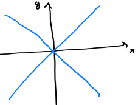

## Teorema del valor medio

Sia $f: A \subseteq \mathbb{R} \to \mathbb{R}$, $A$ aperto, $f$ differenziabile in $A$. Allora, per ogni $\underline{x}, \underline{y} \in A$ tali che $g(t) = \underline{x} + t(\underline{y} - \underline{x}) \in A$ per ogni $t \in [0, 1]$, esiste $G \in (0, 1)$ tale che  

$f(\underline{y}) - f(\underline{x}) = \langle \nabla f(\underline{x} + G(\underline{y} - \underline{x})), \underline{y} - \underline{x} \rangle$

**Dimostrazione**: Definiamo $h(t) = f(g (t))$, $h : [0, 1] \to \mathbb{R}$. Per quanto visto si ha che $h$ è derivabile essendo $f$ e $g$ funzioni differenziabili, e vale  

$h : [0, 1] \stackrel{g}{\to} A \subseteq \mathbb{R}^N \stackrel{f}{\to} \mathbb{R}$

$g'(t) = \underline{y} - \underline{x}$  
$h'(t) = \langle \nabla f(g(t)), g'(t) \rangle$

$t \rightarrow g(t) = \underline{x} + t(\underline{y} - \underline{x}) = (x_1 + t(y_1 - x_1), \ldots, x_N + t(y_N - x_N))$

$\underline{x} = (x_1, \ldots, x_N)$, $\underline{y} = (y_1, \ldots, y_N)$  
$g'(t) = (y_1 - x_1, \ldots, y_N - x_N) = \underline{y} - \underline{x}$

Dal teorema del valor medio (e di Lagrange) per $h$ si ha che esiste $G \in (0, 1)$ tale che  

$h(1) - h(0) = h'(G) (1 - 0) = h'(G)$  
$h(1) = f(g(1)) = f(\underline{y})$  
$h(0) = f(g(0)) = f(\underline{x})$  
$h'(G) = \langle \nabla f(g(G)), \underline{y} - \underline{x} \rangle = \langle \nabla f(\underline{x} + G(\underline{y} - \underline{x})), \underline{y} - \underline{x} \rangle$

### Corollario

Se $f : A \subseteq \mathbb{R}^N \to \mathbb{R}$ è differenziabile in $A$ aperto e connesso, e $\nabla f(\underline{x}) = 0$ per ogni $\underline{x} \in A$, allora $f$ è costante in $A$.

## Derivate direzionali e derivate parziali di ordine superiore

Sia $f : A \subseteq \mathbb{R}^N \to \mathbb{R}$, $A$ aperto. Sia $\underline{u} \in \mathbb{R}^N$ un versore ed esista $\dfrac{\partial f}{\partial \underline{u}}(\underline{x})$ per ogni $\underline{x} \in A$. Resta così definita una funzione $g = \dfrac{\partial f}{\partial \underline{u}}$ in $A$. Sia $\underline{x} \in A$ e sia $v \in \mathbb{R}^N$ un versore. Se esiste $\dfrac{\partial}{\partial v} \left( \dfrac{\partial f}{\partial \underline{u}} \right)(\underline{x_0})$, questa si dice **derivata seconda** di $f$ in $\underline{x_0}$ nelle direzioni orientate $\underline{u}$ e $\underline{v}$ e si indica con $\dfrac{\partial^2 f}{\partial \underline{u} \partial \underline{v}}(\underline{x_0})$.

Sia $f : A \subseteq \mathbb{R}^N \to \mathbb{R}$, $A$ aperto ed esiste $\dfrac{\partial f}{\partial x_i}(\underline{x})$ per ogni $\underline{x} \in A$. Sia $\underline{x_0} \in A$. Se esiste $\dfrac{\partial}{\partial x_j} \left( \dfrac{\partial f}{\partial x_i} \right)(\underline{x_0})$, questa si dice **derivata parziale seconda** di $f$ in $\underline{x_0}$ rispetto $x_i$ e $x_j$ e si indica con $\dfrac{\partial^2 f}{\partial x_j \partial x_i}(\underline{x_0})$ oppure con $f_{x_i x_j}(\underline{x_0})$.

**Esempio**: $f(x) = x^3 y + \sin(3x^2 y^4)$  

$f_x = 3x^2 y + \cos(3x^2 y^4) \cdot 6xy^4$  
$f_{xx} = 6xy - \sin(3x^2 y^4) \cdot 6xy^4 \cdot 6xy^4 + \cos(3x^2 y^4) \cdot 6y^4$

$f_{xy} = 3x^2 - \sin(3x^2 y^4) \cdot 4y^3 \cdot 3x^2 \cdot 6xy^4 + \cos(3x^2 y^4) \cdot 24xy^3$

$f_y = x^3 + \cos(3x^2 y^4) \cdot 3x^2 \cdot 4y^3$

$f_{yx} = 3x^2 - \sin(3x^2 y^4) \cdot 6xy^4 \cdot 3x^2 \cdot 4y^3 + \cos(3x^2 y^4) \cdot 6x \cdot 4y^3$

### Equazione della corda vibrante

{ width=300px }

Le oscillazioni di una corda vibrante elastica che all'istante iniziale $t = 0$ si trova nella configurazione $y = f(x)$ sono descritte da  

$$
(E_0) \begin{cases}
u_{tt}(x,t) - c^2 u_{xx}(x,t) = 0 & \text{ equazione alle derivate parziali} \\
u(x,0) = f(x) & \text{ condizione iniziale} \\
u_t(x,0) = 0 & \text{ condizione iniziale}
\end{cases}
$$

dove $y = u(x,t)$ è lo spostamento del punto di ascissa $x$ al tempo $t$.  
Se $f \in C^2$ la soluzione di $(E_0)$ è data da:  
$u(x,t) = \frac{1}{2} \left( f(x + ct) + f(x - ct) \right)$

### Funzioni di classe $C^k$, $k \in \mathbb{N}$, $k \geq 1$

Sia $f : A \subseteq \mathbb{R}^N \to \mathbb{R}$, $A$ aperto. Si dice che $f$ è di classe $C^k$ in $A$, con $k \in \mathbb{N}$, $k \geq 1$, se è dotata di tutte le derivate parziali fino all'ordine $k$ e queste sono continue in $A$. Si scrive $f \in C^k(A)$.

### Teorema di Schwarz

Se $f \in C^k(A)$, allora le derivate miste h-esime con $2 \leq h \leq k$ non dipendono dall'ordine seguito nell'eseguire la derivazione.

**Esempio**: Consideriamo  

$$
f(x, y) = \begin{cases}
xy \dfrac{x^2 - y^2}{x^2 + y^2} & \text{ se } (x, y) \neq (0, 0) \\
0 & \text{ se } (x, y) = (0, 0)
\end{cases}
$$

Si può dimostrare che $f_{xy}(0, 0) = -1$ e $f_{yx}(0, 0) = 1$ $\Rightarrow$ $f \notin C^2$

$\dfrac{\partial f}{\partial x} = y \dfrac{x^2 - y^2}{x^2 + y^2} - \dfrac{4x^4 y^3}{(x^2 + y^2)^2}$ se $(x, y) \neq (0, 0)$

$\dfrac{\partial f}{\partial x}(0, 0) = 0$

Chiamo $g(x, y) = \dfrac{\partial f}{\partial x} (x, y)$  

$\dfrac{\partial g (0, 0)}{\partial y} = \displaystyle \lim_{t \to 0} \dfrac{g((0, 0) +  t (0, 1)) - g(0, 0)}{t} = \lim_{t \to 0} \dfrac{g((0, t))}{t} = \lim_{t \to 0} \dfrac{1}{t} [-\dfrac{t^3}{t^2}] = -1$

$\left[ \dfrac{\partial g (x, y)}{\partial y} \right]_{(x, y) = (0, 0)}$

## Forme lineari e forme quadratiche

Un'applicazione lineare $L : \mathbb{R}^N \rightarrow \mathbb{R}$ con

$$
L(\underline{h}) = \sum_{i=1}^{N} a_i h_i = \langle \underline{a}, \underline{h} \rangle \qquad \underline{a} = (a_1, \ldots, a_N)
$$

è detta **forma lineare**.

Un'applicazione $Q : \mathbb{R}^N \rightarrow \mathbb{R}$ con
$$
Q(\underline{h}) = \sum_{i=1}^{N} \sum_{j=1}^{N} a_{ij} h_j h_i = \langle A\underline{h}, \underline{h} \rangle
$$

dove $A = \{a_{ij}\}$ è

$$
\begin{pmatrix}
a_{11} & \cdots & a_{1N} \\
\vdots & \ddots & \vdots \\
a_{N1} & \cdots & a_{NN}
\end{pmatrix}
$$
una matrice $N \times N$, è detta **forma quadratica**.

**Esempio**: $N = 2$

Forma lineare: $L(h_1, h_2) = \langle (a_1, a_2), (h_1, h_2) \rangle = a_1 h_1 + a_2 h_2$

Forma quadratica: $Q(h_1, h_2) = a_{11} h_1^2 + (a_{12} + a_{21}) h_1 h_2 + a_{22} h_2^2 = \langle Ah, h \rangle$

### Proprietà

Se $A \in M(N \times N)$, si ha che $\forall \underline{h}, \underline{k} \in \mathbb{R}^N$:

1. $\langle A\underline{h}, \underline{k} \rangle = \langle A^T\underline{k}, \underline{h} \rangle$
2. $Q(\underline{h}) = \langle A\underline{h}, \underline{h} \rangle = \langle A^T\underline{h}, \underline{h} \rangle = \langle \underline{h}, A\underline{h} \rangle$

Dove $Q(\underline{h}) = \langle \frac{1}{2}(A + A^T)\underline{h}, \underline{h} \rangle$

dove $A_0 = \frac{1}{2} (A + A^T)$ è la parte simmetrica di $A$.

### Lemma

Si ha che:

1. Se $\underline{a} \in \mathbb{R}^N$ allora $\nabla (\langle \underline{a}, \underline{h} \rangle) = \underline{a} \quad \forall \underline{h} \in \mathbb{R}^N$
2. Se $A \in M(N \times N)$ allora $\nabla (\langle A\underline{h}, \underline{h} \rangle) = 2A\underline{h} \1uad \forall \underline{h} \in \mathbb{R}^N$

## Funzioni due volte differenziabili e differenziale secondo (campi scalari)

Sia $f : A \subseteq \mathbb{R}^N \to \mathbb{R}$, $A$ aperto, differenziabile in ogni punto di $A$ e sia $\underline{x_0} \in A$. Poniamo $g = \nabla f : A ( \subseteq \mathbb{R}^N ) \to \mathbb{R}^N$. Se $g$ è differenziabile in $\underline{x_0}$, si dice che $f$ è **due volte differenziabile** in $\underline{x_0}$ e la matrice Jacobiana di $g$ in $\underline{x_0}$ si dice **la matrice Hessiana** di $f$ in $\underline{x_0}$ e si indica con $H_f(\underline{x_0})$:

$$
H_f(\underline{x_0}) = \begin{pmatrix}
\dfrac{\partial g_1}{\partial x_1} (\underline{x_0}) & \cdots & \dfrac{\partial g_1}{\partial x_N} (\underline{x_0}) \\
\vdots & \ddots & \vdots \\
\dfrac{\partial g_N}{\partial x_1} (\underline{x_0}) & \cdots & \dfrac{\partial g_N}{\partial x_N} (\underline{x_0})
\end{pmatrix} =
\begin{pmatrix}
\dfrac{\partial^2 f}{\partial x_1^2} (\underline{x_0}) & \cdots & \dfrac{\partial^2 f}{\partial x_1 \partial x_N} (\underline{x_0}) \\
\vdots & \ddots & \vdots \\
\dfrac{\partial^2 f}{\partial x_N \partial x_1} (\underline{x_0}) & \cdots & \dfrac{\partial^2 f}{\partial x_N^2} (\underline{x_0})
\end{pmatrix}
$$

Inoltre la forma quadratica

$\displaystyle Q (\underline{h}) = \langle H_f(\underline{x_0}) \underline{h}, \underline{h} \rangle = \sum_{i=1}^{N} \sum_{j=1}^{N} \dfrac{\partial^2 f}{\partial x_i \partial x_j} (\underline{x_0}) h_i h_j$

si dice **differenziale secondo** di $f$ in $\underline{x_0}$ e si indica con $( d^2 f)(\underline{x_0})$.

## Teorema di Young

Se $f : A \subseteq \mathbb{R}^N \to \mathbb{R}$, $A$ aperto, è due volte differenziabile in $\underline{x_0} \in A$, allora $H_f(\underline{x_0})$ è una matrice simmetrica, cioè

$$
\dfrac{\partial^2 f}{\partial x_i \partial x_j} (\underline{x_0}) = \dfrac{\partial^2 f}{\partial x_j \partial x_i} (\underline{x_0}) \quad \forall i, j = 1, \ldots, N
$$

## Teorema

Se $f$ è di classe $C^2$ in $A$, allora $f$ è due volte differenziabile in ogni punto di $A$.

## Teorema (formula di Taylor al secondo ordine)

Se $f$ è due volte differenziabile in $\underline{x_0}$, allora

$$
f(\underline{x}) = f(\underline{x_0}) + \langle \nabla f(\underline{x_0}), \underline{x} - \underline{x_0} \rangle + \dfrac{1}{2} \langle H_f(\underline{x_0}) (\underline{x} - \underline{x_0}), \underline{x} - \underline{x_0} \rangle + o(\| \underline{x} - \underline{x_0} \|^2)
$$

## Estremi assoluti

Sia $f : E \subseteq \mathbb{R}^N \to \mathbb{R}$. Si pone  
$\displaystyle \sup_E f = \sup f(E) \in \mathbb{R} \cup \{ +\infty \}$  
$\displaystyle \inf_E f = \inf f(E) \in \mathbb{R} \cup \{ -\infty \}$  
che esistono sempre. Inoltre (se esistono):  
$\displaystyle \max_E f = \max f(E)$  
$\displaystyle \min_E f = \min f(E)$

## Condizioni sufficienti per l'esistenza di $\displaystyle \max_E f$ e $\displaystyle \min_E f$

### Teorema di Weierstrass

Se $f : E \subseteq \mathbb{R}^N \to \mathbb{R}$ è continua e $E$ è compatto, allora esistono $\displaystyle \max_E f$ e $\displaystyle \min_E f$.

### Coercività

**Definizione**: Si dice che $f : \mathbb{R}^N \to \mathbb{R}$ è **coerciva** (anticoerciva) se $\displaystyle \lim_{\| \underline{x} \| \to +\infty} f(\underline{x}) = +\infty$ ($-\infty$).

### Teorema

Se $f : \mathbb{R}^N \to \mathbb{R}$ è continua e coerciva (anticoerciva), allora esiste $\displaystyle \min_{E} f$ ($\displaystyle \max_{E} f$).

**Esempio**: Stabilire se $f : \mathbb{R}^2 \to \mathbb{R}$, $f(x, y) = x^4 + y^4 - 3xy$ ammette minimo.

$f$ è continua in $\mathbb{R}^2$, allora verifico che $f$ è coerciva:  
$f(x, y) = \rho^4 \cos^4 \theta + \rho^4 \sin^4 \theta - 3 \rho^2 \cos \theta \sin \theta =$  
$= \rho^4 (cos^4 \theta + \sin^4 \theta) - 3 \rho^2 \cos \theta \sin \theta \boxed{\geq}$
$t = \cos^2 \theta$  
$\cos^4 \theta + \sin^4 \theta = t^2 + (1 - t)^2 = 2t^2 - 2t + 1 \geq c > 0$  
$\boxed{\geq} c \rho^4 - 3 \rho^2 \cos \theta \sin \theta \geq c \rho^4 - 3 \rho^2 \stackrel{\rho \to +\infty}{\longrightarrow} +\infty \quad \cos \theta \sin \theta \leq 1$  
Dunque esiste il minimo.

**Esempio**: Funzione nè corciva nè anticoerciva

$f(x, y) = x - 12xy + 8y^3$  
$f(x, 1) = x - 12x + 8 \stackrel{x \to +\infty}{\longrightarrow} -\infty$  
$f(x, -1) = 13x - 8 \stackrel{x \to +\infty}{\longrightarrow} +\infty$

## Punti di estremo relativo ed assoluto

Siano $f : E \subseteq \mathbb{R}^N \to \mathbb{R}$ e $\underline{x_0} \in E$. Si dice $\underline{x_0}$ è un **punto di massimo (minimo) relativo** per $f$ se esiste un intorno $U$ di $\underline{x_0}$ tale che $\displaystyle f(\underline{x}) < f(\underline{x_0}) \quad \forall \underline{x} \in U, \underline{x} \neq \underline{x_0}$ ($\displaystyle f(\underline{x}) > f(\underline{x_0}) \quad \forall \underline{x} \in U, \underline{x} \neq \underline{x_0}$).  
Si dice che $\underline{x_0}$ è un **punto di massimo (minimo) assoluto** per $f$ se esiste $M = \displaystyle \max_E f$ = f($\underline{x_0}$) (se esiste $m = \displaystyle \min_E f$ = f($\underline{x_0}$)).

### Test del gradiente (Teorema di Fermat - condizione necessaria per l'esistenza di estremo relativo)

Sia $f : E \subseteq \mathbb{R}^N \to \mathbb{R}$ differenziabile in $\underline{x_0} \in \text{int} E$ e $\underline{x_0}$ è un punto di estremo relativo, allora $\nabla f(\underline{x_0}) = \underline{0}$.

**Dimostrazione**: $g(t) = f(\underline{x_0} + t \underline{e}_1)$  
$t = 0$ è un punto di estremo relativo per $g$.  
Per il teorema di Fermat si ha che $g'(0) = 0$  
$g'(0) = \langle \nabla f(\underline{x_0}), \underline{e}_1 \rangle = \dfrac{\partial f}{\partial x_1} (\underline{x_0}) = 0$  
Ripetendo il ragionamento per ciascuna direzione, $\underline{e}_i$ segue la tesi.

### Punto critico

**Definizione**: Sia $f : E \subseteq \mathbb{R}^N \to \mathbb{R}$ differenziabile in $\underline{x_0} \in \text{int} E$. Si dice che $\underline{x_0}$ è **punto critico** di $f$ se $\nabla f(\underline{x_0}) = \underline{0}$.

**Osservazione**: $f(x, y) = y^2 - 3x^2 y + 2x^4$  
$\nabla f(0, 0) = \underline{0}$  
lungo le rette $y = mx$  
$f(x, mx)$ è l'origine di un punto di minimo locale.  
$f(x) = 2m^2 - 18 mx + 24 x^2$  
$f'(0) = 0 \quad f(0) = 2m^2 > 0$  
Però, $(0, 0)$ non è un punto di minimo locale per $f$.

{ width=200px }

### Punto di sella

**Definizione**: Sia $f : E \subseteq \mathbb{R}^N \to \mathbb{R}$ e $\underline{x_0} \in \text{int} E$ punto critico per $f$. Si dice che $\underline{x_0}$ è un **punto di sella** se in ogni intorno di $\underline{x_0}$ esistono punti in cui $f$ è maggiore di $f(\underline{x_0})$ e punti in cui $f$ è minore di $f(\underline{x_0})$.

**Esempio**: $f(x, y) = x^2 - y^2$  
$\nabla f(0, 0) = \underline{0}$  
$\dfrac{\partial f}{\partial x} = 2x \quad \dfrac{\partial f}{\partial y} = -2y$  
$f(0, 0) = 0$  
$f(t, 0) = t^2 > 0 = f(\underline{0})$  
$f(0, t) = -t^2 < 0 = f(\underline{0})$  

### Studio della natura dei punti critici

$f(\underline{x_0} + \underline{h}) - f(\underline{x_0}) = \langle \nabla f(\underline{x_0}), \underline{h} \rangle + \dfrac{1}{2} \langle H_f(\underline{x_0}) \underline{h}, \underline{h} \rangle + o(\| \underline{x} - \underline{x_0} \|^2)$

$\underline{x_0}$ punto critico $\Rightarrow \nabla f(\underline{x_0}) = \underline{0}$

$f(\underline{x}) - f(\underline{x_0}) = \langle \nabla f(\underline{x_0}), \underline{x} - \underline{x_0} \rangle + \dfrac{1}{2} \langle H_f(\underline{x_0}) (\underline{x} - \underline{x_0}), \underline{x} - \underline{x_0} \rangle + o(\| \underline{x} - \underline{x_0} \|^2)$

### Segno di una funzione quadratica e di una matrice

Si dice che una forma quadratica $Q : \mathbb{R}^N \to \mathbb{R}$ è:  

- **definita positiva** se $Q(\underline{h}) > 0 \quad \forall \underline{h} \neq \underline{0}$
- **definita negativa** se $Q(\underline{h}) < 0 \quad \forall \underline{h} \neq \underline{0}$
- **indefinita** se esistono $\underline{u}, \underline{v} \in \mathbb{R}^N$ tali che $Q(\underline{u}) < 0 < Q(\underline{v})$

Si dice che una matrice $A \in M(N, N)$ è definita positiva, o definita negativa, o indefinita, se lo è la forma quadratica $Q(\underline{h}) = \langle A\underline{h}, \underline{h} \rangle$.

**Proprietà**: Sia $Q : \mathbb{R}^N \to \mathbb{R}$ una forma quadratica. Si ha  

- $Q$ è definita positiva se e solo se $\exists m > 0$ tale che $Q(\underline{h}) \geq m \| \underline{h} \|^2 \quad \forall \underline{h} \in \mathbb{R}^N$  
- $Q$ è definita negativa se e solo se $\exists M < 0$ tale che $Q(\underline{h}) \leq M \| \underline{h} \|^2 \quad \forall \underline{h} \in \mathbb{R}^N$

### Criterio di Sylvester

Sia $Q : \mathbb{R}^N \to \mathbb{R}$ una forma quadratica con $Q(\underline{h}) = \langle A\underline{h}, \underline{h} \rangle$, $\underline{h} \in \mathbb{R}^N$ e  

$$
A = \begin{pmatrix}
a_{11} & \cdots & a_{1N} \\
\vdots & \ddots & \vdots \\
a_{N1} & \cdots & a_{NN}
\end{pmatrix}
\in M(N, N) \quad \text{ simmetrica}
$$

Si ha che  

- $Q$ è definita positiva se e solo se  
    $A_1 = a_{11} > 0, \quad A_2 = \det \begin{pmatrix} a_{11} & a_{12} \\ a_{21} & a_{22} \end{pmatrix} > 0, \quad \ldots, \quad A_N = \det A > 0$

- $Q$ è definita negativa se e solo se  
    $A_1 = a_{11} < 0, \quad A_2 = \det \begin{pmatrix} a_{11} & a_{12} \\ a_{21} & a_{22} \end{pmatrix} > 0, \quad \ldots, \quad (-1)^N det A_N > 0$

### Caso $N = 2$

$Q$ è definita positiva $\Leftrightarrow a_{11} > 0, \quad \det A > 0$  
$Q$ è definita negativa $\Leftrightarrow a_{11} < 0, \quad \det A > 0$  
$Q$ è indefinita $\Leftrightarrow \det A < 0$

### Test della matrice Hessiana

Sia $f : E \subseteq \mathbb{R}^N \to \mathbb{R}$ due volte differenziabile in $\underline{x_0} \in \text{int} E$ e $\nabla f(\underline{x_0}) = \underline{0}$. Si ha che  

- se $H_f(\underline{x_0})$ è definita positiva, allora $\underline{x_0}$ è un punto di minimo relativo  
- se $H_f(\underline{x_0})$ è definita negativa, allora $\underline{x_0}$ è un punto di massimo relativo
- se $H_f(\underline{x_0})$ è indefinita, allora $\underline{x_0}$ è un punto di sella

**Esempio**: Si cerchino i punti di massimo e minimo locale (relativo) per $f(x, y) = x^2 - 2x + y^4 + y^2$  
Imponiamo $\nabla f(x, y) = \underline{0}$  

$\dfrac{\partial f}{\partial x} = 2x - 2 = 2(x - 1)$  
$\dfrac{\partial f}{\partial y} = 4y^3 + 2y = 2y(2y^2 + 1)$  

$(1, 0)$ è punto critico per $f$ in quanto  
$\nabla f(1, 0) = \underline{0}$

$$
H_f(x, y) = \begin{pmatrix}
2 & 0 \\
0 & 12y^2 + 2
\end{pmatrix}
$$

$$
H_f(1, 0) = \begin{pmatrix}
2 & 0 \\
0 & 2
\end{pmatrix}
$$

$a_{11} = 2 > 0$  
$\det H_f(1, 0) = 2 \cdot 2 > 0$  
Dunque $(1, 0)$ è punto di minimo locale.

**Esempio**: $f(x, y) = e^{(2x^2 + y^3 + xy)}$  
Si determino i punti critici  
$\nabla f(x, y) = ( f(x, y) \cdot (4x + y), f(x, y) \cdot (3y^2 + x) )$  

$$
\nabla f(x, y) = \underline{0} \Rightarrow \begin{cases}
4x + y = 0 \\
3y^2 + x = 0
\end{cases}
\Leftrightarrow
(0, 0) \vee \left(- \dfrac{1}{48}, \dfrac{1}{12}\right)
$$

- Studiamo la natura dei punti critici

$$
H_f(x, y) = \begin{pmatrix}
f(x, y) [(4x + y)^2 + 4] & f(x, y) [(4x + y)(3y^2 + x) + 1] \\
f(x, y) [(4x + y)(3y^2 + x) + 1] & f(x, y) [(3y^2 + x)^2 + 6y]
\end{pmatrix}
$$

$$
H_f(0, 0) = \begin{pmatrix}
4 & 1 \\
1 & 0
\end{pmatrix}
$$

$\det H_f(0, 0) = -1 < 0 \Rightarrow (0, 0)$ è un punto di sella

$H_f\left(- \dfrac{1}{48}, \dfrac{1}{12}\right) = f\left(- \dfrac{1}{48}, \dfrac{1}{12}\right) \begin{pmatrix} 1 & 1 \\ 1 & \frac{1}{2} \end{pmatrix}$

$a_{11} = 4 > 0$

$\det H_f\left(- \dfrac{1}{48}, \dfrac{1}{12}\right) = \left( f\left(- \dfrac{1}{48}, \dfrac{1}{12}\right) \right)^2 \left( 4 \cdot \dfrac{1}{2} - 1 \right) > 0$

Dunque $\left(- \dfrac{1}{48}, \dfrac{1}{12}\right)$ è un punto di minimo relativo.

# Curve in $\mathbb{R}^N (N = 2, 3)$

## Curve in forma parametrica

Sia $\gamma : I \subseteq \mathbb{R} \to \mathbb{R}^N$, $I$ intervallo. La coppia $(\gamma, \gamma(I))$ si dice **curva parametrica** in $\mathbb{R}^N$, di cui $\gamma$ è la rappresentazione parametrica e $\gamma(I) = \Gamma$ è il sostegno della curva.

Indicheremo  
$N = 2 \quad \gamma(t) = (x(t), y(t))$  
$N = 3 \quad \gamma(t) = (x(t), y(t), z(t))$

**Esempi con N = 2**:  
$x(t) = 2t + 1 \quad y(t) = t - 1 \quad t \in \mathbb{R}$  
$2y - x + 3 = 0$  

$x(t) = \cos t \quad y(t) = \sin t \quad I = [0, 2\pi]$

{ width=100px }

$x(t) = \cos t \quad y(t) = \sin t \quad I = [0, 3\pi]$

$x(t) = t^2 \quad y(t) = t^3 \quad t \in [-1, 1]$

{ width=120px }

**Esempi con N = 3**:  
$x(t) = \cos t \quad y(t) = \sin t \quad z(t) = t$  

{ width=130px }

$x(t) = t \cos t \quad y(t) = t \sin t \quad z(t) = t$  

{ width=130px }

## Curve chiuse e curve semplici

**Definizione**: Una curva in forma parametrica $\gamma : [a, b] \to \mathbb{R}^N$ si dice **chiusa** se $\gamma(a) = \gamma(b)$.  

**Definizione**: Una curva in forma parametrica $\gamma : I \subseteq \mathbb{R} \to \mathbb{R}^N$ si dice **semplice** se per ogni $t_1, t_2$ con $t_1 \neq t_2$ e $t_1 \in \text{int} I$ oppure $t_2 \in \text{int} I$ si ha che $\gamma(t_1) \neq \gamma(t_2)$.

**Osservazione**:  
$\gamma(0) = (1, 0) \quad \gamma(3\pi) = (-1, 0) \quad$ non è chiusa  
$\gamma(\dfrac{\pi}{2}) = \gamma \left(2\pi + \dfrac{\pi}{2} \right)$ non è semplice

## Vettore tangente e versore tangente

Una curva in forma parametrica $\gamma : I \subseteq \mathbb{R} \to \mathbb{R}^N$ si dice regolare se $\gamma$ è di classe $C^1$ e $\gamma'(t) \neq \underline{0}$ per ogni $t \in \text{int} I$. Il vettore $\gamma'(t)$ si dice **vettore tangente** e il versore $\tau(t) = \dfrac{\gamma'(t)}{\| \gamma'(t) \|}$ si dice **versore tangente**.

## Curve regolari in forma cartesiana in $\mathbb{R}^2$

**Definizione**: Sia $f : I \subseteq \mathbb{R} \to \mathbb{R}$, $I$ intervallo, di classe $C^1$. La curva in forma parametrica $\gamma(t) = (t, f(t)), t \in I$ è una curva regolare semplice che si dice in **forma cartesiana**. $x(t) = t \quad y(t) = f(t)$

## Curve regolari in forma polare in $\mathbb{R}^2$

Sia $\rho : I \subseteq \mathbb{R} \to \mathbb{R}$, $I$ intervallo, di classe $C^1$ tale che $\rho(\sigma) \geq 0$ e $(\rho(\sigma))^2 + (\rho'(\sigma))^2 > 0$ in $\text{int} I$. La curva in forma parametrica $\gamma(\sigma) = (\rho(\sigma) \cos \sigma, \rho(\sigma) \sin \sigma)$, $\sigma \in I$, è una curva regolare semplice che si dice in **forma polare**.

$\| \gamma'(\sigma) \| = \sqrt{(\rho(\sigma))^2 + (\rho'(\sigma))^2} > 0 \Rightarrow \gamma'(\sigma) \neq \underline{0} \Rightarrow \gamma$ è regolare

$x(\sigma) = \rho(\sigma) \cos \sigma \quad y(\sigma) = \rho(\sigma) \sin \sigma$  
$x'(\sigma) = \rho'(\sigma) \cos \sigma + \rho(\sigma) (-\sin \sigma)$  
$y'(\sigma) = \rho'(\sigma) \sin \sigma + \rho(\sigma) \cos \sigma$

**Esempio**: $\rho(\sigma) = 1 + \cos \sigma \quad \sigma \in [-\pi, \pi] \quad$ "cardioide"

{ width=100px }

## Curve in forma implicita in $\mathbb{R}^2$

Possiamo definire una curva nel piano per mezzo di equazioni, cioè come linee di livello $0$, $L_0 (\phi)$ di una funzione $\phi$.

**Esempio**: $\phi(x, y) = x^2 + y^2 - 1$  
$L_0 (\phi) = \{ (x, y) \in \mathbb{R}^2 : x^2 + y^2 - 1 = 0 \}$

{ width=100px }

$\phi(x, y) = x^2 - y^2$  

{ width=100px }

$\phi(x, y) = x^3 - y^2$

{ width=100px }

## Punti regolari e punti singolari

Sia $\phi : A \subseteq \mathbb{R}^2 \to \mathbb{R}$ di classe $C^1$, $A$ aperto, e sia $\underline{x_0} \in L_0(\phi) = \{ \underline{x} \in A : \phi(\underline{x}) = 0 \}$. Si dice che $\underline{x_0}$ è un **punto regolare** per $L_0(\phi)$ se $\nabla \phi(\underline{x_0}) \neq \underline{0}$, altrimenti se $\nabla \phi(\underline{x_0}) = \underline{0}$ si dice che $\underline{x_0}$ è un **punto singolare** per $L_0(\phi)$.

## Teorema della funzione implicita (o teorema del Dini)

Se $\phi : A \subseteq \mathbb{R}^2 \to \mathbb{R}$, $A$ aperto, è di classe $C^1$ e $\underline{x_0} = (x_0, y_0) \in A$ è tale che $\phi(\underline{x_0}) = 0$ e $\nabla \phi(\underline{x_0}) \neq \underline{0}$, allora esistono $U$ intorno di $x_0$ e $V$ intorno di $y_0$ e una funzione $g : U \to V$ oppure $h : V \to U$ di classe $C^1$ tale che  

$$
L_0(\phi) \cap (U \times V) = \begin{cases}
G(g) & \text{se } \phi_y(x_0, y_0) \neq 0 \\
H(h) & \text{se } \phi_x(x_0, y_0) \neq 0
\end{cases}
$$

{ width=500px }

Inoltre si ha che  

$g'(x) = - \dfrac{\phi_x(x, g(x))}{\phi_y(x, g(x))}$ in $U$ se $\phi_y(x_0, y_0) \neq 0$

$h'(y) = - \dfrac{\phi_y(h(y), y)}{\phi_x(h(y), y)}$ in $V$ se $\phi_x(x_0, y_0) \neq 0$

In particolare la retta tangente a $L_0(\phi)$ in $\underline{x_0}$ ha equazione  
$y = g(x) + g'(x)(x - x_0) \Leftrightarrow y - y_0 = - \dfrac{\phi_x(\underline{x_0})}{\phi_y(\underline{x_0})} (x - x_0) \quad$ se $\phi_y(\underline{x_0}) \neq 0$

ovvero $\phi_x(\underline{x_0}) (x - x_0) + \phi_y(\underline{x_0}) (y - y_0) = 0$  
$\Leftrightarrow \langle \nabla \phi(\underline{x_0}), \underline{x} - \underline{x_0} \rangle = 0$  

questo si può trovare in maniera analoga nel caso in cui $\phi_x(\underline{x_0}) \neq 0$.

**Esempio**: $\phi(x, y) = x^2 + y^2 - 1$

{ width=400px }

**Esempio**: $\phi_x(x, y) = x^2 - y^2$

$\nabla \phi(x, y) = (2x, -2y)$  
$\nabla \phi(0, 0) = (0, 0) \quad (0, 0) \in L_0(\phi)$

$(0, 0)$ è un punto singolare. Vicino a $(0, 0)$ non posso rappresentare $L_0(\phi)$ né come grafico di "una $g$" né come grafico di "una $h$".

--- NEW STUFF ---

## Curva regolare in forma implicita in $\mathbb{R}^2$

**Definizione**: Sia $\phi : A \subseteq \mathbb{R}^2 \to \mathbb{R}$ di classe $C^1$, $A$ aperto, tale che $\Gamma = L_0 (\phi) = \{ (x, y) \in \mathbb{R}^2 : \phi(x, y) = 0 \} \neq \emptyset$ e $\nabla \phi(x_0, y_0) \neq \underline{0}$ per ogni $(x_0, y_0) \in \Gamma$ (cioè tutti i punti di $\Gamma$ sono regolari). La coppia $(\phi, L_0(\phi))$ si dice **curva regolare in forma implicita**, dove $\phi(x, y) = 0$ è l'equazione e $\Gamma$ è il sostegno.

### Conseguenze del teorema della funzione implicita

Se $(\phi, L_0(\phi))$ è una curva regolare in forma implicita, allora si ha che  

$1)$ Per ogni $\underline{x_0} \in L_0(\phi)$ esiste la retta tangente e ha equazione $\langle \nabla \phi(\underline{x_0}), \underline{x} - \underline{x_0} \rangle = 0$

$2)$ Per ogni $\underline{x_0} \in L_0(\phi)$ se $\phi_y(\underline{x_0}) \neq 0$ allora  
$g'(\underline{x_0}) = - \dfrac{\phi_x(\underline{x_0})}{\phi_y(\underline{x_0})} \Leftrightarrow \phi_y(\underline{x_0}) g'(\underline{x_0}) + \phi_x(\underline{x_0}) \cdot 1 = 0 \Leftrightarrow \langle \nabla \phi(\underline{x_0}), (1, g'(\underline{x_0})) \rangle = 0$

{ width=300px }

Quindi il $\nabla \phi(\underline{x_0})$ è ortogonale alla linea di livello di $\phi$ in $\underline{x_0}$.

**Esempio**: Consideriamo $\phi(x, y) = x^3 + y^3 - xy$ e sia $L_k (\phi) = \{ (x, y) \in \mathbb{R}^2 : \phi(x, y) = k \}$ con $k \in \mathbb{R}$. Stabilire per quali $k$, $L_k (\phi)$ è una curva regolare in forma implicita. Trovare la retta tangente a $L_1 (\phi)$ in $(1, 1)$.

$\phi : \mathbb{R}^2 \to \mathbb{R}$  
$\phi$ è una funzione continua  
$\phi(\mathbb{R}^2)$ è connesso di $\mathbb{R}$ e quindi è un intervallo ed osservando che  
$\displaystyle \lim_{x \to +\infty} \phi(x, 0) = \lim_{x \to +\infty} x^3 = +\infty$  
$\displaystyle \lim_{x \to -\infty} \phi(x, 0) = \lim_{x \to -\infty} x^3 = -\infty$  
deduco che $\phi(\mathbb{R}^2) = \mathbb{R}$ e dunque $L_k (\phi) \neq \emptyset$ per ogni $k \in \mathbb{R}$.

$\nabla \phi(x, y) = \underline{0} \Leftrightarrow \begin{cases} 3x^2 - y = 0 \\ 3y^2 - x = 0 \end{cases} \Leftrightarrow (0, 0) \vee \left( \dfrac{1}{3}, \dfrac{1}{3} \right)$  
$k_1 = \phi\left(0, 0\right) = 0$  
$k_2 = \phi\left(\dfrac{1}{3}, \dfrac{1}{3}\right) = -\dfrac{1}{27}$  
Dunque $L_0 (\phi)$ e $L_{-\dfrac{1}{27}} (\phi)$ non sono curve regolari in forma implicita.

$L_1 (\phi), (1, 1)$  
$\phi (1, 1) = 1 + 1 - 1 = 1 \Rightarrow (1, 1) \in L_1 (\phi)$  
$\langle \phi (1, 1), (x, y) - (1, 1) \rangle = 0$  
$\langle (2, 2), (x, y) - (1, 1) \rangle = 0$  
$2(x - 1) + 2(y - 1) = 0 \Leftrightarrow x + y = 2$  
che è la retta tangente a $L_1 (\phi)$ in $(1, 1)$.

**Esempio**: Si consideri la funzione $f(x, y) = x^4 + y^2 + 2x^2y + 1$,  
si determino gli insiemi di livello $L_k (f) = \{ (x, y) \in \mathbb{R}^2 : f(x, y) = k \}$ che non sono curve regolari in forma implicita.

$\nabla f(x, y) = \underline{0} \Leftrightarrow \begin{cases} 4x^3 + 4xy = 0 \\ 2y + 2x^2 = 0 \end{cases} \Leftrightarrow y = -x^2 \quad (x, -x^2)$  
$f(x, -x^2) = x^4 + (-x^2)^2 + 2x^2 \cdot (-x^2) + 1 = 1$  
$(x, -x^2) \in L_1 (f)$ non è una curva regolare in forma implicita.

# Superfici in $\mathbb{R}^3$

## Superficie regolare semplice in forma parametrica

Sia $A \subseteq \mathbb{R}^2$ un aperto connesso e  
$G : K = \overline{A} \subseteq \mathbb{R}^2 \to \mathbb{R}^3$  
$(u, v) \mapsto \Big( x(u, v), y(u, v), z(u, v) \Big)$  
tale che  
$1)$ $G$ è di classe $C^1$ in $\text{int} K$ e $G_u, G_v$ siano estendibili con continuità fino al bordo di $K$.  
$2)$ per ogni $(u, v) \in \text{int} K$, $G_u(u, v) = \Big( x_u(u, v), y_u(u, v), z_u(u, v) \Big)$ e $G_v(u, v) = \Big( x_v(u, v), y_v(u, v), z_v(u, v) \Big)$ siano linearmente indipendenti $\Leftrightarrow G_u(u, v) \times G_v(u, v) \neq \underline{0}$.  
$3)$ Per ogni $\underline{u}^1, \underline{u}^2 \in K$ con $\underline{u}^1 \neq \underline{u}^2$ e $\underline{u}^1 \in \text{int} K$ oppure $\underline{u}^2 \in \text{int} K$ si abbia $G (\underline{u}^1) \neq G (\underline{u}^2)$.  
La coppia $(G, G(K))$ si dice **superficie regolare semplice in forma parametrica**, di cui $G$ è la rappresentazione parametrica e $\Sigma = G(K)$ è il sostegno.

**Recap**: $\underline{a} = (a_1, a_2, a_3) \quad \underline{b} = (b_1, b_2, b_3)$  

$$
\begin{aligned}
\underline{a} \times \underline{b} &= \det \begin{pmatrix}
\underline{e}_1 & \underline{e}_2 & \underline{e}_3 \\
a_1 & a_2 & a_3 \\
b_1 & b_2 & b_3
\end{pmatrix} = \\
&= \underline{e}_1 (a_2 b_3 - a_3 b_2) - \underline{e}_2 (a_1 b_3 - a_3 b_1) + \underline{e}_3 (a_1 b_2 - a_2 b_1) = \\
&= (a_2 b_3 - a_3 b_2, a_3 b_1 - a_1 b_3, a_1 b_2 - a_2 b_1)
\end{aligned}
$$

**Esempio**: $\begin{cases} x(u, v) = R \sin u \cos v \\ y(u, v) = R \sin u \sin v \\ z(u, v) = R \cos u \end{cases}$  
$(u, v) \in K = [0, \pi] \times [0, 2\pi]$  
parametrizzazione della sfera di raggio $R$ centrata nell'origine.

## Linee coordinate, versore normale e piano tangente

Siano $G : K \subseteq \mathbb{R}^2 \to \mathbb{R}^3$ una superficie regolare semplice in forma parametrica. Fissato $\underline{u_0} = (u_0, v_0) \in K$, le curve regolari semplici in forma parametrica  
$G(\cdot, v_0) : \ ] u_0 - \delta, u_0 + \delta [ \to \mathbb{R}^3$  
$G(u_0, \cdot) : \ ] v_0 - \delta, v_0 + \delta [ \to \mathbb{R}^3$  
si dicono linee coordinate su $\Sigma$ per $\underline{x_0} = G(\underline{u_0})$.  
I vettori tangenti alle linee coordinate in $\underline{x_0}$ sono $G_u(\underline{u_0})$ e $G_v(\underline{u_0})$.  
Il piano generato da $G_u(\underline{u_0})$ e $G_v(\underline{u_0})$ si dice **piano tangente** a $\Sigma$ e si rappresenta:  

- in forma parametrica: $\underline{x} = \underline{x_0} + s G_u(\underline{u_0}) + t G_v(\underline{u_0}) \quad (s, t) \in \mathbb{R}^2$  
- in forma implicita: $\langle G_u(\underline{u_0}) \times G_v(\underline{u_0}), \underline{x} - \underline{x_0} \rangle = 0$  

Il versore $\alpha(\underline{u_0}) = \dfrac{G_u(\underline{u_0}) \times G_v(\underline{u_0})}{\| G_u(\underline{u_0}) \times G_v(\underline{u_0}) \|}$ si dice **versore normale** a $\Sigma$ in $\underline{x_0}$.

{ width=500px }

## Superfici regolari in forma cartesiana

Sia $f : K \subseteq \mathbb{R}^2 \to \mathbb{R}$, $K = \overline{A}$, $A$ aperto connesso e $\nabla f$ estendibile con continuità a tutto $K$.  
La funzione  
$G : K \to \mathbb{R}^3$  
$()
