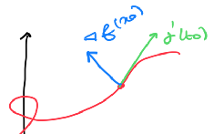
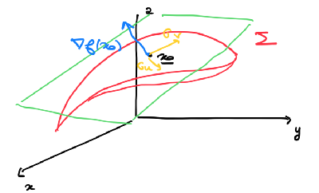
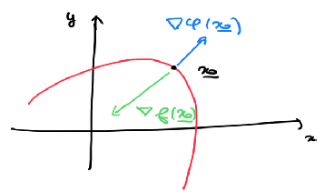
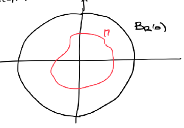
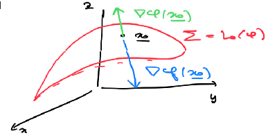
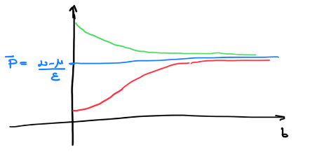
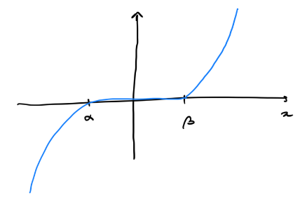
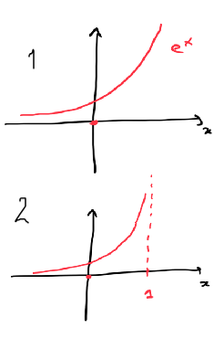

## Superficie regolare in forma implicita

Sia $\varphi : A \subseteq \mathbb{R}^2 \to \mathbb{R}^3$, $A$ aperto, una funzione di classe $C^1$ tale che $\Sigma = L_0 (\varphi) = \{ (x, y, z) \in \mathbb{R}^3 : \varphi(x, y, z) = 0 \} \neq \emptyset$ e $\nabla \varphi (x, y, z) \neq 0$ per ogni $(x, y, z) \in \Sigma$. La coppia $(\varphi, \Sigma)$ si dice **superficie regolare in forma implicita** di cui $\varphi (x, y, z) = 0$ è l'equazione e $\Sigma$ è il sostegno.  
Per ogni $\underline{x_0} \in \Sigma$ il piano tangente a $\Sigma$ in $\underline{x_0}$ è definito dall'equazione $\langle \nabla \varphi (\underline{x_0}), \underline{x} - \underline{x_0} \rangle = 0$ e il vettore $\nabla \varphi (\underline{x_0})$ è ortogonale a $\Sigma$ in $\underline{x_0}$.

**Esempio**: Sia $\varphi(x, y, z) = x^2 + y^2 - z^2$  
Per quali $k \in \mathbb{R}$ la superficie di livello  
$L_k (\varphi) = \{ (x, y, z) \in \mathbb{R}^3 : \varphi(x, y, z) = k \}$  
è una superficie regolare in forma implicita.  
Determinare il piano tangente a $L_0 (\varphi)$ in $(1, 0, 1)$.

$\varphi : \mathbb{R}^3 \to \mathbb{R}$ continua, $\mathbb{R}^3$ connesso $\Rightarrow \varphi (\mathbb{R}^3)$ è un insieme connesso di $\mathbb{R}$, quindi un intervallo.  
$\displaystyle \lim_{x \to +\infty} \varphi(x, 0, 0) = \lim_{x \to +\infty} x^2 = +\infty$  
$\displaystyle \lim_{z \to +\infty} \varphi(0, 0, z) = \lim_{z \to +\infty} -z^2 = -\infty$  
$\varphi (\mathbb{R}^3) = \mathbb{R}$.

$\nabla \varphi (x, y, z) = \underline{0} \Leftrightarrow \begin{cases} 2x = 0 \\ 2y = 0 \\ -2z = 0 \end{cases} \Leftrightarrow (x, y, z) = (0, 0, 0)$  
$\varphi(0, 0, 0) = 0 \Rightarrow L_0 (\varphi)$ non è una superficie regolare in forma implicita.

Piano tangente a $L_0 (\varphi)$ in $(1, 0, 1)$:  
$\langle \nabla \varphi (\underline{x_0}), \underline{x} - \underline{x_0} \rangle = 0 \quad \underline{x_0} = (1, 0, 1)$  
$\nabla \varphi (x, y, z) = (2x, 2y, -2z)$  
$\langle (2, 0, -2), (x - 1, y - 0, z - 1) \rangle = 0$  
$2(x - 1) + 0(y - 0) - 2(z - 1) = 0$

# Estremi vincolati

## Vincolo per una funzione

Sia $f : E \subseteq \mathbb{R}^N \to \mathbb{R}$ una funzione.  
Un insieme $V \subseteq E$ tale che  
$\emptyset \subsetneqq V \subsetneqq E$ si dice **vincolo** per $f$ in $E$.

## Punto di estremo vincolato

Siano $f : E \subseteq \mathbb{R}^N \to \mathbb{R}$ una funzione e $V$ un vincolo per $f$ in $E$. Un punto $\underline{x_0} \in V$ si dice **punto di estremo vincolato** per $f$ in $V$ se $\underline{x_0}$ è un punto di estremo di ${}^f |_{V}$.

I seguenti risultati forniscono delle condizioni neccessarie per l'esistenza di punti di estremo vincolato.

## Teorema ($N = 2, V = \Gamma$ curva in forma parametrica)

Sia $f : A \subseteq \mathbb{R}^2 \to \mathbb{R}$, $A$ aperto, $f \in C^1$ e $\gamma : I \subseteq \mathbb{R} \to A$ una curva regolare semplice e $\underline{x_0} = \gamma(t_0) \in \Gamma$ è un punto regolare ed è un punto di estremo vincolato di $f$ in $\Gamma$ e $t_0 \in \text{int} I$, allora  
$\langle \nabla f (\underline{x_0}), \gamma'(t_0) \rangle = 0$

{ width=120px }

**Dimostrazione**: Introduco la funzione  
$\psi = f \circ \gamma : \mathbb{R} \to \mathbb{R}$  
Poiché $\underline{x_0} = \gamma(t_0)$ è un punto di estremo vincolato, allora $t_0$ è un punto di estremo (libero) per $\psi$. Dunque per il teorema di Fermat si ha che $\psi'(t_0) = 0$.  
$\psi'(t_0) = \langle \nabla f (\gamma(t_0)), \gamma'(t_0) \rangle = \langle \nabla f (\underline{x_0}), \gamma'(t_0) \rangle$  
$\Rightarrow \langle \nabla f (\underline{x_0}), \gamma'(t_0) \rangle = 0$

## Teorema ($N = 3, V = \Sigma$ superficie regolare in forma implicita $cl(B) = B$)

**Nota**: $cl(B)$ è la chiusura di $B$.

Sia $f : A \subseteq \mathbb{R}^3 \to \mathbb{R}$, $A$ aperto, di classe $C^1$ e $G : K = cl(B) \subseteq \mathbb{R}^2 \to \mathbb{R}^3$, $B$ aperto, $G$ superficie regolare semplice. Se $\underline{x_0} = \Big( x(u_0, v_0), y(u_0, v_0), z(u_0, v_0) \Big) \in \Sigma$ è un punto di estremo vincolato per $f$ in $\Sigma$ e $\underline{u_0} = (u_0, v_0) \in B$, allora  

$$
\begin{cases}
\langle \nabla f (\underline{x_0}), G_u (\underline{u_0}) \rangle = 0 \\
\langle \nabla f (\underline{x_0}), G_v (\underline{u_0}) \rangle = 0
\end{cases}
$$

{ width=150px }

**Dimostrazione**: Consideriamo la funzione $\psi = f \circ G : K \subseteq \mathbb{R}^2 \to \mathbb{R}$. La funzione $\psi$ ha un punto di estremo in $\underline{u_0} = (u_0, v_0)$, $\underline{x_0} \in B$ ed è di classe $C^1$. Per il test del gradiente si ha che $\nabla \psi (\underline{u_0}) = \underline{0}$.  
$0 = \psi_u (\underline{u_0}) = \langle \nabla f (\psi(\underline{u_0})), G_u (\underline{u_0}) \rangle = \langle \nabla f (\underline{x_0}), G_u (\underline{u_0}) \rangle$  
$0 = \psi_v (\underline{u_0}) = \langle \nabla f (\psi(\underline{u_0})), G_v (\underline{u_0}) \rangle = \langle \nabla f (\underline{x_0}), G_v (\underline{u_0}) \rangle$  

$\boxed{\underbrace{\nabla \psi (\underline{u_0})}_{1 \times 2} = \underbrace{J_f (\underline{x_0})}_{1 \times 3} \cdot \underbrace{J_G (\underline{u_0})}_{3 \times 2}} \quad \square$

## Teorema dei moltiplicatori di Lagrange ($N = 2, \Gamma$ curva regolare in forma implicita)

Sia $f : A \subseteq \mathbb{R}^2 \to \mathbb{R}$, $A$ aperto, di classe $C^1$ e $\varphi : A \subseteq \mathbb{R}^2 \to \mathbb{R}$ di classe $C^1$, e sia $\Gamma = \{ (x, y) \in \mathbb{R}^2 : \varphi(x, y) = 0 \} = L_0 (\varphi)$. Se $(x_0, y_0) = \underline{x_0} \in \Gamma$ è punto di estremo vincolato di $f$ in $\Gamma$ e $\nabla \varphi (\underline{x_0}) \neq \underline{0}$, allora esiste $\lambda \in \mathbb{R}$ tale che $\nabla f (\underline{x_0}) = \lambda \nabla \varphi (\underline{x_0})$.  

{ width=160px }

**Dimostrazione**: Poiché $\nabla \varphi (\underline{x_0}) \neq \underline{0}$ per il teorema del Dini esiste un intorno $\omega$ di $\underline{x_0}$ tale che $\Gamma \cap \omega = \gamma(I)$, dove $\gamma : I \subseteq \mathbb{R} \to A$ è una curva in forma cartesiana con $\gamma(t_0) = \underline{x_0}, t_0 \in \text{int} I$. Dunque dal teorema precedente (minimi vincolati su curve parametriche) si ha che $\langle \nabla f (\underline{x_0}), \gamma'(t_0) \rangle = 0$. Inoltre, per una conseguqnza del teorema del Dini si ha che $\nabla \varphi (\underline{x_0}) \neq \underline{0}, \gamma'(t_0) \neq 0$ e $\langle \nabla \varphi (\underline{x_0}), \gamma'(t_0) \rangle = 0$.  
Da questi due risultati si ha che esiste $\lambda \in \mathbb{R}$ tale che $\nabla f (\underline{x_0}) = \lambda \nabla \varphi (\underline{x_0})$.

**Ossevazione**: Se $\Gamma$ è una curva regolare in forma implicita, allora $\nabla \varphi (\underline{x_0}) \neq \underline{0} \forall \underline{x_0} \in \Gamma$ e quindi l'ipotesi del teorema è soddifatta.

**Osservazione**: Se $\Gamma$ non è una curva regolare in forma implicita allora i punti di estremo vincolato vanno cercati  

$$
\underbrace{
    \begin{cases}
    \nabla f (x, y) = \lambda \nabla \varphi (x, y) \\
    \varphi(x, y) = 0
    \end{cases}
}_{\text{se } (x, y) \text{ è punto regolare}} \vee
\underbrace{
    \begin{cases}
    \nabla \varphi (x, y) = 0 \\
    \varphi(x, y) = 0
    \end{cases}
}_{\text{se } (x, y) \text{ è punto singolare}}
$$

**Esercizio**: Determinare gli estremi di $f(x, y) = x + y$ sulla curva $\Gamma$ di equazione $x^4 + y^4 - 4xy = 1$.

$f$ è una funzione continua  
$\Gamma = \{ (x, y) \in \mathbb{R}^2 : x^4 + y^4 - 4xy - 1 = 0 \}$  
$\Gamma$ è un compatto di $\mathbb{R}^2$  
$\Gamma$ è chiuso $\quad \varphi(x, y) = x^4 + y^4 - 4xy - 1$  
$\Gamma = \varphi^{-1} (\{ 0 \})$, $\varphi$ è continua, $\{ 0 \}$ è un chiuso e dunque $\Gamma$ è un chiuso.  
$\Gamma$ è limitato se $\exists R > 0 : B(0, R) \supset \Gamma$

{ width=100px }

Essendo $\varphi$ coerciva se $\exists (x_n, y_n) \in L_0 (\varphi)$ tale che $\rho_n = \sqrt{x_n^2 + y_n^2} \to +\infty$ allora $\varphi(x_n, y_n) \to +\infty$ ma si ha che $\varphi(x_n, y_n) = 0, (x_n, y_n) \in L_0 (\varphi)$, assurdo $\Rightarrow \Gamma$ è limitato.

Dunque per il teorema di Weierstrass posso affermare che esistono massimo e minimo assoluti di $f$ su $\Gamma$.

**Punti singolari**:

$$
\begin{aligned}
    &\begin{cases}
        \nabla \varphi (x, y) = \underline{0} \\
        \varphi(x, y) = 0
    \end{cases} \Leftrightarrow
    \begin{cases}
        x^3 = y \\
        y^3 = x \\
        x^4 + y^4 - 4xy - 1 = 0
    \end{cases} \Leftrightarrow \\ \Leftrightarrow &
    \begin{cases}
        x^9 - x = 0 \\
        y = x^3 \\
        x^4 + x^4 - 4x^4 - 1 = 0
    \end{cases} \Leftrightarrow
    \begin{cases}
        x(x^8 - 1) = 0 \\
        y = x^3 \\
        x^4 + x^4 - 4x^4 - 1 = 0
    \end{cases} \Leftrightarrow \\ \Leftrightarrow &
    \begin{cases}
        x = 0 \\
        y = 0 \\
        0 \neq -1
    \end{cases} \vee
    \begin{cases}
        x = 1 \\
        y = 1 \\
        -2 \neq -1
    \end{cases} \vee
    \begin{cases}
        x = -1 \\
        y = -1 \\
        -2 \neq 1
    \end{cases} \Rightarrow \\ \Rightarrow &
    \text{non ci sono punti singolari}
\end{aligned}
$$

Dunque $\Gamma$ è una curva regolare in forma implicita.

Metodo dei moltiplicatori di Lagrange:

$$
\begin{aligned}
    &\begin{cases}
        \nabla f (x, y) = \lambda \nabla \varphi (x, y) \\
        \varphi(x, y) = 0
    \end{cases} \Leftrightarrow
    \begin{cases}
        1 = \lambda (4x^3 - 4y) \\
        1 = \lambda (4y^3 - 4x) \\
        x^4 + y^4 - 4xy - 1 = 0
    \end{cases} \Leftrightarrow \\ \Leftrightarrow &
    \begin{cases}
        \dfrac{1}{\lambda} = 4x^3 - 4y \\
        \dfrac{1}{\lambda} = 4y^3 - 4x \\
        x^4 + y^4 - 4xy - 1 = 0
    \end{cases} \Leftrightarrow
    \begin{cases}
        x^3 - y = y^3 - x \\
        x^4 + y^4 - 4xy - 1 = 0
    \end{cases} \Leftrightarrow \\ \Leftrightarrow &
    \begin{cases}
        (x - y)(x^2 + xy + y^2 + 1) = 0 \\
        x^4 + y^4 - 4xy - 1 = 0
    \end{cases} \Leftrightarrow \\ \Leftrightarrow &
    \begin{cases}
        x = y \\
        x^4 + y^4 - 4xy - 1 = 0
    \end{cases} \quad \boxed{1} \vee
    \begin{cases}
        x^2 + xy + y^2 + 1 = 0 \\
        x^4 + y^4 - 4xy - 1 = 0
    \end{cases} \quad \boxed{2}
\end{aligned}
$$

$\boxed{1}$:  
$x = y \Rightarrow 2x^4 - 4x^2 - 1 = 0$  
$t = x^2 \Rightarrow 2t^2 - 4t - 1 = 0$  
$t_{1,2} = \dfrac{2 \pm \sqrt{6}}{2}$  
$t = \dfrac{2 + \sqrt{6}}{2} \Rightarrow x_{1,2} = \pm \sqrt{\dfrac{2 + \sqrt{6}}{2}}$

$P1 = \left( \sqrt{\dfrac{2 + \sqrt{6}}{2}}, \sqrt{\dfrac{2 + \sqrt{6}}{2}} \right) \quad P2 = \left( -\sqrt{\dfrac{2 + \sqrt{6}}{2}}, -\sqrt{\dfrac{2 + \sqrt{6}}{2}} \right)$

$\boxed{2}$:

$-1 = x^2 + xy + y^2 \geq x^2 + y^2 - \dfrac{1}{2} (x^2 + y^2) = \dfrac{1}{2} (x^2 + y^2) \geq 0 \Rightarrow$ assurdo

$f(P1) = 2 \sqrt{\dfrac{2 + \sqrt{6}}{2}} = \displaystyle\max_{\Gamma} f$  
$f(P2) = -2 \sqrt{\dfrac{2 + \sqrt{6}}{2}} = \displaystyle\min_{\Gamma} f$

**Esercizio**: Determinare gli estremi di $f(x, y) = x$ in $E = \{ (x, y) \in \mathbb{R}^2 : x^3 = y^2 \}$.  

$\displaystyle\min_{E} f = 0 \quad \displaystyle\max_{E} f = +\infty$

Applicando il metodo dei moltiplicatori di Lagrange  

$$
\begin{aligned}
    &\begin{cases}
        \nabla f (x, y) = \lambda \nabla \varphi (x, y) \\
        \varphi(x, y) = 0
    \end{cases} \Leftrightarrow
    \begin{cases}
        1 = 3 \lambda x^2 \\
        0 = -2 \lambda y \\
        x^3 = y^2
    \end{cases} \Leftrightarrow \\ \Leftrightarrow &
    \begin{cases}
        \lambda = 0 \\
        1 \neq 0
    \end{cases} \vee
    \begin{cases}
        y = 0 \\
        x = 0 \\
        1 \neq 0
    \end{cases} \Rightarrow \\ \Rightarrow &
    \text{non esistono soluzioni}
\end{aligned}
$$

Il punto di minimo si trova tra le soluzioni di $\begin{cases} \nabla f (x, y) = 0 \\ \varphi(x, y) = 0 \end{cases}$

# $N = 3, \Sigma$ superficie regolare in forma implicita

## Teorema dei moltiplicatori di Lagrange

Siano $f : A \subseteq \mathbb{R}^3 \to \mathbb{R}$, $A$ aperto e $f \in C^1$ e siano $\varphi : A \subseteq \mathbb{R}^3 \to \mathbb{R}$ di classe $C^1$ e $\Sigma = \{ (x, y, z) \in \mathbb{R}^3 : \varphi(x, y, z) = 0 \} = L_0 (\varphi)$. Se $\underline{x_0} = (x_0, y_0, z_0) \in \Sigma$ è un punto di estremo vincolato di $f$ in $\Sigma$ e se $\nabla \varphi (\underline{x_0}) \neq \underline{0}$, allora esiste $\lambda \in \mathbb{R}$ tale che $\nabla f (\underline{x_0}) = \lambda \nabla \varphi (\underline{x_0})$.

{ width=160px }

**Esercizio**: Data $f : \mathbb{R}^3 \to \mathbb{R}$, $f(x, y, z) = x + y + z$ e $\Sigma = \{ (x, y, z) \in \mathbb{R}^3 : x^2 - xy + y^2 - z^2 = 1 \}$. Trovare $\max$ e $\min$ di $f$ su $\Sigma$ (se esistono).

$f$ è continua  
$\Sigma$ è chiuso in quanto $\varphi(x, y, z) = x^2 - xy + y^2 - z^2 - 1 \quad \Sigma = \varphi^{-1} (\{ 0 \})$ è un chiuso  
$\Sigma$ è limitato in quanto $\Sigma \{ (x, y, z) \in \mathbb{R}^3 : \left( x - \dfrac{y}{2} \right)^2 + \dfrac{3}{4} y^2 - z^2 = 1 \}$ è un ellissoide.  
Dunque si ha che se $(x, y, z) \in \Sigma$ allora  
$\dfrac{3}{4} y^2 \leq 1 \Leftrightarrow -\dfrac{2}{\sqrt{3}} \leq y \leq \dfrac{2}{\sqrt{3}}$  
$z^2 \leq 1 \Leftrightarrow -1 \leq z \leq 1$  
$\left( x - \dfrac{y}{2} \right)^2 \leq 1 \Leftrightarrow -1 \leq x - \dfrac{y}{2} \leq 1$  
Quindi si ha che $-1 -\dfrac{2}{\sqrt{3}} \dfrac{1}{2} \leq -1 + \dfrac{y}{2} \leq x \leq 1 + \dfrac{y}{2} \leq 1 + \dfrac{2}{\sqrt{3}} \dfrac{1}{2} \Rightarrow$ $\Sigma$ è limitato.  
Dunque per il teorema di Weierstrass deduco che $\exists \max$ e $\min$ di $f$ su $\Sigma$.  

Vediamo se ci sono punti singolari su $\Sigma$:  
$\begin{cases} \nabla \varphi (x, y, z) = \underline{0} \\ \varphi(x, y, z) = 0 \end{cases} \Leftrightarrow \begin{cases} 2x = y \\ 2y = x \\ z = 0 \\ \varphi(x, y, z) = 0 \end{cases}$  
Dalle prime tre equazioni troverei $(x, y, z) = (0, 0, 0)$ ma $(0, 0, 0) \notin \Sigma$ dunque $\Sigma$ è una superficie regolare in forma implicita.  

Usiamo il metodo dei moltiplicatori di Lagrange:  
$\begin{cases} \nabla f (x, y, z) = \lambda \nabla \varphi (x, y, z) \\ \varphi(x, y, z) = 0 \end{cases} \Leftrightarrow \begin{cases} 1 =\lambda (2x - y) \\ 1 = \lambda (2y - x) \\ 1 = 2\lambda z \\ x^2 - xy + y^2 - z^2 = 1 \end{cases}$  
Risolvendo il sistema si trova che  
$\begin{cases} x = \dfrac{2}{\sqrt{5}} \\ y = \dfrac{2}{\sqrt{5}} \\ z = -\dfrac{1}{\sqrt{5}} \end{cases} \quad \begin{cases} x = -\dfrac{2}{\sqrt{6}} \\ y = -\dfrac{2}{\sqrt{5}} \\ z = \dfrac{1}{\sqrt{5}} \end{cases}$  
$f(\dfrac{2}{\sqrt{5}}, \dfrac{2}{\sqrt{5}}, -\dfrac{1}{\sqrt{5}}) = -\sqrt{5} = \displaystyle\max_{\Sigma} f$  
$f(-\dfrac{2}{\sqrt{6}}, -\dfrac{2}{\sqrt{5}}, \dfrac{1}{\sqrt{5}}) = \sqrt{5} = \displaystyle\min_{\Sigma} f$  

**Esercizio**: Trovare massimi e minimi di  
$f : \mathbb{R}^2 \to \mathbb{R} \quad f(x, y) = y^3 + 4x^2y - 4y$  
su $E = \{ (x, y) \in \mathbb{R}^2 : \dfrac{1}{2} \leq x^2 + y^2 \leq 1 \}$.  

$f$ ammette massimo e minimo su $E$ per il teorema di Weierstrass.  
Si cercano massimo e minimo su  

- $\mathring{E} = \{ (x, y) \in \mathbb{R}^2 : \dfrac{1}{2} < x^2 + y^2 < 1 \}$  
- $\partial B(0, \frac{1}{2})$  
- $\partial B(0, 1)$

Massimo e minimo liberi:  
$\nabla f (x, y) = (8xy, 3y^2 + 4x^2 - 4) = \underline{0} \Leftrightarrow \underbrace{\left( 0, \pm \dfrac{2}{\sqrt{3}} \right)}_{\notin \mathring{E}} \quad \underbrace{\left( \pm 1, 0 \right)}_{\notin \mathring{E}}$  

Consideriamo la frontiera $x^2 + y^2 = \dfrac{1}{2}$ (è una curva regolare in forma implicita):  
$\varphi_1 (x, y) = x^2 + y^2 - \dfrac{1}{2}$  
$\begin{cases} \nabla f (x, y) = \lambda \varphi_1 (x, y) \\ \varphi_1 (x, y) = 0 \end{cases} \Leftrightarrow \dots \Rightarrow \left( 0, \pm \dfrac{1}{\sqrt(2)} \right)$

Consideriamo la frontiera $x^2 + y^2 = 1$ (è una curva regolare in forma implicita):  
$\varphi_2 (x, y) = x^2 + y^2 - 1$  
$\begin{cases} \nabla f (x, y) = \lambda \varphi_2 (x, y) \\ \varphi_2 (x, y) = 0 \end{cases} \Leftrightarrow \dots \Rightarrow \left( 0, \pm 1 \right)$ e $\left( \pm 1, 0 \right)$  

Nel complesso i punti da considerare sono:  
$\left( 0, \pm \dfrac{1}{\sqrt{2}} \right) \quad \left( 0, \pm 1 \right) \quad \left( \pm 1, 0 \right)$  

Si ha che  
$f(\pm 1, 0) = 0 \quad f(0, \pm 1) = \mp 3 \quad f(0, \pm \dfrac{1}{\sqrt{2}}) \leq \pm 3$  

Dunque si ha che $\displaystyle\max_{E} f = f(0, 1) = -3 \quad \displaystyle\min_{E} f = f(0, -1) = 3$

# Equazioni differenziali

## Modello: dinamica delle popolazioni

Sia $P(t)$ il numero di individui di una popolazione al tempo $t$.

## Modello di Malthus o Geometrico

Se la popolazione è isolata e le risorse sono illimitate, lo sviluppo della popolazione dipende solo dal tasso di natalità $\nu$ e dal tasso di mortalità $\mu$.  
$P(t + h) - P(t) = \nu P(t) h - \mu P(t) h = ( \nu - \mu ) P(t) h$  
$\dfrac{P(t + h) - P(t)}{h} = (\nu - \mu) P(t)$  
Se faccio tendere $h \to 0$  
$P'(t) = (\nu - \mu) P(t)$  
$P(t) = e^{(\nu - \mu) t}$  
Quindi se $\nu > \mu$ la popolazione cresce esponenzialmente, se $\nu < \mu$ la popolazione decresce esponenzialmente e se $\nu = \mu$ la popolazione rimane costante.

## Modello di Verhulst o Logistico

Si suppone che le risorse siano limitate  
$P(t + h) - P(t) = (\nu - \mu) P(t) h - \varepsilon P(t) P(t) h = [(\nu - \mu) - \varepsilon P(t)] P(t) h$  
$\dfrac{P(t + h) - P(t)}{h} = [(\nu - \mu) - \varepsilon P(t)] P(t)$  
$P'(t) = [(\nu - \mu) - \varepsilon P(t)] P(t)$  

{ width=180px }

## Equazioni differenziali

Sono equazioni funzionali in cui qualche derivata della funzione compare nell'equazione.

### Equazioni differenziali ordinarie (EDO o ODE)

La funzione incognita dipende da una sola variabile.

### Equazioni differenziali alle derivate parziali (EDP o PDE)

La funzione incognita dipende da più variabili.

### Ordine di un'equazione differenziale

È l'ordine massimo di derivazioni con cui la funzione incognita compare.  
$y'(x) = 3y(x) \quad \text{ordine } 1$ in $FN$ (forma normale)  
$y'' \cdot y -3y^2 = 0 \quad \text{ordine } 2$ non in $FN$

### EDO in forma normale

Sono le equazioni differenziali in cui le derivate di ordine massimo compaiono esplicitate nell'equazione.  

### EDO scalari dal primo ordine in forma normale

Sia $f : E \subseteq \mathbb{R}^2 \to \mathbb{R}$. Un'equazione differenziale ordinaria scalare del primo ordine in forma normale è del tipo $y'(x) = f(x, y(x))$, dove $y$ è la funzione incognita.  

Una funzione $y : I \subseteq \mathbb{R} \to \mathbb{R}$, $I$ intervallo, si sdice soluzione di $y'(x) = f(x, y(x))$ se  

1. $y$ è derivabile in $I$  
2. $(x, y(x)) \in E \quad \forall x \in I$  
3. $y'(x) = f(x, y(x)) \quad \forall x \in I$

## Problema di Cauchy  

Siano $f : E \subseteq \mathbb{R}^2 \to \mathbb{R}$ e $(x_0, y_0) \in E$. Il problema  
$(*) \begin{cases} y'(x) = f(x, y(x)) \\ y(x_0) = y_0 \end{cases}$  
si dice **problema di Cauchy**.  
Si dice che $y : I \subseteq \mathbb{R} \to \mathbb{R}$, $I$ intervallo, è soluzione del problema di Cauchy $(*)$ se  

1. $y$ è soluzione di $y' = f(x, y)$  
2. $x_0 \in I$  
3. $y(x_0) = y_0$  

## Teorema di esistenza locale (di Peano)

Se $f : A \subseteq \mathbb{R}^2 \to \mathbb{R}$, $A$ aperto, è continua in $A$ e $(x_0, y_0) \in A$, allora $\exists h > 0$ e una funzione di classe $C^1$ $y(.) : I = \ ] x_0 - h, x_0 + h [ \ \to \mathbb{R}$ soluzione del problema di Cauchy $(*)$.  

**Osservazione**: $\begin{cases} y' = 2 \sqrt{ \left| y \right| } \\ y(0) = 0 \end{cases}$ ha almeno due soluzioni:  
$y(x) = 0 \quad y(x) = \begin{cases} x^2 & x > 0 \\ -x^2 & x \leq 0 \end{cases}$  

Per $x > 0 \quad y'(x) = 2  x = 2 \left| x \right| = 2 \sqrt{x^2} = 2 \sqrt{ \left| y \right| }$  
$y(x) = x^2$  
Per $x \leq 0 \quad y'(x) = -2  x = 2 \left| x \right| = 2 \sqrt{x^2} = 2 \sqrt{ \left| y \right| }$

Questo PC (problema di Cauchy) ammette infinite soluzioni  
$y_{\alpha, \beta} (x) = \begin{cases} - (x - \alpha)^2 & x \leq \alpha < 0 \\ 0 & \alpha < x < \beta \\ (x - \beta)^2 & x \geq \beta \end{cases}$  

{ width=120px }

**Osservazione**: In questo esempio $\dfrac{\partial f}{\partial y}$ non esiste per $y = 0$.

## Teorema di esistenza e unicità locale (di Cauchy-Lipschitz)

Se $f : A \subseteq \mathbb{R}^2 \to \mathbb{R}$, $A$ aperto, è continua in $A$, $\dfrac{\partial f}{\partial y}$ è continua in $A$ e $(x_0, y_0) \in A$, allora esistono $h > 0$ e una funzione di classe $C^1$ $y : I = \ ] x_0 - h, x_0 + h [ \ \to \mathbb{R}$ soluzione del problema di Cauchy  
$\begin{cases} y'(x) = f(x, y(x)) \\ y(x_0) = y_0 \end{cases}$

## Lemma di Volterra

Se $f : A \subseteq \mathbb{R}^2 \to \mathbb{R}$ continua. Si ha che  

1. $y : [x_0 - h, x_0 + h] \to \mathbb{R}$ è soluzione di classe $C^1$ del PC  
   se e solo se
2. $y : [x_0 - h, x_0 + h] \to \mathbb{R}$ è soluzione continua  
   $y(x) = y_0 + \displaystyle\int_{x_0}^x f(t, y(t)) dt$  

## Dipendenza continua della soluzione dal dato iniziale

Sia $f: A \subseteq \mathbb{R}^2 \rightarrow \mathbb{R}$, $A$ aperto, continua in $A$ e $\frac{\partial f}{\partial y}$ continua in $A$. Se $(x_0, y_0) \in A$ e $y: [x_0 - h, x_0 + h] \rightarrow \mathbb{R}$ è soluzione del PC  
$\begin{cases} y' = f(x, y) \\ y(x_0) = y_0 \end{cases}$

allora $\forall \varepsilon > 0$ esiste $\delta > 0$ tale che, per ogni $z_0 \in \mathbb{R}$ t.c. $\lvert y_0 - z_0 \rvert < \delta$, la soluzione $z$ del (PC)  
$\begin{cases} z' = f(x, z) \\ z(x_0) = z_0 \end{cases}$

è definita su $]x_0 - h, x_0 + h[$ e si ha che  
$\lvert y(x) - z(x) \rvert < \varepsilon$ in $]x_0 - h, x_0 + h[$

## Esistenza locale - esistenza globale

$$
1. \begin{cases}
    y' = y \\
    y(0) = 1
\end{cases} \qquad
\begin{aligned}
    & f(x, y) = y \\
    & y : I = \mathbb{R} \to \mathbb{R} \\
\end{aligned} \\
$$

$$
2. \begin{cases}
    y' = y^2 \\
    y(0) = 1
\end{cases} \qquad
\begin{aligned}
    & f(x, y) = y^2 \\
    & y(x) = \dfrac{1}{1 - x} \\
    & I = \ ] -\infty, 1 [
\end{aligned}
$$

{ width=100px }

## Teorema di esistenza globale

Sia $f: A \subseteq \mathbb{R}^2 \rightarrow \mathbb{R}$

$A = \ ]a, b[ \ \times \mathbb{R}, \quad f \text{ continua}$
$(a \in \mathbb{R} \cup \{-\infty\}, b \in \mathbb{R} \cup \{+\infty\})$

e $(x_0, y_0) \in A$ e per ogni compatto $H \subseteq \ ]a, b[$ esistono $\alpha, \beta \in \mathbb{R}^+ = \{ x \in \mathbb{R} \mid x \geq 0 \}$ tali che

$\lvert f(x, y) \rvert \leq \alpha \cdot \lvert y \rvert + \beta \quad \text{in } H \times \mathbb{R}$

allora il (PC)

$\begin{cases} y' = f(x, y) \\ y(x_0) = y_0 \end{cases}$

ha una soluzione definita su $\ ]a, b[$.

**Esempio**: $f(x, y) = x^2 (1 +y \sin(y))$  
$f : \underbrace{\mathbb{R} \times \mathbb{R}}_{=A} \to \mathbb{R} \quad \ ]a, b[ \ = \mathbb{R}$  
Sia $H$ un compatto di $\mathbb{R}$  

$\left| f(x, y) \right| \leq \left| x^2 \right| \left( 1 + \left| y \right| \left| \sin(y) \right| \right) \leq \displaystyle\max_{x \in H} \left| x^2 \right| \left( 1 + \left| y \right| \right) \quad$ in $H \times \mathbb{R}$  

$\alpha = \beta = \displaystyle\max_{x \in H} \left| x^2 \right|$

## Lemma di prolungabilità

