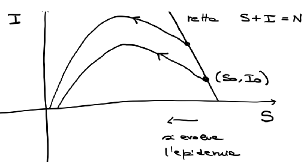
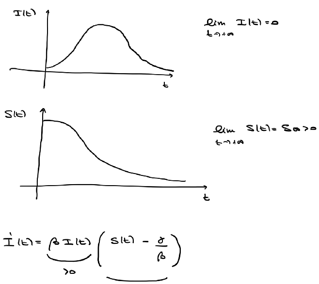
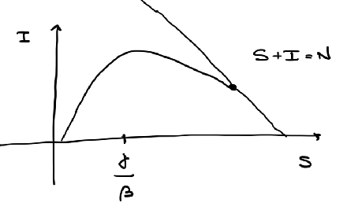

# EDO lineari del primo ordine

## Principio di linearizzazione

Sia $f : A \subseteq \mathbb{R}^2 \to \mathbb{R}$, $A$ aperto, $f \in C^1$.  
Vogliamo approssimare la soluzione del (PC)  
$\begin{cases} y' = f(x, y) \\ y(x_0) = y_0 \end{cases}$  
con la soluzione $z$ del problema linearizzato  
$\begin{cases} z' = \overline{f}(x, z) \\ z(x_0) = y_0 \end{cases}$  
$\overline{f}(x, y) = f(x_0, y_0) + f_x(x_0, y_0) (x - x_0) + f_y(x_0, y_0) (y - y_0)$  
$\overline{f}(x, y) = \alpha y + \beta x + \gamma$  
dove $\alpha = f_y(x_0, y_0)$, $\beta = f_x(x_0, y_0)$ e $\gamma = f(x_0, y_0) - \beta x_0 - \alpha y_0$  
$\begin{cases} z' = \alpha z + \beta x + \gamma \\ z(x_0) = y_0 \end{cases}$  
Osserviamo che $y(x_0) = y_0 = z(x_0)$ e $(*) \ \ y'(x_0) = f(x_0, y_0) = z'(x_0, y_0)$  
$y''(x_0) = f_x(x_0, y_0) + f_y(x_0, y_0) y'(x_0) = \beta + \alpha y'(x_0) = z''(x_0) = \alpha z'(x_0) + \beta$  
Considero i polinomi di Taylor di secondo grado in $x_0$ di $y$ e $z$.  
Da $(*)$ si ha che i due polinomi conicidono  
$y(x) = p_{2, x_0} (x) + \varepsilon(x) (x - x_0)^2 \quad$ dove $\varepsilon(x) \to 0$ per $x \to x_0$  
$z(x) = p_{2, x_0} (x) + \mu(x) (x - x_0)^2 \quad$ dove $\mu(x) \to 0$ per $x \to x_0$  
$\left| y(x) - z(x) \right| = \left| \varepsilon(x) - \mu(x) \right| (x - x_0)^2 = o( \left| x - x_0 \right|^2)$

**Esempio**: $\begin{cases} y' = e^y = f(x, y) \\ y(0) = 0 \end{cases}$  
$y(x) = - \ln(1 - x)$  
$f(x, y) = e^y \quad f(0, 0) = e^0 = 1$  
$\partial_x f (x, y) = 0 \quad \partial_y f(x, y) = e^y \quad \partial_y f(0, 0) = 1$  
$\overline{f}(x, y) = 1 + 0 \cdot (x - 0) + 1 \cdot (y - 0) = 1 + y$  
$\begin{cases} z' = \overline{f}(x, z) = 1 + z \\ z(0) = 0 \end{cases}$  
$z(x) = e^x - 1$

# EDO lineari del primo ordine scalari

Siano $a, b : I \subseteq \mathbb{R} \to \mathbb{R}$, $I$ intervallo aperto, continue.  
L'EDO $(C) \quad y'(x) = a(x) y(x) + b(x)$ si dice **EDO lineare del primo ordine scalare COMPLETA**.  
L'EDO $(O) \quad y'(x) = a(x) y(x)$ si dice **EDO lineare del primo ordine scalare OMOGENEA**.  

**Esempio**: $y'(x) = \cos(x) y(x) + x^3 \quad y'(x) = \cos(x) y(x)$  
$(C) \quad a(x) = \cos(x) \quad b(x) = x^3$  
$(O) \quad a(x) = \cos(x)$  

## Teorema 1

Per ogni $x_0 \in I$ e $y_0 \in \mathbb{R}$, il (PC)  
$\begin{cases} y'(x) = a(x) y(x) + b(x) \\ y(x_0) = y_0 \end{cases}$  
ammette una ed una sola soluzione definita su $I$.  

**Dimostrazione**: $\exists$ e ! $\quad f(x, y) = a(x) y + b(x)$, $f$ è continua e $\dfrac{\partial f}{\partial y} = a(x)$  
Per (sotto)linearità si ha l'esistenza su tutto $I$.  
Definiamo $L : C^1(I) \to C^0(I)$  
$y(x) \mapsto y'(x) - a(x) y(x)$  
$L$ è un operatore lineare, ovvero  
$L(\alpha y_1(x) + \beta y_2(x)) = \alpha L(y_1(x)) + \beta L(y_2(x))$  
Si ha che  
$(C) \quad y'(x) = a(x) y(x) + b(x) \Leftrightarrow L(y) = b \Leftrightarrow y \in L^{-1}(\{b\}) \Leftrightarrow y \in ker \, L$

## Teorema 2

L'insieme $S_b$ delle soluzioni della completa è costituito da tutto e sole le funzioni del tipo $y(x) = \overline(y) + z(x)$, dove $\overline{y}(\cdot)$ è una soluzione particolare della completa e $z(\cdot)$ è una generica soluzione dell'omogenea $(O)$, cioè $S_b = \overline{y} + ker \, L$.  

## Teorema 3

L'insieme $S_0 = ker \, L$ è uno spazio vettoriale di dimensione $1$ e risulta $S_0 = ker \, L = \{ c \cdot e^{A(\cdot)} : c \in \mathbb{R} \}$, dove $A(\cdot)$ è una primitiva (qualsiasi) di $a(\cdot)$ in $I$.  

**Dimostrazione**: Se $z(x) = c e?{A(x)}$ allora  
$z'(x) = c A'(x) e^{A(x)} = c a(x) e^{A(x)} = a(x) z(x)$  
Se $z$ è una soluzione allora  
$0 = z'(x) - a(x) z(x) = 0$, moltiplico pe r$e^{-A(x)}$  
$0 = z'(x) e^{-A(x)} - a(x) e^{-A(x)} z(x) = \dfrac{d}{dx} \left( z(x) e^{-A(x)} \right)$  
Dunque $z(x) e^{-A(x)} = c \Rightarrow z(x) = c e^{A(x)}$, con $c \in \mathbb{R}$.

## Teorema 4

Una soluzione particolare di $(C)$ è $\quad \overline{y}(x) = \displaystyle\int_{x_0}^x e^{A(x) - A(t)} b(t) dt$ in $I$ con $x_0 \in I$ fissato.  

**Dimostrazione**: Cerco soluzioni del tipo $\overline{y}(x) = c(x) e^{A(x)}$, con $x \in I$ (metodo di variazione della costante).  
$\overline{y}'(x) = c'(x) e^{A(x)} + c(x) a(x) e^{A(x)}$  
Impongo che sia uguale a $a(x) \overline{y}(x) + b(x) = a(x) c(x) e^{A(x)} + b(x)$  
Semplificando si ha che $c'(x) e^{A(x)} = b(x) \Rightarrow c'(x) = b(x) e^{-A(x)}$  
$c(x) = \displaystyle\int_{x_0}^x b(t) e^{-A(t)} dt$  
$\overline{y}(x) = c(x) e^{A(x)} = \left[ \displaystyle\int_{x_0}^x b(t) e^{-A(t)} dt \right] e^{A(x)} = \displaystyle\int_{x_0}^x b(t) e^{A(x) - A(t)} dt$  

### Corollario

La generica soluzione di $(C)$ è  
$y(x) = c e^{A(x)} + \displaystyle\int_{x_0}^x e^{A(x) - A(t)} b(t) dt$, con $x_0 \in I$ fissato e $c \in \mathbb{R}$.  
Se consideriamo  
$\begin{cases} y'(x) = a(x) y(x) + b(x) \\ y(x_0) = y_0 \end{cases}$  
la costante $c = y_0 e^{-A(x_0)}$.

# Esercizi EDO lineari

**Esercizio**: Trovare la soluzione del seguente problema di Cauchy  
$\begin{cases} y'(x) = -2x y(x) + x^3 \\ y(0) = 1 \end{cases}$  
$a(x) = -2x \quad b(x) = x^3 \qquad I = \mathbb{R}$  
Una primitiva $A(x)$ di $a(x)$ è $A(x) = -x^2$  
Dunque la soluzione della completa ha forma  
$y(x) = c e^{-x^2} + \displaystyle\int_{0}^x e^{-x^2 + t^2} t^3 dt \quad y(0) = 1$  
$y(0) = c \cdot e^0 = 1 \Rightarrow c = 1$  
$y(x) = e^{-x^2} + \displaystyle\int_{0}^x e^{-x^2 + t^2} t^3 dt = e^{-x^2} \left[ 1 + \displaystyle\int_{0}^x e^{t^2} t^3 dt \right] \boxed{=}$  
Per costituzione $u = t^2 \Rightarrow du = 2t \, dt \Rightarrow u \, du = t^2 \, du = 2 t^3 \, dt$  
$\boxed{=} e^{-x^2} \left[ 1 + \dfrac{1}{2} \displaystyle\int_{0}^{x^2} e^u du \right] = e^{-x^2} \left[ 1 + \dfrac{1}{2} \left[ e^u \left(u - 1 \right) \right]_{0}^{x^2} \right] = e^{-x^2} \left[ \dfrac{3}{2} + e^{x^2} \left( x^2 - 1 \right) \right]$  

**Esercizio**: $y'(x) = - \dfrac{y(x)}{x} + 4x \quad a(x) = - \dfrac{1}{x} \quad b(x) = 4x \quad I = \{ x \in \mathbb{R} : x > 0 \}$  
$A(x) = - \ln(x) \quad y(x) = c e^{- \ln(x)} + e^{- \ln(x)} \displaystyle\int_{1}^{x} e^{\ln(t)} 4t dt =$  
$= c \dfrac{1}{x} + \dfrac{1}{x} \displaystyle\int_{1}^{x} 4t^2 dt = \dfrac{c}{x} + \dfrac{4}{3} x^2 - \dfrac{4}{3} \dfrac{1}{x} = \dfrac{4}{3} x^2 + \dfrac{k}{x} \quad k \in \mathbb{R}$

# Metodi di datazione

$$
\begin{aligned}
    C_0 & \text{concentrazione di carbonio al tempo} t_0 \\
    C_1 & \text{concentrazione di carbonio al tempo} t_1 = t_0 + 5730 \text{ anni} \\
    C_2 & \text{concentrazione di carbonio al tempo} t_2 = t_0 + 2(5740) \text{ anni} \\
\end{aligned}
$$

$5730$ anni $=$ tempo di dimezzamento della concentrazione di ${}^{14}C$

$C_{\textcolor{red}{2}} = \dfrac{1}{2} C_1 = \dfrac{1}{2} \dfrac{1}{2} C_0 = \left( \dfrac{1}{2} \right)^{\textcolor{red}{2}} C_0$  
$C_{\textcolor{red}{k}} = \left( \dfrac{1}{2} \right)^{\textcolor{red}{k}} C_0$  
$C_{k + 1} - C_k = \dfrac{1}{2} C_k - C_k = - \dfrac{1}{2} C_k$  
$\dfrac{C_{k + 1} - C_k}{t_{k + 1} - t_k} = - \dfrac{1}{2 (5730)} C_k$  
$t_{k + 1} - t_k = 5730$ anni  
Passo al modello continuo  
$C'(t) = - \dfrac{1}{\tau} C(t) \quad (*)$  
Voglio calcolare $\tau$  
La soluzione di $(*)$ è $C(t) = C_0 \exp \left( - \dfrac{1}{\tau} (t - t_0) \right)$  
$C_{t_0} = C_0$  
$\dfrac{C_0}{2} = \dfrac{C (t_0)}{2} = C (t_0 + 5730) =$
$= C_0 \exp \left( - \dfrac{1}{\tau} (t_0 + 5730 - t_0) \right) = C_0 \exp \left( - \dfrac{5730}{\tau} \right)$  
$\Rightarrow \dfrac{1}{2} = \exp \left( - \dfrac{5730}{\tau} \right) \Rightarrow \tau = \dfrac{5730}{\ln(2)}$  

**Esempio**: È stato scoperto un fossile vegetale contenente il $75\%$ della quantità di carbonio ${}^{14}C$ contenuto attualmente nei vegetali. Vogliamo stimare l'età del fossile.  
$C(2024) = 0.75 C(0)$, concetrazione di carbonio nei vegetali  
Voglio trovare il tempo $t_0$ per datare il fossile  
$C(2024) = C(t_0) \exp \left( - \dfrac{2024 - t_0}{\tau} \right) = C(0) \exp \left( - \dfrac{2024 - t_0}{\tau} \right)$  
Impongo che valga  
$C_0 \exp \left( - \dfrac{2024 - t_0}{\tau} \right) = 0.75 C_0$  
$\dfrac{2024 - t_0}{\tau} = \ln(0.75) \Rightarrow t_0 = 2024 + \dfrac{5730}{\ln 2} \ln(0.75)$  
$t_0 = 2024 - 2455 = -431 \Rightarrow$ il fossile ha $431$ anni

# EDO non lineari di Bernoulli

$y'(x) = a(x) y(x) + b(x) y(x)^{\gamma} \quad (B)$  
dove $a(\cdot), b(\cdot) : I \to \mathbb{R}$, continue, $\gamma \in \mathbb{R} \setminus \{0, 1\}$  
Cerchiamo soluzioni $y(\cdot)$ tali che $y(\cdot) > 0$  
Moltiplico $(B)$ per $y(x)^{-\gamma}$  
$y'(x) y(x)^{-\gamma} = a(x) y(x) y(x)^{-\gamma} + b(x) \quad (*)$  
Pongo $z(x) = (1 - \gamma) y'(x) y(x)^{-\gamma}$  
se moltiplico $(*)$ per $(1 - \gamma)$ si ha che  
$(1 - \gamma) y'(x) y(x)^{-\gamma} = (1 - \gamma) a(x) y(x)^{1 - \gamma} + (1 - \gamma) b(x)$, e quindi  
$z'(x) = (1 - \gamma) a(x) z(x) + (1 - \gamma) b(x)$

**Esempio**: Consideriamo il problema di Cauchy  
$\begin{cases} y'(x) = y - xy^4 \quad (B) \\ y(0) = 1 \end{cases} \quad a(x) = 1 \quad b(x) = -x \quad \gamma = 4$  
$y'(x) = f(x, y) \quad f(x, y) = y - xy^4$  
$f$ è continua, $\dfrac{\partial f}{\partial y}$ è continua $\Rightarrow$ $\exists$ e ! locali  
Osservo che la funzione $\overline{y}(x) \equiv 0$ è una soluzione di $(B)$  
Poiché simao sotto ipotesi di $\exists$ e ! locali, si ha che i grafici di $y$ e $\overline{y}$ *non* si possono intersecare e di conseguenza $y(x) > 0$  
$z(x) = y^{1 - 4}(x) = y^{-3}(x) \qquad \boxed{y(x) = \dfrac{1}{\sqrt[3]{z(x)}}}$  
$\begin{cases} z'(x) = 1 (1 - 4) z(x) - x (1 - 4) = -3 z(x) - 3 x \\ z(0) = y^{-3}(0) = 1^{-3} = 1 \end{cases}$  
La soluzione è  
$z(x) = e^{-3x} \left[ 1 + e^{3x} \left(x - \dfrac{1}{3} \right) + \dfrac{1}{3} \right]$  
$y(x) = \dfrac{e^x}{\sqrt[3]{1 + e^{3x} \left(x - \dfrac{1}{3} \right) + \dfrac{1}{3}}}$  
Cerco l'intervallo più ampio in cui  
$1 + e^{3x} \left(x - \dfrac{1}{3} \right) + \dfrac{1}{3}$ è $\neq 0$ e l'intervallo deve contenere $0$.  
Introduco la funzione $\phi(x) = e^{3x} \left(x - \dfrac{1}{3} \right) + \dfrac{4}{3}$  
$\phi(0) = e^0 \left( 0 - \dfrac{1}{3} \right) + \dfrac{4}{3} = 1 > 0$  
$\phi$ è definita su tutto $\mathbb{R}$ e si dimostra che $0$ è un punto di minimo per $\phi$. Dunque $\phi(x) \geq \phi(0) = 1$ e quindi $I = \mathbb{R}$.

# Sistemi di EDO del primo ordine di dimensione $N$

Considero il sistema  
$\begin{cases} Y' = F(x, Y) \\ Y(x_0) = Y_0 \end{cases}$  
con $F : E \subseteq \mathbb{R} \times \mathbb{R}^N \to \mathbb{R}^N$, $(x_0, Y_0) \in E$, $Y_0 = (y_1^0, \ldots, y_N^0) \in \mathbb{R}^N$  
$Y(x) = (y_1(x), \ldots, y_N(x))$  
$F(x, Y) = (f_1(x, y_1, \ldots, y_N), \ldots, f_N(x, y_1, \ldots, y_N))$  
$\begin{cases} Y' = F(x, Y) \\ Y(x_0) = Y_0 \end{cases} \Leftrightarrow \begin{cases} y_1' (x) = f_1(x, y_1, \ldots, y_N) \\ \vdots \\ y_N' (x) = f_N(x, y_1, \ldots, y_N) \\ y_1(x_0) = y_1^0, \ldots, y_N(x_0) = y_N^0 \end{cases}$  
Una soluzione di $Y' = F(x, Y)$ è una funzione $Y : I \subseteq \mathbb{R} \to \mathbb{R}^N$, $I$ intervallo, tale che  

1. $Y$ è derivabile in $I$  
2. $(x, Y(x)) \in E \quad \forall x \in I$  
3. $Y'(x) = F(x, Y(x)) \quad \forall x \in I$  

Una soluzione del PC  
$\begin{cases} Y' = F(x, Y) \\ Y(x_0) = Y_0 \end{cases}$  
con $(x_0, Y_0) \in E$ è una funzione $Y : I \to \mathbb{R}^N$ tale che  

1. $Y(\cdot)$ è una soluzione di $Y' = F(x, Y)$ in $I$
2. $x_0 \in I$  
3. $Y(x_0) = Y_0$

## Teorema (di esistenza e unicità locali)

Se $F : A \subseteq \mathbb{R} \times \mathbb{R}^N \to \mathbb{R}^N$, $A$ aperto, è continua e $(x_0, Y_0) \in A$, allora $\exists h > 0$ e una funzione $Y(\cdot) : \ ]x_0 - h, x_0 + h[ \ \to \mathbb{R}^N$ di classe $C^1$ soluzione del (PC)  
$\begin{cases} Y'(x) = F(x, Y(x)) \\ Y(x_0) = Y_0 \end{cases}$  
Se inoltre, per ogni $i, j = 1, \ldots, N$,  
$\dfrac{\partial f_i}{\partial y_j} : A \to \mathbb{R}$ è continua, allora tale soluzione è unica.

## Teorema (di esistenza globale)

Se $F : A \subseteq I \times \mathbb{R}^N \to \mathbb{R}^N$ è continua, con $I$ intervallo aperto, e $(x_0, Y_0) \in A$, e se per ogni compatto $H \subseteq I$ esistono $\alpha, \beta \in \mathbb{R}$ tali che  
$\left\| F(x, Y) \right\| \leq \alpha \left\| Y \right\| + \beta \quad \forall x \in H$  
allora esiste una soluzione del (PC) definita su tutto $I$.

# Modello epidemilogico: modello SIR

*Propagazione di una malattia infettiva.*  
Si suddivida la popolazione in $3$ classi (disgiunte):  

- $S \quad$ *Suscettibili*: sani che si possono contagiare  
- $I \quad$ *Infetti*: malati che possono trasmettere la malattia  
- $R \quad$ *Rimossi*: individui che non possono più trasmettere la malattia, né ammalarsi, o perché imuinizzati permanentemente o perché deceduti

Dinamica: $\boxed{S} \rightarrow \boxed{I} \rightarrow \boxed{R}$

$S(t) = $ numero di suscettibili al tempo $t$
$I(t) = $ numero di infetti al tempo $t$
$R(t) = $ numero di rimossi al tempo $t$

Indichiamo con $N$ il numero totale di individui nella popolazione e lo pensiamo costante nel tempo. Dunque $N = S(t) + I(t) + R(t)$  

Sappiamo che  

1. Si possono infettare solo i suscettibili  
2. Supponiamo che $c$ sia il numero di contatti di ciascun individuo per unità di tempo, quindi in un tempo $h$ il numero di contatti è $c \cdot h$  
3. Tran tutti i tipi di persone che un suscettibile può incontrare, $\dfrac{I(t)}{N}$ è l a frazione degli infetti
4. Possiamo supporre che non ogni contatto con un infetto causi una nuova infezione, ma solo una frazione $\rho$ causi l'infezione

nuovi infetti $= S(t) - S(t + h) = \left( \dfrac{I(t)}{N} \cdot c \cdot h \cdot \rho \right) \cdot S(t)$  
Dividendo per $h$ si ha  
$\dfrac{S(t) - S(t + h)}{h} = \left( \dfrac{I(t)}{N} \cdot c \cdot \rho \right) \cdot S(t) \quad$ definisco $\beta = \dfrac{c \cdot \rho}{N}$ e ottengo  
$\dfrac{S(t) - S(t + h)}{h} = - \beta \cdot I(t) \cdot S(t)$  
Facendo tendere $h \to 0$ si ha  
$S'(t) = - \beta \cdot I(t) \cdot S(t)$  
Inoltre:

1. Solo gli infetti possono diventare rimossi
2. Supponiamo che $\gamma$ sia la probabilità di diventare rimosso nell'unità di tempo

$R(t + h) - R(t) = \left( \gamma \cdot h \right) \cdot I(t)$  
$R'(t) = \gamma \cdot I(t)$  
Dunque  
$\begin{cases} \begin{aligned}  S'(t) &= - \beta \cdot I(t) \cdot S(t) \quad &(1) \\ R'(t) &= \gamma \cdot I(t) \quad &(2) \end{aligned} \end{cases}$  
Poiché $I(t) = N - S(t) - R(t)$  
$I'(t) = - S'(t) - R'(t) = \beta \cdot I(t) \cdot S(t) - \gamma \cdot I(t) \quad (3)$  
Posso considerare solo $(1)$ e $(3)$  
$\begin{cases} S'(t) = - \beta \cdot I(t) \cdot S(t) \\ I'(t) = \beta \cdot I(t) \cdot S(t) - \gamma \cdot I(t) \end{cases}$  
Posso corredare il sistema con delle condizioni iniziali  
$I(0) = I_0 \quad$ numero degli infetti al tempo $0$, $I_0 > 0$  
$S(0) = S_0 \quad$ numero dei suscettibili al tempo $0$  
Dunque (PC) per un sistema di EDO di dimensione $2$.  
$\begin{cases} S'(t) = - \beta \cdot I(t) \cdot S(t) \\ I'(t) = \beta \cdot I(t) \cdot S(t) - \gamma \cdot I(t) \\ I(0) = I_0 > 0 \\ S(0) = S_0 > 0 \end{cases}$  

**Degressione**: $Y(x) = (S(x), I(x)) \quad t = x$  
$F(x, Y) = (- \beta I S, \beta I S - \gamma I) \quad Y = (S, I)$  
$x_0 = 0 \quad Y_0 = (S_0, I_0)$  
$\begin{cases} Y' = F(x, Y) \\ Y(0) = Y_0 \end{cases}$

Sommando le due equazioni del sistema precedente si ha che  
$S'(t) + I'(t) = - \beta I(t) S(t) + \beta I(t) S(t) - \gamma I(t) = - \gamma I(t)$  
$0 = S'(t) + I'(t) + \gamma I(t) = S'(t) + I'(t) - \dfrac{\gamma}{\beta} \dfrac{S'(t)}{S(t)} =$  
$= \dfrac{d}{dt} \left( S(t) + I(t) - \dfrac{\gamma}{\beta} \ln(S(t)) \right)$  
Dunque $S(t) + I(t) - \dfrac{\gamma}{\beta} \ln(S(t)) = c \quad \forall t$  
$I(t) = - S(t) + - \dfrac{\gamma}{\beta} \ln(S(t)) + c$  

{ width=200px }

Suppongo che $R_0 = 0 \Rightarrow N = S(0) + I(0) + R(0) = S_0 + I_0$  
Dovendo valere $0 < S(t) + I(t) \leq N$ si dimostra che  

{ width=320px }

Studio il segno di $S(t) - \dfrac{\gamma}{\beta}$  

- Se $S(t) > \dfrac{\gamma}{\beta}$ allora $I'(t) > 0$ e $I(t)$ è crescente
- Se $S(t) < \dfrac{\gamma}{\beta}$ allora $I'(t) < 0$ e $I(t)$ è decrescente

{ width=200px }

- Se $S(0) \leq \dfrac{\gamma}{\beta}$ allora, poiché $S$ è decrescente, si ha che $S(t) \leq \dfrac{\gamma}{\beta} \quad \forall t$ e dunque $I'(t) < 0$ e quindi l'infezione non si propaga
- Se $S(0) \geq \dfrac{\gamma}{\beta}$ allora si propaga l'epidemia

# Matrice esponenziale

Sia dato il sistema omogeneo lineare a coefficienti costanti  
$X' = A X \quad (*)$  
dove $A$ è una matrice quadrata reale di dimensione $n \times n$.  
Se $n = 1$ allora il sistema si riduce a $x' (t) = a x(t)$, con $a \in \mathbb{R}$,  
le cui soluzioni sono $x(t) = c e^{a t}$.  

**Obiettivo**: vogliamo generalizzare l'esponenziale al caso di matrici $n \times n$.  

Introduciamo una norma, $A$ matrice reale $n \times n$  
$\left\| A \right\| = \sqrt{\displaystyle\sum_{i, j = 1}^{n} a_{ij}^2} \qquad \mathbb{R}^{n \times n} \cong \mathbb{R}^{n^2}$  
$(\mathbb{R}^{n \times n}, \left\| \cdot \right\|)$ è uno spazio vettoriale normato

## Lemma

Sia $A \in \mathbb{R}^{n \times n}$, la serie seguente è **convergente**  
$\displaystyle\sum_{k = 0}^{+ \infty} \dfrac{1}{k!} A^k = I + A + \dfrac{1}{2} A^2 + \dfrac{1}{6} A^3 + \ldots$

## Definizione di matrice esponenziale

Sia $A \in \mathbb{R}^{n \times n}$. Si chiama **matrice esponenziale** di $A$ la matrice  
$e^{A} = \displaystyle\sum_{k = 0}^{+ \infty} \dfrac{1}{k!} A^k$  

## Teorema

La soluzione generale del sistema $(*)$ è data da  
$X(t) = e^{t A} c \qquad (n \times 1) = (n \times n) \cdot (n \times 1)$  
dove $c \in \mathbb{R}^n$ è un generico vettore costante.

# EDO del secondo ordine scalari

Sia $f : E \subseteq \mathbb{R}^3 \to \mathbb{R}$. L'EDO  
$y''(x) = f(x, y(x), y'(x))$  
si dice **EDO del secondo ordine scalare**.

Una funzione $y(\cdot) : I \subseteq \mathbb{R} \to \mathbb{R}$, $I$ intervallo, si dice soluzione di $y'' = f(x, y, y')$ se  

1. $y(\cdot)$ è due volte derivabile in $I$  
2. $(x, y(x), y'(x)) \in E \quad \forall x \in I$  
3. $y''(x) = f(x, y(x), y'(x)) \quad \forall x \in I$

Siano $f : E \subseteq \mathbb{R}^3 \to \mathbb{R}$, e $(x_0, y_0, v_0) \in E$, il problema  
$(PC) \quad \begin{cases} y'' = f(x, y, y') \\ y(0) = y_0 \\ y'(0) = v_0 \end{cases}$  
si dice **problema di Cauchy**.

Una funzione $y(\cdot) : I \subseteq \mathbb{R} \to \mathbb{R}$, $I$ intervallo, si dice soluzione del $(PC)$ se  

1. $y(\cdot)$ è una soluzione di $y'' = f(x, y, y')$  
2. $x_0 \in I$
3. $y(x_0) = y_0$ e $y'(x_0) = v_0$

## Esempio: l'equazione del pendolo

$l$ lunghezza del pendolo, $\vartheta$ angolo rispetto alla verticale, $g$ accelerazione di gravità, $m$ massa del pendolo  

$\vartheta(t_0) = \vartheta_0 \quad \vartheta'(t_0) = v_0$  

$\begin{cases} \vartheta'' = - \dfrac{g}{l} \sin(\vartheta(t)) \\ \vartheta(t_0) = \vartheta_0 \\ \vartheta'(t_0) = v_0 \end{cases}$

## Teorema di esistenza e unicità locali (Peano-CL)

Se $f : A \subseteq \mathbb{R}^3 \to \mathbb{R}$, $A$ aperto, è continua e $(x_0, y_0, v_0) \in A$, allora $\exists h > 0$ e una funzione $y(\cdot) : \ ]x_0 - h, x_0 + h[ \ \to \mathbb{R}$ di classe $C^2$ soluzione del $(PC)$  
$\begin{cases} y'' = f(x, y, y') \\ y(x_0) = y_0 \\ y'(x_0) = v_0 \end{cases}$  
Se inoltre $\dfrac{\partial f}{\partial y}$ e $\dfrac{\partial f}{\partial v}$ sono continue, allora tale soluzione è unica.

## Teorema di esistenza globale

Se $f : I \times \mathbb{R}^2 \to \mathbb{R}$ è continua, con $I$ intervallo aperto, e $x_0 \in I$, $(y_0, v_0) \in \mathbb{R}^2$, e per ogni compatto $H \subseteq I$ esistono $\alpha, \beta, \gamma \in \mathbb{R}$ tali che  
$\left| f(x, y, v) \right| \leq \alpha \left| y \right| + \beta \left| v \right| + \gamma \quad$ in $H \times \mathbb{R}^2$  
allora il $(PC)$ ha una soluzione $y(\cdot)$ definita su tutto $I$.

## Equazione di Newton (autonoma e conservativa)

Sia $f : J \subseteq \mathbb{R} \to \mathbb{R}$, $J$ è un intervallo aperto, di classe $C^1$. L'EDO $y'' = f(y)$ si dice **equazione di Newton**.  
**autonoma**: $f£ *non* dipende da $x$  
**conservativa**: $f$ *non* dipende da $y'$  

**Osservazione**: $f \in C^1$ è continua, $\dfrac{\partial f}{\partial y}$ è continua, $\dfrac{\partial f}{\partial v} = 0$ $\Rightarrow$ $\exists$ e ! locali

### Metodo risolutivo basato sulla conservazione dell'energia

$y'' (t) = f(y) \Rightarrow y''(t) \cdot y'(t) = f(y) \cdot y'(t)$  
$\left( \left[ y'(t) \right]^2 \right)' = 2 y'(t) y''(t)$  
$\dfrac{1}{2} \left( \left[ y'(t) \right]^2 \right)' = \Big( F(y(t)) \Big)' \quad (**)$  
dove $F$ è una primitiva di $f$.  
Integriamo $(**)$ tra $t_0$ e $t$  
$\displaystyle\int_{t_0}^{t} \dfrac{1}{2} \left( \left[ y'(s) \right]^2 \right)' ds = \displaystyle\int_{t_0}^{t} \Big( F(y(s)) \Big)' ds$  
$\dfrac{1}{2} \left( y'(t) \right)^2 - \dfrac{1}{2} \left( y'(t_0) \right)^2 = F(y(t)) - F(y(t_0))$  
$\dfrac{1}{2} \left( y'(t) \right)^2 - F(y(t)) = \dfrac{1}{2} v_0^2 - F(y_0) \quad \forall t$  
$y'(t_0) = v_0 \quad y(t_0) = y_0$  
$\left[ y'(t) \right]^2 = 2 F(y(t)) - 2 F(y_0) + v_0^2$  
Si possono distinguere 3 casi:  

1. $y'(x_0) = v_0 > 0 \quad$ Poiché $y'$ è continua, $y'(x)$ rimane positivo in un intorno di $x_0$. Dunque $y'(x) = \sqrt{2 F(y(x)) - 2 F(y_0) + v_0^2}$ in un intorno di $x_0$.
2. $y'(x_0) = v_0 < 0 \quad \ldots \quad y'(x) = - \sqrt{2 F(y(x)) - 2 F(y_0) + v_0^2}$
3. Se $v_0 = 0$, distinguiamo 3 sottocasi:
   1. Se $F(y_0) > 0$, allora $y''(x_0) = f(y(x_0)) = f(y_0) > 0$, dunque per continuità si ha che $y''(x)$ rimane positivo in un intorno di $x_0$. Dunque $y'(x)$ è crescente in un intorno di $x_0$. Inoltre $y'(x_0) = v_0 = 0$, dunque $y'$ è positiva a destra di $x_0$ e negativa a sinistra di $x_0$. $y'(x) = sgn(x - x_0) \sqrt{2 F(y(x)) - 2 F(y_0) + v_0^2}$
   2. Se $f(y_0) < 0 \quad \ldots \quad y'(x) = - sgn(x - x_0) \sqrt{2 F(y(x)) - 2 F(y_0) + v_0^2}$
   3. Se $f(y_0) = 0 \quad y(x) \equiv y_0$

**Esempio**: $\begin{cases} y'' (x) = 3 y^2 (x) \\ y(0) = \sqrt[3]{\frac{1}{2}} \\ y'(0) = 1 \end{cases}$  
$y''(x) \cdot y'(x) = 3 y^2 (x) \cdot y'(x)$  
$\dfrac{1}{2} \left( y'(x) \right)^2 - \dfrac{1}{2} = y^3 (x) - \dfrac{1}{2} \Rightarrow \left( y'(x) \right)^2 = 2 y^3 (x)$  
$y'(0) = 1 \Rightarrow y'(x) = \sqrt{2 y^3 (x)}$

## EDO lineari del secondo ordine scalari

Siano $a, b \in \mathbb{R}$, e $c(\cdot) : I \subseteq \mathbb{R} \to \mathbb{R}$, $I$ intervallo aperto. L'EDO  
$y'' + a y' + b y = c(x) \quad (c)$
si dice **EDO lineare del secondo ordine scalare con coefficienti costanti completa**.  
L'EDO  
$y'' + a y' + b y = 0 \quad (o)$  
si dice **EDO lineare del secondo ordine scalare con coefficienti costanti omogenea**.

**Applicazione: vibrazioni meccaniche**  
$m x'' = - c x' - k x + f(t) \quad k$ costante elastica della molla, $c > 0$ coefficiente di attrito

## Teorema 1 (esisenza e unicità globali)

Per ogni $x_0 \in I$, $y_0, v_0 \in \mathbb{R}$, il problema di Cauchy  
$\begin{cases} y'' + a y' + b y = c(x) \\ y(x_0) = y_0 \\ y'(x_0) = v_0 \end{cases}$  
ammette una ed una sola soluzione definita su tutto $I$.

**Dimostrazione**: $y'' = c(x) - a y' - b y$  
$f(x, y, v) = c(x) - a v - b y \quad f$ è continua, $\dfrac{\partial f}{\partial y} = - b$, $\dfrac{\partial f}{\partial v} = - a$ sono continue  
$\Rightarrow$ $\exists$ e ! locali  
Considero quindi un insieme compatto $H \subset I$  
$\left| f(x, y, v) \right| \leq \underbrace{\left| a \right|}_{\alpha} \left| v \right| + \underbrace{\left| b \right|}_{\beta} \left| y \right| + \underbrace{\displaystyle\max_{x \in H} \left| c(x) \right|}_{\gamma} \Rightarrow$ esistenza globale

**Definizione**: Definiamo l'applicazione  
$L : C^2(I) \to C^0(I)$  
$y(\cdot) \mapsto y'' + a y' + b y$  
$L$ è un applicazione lineare.  
Definiamo:  
$S_c = L^{-1} \left( \{ c \} \right) = \{ y (\cdot) \in C^2 : y'' + a y' + b y = c (\cdot) \}$  
$S_0 = L^{-1} \left( \{ 0 \} \right) = \{ y (\cdot) \in C^2 : y'' + a y' + b y = 0 \}$

## Teorema 2

$S_c$ è costituito da tutte e sole le funzioni $y(\cdot)$ del tipo  
$y(\cdot) = z(\cdot) + \overline{y}(\cdot)$  
con $z(\cdot)$ una generica soluzione di $(o)$ e $\overline{y}(\cdot)$ una soluzione particolare di $(c)$.  
$S_c = S_0 + \overline{y}$

## Teorema 3 (descrizione di $S_0$)  

$S_0$ è uno spazio vettoriale di dimensione 2.  

**Dimostrazione**: Consideriamo $z_1, z_2 \in S_0$ definite come segue  
$\begin{cases} z_1''(\cdot) + a z_1'(\cdot) + b z_1(\cdot) = 0 \\ z_1(x_0) = 1 \\ z_1'(x_0) = 0 \end{cases} \quad \begin{cases} z_2''(\cdot) + a z_2'(\cdot) + b z_2(\cdot) = 0 \\ z_2(x_0) = 0 \\ z_2'(x_0) = 1 \end{cases}$  
$z_1, z_2$ sono funzioni linearmente indipendenti.  
*Tesi*: Se $c_1, c_2 \in \mathbb{R}$, e sono tali che  
$c_1 z_1 (x) + c_2 z_2 (x) = 0 \quad \forall x \in \mathbb{R} \quad (*)$  
$\Rightarrow$ $c_1 = c_2 = 0$  
Osservo che scegliendo $x = 0$  
$c_1 z_1 (0) + c_2 z_2 (0) = 0 \Rightarrow c_1 z_1 (0) = 0 \Rightarrow c_1 = 0$  
Derivo $(*)$ e trovo  
$c_1 z_1' (x) + c_2 z_2' (x) = 0 \quad \forall x \in \mathbb{R}$  
$c_2 z_2' (x) = 0 \quad$ in $x = 0 \quad c_2 \cdot 1 = 0 \Rightarrow c_2 = 0$  

Considero $z(\cdot) \in S_0$ e voglio trovare $\alpha, \beta \in \mathbb{R}$ tali che $z(\cdot) = \alpha z_1 (\cdot) + \beta z_2 (\cdot)$.  
La generica $z(\cdot)$ soddisfa il seguente (PC)  
$\begin{cases} z''(\cdot) + a z'(\cdot) + b z(\cdot) = 0 \\ z(0) = z_0 \\ z'(0) = v_0 \end{cases}$  
Scegliendo $\alpha = z_0$ e $\beta = v_0$, segue la tesi.

## Costruiamo una base per $S_0$

Consideriamo delle funzioni di tipo $z (\cdot) = e^{\lambda x} \quad \lambda \in \mathbb{C}$  
Imponiamo che $z (\cdot)$ sia soluzione dell'omogenea  
$0 = z'' + a z' + b z = \lambda^2 e^{\lambda x} + a \lambda e^{\lambda x} + b e^{\lambda x} = ( \lambda^2 + a \lambda + b ) e^{\lambda x} \quad \forall x \in \mathbb{R}$  
$\Leftrightarrow \boxed{\lambda^2 + a \lambda + b = 0} \quad (k)$ che è **l'equazione caratteristica dell'omogenea**.  

**Osservazione**: Se $\lambda \in \mathbb{C} \quad \lambda = \alpha + i \beta \quad e^{\lambda x} = e^{\alpha x} \left( \cos(\beta x) + i \sin(\beta x) \right)$

## Teorema 4 (base di $S_0$)

Si ha che  

1. se $\Delta = a^2 - 4 b > 0$, dette $\lambda_1, \lambda_2 \in \mathbb{R}$ con $\lambda_1 \neq \lambda_2$ le radici di $(k)$, allora $\{ e^{\lambda_1 x}, e^{\lambda_2 x} \}$ è una base di $S_0$.
2. se $\Delta = a^2 - 4 b < 0$, dette $\lambda_1 = \alpha + i \beta, \lambda_2 = \alpha - i \beta$, con $\alpha, \beta \in \mathbb{R}$, $\beta \neq 0$, le radici di $(k)$, allora $\{ e^{\alpha x} \cos(\beta x), e^{\alpha x} \sin(\beta x) \}$ è una base di $S_0$.
3. se $\Delta = a^2 - 4 b = 0$, detta $\lambda_0 = - \dfrac{a}{2} \in \mathbb{R}$ la radice (doppia) di $(k)$, allora $\{ e^{\lambda_0 x}, x e^{\lambda_0 x} \}$ è una base di $S_0$.

**Esempio**: $y'' - 10 y = 0 \quad a = 0, b = -10$  
Dunque l'equazione caratteristica è $\lambda^2 - 10 = 0 \quad \lambda_1 = \sqrt{10}, \lambda_2 = - \sqrt{10}$  
La base è formata da $e^{\lambda_1 x}, e^{\lambda_2 x} \quad y(x) = c_1 e^{\sqrt{10} x} + c_2 e^{- \sqrt{10} x}$  
Impongo che $y(0) = 0 \Rightarrow c_1 + c_2 = 0$  
Derivando $y'(x) = c_1 \sqrt{10} e^{\sqrt{10} x} - c_2 \sqrt{10} e^{- \sqrt{10} x}$  
Impongo che $y'(0) = 1 \Rightarrow c_1 \sqrt{10} - c_2 \sqrt{10} = 1$  
$\begin{cases} c_1 + c_2 = 0 \\ c_1 \sqrt{10} - c_2 \sqrt{10} = 1 \end{cases} \Rightarrow c_1 = \dfrac{1}{2 \sqrt{10}}, \ c_2 = - \dfrac{1}{2 \sqrt{10}}$

**Esempio**: Si consideri la soluzione di  
$\begin{cases} y'' + 2 y' + 2 y = 0 \\ y(0) = 1 \\ y'(0) = 1 \end{cases}$  
Equazione caratteristica: $\lambda_{1, 2} = \dfrac{-2 \pm \sqrt{4 - 8}}{2} = \begin{cases} -1 + i \\ -1 - i \end{cases}$  
$\alpha = -1, \beta = 1$  
La base è data da $\{ e^{-x} \cos(x), e^{-x} \sin(x) \}$  
$y(x) = c_1 e^{-x} \cos(x) + c_2 e^{-x} \sin(x)$  
Imponendo le condizioni iniziali si trova che $c_1 = 1, c_2 = 1$.

**Esempio**: Si trovi la soluzione del (PC)  
$\begin{cases} y'' + \dfrac{2}{3} y' + \dfrac{1}{9} y = 0 \\ y(0) = 0 \\ y'(0) = 1 \end{cases}$  
$\lambda^2 + \dfrac{2}{3} \lambda + \dfrac{1}{9} = 0 \quad \left( \lambda + \dfrac{1}{3} \right)^2 = 0 \Rightarrow \lambda_0 = - \dfrac{1}{3}$  
$\{ x e^{- \frac{1}{3} x}, e^{- \frac{1}{3} x} \}$ base di $S_0$  
$y(x) = c_1 e^{- \frac{1}{3} x} + c_2 x e^{- \frac{1}{3} x}$  
Imponendo le condizioni iniziali si trova che $c_1 = 0, c_2 = 1$.

**Osservazione**: Se ho, con $a, b \in \mathbb{R}$,  
$y'' + a y' + b y = 0 \quad (o)$  
$y'' + a y' + b y = c(x) \quad (c)$  
$y$ soluzione generale della completa  
$\boxed{y = z + \overline{y}}$  
dove $z$ è una soluzione omogenea e $\overline{y}$ è una particolare soluzione completa.  

# Metodo di somiglianza  

Consideriamo $y'' + a y' + b y = c(x) \quad (c)$  
dove $c(x)$ ha la forma  
$c(x) = P(x) e^{\alpha x} \sin (\beta x)$ oppure $c(x) = P(x) e^{\alpha x} \cos (\beta x)$  
dove $P(x)$ è un polinomio di grado $n$.  
Si consideri il numero complesso $\xi = \alpha + i \beta$  
Si presentano 3 casi:

1. $\xi$ *non* è soluzione dell'equazione caratteristica $\lambda^2 + a \lambda + b = 0$. Allora si cercano soluzioni di $(c)$ del tipo $y(x) = e^{\alpha x} \left( Q_1(x) \cos(\beta x) + Q_2(x) \sin(\beta x) \right)$ dove $Q_1$ e $Q_2$ sono polinomi di grado $n$ da determinare sostituendo $y$ in $(c)$.
2. $\xi$ è soluzione dell'equazione caratteristica $\lambda^2 + a \lambda + b = 0$ di molteplicità $1$. Allora si cercano soluzioni di $(c)$ del tipo $y(x) = e^{\alpha x} x \left( Q_1(x) \cos(\beta x) + Q_2(x) \sin(\beta x) \right)$ dove $Q_1$ e $Q_2$ sono polinomi di grado $n$ da determinare sostituendo $y$ in $(c)$.
3. $\xi$ è soluzione dell'equazione caratteristica $\lambda^2 + a \lambda + b = 0$ di molteplicità $2$. Allora si cercano soluzioni di $(c)$ del tipo $y(x) = x^2 Q(x) e^{\alpha x}$ con $Q(x)$ polinomio di grado $n$ da determinare sostituendo $y$ in $(c)$.

**Esempio**: Si determini la soluzione del (PC)  
$\begin{cases} y'' + 4 y = 4 \cos(2 x) \\ y(0) = 0 \\ y'(0) = 0 \end{cases}$  
$c(x) = 4 \cos(2 x) \quad P(x) = 4$ polinomio di grado $0$  
$\alpha = 0, \beta = 2$  
Considero il numero $\xi = \alpha + i \beta = 2 i$  
Studio l'equazione caratteristica $\lambda^2 + 4 = 0 \Rightarrow \lambda_{1, 2} = \pm 2 i \Rightarrow$ caso 2  
Dunque cerco soluzioni nella forma $\overline{y}(x) = x \left( \tilde{a} \cos(2 x) + \tilde{b} \sin(2 x) \right)$  
dove $\tilde{a}, \tilde{b}$ sono numeri reali, ovvero polinomi di grado $0$.  
Imponiamo che $\overline{y}$ sia soluzione di $(c)$  
$\overline{y}'' + a \overline{y}' + b \overline{y} = 4 \cos(2 x)$  
Risolvendo si trova $\tilde{a} = 0, \tilde{b} = 1$  
Dunque $\overline{y}(x) = x \sin(2 x)$  
cerchiamo la soluzione generale dell'omogenea $(o)$  
$\lambda^2 + 4 = 0 \Rightarrow \lambda_{1, 2} = \pm 2 i$  
Dunque le soluzioni di $(o)$ hanno la forma  
$z(x) = c_1 \cos(2 x) + c_2 \sin(2 x) \qquad \beta = 2, \alpha = 0$  
Dunque possimao stabilire che una soluzione $y$ generale di $(c)$  
$y(x) = z(x) + \overline{y}(x) = c_1 \cos(2 x) + c_2 \sin(2 x) + x \sin(2 x)$  
Imponendo le condizioni iniziali $y(0) = 0, y'(0) = 0$ si trova che $c_1 = 0, c_2 = 0$.

**Esempio**: Si determini la soluzione del (PC)  
$\begin{cases} y'' - 10 y = -10 x^2 \\ y(0) = \frac{1}{5} \\ y'(0) = 0 \end{cases}$  
$c(x) = -10 x^2 \quad P(x) = -10 x^2$ polinomio di grado $2$  
$\alpha = 0, \beta = 0 \quad c(x) = P(x) e^{\alpha x} \cos(\beta x) \quad \xi = 0$  
Considero l'equazione caratteristica $\lambda^2 - 10 = 0 \Rightarrow \lambda_{1, 2} = \pm \sqrt{10}$  
Dunque $\xi$ non è soluzione dell'equazione caratteristica (simao nel caso 1).  
$\overline{y}(x) = e^{0 x} \left( Q_1(x) \cos(0 x) + Q_2(x) \sin(0 x) \right)$  
dove $Q_1, Q_2$ sono polinomi di grado $2$  
$\overline{y}(x) = Q_1(x) = \tilde{a} x^2 + \tilde{b} x + \tilde{c}$  
Imponendo che $\overline{y}$ sia soluzione di $(c)$ si trova che $\tilde{a} = 1, \tilde{b} = 0, \tilde{c} = \frac{1}{5}$  
$\overline{y}(x) = x^2 + \frac{1}{5}$  
Si verifica che $\overline{y}$ è soluzione del (PC).

# Teorema (Metodo del nucleo risolvente)  

Sia $\{ z_1 (\cdot), z_2 (\cdot) \}$ una base di $S_0$, allora una soluzione particolare $\overline{y}$ di $(c)$ è del tipo  
$\overline{y} (x) = \displaystyle\int_{x_0}^{x} K(x, t) c(t) dt \quad x_0 \in I$  
con $x_0 \in I$ fissato e per ogni $x, t \in \mathbb{R}$  

$$
K(x, t) = \dfrac{
    \det \begin{pmatrix}
        z_1 (0) & z_2 (0) \\
        z_1 (x - t) & z_2 (x - t)
    \end{pmatrix}
}{
    \det \begin{pmatrix}
        z_1 (0) & z_2 (0) \\
        z_1' (0) & z_2' (0)
    \end{pmatrix}
}
$$

dove $K$ è detta **funzione di Green** o **nucleo risolvente**.

**Osservazione**: $F(x) = \displaystyle\int_{x_0}^{x} G(x, t) dt \quad F'(x)$  
Introduciamo una funzione ausiliaria  
$\phi (y, z) = \displaystyle\int_{x_0}^{y} G(z, t) dt$  
$x \stackrel{\psi}{\longrightarrow} (x, x) \stackrel{\phi}{\longrightarrow}$  
$x \longrightarrow \displaystyle\int_{x_0}^{x} G(x, t) dt$  
$F(x) = \left( \phi \circ \psi \right) (x)$  
$\nabla \phi (y, z) = \left( \partial_y \phi (y, z), \partial_z \phi (y, z) \right) = \left( G(z, y), \displaystyle\int_{x_0}^{y} \dfrac{\partial G}{\partial z} (z, t) dt \right)$  
$J (\psi) = \begin{pmatrix} 1 \\ 1 \end{pmatrix} \quad F'(x) = \nabla \phi (x, x) \cdot J \psi = G(x, x) + \displaystyle\int_{x_0}^{x} \dfrac{\partial G}{\partial x} (x, t) dt$  

**Dimostrazione**: (metodo del nucleo risolvente)  
Consideriamo $z_1, z_2$ tali che  
$\begin{cases} z_1'' + a z_1' + b z_1 = 0 \\ z_1(0) = 1 \\ z_1'(0) = 0 \end{cases} \quad \begin{cases} z_2'' + a z_2' + b z_2 = 0 \\ z_2(0) = 0 \\ z_2'(0) = 1 \end{cases}$  
$K (x, t) = \dfrac{z_1 '' (0) z_2 (x - t) - z_2 (0) z_1 (x - t)}{z_1 (0) z_2' (0) - z_2 (0) z_1' (0)} = z_2 (x - t)$  
$\overline{y} (x) = \displaystyle\int_{x_0}^{x} z_2 (x - t) c(t) dt$  
$\overline{y}' (x) = z_2 (x - x) c(x) + \displaystyle\int_{x_0}^{x} z_2' (x - t) c(t) dt = \displaystyle\int_{x_0}^{x} z_2' (x - t) c(t) dt$  
$\overline{y}'' (x) = z_2' (x - x) c(x) + \displaystyle\int_{x_0}^{x} z_2'' (x - t) c(t) dt = c(x) + \displaystyle\int_{x_0}^{x} z_2'' (x - t) c(t) dt$  
$\overline{y}'' + a \overline{y}' + b \overline{y} = c(x) + \displaystyle\int_{x_0}^{x} z_2'' (x - t) c(t) dt + a \displaystyle\int_{x_0}^{x} z_2' (x - t) c(t) dt + b \displaystyle\int_{x_0}^{x} z_2 (x - t) c(t) dt = c(x) + \displaystyle\int_{x_0}^{x} \left( z_2'' (x - t) + a z_2' (x - t) + b z_2 (x - t) \right) c(t) dt$  
$z_2'' (x - t) + a z_2' (x - t) + b z_2 (x - t) = 0$ in quanto $z_2$ è soluzione dell'omogenea.

**Esempio**: Si trovi la soluzione del (PC)  
$\begin{cases} y'' + y = \dfrac{1}{\sin(x)} \\ y \left( \dfrac{\pi}{2} \right) = 0 \\ y' \left( \dfrac{\pi}{2} \right) = 0 \end{cases}$  
Considerare $z_1, z_2$ soluzioni di  
$\begin{cases} z_1'' + z_1 = 0 \\ z_1 (0) = 1 \\ z_1' (0) = 0 \end{cases} \quad \begin{cases} z_2'' + z_2 = 0 \\ z_2 (0) = 0 \\ z_2' (0) = 1 \end{cases}$  
$z_1 (x) = \cos(x) \quad z_2 (x) = \sin(x)$  
$K (x, t) = \sin(x - t)$  
$\overline{y} (x) = \displaystyle\int_{\frac{\pi}{2}}^{x} \sin(x - t) \dfrac{1}{\sin(t)} dt$