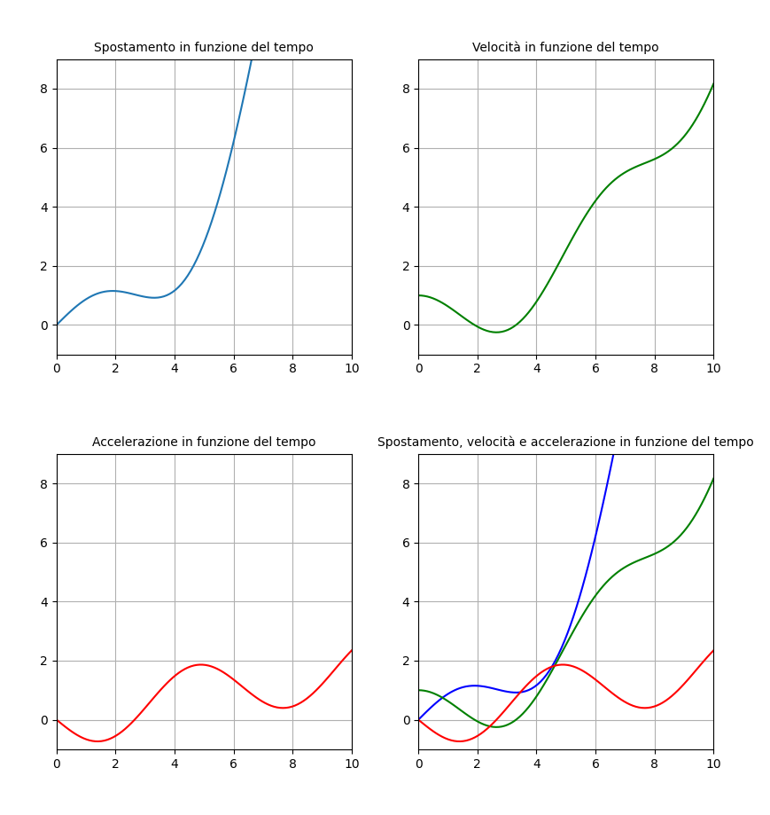

# Metodo scientifico

**Osservazioni**  
$\downarrow$  
**Ipotesi**  
$\downarrow$ (le ipotesi devono essere verificate)  
**Esperimenti** $\Rightarrow$ Altre osservazioni  
$\downarrow$  
**Analisi e conclusioni** $\Rightarrow$ Ipotesi  
$\Downarrow$  
**Leggi e teorie**

> Una teoria scientifica deve essere **"falsificabile"**.  
> \- *Karl Popper*

- Confronto quantitativo tra dati sperimentali e leggi fisiche
- Una diventa più credibile se sopravvive a rigorosi tentativi di confutazione ma non potrà mai essere
“dimostrata” vera.
- Le affermazioni non confutabili sono irrilevanti per la scienza.

# Introduzione

## Grandezze fisiche

**Grandezza fisica**: Caratteristica di un corpo o di un fenomeno naturale a cui si può associare uno o più numeri.

**Grandezze fondamentali**:

Sono 7, a noi bastano queste 3 per la meccanica:

- tempo
- lunghezza
- massa

**Definizione operativa**: definita solo dalle operazioni necessarie per misurarla.  

**Unità**: Le grandezze fisiche si esprimono in termini di campione, chiamato unità.

|         | Tempo   | Massa      | Lunghezza |
| ------- | :-----: | :--------: | :-------: |
| Unità   | secondo | chilogrammo | metro     |
| Simbolo | s       | kg         | m         |

**Tempo**: Dal 1967, 9.192.631.77o volte il periodo di oscillazione di una risonanza dell'atomo di Cesio ($^{133}Cs$)

**Lunghezza**: $\dfrac{1}{299.792.458}$ della distanza percorsa della luce in $1s$ nel vuoto.

**Massa**: Costante di Planck $h = 6.62607015 \cdot 10^{-34} \ kg \ m^2 \ s^{-1}$

## Misura diretta e indiretta

**Misura diretta**: confronto con campione.  

*Esempio*: $c$ campione e $L$ lunghezza da misurare. $\dfrac{L}{c} = 0,5 \quad L = 0,5 \cdot c = 0.5 \ m$

**Misura indiretta**: relazione matematica.  

*Esempio*: Densità di un cilindro.  

1) massa $M$
2) volume (lunghezza $L$ e diametro $D$)
3) densità $\delta = \dfrac{M}{V} = \dfrac{4M}{\pi D^2 L}$

**Unità derivata**: combinazione di unità fondamentali.

*Esempio*: Densità, con unità di misura $\dfrac{kg}{m^3}$

## Cifre significative e incertezza

In realtà, tutte le misure hanno un livello di incertezza.  
$L = 1,82 \pm 0,02 \ m$  
$m = \underbrace{3,5}_{misura} \pm \underbrace{0,1 \ kg}_{incertezza}$  
Cifre significative $\rightarrow$ indicare il livello di precisione.  

(In questo corso)  
$L = 1,82 \ m \rightarrow 1,82 \pm 0,01 \ m$  
$m = 3,5 \ kg \rightarrow 3,5 \pm 0,1 \ kg$  

## Operazioni con le cifre significative

- prodotto/divisione: tenere il numero **più basso di cifre significative**.
- addizione/sottrazione: tenere il numero **più basso di decimali**.

*Esempio*: $(1,1 \ m) \times (3,45 \ m) = 3,795 \ m^2 \rightarrow 3,8 \ m^2$  
*Esempio*: $1,1 \ m - 12 \ cm = 1,1 \ m - 0,12 \ m = 0,98 \ m \rightarrow 1,0 \ m$

## Ordini di grandezza

Scopo: calcolo veloce per una stima.  

**Ordini di grandezza**: ritenere la potenza di $10$ più vicina.

**Notazione scientifica**: $6.317.000 \ km \rightarrow 6.317 \times 10^6 \ km$ (il $6$ è l'ordine di grandezza).

*Esempio*: un ingegnere deve fabbricare un nuovo pacemaker, quanti battiti di cuore deve fare senza malfunzionamenti?  
$1 \dfrac{\text{battiti}}{s} \times anni \times \pi \times 10^7 \dfrac{s}{\text{anno}}$  
Soluzione: circa $3 \times 10^9$  
($\pi \times 10^7$ sono circa i secondi in un anno)

*Esercizio per lo studente*: Quanti capelli ci sono su una testa?

## Analisi dimensionale

Regole:  

1. Somma e sottrazione di grandezze fisiche omogenee tra loro.
2. Argomento di funzioni trascendenti adimensionale.

Utilità:

1. Verifica dimensionale  
    $\Delta x = \dfrac{1}{2} a \Delta t^2 + v \Delta t$
    $\left[ \Delta x \right] = m \quad \left[ a \right] = \dfrac{m}{s^2}$  
    $\left[ \Delta x \right] = \left[ \dfrac{1}{2} \right] \left[ a \right] \left[ \Delta t \right]^2 + \left[ v \right] \left[ \Delta t \right]$  
    $L = 1 \cdot LT^{-2} T^2 + LT^{-1} T$

2. Dipendenza funzionale  
    $\left[ R \right] = L$  
    $\left[ v \right] = \frac{L}{T}$  
    $\left[ m \right] = M$  
    $\left[ a \right] = \frac{L}{T^2}$  
    $\left[ \frac{v^2}{R} \right] = \frac{L}{T^2}$

## Fonti di incertezza

1. **Risoluzione strumentale**: la più piccola variazione che uno strumento può rilevare.
2. **Incertezze statistiche** (o errori casuali): dovute a variabilità di un fenomeno.
3. **Errori sistematici**: dovuti a difetti di taratura o di costruzione.

**Precisione**: vicinanza dei valori misurati tra loro.  
**Accuratezza**: vicinanza del valore misurato al valore vero.  

I primi due punti sono legati alla precisione, il terzo all'accuratezza.

## Incertezze statistiche

{ width=250px }

**Media**: $\langle{x} \rangle = \dfrac{1}{N} (x_1 + x_2 + \ldots + x_N)$

**Varianza**: $var \, x = \langle{(x - \langle{x} \rangle)^2} \rangle$

**Scarto quadratico medio**: $\sigma = \sqrt{var \, x}$

**Incertezza**: $\Delta x = \dfrac{\sigma}{\sqrt{N}}$

## Propagazione delle incertezze

$f(x)$ con $x$ la misura e $f(x)$ la grandezza derivata

$\Delta f = \left| \dfrac{df}{dx} \right| \Delta x$

$f(x, y)$  

$\Delta f = \sqrt{\left( \dfrac{\partial f}{\partial x} \right)^2 \Delta x^2 + \left( \dfrac{\partial f}{\partial y} \right)^2 \Delta y^2}$

oppure

$\Delta f = \left| \dfrac{\partial f}{\partial x} \right| \Delta x + \left| \dfrac{\partial f}{\partial y} \right| \Delta y$

**Esempio**: superficie di un quadrato $A = L^2$  
$L = 3,0 \pm 0,2 \ cm$  
$A = [9,000 \pm ?] \ cm^2$

$f(x) = f(x_0) + \frac{df}{dx} (x - x_0)$

$A(L) = L^2$  
$A(L + \Delta L) \simeq A(L) + \frac{dA}{dL} \Delta L$  
$A(L - \Delta L) \simeq A(L) - \frac{dA}{dL} \Delta L$  

$2 \Delta A = 2 \frac{dA}{dL} \Delta L$  
$\Delta A = \frac{dA}{dL} \Delta L$  
$\Delta A = 2L \Delta L$  

$A = 9 \pm 1 \ cm^2$

**Esempio**: $f = ax + by \quad \Delta f = \sqrt{a^2 \Delta x^2 + b^2 \Delta y^2}$

**Esempio**: $f = x^m y^n \quad \Delta f = \sqrt{(mx^{m-1}y^n \Delta x)^2 + (nx^m y^{n-1} \Delta y)^2} \quad \dfrac{\Delta f}{f} = \sqrt{m^2 \left( \dfrac{\Delta x}{x} \right)^2 + n^2 \left( \dfrac{\Delta y}{y} \right)^2}$

# Scalari e vettori

**Scalare**: una grandezza specificata da un numero e un'unità di misura (es. massa, tempo, energia).

**Vettore**: una grandezza definita da più valori con la stessa unità di misura (es. posizione, velocità, forza). Oppure, una grandezza definita da un valore e una direzione (e un verso).

## Vettori

$\vec{v} = (v_x, v_y, v_z)$

Anche se questa definizione sembra identica alla definizione del punto, sono diversi:  

- un punto non la una lunghezza
- non si può fare la somma di due punti
- $\dots$

## Prodotto con uno scalare

$\vec{v} = (v_x, v_y, v_z)$  
$a \vec{v} = (a v_x, a v_y, a v_z)$

Se $a$ non ha unità: **allungamento** o **compressione** del vettore.

Se $a < 0$: **verso opposto**.  
Se $a > 0$: **verso concorde**.  

## Somma vettoriale

$\vec{v} = (v_x, v_y, v_z) \quad \vec{w} = (w_x, w_y, w_z)$

$\vec{v} + \vec{w} = (v_x + w_x, v_y + w_y, v_z + w_z)$

## Modulo di un vettore

Il modulo di un vettore è la sua lunghezza geometrica. Si può rappresentare in termini delle sue componenti.

$v = \left| \vec{v} \right| = \sqrt{v_x^2 + v_y^2 + v_z^2}$

$\vec{n} = \dfrac{\vec{v}}{\left| \vec{v} \right|}$

## Versori

Il versore di un vettore è il vettore stesso diviso per il suo modulo.

$\left| \vec{n} \right| = \sqrt{\dfrac{v_x^2}{v^2} + \dfrac{v_y^2}{v^2} + \dfrac{v_z^2}{v^2}} = 1$

Definiamo:  

$\hat{i} = (1, 0, 0)$  
$\hat{j} = (0, 1, 0)$  
$\hat{k} = (0, 0, 1)$

{ width=250px }

$\vec{v} = (v_x, v_y, v_z) = v_x \hat{i} + v_y \hat{j} + v_z \hat{k}$

$\left| \hat{i} \right| = \left| \hat{j} \right| = \left| \hat{k} \right| = 1$

## Prodotto scalare

$\vec{u} \cdot \vec{v} = u_x v_x + u_y v_y + u_z v_z$

Il risultato è uno scalare.

**Osservazioni**:  

$\vec{v} \cdot \vec{v} = v_x^2 + v_y^2 + v_z^2 = \left| \vec{v} \right|^2$  
$\left| \vec{v} \right| = \sqrt{\vec{v} \cdot \vec{v}}$ è un altro modo per calcolare il modulo  
$\hat{i} \cdot \hat{i} = \hat{j} \cdot \hat{j} = \hat{k} \cdot \hat{k} = 1$  
$\hat{i} \cdot \hat{j} = \hat{i} \cdot \hat{k} = \hat{j} \cdot \hat{k} = 0$ sono ortogonali (ortonormali)  
$\vec{u} \cdot \hat{i} = u_x \quad \vec{u} \cdot \hat{j} = u_y \quad \vec{u} \cdot \hat{k} = u_z$  
$\vec{u} \cdot \vec{v} = \left| \vec{u} \right| \left| \vec{v} \right| \cos \theta$ dove $\theta$ è l'angolo tra i due vettori

# Cinematica

**Cinematica**: studio del moto (senza considerare le cause che lo producono).  
**Dinamica**: studio della causa del moto.  
**Statica**: studio dell'equilibrio meccanico (la causa dell'immobilità).  

Studiamo il moto di un **punto materiale**, cioè un'approssimazione di un corpo che non ha dimensioni e dove la massa è concentrata in un punto.

## Posizione e spostamento

**Vettore posizione**: $\vec{r} = (x_r, y_r, z_r)$  
$\left| \vec{r} \right|$ non ha molto senso, perché dipende dalla scelta dell'origine.  
**Vettore spostamento**: $\Delta \vec{r} = \vec{r}_2 - \vec{r}_1$  
$\left| \Delta \vec{r} \right|$ è indipendente dalla scelta dell'origine.
$\left| \Delta \vec{r} \right| = \sqrt{(x_2 - x_1)^2 + (y_2 - y_1)^2 + (z_2 - z_1)^2}$  
$\Delta \vec{r} = \Delta x \hat{i} + \Delta y \hat{j} + \Delta z \hat{k}$

{ width=300px }

## Posizione in funzione del tempo

$\vec{v}(t) = x(t) \hat{i} + y(t) \hat{j} + z(t) \hat{k}$

**Esempio**: $x(t) = 2m + 2 \dfrac{m}{s} t \quad y(t) = 0m + 4 \dfrac{m}{s} t$  
$\vec{v}(t) = 2 \hat{i} + 4 \hat{j} \dfrac{m}{s}$

{ width=300px }

{ width=400px }

## Velocità

**Velocità media**: $\langle{v} \rangle = \dfrac{x_2 - x_1}{t_2 - t_1}$

{ width=300px }

**Velocità istantanea**: $v_x = \displaystyle \lim_{\Delta t \to 0} \dfrac{\Delta x}{\Delta t} = \dfrac{dx}{dt}$

$\vec{v} = \dfrac{d}{dt} \vec{r} = \dfrac{dx}{dt} \hat{i} + \dfrac{dy}{dt} \hat{j} + \dfrac{dz}{dt} \hat{k}$

## Accelerazione

$\vec{a} = \dfrac{d \vec{v}}{dt} = \dfrac{d^2 \vec{r}}{dt^2}$

{ width=400px }

**Esempio**: $x(t) = L \cos \omega t \quad v_x(t) = -L \omega \sin \omega t \quad a_x(t) = -L \omega^2 \cos \omega t = -\omega^2 x(t)$

## Moto con accelerazione costante

$\dfrac{dv}{dt} = a \quad dv = a \, dt$

$\displaystyle v = \int dv = \int a \, dt = a t + c$

$v(t) = a t + c \quad c = -a t_0 \quad v(t) = a (t - t_0)$

$\dfrac{dx}{dt} = v = v_0 + a t$

$x(t) = \displaystyle \int dx = \int (v_0 + a t) \, d$

posizione iniziale $= v_0 t + \dfrac{1}{2} a t^2 + c$

$x(t_0) = x_0$

$\boxed{x(t) = x_0 + v_0 t + \dfrac{1}{2} a t^2}$

$v(t) = v_0 + a t$

Proviamo ad eliminare $t$ da queste due equazioni

$t = \dfrac{v - v_0}{a}$

$x = \dfrac{1}{2} a \left( \dfrac{v - v_0}{a} \right)^2 + v_0 \left( \dfrac{v - v_0}{a} \right) + x_0 = \dfrac{1}{2a} (v^2 - 2 v v_0 + v_0^2) + \dfrac{v v_0}{a} - \dfrac{v_0^2}{a} + x_0 = \dfrac{v^2}{2a} - \dfrac{v_0^2}{2a} + x_0$

$x - x_0 = \dfrac{v^2 - v_0^2}{2a}$  

$\boxed{v^2 - v_0^2 = 2a (x - x_0)}$

## Caduta libera

La caduta libera succede con la stessa accelerazione per qualsiasi corpo, indipendentemente dalla massa.

$\vec{a} = -g \hat{j}$

$v_y(t) = -g t + v_{0y}$

$g = 9,81 \dfrac{m}{s^2}$

$\vec{v} = - g t \hat{j} + \vec{v}_0$

$y(t) = y_0 + v_{0y} t - \dfrac{1}{2} g t^2$

$v^2 - v_0^2 = 2 a (x - x_0) \rightarrow 0 - v_0^2 = -2 g (y_m - y_0) \rightarrow \boxed{y_m = y_0 + \dfrac{v_0^2}{2g}}$

{ width=300px }

## Il moto dei proiettili

Importanza storica:  

- Aristotele: moto "naturale" e "forzato", proiettili sono forzati da cosa?
- Filopono: "impeto"
- Galileo: osserva e misura invece di spiegare

$\vec{a} = a_x \hat{i} + a_y \hat{j} + a_z \hat{k} = 0 \hat{i} - g \hat{j} + 0 \hat{k}$

Tolgo la componente $z$ e lavoro in due dimensioni.

$\vec{v}(t) = v_{0x} \hat{i} + (v_{0y} - g t) \hat{j}$

$\vec{r}(t) = x_0 \hat{i} + (y_0 + v_{0y} t - \dfrac{1}{2} g t^2) \hat{j}$

{ width=400px }

Spesso $v_0, \theta$ sono dati invece di $v_{0x}, v_{0y}$.

$v_{0x} = v_0 \cos \theta \quad v_{0y} = v_0 \sin \theta$

**Altezza massima**: $y_m = y_0 + \dfrac{v_{0y}^2}{2g} = y_0 + \dfrac{v_0^2}{2g}\sin^2 \theta$

**Gittata**: distanza orizzontale percorsa da un corpo lanciato in aria (range).

Valori conosciuti: $v_0, \theta$

{ width=320px }

per simmetria: $v_y(t_R) = - v_y(0)$

$v_y(t) = v_{0y} - g t$  
$v_y(t_R) = v_{0y} - g t_R = v_{0y} \rightarrow t_R = \dfrac{2 v_{0y}}{g}$

$R = x(t_R) = v_{0x} t_R$  

$\boxed{R = \dfrac{v_{0x} v_{0y}}{g}}$

$R = \frac{2}{g} v_0^2 \sin \theta \cos \theta$  
$\sin 2 \theta = 2 \sin \theta \cos \theta$

$\boxed{R = \dfrac{v_0^2 \sin 2 \theta}{g}}$

## Moto in due e tre dimensioni

{ width=700px }

$\vec{v}(t)$: sempre parallelo alla tangente della curva  
$\vec{a}(t)$: può essere scomposta tra:

- $\boxed{a_{\parallel}}$ componente parallela a $\vec{v}$ (cambia il modulo di $\vec{v}$
- $\boxed{a_{\perp}}$ componente perpendicolare a $\vec{v}$ (cambia la direzione di $\vec{v}$)

## Moto circolare uniforme

Uniforme, cioè con velocità (modulo) costante.

{ width=400px }

$\vec{a} = \dfrac{v(t + \Delta t) - v(t)}{\Delta t} = \dfrac{\Delta \vec{v}}{\Delta t}$

$\dfrac{\left| \Delta \vec{r} \right|}{R} = \dfrac{\Delta \vec{v}}{v}$

$\dfrac{\Delta \vec{r}}{\Delta t} \dfrac{1}{R} = \dfrac{\Delta \vec{v}}{\Delta t} \dfrac{1}{v}$

$v \dfrac{1}{R} = a \dfrac{1}{v}$

$\boxed{a = \dfrac{v^2}{R}}$

{ width=400px }

$\vec{r} = x(t) \hat{i} + y(t) \hat{j}$

$\theta(t) = \omega t$  
l'angolo aumenta proporzionalmente con il tempo

$\omega$ è la **velocità angolare**, cioè l'angolo per unità di tempo.

$x(t) = R \cos (\omega t) \quad y(t) = R \sin (\omega t)$

$v_x(t) = \dfrac{dx}{dt} = - \omega R \sin (\omega t) \quad v_y(t) = \dfrac{dy}{dt} = \omega R \cos (\omega t)$

$a_x(t) = - \omega^2 R \cos (\omega t) \quad a_y(t) = - \omega^2 R \sin (\omega t)$

$\vec{a} =  a_x \hat{i} + a_y \hat{j} = \omega^2 \vec{r}$

$\boxed{\vec{a} = \omega^2 R}$

$\left| \vec{v} \right| = \omega R$

$\boxed{\omega = \dfrac{v}{R}}$

## Moti relativi

{ width=800px }

## Riassunto

- posizione, velocità, accelerazione sono **vettori**
- $\vec{a} = \dfrac{d \vec{v}}{dt} \quad \vec{v} = \dfrac{d \vec{r}}{dt}$
- caso speciale #1: **moto uniformemente accelerato**  
    $x(t) = x_0 + v_0 t + \frac{1}{2} a t^2$
- caso speciale #2: **proiettili**  
    $x(t) = x_0 + v_{0x} t \quad y(t) = y_0 + v_{0y} t - \frac{1}{2} g t^2$
- caso speciale #3: **moto circolare uniforme**  
    $\left| \vec{a} \right| = \omega^2 R = \frac{v^2}{R} \quad \omega = \frac{2 \pi}{T}$
- **moti relativi**: "P secondo A = P secondo B + B secondo A"tt

# Dinamica

La dinamica è il ramo della fisica che si occupa dello studio delle cause del moto dei corpi. Si basa sulle tre leggi del moto formulate da Sir Isaac Newton nel XVII secolo:

## Le leggi di Newton

### Prima legge di Newton o legge dell'inerzia

Ciascun corpo persevera nel proprio stato di quiete o di moto rettilineo uniforme, eccetto che sia costretto a mutare quello stato da forze impresse.

### Seconda legge di Newton o legge della dinamica

Il cambiamento di moto è proporzionale alla forza motrice impressa, ed avviene lungo la linea retta secondo la quale la forza è stata impressa.

### Terza legge di Newton o principio di azione e reazione

A ogni azione corrisponde una reazione uguale e contraria: ossia, le azioni di due corpi sono sempre eguali fra loro e dirette verso parti opposte.

## Massa e Forza

- **Massa**: La massa è una misura della quantità di materia in un corpo e rappresenta anche una misura della resistenza alle variazioni di velocità (**massa inerziale**). La massa è proporzionale al peso (**carica gravitazionale** o **massa gravitazionale**). La sua unità di misura è il chilogrammo (kg).
- **Forza**: Una forza è una spinta che produce un cambiamento di moto in un corpo. La sua unità di misura è il newton ($1N = \frac{kg \cdot m}{s^2}$). Una forza viene rappresentata come un vettore.

## Spiegazione delle leggi di Newton

Sono i "principi fondamentali della dinamica":

1. Se la forza risultante che agisce su un copo è nulla, allora l'accelerazione di questo corpo è nulla ($\vec{a} = 0$). Definiamo un **sistema di riferimento inerziale**.
2. L'accelerazione di un corpo è proporzionale alla forza risultante su questo corpo $\sum \vec{F} = m \vec{a}$.
3. La forza esercitata da un corpo A su un corpo B è uguale in modulo e direzione e in verso opposto alla forza esercitata da B su A. $\vec{F}_{AB} = -\vec{F}_{BA}$.

## Peso

Il peso di un oggetto è la forza di gravità esercitata su di esso dalla Terra. È diretto verso il centro della Terra e può essere calcolato come $\vec{F}_g = m \vec{g}$, dove $\vec{g}$ è l'accelerazione gravitazionale terrestre ($9.81 m/s^2$). Si può anche chiamare campo gravitazionale alla superficie terrestre.  
Anche se $\vec{F}_g = m \vec{g}$ sembra simile a $\vec{F} = m \vec{a}$, sono molto diverse. La prima è un caso particolare della legge di gravitazione universale.

## Forza normale

La forza normale è un caso particolare di forza di contatto, cioè la spinta esercitata da una superficie. Si dice "normale" perché è perpendicolare alla superficie.  
$\sum \vec{F} = \vec{F}_g + \vec{N} = m \vec{a} = 0 \quad \vec{F}_N = -\vec{F}_g$

## Diagramma di corpo libero

Ogni corpo è rappresentato da un punto. Comporta tutte le forze che sono applicate sul corpo, ma soltanto quelle. Per esempio non includiamo la velocità o la forza applicata dal corpo su un altro corpo.

## Tensione

La tensione è la forza esercitata da una fune. Idealmente consideriamo la fune come inestensibile e senza massa. La tensione $\vec{T}$ è sempre parallela alla fune e $\lvert \vec{T} \rvert$ è uguale lungo tutta la fune.

## Strategie per la risoluzione di problemi

1. **Visualizza**: Crea un'immagine mentale del problema per comprendere meglio la situazione fisica. Questo può includere l'identificazione dei corpi coinvolti e delle forze in gioco. Riformula la domanda nelle tue parole per assicurarti di averla compresa ed in termini che possono essere calcolati.

2. **Descrivi**: Utilizza i diagrammi, in particolare i diagrammi di corpo libero, per rappresentare graficamente le forze che agiscono su ogni corpo. Scegli un sistema di coordinate appropriato e nomina tutte le quantità rilevanti, identificando quelle note e quelle da trovare.

3. **Fai un piano**: Trasferisci i concetti fisici in forma matematica. Scegli se risolvere il problema andando dalla soluzione ai dati noti o viceversa.

4. **Esegui il piano**: Risolvi i sistemi di equazioni, prestando attenzione alle unità di misura e sostituendo i valori numerici quando necessario.

5. **Valuta la soluzione**: Controlla se la soluzione ottenuta ha senso fisico, è ragionevole e risponde in modo completo alla domanda posta. Considera la possibilità di validare il risultato con casi limite.

6. **Cambia piano se necessario**: Se la soluzione non è corretta o non è completa, ripeti i passaggi precedenti per trovare l'errore o la lacuna e correggili. Cambia la strategia o il sistema di coordinate o di riferimento.

## Attrito

La forza normale è perpendicolare alla superficie. Il modulo è tale che il moto è vincolato, permesso solo parallelamente alla superficie.

L'attrito è una forza che si oppone al movimento relativo tra due superfici in contatto. Essa è parallela alla superfici. Il modulo è tale che il moto è vincolato (attrito statico) o proporzionale alla forza normale (attrito dinamico).

### Attrito statico e dinamico

- **Attrito dinamico**: $f_d = \mu_d N$, dove $\mu_d$ (coefficiente di attrito dinamico) è la costante di proporzionalità e non ha unità.
- **Attrito statico**: $f_s \leq \mu_s N$, dove $\mu_s$ (coefficiente di attrito statico) è la costante di proporzionalità e non ha unità. In generale $\mu_s > \mu_d$ e quasi sempre $\mu_s, \mu_d < 1$.

{ width=400px }

### Attrito dovuto a un fluido (resistenza)

1) A velocità "bassa", densità "bassa" $\Rightarrow$ **flusso laminare**

    Legge di Stoke: $\vec{F} = -b \vec{v}$, dove $b$ è il coefficiente

    Commento: equazione utile ma raramente applicabile.

2) **flusso turbolento**

    $F_v = \frac{1}{2} \rho A C_D v^2$

    $\rho$ = densità del fluido  
    $A$ = area di proiezione dell'oggetto  
    $C_D$ coefficiente di resistenza "Drag"  
    $v$ = velocità  

    La direzione della forza è $- \dfrac{\vec{v}}{\lvert \vec{v} \rvert}$

{ width=300px }

## Dinamica del moto circolare

Già visto: $a = \frac{v^2}{R} = \omega^2 R$

Forza necessaria per mantenere il moto circolare?

$F_c = \frac{m v^2}{R}$ orientata verso il centro

$F_c$ è la forza centripeta

descrizione della direzione e verso della forza, non della natura della forza.

## Forza elastica

$F_x = -kx$  
legge di Hooke  
$x$ = estensione della molla

Questo è un modello, in verità $F_x(x)$ è più complicata,  
ma $F_x = -kx$ è una buona approssimazione per piccoli spostamenti.

## Sistemi non-inerziali

{ width=200px }

$\vec{r}_{PA} = \vec{r}_{PB} + \vec{r}_{BA}$  
$\vec{v}_{PA} = \vec{v}_{BA} + (\vec{v}_{PB} + \text{rotazione})$  
$\vec{a}_{PA} = \vec{a}_{BA} + \vec{a}_{PB} + (\text{rotazione})$  

$\vec{F} = m\vec{a}_{PA}$  
$\vec{F} = m\vec{a}_{PB} + m\vec{a}_{BA}$  
$m\vec{a}_{PB} = \vec{F} - m\vec{a}_{BA} \quad \leftarrow \text{forza apparente}$  
$A: inerziale$  
$B: non-inerziale ( \vec{a}_{BA} \neq 0 )$  
$\text{lineare: } \vec{a}_{PB} = \vec{a}_{PA} - \vec{a}_{BA}$  

Sistemi non-inerziali
$\vec{F}_{t} + \vec{F}_{a} = m\vec{a}$  
$\vec{F}_{t} + \vec{F}_{f} + \vec{F}_{a} = 0$  
$\vec{F}_{a} = -m\vec{a}$  
$\text{Inerziale}$  
$\text{Non-inerziale} (\vec{a}_{BA} \neq 0)$

Lineare: $\vec{a}_{PB} = \vec{a}_{PA} - \vec{a}_{BA}$

## Forze macroscopiche e forze fondamentali

Forze macroscopiche (forze di contatto)

- forza normale
- forza di tensione
- forza di attrito
- resistenza dell'aria
- forza elastica

Forze fondamentali

- forza gravitazionale
- forza elettrica
- forza debole (fisica quantistica)
- forza forte (fisica quantistica)

## Legge di gravitazione universale

$F_R = G \dfrac{m_1 m_2}{r^2}$

> *Una teoria unica descrive sia la caduta dei corpi sulla Terra che il movimento degli astri*  
> Isaac Newton

## Leggi di Keplero

1. Tutti i pianeti si muovono lungo orbite ellittiche, con il Sole in uno dei fuochi.
2. La congiungente tra il Sole e un pianeta "spazza" aree uguali in intervalli di tempo uguali.
3. Il quadrato del periodo di un qualsiasi pianeta è proporzionale al cubo della distanza media del pianeta dal Sole.

## Interazioni magnetiche ed elettrostatiche

...