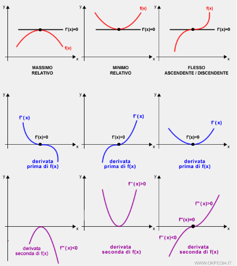

# Informazioni Generali

**Docente:** Lorenzo Castelli (castelli@units.it)  

**Orario Lezioni:**  
- **Lunedì**: 11.15 - 12.45 (Aula 3B, Ed. H2bis)  
- **Giovedì**: 10.15 - 11.00 (Aula A, Ed. C2)  
- **Venerdì**: 13.00 - 15.30 (Aula 3B, Ed. H2bis)  

**Esame:**
- Solo scritto
- 6 appelli all'anno (2 estivi, 2 autunnali, 2 invernali)

## Ottimizzazione e Ricerca Operativa

### Concetti Base
- **Ottimizzazione**: Processo di selezione della miglior soluzione tra le alternative disponibili.
- **Esempi quotidiani**: Percorso più breve, gestione del tempo, allocazione di risorse.

### Definizione di Ricerca Operativa
- Applicazione del metodo scientifico a sistemi complessi per supportare decisioni.
- Modelli matematici e metodi quantitativi per risolvere problemi decisionali.

## Applicazioni della Ricerca Operativa

### Ambito Industriale
- **Pianificazione della produzione**: Allocazione ottimale delle risorse.
- **Gestione delle scorte**: Minimizzazione dei costi di magazzino.
- **Localizzazione di impianti**: Scelta ottimale della posizione per minimizzare costi logistici.

### Progettazione Ottima
- **Reti di trasporto e telecomunicazioni**: Minimizzazione dei costi di collegamento.
- **Progettazione strutturale**: Massimizzazione della resistenza a sollecitazioni.
- **Design elettronico (VLSI)**: Minimizzazione delle lunghezze dei percorsi elettrici.

### Altri Settori
- **Economia e finanza**: Scelta di investimenti ottimali.
- **Project planning**: Determinazione ottimale dei turni del personale.
- **Diagnostica medica**: Analisi dati clinici per migliorare diagnosi.
- **Scienze ambientali**: Ottimizzazione della gestione delle risorse naturali.

## Programmazione Matematica
- Disciplina che studia problemi di ottimizzazione.
- Obiettivo: Minimizzare o massimizzare una funzione soggetta a vincoli.

### Software Utilizzati
- **Google OR-Tools**: https://developers.google.com/optimization/
- **Matlab Optimization Toolbox**: https://it.mathworks.com/products/optimization.html
- **IBM CPLEX**: https://www.ibm.com/it-it/marketplace/ibm-ilog-cplex
- **FICO Xpress Optimization**: http://www.fico.com/en/products/fico-xpress-optimization
- **Gurobi**: http://www.gurobi.com/
- **Excel Solver**: https://support.office.com/it-it/article/definire-e-risolvere-un-problema-usando-il-risolutore-5d1a388f-079d-43ac-a7eb-f63e45925040

# Esempi di Modelli

## La Compilation Ideale
**Problema**: Selezionare i file musicali da inserire in un CD-ROM (capacità 800MB) massimizzando il gradimento.

**Dati**:

| Canzone        | Gradimento | Ingombro (MB) |
|---------------|------------|---------------|
| Light my fire | 8          | 210           |
| Fame          | 7          | 190           |
| I will survive | 8.5       | 235           |
| Imagine       | 9          | 250           |
| Let it be     | 7.5        | 200           |
| I feel good   | 8          | 220           |

**Formulazione**:

- Variabili binarie: $x_i \in \{0,1\}$ (1 se la canzone è inclusa, 0 altrimenti)
- **Funzione obiettivo**: $\max \sum g_i x_i$
- **Vincolo di capacità**: $\sum w_i x_i \leq C$

> Questo è un problema di **zaino (knapsack problem)**.

---

## I Treni Combinati
**Problema**: Una compagnia ferroviaria deve scegliere quanti treni **DeLuxe** e **FarWest** costruire per massimizzare il guadagno, rispettando le disponibilità di risorse.

**Dati**:

| Tipo Vagone | DeLuxe | FarWest | Disponibilità |
|------------|--------|--------|--------------|
| Merci      | 1      | 3      | 12           |
| WLit       | 1      | 0      | 9            |
| Ristorante | 1      | 0      | 10           |
| II Classe  | 2      | 3      | 21           |
| I Classe   | 1      | 2      | 10           |
| Motrice    | 1      | 1      | 9            |
| **Guadagno** | **3000€** | **8000€** | - |

**Formulazione**:

- Variabili: $x_1$ (n. treni DeLuxe), $x_2$ (n. treni FarWest)
- **Funzione obiettivo**: $\max 3000x_1 + 8000x_2$
- **Vincoli**:
  - Rispetto delle disponibilità di vagoni
  - $x_1, x_2 \geq 0$, interi

---

## La Raffineria

**Problema**: Mescolare quattro tipi di petrolio greggio per produrre benzina massimizzando il guadagno.

**Dati**:

| Componente | Max Barili | Costo (€/barile) |
|-----------|----------|----------------|
| P1        | 500      | 9              |
| P2        | 2400     | 7              |
| P3        | 4000     | 12             |
| P4        | 1500     | 6              |

**Formulazione**:

- Variabili: $x_{ij}$ (barili di petrolio $i$ usati per produrre benzina $j$)
- **Funzione obiettivo**: $\max \sum p_j x_{ij} - \sum c_i x_{ij}$
- **Vincoli**: Disponibilità e specifiche qualitative dei carburanti

---

## Turnazione degli Infermieri
**Problema**: Organizzare i turni settimanali minimizzando il numero totale di infermieri.

**Dati**:

| Giorno | Infermieri richiesti |
|--------|------------------|
| Lun    | 17               |
| Mar    | 13               |
| Mer    | 15               |
| Gio    | 19               |
| Ven    | 14               |
| Sab    | 16               |
| Dom    | 11               |

**Formulazione**:

- Variabili: $x_i$ (n. infermieri che iniziano il turno il giorno $i$)
- **Funzione obiettivo**: $\min \sum x_i$
- **Vincoli**: Garanzia di copertura minima giornaliera

---

## Campagna Pubblicitaria
**Problema**: Determinare la combinazione ottimale di annunci radiofonici e su carta stampata per minimizzare i costi raggiungendo almeno 3 milioni di persone.

**Dati**:

- **Radio**: Costo = $100 - 2x_1$ €/minuto, Raggiunge 100.000 persone/minuto, Max 30 minuti
- **Giornale**: Costo = 200€/pagina, Raggiunge 15.000 persone/pagina

**Formulazione**:

- Variabili: $x_1$ (minuti radio), $x_2$ (pagine giornale)
- **Funzione obiettivo**: $\min (100 - 2x_1)x_1 + 200x_2$
- **Vincoli**:
  - $100x_1 + 15x_2 \geq 3000$
  - $200x_2 \geq \dfrac{1}{3} ((100 - 2x_1)x_1 + 200x_2)$
  - $0 \leq x_1 \leq 30$, $x_2 \geq 0$

---

## Radioterapia

**Problema**: Selezionare l'intensità ottimale dei raggi per minimizzare il danno ai tessuti sani, garantendo l'efficacia sul tumore.

**Dati**:

| Area             | Dose Raggio 1 | Dose Raggio 2 | Restrizioni |
| ---------------- | ------------- | ------------- | ----------- |
| Anatomia sana    | 0.4           | 0.5           | Minimizzare |
| Tessuti critici  | 0.3           | 0.1           | $\leq$ 2.7  |
| Regione tumorale | 0.5           | 0.5           | $= 6.0$     |
| Nucleo tumore    | 0.6           | 0.4           | $\geq$ 0.6  |

**Formulazione**:

- Variabili: $x_1$, $x_2$ (dose dei due raggi)
- **Funzione obiettivo**: $\min 0.4x_1 + 0.5x_2$
- **Vincoli**:
  - $0.3x_1 + 0.1x_2 \leq 2.7$
  - $0.5x_1 + 0.5x_2 = 6$
  - $0.6x_1 + 0.4x_2 \geq 0.6$
  - $x_1, x_2 \geq 0$

---

# Introduzione all'Ottimizzazione

## Problema di Ottimizzazione

Un problema di ottimizzazione si definisce specificando:

- Un insieme $E$, i cui elementi sono chiamati **soluzioni** (o decisioni o alternative).

- Un sottoinsieme $F \subset E$ (**insieme dei punti ammissibili**). Gli elementi di $E \setminus F$ sono **soluzioni non ammissibili**. La relazione $x \in F$ è detta **vincolo**.

- Una funzione $f: E \to \mathbb{R}$ (**funzione obiettivo**) da **minimizzare** o **massimizzare**.

## Obiettivo del Problema di Ottimizzazione

Soluzione ottimale: un elemento $x^* \in F$ tale che:

- $f(x^*) \leq f(y), \forall y \in F$ per un problema di minimizzazione.

- $f(x^*) \geq f(y), \forall y \in F$ per un problema di massimizzazione.

$x^*$ è detta **soluzione ottima** e il valore $v = f(x^*)$ è detto **valore ottimo**.

### Equivalenza dei problemi

Un problema di minimizzazione può essere trasformato in un problema di massimizzazione (e viceversa) sostituendo $f$ con $-f$.

## Formulazione del Problema di Ottimizzazione

Minimizzazione: $v = \min_{x \in F} f(x)$

Massimizzazione: $v = \max_{x \in F} f(x)$

## Classificazione dei Problemi di Ottimizzazione

- **Problemi di ottimizzazione continua**: Se le variabili possono assumere tutti valori reali $x \in \mathbb{R}^n$. Si distingue tra:

  - Ottimizzazione vincolata se $F \subset \mathbb{R}^n$.

  - Ottimizzazione non vincolata se $F = \mathbb{R}^n$.

- **Problemi di ottimizzazione discreta**: Se le variabili sono intere $x \in \mathbb{Z}^n$. Si distingue tra:

    - Programmazione intera se $F \subseteq \mathbb{Z}^n$.

    - Programmazione binaria (o Booleana) se $F \subseteq \{0,1\}^n$.

- **Problemi di ottimizzazione mista**: Alcune variabili sono intere, altre continue.

## Convessità

Una funzione $f(x)$ è **convessa** se, per ogni coppia di punti $x', x''$ di valori di $x$ con $x' < x''$ si ha

$f[\lambda x'' + (1 - \lambda)x'] \leq \lambda f(x'') + (1 - \lambda)f(x')$

Strettamente convessa se l'uguaglianza è stretta ($<$).  
Concava se vale la disuguaglianza inversa ($\geq$ o $>$).

La funzione $f(x)$ è **convessa** se per ogni coppia di punti del grafico
$f(x)$ il segmento che li congiunge sta interamente al di sopra del
grafico di $f(x)$ o coincide con esso.

La funzione $f(x)$ è **concava** se il segmento che congiunge due punti del grafico di $f(x)$ sta interamente al di sotto del grafico di $f(x)$ o coincide con esso.

**Linearità**: una funzione lineare è sia convessa che concava.

### Test di Convessità

Se $f(x)$ è derivabile due volte, allora, per ogni $x$:

$f(x)$ è convessa se e solo se $\dfrac{d^2 f(x)}{dx^2} \geq 0$.

Concava se $\dfrac{d^2 f(x)}{dx^2} \leq 0$.

Strettamente convessa se $\dfrac{d^2 f(x)}{dx^2} > 0$.

Strettamente concava se $\dfrac{d^2 f(x)}{dx^2} < 0$.

## Insiemi Convessi

Un insieme è **convesso** se, per ogni coppia di punti, il segmento che li congiunge è interamente contenuto nell’insieme.

L'**intersezione** di insiemi convessi è sempre un insieme convesso.

Un **punto estremo** di un insieme convesso è un punto dell'insieme che non appartiene ad alcun segmento che congiunge due punti disgiunti dell'insieme (non tutti gli insiemi convessi hanno punti estremi).

## Ottimizzazione Non Vincolata

Se $f(x)$ è derivabile, una soluzione $x^*$ è un minimo o un massimo se  

$\dfrac{df(x^*)}{dx} = 0$

Minimo locale se $\dfrac{d^2 f(x^*)}{dx^2} > 0$. La funzione è strettamente convessa in un intorno di $x^*$.

Massimo locale se $\dfrac{d^2 f(x^*)}{dx^2} < 0$. La funzione è strettamente concava in un intorno di $x^*$.

Punto di flesso se $\dfrac{d^2 f(x^*)}{dx^2} = 0$ e serve esaminare derivate di ordine superiore.

{ width=320px }

## Minimi e Massimi Globali

(Se il dominio è limitato è necessario controllare gli estremi
dell'intervallo.)

Per un **minimo globale** è necessario confrontare i minimi locali e trovare il più basso valore di $f(x)$.  
Se questo valore è minore di $f(x)$ per $x \to \pm \infty$ (o agli estremi del suo dominio, se essa è definita in un intervallo limitato), allora questo punto è un minimo globale.

### Minimi globali per funzioni convessse

Se $f(x)$ è convessa, allora ogni minimo locale è anche un minimo globale. In altre parole questa condizione è non solo necessaria ma anche sufficiente per un minimo globale di una funzione convessa.
Questa soluzione non deve necessariamente essere unica perché la funzione potrebbe rimanere costante in un certo intervallo nel quale la sua derivata è nulla.  
Se $f(x)$ è strettamente convessa, allora esiste un solo minimo globale.

Analogamente per massimi globali e funzioni concave.

Se la funzione non è strettamente concava o strettamente convessa ci possono essere infinite soluzioni ottime, rispettivamente massimi e minimi globali.

# Programmazione Lineare

Un problema di **programmazione lineare** (LP) è un problema di ottimizzazione tale che  

$z = \max \{c(x) : x \in X \subseteq \mathbb{R}^n\}$  
oppure  
$z = \min \{c(x) : x \in X \subseteq \mathbb{R}^n\}$  

dove la funzione obiettivo $c(x) : \mathbb{R}^n \to \mathbb{R}$ è lineare, cioè $c(0) = 0$, e $c(\alpha x + \beta y) = \alpha c(x) + \beta c(y)$, perciò $c(x) = cx$ con $c \in \mathbb{R}^n$.  

L'insieme $X$ dei punti ammissibili è definito da un insieme di vincoli lineari tale che $h(x) = \gamma$ e/o $h(x) \leq \gamma$ e/o $h(x) \geq \gamma$ con $h(x) : \mathbb{R}^n \to \mathbb{R}^m$ lineare e $\gamma \in \mathbb{R}$.

## Formulazione Standard

Un problema LP può essere scritto come:  

$$  
\max c^T x \\
Ax \leq b \\
x \geq 0  
$$  

Oppure in forma esplicita:  

$$  
\begin{aligned}
\max Z &= c_1x_1 + c_2x_2 + \dots + c_nx_n  \\
a_{11}x_1 + a_{12}x_2 + \dots + a_{1n}x_n &\leq b_1  \\
a_{21}x_1 + a_{22}x_2 + \dots + a_{2n}x_n &\leq b_2  \\
&\vdots  \\
a_{m1}x_1 + a_{m2}x_2 + \dots + a_{mn}x_n &\leq b_m  \\
x_1, x_2, \dots, x_n &\geq 0  
\end{aligned}
$$  

### Notazione

- $m$ numero di righe della matrice $A$  
- $n$ dimensione del vettore $x$ e numero di colonne di $A$  
- $c$ vettore della funzione obiettivo  
- $A$ matrice dei coefficienti dei vincoli  
- $b$ vettore dei termini noti ($\geq 0$ nella forma standard)  
- $x$ vettore delle variabili decisionali  
- $X = \{x : Ax \leq b, x \geq 0\}$ insieme ammissibile

## Proprietà della Programmazione Lineare  
1. **Proporzionalità**  
   - La funzione obiettivo e i vincoli sono lineari rispetto alle variabili decisionali:  
     $$ \frac{\partial Z}{\partial x_j} = c_j, \quad \frac{\partial b_i}{\partial x_j} \geq a_{ij} \quad \forall i, j $$  

2. **Costi Fissi**  
   - Se esiste un costo fisso (es. costo di setup), la linearità non è rispettata:  
     $$ f(x) =  
     \begin{cases}  
     0 & x = 0 \\  
     K + cx & x > 0  
     \end{cases}  
     $$  

3. **Additività**  
   - L'efficacia totale deve essere la somma dei contributi di ogni attività:  
     $$ Z = c_1x_1 + c_2x_2 + \dots + c_nx_n $$  

4. **Divisibilità (o Continuità)**  
   - Le variabili $x_j$ assumono valori reali: $x \in \mathbb{R}^n$.  
   - Se servono soluzioni intere, il problema diventa di *Programmazione Intera*.  

5. **Certezza**  
   - Tutti i coefficienti del problema sono numeri reali noti a priori. Non ci sono incertezze o probabilità.

## Possibili Risultati  

> (Slide 4 da pagina 8 alla 13)

## Concetti Fondamentali  
- **Iperpiano**: $H = \{ x \in \mathbb{R}^n : a^T x = b \}$ con $a \neq 0, a \in \mathbb{R}^n, b \in \mathbb{R}$. Le regioni $X^- = \{ x \in \mathbb{R}^n : a^T x \leq b \}$ e $X^+ = \{ x \in \mathbb{R}^n : a^T x \geq b \}$ sono dette **semispazi**, delimitati dall'iperpiano di supporto $H$.
- **Poliedro (convesso)**: intersezione di un numero finito di iperpiani e semispazi.  
- **Politopo**: poliedro $P$ limitato, cioè esiste una costante $M > 0$ tale che $||x|| \leq M$ per ogni $x \in P$.
- **Vertici**: punti estremi di un poliedro convesso. 

### Lemma 

La regione ammissibile di un problema LP è un poliedro convesso.

### Teorema. L'ottima soluzione si trova in un vertice 

Se il problema LP $\max cx$, $Ax = b$ con $b \geq 0$, $x \geq 0$, se $X \neq \emptyset$ e ha una soluzione ottima e finita, allora esiste un vertice di $X$ che è una soluzione ottima.

#### Dimostrazione per Contraddizione  

Supponiamo per assurdo che esista un'unica soluzione ottimale e che essa **non** sia una soluzione CPF (*Corner Point Feasible*).  

Una soluzione CPF è una soluzione ammissibile che **non** giace su alcun segmento di linea che collega due altre soluzioni ammissibili.  

Poiché abbiamo assunto che la soluzione ottimale $x^*$ **non** sia una CPF, devono esistere due altre soluzioni ammissibili $x'$ e $x''$ tali che il segmento di linea che le collega contenga la soluzione ottimale.  

Sia $Z_1$ e $Z_2$ il valore della funzione obiettivo nelle soluzioni $x'$ e $x''$ rispettivamente. Poiché $x^*$ giace sul segmento di linea tra $x'$ e $x''$, possiamo scrivere:  

$$
x^* = \alpha x'' + (1 - \alpha) x'
$$  

per un certo valore di $\alpha$ tale che $0 < \alpha < 1$.  

Allora, il valore della funzione obiettivo nella soluzione ottima è:  

$$
Z^* = \alpha Z_2 + (1 - \alpha) Z_1
$$  

Poiché i pesi $\alpha$ e $(1 - \alpha)$ sommano a 1, le uniche possibilità per il confronto tra $Z^*, Z_1$ e $Z_2$ sono:  

1. $Z^* = Z_1 = Z_2$  
2. $Z_1 < Z^* < Z_2$  
3. $Z_1 > Z^* > Z_2$  

- Il primo caso implica che $x'$ e $x''$ siano anch'esse soluzioni ottimali, il che contraddice l'ipotesi che esista **un'unica** soluzione ottimale.  
- I due ultimi casi contraddicono l'ipotesi che $x^*$, che **non** è una CPF, sia ottimale.  

Ne consegue che è impossibile avere un'unica soluzione ottimale che non sia una soluzione CPF.  

$\square$

# L'algoritmo del Simplesso

## Soluzioni agli angoli (Corner-point solutions)

- Un **vincolo** (constraint boundary) è un'equazione lineare che definisce un confine della regione ammissibile.
- I **punti di intersezione** di questi vincoli sono chiamati **soluzioni agli angoli**.
- Alcune soluzioni agli angoli sono **ammissibili (CPF solutions)**, altre no.

## Ricerca dei vertici

In un problema di programmazione lineare con $n$ variabili decisionali, ogni soluzione agli angoli si trova all'intersezione di $n$ vincoli.

## Soluzioni CPF adiacenti

- Due soluzioni CPF sono **adiacenti** se condividono $n-1$ vincoli.
- Sono collegate da un segmento di linea all'interno della regione ammissibile.

## La soluzione ottimale si trova in un vertice

**Proprietà 1:**

1. Se esiste un'unica soluzione ottimale, allora essa deve essere una soluzione CPF.  
2. Se esistono più soluzioni ottimali, almeno due di esse devono essere soluzioni CPF adiacenti.

### Dimostrazione (per assurdo)

**Punto 1.**

Se l'unica soluzione ottimale $x^*$ non fosse una CPF, allora esisterebbero due soluzioni ammissibili $x'$ e $x''$ tali che:

$$x^* = \alpha x'' + (1 - \alpha) x'$$

e la funzione obiettivo avrebbe valori:

$$Z^* = \alpha Z_2 + (1 - \alpha) Z_1$$

Ciò porterebbe a contraddizioni con l'assunzione che $x^*$ sia unica e ottimale. Poiché:

- $Z^* = Z_1 = Z_2$ implica che $x'$ e $x''$ sono anch'esse soluzioni ottimali.
- $Z_1 < Z^* < Z_2$ o $Z_1 > Z^* > Z_2$ contraddicono l'ipotesi che $x^*$ sia ottimale.
- Ne consegue che $x^*$ deve essere una CPF. $\square$

**Punto 2.**

Quando si risolve un problema graficamente, la linea della funzione obiettivo continua ad alzarsi finché non contiene il segmento di linea che collega le due soluzioni CPF.  
La stessa cosa accadrebbe in dimensioni superiori, eccetto che un iperpiano della funzione obiettivo continuerebbe ad alzarsi finché non contenesse il segmento di linea che collega due (o più) soluzioni CPF adiacenti.  
Di conseguenza, tutte le soluzioni ottimali possono essere ottenute come medie pesate di soluzioni CPF ottimali.

## Numero finito di vertici

**Proprietà 2:** Il numero di soluzioni CPF è finito ed al più uguale a:

$$\binom{m+n}{n} = \frac{(m+n)!}{m!n!}$$

dove $m$ è il numero di vincoli e $n$ il numero di variabili decisionali.

## La regione ammissibile è convessa

**Proprietà 3:** Se una soluzione CPF non ha soluzioni adiacenti migliori, allora è ottimale.

## Test di ottimalità

Se una soluzione CPF non ha soluzioni adiacenti con un valore maggiore di $Z$, allora deve essere ottimale.

## L'algoritmo del Simplesso

### Inizializzazione
- Si sceglie una soluzione CPF iniziale (es. $(0,0)$).
- Si verifica se è ottimale, altrimenti si passa alla fase di iterazione.

### Iterazioni
1. Si sceglie un'adiacente CPF migliore.
2. Si muove lungo il vincolo fino alla nuova soluzione CPF.
3. Si ripete fino a raggiungere l'ottimo.

### Scelta della direzione migliore
- Si calcola la **variazione di $Z$** lungo ogni segmento.
- Si sceglie la direzione con la **maggior crescita di $Z$**.

### Test di ottimalità efficiente
- Se non ci sono miglioramenti possibili, la soluzione corrente è ottimale.

**Osservazione:**  

- Il metodo del simplesso si concentra sulle soluzioni CPF. Per qualsiasi problema con almeno una soluzione ottimale, trovarne una richiede solo di trovare una soluzione CPF migliore.  
- Poiché il numero di soluzioni ammissibili è generalmente infinito, ridurre il numero di soluzioni che devono essere esaminate a un piccolo numero finito (solo tre nel nostro esempio) è una semplificazione enorme.

### Riassunto dell'algoritmo

1. **Inizializzazione**: Scegliere una soluzione CPF iniziale.
2. **Test di ottimalità**: Se la soluzione CPF è ottimale, terminare.
3. **Iterazione**:
   - **Scelta della direzione migliore**: Scegliere una soluzione CPF adiacente migliore.
   - **Movimento lungo il vincolo**: Muoversi lungo il vincolo fino alla nuova soluzione CPF.
   - **Test di ottimalità efficiente**: Se non ci sono miglioramenti possibili, la soluzione corrente è ottimale.

**Osservazione:**  

- Quando possibile, l'inizializzazione del metodo del simplesso sceglie l'origine (tutte le variabili decisionali uguali a zero) come soluzione CPF iniziale. Quando ci sono troppe variabili decisionali per trovare una soluzione CPF iniziale graficamente, questa scelta elimina la necessità di utilizzare procedure algebriche per trovare e risolvere una soluzione CPF iniziale.  
- La scelta dell'origine è comunemente possibile quando tutte le variabili decisionali hanno vincoli di non negatività, poiché l'intersezione di questi confini di vincolo restituisce l'origine come soluzione agli angoli. Questa soluzione è quindi una soluzione CPF a meno che non sia inammissibile perché viola uno o più vincoli. Se è inammissibile, sono necessarie procedure speciali per trovare la soluzione CPF iniziale.  
- Quale soluzione CPF adiacente scegliere? Dopo aver identificato la soluzione CPF corrente, il metodo del simplesso esamina ciascuno dei bordi della regione ammissibile che si dipartono da questa soluzione CPF e identifica il tasso di miglioramento in Z che si otterrebbe spostandosi lungo il bordo. Tra i bordi con un tasso di miglioramento positivo in Z, sceglie quindi di muoversi lungo quello con il tasso di miglioramento più grande in Z. L'iterazione è completata risolvendo prima la soluzione CPF adiacente all'altro estremo di questo bordo e quindi rinominando questa soluzione CPF adiacente come la soluzione CPF corrente per il test di ottimalità e (se necessario) la prossima iterazione.  
- Un tasso di miglioramento positivo in Z implica che la soluzione CPF adiacente è migliore della soluzione CPF corrente, mentre un tasso di miglioramento negativo in Z implica che la soluzione CPF adiacente è peggiore. Pertanto, il test di ottimalità consiste semplicemente nel verificare se uno dei bordi fornisce un tasso di miglioramento positivo in Z. Se nessuno lo fa, allora la soluzione CPF corrente è ottimale.  

# Soluzioni di base

## Forma standard

Un qualunque problema di programmazione lineare può sempre essere formulato in forma standard:

$$
\max z = cx \\
Ax = b \quad (b \geq 0) \\
x \geq 0
$$

## Soluzioni di base

Dato il problema appena formulato, si supponga $\text{rank}(A) = m$. Poiché $m < n$, eventualmente riordinando le colonne, si può porre:

$$A = [B | N]$$

dove:

- $B$ è una matrice non singolare $m \times m$ detta **matrice delle colonne in base**.
- $N$ è una matrice $m \times (n-m)$, detta **matrice delle colonne fuori base**.

La matrice $B$ è composta da $m$ colonne di $A$ linearmente indipendenti che formano una base nello spazio vettoriale ad $m$ dimensioni delle colonne di $A$.

### Partizionamento delle variabili

In corrispondenza di una scelta di $B$ e $N$, si può partizionare anche il vettore $x$:

$$x = \begin{bmatrix} x_B \\ x_N \end{bmatrix}$$

Con $x_B$ e $x_N$ vettori di dimensioni $m$ e $n-m$ rispettivamente.

Dove:
- $x_B$ è detto **vettore delle variabili in base**.
- $x_N$ è detto **vettore delle variabili fuori base**.

### Sistema lineare equivalente

Il sistema di equazioni lineari $Ax = b$ si può riscrivere come:

$$[B | N] \begin{bmatrix} x_B \\ x_N \end{bmatrix} = b \Rightarrow B x_B + N x_N = b$$

Da cui si ottiene:

$$x_B = B^{-1} b - B^{-1} N x_N$$

Per ogni base $B$, la soluzione del sistema $Ax = b$ corresponde a determinare il valore di $m$ variabili $x_B$, avendo fissato arbitrariamente il valore delle $n-m$ variabili $x_N$.

Una scelta importante è porre $x_N = 0$, ottenendo la corrispondente **soluzione di base**:

$$x = \begin{bmatrix} B^{-1}b \\ 0 \end{bmatrix}$$

Se $B^{-1}b \geq 0$, si ottiene una **soluzione di base ammissibile (BFS)** per il sistema $Ax = b, x \geq 0$.

## Vertici e BFS

Dato il problema $Ax = b, x \geq 0$, una soluzione $x$ è un **vertice** del poliedro $P(A, b)$ se e solo se $x$ è una BFS.

Un punto di un poliedro è un vertice (punto estremo) se e solo se soddisfa all'uguaglianza $n$ vincoli linearmente indipendenti.

Quindi basta dimostrare che ogni BFS soddisfa $n$ vincoli linearmente indipendenti tra $Ax = b$ e $x \geq 0$.  
Per definizione, ogni BFS soddisfa all'uguaglianza $(n-m)$ vincoli $x \geq 0$ e gli $m$ vincoli $Ax = b$. I vincoli stringenti sono linearmente indipendenti, poiché la matrice dei loro coefficienti è non singolare (quindi invertibile):

$$\begin{bmatrix} B & N \\ 0 & I_{n-m} \end{bmatrix}$$

## Esempio di problema LP

Si consideri il problema:

$$
\begin{aligned}
\max z &= 2x_1 + x_2 \\
x_1 + x_2 &\leq 5 \\
-x_1 + x_2 &\leq 0 \\
6x_1 + 2x_2 &\leq 21 \\
x_1, x_2 &\geq 0
\end{aligned}
$$

Non è in forma standard, ma espresso solo in termini delle variabili strutturali.

Trasformandolo in forma standard introducendo le variabili di **slack** $x_3, x_4, x_5$:

$$
\begin{aligned}
  \max z &= 2x_1 + x_2 \\
  x_1 + x_2 + x_3 &= 5 \\
  -x_1 + x_2 + x_4 &= 0 \\
  6x_1 + 2x_2 + x_5 &= 21 \\
  x_1, x_2, x_3, x_4, x_5 &\geq 0
\end{aligned}
$$

$$
A = \begin{bmatrix} 1 & 1 & 1 & 0 & 0 \\ -1 & 1 & 0 & 1 & 0 \\ 6 & 2 & 0 & 0 & 1 \end{bmatrix}
\quad
B = \begin{bmatrix} 5 \\ 0 \\ 21 \end{bmatrix}
$$

Limite superiore delle possibili basi $\frac{5!}{3!2!} = 10$, ma non tutte le basi corrispondono ad una soluzione ammissibile BFS, nell’esempio solo 6 basi sono ammissibili.
Siccome i vertici sono 4, vi saranno BFS **degeneri**.

$$
X_B^{(3)} = \begin{bmatrix} x_1 \\ x_2 \\ x_4 \end{bmatrix} \quad
B_3 = \begin{bmatrix} 1 & 1 & 0 \\ -1 & 1 & 1 \\ 6 & 2 & 0 \end{bmatrix} \quad
B_{(3)}^{-1} = \begin{bmatrix} -2 & 0 & 1 \\ 6 & 0 & -1 \\ -8 & 4 & 2 \end{bmatrix}
$$

$$
B_{(3)}^{-1} b = B_{(3)}^{-1} \begin{bmatrix} 5 \\ 0 \\ 21 \end{bmatrix} = \begin{bmatrix} 11/4 \\ 9/4 \\ 1/2 \end{bmatrix} \Rightarrow p_3
$$

Cioè la soluzione di base ammissibile $p_3 = (11/4, \ 9/4, \ 0, \ 5/4, \ 0)$.

$$
X_B^{(2)} = \begin{bmatrix} x_1 \\ x_2 \\ x_5 \end{bmatrix} = \begin{bmatrix} 5/2 \\ 5/2 \\ 1 \end{bmatrix} \Rightarrow p_2 \quad
X_B^{(4)} = \begin{bmatrix} x_1 \\ x_2 \\ x_4 \end{bmatrix} = \begin{bmatrix} 7/2 \\ 3/2 \\ 7/2 \end{bmatrix} \Rightarrow p_4
$$

$$
X_B^{(1)} = \begin{bmatrix} x_1 \\ x_3 \\ x_5 \end{bmatrix} = X_B^{(5)} = \begin{bmatrix} x_2 \\ x_3 \\ x_5 \end{bmatrix} = X_B^{(6)} = \begin{bmatrix} x_4 \\ x_3 \\ x_5 \end{bmatrix} = \begin{bmatrix} 0 \\ 5 \\ 21 \end{bmatrix} \Rightarrow p_1 = p_5 = p_6 \quad \text{degeneri}
$$

$$
X_B^{(7)} = \begin{bmatrix} x_1 \\ x_2 \\ x_3 \end{bmatrix} \quad
B_{(7)} = \begin{bmatrix} 1 & 1 & 1 \\ -1 & 1 & 0 \\ 6 & 2 & 0 \end{bmatrix} \quad
B_{(7)}^{-1} = \begin{bmatrix} 0 & -2 & 1 \\ 0 & 6 & 1 \\ 8 & -4 & -2 \end{bmatrix}
$$

$$
B_{(7)}^{-1} b = B_{(7)}^{-1} \begin{bmatrix} 5 \\ 0 \\ 21 \end{bmatrix} = \begin{bmatrix} 21/8 \\ 21/8 \\ -1/4 \end{bmatrix}
$$

Analogamente, sono basi non ammessibili

$$
\begin{bmatrix} x_2 \\ x_4 \\ x_5 \end{bmatrix} \quad
\begin{bmatrix} x_1 \\ x_4 \\ x_5 \end{bmatrix} \quad
\begin{bmatrix} x_2 \\ x_3 \\ x_4 \end{bmatrix}
$$

## Variabili di surplus

Se in un problema di PL ci sono vincoli di tipo $\geq$, si introducono **variabili di surplus** con segno opposto, ad esempio:

$$-3x_1 + 2x_2 \geq 5 \quad \Rightarrow \quad -3x_1 + 2x_2 - x_6 = 5$$

## Soluzione del problema di programmazione lineare

Esplicitando la funzione obiettivo:

$$z = cx = [c_B c_N] \begin{bmatrix} x_B \\ x_N \end{bmatrix} = c_B x_B + c_N x_N$$

Sostituendo $x_B$ con la sua espressione:

$$x_B = B^{-1} b - B^{-1} N x_N$$

Si ottiene:

$$z = c_B B^{-1} b - (c_B B^{-1} N - c_N)x_N$$

Il valore della funzione obiettivo corrispondente alla base $B$ è quindi:

$$z(B) = c_B B^{-1} b$$

## Algoritmo del simplesso

* Nell'algoritmo del simplesso si distingue una **fase I**, che consiste nel passo di inizializzazione in cui viene individuata una prima BFS (Basic Feasible Solution - soluzione ammissibile di base), e una **fase II**, che consiste nel determinare la BFS ottima a partire dalla prima BFS.
* La fase II è già stata illustrata, la fase I viene illustrata di seguito.
* La verifica se il problema è illimitato può anche venire fatta durante la fase II controllando tutte le colonne associate a costi ridotti positivi (e quindi coefficienti nel tableau negativi). Se le colonne sono numerose questa verifica può essere onerosa.

## Fase I - Individuazione della prima BFS

In alcuni casi una prima base ammissibile è immediata. Si supponga infatti che il problema sia formulato come:

$$
\begin{aligned}
  \max \ z &= cx \\
  Hx &\leq b \\
  x &\geq 0
\end{aligned}
$$

con $b \ge 0$, allora la sua trasformazione in forma standard introduce delle variabili di slack  $s$ le cui corrispondenti colonne formano la prima base ammissibile:

$max \ z = cx$  
$Hx + Is = b$  
$x \ge 0, s \ge 0$  

$$
\begin{aligned}
  \max \ z &= cx \\
  Hx + Is &= b \\
  x &\ge 0 \\
  s &\ge 0
\end{aligned}
$$

Riordinando le colonne si ottiene:

$A = [I|H], \ B=I \ e \ N = H,$

dove chiaramente:

$rango\{A\} = m \ e \ B^{-1}b \ge 0.$

## Forma canonica

**Definizione:**

Qualora un problema di PL (Programmazione Lineare) in forma standard ha la matrice $A$ che si può esprimere come:

$A = [I|H], \ B = I \ e \ N = H,$

allora il problema è detto essere espresso in forma **canonica**.

Non è immediato esprimere un problema di PL in forma canonica in presenza di disuguaglianze di verso opposto, infatti le variabili di *surplus* hanno coefficienti negativi, o in presenza di vincoli di uguaglianza.

## Esempio

**Formulazione iniziale:**

$$
\begin{aligned}
  \max \ z &= 4x_1 + x_2 \\
  3x_1 + x_2 &= 3 \\
  4x_1 + 3x_2 - x_3 &\geq 6 \\
  x_1 + 2x_2 + x_4 &\leq 4 \\
  x_1, x_2, x_3, x_4 &\geq 0
\end{aligned}
$$

**Formulazione standard:**

$$
\begin{aligned}
  \max \ z &= -4x_1 - x_2 \\
  3x_1 + x_2 &= 3 \\
  4x_1 + 3x_2 - x_3 &= 6 \\
  x_1 + 2x_2 + x_4 &= 4 \\
  x_1, x_2, x_3, x_4 &\ge 0
\end{aligned}
$$

Questa formulazione standard **NON** è una forma canonica:

$$A = \begin{bmatrix} 3 & 1 & 0 & 0 \\ 4 & 3 & -1 & 0 \\ 1 & 2 & 0 & 1 \end{bmatrix}$$

## Fase I

Se il problema è nella forma standard, ottenuto solo da vincoli di tipo $=$ e $\le$, si introducono $m$ variabili artificiali $u$ e si formula il problema di fase I:

**Problema originale:**

$$
\begin{aligned}
  \max \ z &= cx \\
  Ax &= b \\
  x &\ge 0
\end{aligned}
$$

**Fase I:**

$$
\begin{aligned}
  \min \ w &= 1u \\
  Ax + Iu &= b \\
  x &\ge 0 \\
  u &\ge 0
\end{aligned}
$$

Per il problema di fase I è immediato determinare una base iniziale ammissibile.

## Fase I (continua)

Il problema di fase I ammette una soluzione ottima $w^*$ non negativa per costruzione.

* Se $w^* > 0$ allora il problema fase I non ha soluzioni ammissibili $x, u$ t.c. $u = 0$ e quindi non esiste $x$ t.c. $Ax + I0 = b \implies Ax = b$, da cui il sistema $Ax = b$ non è compatibile e il problema di PL non ha soluzioni ammissibili.
* Se $w^* = 0$ allora la componente della soluzione ottima $x^*, u^*$ è t.c. $u^* = 0$ e quindi $x^*$ è t.c. $Ax^* + I0 = b \implies Ax^* = b$. Poiché $x^*$ ha al più $m$ componenti non nulle essa può essere presa come prima BFS del problema originale.

## Esempio - Fase I

$$
\begin{aligned}
  \min \ w = u_1 + u_2 &\implies \max \ w = -u_1 - u_2 \\
  3x_1 + x_2 + u_1 &= 3 \\
  4x_1 + 3x_2 - x_3 + u_2 &= 6 \\
  x_1 + 2x_2 + x_4 &= 4 \\
  x_1, x_2, x_3, x_4, u_1, u_2 &\ge 0
\end{aligned}
$$

Data la presenza di una variabile di slack, bastano solo due variabili artificiali ($u_1, u_2$).
$u_1, u_2, x_4$ è la base iniziale.

## Esempio - Radioterapia

*(pag. 9-14 da pdf n7)*

*(Grafici e Tableau per gli esempi di Radioterapia, soluzione illimitata e infinite soluzioni ottime)*

## Non esiste soluzione ottima

*(Esempio e Tableau di un problema di PL con soluzione illimitata)*

## Infinite soluzioni ottime

*(Esempio e Tableau di un problema di PL con infinite soluzioni ottime)*

# Dualità

## Un problema di produzione

Un'azienda produce $n$ beni diversi utilizzando $m$ materie prime diverse.

* Sia $b_i$, $i = 1,  \dots , m$ la quantità disponibile dell'$i$-esima materia prima.
* Il $j$-esimo bene, $j = 1,  \dots , n$, richiede $a_{ij}$ unità dell'$i$-esima materia prima e genera un ricavo $c_j$ per unità prodotta.

L'azienda deve decidere quanto produrre di ciascun bene per massimizzare i ricavi totali.

La scelta della variabile decisionale è semplice. Sia $x_j$, $j = 1,  \dots , n$, la quantità del $j$-esimo bene da produrre.

## Un problema di produzione - Formulazione Primale

**Formulazione Primale:**

$max \ \sum_{j=1}^{n} c_j x_j$

Soggetto a:

$\displaystyle \sum_{j=1}^{n} a_{ij} x_j \leq b_i \quad i = 1, \dots , m$  
$x_j \ge 0 \quad j = 1, \dots , n$

**Variabili decisionali:** La quantità di beni prodotti: $x_j \in \mathbb{R}$ per $j = 1, \dots ,n$. Assumiamo che queste variabili siano continue.

**Funzione obiettivo:** Massimizzare il profitto $\displaystyle\sum_{j=1}^{n} c_j x_j$.

**Vincoli:**

* Per ogni materia prima, la quantità di materiale utilizzata per la produzione non può superare la disponibilità del materiale: $\sum_{j=1}^{n} a_{ij} x_j \leq b_i$ per $i = 1, \dots , m$.
* Per ogni bene, la quantità è sempre non negativa: $x_j \ge 0$, $j = 1, \dots , n$.

## Un problema di produzione - Esempio

$max \ 15x_1 + 10x_2$

Soggetto a:

$(R_p) \ x_1 + x_2 \leq 2000$  
$(R_g) \ x_1 + 0.5x_2 \leq 1000$  
$(R_r) \ 2x_1 + x_2 \leq 3000$  
$x_1, x_2 \ge 0$

## Commenti al problema primale

Prima di decidere cosa produrre per ottenere il massimo profitto, ci si dovrebbe chiedere se sia meglio produrre o vendere (o utilizzare altrimenti) le risorse disponibili.

**Domanda chiave:** Qual è il prezzo minimo al quale tutte le risorse disponibili dovrebbero essere vendute anziché utilizzate per la produzione?

Questa domanda trova risposta nel **problema duale**.

## Il duale del problema di produzione

* Nell'ipotesi di linearità, il profitto complessivo ottenibile dalla vendita delle risorse è uguale alla somma dei profitti ottenuti dalla vendita delle singole risorse. Questi ultimi sono uguali al prezzo di vendita unitario moltiplicato per la quantità di risorse disponibili.
* Un bene $P_1$ genera un profitto di 15 e consuma un'unità di $R_p$, un'unità di $R_q$ e 2 unità di $R_r$. Pertanto, per rendere conveniente vendere le risorse (o almeno rimanere in pareggio) invece di produrre, la vendita complessiva di un'unità di $R_p$, un'unità di $R_q$ e 2 unità di $R_r$ deve fornire un guadagno non inferiore a 15.
* I prezzi di vendita delle risorse devono essere non negativi.

## Variabili duali e funzione obiettivo

**Variabili decisionali:** Il prezzo unitario di ciascuna risorsa: $\pi_i \in \mathbb{R}$, per $i = p, q, r$. Queste sono variabili continue.

**Funzione obiettivo:** Il profitto ottenuto vendendo tutte le risorse disponibili: $2000\pi_p + 1000\pi_q + 3000\pi_r$.

## Vincoli duali

Per ogni bene, il guadagno ottenuto dalla vendita delle risorse necessarie per produrlo non deve essere inferiore al profitto ottenibile dalla vendita del bene stesso.

$\displaystyle\sum_{i=1}^{m} a_{ij}\pi_i \ge c_j \quad \text{per } j = 1,2$

Il prezzo di vendita delle risorse deve essere non negativo:

$\pi_i \ge 0, \quad \text{per } i = p, q, r$

## Formulazione Duale

$(\text{profitto}) \ \min \ q = 2000\pi_p + 1000\pi_q + 3000\pi_r$

Soggetto a:

$(\text{prodotto} \ 1) \ \pi_p + \pi_q + 2\pi_r \ge 15$  
$(\text{prodotto} \ 2) \ \pi_p + 0.5\pi_q + \pi_r \ge 10$  
$\pi_p, \pi_q, \pi_r \ge 0$

## Formulazione Duale (forma matriciale)

$min \ b^T \pi$

Soggetto a:

$A^T \pi \ge c$  
$\pi \ge 0$

Che deriva da:

$\min \displaystyle\sum_{i=1}^{m} b_i \pi_i$  
$\displaystyle\sum_{i=1}^{m} a_{ij} \pi_i \ge c_j \quad \text{per } j = 1, \dots ,n$  
$\pi_i \ge 0 \quad \text{per } i = 1, \dots ,m$

## Commenti al problema duale

È intuitivamente evidente che:

* Ogni soluzione ammissibile per il duale permette di realizzare un profitto non inferiore al massimo profitto ottenibile risolvendo il problema primale (cioè producendo). Quindi è conveniente vendere (o al peggio non si perde) se si trova qualcuno disposto ad acquistare tutte le risorse e a pagarle complessivamente in modo da soddisfare i vincoli duali.
* La soluzione ottima del duale non può essere inferiore alla soluzione ottima del primale (altrimenti ci sarebbero prezzi che, pur soddisfacendo i vincoli, renderebbero la produzione ancora conveniente).

## Problemi primali e duali

Ad ogni problema di PL (primale) è associato un problema duale.

**(P) Primale:**

$$
\begin{aligned}
  \max \ z &= c^T x \\
  Ax &\leq b \\
  x &\ge 0
\end{aligned}
$$

con $n$ variabili e $m$ vincoli.

**(D) Duale:**

$$
\begin{aligned}
  \min \ w &= b^T \pi \\
  A^T \pi &\ge c \\
  \pi &\ge 0
\end{aligned}
$$

con $m$ variabili e $n$ vincoli.

**Proprietà:** Il problema D ha tante variabili quanti sono i vincoli in P e tanti vincoli quante sono le variabili in P.

## Primale e duale - Forma matriciale

In forma matriciale, si osserva che i vettori $b$ e $c$ si scambiano di posizione e la matrice dei coefficienti $A$ viene trasposta.

## Problemi primali e duali - Commenti

La dualità nasce non solo da giustificazioni economiche, ma anche dall'applicazione delle condizioni di Kuhn-Tucker ai problemi di LP o dal rilassamento Lagrangiano.

La dualità è importante perché:

* Il problema duale corrisponde ad una visione diversa dello stesso problema (per la quale va sempre cercata un'interpretazione economica della formulazione ottenuta).
* Su di essa si basano algoritmi, come il Simplesso Duale e l'algoritmo Primale-Duale, alternativi al Simplesso (Primale), che sono utili per certe classi di problemi.
* In alcuni casi può essere conveniente risolvere D invece di P (può essere meglio risolvere il problema con meno vincoli).

## Relazioni primale-duale
| PRIMALE   | massimizza | minimizza  | DUALE     |
| --------- | ---------- | ---------- | --------- |
|           | $\leq b_i$ | $\ge 0$    |           |
| vincoli   | $= b_i$    | $\leq 0$   | variabili |
|           | $b_i$      | libera     |           |
|           |            |            |           |
|           | $\ge 0$    | $\ge c_j$  |           |
| variabili | $\leq 0$   | $\leq c_j$ | vincoli   |
|           | libera     | $= c_j$    |           |

Relazione tra variabili e vincoli primali e duali.

## Problemi primali e duali - esempio

**Primale (P):**

* **Obiettivo:** Massimizzare  $z = 2x_1 + 3x_2 - x_3 + 7x_4$
* **Vincoli:**
    * $4x_1 + 3x_2 - x_3 + 2x_4 \leq 35$  (associato alla variabile duale $\pi_1$)  
    * $x_1 + 5x_2 + 6x_3 + 10x_4 = 28$ (associato alla variabile duale $\pi_2$)
    * $2x_1 + 7x_2 - 2x_3 + 4x_4 \geq 15$ (associato alla variabile duale $\pi_3$)
* **Vincoli di segno:**
    * $x_1 \geq 0$
    * $x_2$ libera
    * $x_3 \leq 0$
    * $x_4 \geq 0$

**Duale (D):**

* **Obiettivo:** Minimizzare $w = 35\pi_1 + 28\pi_2 + 15\pi_3$
* **Vincoli:**
    * $4\pi_1 + \pi_2 + 2\pi_3 \geq 2$ (associato alla variabile primale $x_1$)
    * $3\pi_1 + 5\pi_2 + 7\pi_3 = 3$ (associato alla variabile primale $x_2)
    * $-\pi_1 + 6\pi_2 - 2\pi_3 \leq -1$ (associato alla variabile primale $x_3$)
    * $2\pi_1 + 10\pi_2 + 4\pi_3 \geq 7$ (associato alla variabile primale $x_4$)
* **Vincoli di segno:**
    * $\pi_1 \geq 0$
    * $\pi_2$ libera
    * $\pi_3 \leq 0$

## Il teorema della dualità (debole)

**Dualità debole:** Se $x$ è una soluzione ammissibile al problema primale e $\pi$ è una soluzione ammissibile al problema duale, allora $c^T x \leq b^T \pi$.

**Dimostrazione:** Infatti, $c^T x \leq (A^T \pi)^T x = \pi^T Ax \leq \pi^T b = b^T \pi$.

## Problemi primali e duali

Questa sezione tratta importanti corollari e un teorema relativi alla dualità debole in programmazione lineare.

**Corollari:**

**(a) Se il valore ottimo del problema primale è $+ \infty$, allora il problema duale deve essere inammissibile.**

**(b) Se il valore ottimo del problema duale è $- \infty$, allora il problema primale deve essere inammissibile.**

**Dimostrazione:**

Supponiamo che il valore ottimo del problema primale sia $+ \infty$ e che il problema duale abbia una soluzione ammissibile $\pi$. Per la dualità debole, $\pi$ soddisfa $b^T \pi \ge c^T x$ per ogni $x$ ammissibile del primale.  Prendendo il massimo su tutti gli $x$ ammissibili, concludiamo che $b^T \pi \ge +\infty$. Questo è impossibile e dimostra che il duale non può avere una soluzione ammissibile, stabilendo così la parte (a). La parte (b) segue da un ragionamento simmetrico (invertendo i ruoli di primale e duale).

**In sintesi:** Se un problema (primale o duale) è illimitato, l'altro deve essere inammissibile. Non possono esistere soluzioni ammissibili per il duale se il primale è illimitato, e viceversa.

**Teorema (corollario):**

Siano $x$ e $\pi$ soluzioni ammissibili rispettivamente per il problema primale e duale, e supponiamo che $c^T x = b^T \pi$. Allora $x$ e $\pi$ sono soluzioni ottime rispettivamente per il primale e il duale.

**Dimostrazione:**

Siano $x$ e $\pi$ come nell'enunciato del teorema. Per ogni soluzione ammissibile $y$ del primale, il teorema della dualità debole implica $c^T x = b^T \pi \ge c^T y$, il che dimostra che $x$ è una soluzione ottima per il primale. La dimostrazione dell'ottimalità di  $\pi$ è simile (considerando una generica soluzione ammissibile del duale e usando di nuovo la dualità debole).

**In sintesi:** Se si trovano soluzioni ammissibili per il primale e il duale che hanno lo stesso valore della funzione obiettivo, allora queste soluzioni sono ottime per i rispettivi problemi. Questo corollario fornisce un criterio di ottimalità basato sulla dualità debole.

## Il teorema della dualità (forte)

**Dualità forte:** Se un problema di programmazione lineare ha una soluzione ottima, allora anche il suo duale ha una soluzione ottima, e i rispettivi valori ottimi sono uguali.

In altre parole, se $x^*$ è una soluzione ottima finita per il primale, anche il duale ha una soluzione ottima finita $\pi^*$ ed è sempre vero che $c^T x^* = b^T \pi^*$.

## Relazioni tra Primale e Duale

|               | Ottima finita | Non limitata  | Inammissibile |
| ------------- | ------------- | ------------- | ------------- |
| Ottima finita | **Possibile** | Impossibile   | Impossibile   |
| Non limitata  | Impossibile   | Impossibile   | **Possibile** |
| Inammissibile | Impossibile   | **Possibile** | **Possibile** |

## Entrambi i problemi sono inammissibili - esempio

Consideriamo il problema primale inammissibile:

$$
\begin{aligned}
  \min \ x_1 + 2 x_2 \\
  x_1 + x_2 &= 1 \\
  2 x_1 + 2 x_2 &= 3 \\
  x_1, x_2 &\text{ libere}
\end{aligned}
$$

Il problema duale è:

$$
\begin{aligned}
  \max \ \pi_1 + 3 \pi_2 \\
  \pi_1 + 2 \pi_2 &= 1 \\
  2 \pi_1 + 2 \pi_2 &= 2 \\
  \pi_1, \pi_2 &\text{ libere}
\end{aligned}
$$

Entrambi i problemi sono inammissibili.

## Rilassamento complementare (Complementary Slackness)

Sia $x$ una soluzione ammissibile al problema primale e $\pi$ una soluzione ammissibile al problema duale. I vettori $x$ e $\pi$ sono soluzioni ottime per i rispettivi problemi se e solo se:

$\pi_i (b_i - a_i^T x) = 0 \quad \forall i$  
$(\pi^T A_j - c_j) x_j = 0 \quad \forall j$

dove $A_j$ è la $j$-esima colonna e $a_i$ è l'$i$-esima riga della matrice $A$.

## Rilassamento complementare - Dimostrazione

Se $x$ e $\pi$ sono soluzioni ottime, i vincoli del problema imporranno che $\pi^T b \geq \pi^T A x \geq c^T x$. Poiché $x$ e $\pi$ sono soluzioni ottime, si ha $\pi^T b = c^T x$. Quindi $\pi^T (b - A x) = 0$. Similmente, si ha $(\pi^T A - c^T) x = 0$. Infine, dato che $\pi \geq 0$, $b^T - A^T x \geq 0$, $\pi^T A - c^T \geq 0$ e $x \geq 0$, si ha che ogni termine del prodotto scalare deve essere uguale a zero, cioè $\pi_i (a_i^T x - b_i) = 0, \ \forall i$ e $(c_j - \pi^T A_j) x_j = 0, \ \forall j$.  
Se le equazioni sono soddisfatte, scrivendo le equazioni in forma compatta e per la coppia $(x, \pi)$ tale che $\pi(b^T - Ax) = 0 \Rightarrow \pi b^T = \pi Ax$ e $(\pi^T A - c^T)x = 0 \Rightarrow \pi Ax = c^T x$, poiché $\pi^T b = \pi^T Ax = c^T x$, allora $(x, \pi)$ è ottimale.

## Rilassamento complementare - Commenti

* Il teorema del rilassamento complementare può essere riformulato affermando che se un vincolo primale non è stretto (cioè, è $<$), allora la variabile duale associata deve essere nulla; viceversa, se una variabile duale è non nulla, il vincolo primale associato deve essere stretto (cioè, $=$).
* Può accadere che il vincolo sia stretto e la variabile duale associata sia nulla.

## Esercizio

*(Esercizio sulla scrittura del problema duale)*

## Soluzioni

*(Soluzioni dell'esercizio)*

