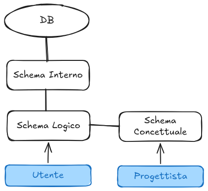
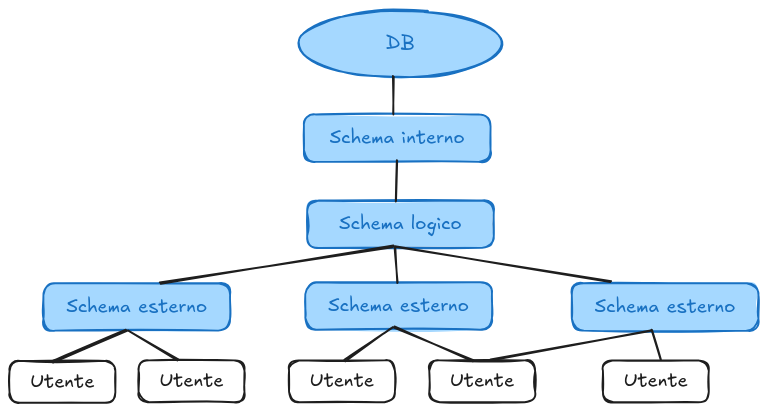
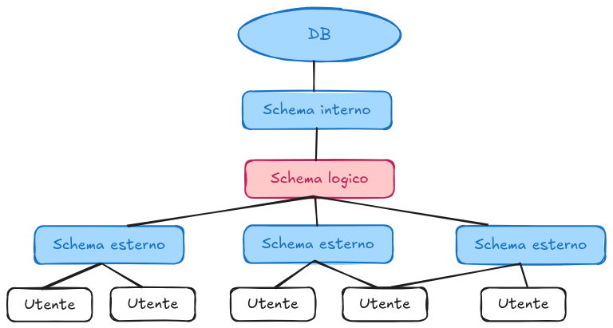
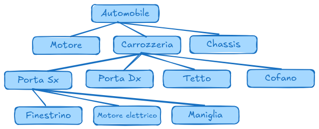

# Basi di dati

## Informazione e dati

**Informazione**: notizia, dato o elemento che consente di avere conoscenza più o meno esatta di fatti, situazioni, modi di essere.

**Dato**: elemento di informazione costituito da simboli che debbono essere elaborati.

Voglio separare i dati dalle applicazioni che operano su essi.

## Database e DBMS

**Database**: collezione di dati, utilizzati per rappresentare le informazioni di interesse per una o più applicazioni di una organizzazione (collezione di dati gestita da un DBMS). Per noi: collezione di dati *persistenti* usata dal sistema di una azienda e gestita da un DBMS.

**DBMS (Database Management System)**: Software in grado di gestire collezioni di dati che siano:  
- *grandi*: di dimensioni (molto) maggiori della memoria centrale
- *persistenti*: con un periodo di vita indipendente dalla singole esecuzioni dei programmi che le utilizzano
- *condivise*: utilizzate da applicazioni diverse

Un DBMS deve garantire:  
- *affidabilità*: resistenza a malfunzionamenti hardware e software
- *privatezza*: con una disciplina e un controllo degli accessi
- *efficienza*: utilizzando al meglio le risorse di spazio e tempo del sistema
- *efficacia*: rendendo produttive le attività dei suoi utilizzatori

**Condivisione**: permette di ridurre la *ridondanza* e l'*incoerenza* (o *inconsistenza*) dei dati. Non è mai completa, i BDMS devono garantire la *privatezza* e delle *limitazioni all'accesso* (*autorizzazioni*). La condivisione richiede coordinamento degli accessi: *controllo della concorrenza*.

**Efficienza**: è misurata in termini di *tempo* di esecuzione e *spazio* di memoria (principale e secondaria) utilizzati. Un DBMS non è necessariamente più efficiente dei file system, ma è più *efficace*. L'efficienza è il risultato della qualità del DBMS e delle applicazioni che lo utilizzano.

I dati sono **INDIPENDENTI** dalla forma fisica.  
I programmi parlano con il DBMS per accedere ai dati.

**Software**:  
- *DBMS*: interposto tra il DB e l'utente
- Utility di supporto (sviluppo, backup)

**Utenti**:  
- Progettista: definisce lo schema del DB
- Sviluppatore: scrive le applicazioni
- Amministratore: gestisce il DB
- Utente finale: accede ai dati

**Schemi**: struttura logica dei dati.

**Dati**:  
- come vengono salvati
- condivisione
- concorrenza
- ridondanza

**Vantaggi**:  

- Dati sono risorsa in comune
- DB fornisce un modello unificato del business
- Controllo centralizzato dei dati, quindi standardizzazione ed economie di scala
- Riduzione ridondanza ed inconsistenza
- **Indipendenza dei dati**

**Svantaggi**:

- Costo e complessità
- Servizi ridondanti/non necessari

**Schema**:  
- invariante nel tempo
- descrive la struttura
- es: intestazione tabelle

**Istanza**:
- valori attuali
- possono cambiare
- es: contenuto tabelle

{ width=100px }

**Schema concettuale**: permette di rappresentare i dati in modo indipendente da ogni sistema:  
- cercando di descrivere i concetti del mondo reale
- sono utilizzati nelle fasi preliminare di progettazione

Modello più diffuso: Entity-Relationship


**Schermi interni** (o fisici): rappresentazione dello schema logico per mezzo di strutture di memorizzazione:
- file CSV
- file XML
- file binari


**Schemi logici**: come è organizzato il DB. Diverse soluzioni:
- gerarchico
- reticolare
- relazionale
- ad oggetti

**Indipendenza**: lo schema logico è INDIPENDENTE da quello fisico.

## Vista

**Vista**: rappresentazione di una parte dello schema concettuale.

L'amministratore del DB può modificare la struttura interna dei dati senza toccarne la visibilità esterna.  
IMMUNITÀ DELLE APPLICAZIONI A MODIFICHE DI STRUTTURA.

---

**> GPT**

Una vista in un database (DB) è un oggetto virtuale che rappresenta una *query salvata*. In altre parole, è una *tabella derivata* i cui dati provengono da una o più tabelle esistenti, ma senza memorizzare fisicamente i dati.
Caratteristiche principali:

- *Virtuale*: Non contiene direttamente i dati ma si aggiorna dinamicamente in base ai dati sottostanti.
- *Basata su una query*: È definita attraverso una SELECT, che può includere filtri, join e aggregazioni.
- *Sicurezza*: Può limitare l'accesso ai dati, mostrando solo determinate colonne o righe agli utenti.
- *Semplificazione*: Permette di semplificare query complesse o migliorare la leggibilità del codice SQL.

```sql
CREATE VIEW view_name AS
SELECT column1, column2, ...
FROM table_name
WHERE condition;
```

---

**Schema esterno = vista**: descrive parte della base di dati di un modello logico. NON è una copia dei dati.

{ width=200px }

{ width=200px }

{ width=200px }

**Schemi logici gerarchici**: problemi:  
- accesso sequenziale: per arrivare al figlio devo attraversare tutti i nodi
- modifica parziale complicata
- cancellazione gerarchica
- stretto legame tra programma e struttura del database
- ridondanza

## DBR

**Schemi logici relazionali**: liberarsi dei puntatori fisici (nei schemi logici reticolari si usano i puntatori per collegare i nodi e avere una navigazione bidirezionale):  
- i dati sono organizzati in **tabelle** di valori
- le operazioni vengono eseguite sulle **tabelle**
- i risultati delle operazioni sono **tabelle**
- i riferimenti tra dati in strutture (tabelle) diverse sono rappresentati con **valori**

**Elementi di un DBR**:  
- **Tabelle**: organizzazione rettangolare di dati  
- **Record** (o righe) e **campi** (o colonne) e domini dei dati
- **Campi**: definiscono univocamente il **tipo** dei dati (dominio)
- I campi anno un **nome** e un **ordine**, le righe no
- Esistono tabelle vuote

**Chiave primaria**:  
- Una (o più) colonne che identificano **UNIVOCAMENTE** il record.
- Non possono essere duplicate.
- Una tabella in cui ogni riga è diversa dalle altre è detta **RELAZIONE**.

**Relazione**:  
- Non esiste padre figlio
- Sono rappresentate da **DATI COMUNI** manipolabili

**Chiave esterne (secondarie, foreign keys)**:  

- Colonne il cui valore corrisponde ad una chiave primaria
- Sono fondamentali nella creazione delle relazioni

---

**> GPT**

Schemi logici relazionali

- I dati sono organizzati in tabelle.
- Le operazioni producono tabelle come risultati.
- I riferimenti tra tabelle avvengono tramite valori, non puntatori fisici.

Elementi di un Database Relazionale (DBR)

- Tabelle: strutture rettangolari di dati.
- Record (righe) e campi (colonne) con domini di valori definiti.
- I campi hanno nome e ordine, le righe no.
- Esistono tabelle vuote.

Chiave primaria

- Una o più colonne che identificano univocamente un record.
- Non possono avere duplicati.
- Se ogni riga è unica, la tabella è una relazione.

Relazioni tra tabelle

- Non esistono gerarchie padre-figlio.
- Le relazioni si basano su dati comuni.

Chiave esterna (foreign key)

- Colonna che fa riferimento a una chiave primaria di un'altra tabella.
- Fondamentale per collegare i dati tra tabelle.

---

## 12 regole di Codd

1. **Informazioni**: Tutte le informazioni in un DBR sono rappresentate esplicitamente da valori in tabelle (DEFINIZIONE).
2. **Accesso garantito**: Ciascun valore deve essere raggiunto univocamente da un nome di tabella, chiave primaria e nome di colonna (CHIAVI PRIMARIE).
3. **Valori NULL**: Sono supportati per rappresentare informazioni mancanti indipendentemente dal tipo di dato.
4. **System table**: Un data base relazionale deve essere strutturato logicamente come i dati e gestibile con lo stesso linguaggio.
5. **Linguaggio di interrogazione standard**: Un DBR può supportare diversi linguaggi, ma deve supportare un linguaggio “English like” dove sia possibile (DEFINIZIONE DI SQL):  
    - Definire dati
    - Definire viste
    - Manipolare dati
    - Gestire l'integrità
6. **Viste modificabili**: Le viste che sono modificabili teoricamente dall'utente lo devono essere anche dal sistema (cruciale per campi calcolati). Affinché una vista sia modificabile, il DBMS deve essere in grado di tracciare ciascuna colonna e ciascuna riga UNIVOCAMENTE fino alle tabelle origine.
7. **Inserimento e update da linguaggio**: Inserire e aggiornare devono avere la stessa logica “a righe” dell'estrazione (SET ORIENTED).
8. **Indipendenza fisica dei dati**: I programmi applicativi non devono sentire alcuna modifica fatta sul metodo e la locazione fisica dei dati.
9. **Indipendenza logica dei dati**: Le modifiche al livello logico non devono richiedere cambiamenti non giustificati alle applicazioni che utilizzano il database (VISTE).
10. **Integrità**: Vincoli di integrità devono essere implementabili sul motore (cruciale).
11. **Indipedenza di localizzazione**: La distribuzione di porzioni del database su una o più allocazione fisiche o geografiche deve essere invisibile agli utenti del sistema.
12. **Deve prevenire accessi non autorizzati**: Garantisce l'impossibilità di bypassare le regole di integrità.

## Relazioni

**DBR riassunto**: Data Base dove tutti i dati visibili all'utente sono organizzati strettamente in tabelle di valori, e dove tutte le operazioni vengono eseguite su tabelle e danno come risultato tabelle.

**Relazione**: Associazione nel modello Entity-Relationship.  
- **Relation**: relazione matematica (teoria degli insiemi)
- **Relationship**: associazione nel modello Entity-Relationship

**Relazione matematica**:  
- $D_1, \dots, D_n$: sono domini  
- prodotto cartesiano $D_1 \times \dots \times D_n$: insieme di tutte le n-uple ordinate $(d_1, \dots, d_n)$ con $d_i \in D_i$.
- un sottoinsieme di $D_1 \times \dots \times D_n$ è una relazione matematica su $D_1, \dots, D_n$.

**Proprietà**:  
- una relazione matematica è un insieme di n-uple ordinate $(d_1, \dots, d_n)$ con $d_i \in D_i$.
- non c'è ordinamento tra le n-uple
- le n-uple sono distinte
- ogni n-upla è ordinata: i-esimo elemento proviene dal dominio i-esimo

**Tabelle e relazioni**: una tabella è una relazione se:  
- i valori di ogni colonna sono omogenei
- le righe sono diverse fra di loro
- le intestazioni delle colonne sono diverse tra di loro
- In una tabella che rappresenta una relazione:
    - l'ordinamento tra le righe è irrilevante
    - l'ordinamento tra le colonne è irrilevante

**Relation**: relazione matematica (teoria degli insiemi)  
**Relationship**: rappresenta una associazione nel modello Entity-Relationship  

**Modello basato su valori**: I riferimento fra dati in relazioni diverse sono rappresentati per mezzo di valori dei domini che compaiono nelle n-uple. Vantaggi:  
- indipendenza dalla struttura fisiche (si potrebbe avere anche con puntatori HL)
- si rappresenta solo ciò che rilevante dal punto di vista dell'applicazione
- utente finale vede stessi dati del programmatore
- portabilità dei dati tra sistemi
- puntatori direzionali

## Informazioni incomplete: NULL

**NULL**: valore speciale che rappresenta l'assenza di un valore. Ogni elemento in una tabella può essere o un valore del dominio oppure il valore nullo NULL.

Il modello relazionale impone una struttura rigida:  
- Le informazioni sono rappresentate per mezzo di n-uple
- Solo alcuni formati di n-upla sono ammessi: quelli che corrispondono agli schemi di relazione
- I dati disponibili possono non corrispondere al formato previsto

**Tipi di NULL**: non vengono distinti dal DBMS, ma possono essere:
- Valore sconosciuto
- Valore inesistente
- Valore non applicabile

**Vincoli di integrità**: Esistono istanze di basi di dati che, pur sintatticamente corrette, non rappresentano informazioni possibili per l'applicazione di interesse. *Proprietà che deve essere soddisfatta dalle istanza che rappresentano informazioni corrette per l'applicazione*. Un *vincolo* è una funzione booleana (un predicato): associa ad ogni istanza il valore vero o falso. Serve a:  
- descrizione più accurata della realtà
- contributo alla “qualità dei dati”
- utili nella progettazione
- usati dai DBMS nelle interrogazioni

**!** Alcuni vincoli (ma non tutti) sono supportati dai DBMS. Possiamo specificare tali vincoli e il DBMS ne impedisce violazione. Se non supportati, la responsabilità della verifica è dell'utente/programmatore.

**Tipi di vincoli**:  
- vincoli intrarelazionali
    - vincoli su valori (o di dominio)  
    es: un campo non può essere NULL, voto tra 0 e 30
    - vincoli di n-upla  
    es: lode solo se voto == 30, data di nascita < data corrente
- vincoli interrelazionali  
es: un dipendente non può essere responsabile di se stesso

**Chiave**: insieme di attributi che identificano le n-uple di una relazione. Formalmente:  
- Un insieme di $K$ attributi è **superchiave** per $r$ se non contiene due n-uple distinte $t_1$ e $t_2$ con $t^K_1 = t^K_2$.
- $K$ è **chiave** per $r$ se è una **superchiave minimale** per $r$
- **superchiave minimale** = non contiene un'altra superchiave

**Esisistenza di chiavi**:  
- Una relazione non può contenere n-uple distinte ma uguali
- Ogni relazione ha come superchiave l'insieme degli attributi su cui è definita
- quindi ha (almeno) una chiave

**Importanza delle chiavi**:  
- l'esistenza delle chiavi garantisce l'accessibilità a ciascun dato della base di dati
- le chiavi permettono di correlare i dati in relazioni diverse
    - il modello relazionale è basato su valoro

